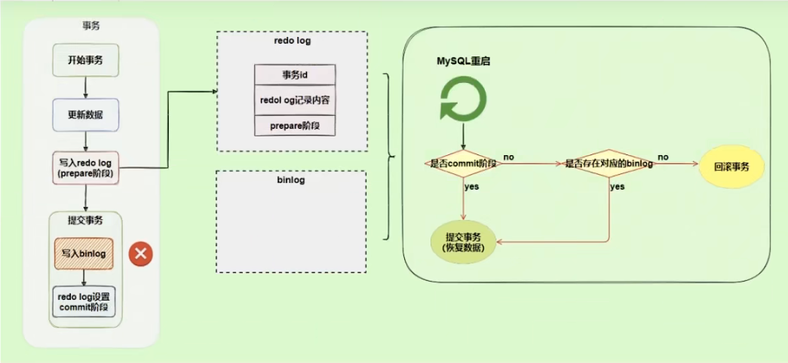
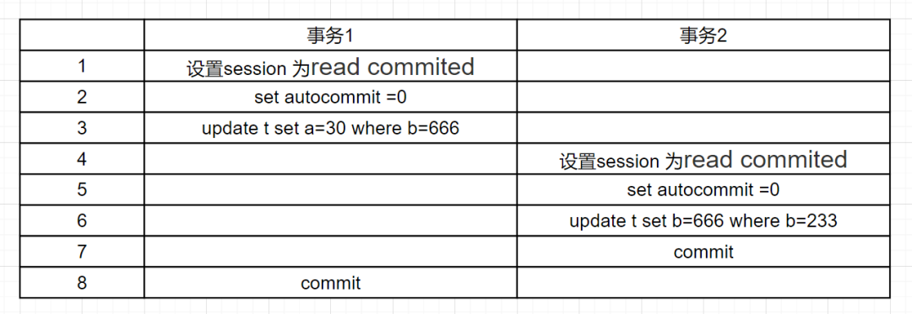

# 第17章_其他数据库日志

我们在讲解数据库事务时，讲过两种日志：重做日志、回滚日志。

对于线上数据库应用系统，突然遭遇`数据库宕机`怎么办？这种情况下，`定位宕机的原因`就非常关键。我们可以查看数据库的`错误日志`.因为日志中记录了数据库运行中的诊断信息，包括了错误、警告和注释等信息。比如：从日志中发现某个连接中的 SQL 发生了死循环，导致内存不足，被系统强行终止了。明确了原因，处理起来也就轻松了，系统很快就恢复了运行。

除了发现错误。日志在数据复制、数据恢复、操作审计、以及确保数据的永久性和一致性等方面，都有着不可代替的作用。

**千万不要小看日志**。很多看似奇怪的问题，答案往往就藏在日志里。很多情况下，只有通过查看日志才能发现问题的原因，真正解决问题。所以，一定要学会查看日志，养成检查日志的习惯，对提升你的数据库应用开发能力至关重要。

## 1.MySQL支持的日志

### 1.1 日志类型

MySQL 有不同类型的日志文件，用来存储不同类型的日志，分为`二进制日志`、`错误日志`、`通用查询日志`和`慢查询日志`，这也是常用的 4 种。MySQL8 又新增两种支持的日志：`中继日志`和`数据定义语句日志`。使用这些日志文件，可以查看 MySQL 内部发生的事情。

**这 6 类日志分别为：**

- **慢查询日志：**记录所有执行时间超过 long_query_time 的所有查询，方便我们对查询进行优化
- **通用查询日志：**记录所有连接的起始时间和终止时间，以及连接发送给数据库服务器的所有指令，对我们复原操作的实际场景、发现问题，甚至是对数据库操作的审计都有很大的帮助
- **错误日志：**记录 MySQL 服务的启动、运行或停止 MySQL 服务时出现的问题，方便我们了解服务器的状态，从而对服务器进行维护
- **二进制日志：**记录所有`更改数据`的语句，可以用于主从服务器之间的数据同步，以及服务器遇到故障时数据的无损失恢复
- **中继日志：**用于主从服务器架构中，`从服务器`用来存放主服务器二进制日志内容的一个中间文件。从服务器通过读取中继日志的内容，来同步主服务器上的操作
- **数据定义语句日志：**记录数据定义语句执行的元数据操作

除二进制日志外，其他日志都是`文本文件`。默认情况下，所有日志创建于`MySQL数据目录`中。

### 1.2 日志的弊端

- 日志功能会`降低MySQL数据库的性能`。例如、在查询非常频繁的 MySQL 数据库系统中，如果开启了通用查询日志和慢查询日志，MySQL 数据库会花费很多时间记录日志
- 日志会`占用大量的磁盘空间`。对于用户量非常大、操作非常频繁的数据库，日志文件需要的存储空间设置比数据库文件需要的存储空间还要大

## 2.慢查询日志(slow query log)

前面章节[第09章_性能分析工具的使用](第09章_性能分析工具的使用.md#慢查询日志)已经详细讲述。

## 3.通用查询日志(general query log)

通用查询日志用来`记录用户的所有操作`，包括启动和关闭 MySQL 服务、所有用户的连接开始时间和截止时间、发给 MySQL 数据库服务器的所有 SQL 指令等。当我们的数据发生异常时，**查看通用查询日志**，**还原操作时的具体场景**，可以帮助我们准确定位问题。

### 3.1 问题场景

在电商系统中，购买商品并且使用微信支付完成以后，却发现支付中心的记录没有新增，此时用户再次使用支付宝支付，就会出现`重复支付`的问题。但是当去数据库中查询数据的时候，会发现只有一条记录存在。那么此时给到的现象就是只有一条支付记录，但是用户却支付了两次。

我们对系统进行了仔细检查，没有发现数据问题，因为用户编号和订单编号以及第三方流水号都是对的。可是用户确实支付了两次，这个时候，我们想到了检查通用查询日志，看看到底发生了什么。

查看之后发现：1 月 1 日下午 2 点，用户使用微信支付完以后，由于网络故障，支付中心没有及时收到微信支付的回调通知，导致当时没有写入数据。1 月 1 日下午 2 点 30，用户又使用支付宝支付，此时记录更新到支付中心。1 月 1 日晚上 9 点，微信的回调通知过来了，但是支付中心已经存在了支付宝的记录，所以只能覆盖记录了。

由于网络的原因导致了重复支付，至于解决问题的方案就很多了，这里省略。

可以看到通用查询日志可以帮助我们了解操作发生的具体时间和操作的细节，对找出异常发生的原因及其关键。

### 3.2 查看当前状态

```sql
mysql> SHOW VARIABLES LIKE '%general%';
+------------------+------------------------------+
| Variable_name    | Value                        |
+------------------+------------------------------+
| general_log      | OFF                          | #通用查询日志处于关闭状态
| general_log_file | /var/lib/mysql/myServer1.log | #通用查询日志文件的名称是myServer1.log
+------------------+------------------------------+
2 rows in set (0.00 sec)
```

说明 1：系统变量 general_log 的值是 OFF，即通用查询日志处于关闭状态。在 MySQL 中，这个参数的`默认值是关闭的`。因为一旦开启记录通用查询日志，MySQL 会记录所有的连接起止和相关的 SQL 操作，这样会消耗系统资源并且占用磁盘空间。我们可以通过手动修改变量的值，在`需要的时候开启日志`。

说明 2：通用查询日志文件的名称是`myServer1.log`。存储路径是 /var/lib/mysql，默认也是数据路径。这样我们就知道在哪里可以查看通用查询日志的内容。

### 3.3 启动日志

**方式1：永久性方式**

修改 my.cnf 或者 my.ini 配置文件来设置。在 [mysqld] 组下加入 log 选项，并重启 MySQL 服务。格式如下：

```bash
[mysqld]
general_log=ON
general_log_file=[path[filename]] #日志文件所在目录路径，filename为日志文件名
```

如果不指定目录和文件名，通用查询日志将默认存储在 MySQL 数据目录中的 hostname.log 文件中，hostname 表示主机名。

**方式2：临时性方式**

```sql
SET GLOBAL general_log=on;  #开启通用查询日志
SET GLOBAL general_log_file='path/filename'; #设置日志文件保存位置
```

对应的，关闭操作SQL命令如下：

```sql
SET GLOBAL general_log=off;  #关闭通用查询日志
```

查看设置后情况：

```sql
SHOW VARIABLES LIKE 'general_log%';
```

### 3.4 查看日志

通用查询日志是以`文本文件`的形式存储在文件系统中的，可以使用`文本编辑器`直接打开日志文件。每台 MySQL 服务器的通用查询日志内容是不同的。

- 在Windows操作系统中，使用文本文件查看器
- 在Linux系统中，可以使用vi工具或者gedit工具查看
- 在Mac OSX系统中，可以使用文本文件查看器或者vi等工具查看

从`SHOW VARIABLES LIKE 'general_log%';`结果中可以看到通用查询日志的位置。

通过通用查询日志，可以了解用户对 MySQL 进行的操作。比如 MySQL 启动信息和用户 root 连接服务器和执行查询表的记录。

```bash
/usr/sbin/mysqld, Version: 8.0.26 (MySQL Community Server - GPL). started with:
Tcp port: 3306 Unix socket: /var/lib/mysql/mysql.sock
Time         Id Command  Argument
2022-01-04T07:44:58.052890Z     10 Query   SHOW VARIABLES LIKE '%general%'
2022-01-04T07:45:15.666672Z     10 Query   SHOW VARIABLES LIKE 'general_log%'
2022-01-04T07:45:28.970765Z     10 Query   select * from student
2022-01-04T07:47:38.706804Z     11 Connect  root@localhost on  using Socket
2022-01-04T07:47:38.707435Z     11 Query   select @@version_comment limit 1
2022-01-04T07:48:21.384886Z     12 Connect  root@172.16.210.1 on  using TCP/IP
2022-01-04T07:48:21.385253Z     12 Query   SET NAMES utf8
2022-01-04T07:48:21.385640Z     12 Query   USE `atguigu12`
2022-01-04T07:48:21.386179Z     12 Query   SHOW FULL TABLES WHERE Table_Type !='VIEW'
2022-01-04T07:48:23.901778Z     13 Connect  root@172.16.210.1 on  using TCP/IP
2022-01-04T07:48:23.902128Z     13 Query   SET NAMES utf8
2022-01-04T07:48:23.905179Z     13 Query   USE `atguigu`
2022-01-04T07:48:23.905825Z     13 Query   SHOW FULL TABLES WHERE Table_Type !='VIEW'
2022-01-04T07:48:32.163833Z     14 Connect  root@172.16.210.1 on  using TCP/IP
2022-01-04T07:48:32.164451Z     14 Query   SET NAMES utf8
2022-01-04T07:48:32.164840Z     14 Query   USE `atguigu`
2022-01-04T07:48:40.006687Z     14 Query   select * from account
```

在通用查询日志里面，我们可以清楚地看到，什么时候开启了新的客户端登陆数据库，登录之后做了什么 SQL 操作，针对的是哪个数据表等信息。

### 3.5 停止日志

**方式1：永久性方式**

修改`my.cnf`或者`my.ini`文件，把 [mysqld] 组下的`general_log`值设置为`OFF`或者把 general_log 一项注释掉。修改保存后，再`重启MySQL服务`，即可生效。

举例1：

```bash
[mysqld]
general_log=OFF
```

举例2：

```bash
[mysqld]
#general_log=ON
```

**方式2：临时性方式**

使用 SET 语句停止 MySQL 通用查询日志功能：

```sql
SET GLOBAL general_log=off;
```

查询通用日志功能：

```bash
SHOW VARIABLES LIKE 'general_log%';
```

### 3.6 删除\刷新日志

如果数据的使用非常频繁，那么通用查询日志会占用服务器非常大的磁盘空间。数据管理员可以删除很长时间之前的查询日志，以保证 MySQL 服务器上的硬盘空间。

**手动删除文件**

```sql
SHOW VARIABLES LIKE 'general_log%';
```

可以看出，通用查询日志的目录默认为 MySQL 数据目录。在该目录下手动删除通用查询日志 myServer1.log。

使用如下命令重新生成查询日志文件，具体命令如下。

```sql
mysqladmin -uroot -p flush-logs
```

刷新 MySQL 数据目录，发现创建了新的日志文件。前提一定要开启通用日志。

如果希望备份旧的通用查询日志，就必须先将旧的日志文件复制出来或者改名，然后执行上面的 mysqladmin 命令：

```sql
cd mysql-data-directory #输入自己的通用文件所在目录
mv mysql.general.log mysql.general.log.old #重命名文件
mysqladmin -uroot -p flush-logs
```

## 4.错误日志(error log)

错误日志记录了 MySQL 服务器启动、停止运行的时间，以及系统启动、运行和停止过程中的诊断信息，包括`错误`、`警告`和`提示`等。

通过错误日志可以查看系统的运行状态，便于及时发现故障、修复故障。如果 MySQL 服务`出现异常`，错误日志是发现问题、解决故障的`首选`。

### 4.1 启动日志

在MySQL数据库中，错误日志功能是`默认开启`的。而且，错误日志`无法被禁止`。

默认情况下，错误日志存储在 MySQL 数据库的数据文件夹下，名称默认为`mysqld.log`（Linux系统）或`hostname.err`（mac系统）。如果需要制定文件名，则需要在 my.cnf 或者 my.ini 中做如下配置：

```bash
[mysqld]
log-error=[path/[filename]] #path为日志文件所在的目录路径，filename为日志文件名
```

修改配置项后，需要重启 MySQL 服务以生效。

### 4.2 查看日志

MySQL 错误日志是以文本文件形式存储的，可以使用文本编辑器直接查看。

查询错误日志的存储路径：

```sql
mysql> SHOW VARIABLES LIKE 'log_err%';
+----------------------------+----------------------------------------+
| Variable_name              | Value                                  |
+----------------------------+----------------------------------------+
| log_error                  | /var/log/mysqld.log                    |
| log_error_services         | log_filter_internal; log_sink_internal |
| log_error_suppression_list |                                        |
| log_error_verbosity        | 2                                      |
+----------------------------+----------------------------------------+
4 rows in set (0.00 sec)
```

执行结果中可以看到错误日志文件是 mysqld.log，位于 MySQL  默认的数据目录下。

下面我们查看一下错误日志的内容

```bash
2022-02-10T15:14:40.277671Z 0 [System] [MY-013169] [Server] /usr/sbin/mysqld (mysqld 8.0.27) initializing of server in progress as process 2212
2022-02-10T15:14:40.296323Z 1 [System] [MY-013576] [InnoDB] InnoDB initialization has started.
2022-02-10T15:14:40.920245Z 1 [System] [MY-013577] [InnoDB] InnoDB initialization has ended.
2022-02-10T15:14:42.725354Z 0 [Warning] [MY-013746] [Server] A deprecated TLS version TLSv1 is enabled for channel mysql_main
2022-02-10T15:14:42.725381Z 0 [Warning] [MY-013746] [Server] A deprecated TLS version TLSv1.1 is enabled for channel mysql_main
2022-02-10T15:14:43.203004Z 6 [Note] [MY-010454] [Server] A temporary password is generated for root@localhost: lueZHk3U<&/t
2022-02-10T15:15:17.811787Z 0 [System] [MY-010116] [Server] /usr/sbin/mysqld (mysqld 8.0.27) starting as process 2318
```

可以看到，错误日志文件中记录了服务启动的时间，以及存储引擎 InnoDB 启动和停止时间等。我们在做初始化时生成的数据库初始密码也是记录在 log.error 中。

### 4.3 删除\刷新日志

对于很久以前的错误日志，数据库管理员查看这些错误日志的可能性不大，可以将这些错误日志删除，以保证 MySQL 服务器上的`硬盘空间`。MySQL 的错误日志是以文本文件的形式存储在文件系统中的，可以`直接删除`也可以备份。

```bash
rm -f /var/log/mysql/mysqld.log
#or
mv /var/log/mysqld.log /var/log/mysql.log.old
```

在运行状态下删除错误日志文件后，MySQL 并不会自动创建日志文件。

再进行重建日志操作可能会报错：

```sql
[root@atguigu01 log]# mysqladmin -uroot -p flush-logs
Enter password:
mysqladmin: refresh failed; error: 'Could not open file '/var/log/mysqld.log' for error logging.'
```

官网提示：


补充操作：

```sql
install -omysql -gmysql -m0644 /dev/null /var/log/mysqld.log
```

`flush-logs`指定操作：

- MySQL 5.5.7 以前的版本，flush-logs 将错误日志文件重命名为 filename.err_old，并创建新的日志文件
- 从 5.5.7 开始，flush-logs 只是重新打开日志文件，并不做日志备份和创建的操作
  - 对于`binlog`，如果启用了二进制日志记录，则二进制日志文件的序列号相对于前一个文件增加 1

### 4.4 MySQL8.0新特性

MySQL8.0 里对错误日志的改进。MySQL8.0 的错误日志可以理解为一个全新的日志，在这个版本里，接受了来自社区的广泛批评意见，在这些意见和建议的基础上生成了新的日志。

下面这些是来自社区的意见：

- 默认情况下内容过于冗长
- 遗漏了有用的信息
- 难以过滤某些信息
- 没有标识错误信息的子系统源
- 没有错误代码，解析消息需要识别错误引导消息可能会丢失
- 固定格式

针对这些意见，MySQL做了如下改变:

- 采用组件架构，通过不同的组件执行日志的写入和过滤功能
- 写入错误日志的全部信息都具有唯一的错误代码从10000开始
- 增加了一个新的消息分类《system》用于在错误日志中始终可见的非错误但服务器状态更改事件的消息
- 增加了额外的附加信息，例如关机时的版本信息，谁发起的关机等等
- 两种过滤方式，Internal和Dragnet
- 三种写入形式，经典、JSON和syseventlog

> 小结：
>
> 通常情况下，管理员不需要查看错误日志。但是，MySQL 服务器发生异常时，管理员可以从错误日志中找到发生异常的时间、原因，然后根据这些信息来解决异常。

## 5.二进制日志(bin log)

binlog 可以说是 MySQL 中比较`重要`的日志了，在日常开发及运维过程中，经常会遇到。

binlog 即 binary log，二进制日志文件，也叫作变更日志（update log）。它记录了数据库所有执行的 DDL 和 DML 等数据库更新事件的语句，但是不包含没有修改任何数据的语句（如数据查询语句 select、show 等）。

它以`事件形式`记录并保存在`二进制文件`中。通过这些信息，我们可以再现数据更新操作的全过程。

> 如果想要记录所有语句（例如，为了识别有问题的场景），需要使用通用查询日志。

binlog主要应用场景：

- 一是用于`数据恢复`，如果 MySQL 数据库意外停止，可以通过二进制日志文件来查看用户执行了哪些操作，对数据库服务器文件做了哪些修改，然后根据二进制日志文件中的记录来恢复数据库服务器
- 二是用于`数据复制`，由于日志的延续性和时效性，master 把它的二进制日志传递给 slaves 来达到 master-slave 数据一致的目的

可以说 MysQL 数据库的**数据备份**、**主备**、**主主**、**主从**都离不开 binlog，需要依靠 binlog 来同步数据，保证数据一致性。


### 5.1 查看默认情况

查看记录二进制日志是否开启：在 MySQL8 中默认情况下，二进制文件是开启的。

```sql
mysql> show variables like '%log_bin%';
+---------------------------------+-----------------------------+
| Variable_name                   | Value                       |
+---------------------------------+-----------------------------+
| log_bin                         | ON                          |
| log_bin_basename                | /var/lib/mysql/binlog       |
| log_bin_index                   | /var/lib/mysql/binlog.index |
| log_bin_trust_function_creators | OFF                         |
| log_bin_use_v1_row_events       | OFF                         |
| sql_log_bin                     | ON                          |
+---------------------------------+-----------------------------+
6 rows in set (0.01 sec)
```

`log_bin_basename`：是 binlog 日志的基本文件名，后面会追加标识来表示每一个文件

`log_bin_index`：是 binlog 文件的索引文件，这个文件管理了所有的 binlog 文件的目录

`log_bin_trust_function_creators`：限制存储过程，前面我们已经讲过了，这是因为二进制日志的一个重要功能是用于主从复制，而存储函数有可能导致主从的数据不一致。所以当开启二进制日志后，需要限制存储函数的创建、修改、调用（比如函数 now() 在主机和从机可能会不一样）

`log_bin_use_v1_row_events`：此只读系统变量已弃用。ON 表示使用版本 1 二进制日志行，OFF 表示使用版本 2 二进制日志行（MySQL 5.6 的默认值为 2）。

### 5.2 日志参数设置

**方式1：永久性方式**

修改 MySQL 的 my.cnf 或 my.ini 文件可以设置二进制日志的相关参数：

```bash
[mysqld]
#启用二进制日志
log-bin=youyi-bin
binlog_expire_logs_seconds=600
max_binlog_size=100M
```

> 提示：
>
> - log-bin=mysql-bin #打开日志（主机需要打开），这个 mysql-bin 也可以自定义，这里也可以加上路径，如：/home/www/mysql_bin_log/mysql-bin
> - binlog_expire_logs_seconds：此参数控制二进制日志文件保留的时长，单位是`秒`，默认2592000 30天
>   - 14400 4小时；86400 1天；259200 3天；
> - max_binlog_size：控制单个二进制日志大小，当前日志文件大小超过此变量时，执行切换动作。此参数的`最大和默认值是1GB`，该设置并`不能严格控制Binlog的大小`，尤其是 Binlog 比较靠近最大值而又遇到一个比较大事务时，为了保证事务的完整性，可能不做切换日志的动作，只能将该事务的所有 SQL 都记录进当前日志，直到事务结束。一般情况下可采取默认值

重新启动 MySQL 服务，查询二进制日志的信息，执行结果：

```sql
mysql> show variables like '%log_bin%';
+---------------------------------+--------------------------------+
| Variable_name                   | Value                          |
+---------------------------------+--------------------------------+
| log_bin                         | ON                             |
| log_bin_basename                | /var/lib/mysql/youyi-bin       |
| log_bin_index                   | /var/lib/mysql/youyi-bin.index |
| log_bin_trust_function_creators | OFF                            |
| log_bin_use_v1_row_events       | OFF                            |
| sql_log_bin                     | ON                             |
+---------------------------------+--------------------------------+
6 rows in set (0.01 sec)
```

**设置带文件夹的 bin-log 日志存放目录**

如果想改变日志文件的目录和名称，可以对 my.cnf 或 my.ini 中的 log_bin 参数修改如下：

```bash
[mysqld]
log-bin="/var/lib/mysql/binlog/youyi-bin"
```

注意：新建的文件夹需要使用 mysql 用户，使用下面的命令即可。

```bash
chown -R -v mysql:mysql binlog
```

重启 MySQL 服务之后，新的二进制日志文件将出现在 /var/lib/mysql/binlog/ 文件夹下面：

```sql
mysql> show variables like '%log_bin%';
+---------------------------------+----------------------------------+
| Variable_name                   | Value                            |
+---------------------------------+----------------------------------+
| log_bin                         | ON                               |
| log_bin_basename                | /var/lib/mysql/youyi-bin       |
| log_bin_index                   | /var/lib/mysql/youyi-bin.index |
| log_bin_trust_function_creators | OFF                              |
| log_bin_use_v1_row_events       | OFF                              |
| sql_log_bin                     | ON                               |
+---------------------------------+----------------------------------+
6 rows in set (0.01 sec)
```

```sql
[root@myServer1 ~]# ls
youyi-bin.000001 youyi-bin.index
[root@myServer1 ~]# pwd
/var/lib/mysql/binlog
```

> 提示：
>
> `数据库文件最好不要与日志文件放在同一个磁盘上！`这样，当数据库文件所在的磁盘发生故障时，可以使用日志文件恢复数据。（不要将鸡蛋放在一个篮子里面）

**方式2：临时性方式**

如果不希望通过修改配置文件并重启的方式设置二进制日志的话，还可以使用如下指令，需要注意的是在 mysql8 中只有`会话级别`的设置，没有了 global 级别的设置。（下面演示的是关闭 binlog 日志）

```sql
#global 级别
mysql> set global sql_log_bin=0;
ERROR 1228 (HY000): Variable 'sql_log_bin' is a SESSION variable and can`t be used with SET GLOBAL

#session级别
mysql> SET sql_log_bin=0;
Query OK, 0 rows affected (0.01 秒)
```

### 5.3 查看日志

当 MySQL 创建二进制日志文件时，先创建一个以`filename`为名称、以`.index`为后缀的文件，再创建一个以`filename`为名称、以`.000001`为后缀的文件。

MySQL 服务`重新启动一次`，以`.000001`为后缀的文件就会增加一个，并且后缀名按 1 递增。即日志文件的个数与 MySQL 服务启动的次数相同；如果日志长度超过了`max_binlog_size`的上限（默认是 1GB），就会创建一个新的日志文件。

查看当前的二进制日志文件列表及大小。指令如下：

```sql
mysql> SHOW BINARY LOGS;
+--------------------+-----------+-----------+
| Log_name           | File_size | Encrypted |
+--------------------+-----------+-----------+
| youyi-bin.000001 |       783 | No        |
+--------------------+-----------+-----------+
1 row in set (0.00 sec)
```

所有对数据库的修改都会记录在 binlog 中。但是 binlog 是二进制文件，无法直接查看，想要更直观的检查该文件就要借助`mysqlbinlog`命令工具了。指令如下：再查看执行，先执行一条 SQL 语句，如下：

```sql
UPDATE student SET name='张三_back' WHERE id=1;
```

开始查看 binlog：

```bash
[root@myServer1 ~]# mysqlbinlog "/var/lib/mysql/binlog/binlog.000002"
# The proper term is pseudo_replica_mode, but we use this compatibility alias
# to make the statement usable on server versions 8.0.24 and older.
/*!50530 SET @@SESSION.PSEUDO_SLAVE_MODE=1*/;
/*!50003 SET @OLD_COMPLETION_TYPE=@@COMPLETION_TYPE,COMPLETION_TYPE=0*/;
DELIMITER /*!*/;
# at 4
#220425 15:58:04 server id 1  end_log_pos 125 CRC32 0xdc7759ab 	Start: binlog v 4, server v 8.0.27 created 220425 15:58:04 at startup
# Warning: this binlog is either in use or was not closed properly.
ROLLBACK/*!*/;
BINLOG '
fEZmYg8BAAAAeQAAAH0AAAABAAQAOC4wLjI3AAAAAAAAAAAAAAAAAAAAAAAAAAAAAAAAAAAAAAAA
AAAAAAAAAAAAAAAAAAB8RmZiEwANAAgAAAAABAAEAAAAYQAEGggAAAAICAgCAAAACgoKKioAEjQA
CigBq1l33A==
'/*!*/;
# at 125
#220425 15:58:04 server id 1  end_log_pos 156 CRC32 0xf1af90f0 	Previous-GTIDs
# [empty]
# at 156
#220425 19:22:53 server id 1  end_log_pos 235 CRC32 0x1b85284d 	Anonymous_GTID	last_committed=0	sequence_number=1	rbr_only=yes	original_committed_timestamp=1650882173600656	immediate_commit_timestamp=1650882173600656	transaction_length=349
/*!50718 SET TRANSACTION ISOLATION LEVEL READ COMMITTED*//*!*/;
# original_commit_timestamp=1650882173600656 (2022-04-25 19:22:53.600656 JST)
# immediate_commit_timestamp=1650882173600656 (2022-04-25 19:22:53.600656 JST)
/*!80001 SET @@session.original_commit_timestamp=1650882173600656*//*!*/;
/*!80014 SET @@session.original_server_version=80027*//*!*/;
/*!80014 SET @@session.immediate_server_version=80027*//*!*/;
SET @@SESSION.GTID_NEXT= 'ANONYMOUS'/*!*/;
# at 235
#220425 19:22:53 server id 1  end_log_pos 326 CRC32 0x79e50108 	Query	thread_id=8	exec_time=0	error_code=0
SET TIMESTAMP=1650882173/*!*/;
SET @@session.pseudo_thread_id=8/*!*/;
SET @@session.foreign_key_checks=1, @@session.sql_auto_is_null=0, @@session.unique_checks=1, @@session.autocommit=1/*!*/;
SET @@session.sql_mode=1168113696/*!*/;
SET @@session.auto_increment_increment=1, @@session.auto_increment_offset=1/*!*/;
/*!\C utf8mb4 *//*!*/;
SET @@session.character_set_client=255,@@session.collation_connection=255,@@session.collation_server=255/*!*/;
SET @@session.lc_time_names=0/*!*/;
SET @@session.collation_database=DEFAULT/*!*/;
/*!80011 SET @@session.default_collation_for_utf8mb4=255*//*!*/;
BEGIN
/*!*/;
# at 326
#220425 19:22:53 server id 1  end_log_pos 395 CRC32 0x0c9034ba 	Table_map: `myDatabase2`.`student` mapped to number 97
# at 395
#220425 19:22:53 server id 1  end_log_pos 474 CRC32 0x0cee44ac 	Update_rows: table id 97 flags: STMT_END_F

BINLOG '
fXZmYhMBAAAARQAAAIsBAAAAAGEAAAAAAAEAC215RGF0YWJhc2UyAAdzdHVkZW50AAMDDw8EVAAe
AAYBAQACASG6NJAM
fXZmYh8BAAAATwAAANoBAAAAAGEAAAAAAAEAAgAD//8AAQAAAAZ6aGFuZzMG5LiA54+tAAEAAAAL
5byg5LiJX2JhY2sG5LiA54+trETuDA==
'/*!*/;
# at 474
#220425 19:22:53 server id 1  end_log_pos 505 CRC32 0x054d8007 	Xid = 32
COMMIT/*!*/;
SET @@SESSION.GTID_NEXT= 'AUTOMATIC' /* added by mysqlbinlog */ /*!*/;
DELIMITER ;
# End of log file
/*!50003 SET COMPLETION_TYPE=@OLD_COMPLETION_TYPE*/;
/*!50530 SET @@SESSION.PSEUDO_SLAVE_MODE=0*/;
```

执行结果可以看到，这是一个简单的日志文件，日志中记录了用户的一些操作，这里并没有出现具体的 SQL 语句，这是因为 binlog 关键字后面的内容是经过编码后的`二进制日志`。

这里一个 update 语句包含如下事件

- Query 事件负责开始一个事务(BEGIN)
- Table_map 事件负责映射需要的表
- Update_rows 事件负责写入数据
- Xid 事件负责结束事务

下面命令将行事件以`伪SQL的形式`表现出来

```bash
[root@myServer1 ~]# mysqlbinlog -v "/var/lib/mysql/binlog/binlog.000002"
# The proper term is pseudo_replica_mode, but we use this compatibility alias
# to make the statement usable on server versions 8.0.24 and older.
/*!50530 SET @@SESSION.PSEUDO_SLAVE_MODE=1*/;
/*!50003 SET @OLD_COMPLETION_TYPE=@@COMPLETION_TYPE,COMPLETION_TYPE=0*/;
DELIMITER /*!*/;
# at 4
#220425 15:58:04 server id 1  end_log_pos 125 CRC32 0xdc7759ab 	Start: binlog v 4, server v 8.0.27 created 220425 15:58:04 at startup
# Warning: this binlog is either in use or was not closed properly.
ROLLBACK/*!*/;
BINLOG '
fEZmYg8BAAAAeQAAAH0AAAABAAQAOC4wLjI3AAAAAAAAAAAAAAAAAAAAAAAAAAAAAAAAAAAAAAAA
AAAAAAAAAAAAAAAAAAB8RmZiEwANAAgAAAAABAAEAAAAYQAEGggAAAAICAgCAAAACgoKKioAEjQA
CigBq1l33A==
'/*!*/;
# at 125
#220425 15:58:04 server id 1  end_log_pos 156 CRC32 0xf1af90f0 	Previous-GTIDs
# [empty]
# at 156
#220425 19:22:53 server id 1  end_log_pos 235 CRC32 0x1b85284d 	Anonymous_GTID	last_committed=0	sequence_number=1	rbr_only=yes	original_committed_timestamp=1650882173600656	immediate_commit_timestamp=1650882173600656	transaction_length=349
/*!50718 SET TRANSACTION ISOLATION LEVEL READ COMMITTED*//*!*/;
# original_commit_timestamp=1650882173600656 (2022-04-25 19:22:53.600656 JST)
# immediate_commit_timestamp=1650882173600656 (2022-04-25 19:22:53.600656 JST)
/*!80001 SET @@session.original_commit_timestamp=1650882173600656*//*!*/;
/*!80014 SET @@session.original_server_version=80027*//*!*/;
/*!80014 SET @@session.immediate_server_version=80027*//*!*/;
SET @@SESSION.GTID_NEXT= 'ANONYMOUS'/*!*/;
# at 235
#220425 19:22:53 server id 1  end_log_pos 326 CRC32 0x79e50108 	Query	thread_id=8	exec_time=0	error_code=0
SET TIMESTAMP=1650882173/*!*/;
SET @@session.pseudo_thread_id=8/*!*/;
SET @@session.foreign_key_checks=1, @@session.sql_auto_is_null=0, @@session.unique_checks=1, @@session.autocommit=1/*!*/;
SET @@session.sql_mode=1168113696/*!*/;
SET @@session.auto_increment_increment=1, @@session.auto_increment_offset=1/*!*/;
/*!\C utf8mb4 *//*!*/;
SET @@session.character_set_client=255,@@session.collation_connection=255,@@session.collation_server=255/*!*/;
SET @@session.lc_time_names=0/*!*/;
SET @@session.collation_database=DEFAULT/*!*/;
/*!80011 SET @@session.default_collation_for_utf8mb4=255*//*!*/;
BEGIN
/*!*/;
# at 326
#220425 19:22:53 server id 1  end_log_pos 395 CRC32 0x0c9034ba 	Table_map: `myDatabase2`.`student` mapped to number 97
# at 395
#220425 19:22:53 server id 1  end_log_pos 474 CRC32 0x0cee44ac 	Update_rows: table id 97 flags: STMT_END_F

BINLOG '
fXZmYhMBAAAARQAAAIsBAAAAAGEAAAAAAAEAC215RGF0YWJhc2UyAAdzdHVkZW50AAMDDw8EVAAe
AAYBAQACASG6NJAM
fXZmYh8BAAAATwAAANoBAAAAAGEAAAAAAAEAAgAD//8AAQAAAAZ6aGFuZzMG5LiA54+tAAEAAAAL
5byg5LiJX2JhY2sG5LiA54+trETuDA==
'/*!*/;
### UPDATE `myDatabase2`.`student`
### WHERE
###   @1=1
###   @2='zhang3'
###   @3='一班'
### SET
###   @1=1
###   @2='张三_back'
###   @3='一班'
# at 474
#220425 19:22:53 server id 1  end_log_pos 505 CRC32 0x054d8007 	Xid = 32
COMMIT/*!*/;
SET @@SESSION.GTID_NEXT= 'AUTOMATIC' /* added by mysqlbinlog */ /*!*/;
DELIMITER ;
# End of log file
/*!50003 SET COMPLETION_TYPE=@OLD_COMPLETION_TYPE*/;
/*!50530 SET @@SESSION.PSEUDO_SLAVE_MODE=0*/;
```

前面的命令同时显示 binlog 格式的语句，使用如下命令不显示它：

```bash
mysqlbinlog -v --base64-output=DECODE-ROWS "/var/lib/mysql/binlog/binlog.000002"
```

关于 mysqlbinlog 工具的使用技巧还有很多，例如只解析对某个库的操作或者某个时间段内的操作等。简单分享几个常用的语句，更多操作可以参考官方文档。

```bash
#可查看参数帮助
mysqlbinlog --no-defaults --help

#查看最后100行
mysqlbinlog --no-defaults --base64-output=decode-rows -vv atguigu-bin.000002 |tail -100

#根据position查找
mysqlbinlog --no-defaults --base64-output=decode-rows -vv atguigu-bin.000002 |grep -A 20 '4939002'
```

上面这种办法读取出 binlog 日志的全文内容比较多，不容易分辨查看到 pos 点信息，下面介绍一种更为方便的查询命令：

```mysql
show binlog events [IN 'log_name'] [FROM pos] [LIMIT [offset,] row_count];
```

- `IN 'log_name'`：指定要查询的 binlog 文件名（不指定就是第一个 binlog 文件）
- `FROM pos`：指定从哪个 pos 起始点开始查起（不指定就是从整个文件首个 pos 点开始算）
- `LIMIT [offset]`：偏移量（不指定就是 0）
- `row_count`：查询总条数（不指定就是所有行）

```sql
mysql> SHOW BINLOG EVENTS IN 'binlog.000020';
+---------------+-----+----------------+-----------+-------------+--------------------------------------+
| Log_name      | Pos | Event_type     | Server_id | End_log_pos | Info                                 |
+---------------+-----+----------------+-----------+-------------+--------------------------------------+
| binlog.000020 |   4 | Format_desc    |         1 |         125 | Server ver: 8.0.27, Binlog ver: 4    |
| binlog.000020 | 125 | Previous_gtids |         1 |         156 |                                      |
| binlog.000020 | 156 | Anonymous_Gtid |         1 |         235 | SET @@SESSION.GTID_NEXT= 'ANONYMOUS' |
| binlog.000020 | 235 | Query          |         1 |         326 | BEGIN                                |
| binlog.000020 | 326 | Table_map      |         1 |         395 | table_id: 97 (myDatabase2.student)   |
| binlog.000020 | 395 | Update_rows    |         1 |         474 | table_id: 97 flags: STMT_END_F       |
| binlog.000020 | 474 | Xid            |         1 |         505 | COMMIT /* xid=32 */                  |
+---------------+-----+----------------+-----------+-------------+--------------------------------------+
7 rows in set (0.00 sec)
```

上面这条语句可以将指定的 binlog 日志文件，分成有效事件行的方式返回，并可使用 limit 指定 post 点的起始偏移，查询条数。其他举例：

```sql
#查询第一个最早的 binlog 日志
SHOW BINLOG EVENTS;

#指定查询 mysql-bin.000002 这个文件
SHOW BINLOG EVENTS IN 'mysql-bin.000002';

#指定查询 mysql-bin.000002 这个文件，从pos点:8224开始查起
SHOW BINLOG EVENTS IN 'mysql-bin.000002' FROM 8224;

#指定查询 mysql-bin.000002 这个文件，从pos点:8224开始查起，查询10条
SHOW BINLOG EVENTS IN 'mysql-bin.000002' FROM 8224 LIMIT 10;

#指定查询 mysql-bin.000002 这个文件，从pos点:8224开始查起，偏移2行（即跳过2行），查询10条
SHOW BINLOG EVENTS IN 'mysql-bin.000002' FROM 8224 LIMIT 2,10;
```

上面我们讲了这么多都是基于 binlog 的默认格式，binlog 格式查看

```sql
mysql> SHOW VARIABLES LIKE 'binlog_format'; 
+---------------+-------+
| Variable_name | Value |
+---------------+-------+
| binlog_format | ROW   |
+---------------+-------+
1 row in set (0.00 sec)
```

除此之外，binlog 还有 2 种格式，分别是`Statement`和`Mixed`

- **Statement**

  每一条会修改数据的 sql 都会记录在 binlog 中。

  优点：不需要记录每一行的变化，减少了 binlog 日志量，节约了 IO，提高性能。

- **Row**

  5.1.5 版本的 MySQL 才开始支持 row level 的复制，它不记录 sql 语句上下文相关信息，仅保存哪条记录被修改。

  优点：row level 的日志内容会非常清楚的记录下每一行数据修改的细节。而且不会出现某些特定情况下的存储过程，或 function，以及 trigger 的调用和触发无法被正确复制的问题。

- **Mixed**

  从 5.1.8 版本开始，MySQL 提供了 Mixed 格式，实际上就是 Statement 与 Row 的结合。

  详细情况，下章讲解。

### <a id="使用日志恢复数据" style="color:#273849">5.4 使用日志恢复数据</a>

如果 MySQL 服务器启用了二进制日志，在数据库出现意外丢失数据时，可以使用 MySQLbinlog 工具从指定的时间点开始（例如，最后一次备份）直到现在，或另一个指定的时间点的日志中恢复数据。

mysqlbinlog 恢复数据的语法如下：

```bash
mysqlbinlog [option] filename|mysql –u user -p pass;
```

这个命令可以这样理解：使用 mysqlbinlog 命令来读取 filename 中的内容，然后使用 mysql 命令将这些内容恢复到数据库中。

- `filename`：是日志文件名
- `option`：可选项，比较重要的两对 option 参数是 --start-date、--stop-date 和 --start-position、--stop-position
  - `--start-date和--stop-date`：可以指定恢复数据库的起始时间点和结束时间点
  - `--start-position和--stop-position`：可以指定恢复数据的开始位置和结束位置

> 注意：
> 使用 mysqlbinlog 命令进行恢复操作时，必须是编号小的先恢复，例如 binlog.000001 必须在 binlog-bin.000002 之前恢复。

**案例：**

现在对 student 表有以下操作：

```sql
#查询数据
SELECT * FROM student;
#插入一批数据
INSERT INTO student VALUES(22, 'zhang3', "1ban");
INSERT INTO student VALUES(23, 'zhang4', "1ban");
INSERT INTO student VALUES(24, 'zhang5', "2ban");
#查询数据
SELECT * FROM student;
#更新数据
UPDATE student SET name = 'zhang3_back' where id = 22;
#查询数据
SELECT * FROM student;
#删除数据
DELETE FROM student WHERE id = 23;
#查询数据
SELECT * FROM student;
```

上面是对 student 表做的插入、更新和删除操作。现在不小心删除了所有新增的数据：

```sql
DELETE FROM student where id > 20;
```

现在目标就是恢复后面的新增、更新和删除的数据。当前表中数据如下：

```sql
mysql> select * from student;
+----+-------------+--------+
| id | name        | class  |
+----+-------------+--------+
|  1 | 张三_back   | 一班   |
|  2 | test        | test   |
|  3 | li4         | 一班   |
|  8 | wang5       | 二班   |
| 15 | zhao6       | 二班   |
+----+-------------+--------+
5 rows in set (0.00 sec)
```

接下来首先查看 binlog，如下所示：

```sql
mysql> SHOW BINARY LOGS;
+---------------+-----------+-----------+
| Log_name      | File_size | Encrypted |
+---------------+-----------+-----------+
| binlog.000016 |       179 | No        |
| binlog.000017 |      3596 | No        |
| binlog.000018 |      2410 | No        |
| binlog.000019 |       179 | No        |
| binlog.000020 |      2102 | No        |
+---------------+-----------+-----------+
5 rows in set (0.00 sec)
```

上面所有操作都保存在 binlog.000020 日志中，如果工作中可以先备份下这个文件，接着执行 flush logs 刷新日志，重新创建了一个 binlog 日志 binlog.000021：

```sql
mysql> FLUSH LOGS;
Query OK, 0 rows affected (0.01 sec)

mysql> SHOW BINARY LOGS;
+---------------+-----------+-----------+
| Log_name      | File_size | Encrypted |
+---------------+-----------+-----------+
| binlog.000016 |       179 | No        |
| binlog.000017 |      3596 | No        |
| binlog.000018 |      2410 | No        |
| binlog.000019 |       179 | No        |
| binlog.000020 |      2146 | No        |
| binlog.000021 |       156 | No        |
+---------------+-----------+-----------+
6 rows in set (0.00 sec)
```

重新创建一个日志的目的是，接下来所有的操作数据都会写入日志 binlog.000021 中，日志 20 中不会再写入任何数据（方便根据日志 20 的内容恢复数据，因为日志 20 的数据是备份之后到删库之前的所有操作日志，重建日志 21 不会有过多的数据影响回复）

登录 mysql 查看日志 21，结果如下：

```sql
mysql> SHOW BINLOG EVENTS IN 'binlog.000020';
+---------------+------+----------------+-----------+-------------+--------------------------------------+
| Log_name      | Pos  | Event_type     | Server_id | End_log_pos | Info                                 |
+---------------+------+----------------+-----------+-------------+--------------------------------------+
| binlog.000020 |    4 | Format_desc    |         1 |         125 | Server ver: 8.0.27, Binlog ver: 4    |
| binlog.000020 |  125 | Previous_gtids |         1 |         156 |                                      |
| binlog.000020 |  156 | Anonymous_Gtid |         1 |         235 | SET @@SESSION.GTID_NEXT= 'ANONYMOUS' |
| binlog.000020 |  235 | Query          |         1 |         326 | BEGIN                                |
| binlog.000020 |  326 | Table_map      |         1 |         395 | table_id: 97 (myDatabase2.student)   |
| binlog.000020 |  395 | Update_rows    |         1 |         474 | table_id: 97 flags: STMT_END_F       |
| binlog.000020 |  474 | Xid            |         1 |         505 | COMMIT /* xid=32 */                  |
| binlog.000020 |  505 | Anonymous_Gtid |         1 |         584 | SET @@SESSION.GTID_NEXT= 'ANONYMOUS' |
| binlog.000020 |  584 | Query          |         1 |         666 | BEGIN                                |
| binlog.000020 |  666 | Table_map      |         1 |         735 | table_id: 97 (myDatabase2.student)   |
| binlog.000020 |  735 | Write_rows     |         1 |         787 | table_id: 97 flags: STMT_END_F       |
| binlog.000020 |  787 | Xid            |         1 |         818 | COMMIT /* xid=37 */                  |
| binlog.000020 |  818 | Anonymous_Gtid |         1 |         897 | SET @@SESSION.GTID_NEXT= 'ANONYMOUS' |
| binlog.000020 |  897 | Query          |         1 |         979 | BEGIN                                |
| binlog.000020 |  979 | Table_map      |         1 |        1048 | table_id: 97 (myDatabase2.student)   |
| binlog.000020 | 1048 | Write_rows     |         1 |        1100 | table_id: 97 flags: STMT_END_F       |
| binlog.000020 | 1100 | Xid            |         1 |        1131 | COMMIT /* xid=38 */                  |
| binlog.000020 | 1131 | Anonymous_Gtid |         1 |        1210 | SET @@SESSION.GTID_NEXT= 'ANONYMOUS' |
| binlog.000020 | 1210 | Query          |         1 |        1292 | BEGIN                                |
| binlog.000020 | 1292 | Table_map      |         1 |        1361 | table_id: 97 (myDatabase2.student)   |
| binlog.000020 | 1361 | Write_rows     |         1 |        1413 | table_id: 97 flags: STMT_END_F       |
| binlog.000020 | 1413 | Xid            |         1 |        1444 | COMMIT /* xid=39 */                  |
| binlog.000020 | 1444 | Anonymous_Gtid |         1 |        1523 | SET @@SESSION.GTID_NEXT= 'ANONYMOUS' |
| binlog.000020 | 1523 | Query          |         1 |        1614 | BEGIN                                |
| binlog.000020 | 1614 | Table_map      |         1 |        1683 | table_id: 97 (myDatabase2.student)   |
| binlog.000020 | 1683 | Update_rows    |         1 |        1758 | table_id: 97 flags: STMT_END_F       |
| binlog.000020 | 1758 | Xid            |         1 |        1789 | COMMIT /* xid=42 */                  |
| binlog.000020 | 1789 | Anonymous_Gtid |         1 |        1868 | SET @@SESSION.GTID_NEXT= 'ANONYMOUS' |
| binlog.000020 | 1868 | Query          |         1 |        1950 | BEGIN                                |
| binlog.000020 | 1950 | Table_map      |         1 |        2019 | table_id: 97 (myDatabase2.student)   |
| binlog.000020 | 2019 | Delete_rows    |         1 |        2071 | table_id: 97 flags: STMT_END_F       |
| binlog.000020 | 2071 | Xid            |         1 |        2102 | COMMIT /* xid=44 */                  |
| binlog.000020 | 2102 | Rotate         |         1 |        2146 | binlog.000021;pos=4                  |
+---------------+------+----------------+-----------+-------------+--------------------------------------+
33 rows in set (0.00 sec)
```

查看日志发现，在备份数据后首先执行的是插入数据操作，在 info 信息中 xid 的值分别是 584、897、1210。

**恢复插入的数据**

插入的操作在三个事务中，而且三个事务是连接在一起的，所以我们可以直接恢复三个事务，开始位置是 584，结束位置是 1444，使用如下命令：

```bash
# mysqlbinlog --start-position=[start pos] --stop-position=[stop pos] --database=[database] [binlog file path] | /usr/bin/mysql -u[account] -p[password] -v [database]
mysqlbinlog --start-position=584 --stop-position=1444 --database=myDatabase2 /var/lib/mysql/binlog.000020 | /usr/bin/mysql -uroot -proot -v myDatabase2
```

结果如下：

```sql
mysql> select * from student;
+----+-------------+--------+
| id | name        | class  |
+----+-------------+--------+
|  1 | 张三_back   | 一班   |
|  2 | test        | test   |
|  3 | li4         | 一班   |
|  8 | wang5       | 二班   |
| 15 | zhao6       | 二班   |
| 20 | qian7       | 三班   |
| 22 | zhang3      | 1ban   |
| 23 | zhang4      | 1ban   |
| 24 | zhang5      | 2ban   |
+----+-------------+--------+
9 rows in set (0.00 sec)
```

其他操作的恢复只需修改 pos 的位置即可。

当然也可以使用日期恢复，命令格式如下：

```sql
mysqlbinlog --start-datetime='2022-04-25 21:06:53' --stop-datetime='2022-04-25 21:09:29' --database=myDatabase2 /var/lib/mysql/binlog.000020 | /usr/bin/mysql -uroot -proot -v myDatabase2
```

日期可以根据 binlog 日志详情查看，如下所示。可能出现一个事务执行时间过短，那么就是同样的时间，一秒内执行完成，此时我们找到下一个事务的开始时间即可。本次事务的开始时间是 220425 21:06:53，结束时间是 220425 21:09:29。

```bash
[root@myServer1 mysql]# mysqlbinlog -v "/var/lib/mysql/binlog.000020"
# The proper term is pseudo_replica_mode, but we use this compatibility alias
# to make the statement usable on server versions 8.0.24 and older.
...
...
BINLOG '
3Y5mYhMBAAAARQAAAN8CAAAAAGEAAAAAAAEAC215RGF0YWJhc2UyAAdzdHVkZW50AAMDDw8EVAAe
AAYBAQACASHbblj8
3Y5mYh4BAAAANAAAABMDAAAAAGEAAAAAAAEAAgAD/wAWAAAABnpoYW5nMwQxYmFuZvBH3A==
'/*!*/;
### INSERT INTO `myDatabase2`.`student`
### SET
###   @1=22
###   @2='zhang3'
###   @3='1ban'
# at 787
#220425 21:06:53 server id 1  end_log_pos 818 CRC32 0x646d7746 	Xid = 37
COMMIT/*!*/;
# at 818
#220425 21:06:53 server id 1  end_log_pos 897 CRC32 0x21b7c717 	Anonymous_GTID	last_committed=2	sequence_number=3	rbr_only=yes	original_committed_timestamp=1650888413298295	immediate_commit_timestamp=1650888413298295	transaction_length=313
/*!50718 SET TRANSACTION ISOLATION LEVEL READ COMMITTED*//*!*/;
# original_commit_timestamp=1650888413298295 (2022-04-25 21:06:53.298295 JST)
# immediate_commit_timestamp=1650888413298295 (2022-04-25 21:06:53.298295 JST)
/*!80001 SET @@session.original_commit_timestamp=1650888413298295*//*!*/;
/*!80014 SET @@session.original_server_version=80027*//*!*/;
/*!80014 SET @@session.immediate_server_version=80027*//*!*/;
SET @@SESSION.GTID_NEXT= 'ANONYMOUS'/*!*/;
# at 897
#220425 21:06:53 server id 1  end_log_pos 979 CRC32 0xc2816f03 	Query	thread_id=8	exec_time=0	error_code=0
SET TIMESTAMP=1650888413/*!*/;
BEGIN
/*!*/;
# at 979
#220425 21:06:53 server id 1  end_log_pos 1048 CRC32 0xca163bad 	Table_map: `myDatabase2`.`student` mapped to number 97
# at 1048
#220425 21:06:53 server id 1  end_log_pos 1100 CRC32 0xf2cb7955 	Write_rows: table id 97 flags: STMT_END_F

BINLOG '
3Y5mYhMBAAAARQAAABgEAAAAAGEAAAAAAAEAC215RGF0YWJhc2UyAAdzdHVkZW50AAMDDw8EVAAe
AAYBAQACASGtOxbK
3Y5mYh4BAAAANAAAAEwEAAAAAGEAAAAAAAEAAgAD/wAXAAAABnpoYW5nNAQxYmFuVXnL8g==
'/*!*/;
### INSERT INTO `myDatabase2`.`student`
### SET
###   @1=23
###   @2='zhang4'
###   @3='1ban'
# at 1100
#220425 21:06:53 server id 1  end_log_pos 1131 CRC32 0x1ecc4220 	Xid = 38
COMMIT/*!*/;
# at 1131
#220425 21:06:53 server id 1  end_log_pos 1210 CRC32 0x5f9ca148 	Anonymous_GTID	last_committed=3	sequence_number=4	rbr_only=yes	original_committed_timestamp=1650888413926112	immediate_commit_timestamp=1650888413926112	transaction_length=313
/*!50718 SET TRANSACTION ISOLATION LEVEL READ COMMITTED*//*!*/;
# original_commit_timestamp=1650888413926112 (2022-04-25 21:06:53.926112 JST)
# immediate_commit_timestamp=1650888413926112 (2022-04-25 21:06:53.926112 JST)
/*!80001 SET @@session.original_commit_timestamp=1650888413926112*//*!*/;
/*!80014 SET @@session.original_server_version=80027*//*!*/;
/*!80014 SET @@session.immediate_server_version=80027*//*!*/;
SET @@SESSION.GTID_NEXT= 'ANONYMOUS'/*!*/;
# at 1210
#220425 21:06:53 server id 1  end_log_pos 1292 CRC32 0x2277a04b 	Query	thread_id=8	exec_time=0	error_code=0
SET TIMESTAMP=1650888413/*!*/;
BEGIN
/*!*/;
# at 1292
#220425 21:06:53 server id 1  end_log_pos 1361 CRC32 0x388aa68d 	Table_map: `myDatabase2`.`student` mapped to number 97
# at 1361
#220425 21:06:53 server id 1  end_log_pos 1413 CRC32 0x7248ba29 	Write_rows: table id 97 flags: STMT_END_F

BINLOG '
3Y5mYhMBAAAARQAAAFEFAAAAAGEAAAAAAAEAC215RGF0YWJhc2UyAAdzdHVkZW50AAMDDw8EVAAe
AAYBAQACASGNpoo4
3Y5mYh4BAAAANAAAAIUFAAAAAGEAAAAAAAEAAgAD/wAYAAAABnpoYW5nNQQyYmFuKbpIcg==
'/*!*/;
### INSERT INTO `myDatabase2`.`student`
### SET
###   @1=24
###   @2='zhang5'
###   @3='2ban'
# at 1413
#220425 21:06:53 server id 1  end_log_pos 1444 CRC32 0x9bae37de 	Xid = 39
COMMIT/*!*/;
# at 1444
#220425 21:07:12 server id 1  end_log_pos 1523 CRC32 0x04dcffd4 	Anonymous_GTID	last_committed=4	sequence_number=5	rbr_only=yes	original_committed_timestamp=1650888432520470	immediate_commit_timestamp=1650888432520470	transaction_length=345
/*!50718 SET TRANSACTION ISOLATION LEVEL READ COMMITTED*//*!*/;
# original_commit_timestamp=1650888432520470 (2022-04-25 21:07:12.520470 JST)
# immediate_commit_timestamp=1650888432520470 (2022-04-25 21:07:12.520470 JST)
/*!80001 SET @@session.original_commit_timestamp=1650888432520470*//*!*/;
/*!80014 SET @@session.original_server_version=80027*//*!*/;
/*!80014 SET @@session.immediate_server_version=80027*//*!*/;
SET @@SESSION.GTID_NEXT= 'ANONYMOUS'/*!*/;
# at 1523
#220425 21:07:12 server id 1  end_log_pos 1614 CRC32 0x640469fa 	Query	thread_id=8	exec_time=0	error_code=0
SET TIMESTAMP=1650888432/*!*/;
BEGIN
/*!*/;
# at 1614
#220425 21:07:12 server id 1  end_log_pos 1683 CRC32 0xbaf95f8f 	Table_map: `myDatabase2`.`student` mapped to number 97
# at 1683
#220425 21:07:12 server id 1  end_log_pos 1758 CRC32 0x97d393a7 	Update_rows: table id 97 flags: STMT_END_F

BINLOG '
8I5mYhMBAAAARQAAAJMGAAAAAGEAAAAAAAEAC215RGF0YWJhc2UyAAdzdHVkZW50AAMDDw8EVAAe
AAYBAQACASGPX/m6
8I5mYh8BAAAASwAAAN4GAAAAAGEAAAAAAAEAAgAD//8AFgAAAAZ6aGFuZzMEMWJhbgAWAAAAC3po
YW5nM19iYWNrBDFiYW6nk9OX
'/*!*/;
### UPDATE `myDatabase2`.`student`
### WHERE
###   @1=22
###   @2='zhang3'
###   @3='1ban'
### SET
###   @1=22
###   @2='zhang3_back'
###   @3='1ban'
# at 1758
#220425 21:07:12 server id 1  end_log_pos 1789 CRC32 0x459a8a38 	Xid = 42
COMMIT/*!*/;
# at 1789
#220425 21:07:22 server id 1  end_log_pos 1868 CRC32 0xffa52b49 	Anonymous_GTID	last_committed=5	sequence_number=6	rbr_only=yes	original_committed_timestamp=1650888442887777	immediate_commit_timestamp=1650888442887777	transaction_length=313
/*!50718 SET TRANSACTION ISOLATION LEVEL READ COMMITTED*//*!*/;
# original_commit_timestamp=1650888442887777 (2022-04-25 21:07:22.887777 JST)
# immediate_commit_timestamp=1650888442887777 (2022-04-25 21:07:22.887777 JST)
/*!80001 SET @@session.original_commit_timestamp=1650888442887777*//*!*/;
/*!80014 SET @@session.original_server_version=80027*//*!*/;
/*!80014 SET @@session.immediate_server_version=80027*//*!*/;
SET @@SESSION.GTID_NEXT= 'ANONYMOUS'/*!*/;
# at 1868
#220425 21:07:22 server id 1  end_log_pos 1950 CRC32 0x07688a21 	Query	thread_id=8	exec_time=0	error_code=0
SET TIMESTAMP=1650888442/*!*/;
BEGIN
/*!*/;
# at 1950
#220425 21:07:22 server id 1  end_log_pos 2019 CRC32 0xa17293cc 	Table_map: `myDatabase2`.`student` mapped to number 97
# at 2019
#220425 21:07:22 server id 1  end_log_pos 2071 CRC32 0xe239bdaf 	Delete_rows: table id 97 flags: STMT_END_F

BINLOG '
+o5mYhMBAAAARQAAAOMHAAAAAGEAAAAAAAEAC215RGF0YWJhc2UyAAdzdHVkZW50AAMDDw8EVAAe
AAYBAQACASHMk3Kh
+o5mYiABAAAANAAAABcIAAAAAGEAAAAAAAEAAgAD/wAXAAAABnpoYW5nNAQxYmFur7054g==
'/*!*/;
### DELETE FROM `myDatabase2`.`student`
### WHERE
###   @1=23
###   @2='zhang4'
###   @3='1ban'
# at 2071
#220425 21:07:22 server id 1  end_log_pos 2102 CRC32 0xeb7b4cf9 	Xid = 44
COMMIT/*!*/;
# at 2102
#220425 21:09:29 server id 1  end_log_pos 2146 CRC32 0x0e579705 	Rotate to binlog.000021  pos: 4
SET @@SESSION.GTID_NEXT= 'AUTOMATIC' /* added by mysqlbinlog */ /*!*/;
DELIMITER ;
# End of log file
/*!50003 SET COMPLETION_TYPE=@OLD_COMPLETION_TYPE*/;
/*!50530 SET @@SESSION.PSEUDO_SLAVE_MODE=0*/;
```

mysqlbinlog 命令对于意外操作非常有效，比如因操作不当删除了数据。

### 5.5 删除二进制日志

MySQL 的二进制文件可以配置自动删除，同时 MySQL 也提供了安全的手动删除二进制文件的方法。`PURGE MASTER LOGS`只删除指定部分的二进制日志文件，`RESET MASTER`删除所有的二进制日志文件。具体如下：

**PURGE MASTER LOGS：删除指定日志文件**

PURGE MASTER LOGS 语法如下：

```sql
PURGE {MASTER | BINARY} LOGS TO ‘指定日志文件名’;
PURGE {MASTER | BINARY} LOGS BEFORE ‘指定日期’;
```

**举例：**使用 PURGE MASTER LOGS 语句删除创建时间比 binlog.000020 早的所有日志

（1）多次执行`FLUSH LOGS`，生成多个日志文件，然后用 SHOW 语句显示二进制日志文件列表：

```sql
SHOW BINARY LOGS;
```

（2）执行 PURGE MASTER LOGS 语句删除创建时间比 binlog.000020 早的所有日志（不会删除 binlog.000020 日志）

```sql
PURGE MASTER LOGS BEFORE 'binlog.000020';
```

（3）显示二进制日志文件列表

```sql
SHOW BINARY LOGS;
```

发现比 binlog.000020 早的所有日志都已经被删除了。

**举例：**使用 PURGE MASTER LOGS 语句删除 2022 年 4 月 2 号前创建的所有日志文件

（1）显示二进制日志文件列表

```sql
+---------------+-----------+-----------+
| Log_name      | File_size | Encrypted |
+---------------+-----------+-----------+
| binlog.000016 |       179 | No        |
| binlog.000017 |      3596 | No        |
| binlog.000018 |      2410 | No        |
| binlog.000019 |       179 | No        |
| binlog.000020 |      2146 | No        |
| binlog.000021 |      1787 | No        |
+---------------+-----------+-----------+
6 rows in set (0.00 sec)
```

（2）执行 mysqlbinlog 命令查看二进制日志文件 binlog.000018 的内容

```bash
[root@myServer1 mysql]# mysqlbinlog --no-defaults "/var/lib/mysql/binlog.000018"
# The proper term is pseudo_replica_mode, but we use this compatibility alias
# to make the statement usable on server versions 8.0.24 and older.
/*!50530 SET @@SESSION.PSEUDO_SLAVE_MODE=1*/;
/*!50003 SET @OLD_COMPLETION_TYPE=@@COMPLETION_TYPE,COMPLETION_TYPE=0*/;
DELIMITER /*!*/;
# at 4
#220401 20:05:29 server id 1  end_log_pos 125 CRC32 0xc35c3891 	Start: binlog v 4, server v 8.0.27 created 220401 20:05:29 at startup

...

BINLOG '
ERlHYhMBAAAAOwAAAAQJAAAAAGkAAAAAAAEAC215RGF0YWJhc2UyAAR0ZXN0AAMDAwMABgEBABzH
CZU=
ERlHYiABAAAAMAAAADQJAAAAAGkAAAAAAAEAAgAD/wAeAAAACgAAAB4AAACxKkBc
'/*!*/;
# at 2356
#220402  0:24:01 server id 1  end_log_pos 2387 CRC32 0x69a37d52 	Xid = 269
COMMIT/*!*/;
# at 2387
#220402  0:49:32 server id 1  end_log_pos 2410 CRC32 0xcc57cff0 	Stop
SET @@SESSION.GTID_NEXT= 'AUTOMATIC' /* added by mysqlbinlog */ /*!*/;
DELIMITER ;
# End of log file
/*!50003 SET COMPLETION_TYPE=@OLD_COMPLETION_TYPE*/;
/*!50530 SET @@SESSION.PSEUDO_SLAVE_MODE=0*/;

```

结果可以看出 20220401 为日志创建的时间，最后一条记录为 20220402。

（3）使用 PURGE MASTER LOGS 语句删除 2022 年 4 月 2 号前创建的所有日志文件

```sql
PURGE MASTER LOGS BEFORE "20220402";
```

（4）显示二进制文件列表

```sql
mysql> SHOW BINARY LOGS;
+---------------+-----------+-----------+
| Log_name      | File_size | Encrypted |
+---------------+-----------+-----------+
| binlog.000018 |      2410 | No        |
| binlog.000019 |       179 | No        |
| binlog.000020 |      2146 | No        |
| binlog.000021 |      1787 | No        |
+---------------+-----------+-----------+
4 rows in set (0.00 sec)
```

可以看到 018 之前的文件都被删除了，018 中因为有 4 月 2 日当天的记录，所以没有被删除。

**RESET MASTER：删除所有二进制文件**

使用`RESET MASTER`语句，清空所有的 binlog 日志。MySQL 会重新创建二进制文件，新的日志文件扩展名将重新从 000001 开始编号。==慎用！==

举例：使用`RESET MASTER`语句删除所有日志文件

（1）使用`FLUSH LOGS`若干次，执行`SHOW`语句显示二进制日志文件列表

```sql
SHOW BINARY LOGS;
```

（2）执行`RESET MASTER`语句，删除所有日志

```sql
RESET MASTER;
```

执行完该语句后，原来的所有二进制日志已经全部被删除。

### 5.6 其它场景

二进制日志可以通过数据库的`全量备份`和二进制日志中保存的`增量信息`，完成数据库的`无损失恢复`。但是，如果遇到数据量大、数据库和数据表很多（比如分库分表的应用）的场景，用二进制日志进行数据恢复，是很有挑战性的，因为起止位置不容易管理。

在这种情况下，一个有效的解决办法是`配置主从数据库服务器`，甚至是`一主多从`的架构，把二进制日志文件的内容通过中继日志，同步到从数据库服务器中，这样就可以有效避免数据库故障导致的数据异常等问题。

### 5.7 格式设置

**格式1：**`STATEMENT 模式`（基于 SQL 语句的复制（statement-based replication，SBR））

```bash
binlog_format=STATEMENT
```

每一条会修改数据的 sql 语句会记录到 binlog 中。这是`默认`的 binlog 格式。

- SBR 的优点：
  - 历史悠久，技术成熟
  - 不需要记录每一行的变化，减少了 binlog 日志量，文件较小
  - binlog 中包含了所有数据库更改信息，可以据此来审核数据库的安全等情况
  - binlog 可以用于实时的还原，而不仅仅用于复制
  - 主从版本可以不一样，从服务器版本可以比主服务器版本高
- SBR 的缺点：
  - 不是所有的 UPDATE 语句都能被复制，尤其是包含不确定操作的时候
  - 使用以下函数的语句也无法被复制：LOAD_FILE()、UUID()、USER()、FOUND_ROWS()、SYSDATE()（除非启动时启用了`--sysdate-is-now`选项）
  - INSERT ... SELECT 会产生比 RBR 更多的行级锁
  - 复制需要进行全表扫描（WHERE 语句中没有使用到索引）的 UPDATE 时，需要比 RBR 请求更多的行级锁
  - 如果自增锁使用的是 mode2，则同一语句在主从服务器执行时无法保证自增量相同，从而造成主从服务器上的 ID 不同
  - 对于一些复杂的语句，在从服务器上的耗资源情况会更严重，而 RBR 模式下，只会对那个发生变化的记录产生影响

**格式2：**`ROW 模式`（基于行的复制（row-based replication，RBR））

```shell
binlog_format=ROW
```

5.1.5 版本的 MySQL 才开始支持，不记录每条 sql 语句的上下文信息，`仅记录哪条数据被修改`了，`修改成什么样`了。

- RBR 的优点：
  - 任何情况都可以被复制，这对复制来说是最`安全可靠`的。（比如：不会出现某些特定情况下的存储过程、function、trigger 的调用和触发无法被正确复制的问题）
  - 多数情况下，从服务器上的表如果有主键的话，复制就会快了很多
  - 复制以下几种语句时的行锁更少：INSERT ... SELECT、包含 AUTO_INCREMENT 字段的 INSERT、没有附带条件或者并没有修改很多记录的 UPDATE 或 DELETE 语句
  - 执行 INSERT，UPDATE，DELETE 语句时锁更少
  - 从服务器上采用`多线程`来执行复制成为可能
- RBR 的缺点：
  - binlog 大了很多
  - 复杂的回滚时 binlog 中会包含大量的数据
  - 主服务器上执行 UPDATE 语句时，所有发生变化的记录都会写到 binlog 中，而 SBR 只会写一次，这会导致频繁发生 binlog 的并发写问题
  - 无法从 binlog 中看到都复制了些什么语句

**格式3：**`MIXED模式`（混合模式复制（mixed-based replication，MBR））

```bash
binlog_format=MIXED
```


从 5.1.8 版本开始，MySQL 提供了 mixed 格式，实际上就是 statement 与 row 的结合。

在 Mixed 模式下，一般的语句修改使用 statment 格式保存 binlog。如一些函数，statement 无法完成主从复制的操作，则采用 row 格式保存 binlog。

MySQL 会根据执行的每一条具体的 sql 语句来区分对待记录的日志形式，也就是在 statement 和 row 之间选择一种。

## 6.再谈二进制日志(binlog)

### 6.1 写入机制

binlog 的写入时机也非常简单，事务执行过程中，先把日志写到`binlog cache`，事务提交的时候，再把 binlog cache 写到 binlog 文件中。因为一个事务的 binlog 不能被拆开，无论这个事务多大，也要确保一次性写入，所以系统会给每个线程分配一个块内存作为 binlog cache。

我们可以通过`binlog_cache_size`参数控制单个线程 binlog cache 的大小，如果存储内容超过了这个参数，就要暂存到磁盘（swap）。binlog 日志刷盘流程如下：


> - 上图的 write，是把日志写入到文件系统的 page cache，并没有把数据持久化到磁盘，所以速度比较快
> - 上图的 fsync，才是将数据持久化到磁盘的操作

write 和 fsync 的时机，可以由参数`sync_binlog`控制，默认是`0`。为 0 的时候，表示每次提交事务都只 write，由系统自行判断什么时候执行 fsync（相当于 redolog 的策略 2）。虽然性能得到提升，但是机器宕机，page cache 里面的 binglog 会丢失。如下图：


为了安全起见，可以设置为`1`，表示每次提交事务都会执行 fsync，就如同**redolog 刷盘流程**一样。

最后还有一种折中方式，可以设置为 N(N>1)，表示每次提交事务都 write，但累积 N 个事务后才 fsync。


在出现 IO 瓶颈的场景里，将 sync_binlog 设置成一个比较大的值，可以提升性能。同样的，如果机器宕机，会丢失最近 N 个事务的 binlog 日志。

### 6.2 binlog与redolog对比

- redo log 它是`物理日志`，记录内容是**在某个数据页上做了什么修改**，属于 InnoDB 存储引擎层产生的
- binlog 是`逻辑日志`，记录内容是语句的原始逻辑，类似于**给 ID=2 这一行的 c 字段加 1**，属于 MySQL Server 层
- 写入时机不同
  - redo log 在事务期间会持续写入磁盘（由后台线程每秒进行刷盘），binlog 只有在事务提交后才会写入磁盘
- 虽然它们都属于持久化的保证，但是侧重点不同
  - redo log 让 InnoDB 存储引擎拥有了崩溃恢复能力
  - binlog 保证了 MySQL 集群架构的数据一致性

### 6.3 两阶段提交

在执行更新语句过程，会记录 redo log 与 binlog 两块日志，以基本的事务为单位，redo log 在事务执行过程中可以不断写入，而 binlog 只有在提交事务时才写入，所以 redo log 与 binlog 的`写入时机`不一样。


**redo log 与 binlog 两份日志之间的逻辑不一致，会出现什么问题？**

以 update 语句为例，假设`id=2`的记录，字段`c`是`0`，把字段 c 更新为`1`，SQL 语句为`UPDATE T SET c = 1 WHERE id = 2`。

假设执行过程中写完 redo log 日志后，binlog 日志写期间发生了异常会出现什么情况？


由于 binlog 没写完就异常，这时候 binlog 里面没有对应的修改记录。因此，之后用 binlog 日志恢复数据时，就会少这一次更新。回复出来的这一行 c 值是 0，而原库因为 redo log 日志回复，这一行 c 值是 1，最终数据不一致。


为了解决两份日志之间的逻辑一致问题，InnoDB 存储引擎使用**两阶段提交方案**。原理很简单，将 redo log 的写入拆成了两个步骤`prepare`和`commit`。


使用**两阶段提交**后，写入binlog时发生异常也不会有影响，因为 MySQL 根据 redo log 日志恢复数据时，发现 redo log 还处于 prepare 阶段，并且没有对应的 binlog 日志，就会回滚该事务。



另一个场景，redo log 设置 commit 阶段发生异常，那会不会回滚事务呢？


并不会回滚事务，它会执行上图框住的逻辑，虽然 redo log 是处于 prepare 阶段，但是能通过事务 id 找到对应的 binlog 日志，所以 MySQL 认为是完整的，就会提交事务恢复数据。

### 6.4 为什么MySQL的默认隔离离别是RR?

binlog的格式也有三种：statement，row，mixed。5.1 版本之前只能设置为`statement`格式，binlog 记录的是 SQL 的原文。又因为 MySQL 在主从复制的过程是通过`binlog`进行数据同步，如果设置为读已提交（RC）隔离级别，当出现事务乱序的时候，就会导致备库在 SQL 回放之后，结果和主库内容不一致。

比如一个表 t，表中有两条记录：

```sql
CREATE TABLE t (  
     a int(11) DEFAULT NULL,  
     b int(11) DEFAULT NULL,  
     KEY a (a)
   ) ENGINE=InnoDB DEFAULT CHARSET=latin1;  
insert into t1 values(10,666),(20,233); 
```

两个事务并发写操作，如下：



在`读已提交（RC）`隔离级别下，两个事务执行完后，数据库的两条记录就变成了`（30,666）、(20,666)`。这两个事务执行完后，binlog 也就有两条记录，因为事务 binlog 用的是`statement`格式，事务 2 先提交，因此`update t set b=666 where b=233`优先记录，而`update t set a=30 where b=666`记录在后面。

当`bin log`同步到从库后，执行`update t set b=666 where b=233`和`update t set a=30 where b=666`记录，数据库的记录就变成`（30,666）、(30,666)`，这时候主从数据不一致啦。

因此 MySQL 的**默认隔离离别**选择了`RR`而不是`RC`。`RR`隔离级别下，更新数据的时候不仅对更新的行加行级锁，还会加间隙锁`（gap lock）`。事务 1 在执行时由于 b 字段没有索引触发了全表扫描，此时会对所有记录加锁，就会导致事务 2 执行被卡住，只有等事务 1 提交或者回滚后才能继续执行。

并且，MySQL还禁止在使用`statement`格式的`binlog`的情况下，使用`READ COMMITTED`作为事务隔离级别。

我们的数据库隔离级别最后选的是读已提交（RC）。那为什么 MySQL 官方默认隔离级别是 RR，而有些大厂选择了 RC 作为默认的隔离级别呢？

- 提升并发：RC 在加锁的过程中，不需要添加`Gap Lock`和 `Next-Key Lock `的，只对要修改的记录添加行级锁就行了。因此 RC 的支持的并发度比 RR 高得多

- 减少死锁：正是因为RR隔离级别增加了`Gap Lock`和 `Next-Key Lock `锁，因此它相对于 RC，更容易产生死锁

- 明确地反映了数据的变化，可以读取到当前数据的值，符合大多数项目的需求

- 在 RC 隔离级别下，[半一致性读](第16章_多版本并发控制#23-半一致性读)特性增加了`update`操作的并发性


现在大厂多采用 RC + ROW 模式。

> **参考**
>
> 官方提交 BUG：https://bugs.mysql.com/bug.php?id=23051

## 7.中继日志(relay log)

### 7.1 介绍

**中继日志只在主从服务器架构的==从==服务器上存在**。从服务器为了与主服务器保持一致，要从主服务器读取二进制日志的内容，并且把读取到的信息写入`本地的日志文件`中，这个从服务器本地的日志文件就叫`中继日志`。然后，从服务器读取中继日志，并根据中继日志的内容对从服务器的数据进行更新，完成主从服务器的`数据同步`。

搭建好主从服务器之后，中继日志默认会保存在从服务器的数据目录下。

文件名的格式是：`从服务器名 -relay-bin.序号`。中继日志还有一个索引文件：`从服务器名 -relay-bin.index`，用来定位当前正在使用的中继日志。

### 7.2 查看中继日志

中继日志与二进制日志的格式相同，可以用 mysqlbinlog 工具进行查看。下面是中继日志的一个片段：

```bash
SET TIMESTAMP=1618558728/*!*/;
BEGIN
/*!*/;
# at 950
#210416 15:38:48 server id 1 end_log_pos 832 CRC32 0xcc16d651  Table_map: `atguigu`.`test` mapped to number 91
# at 1000
#210416 15:38:48 server id 1 end_log_pos 872 CRC32 0x07e4047c  Delete_rows: table id 91 flags: STMT_END_F  -- server id 1 是主服务器，意思是主服务器删了一行数据
BINLOG '
CD95YBMBAAAAMgAAAEADAAAAAFsAAAAAAAEABGRlbW8ABHRlc3QAAQMAAQEBAFHWFsw=
CD95YCABAAAAKAAAAGgDAAAAAFsAAAAAAAEAAgAB/wABAAAAfATkBw==
'/*!*/;
# at 1040
```

这一段的意思是，主服务器（“server id 1”）对表 atguigu.test 进行了 2 步操作：

```text
定位到表 atguigu.test 编号是 91 的记录，日志位置是 832
删除编号是 91 的记录，日志位置是 872
```

### 7.3 恢复的典型错误

如果从服务器宕机，有的时候为了系统恢复，要重装操作系统，这样就可能会导致你的`服务器名称`与之前`不同`。而中继日志里是`包含从服务器名`的。在这种情况下，就可能导致你恢复从服务器的时候，无法从宕机前的中继日志里读取数据，以为是日志文件损坏了，其实是名称不对了。

解决的方法也很简单，把从服务器的名称改回之前的名称。
