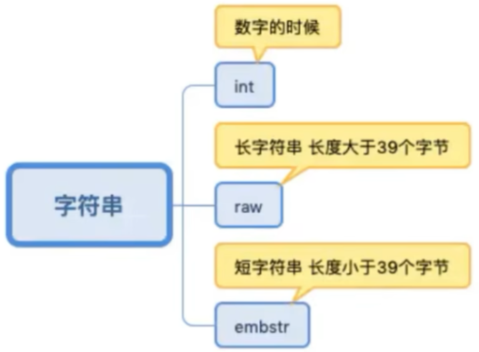
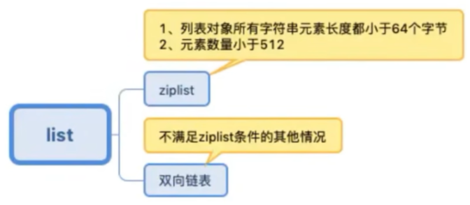
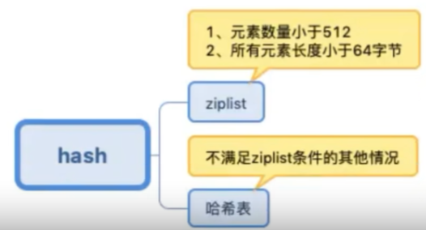
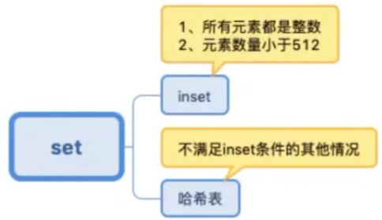
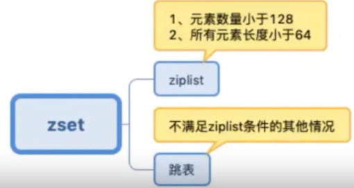
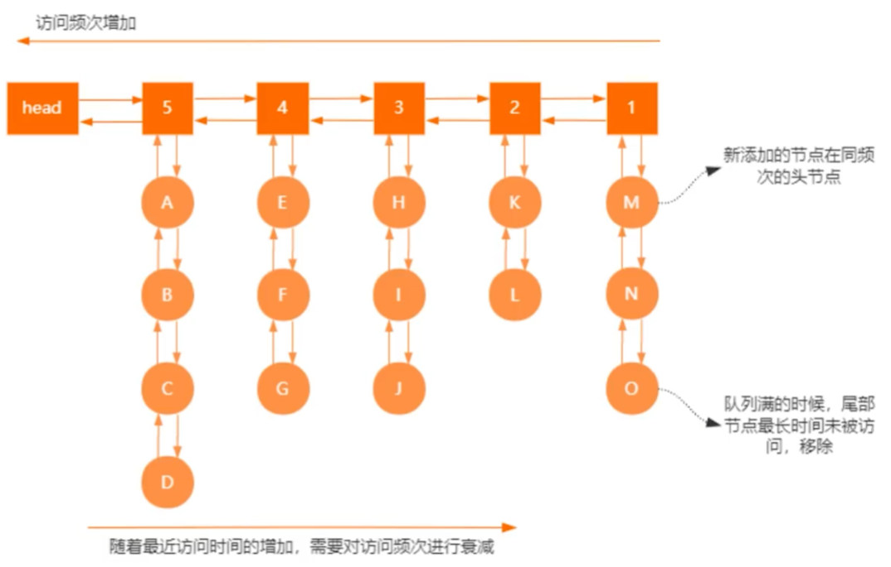
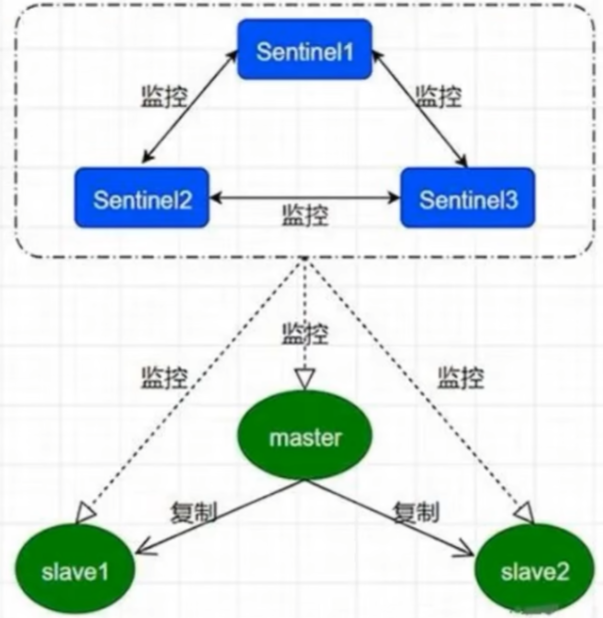

Redis 是一个基于**内存结构**的`key-value`数据结构的的`NOsql`（非关系型，即不存在表之间的关联关系）数据库，有 5 种常用类型：String、Map、ZSet、Set、List。多用于分布式缓存中间件。提供了主从复制和哨兵、集群的方式实现高可用。

## 数据类型

### 1.字符串

其中：embstr 和 raw 都是由 SDS 动态字符串构成的，唯一区别是：raw 是分配内存的时候，redisobject 和 sds 各分配一块内存，而 embstr 是 redisobject 和在一块儿内存中。

### 2.列表

### 3.hash

### 4.set

### 5.zset

## Redis 的数据过期淘汰策略

Redis 过期删除采用的是**定期删除**和**惰性删除**，默认是每 100ms 检测一次，遇到过期的 key 则进行删除，这里的检测并不是顺序检测，而是随机检测。并且当我们去读/写一个已经过期的 key 时，会触发 Redis 的惰性删除策略。如果定期删除没删除 key，然后你也没即时去请求 key，也就是说惰性删除也没生效。这样，redis 的内存会越来越高。那么就应该采用**内存淘汰机制**。

- **定时过期**

  每个设置过期时间的 key 都需要创建一个定时器，到过期时间就会立即清除。该策略可以立即清除过期的数据，对内存很友好；但是会占用大量的 CPU 资源去处理过期的数据，从而影响缓存的响应时间和吞吐量。

- **惰性过期**

  只有当访问一个 key 时，才会判断该 key 是否已过期，过期则清除。该策略可以最大化地节省 CPU 资源，却对内存非常不友好。极端情况可能出现大量的过期 key 没有再次被访问，从而不会被清除，占用大量内存。

- **定期过期**

  redis 会将每个设置了过期时间的 key 放入到一个独立的字典中，以后会定期遍历这个字典来删除到期的 key。Redis 默认会每秒进行十次过期扫描（100ms 一次），过期扫描不会遍历过期字典中所有的 key，而是采用了一种简单的贪心策略。

  - 过期字典中随机 20 个 key，删除这 20 个 key 中已经过期的 key

  - 如果过期的 key 比率超过 1/4，那就重复上个步骤

当 Redis 内存使用达到了`maxmemory`时，会根据配置的淘汰策略将数据删除，Redis 内存淘汰机制有以下几种策略：

- `volatile-ttl`：从已设置过期时间的数据集中挑选将要过期的数据淘汰

- `volatile-lru`：从已设置过期时间的数据集中挑选最长时间没有被使用的数据淘汰
- `volatile-random`：从已设置过期时间的数据集中任意选择数据淘汰
- `allkeys-lru`：在键空间中，移除最长时间没有被使用的 key（最常用）
- `allkeys-random`：从数据集中任意选择数据淘汰
- `no-eviction`：禁止驱逐数据，永不过期，即当内存不足时，新写入操作会报错（默认值）

4.0 新增以下两种策略（底层为双向链表结构）：

- `volatile-lfu`：从已设置过期时间的数据集中挑选最不经常使用的数据淘汰
- `allkeys-lfu`：在键空间中，移除最不经常使用的 key

> 这里不是传统的 LFU，是在传统的 LRU 基础上增加了访问频次。

## Redis 和 memcached 的区别

- 存储方式不同

  memcache 把数据全部存在内存之中，数据不能超过内存大小，Redis 则是部分存储在硬盘上，可以保证数据的持久性。

- 数据支持类型不同

  memcache 对数据类型支持相对简单，Redis 则支持复杂的数据类型。

- 底层模型不同

  底层实现方式和与客户端之间通信的应用协议不同，Redis 自己构建了 vm 机制，因为一般的系统调用系统函数的话，会浪费一定的时间去移动和请求。

- value 值大小不同

  Redis 最大可以达到 1GB，memcache 只有 1MB。

## Redis 的线程模型

Redis 内部使用`文件事件处理器（file event handler）` ，这个文件事件处理器是单线程的，所以 Redis 才叫做单线程模型。采用 IO 多路复用机制同时监听多个 socket，根据 socket 上的事件来选择对应的事件处理器进行处理。6.0 中又引入了多线程，优化 IO 的处理能力。

文件事件处理器的结构包括 4 个部分：

- 多个 socket

- IO 多路复用程序

- 文件事件分派器

- 事件处理器（连接应答处理器、命令请求处理器、命令回复处理器）

多个 socket 可能会并发产生不同的操作，每个操作对应不同的文件事件，但是 IO 多路复用程序会监听多个 socket，会将 socket 产生的事件放入队列中排队，事件分派器每次从队列中取出一个事件，把该事件交给对应的事件处理器进行处理。

但是要注意客户端的多个操作间==不是原子性==的。客户端上尽量使用单条指令，或尝试加锁，或者使用 lua 脚本。

## 单线程的 Redis 为什么这么快

官方给出的读写速度是 10万/秒，其速度快的原因为：

- Redis 是完全`基于内存`的，所以读写效率非常高，当然 Redis 存在持久化操作，持久化操作是由 fork 子进程和利用 Linux 系统的页缓存技术来完成的，并不会影响 Redis 的性能
- 单线程避免了频繁的上下文切换
- 合理高效的数据结构
- 采用了非阻塞 IO 多路复用机制：多路 I/O 复用模型是利用 select、poll、epoll 可以同时检查多个流的 IO 事件的能力，在空闲时候，会把当前线程阻塞掉，当有一个或多个流有 IO 事件时，就从阻塞态中唤醒，于是程序就会轮询一边所有的流（epoll 是只轮询那些真正发出了事件的流），并且只依次顺序的处理就绪的流，这种做法就避免了大量的无用操作

## 哨兵模式

哨兵是 Redis 高可用的解决方案，可以运行多个 Sentinel 组成一个哨兵分布式系统。如果主节点挂掉，就进行主从切换，让从节点升级为主节点，继续对外提供服务。

### 职责

- `监控`：Sentinel 会不断的定期检查你的主服务器和从服务器是否运行正常
- `提醒`：当被监控的某个 Redis 服务器出现问题时，Sentinel 可以通过 API 向管理员或者其他应用程序发送通知
- `自动故障迁移`：当一个主服务器不能正常工作时，Sentinel 会开始一次自动故障迁移操作，它会将失效主服务器的其中一个从服务器升级为新的主服务器，并让失效主服务器的其他从服务器改为复制新的主服务器。当客户端试图连接失效的主服务器时，集群也会像客户端返回新主服务器的地址，使得集群可以使用新主服务器代替是小服务器
- `统一的配置管理`：连接者询问 Sentinel 取得主从的地址

## 主从模式与集群模式

- 主从模式实现了读写分离，Master 以写为主，Slave 以读为主；集群模式下的 Slave 节点只有在 Master 节点宕机后才会工作
- 主从模式无法在线扩容；集群模式使用的是 slot 槽机制，支持在线扩容
- 两种模式下当主机挂掉后再连回来会变成从机

## Redis 如何事务

Redis 通过 `MULTI`、`EXEC`、`WATCH` 等命令来实现事务功能。事务提供了一种将多个命令请求打包，然后一次性，按顺序的执行多个命令的机制，并且在事务执行期间，服务器不会中断事务而去执行其他客户端的命令请求，它会将事务中的所有命令都执行完毕，然后才去处理其他客户端的命令请求。

在传统的关系式数据库中，常常用 ACID 性质来检验事务功能的可靠性和安全性。在 Redis 中，事务总是具有原子性（Atomicity）、一致性（Consistency）和隔离性（Isolation），并且当 Redis 运行在某种特定的持久化模式下时，事务也具有持久性。

只有在组队时某个命令出现错误，执行时整个执行队列都会被取消，若错误发生在执行阶段，则只有报错的命令不会被执行，而其他的命令都会执行，不会回滚。

