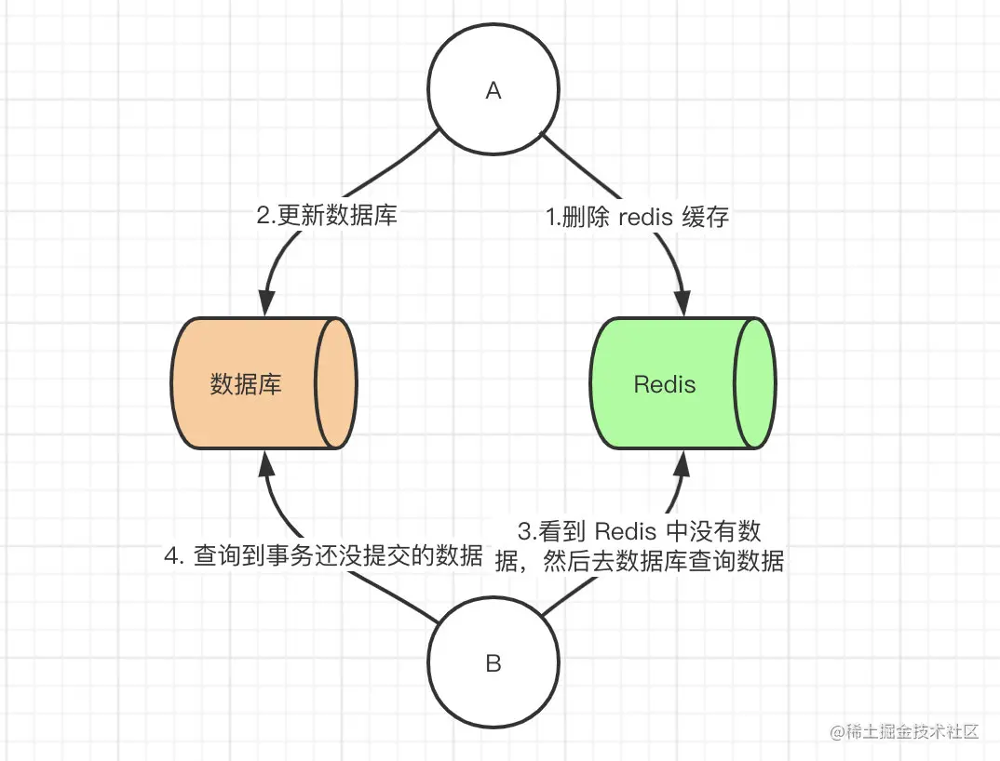
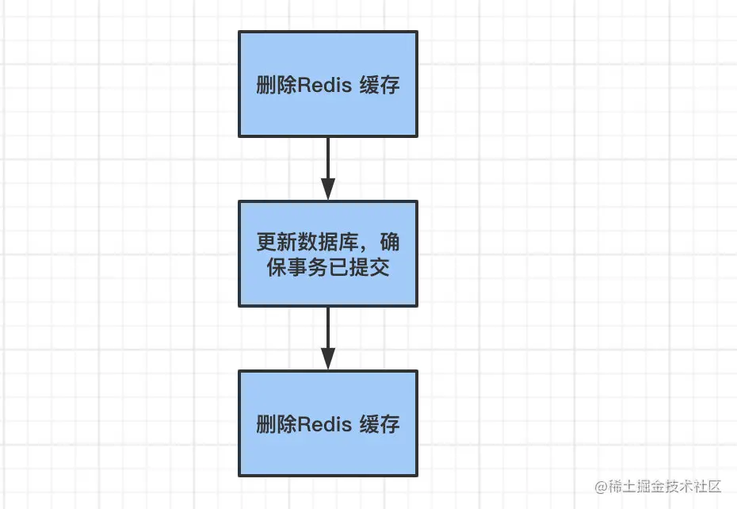
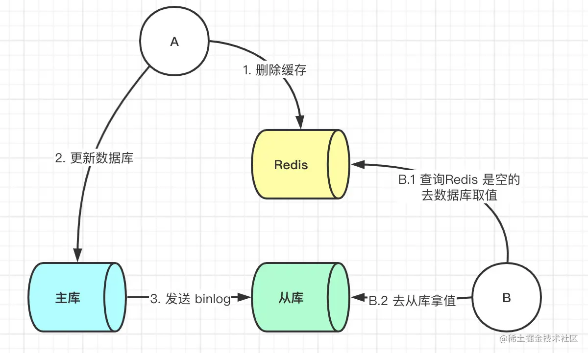
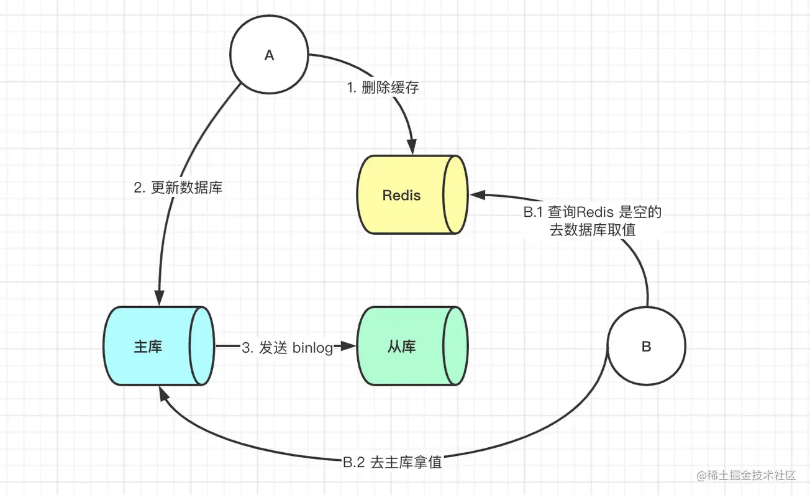
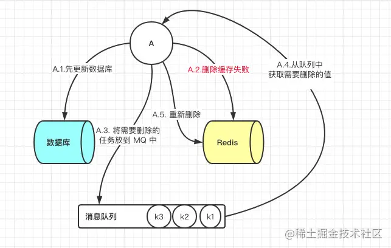
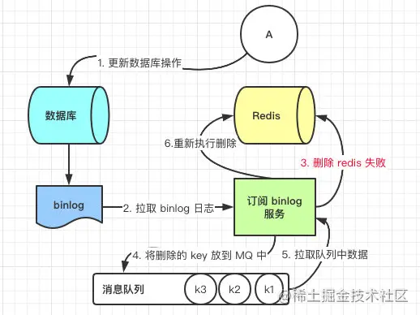
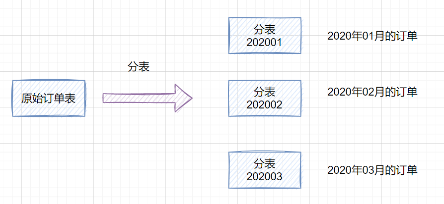
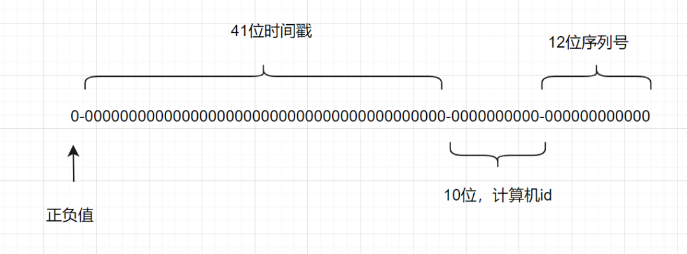

## 1.数据库连接池

一种池化技术，核心思想是实现`资源的复用`，避免资源的重复创建和销毁。

在数据库中，应用程序每次向数据库发起 CRUD 操作的时候，都需要创建链接，而在数据访问量比较大的情况下，频繁创建连接会带来比较大的性能开销。使用连接池后，应用程序启动时，提前会初始化一部分的连接保存在连接池中，当应用程序需要用到连接去进行数据操作的时候，直接从连接池中取出一个已经建立好的连接进行操作。连接池的设计避免了每次连接的建立和释放。

**参数**

- `初始化连接数`：启动的时候初始化多少个连接保存在连接池中
- `最大连接数`：表示同时最多能支持多少连接，如果连接数不够，后续要获取连接的线程会阻塞
- `最大空闲连接数`：没有请求时连接池中要保留的最大空闲连接
- `最小空闲连接数`：当连接数小于这个值的时候，连接池需要再创建连接来补充到这个值
- `最大等待时间`：连接池里面的连接用完后，新的请求要等待的时间，超过这个时间就会提示超时异常
- `无效连接清除`：清理连接池里面的无效连接，避免使用这个连接操作的时候出现错误

## 2.如何保证缓存与数据库双写时的数据一致性

在做系统优化时，想到了将数据进行分级存储的思路。因为在系统中会存在一些数据，有些数据的实时性要求不高，比如一些配置信息。基本上配置了很久才会变一次。而有一些数据实时性要求非常高，比如订单和流水的数据。所以这里根据数据要求实时性不同将数据分为三级。

- 第1级：订单数据和支付流水数据；这两块数据对实时性和精确性要求很高，所以不添加任何缓存，读写操作将直接操作数据库
- 第2级：用户相关数据；这些数据和用户相关，具有读多写少的特征，所以我们使用 redis 进行缓存
- 第3级：支付配置信息；这些数据和用户无关，具有数据量小，频繁读，几乎不修改的特征，所以我们使用本地内存进行缓存

但是只要使用到缓存，无论是本地内存做缓存还是使用 redis 做缓存，那么就会存在数据同步的问题，因为配置信息缓存在内存中，而内存时无法感知到数据在数据库的修改。这样就会造成数据库中的数据与缓存中数据不一致的问题。接下来就讨论一下关于保证缓存和数据库双写时的数据一致性。

### 2.1 解决方案 

#### 1.Cache Aside Pattern

- 命中

  程序先从缓存中读取数据，如果命中，则直接返回

- 失效

  程序先从缓存中读取数据，如果没有命中，则从数据库读取，成功后将数据放到缓存中

- 更新

  程序先更新数据库，再删除缓存

那么我们这里列出来所有策略，并且讨论他们优劣性。

1. 先更新数据库，后更新缓存
2. 先更新数据库，后删除缓存
3. 先更新缓存，后更新数据库
4. 先删除缓存，后更新数据库

#### 2.先更新数据库，后更新缓存

这种场景一般是没有人使用的，主要原因是在更新缓存那一步，为什么呢？因为有的业务需求缓存中存在的值并不是直接从数据库中查出来的，有的是需要经过一系列计算来的缓存值，那么这时候后你要更新缓存的话其实代价是很高的。如果此时有大量的对数据库进行写数据的请求，但是读请求并不多，那么此时如果每次写请求都更新一下缓存，那么性能损耗是非常大的。

举个例子比如在数据库中有一个值为 1 的值，此时我们有 10 个请求对其每次加一的操作，但是这期间并没有读操作进来，如果用了此方法，那么此时就会有十个请求对缓存进行更新，会有大量的冷数据产生，如果我们不更新缓存而是删除缓存，那么在有读请求来的时候那么就会只更新缓存一次。

#### 3.先更新缓存，后更新数据库

这一种情况和第一种情况是一样的。还有就是当更新数据库失败后，还要考虑缓存的回滚等问题。

#### 4.先删除缓存，后更新数据库

该方案也会出问题，具体出现的原因如下。

此时来了两个请求，请求 A（更新操作） 和请求 B（查询操作）

1. 请求 A 会先删除 Redis 中的数据，然后去数据库进行更新操作
2. 此时请求 B 看到 Redis 中的数据时空的，会去数据库中查询该值，补录到 Redis 中
3. 但是此时请求 A 并没有更新成功，或者事务还未提交

那么这时候就会产生数据库和 Redis 数据不一致的问题。如何解决呢？其实最简单的解决办法就是**延时**双删的策略。

但是上述的保证事务提交完以后再进行删除缓存还有一个问题，就是如果你使用的是 Mysql 的读写分离的架构的话，那么其实主从同步之间也会有时间差。

此时来了两个请求，请求 A（更新操作） 和请求 B（查询操作）

1. 请求 A 更新操作，删除了 Redis
2. 请求主库进行更新操作，主库与从库进行同步数据的操作
3. 请 B 查询操作，发现 Redis 中没有数据
4. 去从库中拿去数据
5. 此时同步数据还未完成，拿到的数据是旧数据

此时的解决办法就是如果是对 Redis 进行填充数据的查询数据库操作，那么就**强制将其指向主库进行查询**。

#### 5.先更新数据库，后删除缓存

问题：这一种情况也会出现问题，比如更新数据库成功了，但是在删除缓存的阶段出错了没有删除成功，那么此时再读取缓存的时候每次都是错误的数据了。

或者缓存时间刚好到期，此时另一线程 B 会读取数据库并重新写入缓存，造成数据不一致。但是由于查询请求往往比更新请求快，所以 B 请求会先执行，然后 A 请求最后会删除缓存。

此时解决方案就是利用消息队列进行删除的补偿。具体的业务逻辑用语言描述如下：

1. 请求 A 先对数据库进行更新操作
2. 在对 Redis 进行删除操作的时候发现报错，删除失败
3. 此时将 Redis 的 key 作为消息体发送到消息队列中
4. 系统接收到消息队列发送的消息后再次对 Redis 进行删除操作
5. 删除失败放入死信队列，由人工进行删除

但是这个方案会有一个缺点就是会对业务代码造成大量的侵入，深深的耦合在一起，所以这时会有一个优化的方案，我们知道对 Mysql 数据库更新操作后再 binlog 日志中我们都能够找到相应的操作，那么我们可以订阅 Mysql 数据库的 binlog 日志（例如：canal 中间件）对缓存进行操作。

### 2.2 总结 

每种方案各有利弊，比如在第二种先删除缓存，后更新数据库这个方案我们最后讨论了要更新 Redis 的时候强制走主库查询就能解决问题，那么这样的操作会对业务代码进行大量的侵入，但是不需要增加的系统，不需要增加整体的服务的复杂度。最后一种方案我们最后讨论了利用订阅 binlog 日志进行搭建独立系统操作 Redis，这样的缺点其实就是增加了系统复杂度。其实每一次的选择都需要我们对于我们的业务进行评估来选择，没有一种技术是对于所有业务都通用的。没有最好的，只有最适合我们的。

## 3.什么情况不适合建立索引

1. where 条件中用不到的字段
2. 表记录较少
3. 需要经常进行增删改操作，可以评估是否适合索引
4. 需要进行运算或函数计算的列
5. 区分度不高的字段，如性别

## 4.如何分库分表

水平分库的方式，就是一个用户注册时，就划分了属于哪个数据库，然后具体的表结构是一样的。

垂直分库就是按照不同的系统中的不同业务进行拆分，比如拆分成用户库、订单库、积分库、商品库，把它们部署在不同的数据库服务器。

分表的话也有水平分表和垂直分表，垂直分表就是将一些不常用的、数据较大或者长度较长的列拆分到另外一张表，水平分表就是可以按照某种规则（如 hash 取模、range），把数据切分到多张表去。一张订单表，按时间 range 拆分如下：

**range 划分利于数据迁移，但是存在数据热点问题。hash 取模划分，不会存在明显的热点问题，但是不利于扩容。可以 range+hash 取模结合使用。**

**分布式 ID 可以使用雪花算法生成**

> 雪花算法是一种生成分布式全局唯一 ID 的算法，生成的 ID 称为 Snowflake IDs。这种算法由 Twitter 创建，并用于推文的 ID。

一个 Snowflake ID 有 64 位。

- 第 1 位：Java 中 long 的最高位是符号位代表正负，正数是 0，负数是 1，一般生成 ID 都为正数，所以默认为 0。
- 接下来前 41 位是时间戳，表示了自选定的时期以来的毫秒数。
- 接下来的 10 位代表计算机 ID，防止冲突。
- 其余 12 位代表每台机器上生成 ID 的序列号，这允许在同一毫秒内创建多个 Snowflake ID。

## 5.数据 hash 算法

### 5.1 哈希取余分区

假设有 3 台机器构成一个集群，用户每次读写操作都是根据公式：`hash(key) % N`个机器台数，计算出哈希值，用来决定数据映射到哪一个节点上。  

**优点**

简单粗暴，直接有效，只需要预估好数据规划好节点，例如 3台、8 台、10 台，就能保证一段时间的数据支撑。使用 Hash 算法让固定的一部分请求落到同一台服务器上，这样每台服务器固定处理一部分请求（并维护这些请求的信息），起到负载均衡 + 分而治之的作用。

**缺点**

原来规划好的节点，每次数据变动导致节点有变动，映射关系需要重新进行计算，在服务器个数固定不变时没有问题，如果需要弹性扩容或故障停机的情况下，原来的取模公式就会发生变化。此时地址经过取余运算的结果将发生很大变化，根据公式获取的服务器也会变得不可控。某个 redis 机器宕机了，由于台数数量变化，会导致 hash 取余全部数据重新洗牌。

### 5.2 一致性哈希算法分区

目的是当服务器个数发生变动时，尽量减少影响客户端到服务器的映射关系。

**算法构建一致性哈希环**

一致性哈希算法必然有个 hash 函数并按照算法产生 hash 值，这个算法的所有可能哈希值会构成一个全量集，这个集合可以成为一个 hash 空间`[0,2^32-1]`，这个是一个线性空间，但是在算法中，我们通过适当的逻辑控制将它首尾相连`(0 = 2^32)`，这样让它逻辑上形成了一个环形空间。

它也是按照使用取模的方法，前面笔记介绍的节点取模法是对节点（服务器）的数量进行取模。而一致性 Hash 算法是对 2^32^ 取模，简单来说，一致性 Hash 算法将整个哈希值空间组织成一个虚拟的圆环，如假设某哈希函数H的值空间为 0-2^32-1^（即哈希值是一个 32 位无符号整形），整个哈希环如下图：整个空间按顺时针方向组织，圆环的正上方的点代表 0，0 点右侧的第一个点代表 1，以此类推，2、3、4、……直到 2^32-1^，也就是说 0 点左侧的第一个点代表 2^32-1^， 0 和 2^32-1^ 在零点中方向重合，我们把这个由 2^32^ 个点组成的圆环称为 Hash 环。

**服务器 IP 节点映射**

将各个服务器使用Hash进行一个哈希，具体可以选择服务器的IP或主机名作为关键字进行哈希，这样每台机器就能确定其在哈希环上的位置。假如 4 个节点 NodeA、B、C、D，经过 IP 地址的哈希函数计算`(hash(ip))`，使用 IP 地址哈希后在环空间的位置如下：

**key 落到服务器的落键规则**

当我们需要存储一个 kv 键值对时，首先计算 key 的 hash 值，hash(key)，将这个 key 使用相同的函数 Hash 计算出哈希值并确定此数据在环上的位置，从此位置沿环顺时针行走，第一台遇到的服务器就是其应该定位到的服务器，并将该键值对存储在该节点上。

如我们有 Object A、Object B、Object C、Object D 四个数据对象，经过哈希计算后，在环空间上的位置如下：

根据一致性 Hash 算法，数据 A 会被定为到 Node A 上，B 被定为到 Node B 上，C 被定为到 Node C 上，D 被定为到 Node D 上。

**优点**

- 容错性

  假设 Node C 宕机，可以看到此时对象 A、B、D 不会受到影响，只有 C 对象被重定位到 Node D。一般的，在一致性 Hash 算法中，如果一台服务器不可用，则受影响的数据仅仅是此服务器到其环空间中前一台服务器（即沿着逆时针方向行走遇到的第一台服务器）之间数据，其它不会受到影响。简单说，就是 C 挂了，受到影响的只是 B、C 之间的数据，并且这些数据会转移到 D 进行存储。

- 扩展性

  数据量增加了，需要增加一台节点 NodeX，X 的位置在 A 和 B 之间，那收到影响的也就是 A 到 X 之间的数据，重新把 A 到 X 的数据录入到 X 上即可，不会导致 hash 取余全部数据重新洗牌。

**缺点**

- 数据倾斜

  一致性 Hash 算法在**服务节点太少**时，容易因为节点分布不均匀而造成数据倾斜（被缓存的对象大部分集中缓存在某一台服务器上）问题，例如系统中只有两台服务器：

  

  解决方法：通过均匀一致性 Hash 算法创建当前物理服务器的虚拟节点，保证逻辑上的节点平均分配在整个空间。

## 6.基因算法

解决分库分表时按用户id分库的需求：

- 用雪花算法生成订单id时将用户id放入订单id中，分片时按用户id分片
- 例如用户id有16位，库有16个，则可以先将用户id的前后8位异或运算得到8位，再前后自异或运算得到4位，该4位即库的编号