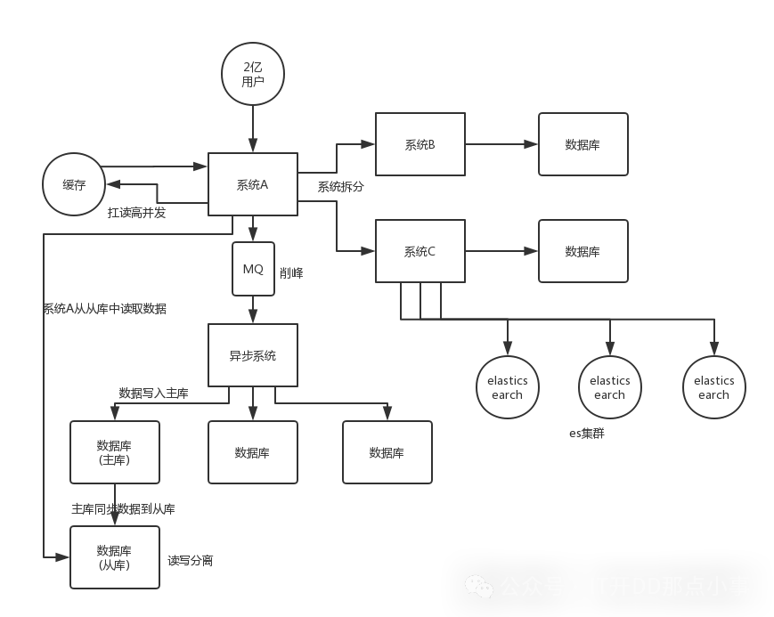

# 项目架构知识点

## 1.保证幂等性

**幂等**一般指方法被多次调用时所产生的影响和第一次执行的影响是相同的。

在网络通信中存在两种行为可能导致接口被重复调用：

- 用户的`重复提交`或用户的`恶意攻击`，导致这个请求被多次重复执行
- 在分布式架构中，为了避免网络通习导致的数据丢失，在服务之间进行通信的时候都会设计`超时重试`的机制，而这种机制有可能导致`服务端接口被重复调用`

**解决方法**

- 使用数据库的`唯一约束`实现幂等，比如对于数据插入类的场景，比如创建订单，因为订单号肯定是`唯一的`，所以如果是多次调用就会触发数据库的唯一约束异常，从而避免一个请求创建多个订单的问题的

- 使用 redis 中提供的`setNX`指令，比如对于 MQ 消费的场景，为了避免 MQ 重复消费导致数据多次被修改的问题，可以在接收到 MQ 的消息时，把这个消息通过 setNX 写入到 redis 中，一旦这个消息被消费过，就不会再次消费

- `使用状态机来实现幂等`，所谓状态机是指一条数据的完整运行状态的转换流程，比如订单状态，因为它的状态只会向前变更，所以多次修改同一条数据的时候，一旦状态发生变更，那么对这条数据修改造成的影响只会发生一次

- 其他的方法如使用`Token`、`乐观锁`等

  > Token 保证幂等性
  >
  > 每一次请求创建一个唯一标识 token，先获取 token，并将此 token 存入 redis，请求接口时，将此 token 放到 header 或者作为请求参数请求接口，后端接口处理请求时首先判断 redis 中是否存在此 token。如果存在，正常处理业务逻辑，并从 redis 中删除此 token，如果是重复请求，由于 token 已被删除，则不能通过校验，返回请勿重复操作提示。
  > 为了防止宕机造成的未消费问题，可以在 token 中设置状态，消费时不删除 token 而是改变状态。

总结：要么接口只允许调用一次，比如唯一约束，基于`redis`的锁机制，要么就是对数据的影响只会触发一次，比如`状态机`、`乐观锁`等。

## 2.提升接口性能

- 使用线程池
- 使用缓存
- 使用异步调用（例如使用 MQ）
- 使用并发
- 减小锁粒度

## 3.高并发架构

在处理高并发系统时，通常会采取一系列策略和措施：

1. **系统拆分**：通过拆分系统，原本集中在一个数据库上的请求压力被分散到多个数据库上。每个数据库只处理其所属子系统的请求，从而降低了单个数据库的负载。这种分布式架构可以更好地应对高并发场景，因为多个数据库可以并行处理请求，提高了整体的处理能力。
2. **缓存**：使用 Redis 等缓存系统来分担数据库的压力，特别是针对读多写少的场景。缓存能够显著提高数据访问速度，减轻数据库的负载，从而提升系统的并发处理能力。
3. **消息队列**：通过引入 MQ 如 RocketMQ 或 Kafka，将大量的写请求异步处理，避免对数据库造成瞬间的冲击。这样可以控制数据库的写入负载，保证系统在高并发下的稳定运行。
4. **分库分表**：当单个数据库或表面临性能瓶颈时，可以通过分库分表来分散数据访问压力。根据业务规则将数据分散到多个数据库或表中，提高系统的并发处理能力和性能。
5. **读写分离**：通过将读和写操作分离到不同的数据库实例上，可以进一步提高系统的并发性能。主库负责写操作，而从库负责读操作，通过增加从库的数量来应对大量的读请求。
6. **使用 Elasticsearch**：对于简单的查询、统计和全文搜索类操作，可以考虑使用 ES来承载。ES 的分布式特性和高性能搜索能力使其成为处理这些任务的理想选择。通过合理的索引设计和查询优化，ES 能够高效地处理大量的并发请求。

**系统拆分**

将一个大型系统拆分为多个子系统并通过 Dubbo 等微服务框架进行连接。这种架构方式不仅可以提升系统的可维护性和可扩展性，还能在一定程度上分散并发压力。每个子系统可以独立运行，拥有自己的数据库，这样可以避免单点故障，并且可以根据业务需求进行独立优化和扩展。

然而，这种拆分也带来了一些挑战。首先，需要合理设计子系统之间的接口和数据交互方式，确保系统的稳定性和性能。其次，管理和维护多个数据库也需要更多的资源和精力。此外，拆分系统还需要考虑数据一致性和事务管理等问题。

**缓存**

在大多数高并发应用中，读操作远多于写操作。这意味着，如果能够将读请求尽可能地引导到缓存中进行处理，就可以显著减少对数据库的访问压力。而缓存系统，如 Redis，其设计初衷就是为了快速响应大量的读请求，单机可以轻松应对几万甚至更高的并发量。

因具体来说，当系统接收到读请求时，首先检查缓存中是否存在所需数据。如果缓存命中（即数据在缓存中），则直接从缓存中读取并返回结果，避免了对数据库的访问。这样，大部分读请求都可以通过缓存快速响应，从而降低了数据库的负载。

当然，使用缓存也需要注意一些问题。首先，需要确保缓存和数据库之间的数据一致性。当数据库中的数据发生变化时，需要及时更新缓存中的相应数据，以避免出现数据不一致的情况。其次，需要合理设置缓存的过期时间和淘汰策略，以平衡缓存的命中率和数据的新鲜度。

**MQ**

MQ 能够将大量的写请求缓存在队列中，以一定的速度逐渐处理，从而避免了瞬间的数据库压力。通过 MQ，我们可以将写请求放入队列中，然后让后端系统按照自己的处理速度消费并写入数据库。这样，我们就可以控制数据库的写入负载，防止因过高的并发写请求而导致系统崩溃。

此外，MQ 本身也具备处理高并发的能力。一些高性能的 MQ 系统，如 Kafka 等，单机就能够处理数万甚至更高的并发请求。因此，在项目中，对于那些承载复杂写业务逻辑的场景，使用 MQ 来进行异步写操作是一个很好的选择，它可以有效提升系统的并发性能，保证系统的稳定性和可靠性。

**分库分表**

当单个数据库在高并发场景下遇到性能瓶颈时，分库分表是一种常见的解决方案。通过将一个数据库拆分为多个数据库，以及将一个表拆分为多个表，可以有效地分散数据访问压力，提升系统的并发处理能力。

首先，分库是指将原本集中在一个数据库中的数据分散到多个数据库实例中。这样，每个数据库实例都只承担部分数据访问压力，从而提高了整体的并发处理能力。分库通常基于一定的业务规则进行，比如按照用户 ID 的范围、时间范围或其他业务属性来划分数据。

其次，分表是指将一个大的表拆分为多个小的表。每个表的数据量保持相对较少，这有助于提高 SQL 查询的性能。分表可以基于水平分割（如按照用户 ID 的哈希值）或垂直分割（如将表中的列拆分为不同的表）的方式进行。水平分割将同一类型的数据分散到不同的表中，而垂直分割则将表中的不同列分散到不同的表中。

然而，分库分表也带来了一些挑战。首先，需要进行复杂的数据路由和分片策略设计，确保数据能够正确地分布到各个数据库和表中。其次，跨库跨表的查询和事务处理变得更加复杂，需要额外的逻辑和性能开销。此外，数据的备份、恢复和迁移也变得更加困难。

**读写分离**

读写分离是一种常见的数据库架构优化策略，特别是在处理读多写少的业务场景时效果尤为显著。在这种架构中，我们将数据库分为两部分：主库和从库。主库主要负责处理写操作，如插入、更新和删除，而从库则主要负责处理读操作，如查询。

通过将读和写操作分开处理，读写分离能够显著提高系统的并发处理能力。因为读操作通常比写操作更为频繁，将读请求分散到多个从库上可以有效地分散数据库的访问压力。这样，主库可以专注于处理写操作，而从库则可以并行处理多个读操作，从而提高了整体的系统性能。

需要注意的是，读写分离也带来了一些挑战和注意事项。首先，需要确保主从库之间的数据同步，以保证读操作返回的数据是最新的。其次，需要合理配置主从库的硬件资源，以确保它们能够处理相应的负载。此外，还需要考虑故障恢复和容灾策略，以应对可能的主库故障或其他异常情况。

**ElasticSearch**

Elasticsearch 是一个分布式的搜索和分析引擎，以其强大的扩展能力和高并发处理能力而著称。由于其分布式特性，ES 可以轻松地通过增加节点来扩展性能和容量，从而自然地支撑高并发场景。这使得 ES 成为承载简单查询、统计操作以及全文搜索等任务的理想选择。