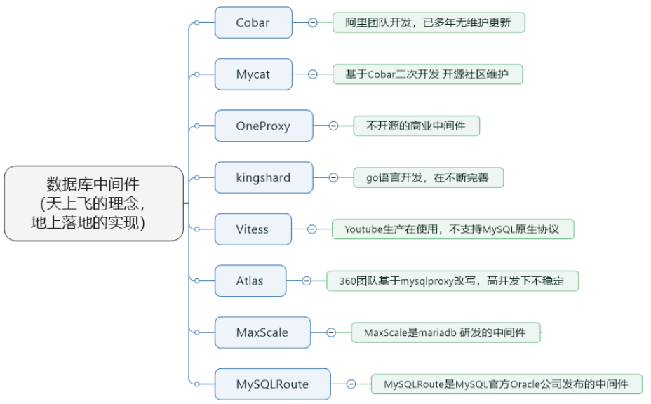
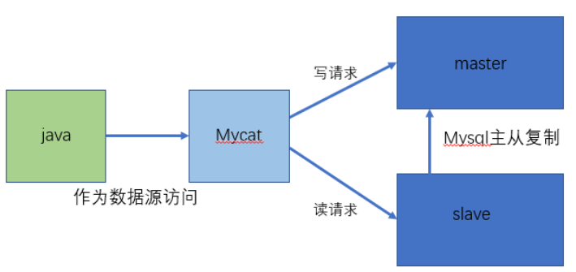
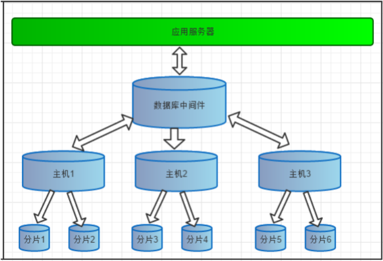
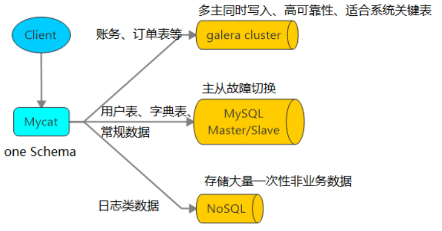
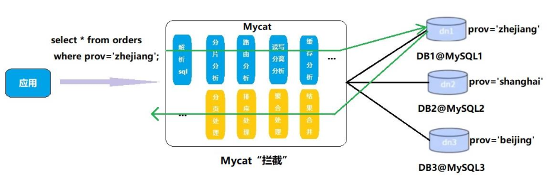

# 第1章_入门概述

## 1.Mycat 是什么

Mycat 是数据库中间件。
1、 、 数据库中间件
中间件：是一类连接软件组件和应用的计算机软件，以便于软件各部件之间的沟通。
例子：Tomcat，web中间件。
数据库中间件：连接java应用程序和数据库
2、 、 为什么要用Mycat ？
① Java与数据库紧耦合。
② 高访问量高并发对数据库的压力。
③ 读写请求数据不一致
3、 数据库中间件对比

① Cobar属于阿里B2B事业群，始于2008年，在阿里服役3年多，接管3000+个MySQL数据库的schema,
集群日处理在线SQL请求50亿次以上。由于Cobar发起人的离职，Cobar停止维护。
② Mycat是开源社区在阿里cobar基础上进行二次开发，解决了cobar存在的问题，并且加入了许多新
的功能在其中。青出于蓝而胜于蓝。
③ OneProxy基于MySQL官方的proxy思想利用c进行开发的，OneProxy是一款商业收费的中间件。舍
弃了一些功能，专注在性能和稳定性上。
④ kingshard由小团队用go语言开发，还需要发展，需要不断完善。
⑤ Vitess是Youtube生产在使用，架构很复杂。不支持MySQL原生协议，使用需要大量改造成本。
⑥ Atlas是360团队基于mysql proxy改写，功能还需完善，高并发下不稳定。
⑦ MaxScale是mariadb（MySQL原作者维护的一个版本） 研发的中间件
⑧ MySQLRoute是MySQL官方Oracle公司发布的中间件

3 、Mycat的 的 官网
http://www.mycat.io/

## 1.2 Mycat 能干什么

1 、读写分离

2 、数据分片
垂直拆分（分库）、水平拆分（分表）、垂直+水平拆分（分库分表）

3多数据源整合

1.3  原理
Mycat 的原理中最重要的一个动词是“拦截”，它拦截了用户发送过来的 SQL 语句，首先对 SQL
语句做了一些特定的分析：如分片分析、路由分析、读写分离分析、缓存分析等，然后将此 SQL 发
往后端的真实数据库，并将返回的结果做适当的处理，最终再返回给用户。

这种方式把数据库的分布式从代码中解耦出来，程序员察觉不出来后台使用 Mycat 还是
MySQL。

