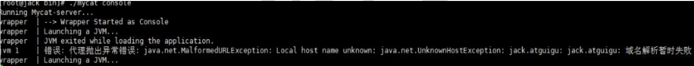
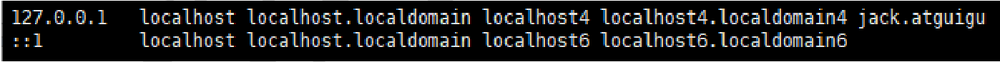
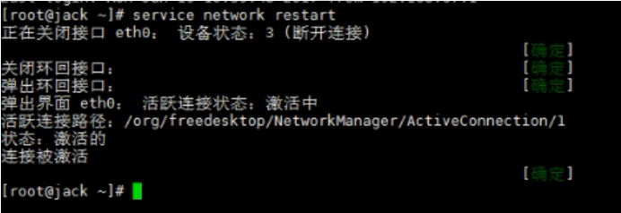

# 第2章_安装启动

2.1  安装
1、 、 解压后 即可使用
解压缩文件拷贝到 linux 下 /usr/local/
2、 、 三个 配置 文件
①schema.xml：定义逻辑库，表、分片节点等内容
② rule.xml： 定义分片规则
③server.xml：定义用户以及系统相关变量，如端口等
2.2  启动
1、 、 修改配置文件 server.xml
修改用户信息，与MySQL区分，如下：

```xml
…
<user name="mycat">
<property name="password">123456</property>
<property name="schemas">TESTDB</property>
</user>
…
```

2、修改配置文件 schema.xml

删除<schema>标签间的表信息，<dataNode>标签只留一个，<dataHost>标签只留一个，<writeHost>
<readHost>只留一对

```xml
<?xml version="1.0"?>
<!DOCTYPE mycat:schema SYSTEM "schema.dtd">
<mycat:schema xmlns:mycat="http://io.mycat/">
<schema name="TESTDB" checkSQLschema="false" sqlMaxLimit="100" dataNode="dn1">
</schema>
<dataNode name="dn1" dataHost="host1" database="testdb" />
<dataHost name="host1" maxCon="1000" minCon="10" balance="0"
writeType="0" dbType="mysql" dbDriver="native" switchType="1"
slaveThreshold="100">
<heartbeat>select user()</heartbeat>
<!-- can have multi write hosts -->
<writeHost host="hostM1" url="192.168.140.128:3306" user="root"
password="123123">
<!-- can have multi read hosts -->
<readHost host="hostS1" url="192.168.140.127:3306" user="root"
password="123123" />
</writeHost>
</dataHost>
</mycat:schema>
```

3、 、 验证数据库访问情况

Mycat 作为数据库中间件要和数据库部署在不同机器上，所以要验证远程访问情况。

```bash
mysql -uroot -p123123 -h 192.168.140.128 -P 3306
mysql -uroot -p123123 -h 192.168.140.127 -P 3306
# 如远程访问报错，请建对应用户
grant all privileges on *.* to root@'缺少的host' identified by '123123';
```

4、 、 启动程序
①控制台启动 ：去 mycat/bin 目录下执行 ./mycat console
②后台启动 ：去 mycat/bin 目录下 ./mycat start
为了能第一时间看到启动日志，方便定位问题，我们选择①控制台启动。
5、 、 启动时可能出现报错
如果操作系统是 CentOS6.8，可能会出现域名解析失败错误，如下图



可以按照以下步骤解决
① 用 vim 修改 /etc/hosts 文件， 在 127.0.0.1 后面增加你的机器名



② 修改后重新启动网络服务



2.3  登录
1 、登录后台管理窗口 口
此登录方式用于管理维护 Mycat

```sql
mysql -umycat -p123456 -P 9066 -h 192.168.140.128
#常用命令如下：
show database;
show @@help;
```

2 、登录 数据 窗口 口
此登录方式用于通过 Mycat 查询数据，我们选择这种方式访问 Mycat

```bash
mysql -umycat -p123456 -P 8066 -h 192.168.140.128
```

