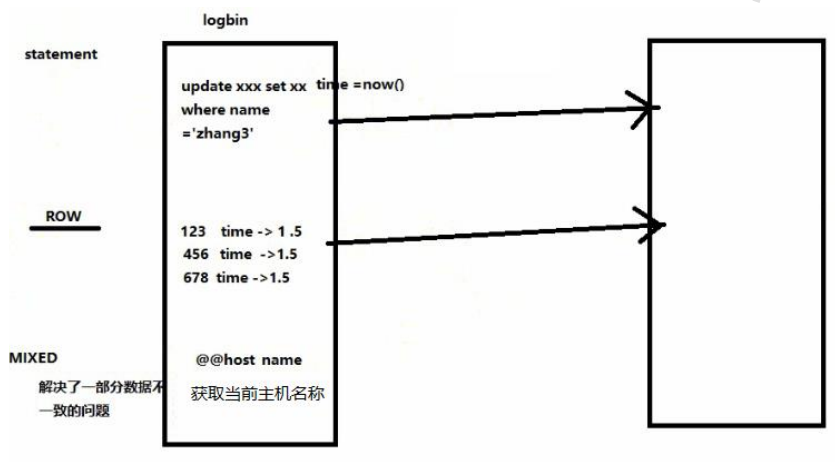
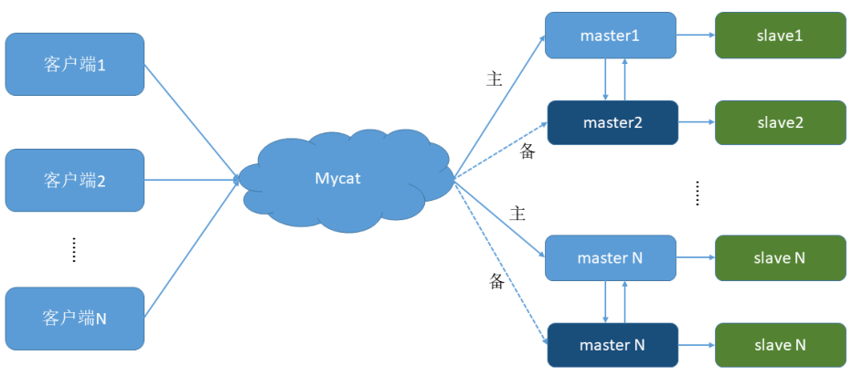

# 第3章_搭建读写分离

我们通过 Mycat 和 MySQL 的主从复制配合搭建数据库的读写分离，实现 MySQL 的高可用性。
我们将搭建：一主一从、双主双从两种读写分离模式。
3.1  搭建 一主一从
一个主机用于处理所有写请求，一台从机负责所有读请求，架构图如下


1 、  搭建 MySQL  数据库主从复制 制
① MySQL 主从复制原理


② 主机配置(host79)

```bash
修改配置文件：vim /etc/my.cnf
#主服务器唯一ID
server-id=1
#启用二进制日志
log-bin=mysql-bin
# 设置不要复制的数据库(可设置多个)
binlog-ignore-db=mysql
binlog-ignore-db=information_schema
#设置需要复制的数据库
binlog-do-db=需要复制的主数据库名字
#设置logbin格式
binlog_format=STATEMENT
```

binlog 日志三种格式



③ 从机配置(host80)
```bash
修改配置文件：vim /etc/my.cnf
#从服务器唯一ID
server-id=2
#启用中继日志
relay-log=mysql-relay
```

④ 主机、从机重启 MySQL 服务
⑤ 主机从机都关闭防火墙
⑥ 在主机上建立帐户并授权 slave

```bash
#在主机MySQL里执行授权命令
GRANT REPLICATION SLAVE ON *.* TO 'slave'@'%' IDENTIFIED BY '123123';
```

```bash
# 查询master的状态
show master status;
#记录下File和Position的值
#执行完此步骤后不要再操作主服务器MySQL，防止主服务器状态值变化
```

⑦ 在从机上配置需要复制的主机

```bash
#复制主机的命令
CHANGE MASTER TO MASTER_HOST='主机的IP地址',
MASTER_USER='slave',
MASTER_PASSWORD='123123',
MASTER_LOG_FILE='mysql-bin.具体数字',MASTER_LOG_POS=具体值;
#启动从服务器复制功能
start slave;
#查看从服务器状态
show slave status\G;

#下面两个参数都是Yes，则说明主从配置成功！
# Slave_IO_Running: Yes
# Slave_SQL_Running: Yes
```

⑧ 主机新建库、新建表、insert 记录，从机复制

⑨ 如何停止从服务复制功能

```sql
stop slave;
```

⑩ 如何重新配置主从

```sql
stop slave;
reset master;
```

2 、  修改 Mycat  的配置文件 schema.xml
之前的配置已分配了读写主机，是否已实现读写分离？

验证读写分离
（1）在写主机插入：insert into mytbl values (1,@@hostname);
主从主机数据不一致了
（2）在Mycat里查询：select * from mytbl;

修改<dataHost>的 balance属性，通过此属性配置读写分离的类型

负载均衡类型，目前的取值有4 种：
（1）balance="0", 不开启读写分离机制，所有读操作都发送到当前可用的 writeHost 上。
（2）balance="1"，全部的 readHost 与 stand by writeHost 参与 select 语句的负载均衡，简单的说，当双主双从
模式(M1->S1，M2->S2，并且 M1 与 M2 互为主备)，正常情况下，M2,S1,S2 都参与 select 语句的负载均衡。
（3）balance="2"，所有读操作都随机的在 writeHost、readhost 上分发。
（4）balance="3"，所有读请求随机的分发到 readhost 执行，writerHost 不负担读压力

为了能看到读写分离的效果，把balance设置成2，会在两个主机间切换查询

```xml
…
<dataHost name="host1" maxCon="1000" minCon="10" balance="2"
writeType="0" dbType="mysql" dbDriver="native" switchType="1"
slaveThreshold="100">
…
```

3 、  启动 Mycat

4 、  验证读写分离

```sql
#（1）在写主机数据库表mytbl中插入带系统变量数据，造成主从数据不一致
INSERT INTO mytbl VALUES(2,@@hostname);
#（2）在Mycat里查询mytbl表,可以看到查询语句在主从两个主机间切换
```

3.2  搭建 双主双从
一个主机 m1 用于处理所有写请求，它的从机 s1 和另一台主机 m2 还有它的从机 s2 负责所有读请
求。当 m1 主机宕机后，m2 主机负责写请求，m1、m2 互为备机。架构图如下




|编号 | 角色 | IP 地址 | 机器名|
| ---- | ---- | ---- | ---- |
|1|  Master1 | 192.168.140.128|  host79.atguigu|
|2 | Slave1|  192.168.140.127 | host80.atguigu|
|3|  Master2 | 192.168.140.126 | host81.atguigu|
|4 | Slave2 | 192.168.140.125|  host82.atguigu|

1 、  搭建 MySQL  数据库主从复制 （双主双从）
① 双主机配置
Master1配置

```bash
修改配置文件：vim /etc/my.cnf
#主服务器唯一ID
server-id=1
#启用二进制日志
log-bin=mysql-bin
# 设置不要复制的数据库(可设置多个)
binlog-ignore-db=mysql
binlog-ignore-db=information_schema
#设置需要复制的数据库
binlog-do-db=需要复制的主数据库名字
#设置logbin格式
binlog_format=STATEMENT
# 在作为从数据库的时候，有写入操作也要更新二进制日志文件
log-slave-updates
#表示自增长字段每次递增的量，指自增字段的起始值，其默认值是1，取值范围是1 .. 65535
auto-increment-increment=2
# 表示自增长字段从哪个数开始，指字段一次递增多少，他的取值范围是1 .. 65535
auto-increment-offset=1
```

Master2配置

```bash
修改配置文件：vim /etc/my.cnf
#主服务器唯一ID
server-id=3
#启用二进制日志
log-bin=mysql-bin
# 设置不要复制的数据库(可设置多个)
binlog-ignore-db=mysql
binlog-ignore-db=information_schema
#设置需要复制的数据库
binlog-do-db=需要复制的主数据库名字
#设置logbin格式
binlog_format=STATEMENT
# 在作为从数据库的时候，有写入操作也要更新二进制日志文件
log-slave-updates
#表示自增长字段每次递增的量，指自增字段的起始值，其默认值是1，取值范围是1 .. 65535
auto-increment-increment=2
# 表示自增长字段从哪个数开始，指字段一次递增多少，他的取值范围是1 .. 65535
auto-increment-offset=2
```

② 双从机配置
Slave1配置

```bash
修改配置文件：vim /etc/my.cnf
#从服务器唯一ID
server-id=2
#启用中继日志
relay-log=mysql-relay
```

Slave2配置

```bash
修改配置文件：vim /etc/my.cnf
#从服务器唯一ID
server-id=4
#启用中继日志
relay-log=mysql-relay
```

③ 双主机、双从机重启 mysql 服务
④ 主机从机都关闭防火墙
⑤ 在两台主机上建立帐户并授权 slave

```sql
#在主机MySQL里执行授权命令
GRANT REPLICATION SLAVE ON *.* TO 'slave'@'%' IDENTIFIED BY '123123';
# 查询Master1的状态
show master status;
# 查询Master2的状态
show master status;
#分别记录下File和Position的值
#执行完此步骤后不要再操作主服务器MYSQL，防止主服务器状态值变化
```

⑥ 在从机上配置需要复制的主机
Slava1 复制 Master1，Slava2 复制 Master2

```sql
#复制主机的命令
CHANGE MASTER TO MASTER_HOST='主机的IP地址',
MASTER_USER='slave',
MASTER_PASSWORD='123123',
MASTER_LOG_FILE='mysql-bin.具体数字',MASTER_LOG_POS=具体值;
#启动两台从服务器复制功能
start slave;
#查看从服务器状态
show slave status\G;
#下面两个参数都是Yes，则说明主从配置成功！
# Slave_IO_Running: Yes
# Slave_SQL_Running: Yes
```

⑦ 两个主机互相复制

Master2 复制 Master1，Master1 复制 Master2

```sql
# Master2的复制命令
# Master1的复制命令
#启动两台主服务器复制功能
start slave;
#查看从服务器状态
show slave status\G;
#下面两个参数都是Yes，则说明主从配置成功！
# Slave_IO_Running: Yes
# Slave_SQL_Running: Yes
```

⑧ Master1 主机新建库、新建表、insert 记录，Master2 和从机复制

⑨ 如何停止从服务复制功能
```sql
stop slave;
```

⑩ 如何重新配置主从

```sql
stop slave;
reset master;
```

2 、  修改 Mycat  的配置文件 schema.xml
修改<dataHost>的 balance属性，通过此属性配置读写分离的类型

负载均衡类型，目前的取值有4 种：
（1）balance="0", 不开启读写分离机制，所有读操作都发送到当前可用的 writeHost 上。
（2）balance="1"，全部的 readHost 与 stand by writeHost 参与 select 语句的负载均衡，简单的说，当双主双从
模式(M1->S1，M2->S2，并且 M1 与 M2 互为主备)，正常情况下，M2,S1,S2 都参与 select 语句的负载均衡。
（3）balance="2"，所有读操作都随机的在 writeHost、readhost 上分发。
（4）balance="3"，所有读请求随机的分发到 readhost 执行，writerHost 不负担读压力

为了双主双从读写分离balance设置为1

```xml
…
<dataNode name="dn1" dataHost="host1" database="testdb" />
<dataHost name="host1" maxCon="1000" minCon="10" balance="1"
writeType="0" dbType="mysql" dbDriver="native" switchType="1"
slaveThreshold="100" >
<heartbeat>select user()</heartbeat>
<!-- can have multi write hosts -->
<writeHost host="hostM1" url="192.168.140.128:3306" user="root"
password="123123">
<!-- can have multi read hosts -->
<readHost host="hostS1" url="192.168.140.127:3306" user="root"
password="123123" />
</writeHost>
<writeHost host="hostM2" url="192.168.140.126:3306" user="root"
password="123123">
<!-- can have multi read hosts -->
<readHost host="hostS2" url="192.168.140.125:3306" user="root"
password="123123" />
</writeHost>
</dataHost>
…
#balance="1": 全部的readHost与stand by writeHost参与select语句的负载均衡。
#writeType="0": 所有写操作发送到配置的第一个writeHost，第一个挂了切到还生存的第二个
#writeType="1"，所有写操作都随机的发送到配置的 writeHost，1.5 以后废弃不推荐
#writeHost，重新启动后以切换后的为准，切换记录在配置文件中:dnindex.properties 。
#switchType="1": 1 默认值，自动切换。
# -1 表示不自动切换
# 2 基于 MySQL 主从同步的状态决定是否切换。
```

3 、  动 启动 Mycat
4 、  验证读写分离

```sql
#在写主机Master1数据库表mytbl中插入带系统变量数据，造成主从数据不一致
INSERT INTO mytbl VALUES(3,@@hostname);
#在Mycat里查询mytbl表,可以看到查询语句在Master2（host81）、Slava1（host80）、Slava2（host82）主从三个主机间切换
```

5 、  抗风险能力

```sql
#停止数据库Master1
#在Mycat里插入数据依然成功，Master2自动切换为写主机
INSERT INTO mytbl VALUES(3,@@hostname);
#启动数据库Master1
#在Mycat里查询mytbl表,可以看到查询语句在Master1（host79）、Slava1（host80）、Slava2（host82）主从三个主机间切换
```

Master1、Master2 互做备机，负责写的主机宕机，备机切换负责写操作，保证数据库读写分离高
可用性。