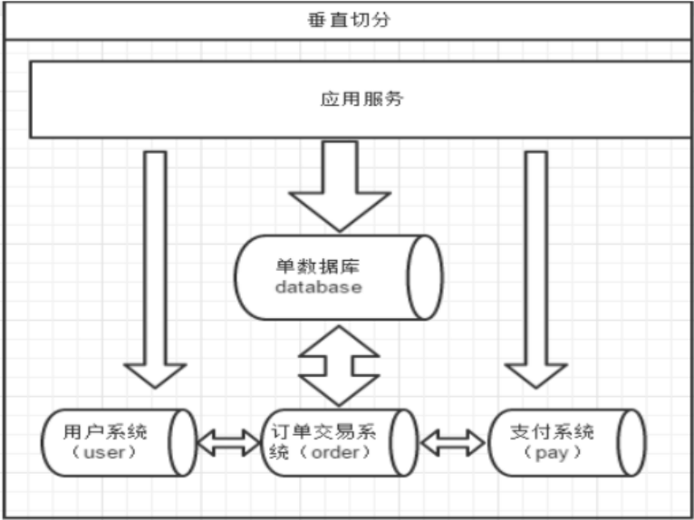

# 第4章_垂直拆分—分库

一个数据库由很多表的构成，每个表对应着不同的业务，垂直切分是指按照业务将表进行分类，分布到不同的数据库上面，这样也就将数据或者说压力分担到不同的库上面，如下图：



系统被切分成了用户、订单交易、支付几个模块。

## 1.如何划分表

一个问题：在两台主机上的两个数据库中的表，能否关联查询？

答案：**不可以关联查询**。

分库的原则：有紧密关联关系的表应该在一个库里，相互没有关联关系的表可以分到不同的库里。

```sql
#客户表 rows:20万
CREATE TABLE customer(
    id INT AUTO_INCREMENT,
    NAME VARCHAR(200),
    PRIMARY KEY(id)
);
#订单表 rows:600万
CREATE TABLE orders(
    id INT AUTO_INCREMENT,
    order_type INT,
    customer_id INT,
    amount DECIMAL(10,2),
    PRIMARY KEY(id)
);
#订单详细表 rows:600万
CREATE TABLE orders_detail(
    id INT AUTO_INCREMENT,
    detail VARCHAR(2000),
    order_id INT,
    PRIMARY KEY(id)
);
#订单状态字典表 rows:20
CREATE TABLE dict_order_type(
    id INT AUTO_INCREMENT,
    order_type VARCHAR(200),
    PRIMARY KEY(id)
);
```

以上四个表如何分库？客户表分在一个数据库，另外三张都需要关联查询，分在另外一个数据库。

## 2.实现分库

### 2.1 修改schema配置文件

```xml
…
<schema name="TESTDB" checkSQLschema="false" sqlMaxLimit="100" dataNode="dn1">
    <table name="customer" dataNode="dn2" ></table>
</schema>
<dataNode name="dn1" dataHost="host1" database="orders" />
<dataNode name="dn2" dataHost="host2" database="orders" />
<dataHost name="host1" maxCon="1000" minCon="10" balance="0"
          writeType="0" dbType="mysql" dbDriver="native" switchType="1"
          slaveThreshold="100">
    <heartbeat>select user()</heartbeat>
    <!-- can have multi write hosts -->
    <writeHost host="hostM1" url="192.168.11.101:3306" user="root"
               password="123123">
    </writeHost>
</dataHost>
<dataHost name="host2" maxCon="1000" minCon="10" balance="0"
          writeType="0" dbType="mysql" dbDriver="native" switchType="1"
          slaveThreshold="100">
    <heartbeat>select user()</heartbeat>
    <!-- can have multi write hosts -->
    <writeHost host="hostM2" url="192.168.11.105:3306" user="root"
               password="123123">
    </writeHost>
</dataHost>
…
```

> Linux 命令：
>
> `o`：在光标下一行新增一行并切换到插入模式
>
> `yy`：复制一行
>
> `p`：光标下一行新增一行并粘贴

### 2.2 新增两个空白库

分库操作不是在原来的老数据库上进行操作，需要准备两台机器分别安装新的数据库

```sql
#在数据节点 dn1、dn2 上分别创建数据库 orders
CREATE DATABASE orders;
```

### 2.3 启动 Mycat

```bash
./mycat console
```

### 2.4 访问 Mycat 

```bash
#访问 Mycat
mysql -umycat -p123456 -h 192.168.11.101 -P 8066
#切换到 TESTDB
#创建 4 张表
#查看表信息，可以看到成功分库

# master1
mysql> show tables;
+------------------+
| Tables_in_orders |
+------------------+
| dict_order_type  |
| orders           |
| orders_detail    |
+------------------+
3 rows in set (0.01 sec)

# master2
mysql> show tables;
+------------------+
| Tables_in_orders |
+------------------+
| customer         |
+------------------+
1 row in set (0.01 sec)
```

