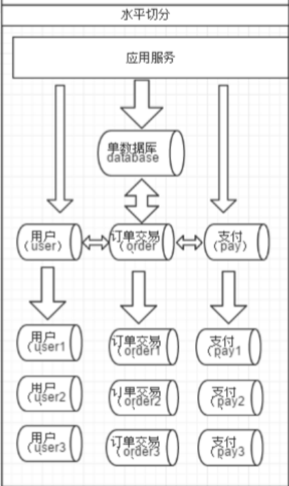
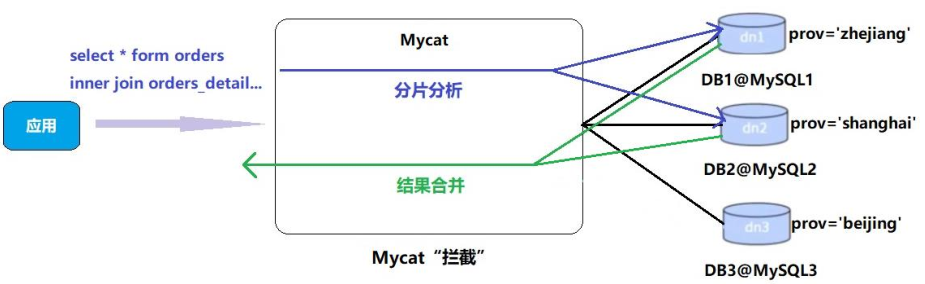

# 第5章_水平拆分——分表

相对于垂直拆分，水平拆分不是将表做分类，而是按照某个字段的某种规则来分散到多个库之中，每个表中包含一部分数据。简单来说，我们可以将数据的水平切分理解为是按照数据行的切分，就是将表中的某些行切分到一个数据库，而另外的某些行又切分到其他的数据库中，如图：



## 1.配置分表

**选择要拆分的表**

MySQL 单表存储数据条数是有瓶颈的，单表达到 1000 万条数据就达到了瓶颈，会影响查询效率，需要进行水平拆分（分表）进行优化。

例如：例子中的 orders、orders_detail 都已经达到 600 万行数据，需要进行分表优化。

**分表字段**

以 orders 表为例，可以根据不同自字段进行分表：

| 编号 | 分表字段 | 效果 |
| ---- | -------- | ---- |
|1 | id（主键、或创建时间）| 查询订单注重时效，历史订单被查询的次数少，如此分片会造成一个节点访问多，一个访问少，不平均 |
|2 | customer_id（客户 id） | 根据客户 id 去分，两个节点访问平均，一个客户的所有订单都在同一个节点|

**修改配置件文件schema.xml**

```xml
<?xml version="1.0"?>
<!DOCTYPE mycat:schema SYSTEM "schema.dtd">
<mycat:schema xmlns:mycat="http://io.mycat/">

    <schema name="TESTDB" checkSQLschema="false" sqlMaxLimit="100" dataNode="dn1">
        <table name="customer" dataNode="dn2" ></table>
        <!-- 为 orders 表设置数据节点为 dn1、dn2，并指定分片规则为 mod_rule（自定义的名字）-->
        <table name="orders" dataNode="dn1,dn2"rule="mod_rule" ></table>
    </schema>
    <dataNode name="dn1" dataHost="host1" database="orders" />
    <dataNode name="dn2" dataHost="host2" database="orders" />
    <dataHost name="host1" maxCon="1000" minCon="10" balance="0"
              writeType="0" dbType="mysql" dbDriver="native" switchType="1"  slaveThreshold="100">
        <heartbeat>select user()</heartbeat>
        <writeHost host="hostM1" url="192.168.11.101:3306" user="root"
                   password="root">
        </writeHost>
    </dataHost>
    <dataHost name="host2" maxCon="1000" minCon="10" balance="0"
              writeType="0" dbType="mysql" dbDriver="native" switchType="1"  slaveThreshold="100">
        <heartbeat>select user()</heartbeat>
        <writeHost host="hostM2" url="192.168.11.105:3306" user="root"
                   password="root">
        </writeHost>
    </dataHost>

</mycat:schema>
```

**修改配置文件rule.xml**

```xml
<!--
在 rule 配置文件里新增分片规则 mod_rule，并指定规则适用字段为 customer_id
还有选择分片算法 mod-long（对字段求模运算），customer_id 对两个节点求模，根据结果分片
配置算法 mod-long 参数 count 为 2，两个节点
-->
<tableRule name="mod_rule">
    <rule>
        <columns>customer_id</columns>
        <algorithm>mod-long</algorithm>
    </rule>
</tableRule>
…
<function name="mod-long" class="io.mycat.route.function.PartitionByMod">
    <!-- how many data nodes -->
    <property name="count">2</property>
</function>
```

**在数据节点dn2上建orders表**

```sql
CREATE TABLE orders(
    id INT AUTO_INCREMENT,
    order_type INT,
    customer_id INT,
    amount DECIMAL(10,2),
    PRIMARY KEY(id)
);
```

**重启Mycat，让配置生效**

**访问Mycat实现分片**

```sql
#在 mycat 里向 orders 表插入数据，INSERT 字段不能省略!
INSERT INTO orders(id,order_type,customer_id,amount) VALUES(1,101,100,100100);
INSERT INTO orders(id,order_type,customer_id,amount) VALUES(2,101,100,100300);
INSERT INTO orders(id,order_type,customer_id,amount) VALUES(3,101,101,120000);
INSERT INTO orders(id,order_type,customer_id,amount) VALUES(4,101,101,103000);
INSERT INTO orders(id,order_type,customer_id,amount) VALUES(5,102,101,100400);
INSERT INTO orders(id,order_type,customer_id,amount) VALUES(6,102,100,100020);

#在mycat、dn1、dn2中查看orders表数据，分表成功
# mycat
mysql> select * from orders;
+----+------------+-------------+-----------+
| id | order_type | customer_id | amount    |
+----+------------+-------------+-----------+
|  1 |        101 |         100 | 100100.00 |
|  2 |        101 |         100 | 100300.00 |
|  6 |        102 |         100 | 100020.00 |
|  3 |        101 |         101 | 120000.00 |
|  4 |        101 |         101 | 103000.00 |
|  5 |        102 |         101 | 100400.00 |
+----+------------+-------------+-----------+
6 rows in set (0.06 sec)

#dn1
mysql> select * from orders;
+----+------------+-------------+-----------+
| id | order_type | customer_id | amount    |
+----+------------+-------------+-----------+
|  1 |        101 |         100 | 100100.00 |
|  2 |        101 |         100 | 100300.00 |
|  6 |        102 |         100 | 100020.00 |
+----+------------+-------------+-----------+
3 rows in set (0.00 sec)

#dn2
mysql> select * from orders;
+----+------------+-------------+-----------+
| id | order_type | customer_id | amount    |
+----+------------+-------------+-----------+
|  3 |        101 |         101 | 120000.00 |
|  4 |        101 |         101 | 103000.00 |
|  5 |        102 |         101 | 100400.00 |
+----+------------+-------------+-----------+
3 rows in set (0.00 sec)
```

## 2.Mycat的分片“join”

Orders 订单表已经进行分表操作了，和它关联的 orders_detail 订单详情表如何进行 join 查询。

我们要对 orders_detail 也要进行分片操作。Join 的原理如下图：



### 2.1 ER表

Mycat 借鉴了 NewSQL 领域的新秀 Foundation DB 的设计思路，Foundation DB 创新性的提出了 Table Group 的概念，其将子表的存储位置依赖于主表，并且物理上紧邻存放，因此彻底解决了 JION 的效率和性能问题，根据这一思路，提出了基于`E-R 关系`的数据分片策略，子表的记录与所关联的父表记录存放在同一个数据分片上。

```xml
<!-- 修改 schema.xml 配置文件 -->
…
<table name="orders" dataNode="dn1,dn2" rule="mod_rule" >
    <!--
		name：需要关联的表的名称
		id：主表的主键
		joinKey：副表中与主表关联的键
		id：主表中与副表关联的键
	-->
    <childTable name="orders_detail" primaryKey="id" joinKey="order_id" parentKey="id" />
</table>
…
```

```sql
#在 dn2 创建 orders_detail 表
CREATE TABLE orders_detail(
    id INT AUTO_INCREMENT,
    detail VARCHAR(2000),
    order_id INT,
    PRIMARY KEY(id)
);
#重启 Mycat
#访问 Mycat 向 orders_detail 表插入数据
INSERT INTO orders_detail(id,detail,order_id) values(1,'detail1',1);
INSERT INTO orders_detail(id,detail,order_id) VALUES(2,'detail1',2);
INSERT INTO orders_detail(id,detail,order_id) VALUES(3,'detail1',3);
INSERT INTO orders_detail(id,detail,order_id) VALUES(4,'detail1',4);
INSERT INTO orders_detail(id,detail,order_id) VALUES(5,'detail1',5);
INSERT INTO orders_detail(id,detail,order_id) VALUES(6,'detail1',6);
#在mycat、dn1、dn2中运行两个表join语句，发现可以正常查询
Select o.*,od.detail from orders o inner join orders_detail od on o.id=od.order_id;
```

### 2.2 全局表

在分片的情况下，当业务表因为规模而进行分片以后，业务表与这些附属的字典表之间的关联，就成了比较棘手的问题，考虑到字典表具有以下几个特性：

- 变动不频繁
- 数据量总体变化不大
- 数据规模不大，很少有超过数十万条记录

鉴于此，Mycat 定义了一种特殊的表，称之为`全局表`，全局表具有以下特性：

- 全局表的插入、更新操作会实时在所有节点上执行，保持各个分片的数据一致性
- 全局表的查询操作，只从一个节点获取
- 全局表可以跟任何一个表进行 JOIN 操作

将字典表或者符合字典表特性的一些表定义为全局表，则从另外一个方面，很好的解决了数据 JOIN 的难题。通过全局表+基于 E-R 关系的分片策略，Mycat 可以满足 80% 以上的企业应用开发。

```xml
<!-- 修改 schema.xml 配置文件 -->
…
<table name="orders" dataNode="dn1,dn2" rule="mod_rule" >
    <childTable name="orders_detail" primaryKey="id" joinKey="order_id" parentKey="id" />
</table>
<table name="dict_order_type" dataNode="dn1,dn2" type="global" ></table>
…
```

```sql
#在 dn2 创建 dict_order_type 表
CREATE TABLE dict_order_type(
    id INT AUTO_INCREMENT,
    order_type VARCHAR(200),
    PRIMARY KEY(id)
);

#重启 Mycat
mysql -umycat -p123456 -h 192.168.11.101 -P 8066

#访问 Mycat 向 dict_order_type 表插入数据
INSERT INTO dict_order_type(id,order_type) VALUES(101,'type1');
INSERT INTO dict_order_type(id,order_type) VALUES(102,'type2');

#在Mycat、dn1、dn2中查询表数据，均可以查询到两条数据
mysql> select * from dict_order_type;
+-----+------------+
| id  | order_type |
+-----+------------+
| 101 | type1      |
| 102 | type2      |
+-----+------------+
2 rows in set (0.10 sec)
```

## 3.常用分片规则

### 3.1 取模

此规则为对分片字段求摸运算。也是水平分表最常用规则。配置分表中，orders 表采用了此规则。

### 3.2 分片枚举

通过在配置文件中配置可能的枚举 id，自己配置分片，本规则适用于特定的场景，比如有些业务需要按照省份或区县来做保存，而全国省份区县固定的，这类业务使用本条规则。

**（1）修改schema.xml配置文件**

```xml
<table name="orders_ware_info" dataNode="dn1,dn2" rule="sharding_by_intfile" ></table>
```

**（2）修改rule.xml配置文件**

```xml
<tableRule name="sharding_by_intfile">
    <rule>
        <!-- columns：分片字段，algorithm：分片函数 -->
        <columns>areacode</columns>
        <algorithm>hash-int</algorithm>
    </rule>
</tableRule>
…
<!--
mapFile：标识配置文件名称，type：0为int型、非0为String
defaultNode：默认节点:小于 0 表示不设置默认节点，大于等于 0 表示设置默认节点，设置默认节点如果碰到不识别的枚举值，就让它路由到默认节点，如不设置不识别就报错
-->
<function name="hash-int" class="io.mycat.route.function.PartitionByFileMap">
    <property name="mapFile">partition-hash-int.txt</property>
    <property name="type">1</property>
    <property name="defaultNode">0</property>
</function>
```

**（3）修改partition-hash-int.txt配置文件**

```bash
110=0 # 110 放在 node1
120=1 # 120 放在 node2
```

**（4）重启Mycat**

**（5）访问Mycat创建表**

```sql
# 订单归属区域信息表
CREATE TABLE orders_ware_info
(
    `id` INT AUTO_INCREMENT comment '编号',
    `order_id` INT comment '订单编号',
    `address` VARCHAR(200) comment '地址',
    `areacode` VARCHAR(20) comment '区域编号',
    PRIMARY KEY(id)
);
```

**（6）插入数据**

```sql
INSERT INTO orders_ware_info(id, order_id,address,areacode) VALUES (1,1,'北京','110');
INSERT INTO orders_ware_info(id, order_id,address,areacode) VALUES (2,2,'天津','120');
```

**（7）查询Mycat、dn1、dn2可以看到数据分片效果**

```sql
# mycat
mysql> select * from orders_ware_info;
+----+----------+---------+----------+
| id | order_id | address | areacode |
+----+----------+---------+----------+
|  1 |        1 | 北京    | 110      |
|  2 |        2 | 天津    | 120      |
+----+----------+---------+----------+
2 rows in set (0.05 sec)

# dn1
mysql> select * from orders_ware_info;
+----+----------+---------+----------+
| id | order_id | address | areacode |
+----+----------+---------+----------+
|  1 |        1 | 北京    | 110      |
+----+----------+---------+----------+
1 row in set (0.00 sec)

# dn2
mysql> select * from orders_ware_info;
+----+----------+---------+----------+
| id | order_id | address | areacode |
+----+----------+---------+----------+
|  2 |        2 | 天津    | 120      |
+----+----------+---------+----------+
1 row in set (0.00 sec)
```

### 3.3 范围约定

此分片适用于，提前规划好分片字段某个范围属于哪个分片。

**（1）修改schema.xml配置文件**

```xml
<table name="payment_info" dataNode="dn1,dn2" rule="auto_sharding_long" ></table>
```

**（2）修改rule.xml配置文件**

```xml
<tableRule name="auto_sharding_long">
    <rule>
        <columns>order_id</columns>
        <algorithm>rang-long</algorithm>
    </rule>
</tableRule>
…
<function name="rang-long" class="io.mycat.route.function.AutoPartitionByLong">
    <property name="mapFile">autopartition-long.txt</property>
    <property name="defaultNode">0</property>
</function>
```

**（3）修改autopartition-long.txt配置文件**

```bash
0-102=0
103-200=1
```

**（4）重启Mycat**

**（5）访问Mycat创建表**

```sql
#支付信息表
CREATE TABLE payment_info
(
    `id` INT AUTO_INCREMENT comment '编号',
    `order_id` INT comment '订单编号',
    `payment_status` INT comment '支付状态',
    PRIMARY KEY(id)
);
```

**（6）插入数据**

```sql
INSERT INTO payment_info (id,order_id,payment_status) VALUES (1,101,0);
INSERT INTO payment_info (id,order_id,payment_status) VALUES (2,102,1);
INSERT INTO payment_info (id,order_id ,payment_status) VALUES (3,103,0);
INSERT INTO payment_info (id,order_id,payment_status) VALUES (4,104,1);
```

**（7）查询Mycat、dn1、dn2可以看到数据分片效果**

```sql
# mycat
mysql> select * from payment_info;
+----+----------+----------------+
| id | order_id | payment_status |
+----+----------+----------------+
|  1 |      101 |              0 |
|  2 |      102 |              1 |
|  3 |      103 |              0 |
|  4 |      104 |              1 |
+----+----------+----------------+
4 rows in set (0.05 sec)

# dn1
mysql> select * from payment_info;
+----+----------+----------------+
| id | order_id | payment_status |
+----+----------+----------------+
|  1 |      101 |              0 |
|  2 |      102 |              1 |
+----+----------+----------------+
2 rows in set (0.00 sec)

# dn2
mysql> select * from payment_info;
+----+----------+----------------+
| id | order_id | payment_status |
+----+----------+----------------+
|  3 |      103 |              0 |
|  4 |      104 |              1 |
+----+----------+----------------+
2 rows in set (0.00 sec)
```

### 3.4 按日期（天）分片

此规则为按天分片，设定时间格式、范围。

**（1）修改schema.xml配置文件**

```xml
<table name="login_info" dataNode="dn1,dn2" rule="sharding_by_date" ></table>
```

**（2）修改rule.xml配置文件**

```xml
<tableRule name="sharding_by_date">
    <rule>
        <columns>login_date</columns>
        <algorithm>shardingByDate</algorithm>
    </rule>
</tableRule>
…
<!--
dateFormat ：日期格式
sBeginDate ：开始日期
sEndDate：结束日期,则代表数据达到了这个日期的分片后循环从开始分片插入
sPartionDay ：分区天数，即默认从开始日期算起，分隔 2 天一个分区
-->
<function name="shardingByDate" class="io.mycat.route.function.PartitionByDate">
    <property name="dateFormat">yyyy-MM-dd</property>
    <property name="sBeginDate">2019-01-01</property>
    <property name="sEndDate">2019-01-04</property>
    <property name="sPartionDay">2</property>
</function>
```

**（3）重启Mycat**

**（4）访问Mycat创建表**

```sql
#用户信息表
CREATE TABLE login_info
(
    `id` INT AUTO_INCREMENT comment '编号',
    `user_id` INT comment '用户编号',
    `login_date` date comment '登录日期',
    PRIMARY KEY(id)
);
```

**（6）插入数据**

```sql
INSERT INTO login_info(id,user_id,login_date) VALUES (1,101,'2019-01-01');
INSERT INTO login_info(id,user_id,login_date) VALUES (2,102,'2019-01-02');
INSERT INTO login_info(id,user_id,login_date) VALUES (3,103,'2019-01-03');
INSERT INTO login_info(id,user_id,login_date) VALUES (4,104,'2019-01-04');
INSERT INTO login_info(id,user_id,login_date) VALUES (5,103,'2019-01-05');
INSERT INTO login_info(id,user_id,login_date) VALUES (6,104,'2019-01-06');
```

**（7）查询Mycat、dn1、dn2可以看到数据分片效果**

```sql
# mycat
mysql> select * from login_info;
+----+---------+------------+
| id | user_id | login_date |
+----+---------+------------+
|  1 |     101 | 2019-01-01 |
|  2 |     102 | 2019-01-02 |
|  5 |     103 | 2019-01-05 |
|  6 |     104 | 2019-01-06 |
|  3 |     103 | 2019-01-03 |
|  4 |     104 | 2019-01-04 |
+----+---------+------------+
6 rows in set (0.05 sec)

# dn1
mysql> select * from login_info;
+----+---------+------------+
| id | user_id | login_date |
+----+---------+------------+
|  1 |     101 | 2019-01-01 |
|  2 |     102 | 2019-01-02 |
|  5 |     103 | 2019-01-05 |
|  6 |     104 | 2019-01-06 |
+----+---------+------------+
4 rows in set (0.00 sec)

#dn2
mysql> select * from login_info;
+----+---------+------------+
| id | user_id | login_date |
+----+---------+------------+
|  3 |     103 | 2019-01-03 |
|  4 |     104 | 2019-01-04 |
+----+---------+------------+
2 rows in set (0.00 sec)
```

> 若插入日期小于`2019-01-01`，则会报错：
>
> ```sql
> mysql> INSERT INTO login_info(id,user_id,login_date) VALUES (6,104,'2018-01-06');
> ERROR 1064 (HY000): Can't find a valid data node for specified node index :LOGIN_INFO -> LOGIN_DATE -> 2018-01-06 -> Index : -180
> ```

## 4.全局序列

在实现分库分表的情况下，数据库自增主键已无法保证自增主键的全局唯一。为此，Mycat 提供了全局 sequence，并且提供了包含本地配置和数据库配置等多种实现方式。

### 4.1 本地文件

此方式 Mycat 将 sequence 配置到文件中，当使用到 sequence 中的配置后，Mycat 会更下 classpath 中的 sequence_conf.properties 文件中 sequence 当前的值。

- 优点：本地加载，读取速度较快
- 缺点：抗风险能力差，Mycat 所在主机宕机后，无法读取本地文件

### 4.2 数据库方式（推荐）

利用数据库一个表来进行计数累加。但是并不是每次生成序列都读写数据库，这样效率太低。Mycat 会预加载一部分号段到 Mycat 的内存中，这样大部分读写序列都是在内存中完成的。如果内存中的号段用完了 Mycat 会再向数据库要一次。

问：那如果 Mycat 崩溃了 ，那内存中的序列岂不是都没了？

是的。如果是这样，那么 Mycat 启动后会向数据库申请新的号段，原有号段会弃用。也就是说如果 Mycat 重启，那么损失是当前的号段没用完的号码，但是不会因此出现主键重复

**（1）建库序列脚本**

```sql
#在 dn1 上创建全局序列表
CREATE TABLE MYCAT_SEQUENCE (
    NAME VARCHAR(50) NOT NULL,
    current_value INT NOT NULL,
    increment INT NOT NULL DEFAULT 100,
    PRIMARY KEY(NAME)
) ENGINE=INNODB;

#创建全局序列所需函数
DELIMITER $$
    CREATE FUNCTION mycat_seq_currval(seq_name VARCHAR(50)) RETURNS VARCHAR(64)
    DETERMINISTIC
    BEGIN
        DECLARE retval VARCHAR(64);
        SET retval="-999999999,null";
        SELECT CONCAT(CAST(current_value AS CHAR),",",CAST(increment AS CHAR)) INTO retval FROM MYCAT_SEQUENCE WHERE NAME = seq_name;
        RETURN retval;
    END $$
DELIMITER ;

DELIMITER $$
CREATE FUNCTION mycat_seq_setval(seq_name VARCHAR(50),VALUE INTEGER) RETURNS VARCHAR(64)
    DETERMINISTIC
    BEGIN
        UPDATE MYCAT_SEQUENCE
        SET current_value = VALUE
        WHERE NAME = seq_name;
        RETURN mycat_seq_currval(seq_name);
    END $$
DELIMITER ;

DELIMITER $$
    CREATE FUNCTION mycat_seq_nextval(seq_name VARCHAR(50)) RETURNS VARCHAR(64)
    DETERMINISTIC
    BEGIN
        UPDATE MYCAT_SEQUENCE
        SET current_value = current_value + increment WHERE NAME = seq_name;
        RETURN mycat_seq_currval(seq_name);
    END $$
DELIMITER ;

#初始化序列表记录
INSERT INTO MYCAT_SEQUENCE(NAME,current_value,increment) VALUES ('ORDERS', 400000, 100);
```

**（2）修改 Mycat 配置**

```bash
# 1.修改 sequence_db_conf.properties
vim sequence_db_conf.properties

GLOBAL=dn1
COMPANY=dn1
CUSTOMER=dn1
# 意思是 ORDERS 这个序列在 dn1 这个节点上，具 体dn1 节点是哪台机子，请参考 schema.xml
ORDERS=dn1

# 2.修改 server.xml
vim server.xml

# 全局序列类型：0-本地文件，1-数据库方式，2-时间戳方式。此处应该修改成1。
<property name="sequnceHandlerType">2</property>

# 重启Mycat
```

**（3）验证全局序列**

```sql
#登录 Mycat，插入数据
insert into orders(id,amount,customer_id,order_type) values(next value for MYCATSEQ_ORDERS, 1000, 101, 102);
#查询数据
#重启Mycat后，再次插入数据，再查询
```

### 4.3 时间戳方式

全局序列 ID = 64 位二进制 (42(毫秒) + 5(机器 ID) + 5(业务编码) + 12(重复累加) 换算成十进制为 18 位数的 long 类型，每毫秒可以并发 12 位二进制的累加。

- 优点：配置简单
- 缺点：18 位 ID 过长

### 4.4 自主生成全局序列

可在 java 项目里自己生成全局序列，如下：

- 根据业务逻辑组合
- 可以利用 redis 的单线程原子性 incr 来生成序列

但自主生成需要单独在工程中用 java 代码实现，还是推荐使用 Mycat 自带全局序列。

