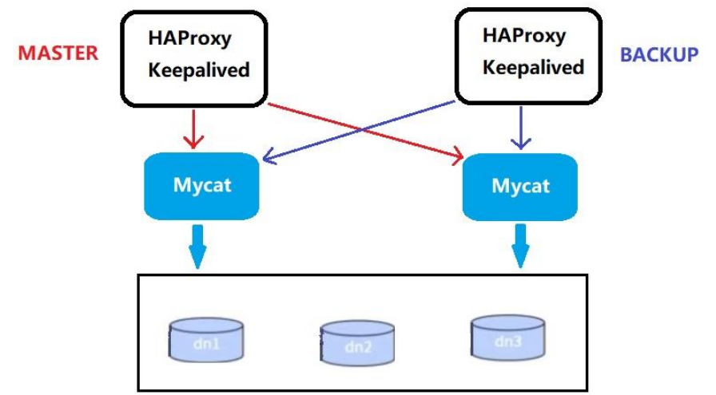
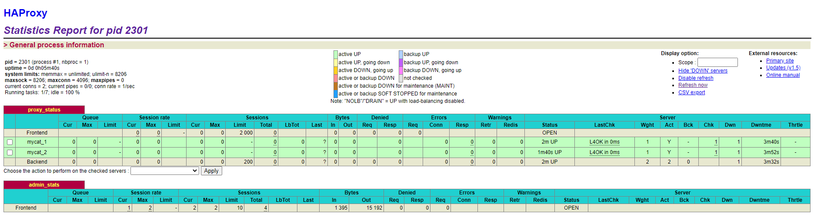

# 第6章_基于HA机制的Mycat高可用

在实际项目中，Mycat 服务也需要考虑高可用性，如果 Mycat 所在服务器出现宕机，或 Mycat 服务故障，需要有备机提供服务，需要考虑 Mycat 集群。

## 1.高可用方案

我们可以使用 HAProxy +  Keepalived 配合两台 Mycat 搭起 Mycat 集群，实现高可用性。HAProxy 实现了 MyCat 多节点的集群高可用和负载均衡， 而 HAProxy 自身的高可用则可以通过 Keepalived 来实现。



| 编号 | 角色 | IP地址 | 机器名 |
| ---- | ---- | ---- | ------ |
|1 | Mycat1 | 192.168.11.101 | myServer1 |
|2  |Mycat2 | 192.168.11.105 | myServer5 |
|3 | HAProxy（master）| 192.168.11.102 | myServer2 |
|4|  Keepalived（master）| 192.168.11.102 | myServer2 |
|5 | HAProxy（backup）| 192.168.11.103 | myServer3 |
|6|  Keepalived（backup）| 192.168.11.103 | myServer3 |

## 2.安装配置 HAProxy

### 2.1 安装 HAProxy

**（1）准备好HAProxy安装包，传到/opt目录下**

**（2）解压到/usr/local/src**

```bash
tar -zxvf haproxy-1.5.18.tar.gz -C /usr/local/src
```

**（3）进入解压后的目录，查看内核版本，进行编译**

```bash
cd /usr/local/src/haproxy-1.5.18
# 查看 linux 内核版本
uname -r
make TARGET=linux310 PREFIX=/usr/local/haproxy ARCH=x86_64
# TARGET=linux310，内核版本，使用uname -r查看内核，如：3.10.0-514.el7，此时该参数就为linux310
# ARCH=x86_64，系统位数
# PREFIX=/usr/local/haprpxy #/usr/local/haprpxy，为haprpxy安装路径
```

**（4）编译完成后，进行安装**

```bash
make install PREFIX=/usr/local/haproxy
```

> 以上步骤可通过执行`yum install haproxy`完成

**（5）安装完成后，创建目录、创建HAProxy配置文件**

```bash
mkdir -p /usr/data/haproxy/
vim /usr/local/haproxy/haproxy.conf
```

**（6）向配置文件中插入以下配置信息,并保存**

```bash
global
	log 127.0.0.1 local0
	#log 127.0.0.1 local1 notice
	#log loghost local0 info
	maxconn 4096
	chroot /usr/local/haproxy
	pidfile /usr/data/haproxy/haproxy.pid
	uid 99
	gid 99
	daemon
	#debug
	#quiet
defaults
	log global
	mode tcp
	option abortonclose
	option redispatch
	retries 3
	maxconn 2000
	timeout connect 5000
	timeout client 50000
	timeout server 50000

# 监听端口配置
listen proxy_status
	bind :48066
	mode tcp
	balance roundrobin
	server mycat_1 192.168.11.101:8066 check inter 10s
	server mycat_2 192.168.11.105:8066 check inter 10s
	
# 前端可视化界面配置
frontend admin_stats
	bind :7777
	mode http
	stats enable
	option httplog
	maxconn 10
	stats refresh 30s
	stats uri /admin
	stats auth admin:123123
	stats hide-version
	stats admin if TRUE
```

### 2.2 启动验证

**（1）启动HAProxy**

```bash
/usr/sbin/haproxy -f /usr/local/haproxy/haproxy.conf
```

**（2）查看HAProxy进程**

```bash
ps -ef|grep haproxy
```

**（3）打开浏览器访问**

http://192.168.11.102:7777/admin

在弹出框输入用户名：admin密码：123123，如果 Mycat 主备机均已启动，则可以看到如下图：



**（4）验证负载均衡，通过HAProxy访问Mycat**

```sql
[root@myServer2 mysql8.0]# mysql -umycat -p123456 -h 192.168.11.102 -P 48066
mysql: [Warning] Using a password on the command line interface can be insecure.
Welcome to the MySQL monitor.  Commands end with ; or \g.
Your MySQL connection id is 1
# 可以发现使用 mycat 登录！
Server version: 5.6.29-mycat-1.6.7.1-release-20190627191042 MyCat Server (OpenCloudDB)
```

## 3.配置 Keepalived

### 3.1 安装 Keepalived

**（1）准备好Keepalived安装包，传到/opt目录下**

**（2）解压到/usr/local/src**

```bash
tar -zxvf keepalived-2.2.7.tar.gz -C /usr/local/src
```

**（3）安装依赖插件**

```bash
yum install -y gcc openssl-devel popt-devel
```

**（3）进入解压后的目录，进行配置，进行编译**

```bash
cd /usr/local/src/keepalived-2.2.7
./configure --prefix=/usr/local/keepalived
```

**（4）进行编译，完成后进行安装**

```bash
make && make install
```

> 或者直接运行指令：`yum install keepalived`

**（5）运行前配置**

```bash
cp /usr/local/src/keepalived-2.2.7/keepalived/etc/init.d/keepalived /etc/init.d/
mkdir /etc/keepalived
cp /usr/local/keepalived/etc/keepalived/keepalived.conf.sample /etc/keepalived/
cp /usr/local/src/keepalived-2.2.7/keepalived/etc/sysconfig/keepalived /etc/sysconfig/
cp /usr/local/keepalived/sbin/keepalived /usr/sbin/
```

**（6）修改配置文件**

```bash
vim /etc/keepalived/keepalived.conf

#修改内容如下
! Configuration File for keepalived
global_defs {
	notification_email {
		xlcocoon@foxmail.com
	}
	notification_email_from keepalived@showjoy.com
	smtp_server 127.0.0.1
	smtp_connect_timeout 30
	router_id LVS_DEVEL
	vrrp_skip_check_adv_addr
	vrrp_garp_interval 0
	vrrp_gna_interval 0
}
vrrp_instance VI_1 {
	#主机配MASTER，备机配BACKUP
	state MASTER
	#所在机器网卡：ifconfig
	interface ens33
	virtual_router_id 51
	#数值越大优先级越高
	priority 100
	advert_int 1
	authentication {
		auth_type PASS
		auth_pass 1111
	}
	virtual_ipaddress {
		#虚拟IP
		192.168.11.200
	}
}
virtual_server 192.168.11.200 48066 {
	delay_loop 6
	lb_algo rr
	lb_kind NAT
	persistence_timeout 50
	protocol TCP

	real_server 192.168.11.103 48066 {
		weight 1
		TCP_CHECK {
			connect_timeout 3
			retry 3
			delay_before_retry 3
		}
	}
	real_server 192.168.11.102 48600 {
		weight 1
		TCP_CHECK {
			connect_timeout 3
			nb_get_retry 3
			delay_before_retry 3
		}
	}
}
```

### 3.2 启动验证

**（1）启动Keepalived**

```bash
service keepalived start
```

**（2）登录验证**

```bash
mysql -umycat -p123456 -h 192.168.11.200 -P 48066
```

## 4.测试高可用

### 测试步骤

**（1）关闭mycat**

**（2）通过虚拟ip查询数据**

```bash
mysql -umycat -p123456 -h 192.168.140.200 -P 48066
```

```sql
mysql> show tables;
ERROR 2013 (HY000): Lost connection to MySQL server during query
No connection. Trying to reconnect...
Connection id:    1
Current database: TESTDB

+------------------+
| Tables_in_orders |
+------------------+
| customer         |
| dict_order_type  |
| login_info       |
| orders           |
| orders_detail    |
| orders_ware_info |
| payment_info     |
+------------------+
7 rows in set (0.06 sec)
```

