# 第02章_MySQL环境搭建

讲师：尚硅谷 宋红康（江湖人称：康师傅）

官网：[http://www.atguigu.com](http://www.atguigu.com/)

***

## 1. MySQL的卸载

### 步骤1：停止MySQL服务

在卸载之前，先停止MySQL8.0的服务。按键盘上的“Ctrl + Alt + Delete”组合键，打开“任务管理器”对话框，可以在“服务”列表找到“MySQL8.0”的服务，如果现在“正在运行”状态，可以右键单击服务，选择“停止”选项停止MySQL8.0的服务，如图所示。


### 步骤2：软件的卸载

**方式1：通过控制面板方式**

卸载MySQL8.0的程序可以和其他桌面应用程序一样直接在“控制面板”选择“卸载程序”，并在程序列表中找到MySQL8.0服务器程序，直接双击卸载即可，如图所示。这种方式删除，数据目录下的数据不会跟着删除。


**方式2：通过360或电脑管家等软件卸载**

略

**方式3：通过安装包提供的卸载功能卸载**

你也可以通过安装向导程序进行MySQL8.0服务器程序的卸载。

① 再次双击下载的mysql-installer-community-8.0.26.0.msi文件，打开安装向导。安装向导会自动检测已安装的MySQL服务器程序。

② 选择要卸载的MySQL服务器程序，单击“Remove”（移除），即可进行卸载。


③ 单击“Next”（下一步）按钮，确认卸载。

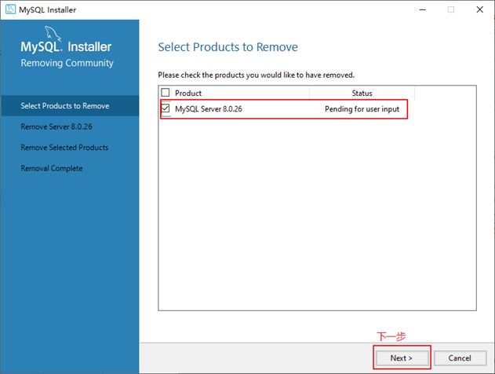

④ 弹出是否同时移除数据目录选择窗口。如果想要同时删除MySQL服务器中的数据，则勾选“Remove the data directory”，如图所示。


⑤ 执行卸载。单击“Execute”（执行）按钮进行卸载。


⑥ 完成卸载。单击“Finish”（完成）按钮即可。如果想要同时卸载MySQL8.0的安装向导程序，勾选“Yes，Uninstall MySQL Installer”即可，如图所示。


### 步骤3：残余文件的清理

如果再次安装不成功，可以卸载后对残余文件进行清理后再安装。

（1）服务目录：mysql服务的安装目录

（2）数据目录：默认在C:\ProgramData\MySQL

如果自己单独指定过数据目录，就找到自己的数据目录进行删除即可，可通过 `mysql>show variables like '%datadir%';` 查看

> 注意：请在卸载前做好数据备份
>
> 在操作完以后，需要重启计算机，然后进行安装即可。**如果仍然安装失败，需要继续操作如下步骤4。**

### 步骤4：清理注册表（选做）

如果前几步做了，再次安装还是失败，那么可以清理注册表。

如何打开注册表编辑器：在系统的搜索框中输入`regedit`

```
HKEY_LOCAL_MACHINE\SYSTEM\ControlSet001\Services\Eventlog\Application\MySQL服务 目录删除

HKEY_LOCAL_MACHINE\SYSTEM\ControlSet001\Services\MySQL服务 目录删除

HKEY_LOCAL_MACHINE\SYSTEM\ControlSet002\Services\Eventlog\Application\MySQL服务 目录删除

HKEY_LOCAL_MACHINE\SYSTEM\ControlSet002\Services\MySQL服务 目录删除

HKEY_LOCAL_MACHINE\SYSTEM\CurrentControlSet\Services\Eventlog\Application\MySQL服务目录删除

HKEY_LOCAL_MACHINE\SYSTEM\CurrentControlSet\Services\MySQL服务删除
```

> 注册表中的ControlSet001,ControlSet002,不一定是001和002,可能是ControlSet005、006之类

### 步骤5：删除环境变量配置

找到path环境变量，将其中关于mysql的环境变量删除，**切记不要全部删除。**

例如：删除  D:\develop_tools\mysql\MySQLServer8.0.26\bin;  这个部分

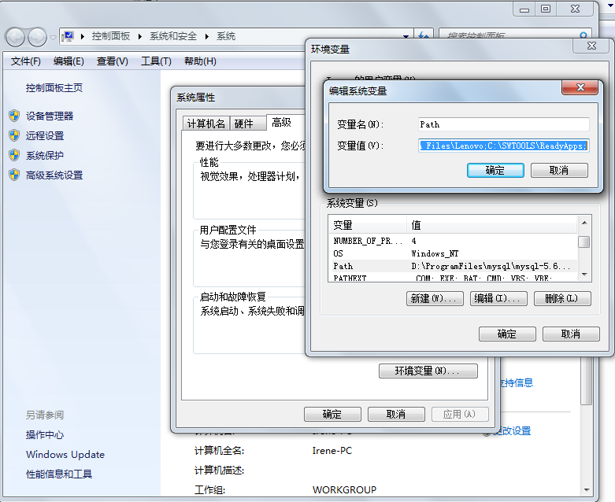


## 2. MySQL的下载、安装、配置

### 2.1 MySQL的4大版本

> - **MySQL Community Server 社区版本**，开源免费，自由下载，但不提供官方技术支持，适用于大多数普通用户。
>
> - **MySQL Enterprise Edition 企业版本**，需付费，不能在线下载，可以试用30天。提供了更多的功能和更完备的技术支持，更适合于对数据库的功能和可靠性要求较高的企业客户。
> - **MySQL Cluster 集群版**，开源免费。用于架设集群服务器，可将几个MySQL Server封装成一个Server。需要在社区版或企业版的基础上使用。
> - **MySQL Cluster CGE 高级集群版**，需付费。

- 目前最新版本为`8.0.27`，发布时间`2021年10月`。此前，8.0.0 在 2016.9.12日就发布了。


- 本课程中使用`8.0.26版本`。

此外，官方还提供了`MySQL Workbench`（GUITOOL）一款专为MySQL设计的`图形界面管理工具`。MySQLWorkbench又分为两个版本，分别是`社区版`（MySQL Workbench OSS）、`商用版`（MySQL WorkbenchSE）。

### 2.2 软件的下载

**1. 下载地址**

官网：[https://www.mysql.com](https://www.mysql.com/)

**2. 打开官网，点击DOWNLOADS**

然后，点击`MySQL Community(GPL) Downloads`

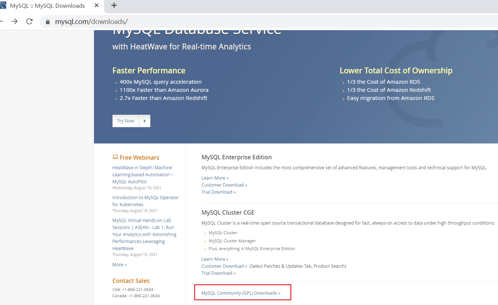

**3. 点击 MySQL Community Server**

 

**4. 在General Availability(GA) Releases中选择适合的版本**

Windows平台下提供两种安装文件：MySQL二进制分发版（.msi安装文件）和免安装版（.zip压缩文件）。一般来讲，应当使用二进制分发版，因为该版本提供了图形化的安装向导过程，比其他的分发版使用起来要简单，不再需要其他工具启动就可以运行MySQL。

- 这里在Windows 系统下推荐下载`MSI安装程序`；点击`Go to Download Page`进行下载即可

 

 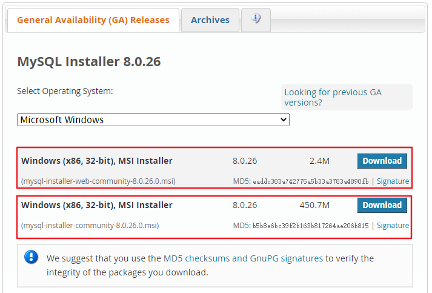

- Windows下的MySQL8.0安装有两种安装程序
  - `mysql-installer-web-community-8.0.26.0.msi` 下载程序大小：2.4M；安装时需要联网安装组件。
  - `mysql-installer-community-8.0.26.0.msi` 下载程序大小：450.7M；安装时离线安装即可。**推荐。**
- 如果安装MySQL5.7版本的话，选择`Archives`，接着选择MySQL5.7的相应版本即可。这里下载最近期的MySQL5.7.34版本。

 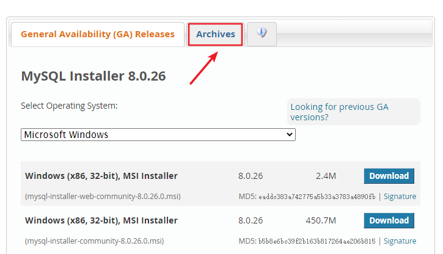


### 2.3 MySQL8.0 版本的安装

MySQL下载完成后，找到下载文件，双击进行安装，具体操作步骤如下。

步骤1：双击下载的mysql-installer-community-8.0.26.0.msi文件，打开安装向导。

步骤2：打开“Choosing a Setup Type”（选择安装类型）窗口，在其中列出了5种安装类型，分别是Developer Default（默认安装类型）、Server only（仅作为服务器）、Client only（仅作为客户端）、Full（完全安装）、Custom（自定义安装）。这里选择“Custom（自定义安装）”类型按钮，单击“Next(下一步)”按钮。


步骤3：打开“Select Products” （选择产品）窗口，可以定制需要安装的产品清单。例如，选择“MySQL Server 8.0.26-X64”后，单击“→”添加按钮，即可选择安装MySQL服务器，如图所示。采用通用的方法，可以添加其他你需要安装的产品。


此时如果直接“Next”（下一步），则产品的安装路径是默认的。如果想要自定义安装目录，则可以选中对应的产品，然后在下面会出现“Advanced Options”（高级选项）的超链接。


单击“Advanced Options”（高级选项）则会弹出安装目录的选择窗口，如图所示，此时你可以分别设置MySQL的服务程序安装目录和数据存储目录。如果不设置，默认分别在C盘的Program Files目录和ProgramData目录（这是一个隐藏目录）。如果自定义安装目录，请避免“中文”目录。另外，建议服务目录和数据目录分开存放。


步骤4：在上一步选择好要安装的产品之后，单击“Next”（下一步）进入确认窗口，如图所示。单击“Execute”（执行）按钮开始安装。


步骤5：安装完成后在“Status”（状态）列表下将显示“Complete”（安装完成），如图所示。


### 2.4 配置MySQL8.0

MySQL安装之后，需要对服务器进行配置。具体的配置步骤如下。

步骤1：在上一个小节的最后一步，单击“Next”（下一步）按钮，就可以进入产品配置窗口。


步骤2：单击“Next”（下一步）按钮，进入MySQL服务器类型配置窗口，如图所示。端口号一般选择默认端口号3306。


其中，“Config Type”选项用于设置服务器的类型。单击该选项右侧的下三角按钮，即可查看3个选项，如图所示。


- `Development Machine（开发机器）`：该选项代表典型个人用桌面工作站。此时机器上需要运行多个应用程序，那么MySQL服务器将占用最少的系统资源。

- `Server Machine（服务器）`：该选项代表服务器，MySQL服务器可以同其他服务器应用程序一起运行，例如Web服务器等。MySQL服务器配置成适当比例的系统资源。

- `Dedicated Machine（专用服务器）`：该选项代表只运行MySQL服务的服务器。MySQL服务器配置成使用所有可用系统资源。

步骤3：单击“Next”（下一步）按钮，打开设置授权方式窗口。其中，上面的选项是MySQL8.0提供的新的授权方式，采用SHA256基础的密码加密方法；下面的选项是传统授权方法（保留5.x版本兼容性）。


步骤4：单击“Next”（下一步）按钮，打开设置服务器root超级管理员的密码窗口，如图所示，需要输入两次同样的登录密码。也可以通过“Add User”添加其他用户，添加其他用户时，需要指定用户名、允许该用户名在哪台/哪些主机上登录，还可以指定用户角色等。此处暂不添加用户，用户管理在MySQL高级特性篇中讲解。


步骤5：单击“Next”（下一步）按钮，打开设置服务器名称窗口，如图所示。该服务名会出现在Windows服务列表中，也可以在命令行窗口中使用该服务名进行启动和停止服务。本书将服务名设置为“MySQL80”。如果希望开机自启动服务，也可以勾选“Start the MySQL Server at System Startup”选项（推荐）。

下面是选择以什么方式运行服务？可以选择“Standard System Account”(标准系统用户)或者“Custom User”(自定义用户)中的一个。这里推荐前者。


步骤6：单击“Next”（下一步）按钮，打开确认设置服务器窗口，单击“Execute”（执行）按钮。


步骤7：完成配置，如图所示。单击“Finish”（完成）按钮，即可完成服务器的配置。


步骤8：如果还有其他产品需要配置，可以选择其他产品，然后继续配置。如果没有，直接选择“Next”（下一步），直接完成整个安装和配置过程。


步骤9：结束安装和配置。


### 2.5 配置MySQL8.0 环境变量

如果不配置MySQL环境变量，就不能在命令行直接输入MySQL登录命令。下面说如何配置MySQL的环境变量：

步骤1：在桌面上右击【此电脑】图标，在弹出的快捷菜单中选择【属性】菜单命令。
步骤2：打开【系统】窗口，单击【高级系统设置】链接。
步骤3：打开【系统属性】对话框，选择【高级】选项卡，然后单击【环境变量】按钮。
步骤4：打开【环境变量】对话框，在系统变量列表中选择path变量。
步骤5：单击【编辑】按钮，在【编辑环境变量】对话框中，将MySQL应用程序的bin目录（C:\Program Files\MySQL\MySQL Server 8.0\bin）添加到变量值中，用分号将其与其他路径分隔开。
步骤6：添加完成之后，单击【确定】按钮，这样就完成了配置path变量的操作，然后就可以直接输入MySQL命令来登录数据库了。

### 2.6 MySQL5.7 版本的安装、配置

- **安装**

此版本的安装过程与上述过程除了版本号不同之外，其它环节都是相同的。所以这里省略了MySQL5.7.34版本的安装截图。

- **配置**

配置环节与MySQL8.0版本确有细微不同。大部分情况下直接选择“Next”即可，不影响整理使用。

这里配置MySQL5.7时，重点强调：**与前面安装好的MySQL8.0不能使用相同的端口号。**

### 2.7 安装失败问题

MySQL的安装和配置是一件非常简单的事，但是在操作过程中也可能出现问题，特别是初学者。

**问题1：无法打开MySQL8.0软件安装包或者安装过程中失败，如何解决？**

在运行MySQL8.0软件安装包之前，用户需要确保系统中已经安装了.Net Framework相关软件，如果缺少此软件，将不能正常地安装MySQL8.0软件。


解决方案：到这个地址https://www.microsoft.com/en-us/download/details.aspx?id=42642下载Microsoft .NET Framework 4.5并安装后，再去安装MySQL。

另外，还要确保Windows Installer正常安装。windows上安装mysql8.0需要操作系统提前已安装好Microsoft Visual C++ 2015-2019。


解决方案同样是，提前到微软官网https://support.microsoft.com/en-us/topic/the-latest-supported-visual-c-downloads-2647da03-1eea-4433-9aff-95f26a218cc0，下载相应的环境。

**问题2：卸载重装MySQL失败？**

该问题通常是因为MySQL卸载时，没有完全清除相关信息导致的。

解决办法是，把以前的安装目录删除。如果之前安装并未单独指定过服务安装目录，则默认安装目录是“C:\Program Files\MySQL”，彻底删除该目录。同时删除MySQL的Data目录，如果之前安装并未单独指定过数据目录，则默认安装目录是“C:\ProgramData\MySQL”，该目录一般为隐藏目录。删除后，重新安装即可。

**问题3：如何在Windows系统删除之前的未卸载干净的MySQL服务列表？**

操作方法如下，在系统“搜索框”中输入“cmd”，按“Enter”（回车）键确认，弹出命令提示符界面。然后输入“sc delete MySQL服务名”,按“Enter”（回车）键，就能彻底删除残余的MySQL服务了。

## 3. MySQL的登录

### 3.1 服务的启动与停止

MySQL安装完毕之后，需要启动服务器进程，不然客户端无法连接数据库。

在前面的配置过程中，已经将MySQL安装为Windows服务，并且勾选当Windows启动、停止时，MySQL也自动启动、停止。

#### 方式1：使用图形界面工具

* 步骤1：打开windows服务

  * 方式1：计算机（点击鼠标右键）→ 管理（点击）→ 服务和应用程序（点击）→ 服务（点击）
  * 方式2：控制面板（点击）→ 系统和安全（点击）→ 管理工具（点击）→ 服务（点击）
  * 方式3：任务栏（点击鼠标右键）→ 启动任务管理器（点击）→ 服务（点击）
  * 方式4：单击【开始】菜单，在搜索框中输入“services.msc”，按Enter键确认 
* 步骤2：找到MySQL80（点击鼠标右键）→ 启动或停止（点击）

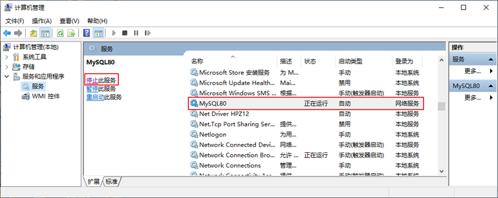

#### 方式2：使用命令行工具

```mysql
# 启动 MySQL 服务命令：
net start MySQL服务名

# 停止 MySQL 服务命令：
net stop MySQL服务名
```


说明：

1. start和stop后面的服务名应与之前配置时指定的服务名一致。

2. 如果当你输入命令后，提示“拒绝服务”，请以`系统管理员身份`打开命令提示符界面重新尝试。

### 3.2 自带客户端的登录与退出

当MySQL服务启动完成后，便可以通过客户端来登录MySQL数据库。注意：确认服务是开启的。

#### 登录方式1：MySQL自带客户端

开始菜单 → 所有程序 → MySQL → MySQL 8.0 Command Line Client


> 说明：仅限于root用户

#### 登录方式2：windows命令行

- 格式：

```
mysql -h 主机名 -P 端口号 -u 用户名 -p密码
```

- 举例：


```mysql
mysql -h localhost -P 3306 -u root -pabc123  # 这里我设置的root用户的密码是abc123
```


注意：

（1）-p与密码之间不能有空格，其他参数名与参数值之间可以有空格也可以没有空格。如：

```sql
mysql -hlocalhost -P3306 -uroot -pabc123
```

（2）密码建议在下一行输入，保证安全

```sql
mysql -h localhost -P 3306 -u root -p
Enter password:****
```

（3）客户端和服务器在同一台机器上，所以输入localhost或者IP地址127.0.0.1。同时，因为是连接本机：
-hlocalhost就可以省略，如果端口号没有修改：-P3306也可以省略

  简写成：

```sql
mysql -u root -p
Enter password:****
```

连接成功后，有关于MySQL Server服务版本的信息，还有第几次连接的id标识。

也可以在命令行通过以下方式获取MySQL Server服务版本的信息：

```
c:\> mysql -V
```

```
c:\> mysql --version
```

或**登录**后，通过以下方式查看当前版本信息：

```
mysql> select version();
```

#### 退出登录

```
exit
或
quit
```

## 4. MySQL演示使用

### 4.1 MySQL的使用演示

1、查看所有的数据库

```mysql
show databases;
```

> “information_schema”是 MySQL 系统自带的数据库，主要保存 MySQL 数据库服务器的系统信息，比如数据库的名称、数据表的名称、字段名称、存取权限、数据文件 所在的文件夹和系统使用的文件夹，等等
>
> “performance_schema”是 MySQL 系统自带的数据库，可以用来监控 MySQL 的各类性能指标。 
>
> “sys”数据库是 MySQL 系统自带的数据库，主要作用是以一种更容易被理解的方式展示 MySQL 数据库服务器的各类性能指标，帮助系统管理员和开发人员监控 MySQL 的技术性能。 
>
> “mysql”数据库保存了 MySQL 数据库服务器运行时需要的系统信息，比如数据文件夹、当前使用的字符集、约束检查信息，等等

为什么 Workbench 里面我们只能看到“demo”和“sys”这 2 个数据库呢？ 

这是因为，Workbench 是图形化的管理工具，主要面向开发人 员，“demo”和“sys”这 2 个数据库已经够用了。如果有特殊需求，比如，需要监控 MySQL 数据库各项性能指标、直接操作 MySQL 数据库系统文件等，可以由 DBA 通过 SQL 语句，查看其它的系统数据库。

2、创建自己的数据库

```mysql
create database 数据库名;

#创建atguigudb数据库，该名称不能与已经存在的数据库重名。
create database atguigudb;
```

3、使用自己的数据库

```mysql
use 数据库名;

#使用atguigudb数据库
use atguigudb;
```

说明：如果没有使用use语句，后面针对数据库的操作也没有加“数据名”的限定，那么会报“ERROR 1046 (3D000): No database selected”（没有选择数据库）

使用完use语句之后，如果接下来的SQL都是针对一个数据库操作的，那就不用重复use了，如果要针对另一个数据库操作，那么要重新use。

4、查看某个库的所有表格

```mysql
show tables;  #要求前面有use语句

show tables from 数据库名;
```

5、创建新的表格

```mysql
create table 表名称(
	字段名  数据类型,
	字段名 数据类型
);
```

说明：如果是最后一个字段，后面就用加逗号，因为逗号的作用是分割每个字段。

```mysql
#创建学生表
create table student(
	id int,
    name varchar(20)  #说名字最长不超过20个字符
);
```

6、查看一个表的数据

```mysql
select * from 数据库表名称;
```

```mysql
#查看学生表的数据
select * from student;
```

7、添加一条记录

```mysql
insert into 表名称 values(值列表);

#添加两条记录到student表中
insert into student values(1,'张三');
insert into student values(2,'李四');
```

报错：

```mysql
mysql> insert into student values(1,'张三');
ERROR 1366 (HY000): Incorrect string value: '\xD5\xC5\xC8\xFD' for column 'name' at row 1
mysql> insert into student values(2,'李四');
ERROR 1366 (HY000): Incorrect string value: '\xC0\xEE\xCB\xC4' for column 'name' at row 1
mysql> show create table student;
```

字符集的问题。

8、查看表的创建信息

```mysql
show create table 表名称;

#查看student表的详细创建信息
show create table student;
```

```mysql
#结果如下
*************************** 1. row ***************************
       Table: student
Create Table: CREATE TABLE `student` (
  `id` int(11) DEFAULT NULL,
  `name` varchar(20) DEFAULT NULL
) ENGINE=InnoDB DEFAULT CHARSET=latin1
1 row in set (0.00 sec)
```

上面的结果显示student的表格的默认字符集是“latin1”不支持中文。

9、查看数据库的创建信息

```mysql
show create database 数据库名;

#查看atguigudb数据库的详细创建信息
show create database atguigudb;
```

```mysql
#结果如下
*************************** 1. row ***************************
       Database: atguigudb
Create Database: CREATE DATABASE `atguigudb` /*!40100 DEFAULT CHARACTER SET latin1 */
1 row in set (0.00 sec)
```

上面的结果显示atguigudb数据库也不支持中文，字符集默认是latin1。

10、删除表格

```mysql
drop table 表名称;
```

```mysql
#删除学生表
drop table student;
```

11、删除数据库

```mysql
drop database 数据库名;
```

```mysql
#删除atguigudb数据库
drop database atguigudb;
```

### 4.2 MySQL的编码设置

#### MySQL5.7中

**问题再现：命令行操作sql乱码问题**

```mysql
mysql> INSERT INTO t_stu VALUES(1,'张三','男');
ERROR 1366 (HY000): Incorrect string value: '\xD5\xC5\xC8\xFD' for column 'sname' at row 1
```

**问题解决**

步骤1：查看编码命令

```sql
show variables like 'character_%'; 编码格式
show variables like 'collation_%'; 比较规则
```

步骤2：修改mysql的数据目录下的my.ini配置文件

```ini
[mysql]  #大概在63行左右，在其下添加
... 
default-character-set=utf8  #默认字符集

[mysqld]  # 大概在76行左右，在其下添加
...
character-set-server=utf8
collation-server=utf8_general_ci
```

> 注意：建议修改配置文件使用notepad++等高级文本编辑器，使用记事本等软件打开修改后可能会导致文件编码修改为“含BOM头”的编码，从而服务重启失败。

步骤3：重启服务

步骤4：查看编码命令

```sql
show variables like 'character_%';
show variables like 'collation_%';
```


* 如果是以上配置就说明对了。接着我们就可以新创建数据库、新创建数据表，接着添加包含中文的数据了。

#### MySQL8.0中

在MySQL 8.0版本之前，默认字符集为latin1，utf8字符集指向的是utf8mb3。网站开发人员在数据库设计的时候往往会将编码修改为utf8字符集。如果遗忘修改默认的编码，就会出现乱码的问题。从MySQL 8.0开始，数据库的默认编码改为`utf8mb4`，从而避免了上述的乱码问题。

## 5. MySQL图形化管理工具

MySQL图形化管理工具极大地方便了数据库的操作与管理，常用的图形化管理工具有：MySQL Workbench、phpMyAdmin、Navicat Preminum、MySQLDumper、SQLyog、dbeaver、MySQL ODBC Connector。

### 工具1. MySQL Workbench

MySQL官方提供的图形化管理工具MySQL Workbench完全支持MySQL 5.0以上的版本。MySQL Workbench分为社区版和商业版，社区版完全免费，而商业版则是按年收费。

MySQL Workbench 为数据库管理员、程序开发者和系统规划师提供可视化设计、模型建立、以及数据库管理功能。它包含了用于创建复杂的数据建模ER模型，正向和逆向数据库工程，也可以用于执行通常需要花费大量时间的、难以变更和管理的文档任务。

下载地址：http://dev.mysql.com/downloads/workbench/。

使用：

首先，我们点击 Windows 左下角的“开始”按钮，如果你是 Win10 系统，可以直接看到所有程序。接着，找到“MySQL”，点开，找到“MySQL Workbench 8.0 CE”。点击打开 Workbench，如下图所示：

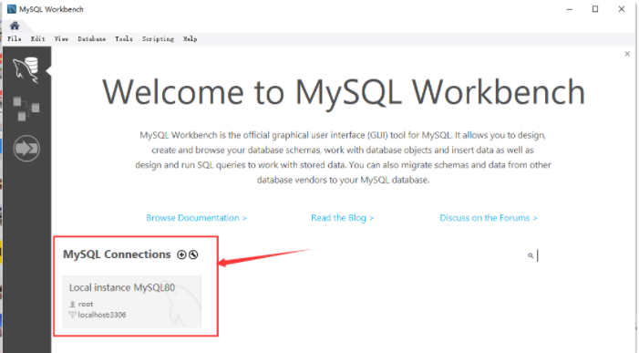

左下角有个本地连接，点击，录入 Root 的密码，登录本地 MySQL 数据库服务器，如下图所示：


这是一个图形化的界面，我来给你介绍下这个界面。 

- 上方是菜单。左上方是导航栏，这里我们可以看到 MySQL 数据库服务器里面的数据 库，包括数据表、视图、存储过程和函数；左下方是信息栏，可以显示上方选中的数据 库、数据表等对象的信息。 

- 中间上方是工作区，你可以在这里写 SQL 语句，点击上方菜单栏左边的第三个运行按 钮，就可以执行工作区的 SQL 语句了。 

- 中间下方是输出区，用来显示 SQL 语句的运行情况，包括什么时间开始运行的、运行的 内容、运行的输出，以及所花费的时长等信息。

好了，下面我们就用 Workbench 实际创建一个数据库，并且导入一个 Excel 数据文件， 来生成一个数据表。数据表是存储数据的载体，有了数据表以后，我们就能对数据进行操作了。 

### 工具2. Navicat

Navicat MySQL是一个强大的MySQL数据库服务器管理和开发工具。它可以与任何3.21或以上版本的MySQL一起工作，支持触发器、存储过程、函数、事件、视图、管理用户等，对于新手来说易学易用。其精心设计的图形用户界面（GUI）可以让用户用一种安全简便的方式来快速方便地创建、组织、访问和共享信息。Navicat支持中文，有免费版本提供。
下载地址：http://www.navicat.com/。


### 工具3. SQLyog

SQLyog 是业界著名的 Webyog 公司出品的一款简洁高效、功能强大的图形化 MySQL 数据库管理工具。这款工具是使用C++语言开发的。该工具可以方便地创建数据库、表、视图和索引等，还可以方便地进行插入、更新和删除等操作，同时可以方便地进行数据库、数据表的备份和还原。该工具不仅可以通过SQL文件进行大量文件的导入和导出，还可以导入和导出XML、HTML和CSV等多种格式的数据。
下载地址：http://www.webyog.com/，读者也可以搜索中文版的下载地址。


### 工具4：dbeaver

DBeaver是一个通用的数据库管理工具和 SQL 客户端，支持所有流行的数据库：MySQL、PostgreSQL、SQLite、Oracle、DB2、SQL Server、 Sybase、MS Access、Teradata、 Firebird、Apache Hive、Phoenix、Presto等。DBeaver比大多数的SQL管理工具要轻量，而且支持中文界面。DBeaver社区版作为一个免费开源的产品，和其他类似的软件相比，在功能和易用性上都毫不逊色。

唯一需要注意是 DBeaver 是用Java编程语言开发的，所以需要拥有 JDK（Java Development ToolKit）环境。如果电脑上没有JDK，在选择安装DBeaver组件时，勾选“Include Java”即可。

下载地址：https://dbeaver.io/download/


### 可能出现连接问题：

有些图形界面工具，特别是旧版本的图形界面工具，在连接MySQL8时出现“Authentication plugin 'caching_sha2_password' cannot be loaded”错误。


出现这个原因是MySQL8之前的版本中加密规则是mysql_native_password，而在MySQL8之后，加密规则是caching_sha2_password。解决问题方法有两种，第一种是升级图形界面工具版本，第二种是把MySQL8用户登录密码加密规则还原成mysql_native_password。

第二种解决方案如下，用命令行登录MySQL数据库之后，执行如下命令修改用户密码加密规则并更新用户密码，这里修改用户名为“root@localhost”的用户密码规则为“mysql_native_password”，密码值为“123456”，如图所示。

```mysql
#使用mysql数据库
USE mysql; 

#修改'root'@'localhost'用户的密码规则和密码
ALTER USER 'root'@'localhost' IDENTIFIED WITH mysql_native_password BY 'abc123'; 

#刷新权限
FLUSH PRIVILEGES;
```


## 6. MySQL目录结构与源码

### 6.1 主要目录结构

| MySQL的目录结构                             | 说明                                 |
| ------------------------------------------- | ------------------------------------ |
| bin目录                                     | 所有MySQL的可执行文件。如：mysql.exe |
| MySQLInstanceConfig.exe                     | 数据库的配置向导，在安装时出现的内容 |
| data目录                                    | 系统数据库所在的目录                 |
| my.ini文件                                  | MySQL的主要配置文件                  |
| c:\ProgramData\MySQL\MySQL Server 8.0\data\ | 用户创建的数据库所在的目录           |

### 6.2 MySQL 源代码获取

首先，你要进入 MySQL下载界面。 这里你不要选择用默认的“Microsoft Windows”，而是要通过下拉栏，找到“Source Code”，在下面的操作系统版本里面， 选择 Windows（Architecture Independent），然后点击下载。 

接下来，把下载下来的压缩文件解压，我们就得到了 MySQL 的源代码。

MySQL 是用 C++ 开发而成的，我简单介绍一下源代码的组成。 

mysql-8.0.22 目录下的各个子目录，包含了 MySQL 各部分组件的源代码： 

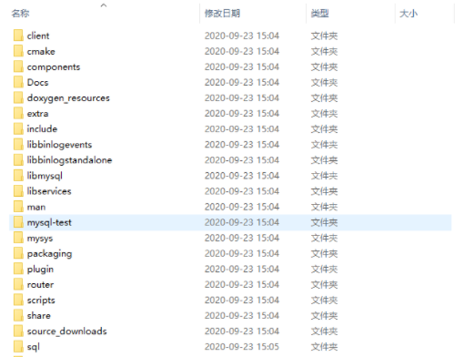

- sql 子目录是 MySQL 核心代码；

- libmysql 子目录是客户端程序 API；

- mysql-test 子目录是测试工具；

- mysys 子目录是操作系统相关函数和辅助函数；

源代码可以用记事本打开查看，如果你有 C++ 的开发环境，也可以在开发环境中打开查看。 

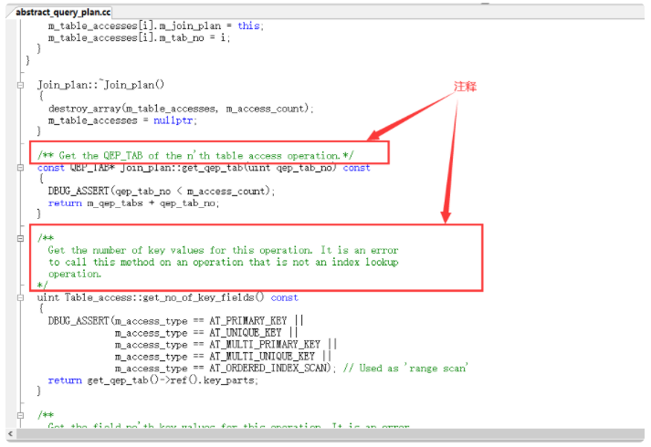

如上图所示，源代码并不神秘，就是普通的 C++ 代码，跟你熟悉的一样，而且有很多注释，可以帮助你理解。阅读源代码就像在跟 MySQL 的开发人员对话一样，十分有趣。

## 7. 常见问题的解决(课外内容)

### 问题1：root用户密码忘记，重置的操作

1: 通过任务管理器或者服务管理，关掉mysqld(服务进程)
2: 通过命令行+特殊参数开启mysqld
mysqld --defaults-file="D:\ProgramFiles\mysql\MySQLServer5.7Data\my.ini" --skip-grant-tables

3: 此时，mysqld服务进程已经打开。并且不需要权限检查
4: mysql -uroot 无密码登陆服务器。另启动一个客户端进行
5: 修改权限表
（1） use mysql;
（2）update user set authentication_string=password('新密码') where user='root' and Host='localhost'; 
（3）flush privileges;
6: 通过任务管理器，关掉mysqld服务进程。
7: 再次通过服务管理，打开mysql服务。
8: 即可用修改后的新密码登陆。

### 问题2：mysql命令报“不是内部或外部命令”

如果输入mysql命令报“不是内部或外部命令”，把mysql安装目录的bin目录配置到环境变量path中。如下：

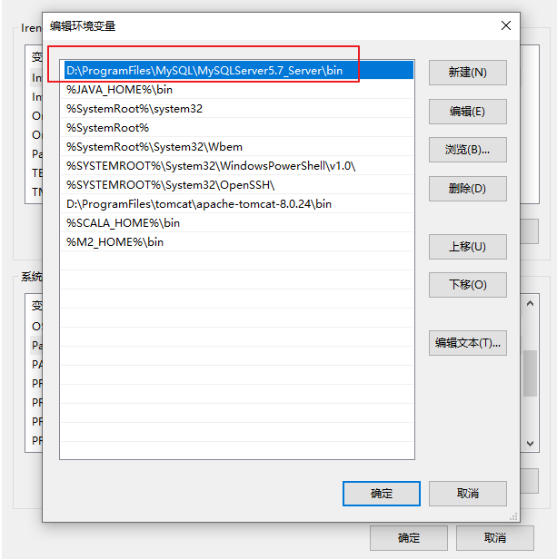

### 问题3：错误ERROR ：没有选择数据库就操作表格和数据

| ERROR 1046 (3D000): No database selected                     |
| ------------------------------------------------------------ |
| 解决方案一：就是使用“USE 数据库名;”语句，这样接下来的语句就默认针对这个数据库进行操作 |
| 解决方案二：就是所有的表对象前面都加上“数据库.”              |

### 问题4：命令行客户端的字符集问题

```mysql
mysql> INSERT INTO t_stu VALUES(1,'张三','男');
ERROR 1366 (HY000): Incorrect string value: '\xD5\xC5\xC8\xFD' for column 'sname' at row 1
```

原因：服务器端认为你的客户端的字符集是utf-8，而实际上你的客户端的字符集是GBK。

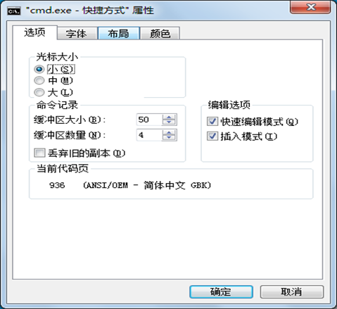

查看所有字符集：**SHOW VARIABLES LIKE 'character_set_%';**

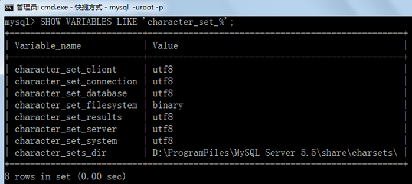

解决方案，设置当前连接的客户端字符集 **“SET NAMES GBK;”**

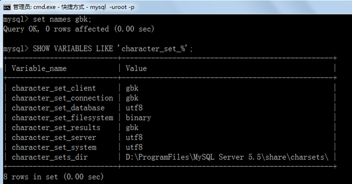


### 问题5：修改数据库和表的字符编码

修改编码：

（1)先停止服务，（2）修改my.ini文件（3）重新启动服务

说明：

如果是在修改my.ini之前建的库和表，那么库和表的编码还是原来的Latin1，要么删了重建，要么使用alter语句修改编码。

```mysql
mysql> create database 0728db charset Latin1;
Query OK, 1 row affected (0.00 sec)
```

```
mysql> use 0728db;
Database changed
```

```mysql
mysql> create table student (id int , name varchar(20)) charset Latin1;
Query OK, 0 rows affected (0.02 sec)


mysql> show create table student\G
*************************** 1. row ***************************
       Table: student
Create Table: CREATE TABLE `student` (
  `id` int(11) NOT NULL,
  `name` varchar(20) DEFAULT NULL,
  PRIMARY KEY (`id`)
) ENGINE=InnoDB DEFAULT CHARSET=latin1
1 row in set (0.00 sec)
```

```mysql
mysql> alter table student charset utf8; #修改表字符编码为UTF8
Query OK, 0 rows affected (0.01 sec)
Records: 0  Duplicates: 0  Warnings: 0


mysql> show create table student\G
*************************** 1. row ***************************
       Table: student
Create Table: CREATE TABLE `student` (
  `id` int(11) NOT NULL,
  `name` varchar(20) CHARACTER SET latin1 DEFAULT NULL,  #字段仍然是latin1编码
  PRIMARY KEY (`id`)
) ENGINE=InnoDB DEFAULT CHARSET=utf8
1 row in set (0.00 sec)


mysql> alter table student modify name varchar(20) charset utf8; #修改字段字符编码为UTF8
Query OK, 0 rows affected (0.05 sec)
Records: 0  Duplicates: 0  Warnings: 0


mysql> show create table student\G
*************************** 1. row ***************************
       Table: student
Create Table: CREATE TABLE `student` (
  `id` int(11) NOT NULL,
  `name` varchar(20) DEFAULT NULL,
  PRIMARY KEY (`id`)
) ENGINE=InnoDB DEFAULT CHARSET=utf8
1 row in set (0.00 sec)
```

```mysql
mysql> show create database 0728db;;
+--------+-----------------------------------------------------------------+
|Database| Create Database                                                 |
+------+-------------------------------------------------------------------+
|0728db| CREATE DATABASE `0728db` /*!40100 DEFAULT CHARACTER SET latin1 */ |
+------+-------------------------------------------------------------------+
1 row in set (0.00 sec)


mysql> alter database 0728db charset utf8; #修改数据库的字符编码为utf8
Query OK, 1 row affected (0.00 sec)


mysql> show create database 0728db;
+--------+-----------------------------------------------------------------+
|Database| Create Database                                                 |
+--------+-----------------------------------------------------------------+
| 0728db | CREATE DATABASE `0728db` /*!40100 DEFAULT CHARACTER SET utf8 */ |
+--------+-----------------------------------------------------------------+
1 row in set (0.00 sec)
```


