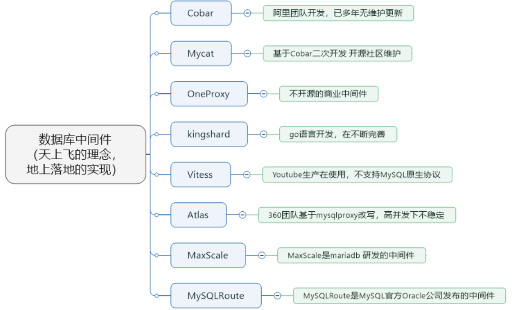

# 第18章_主从复制

## 一、主从复制概述

### 1.1 如何提升数据库并发能力

在实际工作中，我们常常将`Redis`作为缓存与`MySQL`配合来使用， 当有请求的时候，首先会从缓存中进行查找，如果存在就直接取出。如果不存在再访问数据库，这样就`提升了读取的效率`，也减少了对后端数据库的`访问压力`。Redis 的缓存架构是`高并发架构`中非常重要的一环。


此外，一般应用对数据库而言都是`读多写少`，也就说对数据库读取数据的压力比较大，有一个思路就是采用数据库集群的方案，做`主从架构`、进行`读写分离`，这样同样可以提升数据库的并发处理能力。但并不是所有的应用都需要对数据库进行主从架构的设置，毕竟设置架构本身是有成本的。

如果我们的目的在于提升数据库高并发访问的效率，那么首先考虑的是如何`优化SQL和索引`，这种方式简单有效；其次才是采用`缓存的策略`，比如使用 Redis 将热点数据保存在内存数据库中，提升读取的效率；最后才是对数据库采用`主从架构`，进行读写分离。

按照上面的方式进行优化，使用和维护的成本是由低到高的。

### 1.2 主从复制的作用

主从同步设计不仅可以提高数据库的吞吐量，还有以下 3 个方面的作用。

**第1个作用：读写分离**

我们可以通过主从复制的方式来`同步数据`，然后通过读写分离提高数据库并发处理能力。


其中一个是 Master 主库，负责写入数据，我们称之为：写库。其他都是 Slave 从库，负责读取数据，我们称之为：读库。当主库进行更新的时候，会自动将数据复制到从库中，而我们在客户端读取数据的时候，会从从库中进行读取。

面对`读多写少`的需求，采用读写分离的方式，可以实现`更高的并发访问`。同时，我们还能对服务器进行`负载均衡`，让不同的读请求按照策略均匀的分发到不同的从服务器上，让`读取更加顺畅`。读取顺畅的另一个原因，就是`减少了锁表`的影响，比如我们让主库负责写，当主库出现写锁的时候，不会影响到从库进行 SELECT 的读取。

**第2个作用：数据备份**

我们通过主从复制将主库上的数据复制到了从库上，相当于是一种`热备份机制`，也就是在主库正常运行的情况下进行的备份，不会影响到服务。

**第3个作用：高可用性**

数据备份实际上是一种冗余的机制，通过这种冗余的方式可以换取数据库的高可用性，也就是当服务器出现`故障`或者`宕机`的情况下，可以`切换`到从服务器上，保证服务的正常运行。

关于高可用性的程度，我们可以用一个指标衡量，即正常可用时间 / 全年时间。比如要达到全年 99.999% 的时间都可用，就意味着系统在一年中的不可用时间不得超过`365*24*60**(1-99.999%)=5.256`分钟（含系统崩溃的时间、日常维护操作导致的停机时间等），其他时间都需要保持可用的状态。

实际上，更高的高可用性，意味着需要付出更高的成本代价。在现实中我们需要结合业务需求和成本来进行选择。

## 2.主从复制的原理

`Slave`会从`Master`读取`binlog`来进行数据同步。

### 2.1 原理剖析

**三个线程**

实际上主从同步的原理就是基于 binlog 进行数据同步的。在主从复制过程中，会基于`3 个线程`来操作，一个主库线程，两个从库线程。


`二进制日志转储线程`（Binlog dump thread）是一个主库线程。当从库线程连接的时候， 主库可以将二进制日志发送给从库，当主库读取事件（Event）的时候，会在 Binlog 上`加锁`，读取完成之后，再将锁释放掉。

`从库 I/O 线程`会连接到主库，向主库发送请求更新 Binlog。这时从库的 I/O 线程就可以读取到主库的二进制日志转储线程发送的 Binlog 更新部分，并且拷贝到本地的中继日志 （Relay log）。

`从库 SQL 线程`会读取从库中的中继日志，并且执行日志中的事件，将从库中的数据与主库保持同步。


> 注意：
>
> 不是所有版本的 MySQL 都默认开启服务器的二进制日志。在进行主从同步的时候，我们需要先检查服务器是否已经开启了二进制日志。
>
> 除非特殊指定，默认情况下服务器会执行所有主服务器中保存的事件。也可以通过配置，使从服务器执行特定的事件。

**复制三步骤**

步骤1： `Master`将写操作记录到二进制日志（`binlog`），这些记录叫做二进制日志事件（binary log events）；

步骤2： `Slave`将`Master`的 binary log events 拷贝到它的中继日志（`relay log`）；

步骤3： `Slave`重做中继日志中的事件，将改变应用到自己的数据库中。 MySQL复制是异步的且串行化的，而且重启后从`接入点`开始复制。

**复制的问题**

复制的最大问题是`延时`。

### 2、复制的基本原则

- 每个`Slave`只有一个`Master`
- 每个`Slave`只能有一个唯一的服务器 ID
- 每个`Master`可以有多个`Slave`

## 三、一主一从架构搭建

一台`主机`用于处理所有`写请求`，一台`从机`负责所有`读请求`，架构图如下：


### 3.1 准备工作

- 准备`2台`CentOS 虚拟机
- 每台虚拟机上需要安装好 MySQL (可以是 MySQL8.0)

说明：前面我们讲过如何克隆一台 CentOS。大家可以在一台 CentOS 上安装好 MySQL，进而通过克隆的方式复制出 1 台包含 MySQL 的虚拟机。

注意：克隆的方式需要修改新克隆出来主机的：①`MAC地址`②`hostname`③`IP地址`④`UUID`。

此外，克隆的方式生成的虚拟机（包含 MySQL Server），则克隆的虚拟机 MySQL Server 的 UUID 相同，必须修改，否则在有些场景会报错。比如：`show slave status\G`，报如下的错误：

```bash
Last_IO_Error: Fatal error: The slave I/O thread stops because master and slave have equal MySQL server UUIDs; these UUIDs must be different for replication to work.
```


修改MySQL Server 的 UUID 方式： 保证从机和主机的 UUID 必须不同

```bash
vim /var/lib/mysql/auto.cnf
systemctl restart mysqld
```

### 3.2 主机配置文件

建议 mysql 版本一致且后台以服务运行，主从所有配置项都配置在`[mysqld]`节点下，且都是小写字母。具体参数配置如下：

**必选**

```bash
#[必须]主服务器唯一ID
server-id=1
#[必须]启用二进制日志,指名路径。比如：自己本地的路径/log/mysqlbin
log-bin=youyi-bin
```

**可选**

```bash
#[可选] 0（默认）表示读写（主机），1表示只读（从机）
read-only=0
#设置日志文件保留的时长，单位是秒
binlog_expire_logs_seconds=6000
#控制单个二进制日志大小。此参数的最大和默认值是1GB
max_binlog_size=200M
#[可选]设置不要复制的数据库
binlog-ignore-db=test
#[可选]设置需要复制的数据库,默认全部记录。比如：binlog-do-db=youyi_master_slave
binlog-do-db=需要复制的主数据库名字
#[可选]设置binlog格式
binlog_format=STATEMENT
```

重启后台 mysql 服务，使配置生效。

> 注意：
>
> 先搭建完主从复制，再创建数据库。
>
> MySQL 主从复制起始时，从机不继承主机数据。

**binlog格式设置：**

**格式1：**`STATEMENT模式`（基于 SQL 语句的复制（statement-based replication，SBR））

```bash
binlog_format=STATEMENT
```

每一条会修改数据的 sql 语句会记录到 binlog 中。这是`默认`的 binlog 格式。

- SBR 的优点：
  - 历史悠久，技术成熟
  - 不需要记录每一行的变化，减少了 binlog 日志量，文件较小
  - binlog 中包含了所有数据库更改信息，可以据此来审核数据库的安全等情况
  - binlog 可以用于实时的还原，而不仅仅用于复制
  - 主从版本可以不一样，从服务器版本可以比主服务器版本高
- SBR 的缺点：
  - ·不是所有的 UPDATE 语句都能被复制，尤其是包含不确定操作的时候
  - 使用以下函数的语句也无法被复制：LOAD_FILE()、UUID()、USER()、FOUND_ROWS()、SYSDATE()（除非启动时启用了`--sysdate-is-now`选项）
  - INSERT ... SELECT 会产生比 RBR 更多的行级锁
  - 复制需要进行全表扫描（WHERE 语句中没有使用到索引）的 UPDATE 时，需要比 RBR 请求更多的行级锁
  - 对于有 AUTO_INCREMENT 字段的 InnoDB 表而言，INSERT 语句会阻塞其他 INSERT 语句
  - 对于一些复杂的语句，在从服务器上的耗资源情况会更严重，而 RBR 模式下，只会对那个发生变化的记录产生影响
  - 执行复杂语句如果出错的话，会消耗更多资源
  - 数据表必须几乎和主服务器保持一致才行，否则可能会导致复制出错

> `可重复读`只能设置 STATEMENT 模式。
>
> `读已提交`可以设置 STATEMENT 模式和 ROW 模式。

**格式2：**`ROW模式`（基于行的复制（row-based replication，RBR））

```shell
binlog_format=ROW
```

5.1.5 版本的 MySQL 才开始支持，不记录每条 sql 语句的上下文信息，`仅记录哪条数据被修改`了，`修改成什么样`了。

- RBR 的优点：
  - 任何情况都可以被复制，这对复制来说是最`安全可靠`的。（比如：不会出现某些特定情况下的存储过程、function、trigger 的调用和触发无法被正确复制的问题）
  - 多数情况下，从服务器上的表如果有主键的话，复制就会快了很多
  - 复制以下几种语句时的行锁更少：INSERT ... SELECT、包含 AUTO_INCREMENT 字段的 INSERT、没有附带条件或者并没有修改很多记录的 UPDATE 或 DELETE 语句
  - 执行 INSERT，UPDATE，DELETE 语句时锁更少
  - 从服务器上采用`多线程`来执行复制成为可能
- RBR 的缺点：
  - binlog 大了很多
  - 复杂的回滚时 binlog 中会包含大量的数据
  - 主服务器上执行 UPDATE 语句时，所有发生变化的记录都会写到 binlog 中，而 SBR 只会写一次，这会导致频繁发生 binlog 的并发写问题
  - 无法从 binlog 中看到都复制了些什么语句

**格式3：**`MIXED模式`（混合模式复制（mixed-based replication，MBR））

```bash
binlog_format=MIXED
```


从 5.1.8 版本开始，MySQL 提供了 mixed 格式，实际上就是 statement 与 row 的结合。

在 Mixed 模式下，一般的语句修改使用 statment 格式保存 binlog。如一些函数，statement 无法完成主从复制的操作，则采用 row 格式保存 binlog。

MySQL 会根据执行的每一条具体的 sql 语句来区分对待记录的日志形式，也就是在 statement 和 row 之间选择一种。

### 3.3 从机配置文件

要求主从所有配置项都配置在`my.cnf`的`[mysqld]`栏位下，且都是小写字母。

**必选**

```bash
#[必须]从服务器唯一ID
server-id=2
```

**可选**

```bash
#[可选]启用中继日志
relay-log=mysql-relay
```

重启后台 mysql 服务，使配置生效。

> 注意：主从机都关闭防火墙
>
> service iptables stop #CentOS 6
>
> systemctl stop firewalld.service #CentOS 7

### 3.4 主机：建立账户并授权

```bash
#在主机MySQL里执行授权主从复制的命令
GRANT REPLICATION SLAVE ON *.* TO 'slave1'@'从机器数据库IP' IDENTIFIED BY 'abc123';#5.5,5.7
```

**注意：如果使用的是MySQL8，需要如下的方式建立账户，并授权slave：**

```bash
CREATE USER 'slave1'@'%' IDENTIFIED BY '123456';

GRANT REPLICATION SLAVE ON *.* TO 'slave1'@'%';

#此语句必须执行。否则见下面。
ALTER USER 'slave1'@'%' IDENTIFIED WITH mysql_native_password BY '123456';

flush privileges;
```

> 注意：在从机执行`show slave status\G`时报错：
>
> Last_IO_Error: error connecting to master ‘slave1@192.168.1.150:3306’ - retry-time: 60 retries: 1 message: Authentication plugin ‘caching_sha2_password’ reported error: Authentication requires secure connection.

查询 Master 的状态，并记录下 File 和 Position 的值。

```sql
mysql> show master status;
+------------------+----------+--------------------+------------------+-------------------+
| File             | Position | Binlog_Do_DB       | Binlog_Ignore_DB | Executed_Gtid_Set |
+------------------+----------+--------------------+------------------+-------------------+
| youyi-bin.000001 |     1136 | youyi_master_slave |                  |                   |
+------------------+----------+--------------------+------------------+-------------------+
1 row in set (0.00 sec)
```

记录下 File 和 Position 的值

> 注意：执行完此步骤后**不要再操作主服务器MySQL**，防止主服务器状态值变化。

### 3.5 从机：配置需要复制的主机

**步骤1：**通过命令指定主机的 binlog 日志

```bash
CHANGE MASTER TO
MASTER_HOST='主机的IP地址',
MASTER_USER='主机用户名',
MASTER_PASSWORD='主机用户名的密码',
MASTER_LOG_FILE='mysql-bin.具体数字',
MASTER_LOG_POS=具体值;
```

举例：

```bash
CHANGE MASTER TO MASTER_HOST='192.168.11.101',MASTER_USER='slave1',MASTER_PASSWORD='123456',MASTER_LOG_FILE='youyi-bin.000001',MASTER_LOG_POS=1136;
```


**步骤2：**

```sql
#启动slave同步
START SLAVE;
```

如果报错：


可以执行如下操作，删除之前的 relay_log 信息。然后重新执行`CHANGE MASTER TO …`语句即可。

```sql
mysql> reset slave; #删除 SLAVE 数据库的 relaylog 日志文件，并重新启用新的 relaylog 文件
```

接着，查看同步状态：

```sql
mysql> SHOW SLAVE STATUS\G
*************************** 1. row ***************************
               Slave_IO_State: Waiting for source to send event
                  Master_Host: 192.168.11.101
                  Master_User: slave1
                  Master_Port: 3306
                Connect_Retry: 60
              Master_Log_File: youyi-bin.000001
          Read_Master_Log_Pos: 1136
               Relay_Log_File: mysql-relay.000002
                Relay_Log_Pos: 324
        Relay_Master_Log_File: youyi-bin.000001
             Slave_IO_Running: Yes
            Slave_SQL_Running: Yes
		... ...
1 row in set, 1 warning (0.00 sec)
```

> 上面两个参数都是 Yes，则说明主从配置成功！

如果不是 Yes，则可能错误的原因有：

> 1. 网络不通
> 2. 账户密码错误
> 3. 防火墙
> 4. mysql配置文件问题
> 5. 连接服务器时语法
> 6. 主服务器mysql权限

### 3.6 测试

主机新建库、新建表、insert 记录，从机复制：

```sql
CREATE DATABASE youyi_master_slave;
USE youyi_master_slave;
CREATE TABLE mytbl(id INT,NAME VARCHAR(16));
INSERT INTO mytbl VALUES(1, 'zhang3');
INSERT INTO mytbl VALUES(2,@@hostname);
```

### 3.7 停止主从同步

**停止主从同步命令**

```sql
stop slave;
```

**如何重新配置主从**

如果停止从服务器复制功能，再使用需要==重新配置主从==。否则会报错如下：


重新配置主从，需要在从机上执行：

```sql
stop slave;
reset master; #删除 Master 中所有的 binglog 文件，并将日志索引文件清空，重新开始所有新的日志文件（慎用）
```

### 3.8 后续

**搭建主从复制：双主双从**

一个主机 m1 用于处理所有写请求，它的从机 s1 和另一台主机 m2 还有它的从机 s2 负责所有读请求。当 m1 主机宕机后，m2 主机负责写请求，m1、m2 互为备机。架构图如下：


## 4.同步数据一致性问题

**主从同步的要求**：

- 读库和写库的数据一致（最终一致）
- 写数据必须写到写库
- 读数据必须到读库（不一定）

### 4.1 理解主从延迟问题

进行主从同步的内容是二进制日志，它是一个文件，在进行 `网络传输` 的过程中就一定会 `存在主从延迟（比如 500ms）`，这样就可能造成用户在从库上读取的数据不是最新的数据，也就是主从同步中的 `数据不一致性` 问题。

**举例**：导致主从延迟的时间点主要包括以下三个：

- 主库 A 执行完一个事务，写入 binlog，我们把这个时刻记为 T1
- 之后传给从库 B，我们把从库 B 接收完这个 binlog 的时刻记为 T2
- 从库 B 执行完这个事务，我们把这个时刻记为 T3

主备延迟，就是同一事务，在 **备库执行完成的时间** 和 **主库执行完成的时间** 之间的差值，即`t3-t1`。

可以在备库执行**show slave status**，它的返回结果会显示SBM（简称 SBM），表示当前备库延迟了多少 s。 **SBM** 计算方法：

- 每个事务的 binlog 都有一个时间字段，以记录主库上写入的时间

- 备库取出当前正在执行的事务的时间字段的值，计算它与当前系统时间的差值，得到**SBM**

其实**SBM**就是`t3-t1`。所以，可以用**SBM**作为主备延迟的值，这个值的时间精度是 s。

- 若主备库机器的系统时间设置不一致，不会导致主备延迟的值不准吗？ 不会的。因为，备库连接到主库时，会通过执行`SELECT UNIX_TIMESTAMP()`函数获得当前主库系统时间。若此时发现主库系统时间与自己不一致，备库在执行**SBM**计算时，会自动扣掉该差值。

所以主备延迟最直接的表现是，备库消费中继日志（relay log）的速度，比主库生产 binlog 的速度要慢。这可能是由哪些原因导致的呢？

### 4.2 主从延迟问题原因

在网络正常的时候，日志从主库传给从库所需的时间是很短的，即T2-T1的值是非常小的。即，网络正常情况下，主备延迟的主要来源是备库接收完 binlog 和执行完这个事务之间的时间差。主备延迟最直接的表现是，从库消费中继日志（relay log）的速度，比主库生产 binlog 的速度要慢。这可能是由哪些原因导致的呢？

==备库所在机器的性能 < 主库所在的机器性能==

部署的人会想，反正备库没有请求，所以可以用差点儿的机器。或把 20 个主库放在 4 台机器，而把备库集中在一台机器。但更新请求对 IOPS 的压力，在主库和备库上是无差别的。所以，做这种部署时，一般都会将备库设置为“非双1”模式。

但实际上，更新过程中也会触发大量读操作。所以，当备库主机上的多个备库都在争抢资源时，就可能导致主备延迟。这种部署现在少了。因为主备可能发生切换，备库随时可能变成主库，所以主备库必须选用相同规格机器，并且做对称部署。

**我们也做了对称部署，但还有延迟，为啥？**

很可能==备库的压力大==。主库既然提供了写能力，那么备库可以提供一些读能力。或一些运营后台需要的分析语句，不能影响正常业务，所以只能在备库上跑。由于主库直接影响业务，大家使用起来会比较克制，反而忽视了备库的压力控制。结果备库上的查询耗费大量 CPU，影响同步速度 =》主备延迟。

这时一般可以这么处理：

- 一主多从

  除了备库外，可以多接几个从库，让这些从库来分担读压力。大多采用该方案，因为数据库系统必须保证有定期全量备份能力。而从库，很适合用来做备份

- 通过 binlog 输出到外部系统

  比如 Hadoop，让外部系统提供统计类查询的能力

> 从库和备库在概念上其实差不多。一般把会在 HA 过程中被选成新主库的，称为备库，其他的称为从库。

**我们也采用了一主多从，保证备库压力不会超过主库，但还主备延迟，为啥？**

可能就是==大事务==了。因为在主库，必须等事务执行完成才会写 binlog，再传给备库。所以，若一个主库的语句执行 10min，则该事务可能就会导致从库延迟 10min。

**delete一次性删除太多数据**

比如，一些归档类数据，平时没有注意删除历史数据，等空间快满，SE 要一次性删大量历史数据。又要避免在高峰期，所以会在晚上执行这些大量数据删除。结果，DBA 半夜收到延迟报警。然后，DBA 要求你后续再删数据时，要控制每个事务删除的数据量，分成多次删除。

**大表DDL**

计划内的 DDL，建议使用 gh-ost 方案

**我们主库也没大事务，怎么还主备延迟？**

可能因为备库的==并行复制能力==。

**其他情况**

由于主备延迟的存在，所以在主备切换时，就有不同

### 4.3 如何减少主从延迟

若想要减少主从延迟的时间，可以采取下面的办法：

- 降低多线程大事务并发的概率，优化业务逻辑
- 优化 SQL，避免慢 SQL， 减少批量操作 ，建议写脚本以 update-sleep 这样的形式完成
- 提高从库机器的配置 ，减少主库写 binlog 和从库读 binlog 的效率差
- 尽量采用`短的链路`，也就是主库和从库服务器的距离尽量要短，提升端口带宽，减少 binlog 传输的网络延时
- 实时性要求的业务读强制走主库，从库只做灾备，备份

### 4.4 如何解决一致性问题

如果操作的数据存储在同一个数据库中，那么对数据进行更新的时候，可以对记录加写锁，这样在读取的时候就不会发生数据不一致的情况。但这时从库的作用就是`备份`，并没有起到`读写分离`，分担主库`读压力`的作用


读写分离情况下，解决主从同步中数据不一致的问题， 就是解决主从之间 `数据复制方式`的问题，如果按照数据一致性`从弱到强`来进行划分，有以下 3 种复制方式。

**方法 1：异步复制**

异步模式就是客户端提交 COMMIT 之后不需要等从库返回任何结果，而是直接将结果返回给客户端，这样的好处是不会影响主库写的效率，但可能会存在主库宕机，而 Binlog 还没有同步到从库的情况，也就是此时的主库和从库数据不一致。这时会从库中选择一个作为新主，那么新主则可能缺少原来主服务器中已提交的事务、所以，这种复制模式下的数据一致性是最弱的。


**方法 2：半同步复制**

MySQL5.5 版本之后开始支持半同步复制的方式。原理是在客户端提交 COMMIT 之后不直接将结果返回给客户端，而是等待至少有一个从库接收到了 Binlog，并且写入到中继日志中，再返回给客户端。

这样做的好处就是提高了数据的一致性，当然相比于异步复制来说，至少多增加了一个网络连接的延迟，降低了主库写的效率。

再 MySQL5.7 版本中还增加了一个`rpl_semi_sync_master_wait_for_slave_count`参数，可以对应答的从库数量进行设置，默认为`1`，也就是只要有 1 个从库进行了回应，就可以返回给客户端，如果将这个参数调大，可以提升数据一致性的强度，但也会增加主库等待从库响应的时间。


**方法 3：组复制**

异步复制和半同步复制都无法最终保证数据的一致性问题，半同步复制是通过判断从库响应的个数来决定是否返回给客户端，虽然数据一致性相比于异步复制有提升，但仍然无法满足对数据一致性要求高的场景，比如金融领域。MGR 很好地弥补了这两种复制模式的不足。

组复制技术，简称 MGR（MySQL Group Replication）。是 MySQL 在 5.7.17 版本中推出的一种新的数据复制技术，这种复制技术是基于 Paxos 协议的状态机复制。

**MGR 是如何工作的**

首先我们将多个节点共同组成一个复制组，在`执行读写（RW）事务`的时候，需要通过一致性协议层（Consensus 层）的同意，也就是读写事务想要进行提交，必须要经过组里“大多数人”（对应 Node 节点）的同意，大多数指的是同意的节点数量需要大于`N/2+1`，这样才可以进行提交，而不是原发起方一个说了算。而针对`只读（RO）事务`则不需要经过组内同意，直接 COMMIT 即可。在一个复制组内有多个节点组成，它们各自维护了自己的数据副本，并且在一致性协议层实现了原子消息和全局有序消息，从而保证组内数据的一致性。


MGR 将 MySQL 带入了数据强一致性的时代，是一个划时代的创新，其中一个重要的原因就是 MGR 是基于 Paxos 协议的。Paxos 算法是由 2013 年的图灵奖获得者 Leslie Lamport 于 1990 年提出的，有关这个算法的决策机制可以搜一下。事实上，Paxos 算法提出之后就作为`分布式一致性算法`被广泛应用，比如 Apache 的 ZooKeeper 也是基于 Paxos 实现的。

## 5.知识延伸

在主从架构的配置中，如果想要采取读写分离的策略，我们可以`自己编写程序`，也可以通过`第三方的中间件`来实现。

- 自己编写程序的好处就在于比较自主，我们可以自己判断哪些查询在从库上来执行，针对实时性要求高的需求，我们还可以考虑哪些查询可以在主库上执行。同时，程序直接连接数据库，减少了中间件层，相当于减少了性能损耗。
- 采用中间件的方法有很明显的优势，`功能强大`，`使用简单`。但因为在客户端和数据库之间增加了中间件层会有一些`性能损耗`，同时商业中间件也是有使用成本的。我们也可以考虑采取一些优秀的开源工具。



①`Cobar`属于阿里 B2B 事业群，始于 2008 年，在阿里服役3年多，接管 3000+ 个 MySQL 数据库的 schema，集群日处理在线 SQL 请求 50 亿次以上。由于 Cobar 发起人的离职，Cobar 停止维护。

②`Mycat`是开源社区在阿里 Cobar 基础上进行二次开发，解决了 Cobar 存在的问题，并且加入了许多新的功能在其中。青出于蓝而胜于蓝。

③`OneProxy`基于 MySQL 官方的 proxy 思想利用 c 语言进行开发的，OneProxy 是一款商业`收费`的中间件。舍弃了一些功能，专注在`性能和稳定性上`。

④`kingshard`由小团队用 go 语言开发，还需要发展，需要不断完善。

⑤`Vitess`是 Youtube 生产在使用，架构很复杂。不支持 MySQL 原生协议，使用`需要大量改造成本`。

⑥`Atlas`是 360 团队基于 mysql proxy 改写，功能还需完善，高并发下不稳定。

⑦`MaxScale`是 mariadb（MySQL 原作者维护的一个版本） 研发的中间件。

⑧`MySQLRoute`是 MySQL 官方 Oracle 公司发布的中间件。


主备切换：


- 主动切换
- 被动切换
- 如何判断主库出问题了？如何解决过程中的数据不一致性问题？