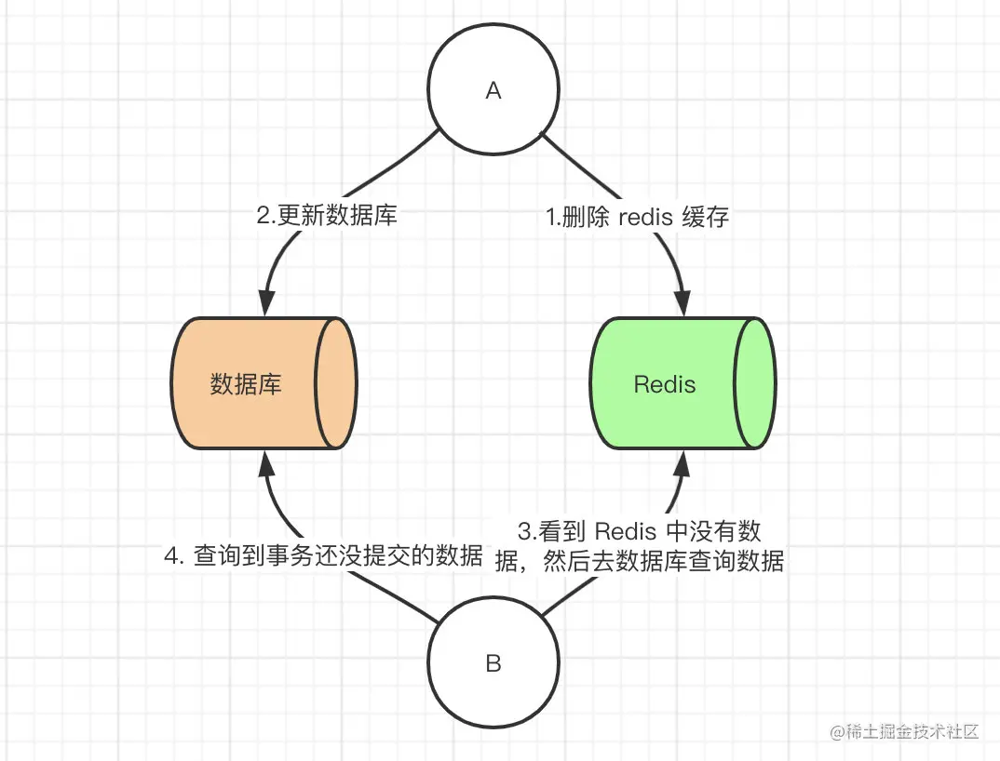
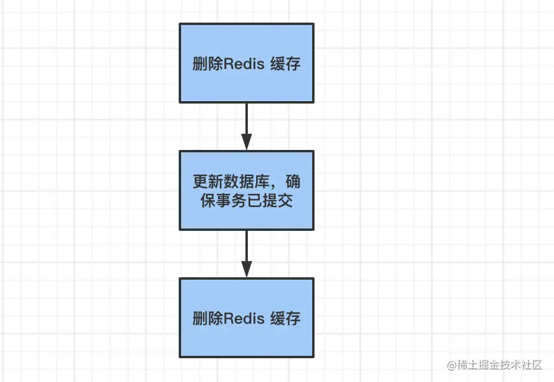
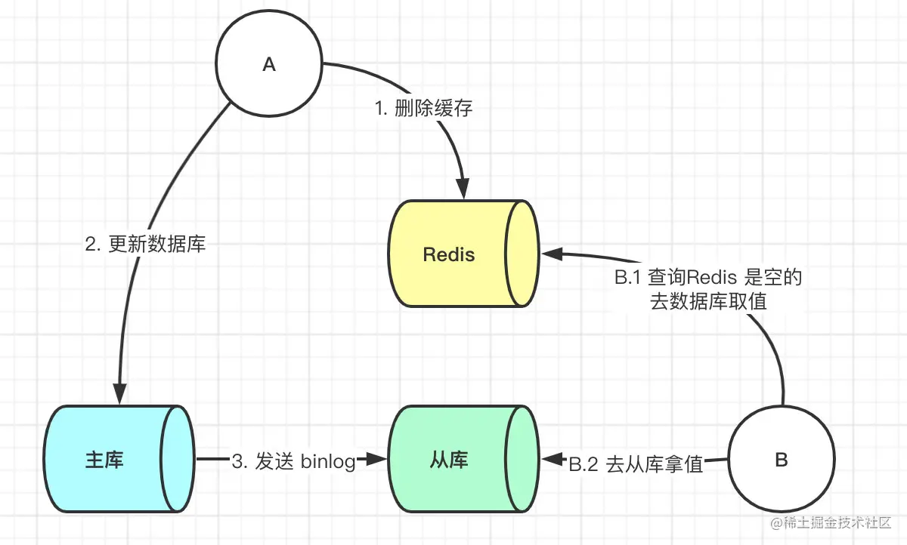
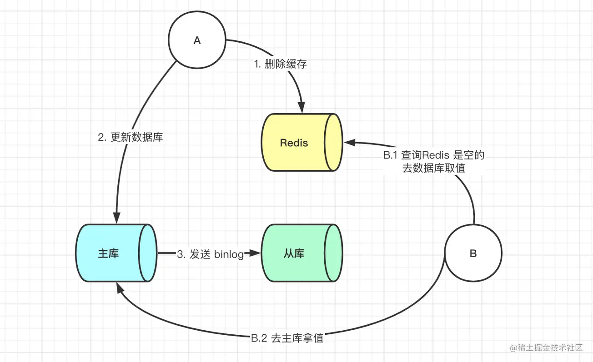
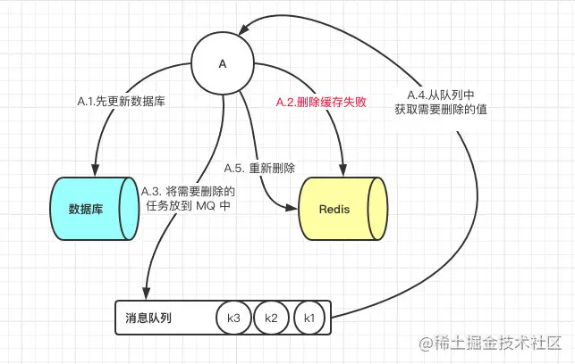
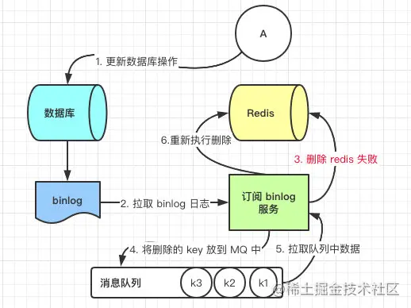
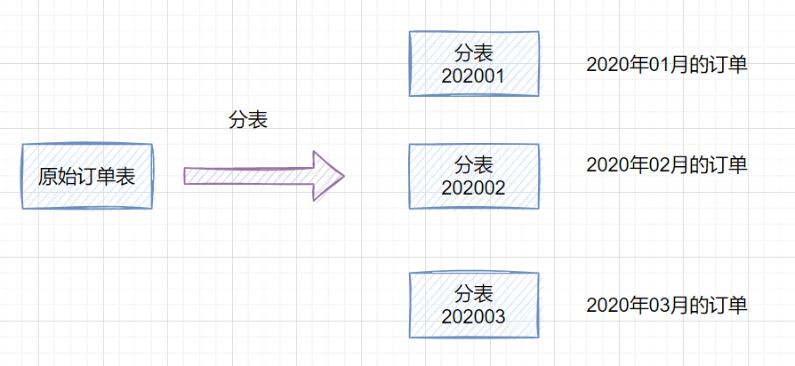
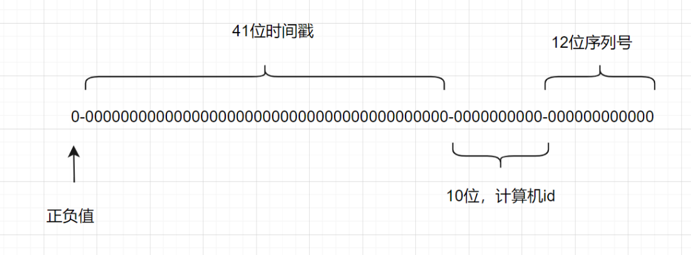

## 数据库连接池

一种池化技术，核心思想是实现`资源的复用`，避免资源的重复创建和销毁。

在数据库中，应用程序每次向数据库发起 CRUD 操作的时候，都需要创建链接，而在数据访问量比较大的情况下，频繁创建连接会带来比较大的性能开销。使用连接池后，应用程序启动时，提前会初始化一部分的连接保存在连接池中，当应用程序需要用到连接去进行数据操作的时候，直接从连接池中取出一个已经建立好的连接进行操作。连接池的设计避免了每次连接的建立和释放。

**参数**

- `初始化连接数`：启动的时候初始化多少个连接保存在连接池中
- `最大连接数`：表示同时最多能支持多少连接，如果连接数不够，后续要获取连接的线程会阻塞
- `最大空闲连接数`：没有请求时连接池中要保留的最大空闲连接
- `最小空闲连接数`：当连接数小于这个值的时候，连接池需要再创建连接来补充到这个值
- `最大等待时间`：连接池里面的连接用完后，新的请求要等待的时间，超过这个时间就会提示超时异常
- `无效连接清除`：清理连接池里面的无效连接，避免使用这个连接操作的时候出现错误

## 如何保证缓存与数据库双写时的数据一致性

在做系统优化时，想到了将数据进行分级存储的思路。因为在系统中会存在一些数据，有些数据的实时性要求不高，比如一些配置信息。基本上配置了很久才会变一次。而有一些数据实时性要求非常高，比如订单和流水的数据。所以这里根据数据要求实时性不同将数据分为三级。

- 第1级：订单数据和支付流水数据；这两块数据对实时性和精确性要求很高，所以不添加任何缓存，读写操作将直接操作数据库
- 第2级：用户相关数据；这些数据和用户相关，具有读多写少的特征，所以我们使用 redis 进行缓存
- 第3级：支付配置信息；这些数据和用户无关，具有数据量小，频繁读，几乎不修改的特征，所以我们使用本地内存进行缓存

但是只要使用到缓存，无论是本地内存做缓存还是使用 redis 做缓存，那么就会存在数据同步的问题，因为配置信息缓存在内存中，而内存时无法感知到数据在数据库的修改。这样就会造成数据库中的数据与缓存中数据不一致的问题。接下来就讨论一下关于保证缓存和数据库双写时的数据一致性。

### 解决方案 

#### Cache Aside Pattern

- 命中

  程序先从缓存中读取数据，如果命中，则直接返回

- 失效

  程序先从缓存中读取数据，如果没有命中，则从数据库读取，成功后将数据放到缓存中

- 更新

  程序先更新数据库，再删除缓存

那么我们这里列出来所有策略，并且讨论他们优劣性。

1. 先更新数据库，后更新缓存
2. 先更新数据库，后删除缓存
3. 先更新缓存，后更新数据库
4. 先删除缓存，后更新数据库

#### 先更新数据库，后更新缓存

这种场景一般是没有人使用的，主要原因是在更新缓存那一步，为什么呢？因为有的业务需求缓存中存在的值并不是直接从数据库中查出来的，有的是需要经过一系列计算来的缓存值，那么这时候后你要更新缓存的话其实代价是很高的。如果此时有大量的对数据库进行写数据的请求，但是读请求并不多，那么此时如果每次写请求都更新一下缓存，那么性能损耗是非常大的。

举个例子比如在数据库中有一个值为 1 的值，此时我们有 10 个请求对其每次加一的操作，但是这期间并没有读操作进来，如果用了此方法，那么此时就会有十个请求对缓存进行更新，会有大量的冷数据产生，如果我们不更新缓存而是删除缓存，那么在有读请求来的时候那么就会只更新缓存一次。

#### 先更新缓存，后更新数据库

这一种情况和第一种情况是一样的。还有就是当更新数据库失败后，还要考虑缓存的回滚等问题。

#### 先删除缓存，后更新数据库

该方案也会出问题，具体出现的原因如下。

此时来了两个请求，请求 A（更新操作） 和请求 B（查询操作）

1. 请求 A 会先删除 Redis 中的数据，然后去数据库进行更新操作
2. 此时请求 B 看到 Redis 中的数据时空的，会去数据库中查询该值，补录到 Redis 中
3. 但是此时请求 A 并没有更新成功，或者事务还未提交

那么这时候就会产生数据库和 Redis 数据不一致的问题。如何解决呢？其实最简单的解决办法就是延时双删的策略。

但是上述的保证事务提交完以后再进行删除缓存还有一个问题，就是如果你使用的是 Mysql 的读写分离的架构的话，那么其实主从同步之间也会有时间差。

此时来了两个请求，请求 A（更新操作） 和请求 B（查询操作）

1. 请求 A 更新操作，删除了 Redis
2. 请求主库进行更新操作，主库与从库进行同步数据的操作
3. 请 B 查询操作，发现 Redis 中没有数据
4. 去从库中拿去数据
5. 此时同步数据还未完成，拿到的数据是旧数据

此时的解决办法就是如果是对 Redis 进行填充数据的查询数据库操作，那么就**强制将其指向主库进行查询**。

#### 先更新数据库，后删除缓存

问题：这一种情况也会出现问题，比如更新数据库成功了，但是在删除缓存的阶段出错了没有删除成功，那么此时再读取缓存的时候每次都是错误的数据了。

或者缓存时间刚好到期，此时另一线程 B 会读取数据库并重新写入缓存，造成数据不一致。但是由于查询请求往往比更新请求快，所以 B 请求会先执行，然后 A 请求最后会删除缓存。

此时解决方案就是利用消息队列进行删除的补偿。具体的业务逻辑用语言描述如下：

1. 请求 A 先对数据库进行更新操作
2. 在对 Redis 进行删除操作的时候发现报错，删除失败
3. 此时将 Redis 的 key 作为消息体发送到消息队列中
4. 系统接收到消息队列发送的消息后再次对 Redis 进行删除操作

但是这个方案会有一个缺点就是会对业务代码造成大量的侵入，深深的耦合在一起，所以这时会有一个优化的方案，我们知道对 Mysql 数据库更新操作后再 binlog 日志中我们都能够找到相应的操作，那么我们可以订阅 Mysql 数据库的 binlog 日志（例如：canal 中间件）对缓存进行操作。

### 总结 

每种方案各有利弊，比如在第二种先删除缓存，后更新数据库这个方案我们最后讨论了要更新 Redis 的时候强制走主库查询就能解决问题，那么这样的操作会对业务代码进行大量的侵入，但是不需要增加的系统，不需要增加整体的服务的复杂度。最后一种方案我们最后讨论了利用订阅 binlog 日志进行搭建独立系统操作 Redis，这样的缺点其实就是增加了系统复杂度。其实每一次的选择都需要我们对于我们的业务进行评估来选择，没有一种技术是对于所有业务都通用的。没有最好的，只有最适合我们的。

## 什么情况不适合建立索引

1. where 条件中用不到的字段
2. 表记录较少
3. 需要经常进行增删改操作，可以评估是否适合索引
4. 需要进行运算或函数计算的列
5. 区分度不高的字段，如性别

## 如何分库分表

水平分库的方式，就是一个用户注册时，就划分了属于哪个数据库，然后具体的表结构是一样的。

垂直分库就是按照不同的系统中的不同业务进行拆分，比如拆分成用户库、订单库、积分库、商品库，把它们部署在不同的数据库服务器。

分表的话也有水平分表和垂直分表，垂直分表就是将一些不常用的、数据较大或者长度较长的列拆分到另外一张表，水平分表就是可以按照某种规则（如 hash 取模、range），把数据切分到多张表去。一张订单表，按时间 range 拆分如下：

**range 划分利于数据迁移，但是存在数据热点问题。hash 取模划分，不会存在明显的热点问题，但是不利于扩容。可以 range+hash 取模结合使用。**

**分布式 ID 可以使用雪花算法生成**

> 雪花算法是一种生成分布式全局唯一 ID 的算法，生成的 ID 称为 Snowflake IDs。这种算法由 Twitter 创建，并用于推文的 ID。

一个 Snowflake ID 有 64 位。

- 第 1 位：Java 中 long 的最高位是符号位代表正负，正数是 0，负数是 1，一般生成 ID 都为正数，所以默认为 0。
- 接下来前 41 位是时间戳，表示了自选定的时期以来的毫秒数。
- 接下来的 10 位代表计算机 ID，防止冲突。
- 其余 12 位代表每台机器上生成 ID 的序列号，这允许在同一毫秒内创建多个 Snowflake ID。

