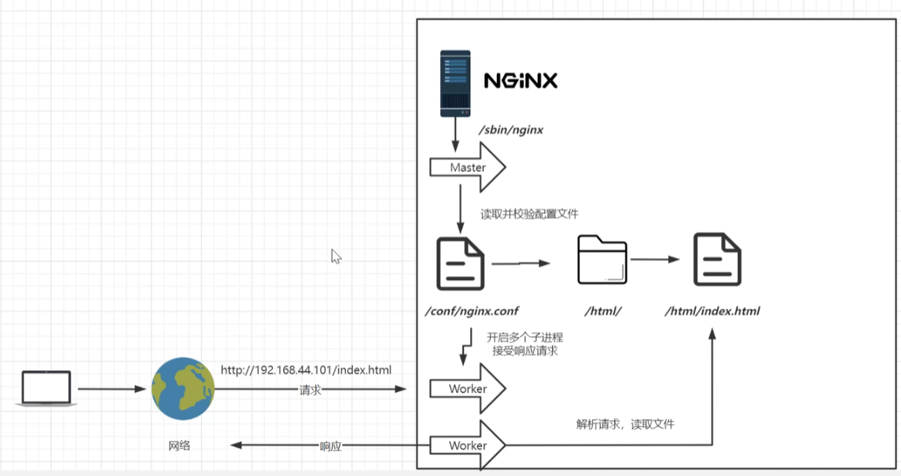
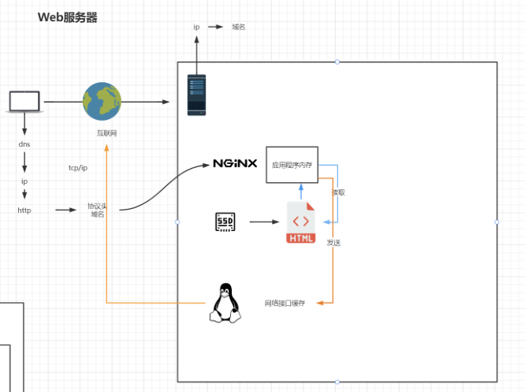
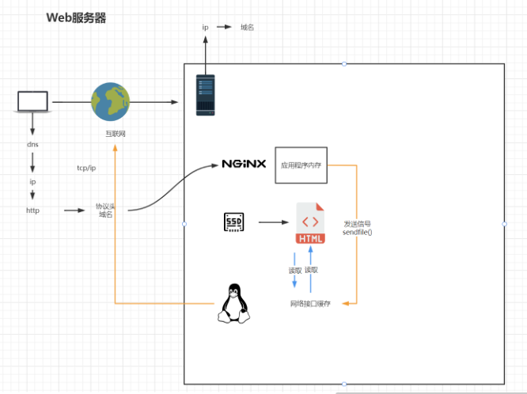
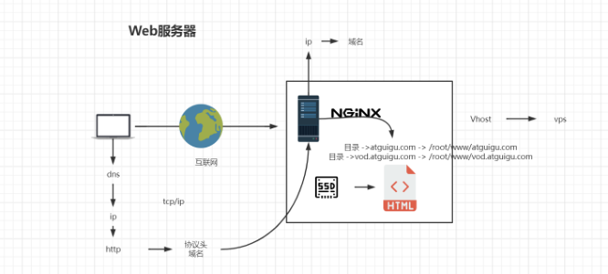
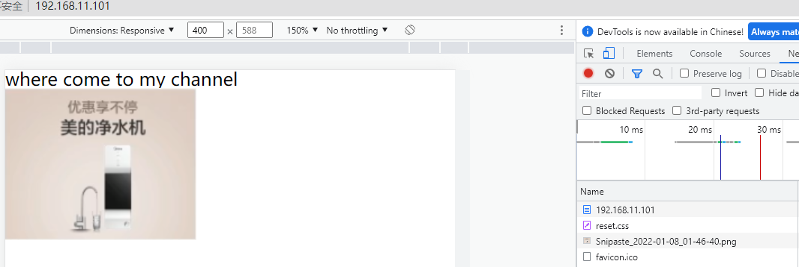
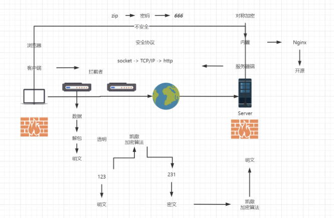

# 第2章_基础使用

## 1.目录结构

进入 Nginx 的主目录我们可以看到这些文件夹

```bash
- nginx
	- client_body_temp
	- conf
	- fastcgi_temp html
	- logs
	- proxy_temp
	- sbin scgi_temp
	- uwsgi_temp
```

其中这几个文件夹在刚安装后是没有的，主要用来存放运行过程中的临时文件

```bash
- client_body_temp
- fastcgi_temp
- proxy_temp
- scgi_temp
```

**conf**

用来存放配置文件相关

**html**

用来存放静态文件的默认目录 html、css 等

**sbin**

nginx 的主程序

**logs**

用来记录每个用户的访问日志，占用会不断增大，需要注意

## 2.基本运行原理

Master 是一个主进程，在读取配置文件后，会开启多个子进程处理响应。



```bash
[root@myServer1 nginx]# ps -ef | grep nginx
root      25192      1  0 21:22 ?        00:00:00 nginx: master process /usr/local/nginx/sbin/nginx -c /usr/local/nginx/conf/nginx.conf
nobody    25194  25192  0 21:22 ?        00:00:00 nginx: worker process
```

## 3.Nginx配置与应用场景

### 3.1 基础配置

```bash
# 启动时创建业务进程的数量，默认为 1，最好跟内核数量一样
worker_processes  1;
events {
	# 单个业务进程可接受连接数，默认 1024
    worker_connections  1024;
}
http {
	# 引入另一个文件，记录了 http mime 类型，例如 text/html
    include       mime.types;
    # 默认类型，这里表示如果 mime 类型没匹配上，则使用二进制流的方式传输
    default_type  application/octet-stream;
    # 使用 linux 的 sendfile(socket, file, len) 高效网络传输，也就是数据 0 拷贝
    sendfile        on;
    # 保持连接时超时的时间
    keepalive_timeout  65;
    server {
    	# 监听端口号
        listen       80;
        # 主机名
        server_name  localhost;
        # 匹配路径
        location / {
        	# 文件根目录
            root   html;
            # 默认页名称
            index  index.html index.htm;
        }
        # 报错编码对应页面
        error_page   500 502 503 504  /50x.html;
        location = /50x.html {
            root   html;
        }
    }
}
```

**sendfile**

- 未开启

  

- 开启后

  

### 3.2 虚拟主机

#### 1.网络传输概览



原本一台服务器只能对应一个站点，通过虚拟主机技术可以虚拟化成多个站点同时对外提供服务。

#### 2.在本机指定虚拟域名解析

修改本机的`C:\Windows\System32\drivers\etc\hosts`文件

```bash
192.168.11.101 myServer1
```

在本机上`ping myServer1`可以发现自动解析为`192.168.11.101`

#### ==3.公网域名配置==

申请好域名后，将该域名与服务器的`IP`地址进行链接

> 可以指定为内网的`IP`，这样当 DNS 服务器解析域名后会指向内网，此时就可以通过该域名直接访问内网了。

例如制定了`*.youyi.com`到`192.168.11.101`上。

#### ==4.Nginx虚拟主机域名配置==

在`/`目录下新建`www`文件夹作为网站根目录

```bash
[root@myServer1 /]# mkdir www
```

在`www`目录下新建两个文件夹`directory1`、`directory2`

```bash
[root@myServer1 www]# mkdir directory1
[root@myServer1 www]# mkdir directory2
```

分别在两个文件夹下新建`index.html`文件

修改`nginx.conf`文件，将`server`标签下的`location`分别指向`www`根目录下的`directory1`和`directory2`

```bash
    server {
        listen       80;
        server_name  localhost;
        location / {
            root   /www/directory1;
            index  index.html index.htm;
        }
        error_page   500 502 503 504  /50x.html;
        location = /50x.html {
            root   html;
        }
    }

    server {
        listen       81;
        server_name  localhost;
        location / {
            root   /www/directory2;
            index  index.html index.htm;
        }
        error_page   500 502 503 504  /50x.html;
        location = /50x.html {
            root   html;
        }
    }

```

重新加载`nginx`服务器

```bash
[root@myServer1 conf]# systemctl reload nginx.service
```

分别访问`myServer1:80/`和`myServer1:81`：


**也可以修改域名**

```bash
    server {
        listen       80;
        server_name  directory1.youyi.com;
        location / {
            root   /www/directory1;
            index  index.html index.htm;
        }
        error_page   500 502 503 504  /50x.html;
        location = /50x.html {
            root   html;
        }
    }

    server {
        listen       80;
        server_name  directory2.youyi.com;
        location / {
            root   /www/directory2;
            index  index.html index.htm;
        }
        error_page   500 502 503 504  /50x.html;
        location = /50x.html {
            root   html;
        }
    }

```

> **注意**
>
> 需要配置公网域名`*.youyi.com`指向`192.168.11.101`，或者在本机的`hosts`文件中配置
>
> ```bash
> 192.168.11.101 directory1.youyi.com
> 192.168.11.101 directory2.youyi.com
> ```

结果如下


#### 5.servername匹配规则

我们需要注意的是 servername 匹配分先后顺序，写在前面的匹配上就不会继续往下匹配了。如果都没有匹配上，则会优先访问第一个`server`站点。

**完整匹配**

我们可以在同一 servername 中匹配多个域名

```bash
server_name vod.youyi.com www1.youyi.com;
```

**通配符匹配**

```bash
server_name *.youyi.com
```

**通配符结束匹配**

```bash
server_name vod.*;
```

**正则匹配**

以符号`~`开头表示开启正则匹配

```bash
server_name ~^[0-9]+\.youyi\.com$;
```

## ==4.反向代理==

**如何理解反向**

当客户端主动使用代理连接服务器时是正向，当代理做用于服务器端，负责处理客户端需求时是反向。其本质上是相同的，都是一个**网关**，只是站的角度不同。

Nginx 属于`隧道式代理`，数据必须要经过 Nginx 在客户端和服务端之间传递，数据传输的速度取决于 Nginx 的带宽。

还有一种`lvs`负载均衡器，属于`DR模型`，可以实现客户端传给服务端的数据要经过`lvs`的分发，但是服务端传给客户端时不需经过`lvs`，但是功能较少。


```bash
location / {
	# 和 root 属性二选一
	# 表示访问该地址时重定向到 www.baidu.com，注意要加上协议 http
	# 此时地址栏显示的还是原来访问的地址
	proxy_pass http://www.baidu.com;
   }
```

> **注意**
>
> - 地址要写准确，例如若省略了`www`则 Nginx 会返回 302 状态并让浏览器重定向到`www.baidu.com`，此时地址栏就会改变
> - `proxy_pass`不支持`https`

### 4.1 基于反向代理的负载均衡

**负载均衡**：一种冗余设计，提高系统的可用性，通过搭建服务器集群，当一台系统宕机后，请求会转移到其他系统上提供相同的服务。

配置`192.168.11.101`的`nginx.conf`文件指定集群地址：

```bash
# 在 server 标签外定义别名 httpds，该名字可任意
upstream httpds {
	server 192.168.11.102;
	server 192.168.11.103;

}

server {
	listen       80;
	server_name  localhost;
    location / {
    # 指定 httpds
    proxy_pass http://httpds;
	}
	...
}
```

访问`192.168.11.101`可以发现访问在`102`和`103`之间依次改变。

### 4.2 负载均衡策略

- `轮询`

默认情况下使用轮询方式，逐一转发，这种方式适用于无状态请求。

- `权重`

  指定轮询几率，weight 和访问比率成正比，用于后端服务器性能不均的情况。

  ```bash
  upstream httpd {
  server 127.0.0.1:8050 weight=10 down;
  server 127.0.0.1:8060 weight=1;
  server 127.0.0.1:8060 weight=1 backup;
  }
  ```

  - `weight`：默认为1，weight 越大，负载的权重就越大
  - `down`（不怎么用）：表示当前的 server 暂时不参与负载
  - `backup`（不怎么用）： 其它所有的非 backup 机器 down 或者忙的时候，请求 backup 机器

- `ip_hash`：根据客户端的 ip 地址转发同一台服务器，可以保持回话

- `least_conn`：最少连接访问，优先转发到连接次数较少的服务器

- `url_hash`：需要第三方插件，根据用户访问的 url 定向转发请求

- `fair`：需要第三方插件，根据后端服务器响应时间转发请求，会有流量倾斜的风险

## 5.动静分离

### 5.1 使用场景

把静态资源放到`Nginx`中，动态资源由`Tomcat`处理。

首先将项目部署到`192.168.11.103`的`Tmocat`中，在`192.168.11.101`的`Nginx`配置文件中修改代理地址：

```bash
location / {
	# 103 的 Tomcat 地址
	proxy_pass http://192.168.11.103:8080;
}
```

访问`192.168.11.101`：


可以发现`CSS`和图片等信息都能加载，这些资源现在都是从`103`机器上得到的，接下来把它们移动到`101`的`Nginx`服务器中。

首先删除`103`上的`CSS`和图片资源，再访问`192.168.11.101`时就会发现已经不会加载不到这些资源了。


接下来将资源移动到`101`的`nginx`中：

```bash
[root@myServer1 html]# pwd
/usr/local/nginx/html
[root@myServer1 html]# ll
总用量 8
-rw-r--r--. 1 root root 497 5ﾔﾂ  19 21:12 50x.html
drwxr-xr-x. 2 root root  61 5ﾔﾂ  21 21:19 css
drwxr-xr-x. 2 root root 126 5ﾔﾂ  21 21:19 img
-rw-r--r--. 1 root root 615 5ﾔﾂ  19 21:12 index.html
```

配置`nginx.conf`文件，对每一类资源设置其相应的`location`：

```bash
location / {
	proxy_pass http://192.168.11.103:8080;
}

location /css {
	root   html;
	index  index.html index.htm;
}

location /img {
	root   html;
	index  index.html index.htm;
}
```

再次访问`192.168.11.101`可以发现成功加载了所有资源：



**使用正则**

location 前缀

- `/`：通用匹配，任何请求都会匹配到
- `=`：精准匹配，不是以指定模式开头
- `~`：正则匹配，区分大小写
- `~*`：正则匹配，不区分大小写
- `^~`：非正则匹配，匹配以指定模式开头的 location

**location 匹配顺序**

- 多个正则 location 直接按**书写顺序**匹配，成功后就不会继续往后面匹配
- 普通（非正则）location 会一直往下，直到找到匹配度最高的（最大前缀匹配）
- 当普通 location 与正则 location 同时存在，如果正则匹配成功，则不会再执行普通匹配
- 所有类型 location 存在时，`=`匹配 > `^~`匹配 > 正则匹配 > 普通（最大前缀匹配）

```bash
location ~*/(css|img) {
	root   html;
	index  index.html index.htm;
} 
```

> **alias 与 root**
>
> ```Bash
> location /css {
> 	alias /usr/local/nginx/static/css/;
> 	index index.html index.htm;
> }
> ```
>
> `root`用来设置根目录，而`alias`在接受请求的时候在路径上不会加上 location。
>
> - alias 指定的目录是准确的，即 location 匹配访问的 path 目录下的文件直接是在 alias 目录下查找的
> - root 指定的目录是 location 匹配访问的 path 目录的上一级目录，这个 path 目录一定要是真实存在 root 指定目录下的
> - 使用 alias 标签的目录块中不能使用 rewrite 的 break（具体原因不明），另外，alias 指定的目录后面必须要加上`/`符号！！
> - alias 虚拟目录配置中，location 匹配的 path 目录如果后面不带`/`，那么访问的 url 地址中这个 path 目录后面加不加`/`不影响访问，访问时它会自动加上`/`，但是如果 location 匹配的 path 目录后面加上`/`，那么访问的 url 地址中这个 path 目录必须要加上`/`，访问时它不会自动加上`/`。如果不加上`/`，访问就会失败！
> - root 目录配置中，location 匹配的 path 目录后面带不带`/`，都不会影响访问

### 5.2 UrlRewrite伪静态配置

可以用来隐藏请求的服务名和参数。

rewrite 是实现 URL 重写的关键指令，根据 regex（正则表达式）部分内容，重定向到 replacement，结尾是 flag 标记。

`rewrite <regex> <replacement> [flag];`

`关键字 正则 替代内容 flag标记`

- 关键字：其中关键字 error_log 不能改变
- 正则：perl 兼容正则表达式语句进行规则匹配
- 替代内容：将正则匹配的内容替换成 replacement
- flag标记：rewrite 支持的 flag 标记

rewrite 参数的标签段位置：server、location、if

`flag`标记说明：

- last：本条规则匹配完成后，继续向下匹配新的 location URI 规则
- break：本条规则匹配完成即终止，不再匹配后面的任何规则
- redirect：返回 302 临时重定向，浏览器地址会显示跳转后的 URL 地址
- permanent：返回 301 永久重定向，浏览器地址栏会显示跳转后的 URL 地址

**实例**

```bash
# ()表示入参的参数，用$来接受参数
rewrite ^/([0-9]+).html$ /index.jsp?pageNum=$1 break;
```

### 5.3 同时使用负载均衡

应用服务器防火墙配置：

开启防火墙

```bash
systemctl start firewalld
```

重启防火墙

```bash
systemctl restart firewalld
```

重载规则

```bash
firewall-cmd --reload
```

查看已配置规则

```Bash
firewall-cmd --list-all
```

指定端口和ip访问

```Bash
firewall-cmd --permanent --add-rich-rule="rule family="ipv4" source address="192.168.44.101"
port protocol="tcp" port="8080" accept"
```

移除规则

```Bash
firewall-cmd --permanent --remove-rich-rule="rule family="ipv4" source
address="192.168.44.101" port port="8080" protocol="tcp" accept"
```

网关配置

```Bash
upstream httpds {
server 192.168.44.102 weight=8 down;
server 192.168.44.103:8080 weight=2;
server 192.168.44.104:8080 weight=1 backup;
}
location / {
rewrite ^/([0-9]+).html$ /index.jsp?pageNum=$1 redirect;
proxy_pass http://httpds ;
}
```

防盗链配置

```bash
valid_referers none | blocked | server_names | strings ....;
```

none， 检测 Referer 头域不存在的情况。
blocked，检测 Referer 头域的值被防火墙或者代理服务器删除或伪装的情况。这种情况该头域的值不以
“http://” 或 “https://” 开头。
server_names ，设置一个或多个 URL ，检测 Referer 头域的值是否是这些 URL 中的某一个。
在需要防盗链的location中配置

```bash
valid_referers 192.168.44.101;
if ($invalid_referer) {
return 403;
}
```

使用curl测试

```Bash
curl -I http://192.168.44.101/img/logo.png
```

带引用
curl -e "http://baidu.com" -I http://192.168.44.101/img/logo.png

高可用配置
安装Keepalived
编译安装
下载地址

https://www.keepalived.org/download.html#

使用 ./configure 编译安装
如遇报错提示

```bash
configure: error:
!!! OpenSSL is not properly installed on your system. !!!
!!! Can not include OpenSSL headers files. !!!
```

安装依赖

```bash
yum install openssl-devel
```

yum安装

```Bash
yum install keepalived
```

配置
使用yum安装后配置文件在
/etc/keepalived/keepalived.conf
最小配置
第一台机器

```bash
! Configuration File for keepalived
global_defs {
router_id lb111
}
vrrp_instance atguigu {
state MASTER
interface ens33
virtual_router_id 51
priority 100
advert_int 1
authentication {
auth_type PASS
auth_pass 1111
}
virtual_ipaddress {
192.168.44.200
}
}
```

第二台机器

```bash
! Configuration File for keepalived
global_defs {
router_id lb110
}
vrrp_instance atguigu {
state BACKUP
interface ens33
virtual_router_id 51
priority 50
advert_int 1
authentication {
auth_type PASS
auth_pass 1111
}
virtual_ipaddress {
192.168.44.200
}
}
```

启动服务

```bash
systemctl start keepalived
```

Https证书配置
不安全的http协议



openssl
openssl包含：SSL协议库、应用程序以及密码算法库

自签名
OpenSSL
系统内置
图形化工具 XCA
下载地址

https://www.hohnstaedt.de/xca/index.php/download

CA 签名
