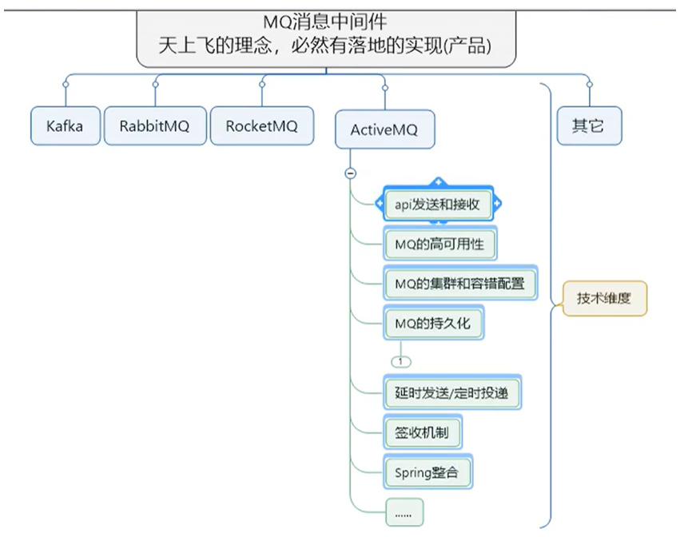
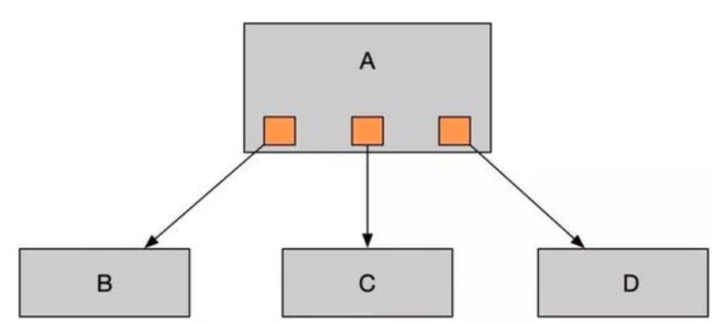
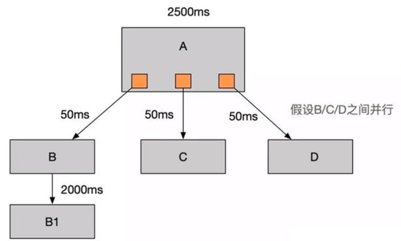
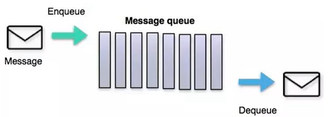

# 1.入门概述

## 1.1 MQ 的产品种类和对比

MQ就是消息中间件。MQ是一种理念，ActiveMQ是MQ的落地产品。不管是哪款消息中间件，都有如下一些技术维度：



| 特性              | ActiveMQ        | RabbitMQ   | Kafka            | RocketMQ       |
| ----------------- | --------------- | ---------- | ---------------- | -------------- |
| PRODUCER-CUMSUMER | 支持            | 支持       | 支持             | 支持           |
| PUBLISH-SUBSCRIBE | 支持            | 支持       | 支持             | 支持           |
| REQUEST-REPLY     | 支持            | 支持       | -                | 支持           |
| API完备性         | 高              | 高         | 高               | 低（静态配置） |
| 多语言支持        | 支持，JAVA 优先 | 语言无关   | 支持，JAVA 优先  | 支持           |
| 单机吞吐量        | 万级            | 万级       | 十万级           | 单机万级       |
| 消息延迟          | -               | 微秒级     | 毫秒级           | -              |
| 可用性            | 高（主从）      | 高（主从） | 非常高（分布式） | 高             |
| 消息丢失          | -               | 低         | 理论上不会丢失   | -              |
| 消息重复          | -               | 可控制     | 理论上会有重复   | -              |
| 文档的完备性      | 高              | 高         | 高               | 中             |
| 提供快速入门      | 有              | 有         | 有               | 无             |
| 首次部署难度      | -               | 低         | 中               | 高             |

- kafka

  编程语言：scala

  大数据领域的主流MQ

- rabbitmq

  编程语言：erlang

  基于erlang语言，不好修改底层，不要查找问题的原因，不建议选用

- rocketmq

  编程语言：java

  适用于大型项目。适用于集群

- activemq

  编程语言：java

  适用于中小型项目

## 1.2 MQ 的产生背景

**系统之间直接调用存在的问题？**

​    微服务架构后，链式调用是我们在写程序时候的一般流程,为了完成一个整体功能会将其拆分成多个函数(或子模块)，比如模块 A 调用模块 B，模块 B 调用模块 C，模块 C 调用模块 D。但在大型分布式应用中，系统间的 RPC 交互繁杂，一个功能背后要调用上百个接口并非不可能，从单机架构过渡到分布式微服务架构的通例。这些架构会有哪些问题？

1. 系统之间接口耦合比较严重

   ​    每新增一个下游功能，都要对上游的相关接口进行改造；

   ​    举个例子：如果系统 A 要发送数据给系统 B 和系统 C，发送给每个系统的数据可能有差异，因此系统 A 对要发送给每个系统的数据进行了组装，然后逐一发送；

   ​    当代码上线后又新增了一个需求：把数据也发送给 D，新上了一个 D 系统也要接受 A 系统的数据，此时就需要修改 A 系统，让他感知到 D 系统的存在，同时把数据处理好再给 D。在这个过程你会看到，每接入一个下游系统，都要对系统 A 进行代码改造，开发联调的效率很低。其整体架构如下图：

   

2. 面对大流量并发时，容易被冲垮

   ​    每个接口模块的吞吐能力是有限的，这个上限能力如果是堤坝，当大流量（洪水）来临时，容易被冲垮。

   ​    举个例子秒杀业务：上游系统发起下单购买操作，就是下单一个操作 ，很快就完成。然而，下游系统要完成秒杀业务后面的所有逻辑（读取订单，库存检查，库存冻结，余额检查，余额冻结，订单生产，余额扣减，库存减少，生成流水，余额解冻，库存解冻）。

3. 等待同步存在性能问题

   ​    RPC 接口上基本都是同步调用，整体的服务性能遵循“木桶理论”，即整体系统的耗时取决于链路中最慢的那个接口。比如 A 调用 B/C/D 都是 50ms，但此时 B 又调用了 B1，花费 2000ms，那么直接就拖累了整个服务性能。

   

> 根据上述的几个问题，在设计系统时可以明确要达到的目标：
>
> - 要做到系统解耦，当新的模块接进来时，可以做到代码改动最小；==能够解耦==
> - 设置流量缓冲池，可以让后端系统按照自身吞吐能力进行消费，不被冲垮；==能削峰==
> - 强弱依赖梳理能将非关键调用链路的操作异步化并提升整体系统的吞吐能力；==能够异步==

## 1.3 MQ 的主要作用

- 异步：调用者无需等待
- 解耦：解决了系统之间耦合调用的问题
- 消峰：抵御洪峰流量，保护了主业务，先会由消息中间件处理

## 1.4 MQ 的定义

​    面向消息的中间件（message-oriented middleware）MOM 能够很好的解决以上问题。是指利用高效可靠的消息传递机制与平台无关的数据交流，并基于数据通信来进行分布式系统的集成。通过提供消息传递和消息排队模型在分布式环境下提供应用解耦，弹性伸缩，冗余存储、流量削峰，异步通信，数据同步等功能。

​    大致的过程是这样的：发送者把消息发送给消息服务器，消息服务器将消息存放在若干队列/主题 topic 中，在合适的时候，消息服务器回将消息转发给接受者。在这个过程中，发送和接收是异步的，也就是发送无需等待，而且发送者和接受者的生命周期也没有必然的关系；尤其在发布pub/订阅sub模式下，也可以完成一对多的通信，即让一个消息有多个接受者。



## 1.5 MQ 的特点

1. 采用异步处理模式

   - 消息发送者可以发送一个消息而无须等待响应，消息发送者将消息发送到一条虚拟的通道（主题或者队列）上
   - 消息接收者则订阅或者监听该爱通道。一条消息可能最终转发给一个或者多个消息接收者，这些消息接收者都无需对消息发送者做出同步回应。整个过程都是异步的
   
   **案例：**
   
   也就是说，一个系统跟另一个系统之间进行通信的时候，假如系统 A 希望发送一个消息给系统 B，让他去处理。但是系统 A 不关注系统 B 到底怎么处理或者有没有处理好，所以系统 A 把消息发送给 MQ，然后就不管这条消息的“死活了”，接着系统 B 从 MQ 里面消费出来处理即可。至于怎么处理，是否处理完毕，什么时候处理，都是系统 B 的事儿，与系统 A 无关。
   
2. 应用系统之间解耦合

   发送者和接受者不必了解对方，只需要确认消息，发送者和接受者不必同时在线。

3. 整体架构

   

## 1.6 MQ 的缺点

两个系统之间不能同步调用，不能实时回复，不能响应某个调用的回复。

---

# 2.ActiveMQ安装和控制台

## 2.1 ActiveMQ 安装

**官方下载**

官网地址： http://activemq.apache.org/


> 注意 activeMQ 的版本！

**安装步骤**

- 上传安装包到 opt 目录

- 解压

  ```bash
  tar -zxvf apache-activemq-5.16.5-bin.tar.gz
  ```

- 复制到`/usr/local/`目录

  ```bash
  mkdir /usr/local/activemq
  cp -r apache-activemq-5.16.5 /usr/local/activemq/
  ```

- 修改默认 host

  ```bash
  vim apache-activemq-5.16.5/conf/jetty.xml
  <bean id="jettyPort" class="org.apache.activemq.web.WebConsolePort" init-method="start">
               <!-- the default port number for the web console -->
           # 将 host 改为 0.0.0.0
          <property name="host" value="0.0.0.0"/>
          <property name="port" value="8161"/>
      </bean>
  
  ```

- 开启 activemq

  ```bash
  [root@myServer1 bin]# ./activemq start
  INFO: Loading '/usr/local/activemq/apache-activemq-5.17.1//bin/env'
  INFO: Using java '/opt/module/jdk1.8.0_212/bin/java'
  INFO: Starting - inspect logfiles specified in logging.properties and log4j.properties to get details
  INFO: pidfile created : '/usr/local/activemq/apache-activemq-5.17.1//data/activemq.pid' (pid '13182')
  ```

- 关闭 activemq

  ```bash
  [root@myServer1 bin]# ./activemq stop
  ```

- 查看程序启动是否成功

  ```bash
  # grep -v grep：屏蔽掉含有 grep 的结果
  ps -ef | grep activemq | grep -v grep
  
  # activemq 默认占用 61616 端口
  netstat -anp | grep 61616
  ```

**启动时指定日志输出文件**

activemq 日志默认的位置是在：`%activemq安装目录%/data/activemq.log`

启动时指定输出位置：`./activemq  start > /usr/local/activemq/activemqRun.log`

```bash
[root@myServer1 activemq]# ll
总用量 4
-rw-r--r--.  1 root root 325 5月   9 14:44 activemqRun.log
drwxr-xr-x. 10 root root 193 5月   9 14:37 apache-activemq-5.17.1
```

**设置自动启动**

（1）在`/etc/init.d/`目录增加增加 activemq 文件：

```bash
cd /etc/init.d/
vi activemq
```

注意：将下面内容全部复制。 要先安装 jdk，在下面配置 jdk 的安装目录：

```bash
#!/bin/sh
#
# /etc/init.d/activemq
# chkconfig: 345 63 37
# description: activemq servlet container.
# processname: activemq 5.14.3

# Source function library.
#. /etc/init.d/functions
# source networking configuration.
#. /etc/sysconfig/network

export JAVA_HOME=/usr/local/jdk1.8.0_131
export CATALINA_HOME=/usr/local/activemq/apache-activemq-5.14.3

case $1 in
    start)
        sh $CATALINA_HOME/bin/activemq start
    ;;
    stop)
        sh $CATALINA_HOME/bin/activemq stop
    ;;
    restart)
        sh $CATALINA_HOME/bin/activemq stop
        sleep 1
        sh $CATALINA_HOME/bin/activemq start
    ;;

esac
exit 0
```

（2）赋予文件权限

```bash
chmod 777 activemq
```

（3）设置开机启动

```bash
chkconfig activemq on
```

（4）启动 activemq

```bash
service activemq start
```

## 2.2 ActiveMQ控制台

（1）访问 activemq 管理页面地址：http://IP地址:8161/  

账户：admin

密码：admin

> 61616 端口用于提供 JMS 服务
>
> 8161 端口用于提供 web 可视化界面

成功后见下图：


---

# 3.入门案例、MQ标准、API详解

## 3.1 pom.xml导入依赖

```xml
<dependencies>
  <!--  activemq  所需要的jar 包-->
  <dependency>
    <groupId>org.apache.activemq</groupId>
    <artifactId>activemq-all</artifactId>
    <version>5.15.9</version>
  </dependency>
  <!--  activemq 和 spring 整合的基础包 -->
  <dependency>
    <groupId>org.apache.xbean</groupId>
    <artifactId>xbean-spring</artifactId>
    <version>3.16</version>
  </dependency>
</dependencies>
```

## 3.2 JMS编码总体规范


**JMS 开发步骤**


## 3.3 Destination简介

Destination 是目的地。下面拿 jvm 和 mq，做个对比。目的地，我们可以理解为是数据存储的地方。


Destination 分为两种：队列和主题。


## 3.4 队列消息生产者的入门案例

```java
public class JmsProduce {

    public static final String ACTIVEMQ_URL = "tcp://192.168.11.101:61616";
    public static final String QUEUE_NAME = "queue01";

    public static void main(String[] args) throws JMSException {
        // 1.创建连接工厂，按照给定的url地址，采用默认用户名和密码
        ActiveMQConnectionFactory activeMQConnectionFactory = new ActiveMQConnectionFactory(ACTIVEMQ_URL);
        // 2.获得连接connection并启动
        Connection connection = activeMQConnectionFactory.createConnection();
        connection.start();
        // 3.创建会话session，第一个为事务，第二个为签收
        Session session = connection.createSession(false, Session.AUTO_ACKNOWLEDGE);
        // 4.创建目的地（队列or主题）
        Queue queue = session.createQueue(QUEUE_NAME);
        // 5.创建消息生产者
        MessageProducer producer = session.createProducer(queue);
        // 6.通过使用消息生产者生产3条消息发送到MQ队列中
        for (int i = 0; i < 3; i++) {
            // 7.创建消息
            TextMessage textMessage = session.createTextMessage("msg---" + i);
            // 8.通过消息生产者发送给MQ
            producer.send(textMessage);
        }
        // 9.关闭资源
        producer.close();
        session.close();
        connection.close();

        System.out.println("******消息发布完成******");

    }
}
```

**控制台**

运行上面代码，控制台显示如下：


- `Number Of Pending Messages`：等待消费的消息，这个是未出队列的数量，公式 = 总接收数 - 总出队列数
- `Number Of Consumers`：消费者数量，消费者端的消费者数量
- `Messages Enqueued`：进队消息数，进队列的总消息量，包括出队列的。这个数只增不减
- `Messages Dequeued`：出队消息数，可以理解为是消费者消费掉的数量

> 总结：
>
> 当有一个消息进入这个队列时，等待消费的消息是 1，进入队列的消息是 1。当消息消费后，等待消费的消息是 0，进入队列的消息是 1，出队列的消息是 1。当再来一条消息时，等待消费的消息是1，进入队列的消息就是2。

## 3.5 队列消息消费者的入门案例

```java
public class JmsConsumer {

    public static final String ACTIVEMQ_URL = "tcp://192.168.11.101:61616";
    public static final String QUEUE_NAME = "queue01";

    public static void main(String[] args) throws JMSException {
        // 1.创建连接工厂，按照给定的url地址，采用默认用户名和密码
        ActiveMQConnectionFactory activeMQConnectionFactory = new ActiveMQConnectionFactory(ACTIVEMQ_URL);
        // 2.获得连接connection并启动
        Connection connection = activeMQConnectionFactory.createConnection();
        connection.start();
        // 3.创建会话session，第一个为事务，第二个为签收
        Session session = connection.createSession(false, Session.AUTO_ACKNOWLEDGE);
        // 4.创建目的地（队列or主题）
        Queue queue = session.createQueue(QUEUE_NAME);
        // 5.创建消息消费者
        MessageConsumer consumer = session.createConsumer(queue);
        while(true) {
            // receive()：一直等待接收消息，在能够接收到消息之前将一直阻塞，是同步阻塞方式，和socket的accept方法类似的
            // receive(Long time)：等待n毫秒之后还没有收到消息，就结束阻塞
            // 因为消息发送者是 TextMessage，所以消息接受者也要是TextMessage
            TextMessage textMessage = (TextMessage)consumer.receive();
            if (textMessage != null) {
                System.out.println("******消费者接收到消息：" + textMessage.getText());
            } else {
                break;
            }
        }

        consumer.close();
        session.close();
        connection.close();
    }
}
```

控制台显示：


## 3.6 异步监听式消费者（MessageListener）

```java
...
// 通过监听的方式来消费消息，是异步非阻塞的方式消费消息。
// 通过messageConsumer的setMessageListener注册一个监听器，当有消息发送来时，系统自动调用MessageListener的onMessage方法处理消息
consumer.setMessageListener(new MessageListener() {
    @Override
    public void onMessage(Message message) {
        if (null != message && message instanceof TextMessage) {
            TextMessage textMessage = (TextMessage) message;
            try {
                System.out.println("******消费者接收到消息：" + textMessage.getText());
            } catch (JMSException e) {
                e.printStackTrace();
            }
        }
    }
});

// 让主线程不要结束。因为一旦主线程结束了，其他的线程（如此处的监听消息的线程）也都会被迫结束。
// 实际开发中，我们的程序会一直运行，这句代码都会省略。
System.in.read();
consumer.close();
session.close();
connection.close();
```

## 3.7 队列消息（Queue）总结

**两种消费方式**

- `同步阻塞方式（receive）`

  订阅者或接收者抵用 MessageConsumer 的 receive() 方法来接收消息，receive 方法在能接收到消息之前（或超时之前）将一直阻塞。

- `异步非阻塞方式（监听器 onMessage()）`

  订阅者或接收者通过 MessageConsumer 的 setMessageListener(MessageListener listener) 注册一个消息监听器，当消息到达之后，系统会自动调用监听器 MessageListener 的 onMessage(Message message) 方法。

**队列的特点**

点对点消息传递域的特点如下：

- 每个消息只能有一个消费者，类似 1 对 1 的关系
- 消息的生产者和消费者之间没有时间上的相关性，无论消费者在生产者发送消息的时候是否处于运行状态，消费者都可以提取消息
- 消息被消费后队列中不会再存储，所以消费者不会消费已经被消费掉的消息

**消息消费情况**


当同时有多个消费者在线时，会依次轮询传递消息。

---

# 4.Topic介绍、入门案例、控制台

## 1.topic介绍

在发布订阅消息传递域中，目的地被称为主题（topic）。

发布/订阅消息传递域的特点如下：

- 生产者将消息发布到 topic 中，每个消息可以有多个消费者，属于 1：N 的关系
- 生产者和消费者之间有时间上的相关性。订阅某一个主题的消费者只能消费自它订阅之后发布的消息
- 生产者生产时，topic `不保存消息`它是`无状态`的不落地，假如无人订阅就去生产，那就是一条废消息，所以，一般`先启动消费者再启动生产者`

默认情况下如上所述，但是 JMS 规范允许客户创建持久订阅，这在一定程度上放松了时间上的相关性要求。持久订阅允许消费者消费它在未处于激活状态时发送的消息。


## 2.生产者案例

```java
public class JmsProduce {

    public static final String ACTIVEMQ_URL = "tcp://192.168.11.101:61616";
    public static final String TOPIC_NAME = "topic01";

    public static void main(String[] args) throws JMSException {
        ActiveMQConnectionFactory activeMQConnectionFactory = new ActiveMQConnectionFactory(ACTIVEMQ_URL);
        Connection connection = activeMQConnectionFactory.createConnection();
        connection.start();
        Session session = connection.createSession(false, Session.AUTO_ACKNOWLEDGE);
        
        // 创建目的地（主题）
        Topic topic = session.createTopic(TOPIC_NAME);

        MessageProducer producer = session.createProducer(topic);
        for (int i = 0; i < 6; i++) {
            TextMessage textMessage = session.createTextMessage("msg---" + i);
            producer.send(textMessage);
        }
        producer.close();
        session.close();
        connection.close();

        System.out.println("******消息发布完成******");

    }
}
```

## 3.消费者入门案例

```java
public class JmsConsumer {

    public static final String ACTIVEMQ_URL = "tcp://192.168.11.101:61616";
    public static final String TOPIC_NAME = "topic01";

    public static void main(String[] args) throws JMSException, IOException {
        ActiveMQConnectionFactory activeMQConnectionFactory = new ActiveMQConnectionFactory(ACTIVEMQ_URL);
        Connection connection = activeMQConnectionFactory.createConnection();
        connection.start();
        Session session = connection.createSession(false, Session.AUTO_ACKNOWLEDGE);

        // 创建目的地（主题）
        Topic topic = session.createTopic(TOPIC_NAME);

        MessageConsumer consumer = session.createConsumer(topic);
        consumer.setMessageListener(message -> {
            if (null != message && message instanceof TextMessage) {
                TextMessage textMessage = (TextMessage) message;
                try {
                    System.out.println("******消费者接收到消息：" + textMessage.getText());
                } catch (JMSException e) {
                    e.printStackTrace();
                }
            }
        });
        System.in.read();
        consumer.close();
        session.close();
        connection.close();
    }
}
```

存在多个消费者时，每个消费者都能收到从自己启动后所有生产的消息。

## 4.ActiveMQ控制台

topic有多个消费者时，消费消息的数量 ≈ 在线消费者数量 * 生产消息的数量。

下图展示了：我们先启动了 2 个消费者，再启动一个生产者，并生产了 6 条消息，最终出队列的有 2 * 6 = 12 条消息。


## 5.topic和queue对比

|  比较项目  |                        Topic 模式队列                        |                        Queue 模式队列                        |
| :--------: | :----------------------------------------------------------: | :----------------------------------------------------------: |
|  工作模式  | "订阅-发布"模式，如果当前没有订阅者，消息将会被丢弃，如果有多个订阅者，那么这些订阅者都会收到消息 | "负载均衡"模式，如果当前没有消费者，消息也不回丢弃；如果有多个消费者，那么一条消息也只会发送给其中一个消费者，并且要求消费者 ack 信息 |
|  有无状态  |                            无状态                            | Queue 数据默认会在 MQ 服务器上以文件形式保存，比如 Active MQ 一般保存在`$AMQ_HOME/data/kr-store/data`下面。也可以配置成 DB 存储 |
| 传递完整性 |                 如果没有订阅者，消息会被丢弃                 |                         消息不回丢弃                         |
|  处理效率  | 由于消息要按照订阅者的数量进行复刻，所以处理性能会随着订阅者的增加而明显降低，并且还要结合不同消息协议自身的性能差异 | 由于一条消息只发送给一个消费者，所以就算消费者再多，性能也不会有明显降低。当然不同消息协议的具体性能也是有差异的 |

---

# 5.JMS规范

> JavaEE
>
> JavaEE 是一套使用 Java 进行企业级应用开发的大家一直遵循的 13 个核心规范工业标准。JavaEE 平台提供了一个基于组件的方法来加快设计、开发、装配及部署企业应用程序
>
> - JDBC（Java Database）数据库连接
> - JNDI（Java Naming and Directory Interfaces）Java 的命名和目录接口
> - EJB（Enterprise JavaBean）
> - RMI（Remote Method Invoke）远程方法调用
> - Java IDL（Interface Description Language）/ CORBA（Common Object Broker Architecture）接口定义语言/公用对象请求代理程序体系结构
> - JSP（Java Server Pages）
> - Servlet
> - XML（Extensible Markup Language）可扩展白标记语言
> - ==JMS（Java Message Service）Java 消息服务==
> - JTA（Java Transaction API）Java 事务 API
> - JTS（Java Transaction Service）Java 事务服务
> - JavaMail
> - JAF（JavaBean Activation Framework）

## 1.JMS是什么

**什么是 Java 消息服务？**

Java 消息服务指的是两个应用程序之间进行异步通信的 API，它为标准协议和消息服务提供了一组通用接口，包括创建、发送、读取消息等，用于支持 Java 应用程序开发。在 JavaEE 中，当两个应用程序使用 JMS 进行通信时，它们之间不是直接相连的，而是通过一个共同的消息收发服务组件关联起来以达到解耦/异步削峰的效果。


> **消息队列的详细比较**
>
> |       特性        |    ActiveMQ     |  RabbitMQ  |      Kafka       |    RocketMQ    |
> | :---------------: | :-------------: | :--------: | :--------------: | :------------: |
> | PRODUCER-CONSUMER |      支持       |    支持    |       支持       |      支持      |
> | PUBLISH-SUBSCRIBE |      支持       |    支持    |       支持       |      支持      |
> |   REQUEST-REPLY   |      支持       |    支持    |        -         |      支持      |
> |    API 完备性     |       高        |     高     |        高        | 低（静态配置） |
> |    多语言支持     | 支持，JAVA 优先 |  语言无关  | 支持，JAVA 优先  |      支持      |
> |    单机吞吐量     |      万级       |    万级    |      十万级      |    单机万级    |
> |     消息延迟      |        -        |   微秒级   |      毫秒级      |       -        |
> |      可用性       |   高（主从）    | 高（主从） | 非常高（分布式） |       高       |
> |     消息丢失      |        -        |     低     |  理论上不会丢失  |       -        |
> |     消息重复      |        -        |   可控制   |  理论上会有重复  |       -        |
> |   文档的完备性    |       高        |     高     |        高        |       中       |
> |   提供快速入门    |       有        |     有     |        有        |       无       |
> |   首次部署难度    |        -        |     低     |        中        |       高       |

## 2.消息头

JMS 的消息头有哪些属性：

- `JMSDestination`：消息目的地
- `JMSDeliveryMode`：消息持久化模式
- `JMSExpiration`：消息过期时间
- `JMSPriority`：消息的优先级
- `JMSMessageID`：消息的唯一标识符。后面我们会介绍如何解决幂等性。

说明： 消息的生产者可以 set 这些属性，消息的消费者可以 get 这些属性。这些属性在 send 方法里面也可以设置。

```java
public class JmsProduce {

    public static final String ACTIVEMQ_URL = "tcp://192.168.11.101:61616";
    public static final String TOPIC_NAME = "topic01";

    public static void main(String[] args) throws JMSException {
        ActiveMQConnectionFactory activeMQConnectionFactory = new ActiveMQConnectionFactory(ACTIVEMQ_URL);
        Connection connection = activeMQConnectionFactory.createConnection();
        connection.start();
        Session session = connection.createSession(false, Session.AUTO_ACKNOWLEDGE);
        Topic topic = session.createTopic(TOPIC_NAME);
        MessageProducer producer = session.createProducer(topic);

        for (int i = 0; i < 6; i++) {
            TextMessage textMessage = session.createTextMessage("msg---" + i);

            // 这里可以指定每个消息的目的地
            textMessage.setJMSDestination(topic);
            /*
                持久模式和非持久模式。
                一条持久性的消息：应该被传送“一次仅仅一次”，这就意味着如果JMS提供者出现故障，该消息并不会丢失，它会在服务器恢复之后再次传递。
                一条非持久的消息：最多会传递一次，这意味着服务器出现故障，该消息将会永远丢失。
             */
            textMessage.setJMSDeliveryMode(0);
            /*
                可以设置消息在一定时间后过期，默认是永不过期。
                消息过期时间，等于Destination的send方法中的timeToLive值加上发送时刻的GMT时间值。
                如果timeToLive值等于0，则JMSExpiration被设为0，表示该消息永不过期。
                如果发送后，在消息过期时间之后还没有被发送到目的地，则该消息被清除。
             */
            textMessage.setJMSExpiration(System.currentTimeMillis() + timeToLive);
            /*  
                消息优先级，从0-9十个级别，0-4是普通消息5-9是加急消息。
                JMS不要求MQ严格按照这十个优先级发送消息但必须保证加急消息要先于普通消息到达。默认是4级。
             */
            textMessage.setJMSPriority(10);
            // 唯一标识每个消息的标识。MQ会给我们默认生成一个，我们也可以自己指定。
            textMessage.setJMSMessageID("ABCD");
            // 上面有些属性在send方法里也能设置
            producer.send(textMessage);
        }
        producer.close();
        session.close();
        connection.close();

        System.out.println("******消息发布完成******");

    }
}
```

## 3.消息体

- 封装具体的消息数据
- 5 种消息体格式
- 发送和接收的消息体类型必须一致

5 种消息体格式为：

- `TextMessage`：普通字符串消息，包含一个 string
- `MapMessage`：一个 map 类型的消息，key 为 string 类型，而值为 Java 的基本类型
- `BytesMessage`：二进制数组消息，包含一个 byte()
- `StreamMessage`：Java 数据流消息，用标准流操作来顺序的填充和读取
- `ObjectMessage`：对象消息，包含一个可序列化的 Java 对象

下面我们演示 TextMessage 和 MapMessage 的用法：

**消息生产者**


**消息消费者**

## 4.消息属性

如果需要除消息头字段之外的值，那么可以使用消息属性。他是识别/去重/重点标注等操作，非常有用的方法。

他们是以属性名和属性值对的形式制定的。可以将属性是为消息头得扩展，属性指定一些消息头没有包括的附加信息，比如可以在属性里指定消息选择器。消息的属性就像可以分配给一条消息的附加消息头一样。它们允许开发者添加有关消息的不透明附加信息。它们还用于暴露消息选择器在消息过滤时使用的数据。

下图是设置消息属性的API：
