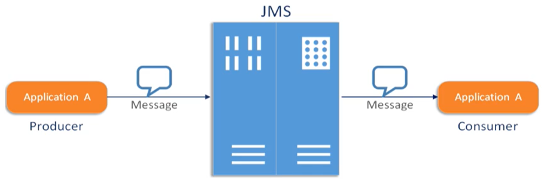
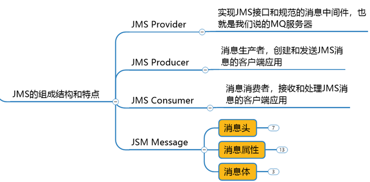
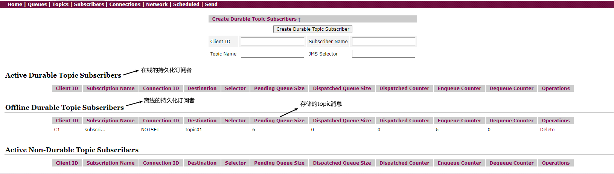
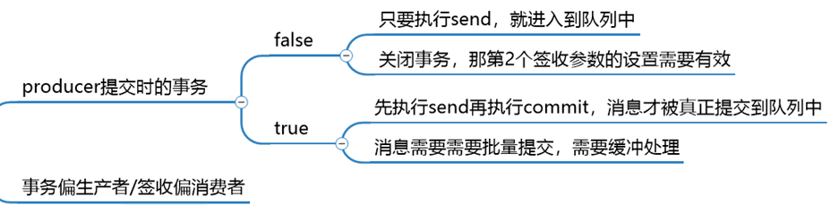

# 第4章_JMS规范及代码实现

> JavaEE
>
> JavaEE 是一套使用 Java 进行企业级应用开发的大家一直遵循的 13 个核心规范工业标准。JavaEE 平台提供了一个基于组件的方法来加快设计、开发、装配及部署企业应用程序
>
> - JDBC（Java Database）数据库连接
> - JNDI（Java Naming and Directory Interfaces）Java 的命名和目录接口
> - EJB（Enterprise JavaBean）
> - RMI（Remote Method Invoke）远程方法调用
> - Java IDL（Interface Description Language）/ CORBA（Common Object Broker Architecture）接口定义语言/公用对象请求代理程序体系结构
> - JSP（Java Server Pages）
> - Servlet
> - XML（Extensible Markup Language）可扩展白标记语言
> - ==JMS（Java Message Service）Java 消息服务==
> - JTA（Java Transaction API）Java 事务 API
> - JTS（Java Transaction Service）Java 事务服务
> - JavaMail
> - JAF（JavaBean Activation Framework）

## 1.JMS是什么

**什么是 Java 消息服务？**

Java 消息服务指的是两个应用程序之间进行异步通信的 API，它为标准协议和消息服务提供了一组通用接口，包括创建、发送、读取消息等，用于支持 Java 应用程序开发。在 JavaEE 中，当两个应用程序使用 JMS 进行通信时，它们之间不是直接相连的，而是通过一个共同的消息收发服务组件关联起来以达到解耦/异步削峰的效果。





> **消息队列的详细比较**
>
> |       特性        |    ActiveMQ     |  RabbitMQ  |      Kafka       |    RocketMQ    |
> | :---------------: | :-------------: | :--------: | :--------------: | :------------: |
> | PRODUCER-CONSUMER |      支持       |    支持    |       支持       |      支持      |
> | PUBLISH-SUBSCRIBE |      支持       |    支持    |       支持       |      支持      |
> |   REQUEST-REPLY   |      支持       |    支持    |        -         |      支持      |
> |    API 完备性     |       高        |     高     |        高        | 低（静态配置） |
> |    多语言支持     | 支持，JAVA 优先 |  语言无关  | 支持，JAVA 优先  |      支持      |
> |    单机吞吐量     |      万级       |    万级    |      十万级      |    单机万级    |
> |     消息延迟      |        -        |   微秒级   |      毫秒级      |       -        |
> |      可用性       |   高（主从）    | 高（主从） | 非常高（分布式） |       高       |
> |     消息丢失      |        -        |     低     |  理论上不会丢失  |       -        |
> |     消息重复      |        -        |   可控制   |  理论上会有重复  |       -        |
> |   文档的完备性    |       高        |     高     |        高        |       中       |
> |   提供快速入门    |       有        |     有     |        有        |       无       |
> |   首次部署难度    |        -        |     低     |        中        |       高       |

## 2.消息头

JMS 的消息头有哪些属性：

- `JMSDestination`：消息目的地
- `JMSDeliveryMode`：消息持久化模式
- `JMSExpiration`：消息过期时间
- `JMSPriority`：消息的优先级
- `JMSMessageID`：消息的唯一标识符，后面我们会介绍如何解决幂等性

说明： 消息的生产者可以 set 这些属性，消息的消费者可以 get 这些属性。这些属性在 send 方法里面也可以设置。

```java
public class JmsProduce {

    public static final String ACTIVEMQ_URL = "tcp://192.168.11.101:61616";
    public static final String TOPIC_NAME = "topic01";

    public static void main(String[] args) throws JMSException {
        ActiveMQConnectionFactory activeMQConnectionFactory = new ActiveMQConnectionFactory(ACTIVEMQ_URL);
        Connection connection = activeMQConnectionFactory.createConnection();
        connection.start();
        Session session = connection.createSession(false, Session.AUTO_ACKNOWLEDGE);
        Topic topic = session.createTopic(TOPIC_NAME);
        MessageProducer producer = session.createProducer(topic);

        for (int i = 0; i < 6; i++) {
            TextMessage textMessage = session.createTextMessage("msg---" + i);

            // 这里可以指定每个消息的目的地
            textMessage.setJMSDestination(topic);
            /*
                持久模式和非持久模式。
                一条持久性的消息：应该被传送“一次仅仅一次”，这就意味着如果JMS提供者出现故障，该消息并不会丢失，它会在服务器恢复之后再次传递。
                一条非持久的消息：最多会传递一次，这意味着服务器出现故障，该消息将会永远丢失。
             */
            textMessage.setJMSDeliveryMode(0);
            /*
                可以设置消息在一定时间后过期，默认是永不过期。
                消息过期时间，等于Destination的send方法中的timeToLive值加上发送时刻的GMT时间值。
                如果timeToLive值等于0，则JMSExpiration被设为0，表示该消息永不过期。
                如果发送后，在消息过期时间之后还没有被发送到目的地，则该消息被清除。
             */
            textMessage.setJMSExpiration(System.currentTimeMillis() + timeToLive);
            /*  
                消息优先级，从0-9十个级别，0-4是普通消息5-9是加急消息。
                JMS不要求MQ严格按照这十个优先级发送消息但必须保证加急消息要先于普通消息到达。默认是4级。
             */
            textMessage.setJMSPriority(10);
            // 唯一标识每个消息的标识。MQ会给我们默认生成一个，我们也可以自己指定。
            textMessage.setJMSMessageID("ABCD");
            // 上面有些属性在send方法里也能设置
            producer.send(textMessage);
        }
        producer.close();
        session.close();
        connection.close();

        System.out.println("******消息发布完成******");

    }
}
```

## 3.消息体

- 封装具体的消息数据
- 5 种消息体格式
- 发送和接收的消息体类型必须一致

5 种消息体格式为：

- `TextMessage`：普通字符串消息，包含一个 string
- `MapMessage`：一个 map 类型的消息，key 为 string 类型，而值为 Java 的基本类型
- `BytesMessage`：二进制数组消息，包含一个 byte()
- `StreamMessage`：Java 数据流消息，用标准流操作来顺序的填充和读取
- `ObjectMessage`：对象消息，包含一个可序列化的 Java 对象

下面我们演示 TextMessage 和 MapMessage 的用法：

**消息生产者**

```java
public class JmsProduce {

    public static final String ACTIVEMQ_URL = "tcp://192.168.11.101:61616";
    public static final String TOPIC_NAME = "topic01";

    public static void main(String[] args) throws JMSException {
        ActiveMQConnectionFactory activeMQConnectionFactory = new ActiveMQConnectionFactory(ACTIVEMQ_URL);
        Connection connection = activeMQConnectionFactory.createConnection();
        connection.start();
        Session session = connection.createSession(false, Session.AUTO_ACKNOWLEDGE);
        Topic topic = session.createTopic(TOPIC_NAME);
        MessageProducer producer = session.createProducer(topic);

        for (int i = 0; i < 6; i++) {
            TextMessage textMessage = session.createTextMessage("textmsg---" + i);
            producer.send(textMessage);

            MapMessage mapMessage = session.createMapMessage();
            mapMessage.setString("k1", "mapmsg---" + i);
            producer.send(mapMessage);
        }
        producer.close();
        session.close();
        connection.close();

        System.out.println("******消息发布完成******");

    }
}
```

**消息消费者**

```java
public class JmsConsumer {

    public static final String ACTIVEMQ_URL = "tcp://192.168.11.101:61616";
    public static final String TOPIC_NAME = "topic01";

    public static void main(String[] args) throws JMSException, IOException {
        ActiveMQConnectionFactory activeMQConnectionFactory = new ActiveMQConnectionFactory(ACTIVEMQ_URL);
        Connection connection = activeMQConnectionFactory.createConnection();
        connection.start();
        Session session = connection.createSession(false, Session.AUTO_ACKNOWLEDGE);
        Topic topic = session.createTopic(TOPIC_NAME);
        MessageConsumer consumer = session.createConsumer(topic);
        
        consumer.setMessageListener(message -> {
            if (null != message && message instanceof TextMessage) {
                TextMessage textMessage = (TextMessage) message;
                try {
                    System.out.println("******消费者接收到消息：" + textMessage.getText());
                } catch (JMSException e) {
                    e.printStackTrace();
                }
            }
            if (null != message && message instanceof MapMessage) {
                MapMessage mapMessage = (MapMessage) message;
                try {
                    System.out.println("******消费者接收到消息：" + mapMessage.getString("k1"));
                } catch (JMSException e) {
                    e.printStackTrace();
                }
            }
        });
        System.in.read();
        consumer.close();
        session.close();
        connection.close();
    }
}
```

## 4.消息属性

除了消息头字段之外，也可以用消息属性来标记某条消息。在进行`识别`/`去重`/`重点标注`等操作时非常有用的方法。

他们是以属性名和属性值对的形式制定的。可以将属性是为消息头得扩展，属性指定一些消息头没有包括的附加信息，比如可以在属性里指定消息选择器。消息的属性就像可以分配给一条消息的附加消息头一样。它们允许开发者添加有关消息的不透明附加信息。它们还用于暴露消息选择器在消息过滤时使用的数据。

**消息生产者**

```java
TextMessage textMessage = session.createTextMessage("textmsg---" + i);
textMessage.setStringProperty("From","ZhangSan@qq.com");
textMessage.setByteProperty("Spec", (byte) 1);
textMessage.setBooleanProperty("Invalide",true);
producer.send(textMessage);
```

**消息消费者**

```java
System.out.println("消息体："+textMessage.getText());
System.out.println("消息属性："+textMessage.getStringProperty("From"));
System.out.println("消息属性："+textMessage.getByteProperty("Spec"));
System.out.println("消息属性："+textMessage.getBooleanProperty("Invalide"));
```

## 5.消息的持久化

**什么是持久化消息？**

保证消息只被传送一次和成功使用一次。在持久性消息传送至目标时，消息服务将其放入持久性数据存储。如果消息服务由于某种原因导致失败，它可以恢复此消息并将此消息传送至相应的消费者。虽然这样增加了消息传送的开销，但却增加了可靠性。

我的理解：在消息生产者将消息成功发送给 MQ 消息中间件之后。无论是出现任何问题，如：MQ 服务器宕机、消费者掉线等。都保证（topic 要之前注册过，queue 不用）消息消费者，能够成功消费消息。如果消息生产者发送消息就失败了，那么消费者也不会消费到该消息。

ActiveMQ 中的消息持久化分为**生产者的持久化**和**消费者的持久化**，`生产者默认都是持久化`的，即队列消息和主题消息在服务器宕机后，默认都是保存在磁盘上，当服务器重启后，消费者和订阅者可以消费到保存过的队列和主题。

### 5.1 队列消息持久化

- 持久化：当服务器宕机，消息依然存在，再次开机后消费者仍然可以消费到消息。消息的生产者默认都是持久化的。

  ```java
  messageProducer.setDeliveryMode(DeliveryMode.PRESISTENT);
  ```

- 非持久：当服务器宕机，消息不存在（消息丢失了）。即便是非持久，消费者在不在线的话，消息也不会丢失，等待消费者在线，还是能够收到消息的

  ```java
  messageProducer.setDeliveryMode(DeliveryMode.NON_PRESISTENT);
  ```

持久化消息，保证这些消息只被传送一次和成功使用一次。对于这些消息，可靠性是优先考虑的因素。可靠性的另一个重要方面是确保持久性消息传送至目标后，消息服务在向消费者传送它们之前不会丢失这些消息。

**生产者**

```java
ActiveMQConnectionFactory activeMQConnectionFactory = new ActiveMQConnectionFactory(ACTIVEMQ_URL);
Connection connection = activeMQConnectionFactory.createConnection();
connection.start();
Session session = connection.createSession(false,Session.AUTO_ACKNOWLEDGE);
Queue queue = session.createQueue(QUEUE_NAME);
MessageProducer messageProducer = session.createProducer(queue);
// 非持久化
messageProducer.setDeliveryMode(DeliveryMode.NON_PERSISTENT);
```

### 5.2 主题消息持久化

`主题本身默认是持久化的`，因为 producer 的`deliveryMode`默认的都是`持久化`，即使 MQ 服务器宕机主题依然会保存下来（只有存在持久化消费者时才能体现出来），当下次持久化消费者上线时就能接收到消息。

但是`消费者默认是不持久化的`。主题消息持久化体现在消费者，只有存在**订阅者**（持久的消费者），当服务器宕机或者消费者下线后，再次恢复时只有订阅者能接收到消息。

> 注意：
>
> - 一定要先运行一次消费者，等于向 MQ 注册，类似我订阅了这个主题
> - 然后再运行生产者发送消息
> - 之后无论消费者是否在线，都会收到消息，如果不在线的话，下次连接的时候，会把没有收过的消息都接收过来

**生产者**

```java
public class JmsProduce {

    public static final String ACTIVEMQ_URL = "tcp://192.168.11.101:61616";
    public static final String TOPIC_NAME = "topic01";

    public static void main(String[] args) throws JMSException {
        ActiveMQConnectionFactory activeMQConnectionFactory = new ActiveMQConnectionFactory(ACTIVEMQ_URL);
        Connection connection = activeMQConnectionFactory.createConnection();
        connection.start();
        Session session = connection.createSession(false, Session.AUTO_ACKNOWLEDGE);
        Topic topic = session.createTopic(TOPIC_NAME);
        // 默认 deliveryMode 为 DeliveryMode.PRESISTENT
        MessageProducer producer = session.createProducer(topic);
        for (int i = 0; i < 6; i++) {
            TextMessage textMessage = session.createTextMessage("textmsg---" + i);
            textMessage.setStringProperty("From","ZhangSan@qq.com");
            textMessage.setByteProperty("Spec", (byte) 1);
            textMessage.setBooleanProperty("Invalide",true);
            producer.send(textMessage);
        }
        producer.close();
        session.close();
        connection.close();
        System.out.println("******消息发布完成******");
    }
}
```

**消费者**

```java
public class JmsConsumer {

    public static final String ACTIVEMQ_URL = "tcp://192.168.11.101:61616";
    public static final String TOPIC_NAME = "topic01";

    public static void main(String[] args) throws JMSException, IOException {
        ActiveMQConnectionFactory activeMQConnectionFactory = new ActiveMQConnectionFactory(ACTIVEMQ_URL);
        Connection connection = activeMQConnectionFactory.createConnection();
        // 必须要设置客户端ID
        connection.setClientID("C1");
        connection.start();
        Session session = connection.createSession(false, Session.AUTO_ACKNOWLEDGE);
        Topic topic = session.createTopic(TOPIC_NAME);
		// 创建一个持久化订阅者对象，参数1为主题，参数2为订阅者名称
        TopicSubscriber subscriber1 = session.createDurableSubscriber(topic, "subscriber1");
        // 通过 receive() 接受消息
        TextMessage message = (TextMessage) subscriber1.receive();
        while (null != message) {
            System.out.println(message.getText());
            message = (TextMessage) subscriber1.receive();
        }
        subscriber1.close();
        session.close();
        connection.close();
    }
}
```

控制台介绍：

topic 页面还是和之前的一样。另外在 subscribers 页面也会显示。如下：



## 6.消息的事务性



（1）生产者开启事务后，执行 commit 方法，这批消息才真正的被提交。不执行 commit 方法，这批消息不会提交。执行 rollback 方法，之前的消息会回滚掉。生产者的事务机制，要高于签收机制，当生产者开启事务，签收机制不再重要。

（2）消费者开启事务后，执行 commit 方法，这批消息才算真正的被消费。不执行 commit 方法，这些消息不会标记已消费，下次还会被消费。执行 rollback 方法，是不能回滚之前执行过的业务逻辑，但是能够回滚之前的消息，回滚后的消息，下次还会被消费。消费者利用 commit 和 rollback 方法，甚至能够违反一个消费者只能消费一次消息的原理。

（3）问：消费者和生产者需要同时操作事务才行吗？  

答：消费者和生产者的事务，完全没有关联，各自是各自的事务。

**生产者**

```java
public class Jms_TX_Producer {
    private static final String ACTIVEMQ_URL = "tcp://192.168.10.130:61616";
    private static final String ACTIVEMQ_QUEUE_NAME = "Queue-TX";

    public static void main(String[] args) throws JMSException {
        ActiveMQConnectionFactory activeMQConnectionFactory = new ActiveMQConnectionFactory(ACTIVEMQ_URL);
        Connection connection = activeMQConnectionFactory.createConnection();
        connection.start();
        //1.创建会话session，两个参数transacted=事务,acknowledgeMode=确认模式(签收)
        //设置为开启事务
        Session session = connection.createSession(true, Session.AUTO_ACKNOWLEDGE);
        Queue queue = session.createQueue(ACTIVEMQ_QUEUE_NAME);
        MessageProducer producer = session.createProducer(queue);
        try {
            for (int i = 0; i < 3; i++) {
                TextMessage textMessage = session.createTextMessage("tx msg--" + i);
                producer.send(textMessage);
                if(i == 2){
                    // 抛出异常后执行回滚操作，此时并不会有任何消息发送到MQ，但该次消息操作会被记录
                    throw new RuntimeException("GG.....");
                }
            }
            // 2. 开启事务后，使用commit提交事务，这样这批消息才能真正的被提交。
            session.commit();
            System.out.println("消息发送完成");
        } catch (Exception e) {
            System.out.println("出现异常,消息回滚");
            // 3. 工作中一般，当代码出错，我们在catch代码块中回滚。这样这批发送的消息就能回滚。
            session.rollback();
        } finally {
            //4. 关闭资源
            producer.close();
            session.close();
            connection.close();
        }
    }
}
```

**消费者**

```java
public class Jms_TX_Consumer {
    private static final String ACTIVEMQ_URL = "tcp://118.24.20.3:61626";
    private static final String ACTIVEMQ_QUEUE_NAME = "Queue-TX";

    public static void main(String[] args) throws JMSException, IOException {
        ActiveMQConnectionFactory activeMQConnectionFactory = new ActiveMQConnectionFactory(ACTIVEMQ_URL);
        Connection connection = activeMQConnectionFactory.createConnection();
        connection.start();
        // 创建会话session，两个参数transacted=事务,acknowledgeMode=确认模式(签收)
        // 消费者开启了事务就必须手动提交，不然会重复消费消息
        final Session session = connection.createSession(true, Session.AUTO_ACKNOWLEDGE);
        Queue queue = session.createQueue(ACTIVEMQ_QUEUE_NAME);
        MessageConsumer messageConsumer = session.createConsumer(queue);
        messageConsumer.setMessageListener(new MessageListener() {
            int a = 0;
            @Override
            public void onMessage(Message message) {
                if (message instanceof TextMessage) {
                    try {
                        TextMessage textMessage = (TextMessage) message;
                        System.out.println("***消费者接收到的消息:" + textMessage.getText());
                        if(a == 0){
                            System.out.println("commit");
                            session.commit();
                        }
                        if (a == 2) {
                            System.out.println("rollback");
                            session.rollback();
                        }
                        a++;
                    } catch (Exception e) {
                        System.out.println("出现异常，消费失败，放弃消费");
                        try {
                            session.rollback();
                        } catch (JMSException ex) {
                            ex.printStackTrace();
                        }
                    }
                }
            }
        });
        //关闭资源
        System.in.read();
        messageConsumer.close();
        session.close();
        connection.close();
    }
}
```

消费者的控制台输出信息：

```bash
***消费者接收到的消息:   tx msg--0
commit
***消费者接收到的消息:   tx msg--1
***消费者接收到的消息:   tx msg--2
# 收到第三条消息后执行回滚，由于没有执行 commit，并不会消费第2条和第3条消息
rollback
# 系统发现还有消息存在，继续执行 onMessage() 方法，但这次系统既没有 commit 也没有 rollback，虽然停止了消费消息，但第2条和第3条消息仍处于 pending 状态
***消费者接收到的消息:   tx msg--1
***消费者接收到的消息:   tx msg--2
```

## 7.消息的签收机制

生产者不适用于签收。

### 7.1 签收的几种方式

- `自动签收`（Session.AUTO_ACKNOWLEDGE）：该方式是`默认`的。该种方式，无需我们程序做任何操作，框架会帮我们自动签收收到的消息
- `手动签收`（Session.CLIENT_ACKNOWLEDGE）：手动签收。该种方式，需要我们手动调用`Message.acknowledge()`来签收消息。如果不签收消息，该消息可以被反复消费，直到被签收
- `允许重复消息`（Session.DUPS_OK_ACKNOWLEDGE）：多线程或多个消费者同时消费到一个消息，因为线程不安全，可能会重复消费，该种方式很少使用到
- `事务下的签收`（Session.SESSION_TRANSACTED）：开始事务的情况下，可以使用该方式，但该种方式很少使用到

### 7.2 事务和签收的关系

- 在事务性会话中，当一个事务被成功提交则消息被自动签收。如果事务回滚，则消息会被再次传送。`事务优先于签收`，开始事务后，签收机制不再起任何作用
- 非事务性会话中，消息何时被确认取决于创建会话时的应答模式
- 消费者开启事务后，只有 commit 后才能将全部消息变为已消费
- 事务偏向生产者，签收偏向消费者

 **非事务下的消费者如何手动签收**

```java
public class Jms_TX_Consumer {
    private static final String ACTIVEMQ_URL = "tcp://118.24.20.3:61626";
    private static final String ACTIVEMQ_QUEUE_NAME = "Queue-ACK";

    public static void main(String[] args) throws JMSException, IOException {
        ActiveMQConnectionFactory activeMQConnectionFactory = new ActiveMQConnectionFactory(ACTIVEMQ_URL);
        Connection connection = activeMQConnectionFactory.createConnection();
        connection.start();
        Session session = connection.createSession(false, Session.CLIENT_ACKNOWLEDGE);
        Queue queue = session.createQueue(ACTIVEMQ_QUEUE_NAME);
        MessageConsumer messageConsumer = session.createConsumer(queue);
        messageConsumer.setMessageListener(new MessageListener() {
            @Override
            public void onMessage(Message message) {
                if (message instanceof TextMessage) {
                    try {
                        TextMessage textMessage = (TextMessage) message;
                        System.out.println("***消费者接收到的消息:" + textMessage.getText());
                        /* 
                        设置为Session.CLIENT_ACKNOWLEDGE后，要调用该方法，标志着该消息已被签收（消费）。
                        如果不调用该方法，该消息的标志还是未消费，下次启动消费者或其他消费者还会收到改消息。
                         */
                        textMessage.acknowledge();
                    } catch (Exception e) {
                        System.out.println("出现异常，消费失败，放弃消费");
                    }
                }
            }
        });
        System.in.read();
        messageConsumer.close();
        session.close();
        connection.close();
    }
}
```

## 8.JMS的点对点总结

点对点模型是基于队列的，生产者发消息到队列，消费者从队列接收消息，队列的存在使得消息的异步传输成为可能。和我们平时给朋友发送短信类似。

如果在 session 关闭时有部分消息己被收到但还没有被签收（acknowledged），那当消费者下次连接到相同的队列时，这些消息还会被再次接收。

队列可以长久地保存消息直到消费者收到消息。消费者不需要因为担心消息会丢失而时刻和队列保持激活的连接状态，充分体现了异步传输模式的优势。

## 9.JMS的发布订阅总结

**（1）JMS的发布订阅总结**

JMS Pub/Sub 模型定义了如何向一个内容节点发布和订阅消息，这些节点被称作 topic。

主题可以被认为是消息的传输中介，发布者（publisher）发布消息到主题，订阅者（subscribe）从主题订阅消息。

主题使得消息订阅者和消息发布者保持互相独立不需要解除即可保证消息的传送。

**（2）非持久订阅**

非持久订阅只有当客户端处于激活状态，也就是和 MQ 保持连接状态才能收发到某个主题的消息。

如果消费者处于离线状态，生产者发送的主题消息将会丢失作废，消费者永远不会收到。

  一句话：先订阅注册才能接受到发布，只给订阅者发布消息。

**（3）持久订阅**

客户端首先向 MQ 注册一个自己的身份 ID 识别号，当这个客户端处于离线时，生产者会为这个 ID 保存所有发送到主题的消息，当客户再次连接到 MQ 的时候，会根据消费者的 ID 得到所有当自己处于离线时发送到主题的消息。

非持久订阅状态下，不能恢复或重新派送一个未签收的消息。只有持久订阅才能恢复或重新派送一个未签收的消息。

**（4）非持久和持久化订阅如何选择**

当所有的消息必须被接收，则用持久化订阅。当消息丢失能够被容忍，则用非持久订阅。

## 10.ActiveMQ的broker

**（1）broker是什么**

相当于一个 ActiveMQ 服务器实例。说白了，Broker 其实就是实现了用代码的形式启动 ActiveMQ，相当于将 MQ 嵌入到 Java 代码中，以便随时用随时启动，在用的时候再去启动这样能节省资源，也保证了可用性。我们实际开发中很少采用这种方式，因为他缺少太多了东西，如：日志，数据存储等等。

**（2）启动broker时指定配置文件**

启动 broker 时指定配置文件，可以帮助我们在一台服务器上启动多个 broker。实际工作中一般一台服务器只启动一个 broker。

```bash
[root@myServer1 conf]# cp activemq.xml activemq02.xml
[root@myServer1 bin]# ./activemq start xbean:file:/usr/local/activemq/apache-activemq-5.16.5/conf/activemq02.xml 
```

**（3）嵌入式的broker启动**

用 ActiveMQ Broker 作为独立的消息服务器来构建 Java 应用。ActiveMQ 也支持在 vm 中通信基于嵌入的 broker，能够无缝的集成其他 java 应用。

下面演示如何启动嵌入式的 broker：

- pom.xml 添加一个依赖

  ```xml
  <dependency>
      <groupId>com.fasterxml.jackson.core</groupId>
      <artifactId>jackson-databind</artifactId>
      <version>2.10.1</version>
  </dependency>
  ```

- 嵌入式 broke 的启动类

  ```java
  public class EmbedBroker {
      public static void main(String[] args) throws Exception {
          //ActiveMQ 也支持在 vm 中通信基于嵌入的 broker
          BrokerService brokerService = new BrokerService();
          brokerService.setUseJmx(true);
          brokerService.addConnector("tcp://localhost:61616");
          brokerService.start();
     }
  }
  ```

