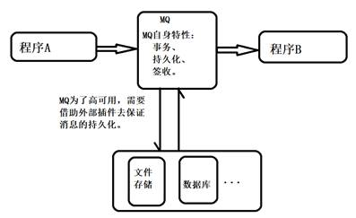
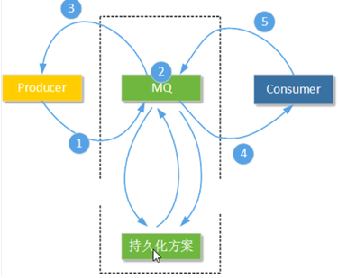
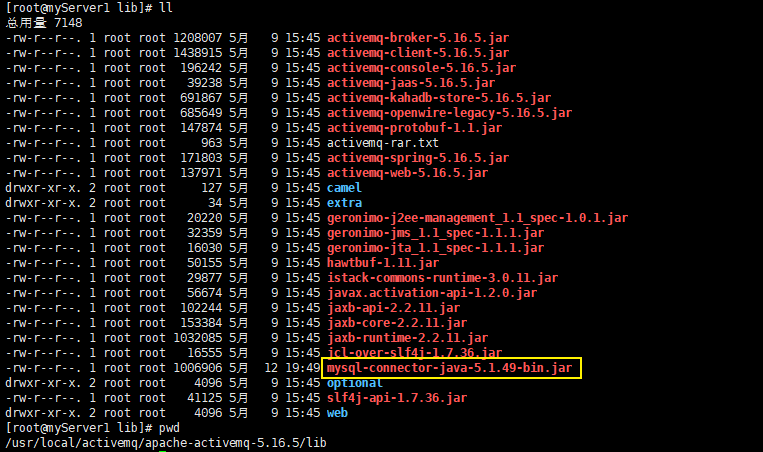
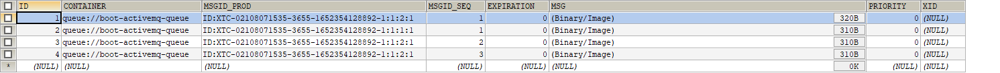
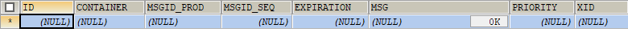
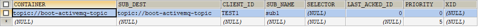
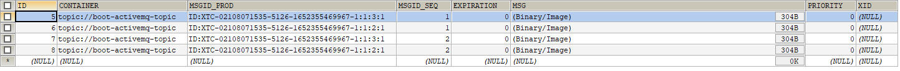

# 第7章_ActiveMQ的消息存储和持久化

## 1.介绍

**此处持久化和之前的持久化的区别**



MQ 高可用：事务、可持久、签收，是属于 MQ 自身特性，自带的。这里的持久化是外力，是外部插件。之前讲的持久化是 MQ 的外在表现，现在讲的的持久是底层实现。

**持久化是什么**

官网文档：http://activemq.apache.org/persistence

持久化是什么？一句话就是：ActiveMQ 宕机了，消息不会丢失的机制。

说明：为了避免意外宕机以后丢失信息，需要做到重启后可以恢复消息队列，消息系统一半都会采用持久化机制。ActiveMQ 的消息持久化机制有 JDBC，AMQ，KahaDB 和 LevelDB，无论使用哪种持久化方式，消息的存储逻辑都是一致的。就是在发送者将消息发送出去后，消息中心首先将消息存储到本地数据文件、内存数据库或者远程数据库等。再试图将消息发给接收者，成功则将消息从存储中删除，失败则继续尝试发送。消息中心启动以后，要先检查指定的存储位置是否有未成功发送的消息，如果有，则会先把存储位置中的消息发出去。

## 2.类型

**（1）AMQ Message Store（了解）**

基于文件的存储机制，是以前的默认机制，现在不再使用。

AMQ 是一种文件存储形式，它具有写入速度快和容易恢复的特点。消息存储再一个个文件中文件的默认大小为 32M，当一个文件中的消息已经全部被消费，那么这个文件将被标识为可删除，在下一个清除阶段，这个文件被删除。AMQ 适用于 ActiveMQ5.3 之前的版本

**（2）kahaDB（默认）**

下面我们再详细介绍。

**（3）JDBC**

下面我们再详细介绍。

**（4）LevelDB（了解）**

这种文件系统是从 ActiveMQ5.8 之后引进的，它和 KahaDB 非常相似，也是基于文件的本地数据库存储形式，但是它提供比 KahaDB 更快的持久性。但它不使用自定义 B-Tree 实现来索引预写日志，而是使用基于 LevelDB 的索引。

==在最新版本被废除==，推荐使用`kahaDB`。

默认配置如下：

```xml
<persistenceAdapter>
	<levelDBdirectory = "activemq-data" />
</persistenceAdapter>
```

**（5）JDBC Message Store with ActiveMQ Journal**

下面我们再详细介绍。

## 3.kahaDB消息存储

**介绍**

基于日志文件，从 ActiveMQ5.4（含）开始默认的持久化插件。

官网文档：http://activemq.aache.org/kahadb，官网上还有一些其他配置参数。

 配置文件 activemq.xml 中的对应配置如下：

```xml
<persistenceAdapter>
    <kahaDB directory="${activemq.data}/kahadb"/>
</persistenceAdapter>
```

日志文件的存储目录在：`%activemq安装目录%/data/kahadb`

**说明**

KahaDB 是目前默认的存储方式，可用于任何场景，提高了性能和恢复能力。消息存储使用一个**事务日志**和仅仅用一个**索引文件**来存储它所有的地址。KahaDB 是一个专门针对消息持久化的解决方案，他对典型的消息使用模式进行了优化。数据被追加到 data logs 中。当不再需要 log 文件中的数据的时候，log 文件会被丢弃。


**KahaDB的存储原理**

kahadb 在消息保存目录中只有 4 类文件和一个 lock，跟 ActiveMQ 的其他几种文件存储引擎相比这就非常简洁了。

- `db-<Number>.log`

  kahaDB 存储消息到预定义大小的**数据记录文件**中，文件名命名为`db-<Number>.log`。当数据文件满时，一个新的文件会被创建，number 数值也会随之递增，它随着消息数量而增多，如每 32M 一个文件，文件名按照数字进行编号，如 db-1.log、db-2.log 等。当不再有引用到数据文件中的任何消息时，文件会被删除或归档。

- `db.data`

  该文件包含了持久化的`BTree`**索引**，索引了消息数据记录中的消息，它是消息的索引文件，本质上是 B 树，使用 B 树作为索引指向`db-<Number>.log`里面存储的消息。

- `db.free`

  当前`db.data`文件里哪些页面是空闲的，文件具体内容是所有空闲页的 ID。

- `db.redo`

  用来进行消息恢复，如果 kahaDB 消息存储在强制退出后启动，该文件会被用于恢复 B 树索引。

- `lock`

  文件锁，表示当前获得 kahaDB 读写权限的 broker。

## 4.JDBC消息存储

### 4.1 设置

**原理**



**步骤**

- **添加 mysql 数据库的驱动包到 lib 文件夹**

  

-  **jdbcPersistenceAdapter 配置**

  在`${activeMQ安装目录}/conf`路径下修改 activemq.xml 配置文件，按照如下修改：

  ```xml
  <!--
  	dataSource：指定将要引用的持久化数据库的 bean 名称
  	crateTablesOnStartup：是否在启动的时候创建数据表，默认值是 ture，这样每次启动都会去创建数据表了，一般是第一次启动的时候设置为 true，之后改为 false
  -->
  <persistenceAdapter>
      <jdbcPersistenceAdapter dataSource="#mysql-ds" createTableOnStartup="true"/>
  </persistenceAdapter>
  ```

- **数据库连接池配置**

  需要我们准备一个 mysql 数据库，并创建一个名为 activemq 的数据库。

  在\</broker>标签和\<import>标签之间插入数据库连接池配置

  ```xml
  </broker>
  
  <bean id="mysql-ds" class="org.apache.commons.dbcp2.BasicDataSource" destroy-method="close">
      <property name="driverClassName" value="com.mysql.jdbc.Driver"/>
      <property name="url" value="jdbc:mysql://localhost/activemq?relaxAutoCommit=true"/>
      <property name="username" value="root"/>
      <property name="password" value="root"/>
      <property name="poolPreparedStatements" value="true"/>
  </bean>
  
  <import resource="jetty.xml"/>
  ```

  之后需要建一个数据库，名为 activemq。新建的数据库要采用 latin1 或者 ASCII 编码。https://blog.csdn.net/JeremyJiaming/article/details/88734762

  ```sql
  CREATE DATABASE activemq;
  ```

  默认是的 dbcp 数据库连接池，如果要换成其他数据库连接池，需要将该连接池 jar 包，也放到 lib 目录下。

- **建库 SQL 和创表说明**

  重启 activemq。会自动生成如下 3 张表。

  ```sql
  mysql> show tables;
  +--------------------+
  | Tables_in_activemq |
  +--------------------+
  | ACTIVEMQ_ACKS      |
  | ACTIVEMQ_LOCK      |
  | ACTIVEMQ_MSGS      |
  +--------------------+
  3 rows in set (0.02 sec)
  ```
  
  如果没有自动生成，需要我们手动执行 SQL。我个人建议要自动生成，我在操作过程中查看日志文件，发现了不少问题，最终解决了这些问题后，是能够自动生成的。如果不能自动生成说明你的操作有问题。如果实在不行，下面是手动建表的 SQL：
  
  ```sql
  -- auto-generated definition
  create table ACTIVEMQ_ACKS
  (
      CONTAINER     varchar(250)     not null comment '消息的Destination',
      SUB_DEST      varchar(250)     null comment '如果使用的是Static集群，这个字段会有集群其他系统的信息',
      CLIENT_ID     varchar(250)     not null comment '每个订阅者都必须有一个唯一的客户端ID用以区分',
      SUB_NAME      varchar(250)     not null comment '订阅者名称',
      SELECTOR      varchar(250)     null comment '选择器，可以选择只消费满足条件的消息，条件可以用自定义属性实现，可支持多属性AND和OR操作',
      LAST_ACKED_ID bigint           null comment '记录消费过消息的ID',
      PRIORITY      bigint default 5 not null comment '优先级，默认5',
      XID           varchar(250)     null,
      primary key (CONTAINER, CLIENT_ID, SUB_NAME, PRIORITY)
  ) comment '用于存储订阅关系。如果是持久化Topic，订阅者和服务器的订阅关系在这个表保存';
  
  create index ACTIVEMQ_ACKS_XIDX on ACTIVEMQ_ACKS (XID);
  
  -- auto-generated definition
  create table ACTIVEMQ_LOCK
  (
      ID bigint not null primary key,
      TIME bigint null,
      BROKER_NAME varchar(250) null
  );
  
  -- auto-generated definition
  create table ACTIVEMQ_MSGS
  (
      ID bigint not null primary key,
      CONTAINER  varchar(250) not null,
      MSGID_PROD varchar(250) null,
      MSGID_SEQ  bigint       null,
      EXPIRATION bigint       null,
      MSG        blob         null,
      PRIORITY   bigint       null,
      XID        varchar(250) null
  );
  
  create index ACTIVEMQ_MSGS_CIDX on ACTIVEMQ_MSGS (CONTAINER);
  create index ACTIVEMQ_MSGS_EIDX on ACTIVEMQ_MSGS (EXPIRATION);
  create index ACTIVEMQ_MSGS_MIDX on ACTIVEMQ_MSGS (MSGID_PROD, MSGID_SEQ);
  create index ACTIVEMQ_MSGS_PIDX on ACTIVEMQ_MSGS (PRIORITY);
  create index ACTIVEMQ_MSGS_XIDX on ACTIVEMQ_MSGS (XID);
  ```
  
  `ACTIVEMQ_MSGS`数据表用于存储消息信息，字段如下：

  - ID：自增的数据库主键
  - CONTAINER：消息的 Destination
  - MSGID_PROD：消息发送者的主键
  - MSG_SEG：是发送消息的顺序，MSGID_PROD + MSG_SEQ 可以组成 JMS 的 MessageID
  - EXPIRATION：消息的过期时间，存储的是从 1970-01-01 到现在的毫秒数
  - MSG：消息本体的 JAVA 序列化对象的二进制数据
  - PRIORITY：优先级，从 0-9，数值越大优先级越高
  
  `ACTIVEMQ_ACKS`数据表用于存储订阅关系。如果是持久化 Topic，订阅者和服务器的订阅关系在这个表保存。数据库字段如下：
  
  - CONTAINER：消息的 Destination
  - SUB_DEST：如果是使用 static 集群，这个字段会有集群其他系统的信息
  - CLIENT_ID：每个订阅者都必须有一个唯一的客户端 ID 用以区分
  - SUB_NAME：订阅者名称
  - SELECTOR：选择器，可以选择只消费满足条件的消息。条件可以用自定义属性实现，可支持多属性 AND 和 OR 操作
  - LAST_ACKED_ID：记录消费过的消息的 ID
  
  `ACTIVEMQ_LOCK`数据表在集群环境中才有用，只有一个 broker 可以获得消息，称为 Master Broker，其他的只能作为备份等待 Master Broker 不可用，才可能成为下一个 Master Broker。这个表用于记录哪个 Broker 是当前的 Master Broker。字段如下：
  
  - ID：锁的唯一 ID
  - BROKER_NAME：当前拥有锁的 broker 的名称

### 4.2 queue验证和数据表变化

在点对点类型中，当 DeliveryMode 设置为`NON_PERSISTENCE`时，消息被保存在内存中，当 DeliveryMode 设置为`PERSISTENCE`时，消息保存在 broker 的相应的文件或者数据库中。而且点对点类型中消息一旦被 Consumer 消费就会从 broker 中删除。

queue 模式中，非持久化不会将消息持久化到数据库，持久化会将消息持久化数据库。我们使用 queue 模式持久化，发布 4 条消息后，发现 ACTIVEMQ_MSGS 数据表多了 4 条数据。



启动消费者，消费了所有的消息后，发现数据表的数据消失了。



在 queue 模式非持久化中消息不会持久化消息到数据表。

### 4.3 topic验证和说明

我们先启动一下持久化 topic 的消费者。看到 ACTIVEMQ_ACKS 数据表多了一条消息。  

```java
// 持久化topic 的消息消费者
public class JmsConsummer_persistence {
    private static final String ACTIVEMQ_URL = "tcp://192.168.11.101:61616";
    public static final String TOPIC_NAME = "jdbc-02";

    public static void main(String[] args) throws Exception{
        ActiveMQConnectionFactory activeMQConnectionFactory = new ActiveMQConnectionFactory(ACTIVEMQ_URL);
        Connection connection = activeMQConnectionFactory.createConnection();
        connection.setClientID("marrry");
        Session session = connection.createSession(false, Session.AUTO_ACKNOWLEDGE);
        Topic topic = session.createTopic(TOPIC_NAME);
        TopicSubscriber topicSubscriber = session.createDurableSubscriber(topic,"remark...");
        connection.start();
        Message message = topicSubscriber.receive();
        while (null != message){
            TextMessage textMessage = (TextMessage)message;
            System.out.println(" 收到的持久化 topic ："+textMessage.getText());
            message = topicSubscriber.receive();
        }
        session.close();
        connection.close();
    }
}
```

ACTIVEMQ_ACKS 数据表，多了一个消费者的身份信息。一条记录代表：一个持久化 topic 消费者



我们启动持久化生产者发布 4 个数据，ACTIVEMQ_MSGS 数据表新增 4 条数据，消费者消费所有的数据后，ACTIVEMQ_MSGS 数据表的数据并没有消失。持久化 topic 的消息不管是否被消费，是否有消费者，产生的数据永远都存在，且只存储一条。这个是要注意的，持久化的 topic 大量数据后可能导致性能下降。这里就像公总号一样，消费者消费完后，消息还会保留。



### 4.4 总结

对于 queue，在没有消费者消费的情况下会将消息保存到 activemq_msgs 表中，只要有任意一个消费者已经消费过了，消费之后这些消息将会立即被删除。

对于 topic，一般是先启动消费订阅然后再生产的情况下会将消息保存到 activemq_msgs，订阅者保存在 activemq_acks。

> 在配置关系型数据库作为 ActiveMQ 的持久化存储方案时，需要注意以下几点：
>
> - 数据库 jar 包
>
>   记得将相关 jar 文件放置到 ActiveMQ 安装路径下的 lib 目录。mysql-jdbc 驱动的 jar 包和对应的数据库连接池 jar 包。
>
> - createTablesOnStartup 属性
>
>   在 jdbcPersistenceAdapter 标签中设置了 createTablesOnStartup 属性为 true 时在第一次启动 ActiveMQ 时，ActiveMQ 服务节点会自动创建所需要的数据表。启动完成后可以去掉这个属性，或者更改 createTablesOnStartup 属性为 false。
>
> - 遇到`java.lang.IllegalStateException: BeanFactory not initialized or already closed`时，可能是因为操作系统的机器名中有下划线`_`，重命名后即可解决问题

## 5.JDBC Message Store with ActiveMQ Journal

**(1)**   **说明**

这种方式克服了 JDBC Store 的不足，JDBC 每次消息过来，都需要去写库读库。ActiveMQ Journal，使用高速缓存写入技术，大大提高了性能。当消费者的速度能够及时跟上生产者消息的生产速度时，journal 文件能够大大减少需要写入到 DB 中的消息。从 4.X 开始变为默认开启。

举个例子：生产者生产了 1000 条消息，这 1000 条消息会保存到 journal 文件，如果消费者的消费速度很快的情况下，在 journal 文件还没有同步到 DB 之前，消费者已经消费了 90% 的以上消息，那么这个时候只需要同步剩余的 10% 的消息到 DB。如果消费者的速度很慢，这个时候 journal 文件可以使消息以批量方式写到 DB。

为了高性能，这种方式使用日志文件存储 + 数据库存储。先将消息持久到日志文件，等待一段时间再将未消费的消息持久到数据库。该方式要比 JDBC 性能要高。

**(2)**   **activemq.xml配置**

下面是基于上面 JDBC 配置，再做一点修改：

```xml
<persistenceFactory>
    <journalPersistenceAdapterFactory
		journalLogFiles="4"
        journalLogFileSize="32768"
        useJournal="true"
        useQuickJournal="true"
        dataSource="#mysql-ds"
        dataDirectory="activemq-data"
	/>
</persistenceFactory>
```

## 6.总结

- jdbc 效率低，kahaDB 效率高，jdbc+Journal 效率较高

- 持久化消息主要指的是：MQ 所在服务器宕机了消息不会丢试的机制

- 持久化机制演变的过程：

  从最初的 AMQ Message Store 方案到 ActiveMQ V4 版本退出的 High Performance Journal（高性能事务支持）附件，并且同步推出了关于关系型数据库的存储方案。ActiveMQ5.3 版本又推出了对 KahaDB 的支持（5.4 版本后被作为默认的持久化方案），后来 ActiveMQ 5.8 版本开始支持 LevelDB，到现在 5.9 提供了标准的 Zookeeper+LevelDB 集群化方案。

- ActiveMQ 消息持久化机制有：

  | 机制                     | 实现方式                                                     |
  | ------------------------ | ------------------------------------------------------------ |
  | AMQ                      | 基于日志文件                                                 |
  | KahaDB                   | 基于日志文件，从 ActiveMQ5.4 开始默认使用                    |
  | JDBC                     | 基于第三方数据库                                             |
  | Replicated LevelDB Store | 从 5.9 开始提供了 LevelDB 和 Zookeeper 的数据复制方法，用于 Master-Slave 方式的首选数据复制方案 |

  