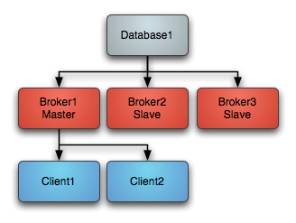

# 第8章_ActiveMQ多节点集群

集群仅提供主备方式的高可用集群功能，避免单点故障。

参考：https://activemq.apache.org/masterslave

以下是可用的不同类型的主 / 从配置：

| Master Slave Type                                            | Requirements                       | Pros                                                         | Cons                                                         |
| ------------------------------------------------------------ | ---------------------------------- | ------------------------------------------------------------ | ------------------------------------------------------------ |
| [Shared File System Master Slave](https://activemq.apache.org/shared-file-system-master-slave) | A shared file system such as a SAN | Run as many slaves as required. Automatic recovery of old masters | Requires shared file system                                  |
| [JDBC Master Slave](https://activemq.apache.org/jdbc-master-slave) | A Shared database                  | Run as many slaves as required. Automatic recovery of old masters | Requires a shared database. Also relatively slow as it cannot use the high performance journal |

## JDBC Master Slave

First supported in ActiveMQ version 4.1

If you are using pure JDBC and not using the high performance journal then you are generally relying on your database as your single point of failure and persistence engine. If you do not have really high performance requirements this approach can make a lot of sense as you have a single persistence engine to backup and manage etc.

### Startup

When using just JDBC as the data source you can use a Master Slave approach, running as many brokers as you wish as this diagram shows. On startup one master **grabs an exclusive lock** in the broker database - all other brokers are slaves and pause waiting for the exclusive lock.



Clients should be using the [Failover Transport](https://activemq.apache.org/failover-transport-reference) to connect to the available brokers. e.g. using a URL something like the following

```
failover:(tcp://broker1:61616,tcp://broker2:61616,tcp://broker3:61616)
```

Only the master broker starts up its transport connectors and so the clients can only connect to the master.