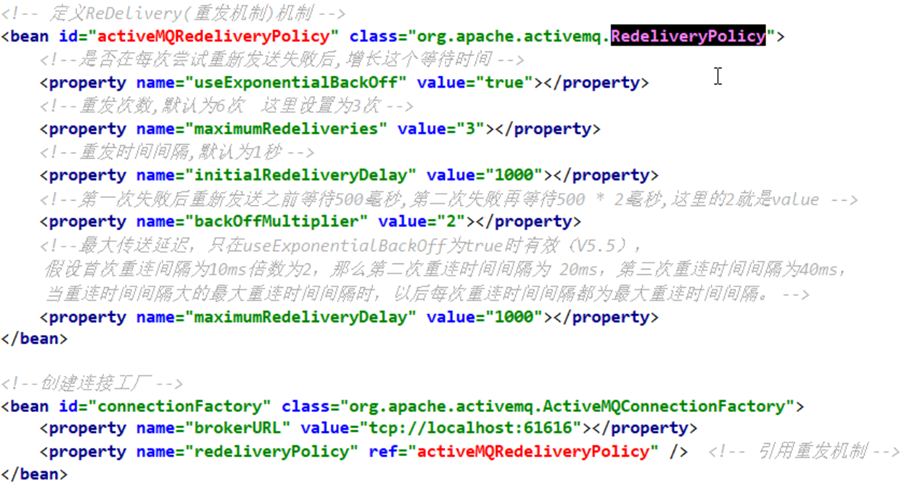
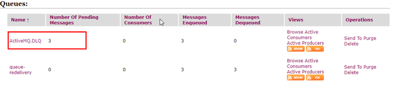
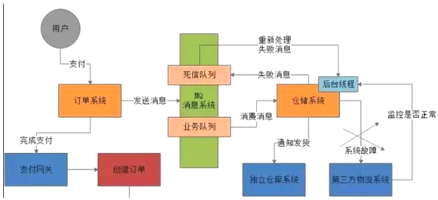

# 第9章_ActiveMQ高级特性

## 1.异步投递

**异步投递是什么**

ActiveMQ 支持同步、异步两种发送的模式将消息发送到 broker，模式的选择对发送延时有巨大的影响。producer 能达到怎样的产出率（产出率 = 发送数据总量 / 时间）主要受发送延时的影响，使用异步发送可以显著的提高发送的性能。

ActiveMQ **默认使用异步发送的模式**：除非明确指定使用同步发送的方式或者在未使用事务的前提下发送持久化消息，这两种情况都是同步发送的。

如果你没有使用事务且发送的是持久化的消息，每一次发送都是同步发送的且会阻塞 producer 直到 broker 返回一个确认，表示消息已经被安全的持久化到磁盘。确认机制提供了消息安全的保障，但同时会阻塞客户端带来了很大的延时。

很多高性能的应用，允许在失败的情况下有少量的数据丢失。如果你的应用满足这个特点，你可以使用异步发送来提高生产率，即使发送的是持久化的消息。

**异步发送**

它可以最大化 producer 端的发送效率。我们通常在发送消息量比较密集的情况下使用异步发送，它可以很大的提升 producer 性能。不过这也带来了额外的问题，就是需要消耗较多的 client 端内存同时也会导致 broker 端性能消耗增加。

此外它不能有效地确保消息的发送成功。在`useAsyncSend=true`的情况下客户端需要容忍消息丢失的可能。

官网介绍：http://activemq.apache.org/async-sends

说明：对于一个Slow Consumer，使用同步发送消息可能出成 producer 堵塞等情况，慢消费者适合使用异步发送。

**总结**

- 异步发送可以让生产者发的更快
- 异步投递不需要保证消息是否发送成功，发送者的效率会有所提高。如果异步投递还需要保证消息是否成功发送，并采用了回调的方式，发送者的效率提高不多，这种就有些鸡肋

**代码实现**

官网上 3 种代码实现：

> ### Configuring Async Send using a Connection URI
>
> You can use the [Connection Configuration URI](https://activemq.apache.org/connection-configuration-uri) to configure async sends as follows
>
> ```java
> cf = new ActiveMQConnectionFactory("tcp://locahost:61616?jms.useAsyncSend=true");
> ```
>
> ### Configuring Async Send at the ConnectionFactory Level
>
> You can enable this feature on the [ActiveMQConnectionFactory](http://incubator.apache.org/activemq/maven/activemq-core/apidocs/org/apache/activemq/ActiveMQConnectionFactory.html) object using the property.
>
> ```java
> ((ActiveMQConnectionFactory)connectionFactory).setUseAsyncSend(true);
> ```
>
> ### Configuring Async Send at the Connection Level
>
> Configuring the dispatchAsync setting at this level overrides the settings at the connection factory level.
>
> You can enable this feature on the [ActiveMQConnection](http://incubator.apache.org/activemq/maven/activemq-core/apidocs/org/apache/activemq/ActiveMQConnection.html) object using the property.
>
> ```java
> ((ActiveMQConnection)connection).setUseAsyncSend(true);
> ```

代码演示

```java
public class Jms_TX_Producer {

    // 方式1-3种方式任选一种
    private static final String ACTIVEMQ_URL = "tcp://192.168.11.101:61616?jms.useAsyncSend=true";
    private static final String ACTIVEMQ_QUEUE_NAME = "Async";

    public static void main(String[] args) throws JMSException {
        ActiveMQConnectionFactory activeMQConnectionFactory = new ActiveMQConnectionFactory(ACTIVEMQ_URL);
        // 方式2
        activeMQConnectionFactory.setUseAsyncSend(true);
        Connection connection = activeMQConnectionFactory.createConnection();
        // 方式3
        ((ActiveMQConnection)connection).setUseAsyncSend(true);
        connection.start();
        Session session = connection.createSession(false, Session.AUTO_ACKNOWLEDGE);
        Queue queue = session.createQueue(ACTIVEMQ_QUEUE_NAME);
        MessageProducer producer = session.createProducer(queue);
        try {
            for (int i = 0; i < 3; i++) {
                TextMessage textMessage = session.createTextMessage("tx msg--" + i);
                producer.send(textMessage);
            }
            System.out.println("消息发送完成");
        } catch (Exception e) {
            e.printStackTrace();
        } finally {
            producer.close();
            session.close();
            connection.close();
        }
    }
}
```

**异步发送如何确认发送成功**

异步发送丢失消息的场景是：生产者设置`useAsyncSend=true`，使用`producer.send(msg)`持续发送消息。由于不阻塞，生产者会认为所有 send 的消息均被成功发送至 MQ。如果 MQ 突然宕机，此时生产者端内存中尚未被发送至 MQ 的消息都会丢失。

所以正确的异步发送方法是需要**接收回调**的。

同步发送和异步发送的区别就在于此，同步发送等 send 不阻塞了就表示一定发送成功了，异步发送需要接受回执并由客户端再判断一次是否发送成功。

下面演示异步发送的回调：

```java
public class Jms_TX_Producer {

    private static final String ACTIVEMQ_URL = "tcp://192.168.11.101:61616";
    private static final String ACTIVEMQ_QUEUE_NAME = "Async";

    public static void main(String[] args) throws JMSException {
        ActiveMQConnectionFactory activeMQConnectionFactory = new ActiveMQConnectionFactory(ACTIVEMQ_URL);
        activeMQConnectionFactory.setUseAsyncSend(true);
        Connection connection = activeMQConnectionFactory.createConnection();
        connection.start();
        Session session = connection.createSession(false, Session.AUTO_ACKNOWLEDGE);
        Queue queue = session.createQueue(ACTIVEMQ_QUEUE_NAME);
        // 使用 ActiveMQMessageProducer
        ActiveMQMessageProducer activeMQMessageProducer = (ActiveMQMessageProducer)session.createProducer(queue);
        try {
            for (int i = 0; i < 3; i++) {
                TextMessage textMessage = session.createTextMessage("tx msg--" + i);
                // 设置 ID
                textMessage.setJMSMessageID(UUID.randomUUID().toString()+"order");
                final String  msgId = textMessage.getJMSMessageID();
                // 实现 AsyncCallback
                activeMQMessageProducer.send(textMessage, new AsyncCallback() {
                    public void onSuccess() {
                        System.out.println("成功发送消息Id:"+msgId);
                    }

                    public void onException(JMSException e) {
                        System.out.println("失败发送消息Id:"+msgId);
                    }
                });
            }
            System.out.println("消息发送完成");
        } catch (Exception e) {
            e.printStackTrace();
        } finally {
            activeMQMessageProducer.close();
            session.close();
            connection.close();
        }
    }
}
```

## 2.延迟投递和定时投递

**介绍**

官网文档：http://activemq.apache.org/delay-and-schedule-message-delivery.html

**四大属性**

| 属性名               | 类型   | 说明               |
| -------------------- | ------ | ------------------ |
| AMQ_SCHEDULED_DELAY  | long   | 延迟投递的时间     |
| AMQ_SCHEDULED_PERIOD | long   | 重复投递的时间间隔 |
| AMQ_SCHEDULED_REPEAT | int    | 重复投递次数       |
| AMQ_SCHEDULED_CRON   | string | Cron 表达式        |

**修改activemq.xml配置文件并重启**

```xml
<broker xmlns="http://activemq.apache.org/schema/core" brokerName="localhost" dataDirectory="${activemq.data}"  schedulerSupport="true" />
```

**代码实现**

java代码里面封装的辅助消息类型：ScheduleMessage。

生产者代码：

```java
package com.activemq.demo;

import org.apache.activemq.*;
import javax.jms.*;
import java.util.UUID;

public class Jms_TX_Producer {

    private static final String ACTIVEMQ_URL = "tcp://118.24.20.3:61626";

    private static final String ACTIVEMQ_QUEUE_NAME = "Schedule01";

    public static void main(String[] args) throws JMSException {
        ActiveMQConnectionFactory activeMQConnectionFactory = new ActiveMQConnectionFactory(ACTIVEMQ_URL);
        Connection connection = activeMQConnectionFactory.createConnection();
        connection.start();
        Session session = connection.createSession(false, Session.AUTO_ACKNOWLEDGE);
        Queue queue = session.createQueue(ACTIVEMQ_QUEUE_NAME);
        MessageProducer messageProducer = session.createProducer(queue);
        long delay =  10*1000;
        long period = 5*1000;
        int repeat = 3 ;
        try {
            for (int i = 0; i < 3; i++) {
                TextMessage textMessage = session.createTextMessage("tx msg--" + i);
                // 延迟的时间
                textMessage.setLongProperty(ScheduledMessage.AMQ_SCHEDULED_DELAY, delay);
                // 重复投递的时间间隔
                textMessage.setLongProperty(ScheduledMessage.AMQ_SCHEDULED_PERIOD, period);
                // 重复投递的次数
                textMessage.setIntProperty(ScheduledMessage.AMQ_SCHEDULED_REPEAT, repeat);
                // 此处的意思：该条消息，等待10秒，之后每5秒发送一次，重复发送3次。
                messageProducer.send(textMessage);
            }
            System.out.println("消息发送完成");
        } catch (Exception e) {
            e.printStackTrace();
        } finally {
            messageProducer.close();
            session.close();
            connection.close();
        }
    }
}
```

消费者代码：

```java
public class Jms_TX_Consumer {

    private static final String ACTIVEMQ_URL = "tcp://118.24.20.3:61626";

    private static final String ACTIVEMQ_QUEUE_NAME = "Schedule01";

    public static void main(String[] args) throws JMSException, IOException {
        ActiveMQConnectionFactory activeMQConnectionFactory = new ActiveMQConnectionFactory(ACTIVEMQ_URL);
        Connection connection = activeMQConnectionFactory.createConnection();
        connection.start();
        Session session = connection.createSession(false, Session.AUTO_ACKNOWLEDGE);
        Queue queue = session.createQueue(ACTIVEMQ_QUEUE_NAME);
        MessageConsumer messageConsumer = session.createConsumer(queue);
        messageConsumer.setMessageListener(new MessageListener() {
            public void onMessage(Message message) {
                if (message instanceof TextMessage) {
                    try {
                        TextMessage textMessage = (TextMessage) message;
                        System.out.println("***消费者接收到的消息:" + textMessage.getText());
                        textMessage.acknowledge();
                    } catch (Exception e) {
                        System.out.println("出现异常，消费失败，放弃消费");
                    }
                }
            }
        });
        System.in.read();
        messageConsumer.close();
        session.close();
        connection.close();
    }
}
```

## 3.消息消费的重试机制

**是什么**

官网文档：http://activemq.apache.org/redelivery-policy

消费者收到消息，之后出现异常了，没有告诉 broker 确认收到该消息，broker 会尝试再将该消息发送给消费者。尝试 n 次，如果消费者还是没有确认收到该消息，那么该消息将被放到死信队列重，之后 broker 不会再将该消息发送给消费者。

**具体哪些情况会引发消息重发**

- Client 用了 transactions 且在 session 中调用了 rollback
- Client 用了 transactions 且在调用 commit 之前关闭或者没有 commit
- Client 在 CLIENT_ACKNOWLEDGE 的传递模式下，session 中调用了 recover

**请说说消息重发时间间隔和重发次数**

间隔：1

次数：6

每秒发 6 次

**有毒消息Poison ACK**

一个消息被 redelivedred 超过默认的最大重发次数（默认 6 次）时，消费端会给 MQ 发一个`poison ack`表示这个消息有毒，告诉 broker 不要再发了。这个时候 broker 会把这个消息放到 DLQ（死信队列）。

**属性说明**

- `collisionAvoidanceFactor`：设置防止冲突范围的正负百分比，只有启用 useCollisionAvoidance 参数时才生效，也就是在延迟时间上再加一个时间波动范围，默认值是 0.15
- `maximumRedeliveries`：最大重传次数，达到最大重连次数后抛出异常。为 -1 时不限制次数，为 0 时表示不进行重传。默认值是 6
- `maximumRedeliveryDelay`：最大传送延迟，只在 useExponentialBackOff 为 true 时有效（V5.5），假设首次重连间隔为 10ms，倍数为 2，那么第二次重连时间间隔为 20ms，第三次重连时间间隔为 40ms，当达到重连时间间隔大的最大重连时间间隔时，以后每次重连时间间隔都为最大重连时间间隔，默认为 -1
- `initialRedeliveryDelay`：初始重发延迟时间，默认 1000L
- `redeliveryDelay`：重发延迟时间，当 initialRedeliveryDelay=0 时生效，默认 1000L
- `useCollisionAvoidance`：启用防止冲突功能，默认 false
- `useExponentialBackOff`：启用指数倍数递增的方式增加延迟时间，默认 false
- `backOffMultiplier`：重连时间间隔递增倍数，只有值大于 1 和启用 useExponentialBackOff 参数时才生效。默认是 5

**代码验证**

生产者。发送 3 条数据。代码省略.....

消费者。开启事务，却没有 commit。重启消费者，前 6 次都能收到消息，到第 7 次，不会再收到消息。代码：

```java
package com.activemq.demo;

import org.apache.activemq.ActiveMQConnectionFactory;
import javax.jms.*;
import java.io.IOException;

public class Jms_TX_Consumer {
    private static final String ACTIVEMQ_URL = "tcp://118.24.20.3:61626";
    private static final String ACTIVEMQ_QUEUE_NAME = "dead01";

    public static void main(String[] args) throws JMSException, IOException {
        ActiveMQConnectionFactory activeMQConnectionFactory = new ActiveMQConnectionFactory(ACTIVEMQ_URL);
        Connection connection = activeMQConnectionFactory.createConnection();
        connection.start();
        // 开启了事务
        final Session session = connection.createSession(true, Session.AUTO_ACKNOWLEDGE);
        Queue queue = session.createQueue(ACTIVEMQ_QUEUE_NAME);
        MessageConsumer messageConsumer = session.createConsumer(queue);
        messageConsumer.setMessageListener(new MessageListener() {
            public void onMessage(Message message) {
                if (message instanceof TextMessage) {
                    TextMessage textMessage = (TextMessage) message;
                    try {
                        System.out.println("***消费者接收到的消息: " + textMessage.getText());
                        //session.commit();
                    }catch (Exception e){
                        e.printStackTrace();
                    }
                }
            }
        });
        //关闭资源
        System.in.read();
        messageConsumer.close();
        session.close();
        connection.close();
    }
}
```

activemq 管理后台。多了一个名为`ActiveMQ.DLQ`队列，里面多了 3 条消息。

**代码修改默认参数**

消费者。

```java
public class Jms_TX_Consumer {
    private static final String ACTIVEMQ_URL = "tcp://118.24.20.3:61626";
    private static final String ACTIVEMQ_QUEUE_NAME = "dead01";

    public static void main(String[] args) throws JMSException, IOException {
        ActiveMQConnectionFactory activeMQConnectionFactory = new ActiveMQConnectionFactory(ACTIVEMQ_URL);
        // 修改默认参数，设置消息消费重试3次
        RedeliveryPolicy redeliveryPolicy = new RedeliveryPolicy();
        redeliveryPolicy.setMaximumRedeliveries(3);
        activeMQConnectionFactory.setRedeliveryPolicy(redeliveryPolicy);
        Connection connection = activeMQConnectionFactory.createConnection();
        connection.start();
        final Session session = connection.createSession(true, Session.AUTO_ACKNOWLEDGE);
        Queue queue = session.createQueue(ACTIVEMQ_QUEUE_NAME);
        MessageConsumer messageConsumer = session.createConsumer(queue);
        messageConsumer.setMessageListener(new MessageListener() {
            public void onMessage(Message message) {
                if (message instanceof TextMessage) {
                    TextMessage textMessage = (TextMessage) message;
                    try {
                        System.out.println("***消费者接收到的消息:   " + textMessage.getText());
                        //session.commit();
                    }catch (Exception e){
                        e.printStackTrace();
                    }
                }
            }
        });
        System.in.read();
        messageConsumer.close();
        session.close();
        connection.close();
    }
}
```

**整合spring**



> SpringBoot 中可以自定义一个`ActiveMQConnectionFactory`，然后 set 到 containerFactory 中。
>
> ```java
> @Bean
>     public DefaultJmsListenerContainerFactory jmsListenerContainerFactory() {
>         DefaultJmsListenerContainerFactory containerFactory = new DefaultJmsListenerContainerFactory();
>         ActiveMQConnectionFactory connectionFactory = new ActiveMQConnectionFactory();
>         // 在这里设置各种参数
>         containerFactory.setConnectionFactory(connectionFactory);
>         containerFactory.setSubscriptionDurable(true);
>         return containerFactory;
>     }
> ```

## 4.死信队列

**(1)**   **是什么**

官网文档： http://activemq.apache.org/redelivery-policy

死信队列：异常消息规避处理的集合，主要处理失败的消息。

ActiveMQ 中引入了**死信队列（Dead Letter Queue）**的概念，即一条消息在被重发多次后（默认重发 6 次：redeliveryCounter=6），将会被 ActiveMQ 移入死信队列。开发人员可以在这个 queue 种查看处理出错的消息，进行人工干预。





一般生产环境中在使用 MQ 的时候涉及两个队列：一个是核心业务队列，一个是死信队列。

核心业务队列，就是比如上图专门用来让订单系统发送订单消息的，然后另外一个死信队列就是用来处理异常情况的。

假如第三方物流系统故障了此时无法请求，那么仓储系统每次消费到一条订单消息，尝试通知发货和配送都会遇到对方的接口报错。此时仓储系统就可以把这条消息拒绝访问或者标志为处理失败。一旦标志这条消息处理失败了之后，MQ 就会把这条消息转入提前设置好的一个死信队列中。然后你会看到的是在第三方物流系统故障期间，所有订单消息全部处理失败，全部会转入死信队列。然后你的仓储系统得专门有一个后台线程。监控第三方物流系统是否正常，能否请求的不停的监视。一旦发现对方恢复正常，这个后台线程就从死信队列消费出来处理失败的订单，重新执行发货和配送的通知逻辑。

**死信队列的配置（一般采用默认）**

1. sharedDeadLetterStrategy

不管是 queue 还是 topic，失败的消息都放到这个队列中。下面修改 activemq.xml 的配置，可以达到修改队列的名字。

将所有的 DeadLetter 保存在一个共享的队列中，这时 ActiveMQ broker 端默认的策略。共享队列默认为**ActiveMQ.DLQ**，可以通过`deadLetterQueue`属性来设定。

```xml
<deadLetterStrategy>
	<sharedDeadLetterStrategy deadLetterQueue="DLQ-QUEUE"/>
</deadLetterStrategy>
```

2. individualDeadLetterStrategy

可以为 queue 和 topic 单独指定两个死信队列。还可以为某个话题，单独指定一个死信队列。

把 DeadLetter 放入各自的死信通道中，对于 Queue 而言，死信通道的前缀默认为`ActiveMQ.DLQ.Queue.`，对于 Topic 而言，死信通道的前缀默认为`ActiveMQ.DLQ.Topic.`。

比如队列 Order，那么它对应的死信通道为`ActiveMQ.DLQ.Queue.Order`，我们使用`queuePrefix`、`topicPrefix`来指定上述前缀。

默认情况下，无论是 Topic 还是 Queue，broker 将使用 Queue 来保存 DeadLeader，即死信通道通常为 Queue，不过开发者也可以指定为 Topic。

```xml
<policyEntry queue="order">
	<deadLetterStrategy>
    	<individualDeadLetterStrategy queuePrefix="DLQ." useQueueForQueueMessages="true"/>
    </deadLetterStrategy>
</policyEntry>
```

将队列 Order 中出现的 DeadLetter 保存在 DLQ.Order 中，不过此时 DLQ.Order 为 Topic。

属性`useQueueForTopicMessages`表示是否将 Topic 的 DeadLetter 保存在 Queue 中，默认为 true。

3. 自动删除过期消息

过期消息是值生产者指定的过期时间，超过这个时间的消息。

有时需要直接删除过期的消息而不需要发送到死信队列中，`processExpired`表示是否将过期消息放入死信队列，默认为 true。

```xml
<policyEntry queue=">">
	<deadLetterStrategy>
    	<sharedDeadLetterStrategy processExpired="false" />
    </deadLetterStrategy>
</policyEntry>
```

4. 存放非持久消息到死信队列中

默认情况下，ActiveMQ 不会把非持久的死消息发送到死信队列中。`processNonPersistent`表示是否将非持久化消息放入死信队列，默认是 false。

非持久性如果你想把非持久的消息发送到死队列中，需要设置属性 processNonPersistent="true"。

```xml
<!-- > 表示应用于所有队列 -->
<policyEntry queue=">">
	<deadLetterStrategy>
    	<sharedDeadLetterStrategy processNonPersistent="true" />
    </deadLetterStrategy>
</policyEntry>
```

## 5.消息不被重复消费，幂等性

网络延迟传输中会造成进行 MQ 重试中，在重试过程中，可能会造成重复消费。

如果消息是做数据库的插入操作，给这个消息做一个唯一主键，那么就算出现重复消费的情况，就会导致主键冲突，避免数据库出现脏数据。

如果上面两种情况还不行，准备一个第三方服务来做消费记录。以 redis 为例，给消息分配一个全局 id，只要消费过该消息，将`<id, message>`以 K-V 形式写入 redis。那消费者开始消费前，先去 redis 中查询有没有消费记录即可。

