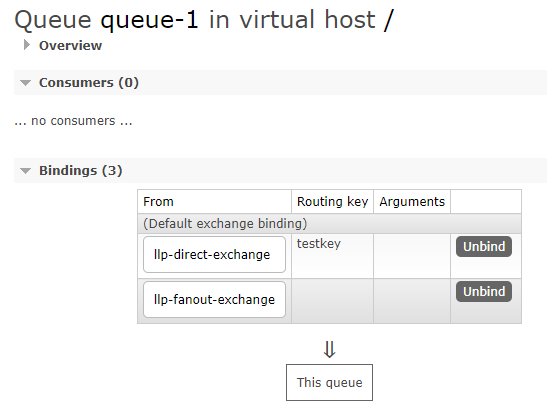
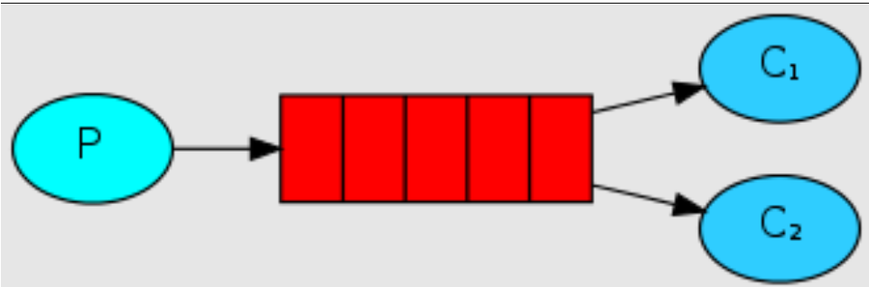

# 第5章_RabbitMQ各种模式案例

## 1.Fanout模式(发布订阅模式)

**RabbitMQ 支持消息的模式**

参考官网：https://www.rabbitmq.com/getstarted.html

**RabbitMQ的模式之发布订阅模式**


**发布订阅模式具体实现**

> 发布订阅模式，生产者推送消息，消费者端只要是和交换机进行绑定（Bindings）的 queue（队列）都会收到消息


- 类型：fanout
- 特点：发布与订阅模式，是一种广播机制，它是没有路由 key 的模式

生产者

```java
public class Producer {
    public static void main(String[] args) {
        // 1: 创建连接工厂
        ConnectionFactory connectionFactory = new ConnectionFactory();
        // 2: 设置连接属性
        connectionFactory.setHost("192.168.11.101");
        connectionFactory.setPort(5672);
        connectionFactory.setVirtualHost("/");
        connectionFactory.setUsername("admin");
        connectionFactory.setPassword("admin");
        Connection connection = null;
        Channel channel = null;
        try {
            // 3: 从连接工厂中获取连接
            connection = connectionFactory.newConnection("生产者");
            // 4: 从连接中获取通道channel
            channel = connection.createChannel();
            // 6： 准备发送消息的内容
            String message = "你好，llp！！！";
            String  exchangeName = "fanout-exchange";
            String routingKey = "";
            // 7: 发送消息给中间件rabbitmq-server
            // @params1: 交换机exchange
            // @params2: 队列名称/routingkey
            // @params3: 属性配置
            // @params4: 发送消息的内容
            channel.basicPublish(exchangeName, routingKey, null, message.getBytes());
            System.out.println("消息发送成功!");
        } catch (Exception ex) {
            ex.printStackTrace();
            System.out.println("发送消息出现异常...");
        } finally {
            // 7: 释放连接关闭通道
            if (channel != null && channel.isOpen()) {
                try {
                    channel.close();
                } catch (Exception ex) {
                    ex.printStackTrace();
                }
            }
            if (connection != null) {
                try {
                    connection.close();
                } catch (Exception ex) {
                    ex.printStackTrace();
                }
            }
        }
    }
}
```

消费者

```java
package com.llp.rabbitmq.routing;
import com.rabbitmq.client.*

    ;
import java.io.IOException;
/**

 * @author: llp
 * @description: Consumer
 * @Date : 2021/3/2
   */
public class Consumer {
    private static Runnable runnable = () -> {
        // 1: 创建连接工厂
        ConnectionFactory connectionFactory = new ConnectionFactory();
        // 2: 设置连接属性
        connectionFactory.setHost("192.168.11.101");
        connectionFactory.setPort(5672);
        connectionFactory.setVirtualHost("/");
        connectionFactory.setUsername("admin");
        connectionFactory.setPassword("admin");
        //获取队列的名称
        final String queueName = Thread.currentThread().getName();
        Connection connection = null;
        Channel channel = null;
        try {
            // 3: 从连接工厂中获取连接
            connection = connectionFactory.newConnection("生产者");
            // 4: 从连接中获取通道channel
            channel = connection.createChannel();
            // 5: 申明队列queue存储消息
            /*
            *  如果队列不存在，则会创建
            *  Rabbitmq不允许创建两个相同的队列名称，否则会报错。
            *
            *  @params1： queue 队列的名称
            *  @params2： durable 队列是否持久化
            *  @params3： exclusive 是否排他，即是否私有的，如果为true,会对当前队列加锁，其他的通道不能访问，并且连接自动关闭
            *  @params4： autoDelete 是否自动删除，当最后一个消费者断开连接之后是否自动删除消息。
            *  @params5： arguments 可以设置队列附加参数，设置队列的有效期，消息的最大长度，队列的消息生命周期等等。
            * */
            // 这里如果queue已经被创建过一次了，可以不需要定义
            //channel.queueDeclare("queue1", false, false, false, null);
            // 6： 定义接受消息的回调
            Channel finalChannel = channel;
            finalChannel.basicConsume(queueName, true, new DeliverCallback() {
                @Override
                public void handle(String s, Delivery delivery) throws IOException {
                    System.out.println(queueName + "：收到消息是：" + new String(delivery.getBody(), "UTF-8"));
                }
            }, new CancelCallback() {
                @Override
                public void handle(String s) throws IOException {
                }
            });
            System.out.println(queueName + "：开始接受消息");
            System.in.read();
        } catch (Exception ex) {
            ex.printStackTrace();
            System.out.println("发送消息出现异常...");
        } finally {
            // 7: 释放连接关闭通道
            if (channel != null && channel.isOpen()) {
                try {
                    channel.close();
                } catch (Exception ex) {
                    ex.printStackTrace();
                }
            }
            if (connection != null && connection.isOpen()) {
                try {
                    connection.close();
                } catch (Exception ex) {
                    ex.printStackTrace();
                }
            }
        }
    };
    public static void main(String[] args) {
        // 启动三个线程去执行
        new Thread(runnable, "queue-1").start();
        new Thread(runnable, "queue-2").start();
        new Thread(runnable, "queue-3").start();
    }
}
```

## 2.Direct模式（路由模式）

**RabbitMQ支持消息的模式**

参考官网：https://www.rabbitmq.com/getstarted.html

**RabbitMQ的模式之Direct模式**


**路由模式具体实现**

> 路由模式相较发布订阅模式新增了路由 RoutingKey，生产者将消息推送到消费者端，绑定（bingdings）了对应交换机（Exchange）和路由的队列（queue）

- 类型：direct
- 特点：Direct（路由）模式是 fanout（发布订阅）模式上的一种叠加，增加了路由 RoutingKey 的模式

> 一个队列（queue）可以绑定多个交换机，如果没有设置排他，则根据不同模式的规则匹配进行消费。
>
> exclusive 是否排他，即是否私有的，如果为true，会对当前队列加锁，其他的通道不能访问，并且连接自动关闭。



生产者

```java
package com.llp.rabbitmq.routing;
import com.rabbitmq.client.Channel;
import com.rabbitmq.client.Connection;
import com.rabbitmq.client.ConnectionFactory;

public class Producer {
    public static void main(String[] args) {
        // 1: 创建连接工厂
        ConnectionFactory connectionFactory = new ConnectionFactory();
        // 2: 设置连接属性
        connectionFactory.setHost("192.168.11.101");
        connectionFactory.setPort(5672);
        connectionFactory.setVirtualHost("/");
        connectionFactory.setUsername("admin");
        connectionFactory.setPassword("admin");
        Connection connection = null;
        Channel channel = null;
        try {
            // 3: 从连接工厂中获取连接
            connection = connectionFactory.newConnection("生产者");
            // 4: 从连接中获取通道channel
            channel = connection.createChannel();
            // 6： 准备发送消息的内容
            String message = "你好，llp！！！";
            String  exchangeName = "direct-exchange";
            String routingKey1 = "testkey";
            String routingKey2 = "testkey2";
            // 7: 发送消息给中间件rabbitmq-server
            // @params1: 交换机exchange
            // @params2: 队列名称/routingkey
            // @params3: 属性配置
            // @params4: 发送消息的内容
            channel.basicPublish(exchangeName, routingKey1, null, message.getBytes());
            channel.basicPublish(exchangeName, routingKey2, null, message.getBytes());
            System.out.println("消息发送成功!");
        } catch (Exception ex) {
            ex.printStackTrace();
            System.out.println("发送消息出现异常...");
        } finally {
            // 7: 释放连接关闭通道
            if (channel != null && channel.isOpen()) {
                try {
                    channel.close();
                } catch (Exception ex) {
                    ex.printStackTrace();
                }
            }
            if (connection != null) {
                try {
                    connection.close();
                } catch (Exception ex) {
                    ex.printStackTrace();
                }
            }
        }
    }
}
```

消费者

```java
public class Consumer {
    private static Runnable runnable = () -> {
        // 1: 创建连接工厂
        ConnectionFactory connectionFactory = new ConnectionFactory();
        // 2: 设置连接属性
        connectionFactory.setHost("192.168.11.101");
        connectionFactory.setPort(5672);
        connectionFactory.setVirtualHost("/");
        connectionFactory.setUsername("admin");
        connectionFactory.setPassword("admin");
        //获取队列的名称
        final String queueName = Thread.currentThread().getName();
        Connection connection = null;
        Channel channel = null;
        try {
            // 3: 从连接工厂中获取连接
            connection = connectionFactory.newConnection("消费者");
            // 4: 从连接中获取通道channel
            channel = connection.createChannel();
            // 5: 申明队列queue存储消息
            // 这里如果queue已经被创建过一次了，可以不需要定义
            //channel.queueDeclare("queue1", false, false, false, null);
            // 6： 定义接受消息的回调
            Channel finalChannel = channel;
            finalChannel.basicConsume(queueName, true, new DeliverCallback() {
                @Override
                public void handle(String s, Delivery delivery) throws IOException {
                    System.out.println(queueName + "：收到消息是：" + new String(delivery.getBody(), "UTF-8"));
                }
            }, new CancelCallback() {
                @Override
                public void handle(String s) throws IOException {
                }
            });
            System.out.println(queueName + "：开始接受消息");
            System.in.read();
        } catch (Exception ex) {
            ex.printStackTrace();
            System.out.println("发送消息出现异常...");
        } finally {
            // 7: 释放连接关闭通道
            if (channel != null && channel.isOpen()) {
                try {
                    channel.close();
                } catch (Exception ex) {
                    ex.printStackTrace();
                }
            }
            if (connection != null && connection.isOpen()) {
                try {
                    connection.close();
                } catch (Exception ex) {
                    ex.printStackTrace();
                }
            }
        }
    };
    public static void main(String[] args) {
        // 启动三个线程去执行
        new Thread(runnable, "queue-1").start();
        new Thread(runnable, "queue-2").start();
        new Thread(runnable, "queue-3").start();
    }
}
```

## 3.Topic模式

**RabbitMQ支持消息的模式**

参考官网：https://www.rabbitmq.com/getstarted.html

**RabbitMQ的模式之Topic模式（主题模式）**


**主题模式具体实现**

- 类型：topic
- 特点：Topic 模式是 direct 模式上的一种叠加，增加了模糊路由 RoutingKey 的模式

**主题模式路由匹配规则**

说明：

- 每条消息会被发送到所有符合路由规则的 key 对应的队列
- 可以使用`*`和`#`两种通配符
- `*`代表匹配一级，`#`代表匹配零级或多级
- 通配符和普通字符之间需要使用`.`隔开

示例：

| 路由key | 实际key | 匹配结果 |
| ------- | ------- | -------- |
|demoTopicKey|	demoTopicKey|	成功|
|demoTopicKey*|	demoTopicKey1|	失败|
|demoTopicKey.*	|demoTopicKey.1	|成功|
|demoTopicKey.*|	demoTopicKey.1.1	|失败|
|demoTopicKey.*.1|	demoTopicKey.1.1|	成功|
|demoTopicKey.#|	demoTopicKey.1.1|	成功|
|*.1|	demoTopicKey.1|	成功|
|*.1	|demoTopicKey.1.1|	失败|
|#.1	|demoTopicKey.1.1|	成功|
|demoTopicKey.#.1|	demoTopicKey.1.1|	成功|
|demoTopicKey.#.1	|demoTopicKey.1|	成功|
|demoTopicKey.#.1	|demoTopicKey…1|	成功|
|demoTopicKey.#|	demoTopicKey|	成功|
|demoTopicKey.*.1	|demoTopicKey.1|失败|
|demoTopicKey.*.1	|demoTopicKey…1|成功|

生产者

```java
package com.llp.rabbitmq.routing;
import com.rabbitmq.client.Channel;
import com.rabbitmq.client.Connection;
import com.rabbitmq.client.ConnectionFactory;

public class Producer {
    public static void main(String[] args) {
        // 1: 创建连接工厂
        ConnectionFactory connectionFactory = new ConnectionFactory();
        // 2: 设置连接属性
        connectionFactory.setHost("192.168.11.101");
        connectionFactory.setPort(5672);
        connectionFactory.setVirtualHost("/");
        connectionFactory.setUsername("admin");
        connectionFactory.setPassword("admin");
        Connection connection = null;
        Channel channel = null;
        try {
            // 3: 从连接工厂中获取连接
            connection = connectionFactory.newConnection("生产者");
            // 4: 从连接中获取通道channel
            channel = connection.createChannel();
            // 6： 准备发送消息的内容
            String message = "你好，llp！！！";
            String  exchangeName = "topic-exchange";
            String routingKey1 = "com.course.order";
            String routingKey2 = "com.order.user";
            // 7: 发送消息给中间件rabbitmq-server
            // @params1: 交换机exchange
            // @params2: 队列名称/routingkey
            // @params3: 属性配置
            // @params4: 发送消息的内容
            channel.basicPublish(exchangeName, routingKey1, null, message.getBytes());
            System.out.println("消息发送成功!");
        } catch (Exception ex) {
            ex.printStackTrace();
            System.out.println("发送消息出现异常...");
        } finally {
            // 7: 释放连接关闭通道
            if (channel != null && channel.isOpen()) {
                try {
                    channel.close();
                } catch (Exception ex) {
                    ex.printStackTrace();
                }
            }
            if (connection != null) {
                try {
                    connection.close();
                } catch (Exception ex) {
                    ex.printStackTrace();
                }
            }
        }
    }
}
```

消费者

 ```java
 package com.llp.rabbitmq.routing;
 import com.rabbitmq.client.*;
 import java.io.IOException;
 /**
 
  * @author: llp
  * @description: Consumer
  * @Date : 2021/3/2
    */
 public class Consumer {
     private static Runnable runnable = () -> {
         // 1: 创建连接工厂
         ConnectionFactory connectionFactory = new ConnectionFactory();
         // 2: 设置连接属性
         connectionFactory.setHost("192.168.11.101");
         connectionFactory.setPort(5672);
         connectionFactory.setVirtualHost("/");
         connectionFactory.setUsername("admin");
         connectionFactory.setPassword("admin");
         //获取队列的名称
         final String queueName = Thread.currentThread().getName();
         Connection connection = null;
         Channel channel = null;
         try {
             // 3: 从连接工厂中获取连接
             connection = connectionFactory.newConnection("生产者");
             // 4: 从连接中获取通道channel
             channel = connection.createChannel();
             // 5: 申明队列queue存储消息
             // 这里如果queue已经被创建过一次了，可以不需要定义
             //channel.queueDeclare("queue1", false, false, false, null);
             // 6： 定义接受消息的回调
             Channel finalChannel = channel;
             finalChannel.basicConsume(queueName, true, new DeliverCallback() {
                 @Override
                 public void handle(String s, Delivery delivery) throws IOException {
                     System.out.println(queueName + "：收到消息是：" + new String(delivery.getBody(), "UTF-8"));
                 }
             }, new CancelCallback() {
                 @Override
                 public void handle(String s) throws IOException {
                 }
             });
             System.out.println(queueName + "：开始接受消息");
             System.in.read();
         } catch (Exception ex) {
             ex.printStackTrace();
             System.out.println("发送消息出现异常...");
         } finally {
             // 7: 释放连接关闭通道
             if (channel != null && channel.isOpen()) {
                 try {
                     channel.close();
                 } catch (Exception ex) {
                     ex.printStackTrace();
                 }
             }
             if (connection != null && connection.isOpen()) {
                 try {
                     connection.close();
                 } catch (Exception ex) {
                     ex.printStackTrace();
                 }
             }
         }
     };
     public static void main(String[] args) {
         // 启动三个线程去执行
         new Thread(runnable, "queue-1").start();
         new Thread(runnable, "queue-2").start();
         new Thread(runnable, "queue-3").start();
     }
 }
 ```

## 4.Work模式

 **RabbitMQ支持消息的模式**

参考官网：https://www.rabbitmq.com/getstarted.html



当有多个消费者时，我们的消息会被哪个消费者消费呢，我们又该如何均衡消费者消费信息的多少呢?

主要有两种模式：

- 轮询模式的分发：一个消费者一条，按均分配
- 公平分发：根据消费者的消费能力进行公平分发，处理快的处理的多，处理慢的处理的少；按劳分配

### 4.1 轮询模式（Round-Robin）

- 类型：无
- 特点：该模式接收消息是当有多个消费者接入时，消息的分配模式是一个消费者分配一条，直至消息消费完成

**生产者**

```java
public class Producer {
    public static void main(String[] args) {
        // 1: 创建连接工厂
        ConnectionFactory connectionFactory = new ConnectionFactory();
        // 2: 设置连接属性
        connectionFactory.setHost("192.168.11.101");
        connectionFactory.setPort(5672);
        connectionFactory.setVirtualHost("/");
        connectionFactory.setUsername("admin");
        connectionFactory.setPassword("admin");
        Connection connection = null;
        Channel channel = null;
        try {
            // 3: 从连接工厂中获取连接
            connection = connectionFactory.newConnection("生产者");
            // 4: 从连接中获取通道channel
            channel = connection.createChannel();
            // 6： 准备发送消息的内容
            //===============================end topic模式==================================
            for (int i = 1; i <= 20; i++) {
                //消息的内容
                String msg = "llp:" + i;
                // 7: 发送消息给中间件rabbitmq-server
                // @params1: 交换机exchange
                // @params2: 队列名称/routingkey
                // @params3: 属性配置
                // @params4: 发送消息的内容
                channel.basicPublish("", "queue1", null, msg.getBytes());
            }
            System.out.println("消息发送成功!");
        } catch (Exception ex) {
            ex.printStackTrace();
            System.out.println("发送消息出现异常...");
        } finally {
            // 7: 释放连接关闭通道
            if (channel != null && channel.isOpen()) {
                try {
                    channel.close();
                } catch (Exception ex) {
                    ex.printStackTrace();
                }
            }
            if (connection != null) {
                try {
                    connection.close();
                } catch (Exception ex) {
                    ex.printStackTrace();
                }
            }
        }
    }
}
```

**消费者-Work1**

```java
public class Work1 {
    public static void main(String[] args) {
        // 1: 创建连接工厂
        ConnectionFactory connectionFactory = new ConnectionFactory();
        // 2: 设置连接属性
        connectionFactory.setHost("192.168.11.101");
        connectionFactory.setPort(5672);
        connectionFactory.setVirtualHost("/");
        connectionFactory.setUsername("admin");
        connectionFactory.setPassword("admin");
        Connection connection = null;
        Channel channel = null;
        try {
            // 3: 从连接工厂中获取连接
            connection = connectionFactory.newConnection("消费者-Work1");
            // 4: 从连接中获取通道channel
            channel = connection.createChannel();
            // 5: 申明队列queue存储消息
            /*
         	 *  如果队列不存在，则会创建
       	     *  Rabbitmq不允许创建两个相同的队列名称，否则会报错。
             *
             *  @params1： queue 队列的名称
             *  @params2： durable 队列是否持久化
             *  @params3： exclusive 是否排他，即是否私有的，如果为true,会对当前队列加锁，其他的通道不能访问，并且连接自动关闭
             *  @params4： autoDelete 是否自动删除，当最后一个消费者断开连接之后是否自动删除消息。
             *  @params5： arguments 可以设置队列附加参数，设置队列的有效期，消息的最大长度，队列的消息生命周期等等。
             */
            // 这里如果queue已经被创建过一次了，可以不需要定义
            //channel.queueDeclare("queue1", false, true, false, null);
            // 6： 定义接受消息的回调
            Channel finalChannel = channel;
            // 同一时刻，服务器只会推送一条消息给此消费者
            finalChannel.basicQos(1);
            finalChannel.basicConsume("queue1", true, new DeliverCallback() {
                @Override
                public void handle(String s, Delivery delivery) throws IOException {
                    try{
                        System.out.println("Work1-收到消息是：" + new String(delivery.getBody(), "UTF-8"));
                        // 处理速度慢
                        Thread.sleep(2000);
                    }catch(Exception ex){
                        ex.printStackTrace();
                    }
                }
            }, new CancelCallback() {
                @Override
                public void handle(String s) throws IOException {
                }
            });
            System.out.println("Work1-开始接受消息");
            System.in.read();
        } catch (Exception ex) {
            ex.printStackTrace();
            System.out.println("发送消息出现异常...");
        } finally {
            // 7: 释放连接关闭通道
            if (channel != null && channel.isOpen()) {
                try {
                    channel.close();
                } catch (Exception ex) {
                    ex.printStackTrace();
                }
            }
            if (connection != null && connection.isOpen()) {
                try {
                    connection.close();
                } catch (Exception ex) {
                    ex.printStackTrace();
                }
            }
        }
    }
}
```

**消费者-Work2**

```java
public class Work2 {
    public static void main(String[] args) {
        // 1: 创建连接工厂
        ConnectionFactory connectionFactory = new ConnectionFactory();
        // 2: 设置连接属性
        connectionFactory.setHost("192.168.11.101");
        connectionFactory.setPort(5672);
        connectionFactory.setVirtualHost("/");
        connectionFactory.setUsername("admin");
        connectionFactory.setPassword("admin");
        Connection connection = null;
        Channel channel = null;
        try {
            // 3: 从连接工厂中获取连接
            connection = connectionFactory.newConnection("消费者-Work2");
            // 4: 从连接中获取通道channel
            channel = connection.createChannel();
            Channel finalChannel = channel;
            finalChannel.basicQos(1);
            finalChannel.basicConsume("queue1", true, new DeliverCallback() {
                @Override
                public void handle(String s, Delivery delivery) throws IOException {
                    try{
                        System.out.println("Work2-收到消息是：" + new String(delivery.getBody(), "UTF-8"));
                        // 处理速度快
                        Thread.sleep(200);
                    }catch(Exception ex){
                        ex.printStackTrace();
                    }
                }
            }, new CancelCallback() {
                @Override
                public void handle(String s) throws IOException {
                }
            });
            System.out.println("Work2-开始接受消息");
            System.in.read();
        } catch (Exception ex) {
            ex.printStackTrace();
            System.out.println("发送消息出现异常...");
        } finally {
            // 7: 释放连接关闭通道
            if (channel != null && channel.isOpen()) {
                try {
                    channel.close();
                } catch (Exception ex) {
                    ex.printStackTrace();
                }
            }
            if (connection != null && connection.isOpen()) {
                try {
                    connection.close();
                } catch (Exception ex) {
                    ex.printStackTrace();
                }
            }
        }
    }
}
```

**小结**

从结果可以看到，消费者 work1 和 work2 的消息处理能力不同，但是最后处理的消息条数相同，是`按均分配`。

### 4.2 公平分发（Fair Dispatch）

- 类型：无
- 特点：由于消息接收者处理消息的能力不同，存在处理快慢的问题，我们就需要能者多劳，处理快的多处理，处理慢的少处理

生产者
```java
package com.llp.rabbitmq.work.fairr;
import com.rabbitmq.client.Channel;
import com.rabbitmq.client.Connection;
import com.rabbitmq.client.ConnectionFactory;
/**

 * @author: llp
 * @description: Producer 简单队列生产者
 * @Date : 2021/3/2
   */
public class Producer {
    public static void main(String[] args) {
        // 1: 创建连接工厂
        ConnectionFactory connectionFactory = new ConnectionFactory();
        // 2: 设置连接属性
        connectionFactory.setHost("192.168.11.101");
        connectionFactory.setPort(5672);
        connectionFactory.setVirtualHost("/");
        connectionFactory.setUsername("admin");
        connectionFactory.setPassword("admin");
        Connection connection = null;
        Channel channel = null;
        try {
            // 3: 从连接工厂中获取连接
            connection = connectionFactory.newConnection("生产者");
            // 4: 从连接中获取通道channel
            channel = connection.createChannel();
            // 6： 准备发送消息的内容
            //===============================end topic模式==================================
            for (int i = 1; i <= 20; i++) {
                //消息的内容
                String msg = "llp:" + i;
                // 7: 发送消息给中间件rabbitmq-server
                // @params1: 交换机exchange
                // @params2: 队列名称/routingkey
                // @params3: 属性配置
                // @params4: 发送消息的内容
                channel.basicPublish("", "queue1", null, msg.getBytes());
            }
            System.out.println("消息发送成功!");
        } catch (Exception ex) {
            ex.printStackTrace();
            System.out.println("发送消息出现异常...");
        } finally {
            // 7: 释放连接关闭通道
            if (channel != null && channel.isOpen()) {
                try {
                    channel.close();
                } catch (Exception ex) {
                    ex.printStackTrace();
                }
            }
            if (connection != null) {
                try {
                    connection.close();
                } catch (Exception ex) {
                    ex.printStackTrace();
                }
            }
        }
    }
}
```

消费者-Work1

```java
package com.llp.rabbitmq.work.fairr;
import com.rabbitmq.client.*;
import java.io.IOException;
/**

 * @author: llp
 * @description: Consumer
 * @Date : 2021/3/2
   */
public class Work1 {
    public static void main(String[] args) {
        // 1: 创建连接工厂
        ConnectionFactory connectionFactory = new ConnectionFactory();
        // 2: 设置连接属性
        connectionFactory.setHost("192.168.11.101");
        connectionFactory.setPort(5672);
        connectionFactory.setVirtualHost("/");
        connectionFactory.setUsername("admin");
        connectionFactory.setPassword("admin");
        Connection connection = null;
        Channel channel = null;
        try {
            // 3: 从连接工厂中获取连接
            connection = connectionFactory.newConnection("消费者-Work1");
            // 4: 从连接中获取通道channel
            channel = connection.createChannel();
            // 5: 申明队列queue存储消息
            /*
            *  如果队列不存在，则会创建
            *  Rabbitmq不允许创建两个相同的队列名称，否则会报错。
            *
            *  @params1： queue 队列的名称
            *  @params2： durable 队列是否持久化
            *  @params3： exclusive 是否排他，即是否私有的，如果为true,会对当前队列加锁，其他的通道不能访问，并且连接自动关闭
            *  @params4： autoDelete 是否自动删除，当最后一个消费者断开连接之后是否自动删除消息。
            *  @params5： arguments 可以设置队列附加参数，设置队列的有效期，消息的最大长度，队列的消息生命周期等等。
            */
            // 这里如果queue已经被创建过一次了，可以不需要定义
            // channel.queueDeclare("queue1", false, false, false, null);
            // 6： 定义接受消息的回调
            Channel finalChannel = channel;
            // 同一时刻，服务器只会推送一条消息给此消费者
            finalChannel.basicQos(1);
            // 关闭自动应答
            finalChannel.basicConsume("queue1", false, new DeliverCallback() {
                @Override
                public void handle(String s, Delivery delivery) throws IOException {
                    try{
                        System.out.println("Work1-收到消息是：" + new String(delivery.getBody(), "UTF-8"));					
                        //模拟work1和work2两个消费者的消费能力
                        Thread.sleep(2000);
                        finalChannel.basicAck(delivery.getEnvelope().getDeliveryTag(),false);
                    }catch(Exception ex){
                        ex.printStackTrace();
                    }
                }
            }, new CancelCallback() {
                @Override
                public void handle(String s) throws IOException {
                }
            });
            System.out.println("Work1-开始接受消息");
            System.in.read();
        } catch (Exception ex) {
            ex.printStackTrace();
            System.out.println("发送消息出现异常...");
        } finally {
            // 7: 释放连接关闭通道
            if (channel != null && channel.isOpen()) {
                try {
                    channel.close();
                } catch (Exception ex) {
                    ex.printStackTrace();
                }
            }
            if (connection != null && connection.isOpen()) {
                try {
                    connection.close();
                } catch (Exception ex) {
                    ex.printStackTrace();
                }
            }
        }
    }
}
```

消费者-Work2

```java
public class Work2 {
    public static void main(String[] args) {
        // 1: 创建连接工厂
        ConnectionFactory connectionFactory = new ConnectionFactory();
        // 2: 设置连接属性
        connectionFactory.setHost("192.168.11.101");
        connectionFactory.setPort(5672);
        connectionFactory.setVirtualHost("/");
        connectionFactory.setUsername("admin");
        connectionFactory.setPassword("admin");
        Connection connection = null;
        Channel channel = null;
        try {
            // 3: 从连接工厂中获取连接
            connection = connectionFactory.newConnection("消费者-Work2");
            // 4: 从连接中获取通道channel
            channel = connection.createChannel();
            Channel finalChannel = channel;
            finalChannel.basicQos(1);
            finalChannel.basicConsume("queue1", false, new DeliverCallback() {
                @Override
                public void handle(String s, Delivery delivery) throws IOException {
                    try{
                        System.out.println("Work2-收到消息是：" + new String(delivery.getBody(), "UTF-8"));					
                        //模拟work1和work2两个消费者的消费能力
                        Thread.sleep(200);
                        finalChannel.basicAck(delivery.getEnvelope().getDeliveryTag(),false);
                    }catch(Exception ex){
                        ex.printStackTrace();
                    }
                }
            }, new CancelCallback() {
                @Override
                public void handle(String s) throws IOException {
                }
            });
            System.out.println("Work2-开始接受消息");
            System.in.read();
        } catch (Exception ex) {
            ex.printStackTrace();
            System.out.println("发送消息出现异常...");
        } finally {
            // 7: 释放连接关闭通道
            if (channel != null && channel.isOpen()) {
                try {
                    channel.close();
                } catch (Exception ex) {
                    ex.printStackTrace();
                }
            }
            if (connection != null && connection.isOpen()) {
                try {
                    connection.close();
                } catch (Exception ex) {
                    ex.printStackTrace();
                }
            }
        }
    }
}
```

**小结**

从结果可以看到，消费者 1 在相同时间内，处理了更多的消息。

公平分发需要满足一下几点：

- 消费者一次接收一条消息`channel.BasicQos(0, 1, false)`

  > - 若消费者的 qos 设置的都是 1，则会按处理速度快慢分配
  > - 若消费者的 qos 设置的一样但不是 1，则各个消费者还是会轮询处理消息

- 公平分发需要消费者关闭自动应答`autoack = false`，`channel.BasicConsume(“queue_test”, false, consumer);`

- 消费者开启手动应答：`channel.BasicAck(ea.DeliveryTag, false);`

### 4.3 总结

- 当队列里消息较多时，我们通常会开启多个消费者处理消息；公平分发和轮询分发都是我们经常使用的模式
- 轮询分发的主要思想是`按均分配`，不考虑消费者的处理能力，所有消费者均分；这种情况下，处理能力弱的服务器，一直都在处理消息，而处理能力强的服务器，在处理完消息后，处于空闲状态
- 公平分发的主要思想是`能者多劳`，按需分配，能力强的干的多

## 5.代码中创建交换机及绑定

这里以 direct 交换机为例：

**生产者**

```java
public class Producer {
    public static void main(String[] args) throws IOException, TimeoutException {
        ConnectionFactory connectionFactory = new ConnectionFactory();
        connectionFactory.setVirtualHost("/");
        connectionFactory.setHost("192.168.11.101");
        connectionFactory.setPort(5672);
        connectionFactory.setUsername("admin");
        connectionFactory.setPassword("admin");

        Connection connection = null;
        Channel channel = null;

        try {
            connection = connectionFactory.newConnection("生产者");
            channel = connection.createChannel();
            String message = "hello rabbitmq";
            // 创建交换机
            String exchangeName = "direct_message_exchange";
            String exchangeType = "direct";
            // 第三个参数是是否持久化交换机，即服务器重启后是否保留
            channel.exchangeDeclare(exchangeName, exchangeType, true);

            // 创建队列
            channel.queueDeclare("queue1", true, false, false, null);
            channel.queueDeclare("queue2", true, false, false, null);
            channel.queueDeclare("queue3", true, false, false, null);

            // 绑定队列与交换机
            channel.queueBind("queue1", exchangeName, "order");
            channel.queueBind("queue2", exchangeName, "order");
            channel.queueBind("queue3", exchangeName, "user");

            channel.basicPublish(exchangeName, "order", null, message.getBytes(StandardCharsets.UTF_8));
            System.out.println("sent successfully");

        } catch (IOException | TimeoutException e) {
            e.printStackTrace();
        } finally {
            if (channel != null && channel.isOpen()) {
                channel.close();
            }
            if (connection != null && connection.isOpen()) {
                connection.close();
            }
        }
    }
}
```

执行后可以发现只有 queue1 和 queue2 收到了消息。

**消费者**

```java
public class Consumer {
    private static Runnable runnable = () -> {
        ConnectionFactory connectionFactory = new ConnectionFactory();
        connectionFactory.setVirtualHost("/");
        connectionFactory.setUsername("admin");
        connectionFactory.setPassword("admin");
        connectionFactory.setHost("192.168.11.101");
        connectionFactory.setPort(5672);

        final String queueName = Thread.currentThread().getName();
        Connection connection = null;
        Channel channel = null;

        try {
            connection = connectionFactory.newConnection("消费者");
            channel = connection.createChannel();
            channel.basicConsume(queueName, true, new DeliverCallback() {
                @Override
                public void handle(String consumerTag, Delivery message) throws IOException {
                    System.out.println(queueName + "收到的消息是：" + new String(message.getBody(), StandardCharsets.UTF_8));
                }
            }, new CancelCallback() {
                @Override
                public void handle(String consumerTag) throws IOException {
                    System.out.println("failed");
                }
            });
        } catch (IOException | TimeoutException e) {
            e.printStackTrace();
        } finally {
            if (channel != null && channel.isOpen()) {
                try {
                    channel.close();
                } catch (Exception ex) {
                    ex.printStackTrace();
                }
            }
            if (connection != null && connection.isOpen()) {
                try {
                    connection.close();
                } catch (Exception ex) {
                    ex.printStackTrace();
                }
            }
        }
    };

    public static void main(String[] args) {
        // 启动三个线程去执行
        new Thread(runnable, "queue1").start();
        new Thread(runnable, "queue2").start();
        new Thread(runnable, "queue3").start();
    }
}
```

