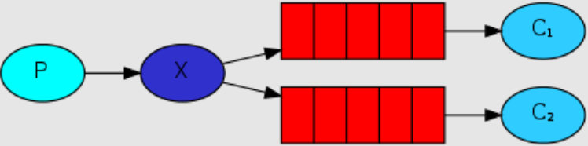
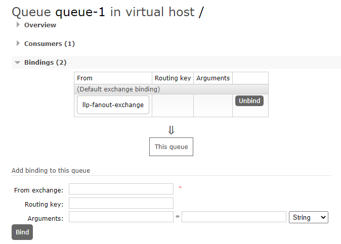
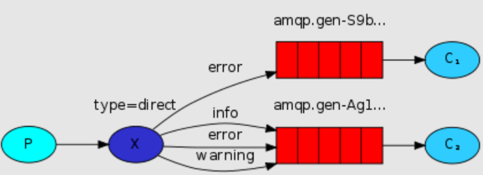
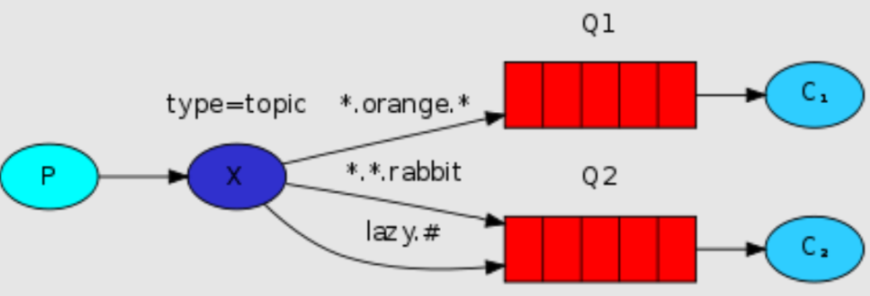

# RabbitMQ

## 1.中间件简介

### 1.1 什么是中间件

我国企业从 20 世纪 80 年代开始就逐渐进行信息化建设，由于方法和体系的不成熟，以及企业业务和市场需求的不断变化，一个企业可能同时运行着多个不同的业务系统，这些系统可能基于不同的操作系统、不同的数据库、异构的网络环境。现在的问题是，如何把这些信息系统结合成一个有机地协同工作的整体，真正实现企业跨平台、分布式应用。中间件便是解决之道，它用自己的复杂换取了企业应用的简单。

> 中间件（Middleware）是处于操作系统和应用程序之间的软件，也有人认为它应该属于操作系统中的一部分。人们在使用中间件时，往往是一组中间件集成在一起，构成一个平台（包括开发平台和运行平台），但在这组中间件中必须要有一个通信中间件，即中间件=平台+通信，这个定义也限定了只有用于分布式系统中才能称为中间件，同时还可以把它与支撑软件和实用软件区分开来。

**举例**
1，RMI（Remote Method Invocations, 远程调用）
2，Load Balancing（负载均衡，将访问负荷分散到各个服务器中）
3，Transparent Fail-over（透明的故障切换）
4，Clustering（集群,用多个小的服务器代替大型机）
5，Back-end-Integration（后端集成，用现有的、新开发的系统如何去集成遗留的系统）
6，Transaction事务（全局/局部）全局事务（分布式事务）局部事务（在同一数据库联接内的事务）
7，Dynamic Redeployment（动态重新部署,在不停止原系统的情况下，部署新的系统）
8，System Management（系统管理）
9，Threading（多线程处理）
10，Message-oriented Middleware面向消息的中间件（异步的调用编程）
11，Component Life Cycle（组件的生命周期管理）
12，Resource pooling（资源池）
13，Security（安全）
14，Caching（缓存）

### 1.2 为什么需要使用消息中间件

具体地说，中间件屏蔽了底层操作系统的复杂性，使程序开发人员面对一个简单而统一的开发环境，减少程序设计的复杂性，将注意力集中在自己的业务上，不必再为程序在不同系统软件上的移植而重复工作，从而大大减少了技术上的负担。中间件带给应用系统的，不只是开发的简便、开发周期的缩短，也减少了系统的维护、运行和管理的工作量，还减少了计算机总体费用的投入。

### 1.3 中间件特点

为解决分布异构问题，人们提出了中间件（middleware）的概念。中间件是位于平台（硬件和操作系统）和应用之间的通用服务，如下图所示，这些服务具有标准的程序接口和协议。针对不同的操作系统和硬件平台，它们可以有符合接口和协议规范的多种实现。


也许很难给中间件一个严格的定义，但中间件应具有如下的一些特点：

- 满足大量应用的需要
- 运行于多种硬件和 OS 平台
- 支持分布计算，提供跨网络、硬件和 OS 平台的透明性的应用或服务的交互
- 支持标准的协议
- 支持标准的接口

由于标准接口对于可移植性和标准协议对于互操作性的重要性，中间件已成为许多标准化工作的主要部分。对于应用软件开发，中间件远比操作系统和网络服务更为重要，中间件提供的程序接口定义了一个相对稳定的高层应用环境，不管底层的计算机硬件和系统软件怎样更新换代，只要将中间件升级更新，并保持中间件对外的接口定义不变，应用软件几乎不需任何修改，从而保护了企业在应用软件开发和维护中的重大投资。

> 简单说：中间件有个很大的特点，是脱离于具体设计目标，而具备提供普遍独立功能需求的模块。这使得中间件一定是可替换的。如果一个系统设计中，中间件是不可替换的，不是架构、框架设计有问题，那么就是这个中间件，在 别处可能是个中间件，在这个系统内是引擎。

### 1.4 在项目中什么时候使用中间件技术

在项目的架构和重构中，使用任何技术和架构的改变我们都需要谨慎斟酌和思考，因为任何技术的融入和变化都可能人员，技术，和成本的增加，中间件的技术一般现在一些互联网公司或者项目中使用比较多，如果你仅仅还只是一个初创公司建议还是使用单体架构，最多加个缓存中间件即可，不要盲目追求新或者所谓的高性能，而追求的背后一定是业务的驱动和项目的驱动，因为一旦追求就意味着你的学习成本，公司的人员结构以及服务器成本，维护和运维的成本都会增加，所以需要谨慎选择和考虑。

但是作为一个开放人员，一定要有学习中间件技术的能力和思维，否则很容易当项目发展到一个阶段在去掌握估计或者在面试中提及，就会给自己带来不小的困扰，在当今这个时代这些技术也并不是什么新鲜的东西，如果去掌握和挖掘最关键的还是自己花时间和花精力去探讨和研究。

## 2.中间件技术及架构的概述

### 2.1 学习中间件的方式和技巧

- 理解中间件在项目架构中的作用，以及各中间件的底层实现
- 可以使用一些类比的生活概念去理解中间件
- 使用一些流程图或者脑图的方式去梳理各个中间件在架构中的作用
- 尝试用 java 技术去实现中间件的远离
- 静下来去思考中间件在项目中设计的和使用的原因
- 如果找到对应的替代总结方案
- 尝试编写博文总结类同中间件技术的对比和使用场景
- 学会查看中间件的源码以及开开源项目和博文

### 2.2 学习目标

- 什么是消息中间件
- 什么是协议
- 什么是持久化
- 消息分发
- 消息的高可用
- 消息的集群
- 消息的容错
- 消息的冗余

### 2.3 什么是消息中间件

在实际的项目中，大部分的企业项目开发中，在早期都采用的是单体的架构模式，如下图：


### 2.4 单体架构

在企业开发的中，大部分的初期架构都采用的是单体架构的模式进行架构，而这种架构的典型的特点：就是把所有的业务和模块，源代码，静态资源文件等都放在一个一工程中，如果其中的一个模块升级或者迭代发生一个很小变动都会重新编译和重新部署项目。 这种的架构存在的问题就是：

- 耦合度太高
- 运维的成本过高
- 不易维护
- 服务器的成本高
- 以及升级架构的复杂度也会增大

这样就有后续的分布式架构系统。

### 2.5 分布式架构


> 何谓分布式系统呢？
>
> 通俗一点：就是一个请求由服务器端的多个服务（服务或者系统）协同处理完成。

和单体架构不同的是，单体架构是一个请求发起 jvm 调度线程（确切的是 tomcat 线程池）分配线程 Thread 来处理请求直到释放，而分布式是系统是一个请求是由多个系统共同来协同完成，jvm 和环境都可能是独立。如果生活中的比喻的话，单体架构就想建设一个小房子很快就能够搞定，如果你要建设一个鸟巢或者大型的建筑，你就必须是各个环节的协同和分布，这样目的也是项目发展都后期的时候要去部署和思考的问题。

分布式架构系统存在的特点和问题如下：

**存在问题**

- 学习成本高，技术栈过多
- 运维成本和服务器成本增高
- 人员的成本也会增高
- 项目的负载度也会上升
- 面临的错误和容错性也会成倍增加
- 占用的服务器端口和通讯的选择的成本高
- 安全性的考虑和因素逼迫可能选择 RMI/MQ 相关的服务器端通讯

**好处**

- 服务系统的独立，占用的服务器资源减少和占用的硬件成本减少，确切的说是：可以合理的分配服务资源，不造成服务器资源的浪费
- 系统的独立维护和部署，耦合度降低，可插拔性
- 系统的架构和技术栈的选择可以变的灵活（而不是单纯的选择 java）
- 弹性的部署，不会造成平台因部署造成的瘫痪和停服的状态

## 3.基于消息中间件的分布式系统的架构

### 3.1 基于消息中间件的分布式系统的架构


从上图中可以看出来，消息中间件的特点是：

- 利用可靠的消息传递机制进行系统和系统直接的通讯
- 通过提供消息传递和消息的排队机制，它可以在分布式系统环境下扩展进程间的通讯

### 3.2 消息中间件应用的场景

- 跨系统数据传递

- 高并发的流量削峰

  > 用消息队列来缓冲瞬时流量，把同步的直接调用转换成异步的间接推送，中间通过一个队列在一端承接瞬时的流量洪峰，在另一端平滑地将消息推送出去

- 数据的分发和异步处理

- 大数据分析与传递

- 分布式事务

比如你有一个数据要进行迁移或者请求并发过多的时候，比如你有 10W 的并发请求下订单，我们可以在这些订单入库之前，我们可以把订单请求堆积到消息队列中，让它稳健可靠的入库和执行。

### 3.3 常见的消息中间件

ActiveMQ、RabbitMQ、Kafka、RocketMQ 等。

### 3.4 消息中间件的本质及设计

它是一种接受数据，接受请求、存储数据、发送数据等功能的技术服务。

> MQ 消息队列：负责数据的传接受，存储和传递，所以性能要过于普通服务和技术。


谁来生产消息，存储消息和消费消息呢？


### 3.5 消息中间件的核心组成部分

- 消息的协议
- 消息的持久化机制
- 消息的分发策略
- 消息的高可用，高可靠
- 消息的容错机制

## 4.消息队列协议

### 4.1 什么是协议


我们知道消息中间件负责数据的**传递**、**存储**、和**分发消费**三个部分，数据的存储和分发的过程中肯定要遵循某种约定成俗的规范，不论是`TCP/IP`，`UDP`协议还是其他的自己构建等，而这些约定成俗的规范就称之为**协议**。

> 所谓协议是指：
>
> - 计算机底层操作系统和应用程序通讯时共同遵守的一组约定，只有遵循共同的约定和规范，系统和底层操作系统之间才能相互交流
> - 和一般的网络应用程序的不同它主要负责数据的接受和传递，所以性能比较的高
> - 协议对数据格式和计算机之间交换数据都必须严格遵守规范

### 4.2 网络协议的三要素

- 语法：语法是用户数据与控制信息的结构与格式，以及数据出现的顺序
- 语义：语义是解释控制信息每个部分的意义，它规定了需要发出何种控制信息，以及完成的动作与做出什么样的响应
- 时序：时序是对事件发生顺序的详细说明

比如我MQ发送一个信息，是以什么数据格式发送到队列中，然后每个部分的含义是什么，发送完毕以后的执行的动作，以及消费者消费消息的动作，消费完毕的响应结果和反馈是什么，然后按照对应的执行顺序进行处理。如果你还是不理解：大家每天都在接触的http请求协议:

> - 语法：http 规定了请求报文和响应报文的格式
> - 语义：客户端主动发起请求称之为请求。（这是一种定义，同时你发起的是 post/get 请求）
> - 时序：一个请求对应一个响应。（一定先有请求在有响应，这个是时序）

而消息中间件采用的并不是 http 协议，而常见的消息中间件协议有：OpenWire、AMQP、MQTT、Kafka，OpenMessage 协议。

> 面试题：为什么消息中间件不直接使用 http 协议呢？
>
> - 因为 http 请求报文头和响应报文头是比较复杂的，包含了 cookie，数据的加密解密，状态码，响应码等附加的功能，但是对于一个消息而言，我们并不需要这么复杂，也没有这个必要性，它其实就是负责数据传递，存储，分发就行，一定要追求的是高性能。尽量简洁，快速。
> - 大部分情况下 http 大部分都是**短链接**，在实际的交互过程中，一个请求到响应很有可能会中断，中断以后就不会就行持久化，就会造成请求的丢失。这样就不利于消息中间件的业务场景，因为消息中间件可能是一个长期的获取消息的过程，出现问题和故障要对数据或消息就行持久化等，目的是为了保证消息和数据的高可靠和稳健的运行。

### 4.3 AMQP协议

AMQP：(全称：Advanced Message Queuing Protocol）是高级消息队列协议。由摩根大通集团联合其他公司共同设计。是一个提供统一消息服务的应用层标准高级消息队列协议，是应用层协议的一个开放标准，为面向消息的中间件设计。基于此协议的客户端与消息中间件可传递消息，并不受客户端 / 中间件不同产品，不同的开发语言等条件的限制。Erlang 中的实现有 RabbitMQ 等。

**特性**

- 分布式事务支持
- 消息的持久化支持
- 高性能和高可靠的消息处理优势

AMQP 协议的支持者：RabbitMQ & ActiveMQ

### 4.4 MQTT协议

MQTT 协议：（Message Queueing Telemetry Transport）消息队列是 IBM 开放的一个即时通讯协议，物联网系统架构中的重要组成部分。
特点：

- 轻量
- 结构简单
- 传输快，不支持事务
- 没有持久化设计

应用场景：

- 适用于计算能力有限
- 低带宽
- 网络不稳定的场景

支持者：RabbitMQ & ActiveMQ

### 4.5 OpenMessage协议

是近几年由阿里、雅虎和滴滴出行、Stremalio 等公司共同参与创立的分布式消息中间件、流处理等领域的应用开发标准。

特点：

- 结构简单
- 解析速度快
- 支持事务和持久化设计

支持者：Apache RocketMQ

### 4.6 Kafka协议

Kafka 协议是基于 TCP/IP 的二进制协议。消息内部是通过长度来分割，由一些基本数据类型组成。

特点是：

- 结构简单
- 解析速度快
- **无事务支持**
- 有持久化设计

### 4.7 小结

所有的中间件技术都是在**tcp/ip**协议基础之上构建的一种新型的的规范和机制，它的主要目的可以让客户端（应用程序 java，go）进行沟通和通讯。并且这种协议下规范必须具有持久性，高可用，高可靠的性能。

## 5.消息

## 队列持久化

### 5.1 持久化

简单来说就是将数据存入磁盘，而不是存在内存中随服务器重启断开而消失，使数据能够永久保存。


### 5.2 常见的持久化方式

|          | ActiveMQ | RabbitMQ | Kafka | RocketMQ |
| -------- | -------- | -------- | ----- | -------- |
| 文件存储 | 支持     | 支持     | 支持  | 支持     |
| 数据库   | 支持     | /        | /     | /        |

## 6.消息的分发策略

### 6.1 消息的分发策略

MQ 消息队列有如下几个角色：

- 生产者
- 存储消息
- 消费者

那么生产者生成消息以后，MQ 进行存储，消费者是如何获取消息的呢？一般获取数据的方式无外乎推（push）或者拉（pull）两种方式，典型的 git 就有推拉机制，我们发送的 http 请求就是一种典型的拉取数据库数据返回的过程。而消息队列 MQ 是一种推送的过程，而这些推机制会适用到很多的业务场景也有很多对应推机制策略。

### 6.2 场景分析一


比如我在 APP 上下了一个订单，我们的系统和服务很多，我们如何得知这个消息被那个系统或者那些服务或者系统进行消费，那这个时候就需要一个分发的策略。这就需要消费策略。或者称之为消费的方法论。

### 6.3 场景分析二


> 在发送消息的过程中可能会出现异常，或者网络的抖动，故障等等因为造成消息的无法消费，比如用户在下订单，消费 MQ 接受，订单系统出现故障，导致用户支付失败，那么这个时候就需要消息中间件就必须支持消息重试机制策略。也就是支持：出现问题和故障的情况下，消息不丢失还可以进行重发。

### 6.4 消息分发策略的机制和对比

|          | ActiveMQ | RabbitMQ | Kafka | RocketMQ |
| -------- | -------- | -------- | ----- | -------- |
| 发布订阅 | 支持     | 支持     | 支持  | 支持     |
| 轮询分发 | 支持     | 支持     | 支持  | /        |
| 公平分发 | /        | 支持     | 支持  | /        |
| 重发     | 支持     | 支持     | /     | 支持     |
| 消息拉取 | /        | 支持     | 支持  | 支持     |

## 7.消息队列高可用和高可靠

### 7.1 什么是高可用机制

所谓高可用：是指产品在规定的条件和规定的时刻或时间内处于可执行规定功能状态的能力。

当业务量增加时，请求也过大，一台消息中间件服务器的会触及硬件（CPU，内存，磁盘）的极限，一台消息服务器你已经无法满足业务的需求，所以消息中间件必须支持集群部署。来达到高可用的目的。

### 7.2 集群模式1 - Master-slave主从共享数据的部署方式


解说：生产者讲消费发送到 Master 节点，所有的都连接这个消息队列共享这块数据区域，Master 节点负责写入，一旦 Master 挂掉，slave 节点继续服务。从而形成高可用。

### 7.3 集群模式2 - Master-slave主从同步部署方式


解释：这种模式写入消息同样在 Master 主节点上，但是主节点会同步数据到 slave 节点形成副本，和 zookeeper 或者 redis 主从机制很类同。这样可以达到负载均衡的效果，如果消费者有多个这样就可以去不同的节点就行消费，以为消息的拷贝和同步会暂用很大的带宽和网络资源。在后续的 rabbtmq 中会有使用。

### 7.4 集群模式3 - 多主集群同步部署模式


解释：和上面的区别不是特别的大，但是它的写入可以往任意节点去写入。

### 7.5 集群模式4 - 多主集群转发部署模式


解释：如果你插入的数据是 broker-1 中，元数据信息会存储数据的相关描述和记录存放的位置（队列）。

它会对描述信息也就是元数据信息进行同步，如果消费者在 broker-2 中进行消费，发现自己节点没有对应的消息，可以从对应的元数据信息中去查询，然后返回对应的消息信息，场景：比如买火车票或者黄牛买演唱会门票，比如第一个黄牛有顾客说要买的演唱会门票，但是没有但是他会去联系其他的黄牛询问，如果有就返回。

### 7.6 集群模式5 - Master-slave与Breoker-cluster组合的方案


解释：实现多主多从的热备机制来完成消息的高可用以及数据的热备机制，在生产规模达到一定的阶段的时候，这种使用的频率比较高。

这么集群模式，具体在后续的课程中会进行一个分析和讲解。他们的最终目的都是为保证：消息服务器不会挂掉，出现了故障依然可以抱着消息服务继续使用。

反正终归三句话：要么消息共享，要么消息同步，要么元数据共享。

### 7.7 什么是高可靠机制

所谓高可用是指：是指系统可以无故障低持续运行，比如一个系统突然崩溃，报错，异常等等并不影响线上业务的正常运行，出错的几率极低，就称之为：高可靠。

在高并发的业务场景中，如果不能保证系统的高可靠，那造成的隐患和损失是非常严重的。

如何保证中间件消息的可靠性呢？可以从两个方面考虑：

- 消息的传输：通过协议来保证系统间数据解析的正确性
- 消息的存储可靠：通过持久化来保证消息的可靠性

## 8.RabbitMQ入门及安装

### 8.1 概述

与 Spring 同一家公司，与 Spring 的整合比较完整。

官网：https://www.rabbitmq.com/

什么是 RabbitMQ，官方给出来这样的解释：

> RabbitMQ is the most widely deployed open source message broker.
>
> With tens of thousands of users, RabbitMQ is one of the most popular open source message brokers. From T-Mobile to Runtastic, RabbitMQ is used worldwide at small startups and large enterprises.
>
> RabbitMQ is lightweight and easy to deploy on premises and in the cloud. It supports multiple messaging protocols. RabbitMQ can be deployed in distributed and federated configurations to meet high-scale, high-availability requirements.
>
> RabbitMQ runs on many operating systems and cloud environments, and provides a wide range of developer tools for most popular languages.
>
> 翻译以后：
>
> RabbitMQ 是部署最广泛的开源消息代理。
>
> RabbitMQ 拥有成千上万的用户，是最受欢迎的开源消息代理之一。从 T-Mobile 到 Runtastic，RabbitMQ 在全球范围内的小型初创企业和大型企业中都得到使用。
>
> RabbitMQ 轻巧，易于在内部和云中部署。它支持多种消息传递协议。RabbitMQ 可以部署在分布式和联合配置中，以满足大规模，高可用性的要求。
>
> RabbitMQ 可在许多操作系统和云环境上运行，并为大多数流行语言提供了广泛的开发人员工具。

简单概述：

RabbitMQ 是一个开源的遵循 AMQP 协议实现的基于 Erlang 语言编写，支持多种客户端（语言）。用于在分布式系统中存储消息，转发消息，具有高可用，高可扩性，易用性等特征。

### 8.2 安装RabbitMQ

1：下载地址：https://www.rabbitmq.com/download.html

2：环境准备：CentOS7.x + / Erlang

RabbitMQ 是采用 Erlang 语言开发的，所以系统环境必须提供 Erlang 环境，第一步就是安装 Erlang。

> erlang 和 RabbitMQ 版本的对照比较：https://www.rabbitmq.com/which-erlang.html

### 8.3 Erlang安装

查看系统版本号：

```bash
[root@iZm5eauu5f1ulwtdgwqnsbZ ~]# lsb_release -a
LSB Version:    :core-4.1-amd64:core-4.1-noarch
Distributor ID: CentOS
Description:    CentOS Linux release 8.3.2011
Release:        8.3.2011
Codename:       n/a
```

1. 安装下载

   参考地址：https://www.erlang-solutions.com/downloads/

   下载后放到`/usr/local/rabbitmq`中，再执行下面命令解压：

   ```bash
   wget https://packages.erlang-solutions.com/erlang-solutions-2.0-1.noarch.rpm
   rpm -Uvh erlang-solutions-2.0-1.noarch.rpm
   ```

2. 安装

   ```bash
   yum install -y erlang
   ```

3. 查看版本号

   ```bash
   erl -v
   ```

4. 安装socat

   ```bash
   yum install -y socat
   ```

5. 安装rabbitmq

   下载地址：https://www.rabbitmq.com/download.html

   - 下载后放到`/usr/local/rabbitmq`中，再执行下面命令解压：

     ```bash
     rpm -Uvh rabbitmq-server-3.10.1-1.el8.noarch.rpm
     ```

   - 启动 rabbitmq 服务

     ```bash
     # 启动服务
     > systemctl start rabbitmq-server
     # 查看服务状态
     > systemctl status rabbitmq-server
     # 停止服务
     > systemctl stop rabbitmq-server
     # 开机启动服务
     > systemctl enable rabbitmq-server
     ```

6. RabbitMQ的配置

   RabbitMQ 默认情况下有一个配置文件，定义了 RabbitMQ 的相关配置信息，默认情况下能够满足日常的开发需求。如果需要修改需要，需要自己创建一个配置文件进行覆盖。

   参考官网：

   - https://www.rabbitmq.com/documentation.html
   - https://www.rabbitmq.com/configure.html
   - https://www.rabbitmq.com/configure.html#config-items
   - https://github.com/rabbitmq/rabbitmq-server/blob/add-debug-messages-to-quorum_queue_SUITE/docs/rabbitmq.conf.example

   相关端口

   > 5672：RabbitMQ 的通讯端口
   >
   > 25672：RabbitMQ 的节点间的 CLI 通讯端口
   >
   > 15672：RabbitMQ HTTP_API 的端口，管理员用户才能访问，用于管理 RabbitMQ，需要启动 Management 插件
   >
   > 1883、8883：MQTT 插件启动时的端口
   >
   > 61613、61614：STOMP 客户端插件启用的时候的端口
   >
   > 15674、15675：基于 webscoket 的 STOMP 端口和 MOTT 端口

一定要注意：RabbitMQ 在安装完毕以后，会绑定一些端口，如果你购买的是阿里云或者腾讯云相关的服务器一定要在安全组中把对应的端口添加到防火墙。

## 9.RabbitMQWeb管理界面及授权操作

### 9.1 RabbitMQ管理界面

默认情况下，rabbitmq 是没有安装 web 端的客户端插件，需要安装才可以生效

```bash
rabbitmq-plugins enable rabbitmq_management
```

> **说明**
>
> rabbitmq 有一个默认账号和密码是`guest`，默认情况只能在 localhost 本机下访问，所以需要添加一个远程登录的用户。
>
> 

安装完毕以后，重启服务即可。

```bash
systemctl restart rabbitmq-server
```

一定要记住，在对应服务器（阿里云，腾讯云等）的安全组中开放 15672 的端口。

在浏览器访问 http://ip:15672/ 如下：


### 9.2 授权账号和密码

新增用户

```bash
rabbitmqctl add_user admin admin
```

设置用户分配操作权限

```bash
rabbitmqctl set_user_tags admin administrator
```

用户级别：

- `administrator`：可以登录控制台、查看所有信息、可以对 rabbitmq 进行管理
- `monitoring`：监控者登录控制台，查看所有信息
- `policymaker`：策略制定者登录控制台，指定策略
- `managment`：普通管理员，登录控制台

如果需要为其他用户添加资源权限，可以执行下面的命令：

```bash
rabbitmqctl set_permissions -p / admin ".*" ".*" ".*"
```

### 9.3 小结：

```bash
# 增加账户
rabbitmqctl add_user 账号 密码
# 设置管理员权限
rabbitmqctl set_user_tags 账号 administrator
# 修改密码
rabbitmqctl change_password Username Newpassword
# 删除用户
rabbitmqctl delete_user Username
# 查看用户清单
rabbitmqctl list_users
# 为用户设置 administrator 角色
rabbitmqctl set_permissions -p / 用户名 ".*" ".*" ".*"
rabbitmqctl set_permissions -p / root ".*" ".*" ".*"
```

## 10.RabbitMQ之Docker安装

### 10.1 Docker安装RabbitMQ

**虚拟化容器技术—Docker的安装**

（1）yum 包更新到最新

```bash
yum update
```

（2）安装需要的软件包， yum-util 提供 yum-config-manager 功能，另外两个是 devicemapper 驱动依赖的

```bash
yum install -y yum-utils device-mapper-persistent-data lvm2
```

（3）设置 yum 源为阿里云

```Bash
yum-config-manager --add-repo http://mirrors.aliyun.com/docker-ce/linux/centos/docker-ce.repo
```

（4）安装 docker

```bash
yum install docker-ce -y
```

（5）安装后查看 docker 版本

```bash
docker -v
```

（6）安装加速镜像

```bash
 sudo mkdir -p /etc/docker
 sudo tee /etc/docker/daemon.json <<-'EOF'
 {
"registry-mirrors": ["https://0wrdwnn6.mirror.aliyuncs.com"]
 }
 EOF
 sudo systemctl daemon-reload
 sudo systemctl restart docker
```

**docker的相关命令**

```bash
# 启动docker：
systemctl start docker

# 停止docker：
systemctl stop docker

# 重启docker：
systemctl restart docker

# 查看docker状态：
systemctl status docker

# 开机启动：  
systemctl enable docker
systemctl unenable docker

# 查看docker概要信息
docker info

# 查看docker帮助文档
docker --help
```

**安装rabbitmq**

参考网站：

- https://www.rabbitmq.com/download.html
- https://registry.hub.docker.com/_/rabbitmq/

**获取rabbit镜像**

```bash
docker pull rabbitmq:management
```

**创建并运行容器**

```bash
docker run -di --name myrabbit -p 15672:15672 rabbitmq:management
```

- hostname：指定容器主机名称
- name：指定容器名称
- -p：将 mq 端口号映射到本地

或者运行时设置用户和密码，此时也会自动获取 rabbit 镜像

```bash
docker run -di --name myrabbit -e RABBITMQ_DEFAULT_USER=admin -e RABBITMQ_DEFAULT_PASS=admin -p 15672:15672 -p 5672:5672 -p 25672:25672 -p 61613:61613 -p 1883:1883 rabbitmq:management
```

查看日志

```bash
docker logs -f myrabbit
```

**容器运行正常**

使用`http://你的IP地址:15672`访问 rabbit 控制台

### 10.2 额外Linux相关排查命令

```bash
# 查看日记信息
more xxx.log
# 查看端口是否被占用
netstat -naop | grep 5672
# 查看进程
ps -ef | grep 5672
# 服务
systemctl stop
```

## 11.RabbitMQ的角色分类

### 11.1 RabbitMQ的角色分类

**none**

- 不能访问 management plugin

**management：查看自己相关节点信息**

- 列出自己可以通过 AMQP 登入的虚拟机
- 查看自己的虚拟机节点 virtual hosts 的 queues、exchanges 和 bindings 信息
- 查看和关闭自己的 channels 和 connections
- 查看有关自己的虚拟机节点 virtual hosts 的统计信息，包括其他用户在这个节点 virtual hosts 中的活动信息

**Policymaker**

- 包含 management 所有权限
- 查看和创建和删除自己的 virtual hosts 所属的 policies 和 parameters 信息

**Monitoring**

- 包含 management 所有权限
- 罗列出所有的 virtual hosts，包括不能登录的 virtual hosts
- 查看其他用户的 connections 和 channels 信息
- 查看节点级别的数据如 clustering 和 memory 使用情况
- 查看所有的 virtual hosts 的全局统计信息

**Administrator**

- 最高权限
- 可以创建和删除 virtual hosts
- 可以查看，创建和删除 users
- 查看创建 permisssions
- 关闭所有用户的 connections

**具体操作的界面**


## 12.RabbitMQ入门案例 - Simple 简单模式

> Simple 简单模式：指定要了 queue（队列名称），没有定义路由，使用默认的交换机


### 12.1 实现步骤

1：jdk1.8

2：构建一个 maven 工程

3：导入 rabbitmq 的 maven 依赖

4：启动 rabbitmq-server 服务

5：定义生产者

6：定义消费者

7：观察消息的在 rabbitmq-server 服务中的过程

### 12.2 构建一个maven工程


### 12.3 导入rabbitmq的maven依赖

**Java原生依赖**

```xml
<dependency>
    <groupId>com.rabbitmq</groupId>
    <artifactId>amqp-client</artifactId>
    <version>5.10.0</version>
</dependency>
```

**spring依赖**

```xml
<dependency>
    <groupId>org.springframework.amqp</groupId>
    <artifactId>spring-amqp</artifactId>
    <version>2.2.5.RELEASE</version>
</dependency>
<dependency>
    <groupId>org.springframework.amqp</groupId>
    <artifactId>spring-rabbit</artifactId>
    <version>2.2.5.RELEASE</version>
</dependency>
```

**springboot依赖**

```xml
<dependency>
    <groupId>org.springframework.boot</groupId>
    <artifactId>spring-boot-starter-amqp</artifactId>
</dependency>
```

上面根据自己的项目环境进行选择即可。

> 番外：rabbitmq 和 spring 同属一个公司开放的产品，所以他们的支持也是非常完善，这也是为什么推荐使用 rabbitmq 的一个原因。

### 12.4 启动rabbitmq-server服务

```bash
systemctl start rabbitmq-server
或者
docker start myrabbit
```

### 12.5 定义生产者

```java
public class Producer {
    
    // 所有的中间件技术都是基于tcp/ip协议基础之上构建新型的协议规范，只不过rabbitmq遵循的是amqp
    
    public static void main(String[] args) {
        // 1: 创建连接工厂
        ConnectionFactory connectionFactory = new ConnectionFactory();
        // 2: 设置连接属性
        connectionFactory.setHost("192.168.11.101");
        connectionFactory.setPort(5672);
        connectionFactory.setVirtualHost("/");
        connectionFactory.setUsername("admin");
        connectionFactory.setPassword("admin");
        Connection connection = null;
        Channel channel = null;
        try {
            // 3: 从连接工厂中获取连接
            connection = connectionFactory.newConnection("生产者");
            // 4: 从连接中获取通道channel
            channel = connection.createChannel();
            // 5: 申明队列queue存储消息
            /*
     		 * 如果队列不存在，则会创建
       		 * rabbitmq 不允许创建两个相同的队列名称，否则会报错。
           	 * @params1：queue 队列的名称
             * @params2：durable 队列是否持久化
             * @params3：exclusive 是否排他，即是否私有的，如果为true，会对当前队列加锁，其他的通道不能访问，并且连接自动关闭
             * @params4：autoDelete 是否自动删除，当最后一个消费者断开连接之后是否自动删除消息。
			 * @params5：arguments 可以设置队列附加参数，设置队列的有效期，消息的最大长度，队列的消息生命周期等等。
			 */
            channel.queueDeclare("queue1", false, false, false, null);
            // 6： 准备发送消息的内容
            String message = "你好，llp！！！";
            // 7: 发送消息给中间件 rabbitmq-server
            // @params1: 交换机 exchange，不指定则使用默认的
            // @params2: 队列名称 / routing key
            // @params3: 属性配置
            // @params4: 发送消息的内容
            channel.basicPublish("", "queue1", null, message.getBytes());
            System.out.println("消息发送成功!");
        } catch (Exception ex) {
            ex.printStackTrace();
            System.out.println("发送消息出现异常...");
        } finally {
            // 7: 释放连接关闭通道
            if (channel != null && channel.isOpen()) {
                try {
                    channel.close();
                } catch (Exception ex) {
                    ex.printStackTrace();
                }
            }
            if (connection != null && connnection.isOpen()) {
                try {
                    connection.close();
                } catch (Exception ex) {
                    ex.printStackTrace();
                }
            }
        }
    }
}
```

> 此时若出现以下错误：
>
> ```java
>  connection error; protocol method: #method<connection.close>
> ```
>
> 可以尝试修改对应用户的虚拟 host：
>
> 

执行发送，这个时候可以在 web 控制台查看到这个队列 queue 的信息


我们可以进行对队列的消息进行预览和测试如下：


进行预览和获取消息进行测试


### 12.6 定义消费者


```java
public class Consumer {
    public static void main(String[] args) {

        // 1: 创建连接工程
        ConnectionFactory connectionFactory = new ConnectionFactory();
        connectionFactory.setHost("192.168.11.101");
        connectionFactory.setPort(5672);
        connectionFactory.setUsername("admin");
        connectionFactory.setPassword("admin");
        connectionFactory.setVirtualHost("/");

        Connection connection = null;
        Channel channel = null;
        try {
            // 2: 创建连接Connection
            connection = connectionFactory.newConnection("消费者");
            // 3: 通过连接获取通道Channel
            channel = connection.createChannel();
            // 4: 通过通创建交换机，声明队列，绑定关系，路由key，发送消息，和接收消息
            // true = ack 正常的逻辑是没问题 死循环 rabbit 重发策略
            // false = nack 消息这在消费消息的时候可能会异常和故障
            //DeliverCallback 消息传递时的回调
            //CancelCallback 消息取消时的回调
            final  Channel channel2 = channel;
            channel2.basicConsume("queue1", false, new DeliverCallback() {
                public void handle(String consumerTag, Delivery message) throws IOException {
                    try {
                        System.out.println("收到消息是" + new String(message.getBody(), "UTF-8"));
                        channel2.basicAck(message.getEnvelope().getDeliveryTag(),false);
                    }catch (Exception ex){
                        ex.printStackTrace();
                        // 三次确认 -- reject + sixin
                    }
                }
            }, new CancelCallback() {
                public void handle(String consumerTag) throws IOException {
                    System.out.println("接受失败了...");
                }
            });

            System.out.println("开始接受消息");
            System.in.read();

        } catch (Exception ex) {
            ex.printStackTrace();
        } finally {
            // 7: 关闭通道
            if (channel != null && channel.isOpen()) {
                try {
                    channel.close();
                } catch (Exception ex) {
                    ex.printStackTrace();
                }
            }
            // 8: 关闭连接
            if (connection != null && connection.isOpen()) {
                try {
                    connection.close();
                } catch (Exception ex) {
                    ex.printStackTrace();
                }
            }
        }
    }
}
```

## 13. 什么是AMQP

**什么是AMQP**

AMQP 全称：Advanced Message Queuing Protocol（高级消息队列协议）。是应用层协议的一个开发标准，为面向消息的中间件设计。

**AMQP生产者流转过程**


**AMQP消费者流转过程**


## 14.RabbitMQ的核心组成部分

### 14.1 RabbitMQ的核心组成部分


核心概念：

`Server`：又称 Broker，接受客户端的连接，实现 AMQP 实体服务。 安装 rabbitmq-server。

`Connection`：连接，应用程序与 Broker 的网络连接 TCP/IP 三次握手和四次挥手。

`Channel`：网络信道，几乎所有的操作都在 Channel 中进行，Channel 是进行消息读写的通道，客户端可以建立对各 Channel，每个 Channel 代表一个会话任务。

`Message`：消息，服务与应用程序之间传送的数据，由 Properties 和 body 组成，Properties 可是对消息进行修饰，比如消息的优先级，延迟等高级特性，Body 则就是消息体的内容。

**Virtual Host**：虚拟地址，用于进行逻辑隔离，最上层的消息路由，一个虚拟主机理由可以有若干个 Exhange 和 Queueu，同一个虚拟主机里面不能有相同名字的 Exchange。

`Exchange`：交换机，接受消息，根据路由键发送消息到绑定的队列（不具备消息存储的能力）。

`Bindings`：Exchange 和 Queue 之间的虚拟连接，binding 中可以保护多个 routing key。

`Routing key`：是一个路由规则，虚拟机可以用它来确定如何路由一个特定消息。

`Queue`：队列，也成为 Message Queue，消息队列，保存消息并将它们转发给消费者。

### 14.2 RabbitMQ整体架构是什么样子的？


### 14.3 RabbitMQ的运行流程


### 14.4 RabbitMQ支持消息的模式

参考官网：https://www.rabbitmq.com/getstarted.html

**简单模式 Simple**

- web 操作

  

  

**工作模式 Work**

- 类型：无
- 特点：分发机制

**发布订阅模式（fanout）**

- web 操作

  1. 新建一个 fanout 交换机

  

  2. 创建 3 个 queue

  

  3. 将 exchange 与 queue 绑定

  

  4. 在 fanout 交换机中发布消息

  

  5. 查看队列发现所有队列都受到了消息

  

- 类型：fanout
- 特点：fanout —发布与订阅模式，是一种广播机制，它是没有路由 key 的模式

**路由模式（direct）**

- web 操作

  - 创建一个 direct 交换机

    

  - 绑定队列时指定 routing-key

    > 一个 queue 可以有多个 routing-key

    

  - 发布消息到指定的 routing-key

    

  - 发现只有 queue2 和 queue3 增加了一条消息

    

- 类型：direct
- 特点：有 routing-key 的匹配模式

**主题Topic模式**

- web 操作

  - 创建 topic exchange

  - 与队列绑定，绑定时使用特殊符号`#`和`*`

    `*`代表匹配一级，`#`代表匹配零级或多级

    

  - 发布消息时指定 routing key：

    com.XXX.XXX -> queue2

    co.course.co -> queue3

    order -> queue4

    com.course.order -> queue2、queue3、queue4

- 类型：topic
- 特点：模糊的 routing-key 的匹配模式

**参数模式**

- web 操作
  - 新建一个 headers exchange
  - 绑定 queue 时指定 arguments
  - 发布消息时指定 arguments
  - 只有绑定了相应 arguments 的队列才会收到消息

- 类型：headers
- 特点：参数匹配模式

**小结**

- rabbitmq 发送消息一定有一个交换机
- 如果队列没有指定交换机会默认绑定一个交换机
- 一个 queue 队列可以绑定多个模式，根据不同模式匹配规则进行消费 ack 应答，rabbit-server 接受到消费消息会将消息从服务器移除掉
- nack 代表消息被消费不告诉 rabbit-server 被消费会重新进入到队列中，相当于预览


## 15.RabbitMQ入门案例 - fanout模式(发布订阅模式)

RabbitMQ 支持消息的模式

参考官网：https://www.rabbitmq.com/getstarted.html

### 15.1 RabbitMQ的模式之发布订阅模式



**发布订阅模式具体实现**

> 发布订阅模式，生产者推送消息，消费者端只要是和交换机进行绑定（Bindings）的 queue（队列）都会收到消息



- web 操作查看视频
- 类型：fanout
- 特点：Fanout—发布与订阅模式，是一种广播机制，它是没有路由key的模式

生产者

```java
package com.llp.rabbitmq.routing;
import com.rabbitmq.client.Channel;
import com.rabbitmq.client.Connection;
import com.rabbitmq.client.ConnectionFactory;

public class Producer {
    public static void main(String[] args) {
        // 1: 创建连接工厂
        ConnectionFactory connectionFactory = new ConnectionFactory();
        // 2: 设置连接属性
        connectionFactory.setHost("47.104.141.27");
        connectionFactory.setPort(5672);
        connectionFactory.setVirtualHost("/");
        connectionFactory.setUsername("admin");
        connectionFactory.setPassword("admin");
        Connection connection = null;
        Channel channel = null;
        try {
            // 3: 从连接工厂中获取连接
            connection = connectionFactory.newConnection("生产者");
            // 4: 从连接中获取通道channel
            channel = connection.createChannel();
            // 6： 准备发送消息的内容
            String message = "你好，llp！！！";
            String  exchangeName = "fanout-exchange";
            String routingKey = "";
            // 7: 发送消息给中间件rabbitmq-server
            // @params1: 交换机exchange
            // @params2: 队列名称/routingkey
            // @params3: 属性配置
            // @params4: 发送消息的内容
            channel.basicPublish(exchangeName, routingKey, null, message.getBytes());
            System.out.println("消息发送成功!");
        } catch (Exception ex) {
            ex.printStackTrace();
            System.out.println("发送消息出现异常...");
        } finally {
            // 7: 释放连接关闭通道
            if (channel != null && channel.isOpen()) {
                try {
                    channel.close();
                } catch (Exception ex) {
                    ex.printStackTrace();
                }
            }
            if (connection != null) {
                try {
                    connection.close();
                } catch (Exception ex) {
                    ex.printStackTrace();
                }
            }
        }
    }
}
```

消费者

```java
package com.llp.rabbitmq.routing;
import com.rabbitmq.client.*

    ;
import java.io.IOException;
/**

 * @author: llp
 * @description: Consumer
 * @Date : 2021/3/2
   */
public class Consumer {
    private static Runnable runnable = () -> {
        // 1: 创建连接工厂
        ConnectionFactory connectionFactory = new ConnectionFactory();
        // 2: 设置连接属性
        connectionFactory.setHost("47.104.141.27");
        connectionFactory.setPort(5672);
        connectionFactory.setVirtualHost("/");
        connectionFactory.setUsername("admin");
        connectionFactory.setPassword("admin");
        //获取队列的名称
        final String queueName = Thread.currentThread().getName();
        Connection connection = null;
        Channel channel = null;
        try {
            // 3: 从连接工厂中获取连接
            connection = connectionFactory.newConnection("生产者");
            // 4: 从连接中获取通道channel
            channel = connection.createChannel();
            // 5: 申明队列queue存储消息
            /*
            *  如果队列不存在，则会创建
            *  Rabbitmq不允许创建两个相同的队列名称，否则会报错。
            *
            *  @params1： queue 队列的名称
            *  @params2： durable 队列是否持久化
            *  @params3： exclusive 是否排他，即是否私有的，如果为true,会对当前队列加锁，其他的通道不能访问，并且连接自动关闭
            *  @params4： autoDelete 是否自动删除，当最后一个消费者断开连接之后是否自动删除消息。
            *  @params5： arguments 可以设置队列附加参数，设置队列的有效期，消息的最大长度，队列的消息生命周期等等。
            * */
            // 这里如果queue已经被创建过一次了，可以不需要定义
            //channel.queueDeclare("queue1", false, false, false, null);
            // 6： 定义接受消息的回调
            Channel finalChannel = channel;
            finalChannel.basicConsume(queueName, true, new DeliverCallback() {
                @Override
                public void handle(String s, Delivery delivery) throws IOException {
                    System.out.println(queueName + "：收到消息是：" + new String(delivery.getBody(), "UTF-8"));
                }
            }, new CancelCallback() {
                @Override
                public void handle(String s) throws IOException {
                }
            });
            System.out.println(queueName + "：开始接受消息");
            System.in.read();
        } catch (Exception ex) {
            ex.printStackTrace();
            System.out.println("发送消息出现异常...");
        } finally {
            // 7: 释放连接关闭通道
            if (channel != null && channel.isOpen()) {
                try {
                    channel.close();
                } catch (Exception ex) {
                    ex.printStackTrace();
                }
            }
            if (connection != null && connection.isOpen()) {
                try {
                    connection.close();
                } catch (Exception ex) {
                    ex.printStackTrace();
                }
            }
        }
    };
    public static void main(String[] args) {
        // 启动三个线程去执行
        new Thread(runnable, "queue-1").start();
        new Thread(runnable, "queue-2").start();
        new Thread(runnable, "queue-3").start();
    }
}
```

## 16.RabbitMQ入门案例 - Direct模式（路由模式）

**RabbitMQ支持消息的模式**

参考官网：https://www.rabbitmq.com/getstarted.html

**RabbitMQ的模式之Direct模式

图解



**路由模式具体实现**

> 路由模式相较发布订阅模式新增了路由 RoutingKey，生产者将消息推送到消费者端，绑定（bingdings）了对应交换机（Exchange）和路由的队列（queue）

- 类型：direct
- 特点：Direct（路由）模式是 fanout（发布订阅）模式上的一种叠加，增加了路由 RoutingKey 的模式

> 一个队列（queue）可以绑定多个交换机，如果没有设置排他，则根据不同模式的规则匹配进行消费。
>
> exclusive 是否排他，即是否私有的，如果为true，会对当前队列加锁，其他的通道不能访问，并且连接自动关闭。


生产者

```java
package com.llp.rabbitmq.routing;
import com.rabbitmq.client.Channel;
import com.rabbitmq.client.Connection;
import com.rabbitmq.client.ConnectionFactory;

public class Producer {
    public static void main(String[] args) {
        // 1: 创建连接工厂
        ConnectionFactory connectionFactory = new ConnectionFactory();
        // 2: 设置连接属性
        connectionFactory.setHost("47.104.141.27");
        connectionFactory.setPort(5672);
        connectionFactory.setVirtualHost("/");
        connectionFactory.setUsername("admin");
        connectionFactory.setPassword("admin");
        Connection connection = null;
        Channel channel = null;
        try {
            // 3: 从连接工厂中获取连接
            connection = connectionFactory.newConnection("生产者");
            // 4: 从连接中获取通道channel
            channel = connection.createChannel();
            // 6： 准备发送消息的内容
            String message = "你好，llp！！！";
            String  exchangeName = "direct-exchange";
            String routingKey1 = "testkey";
            String routingKey2 = "testkey2";
            // 7: 发送消息给中间件rabbitmq-server
            // @params1: 交换机exchange
            // @params2: 队列名称/routingkey
            // @params3: 属性配置
            // @params4: 发送消息的内容
            channel.basicPublish(exchangeName, routingKey1, null, message.getBytes());
            channel.basicPublish(exchangeName, routingKey2, null, message.getBytes());
            System.out.println("消息发送成功!");
        } catch (Exception ex) {
            ex.printStackTrace();
            System.out.println("发送消息出现异常...");
        } finally {
            // 7: 释放连接关闭通道
            if (channel != null && channel.isOpen()) {
                try {
                    channel.close();
                } catch (Exception ex) {
                    ex.printStackTrace();
                }
            }
            if (connection != null) {
                try {
                    connection.close();
                } catch (Exception ex) {
                    ex.printStackTrace();
                }
            }
        }
    }
}
```

消费者

```java
public class Consumer {
    private static Runnable runnable = () -> {
        // 1: 创建连接工厂
        ConnectionFactory connectionFactory = new ConnectionFactory();
        // 2: 设置连接属性
        connectionFactory.setHost("47.104.141.27");
        connectionFactory.setPort(5672);
        connectionFactory.setVirtualHost("/");
        connectionFactory.setUsername("admin");
        connectionFactory.setPassword("admin");
        //获取队列的名称
        final String queueName = Thread.currentThread().getName();
        Connection connection = null;
        Channel channel = null;
        try {
            // 3: 从连接工厂中获取连接
            connection = connectionFactory.newConnection("生产者");
            // 4: 从连接中获取通道channel
            channel = connection.createChannel();
            // 5: 申明队列queue存储消息
            /*
         	 *  如果队列不存在，则会创建
         	 *  Rabbitmq不允许创建两个相同的队列名称，否则会报错。
       	     *
             *  @params1： queue 队列的名称
             *  @params2： durable 队列是否持久化
             *  @params3： exclusive 是否排他，即是否私有的，如果为true,会对当前队列加锁，其他的通道不能访问，并且连接自动关闭
             *  @params4： autoDelete 是否自动删除，当最后一个消费者断开连接之后是否自动删除消息。
             *  @params5： arguments 可以设置队列附加参数，设置队列的有效期，消息的最大长度，队列的消息生命周期等等。
             * */
            // 这里如果queue已经被创建过一次了，可以不需要定义
            //channel.queueDeclare("queue1", false, false, false, null);
            // 6： 定义接受消息的回调
            Channel finalChannel = channel;
            finalChannel.basicConsume(queueName, true, new DeliverCallback() {
                @Override
                public void handle(String s, Delivery delivery) throws IOException {
                    System.out.println(queueName + "：收到消息是：" + new String(delivery.getBody(), "UTF-8"));
                }
            }, new CancelCallback() {
                @Override
                public void handle(String s) throws IOException {
                }
            });
            System.out.println(queueName + "：开始接受消息");
            System.in.read();
        } catch (Exception ex) {
            ex.printStackTrace();
            System.out.println("发送消息出现异常...");
        } finally {
            // 7: 释放连接关闭通道
            if (channel != null && channel.isOpen()) {
                try {
                    channel.close();
                } catch (Exception ex) {
                    ex.printStackTrace();
                }
            }
            if (connection != null && connection.isOpen()) {
                try {
                    connection.close();
                } catch (Exception ex) {
                    ex.printStackTrace();
                }
            }
        }
    };
    public static void main(String[] args) {
        // 启动三个线程去执行
        new Thread(runnable, "queue-1").start();
        new Thread(runnable, "queue-2").start();
        new Thread(runnable, "queue-3").start();
    }
}
```

## 17.RabbitMQ入门案例 - Topic模式

**RabbitMQ支持消息的模式**

参考官网：https://www.rabbitmq.com/getstarted.html

**RabbitMQ的模式之Topic模式（主题模式）**
图解



**主题模式具体实现**

- web 操作查看视频
- 类型：topic
- 特点：Topic 模式是 direct 模式上的一种叠加，增加了模糊路由 RoutingKey 的模式

**主题模式路由匹配规则**

说明：

- 每条消息会被发送到所有符合路由规则的 key 对应的队列
- 可以使用`*`和`#`两种通配符
- `*`代表匹配一级，`#`代表匹配零级或多级
- 通配符和普通字符之间需要使用`.`隔开

示例：

| 路由key | 实际key | 匹配结果 |
| ------- | ------- | -------- |
|demoTopicKey|	demoTopicKey|	成功|
|demoTopicKey*|	demoTopicKey1|	失败|
|demoTopicKey.*	|demoTopicKey.1	|成功|
|demoTopicKey.*|	demoTopicKey.1.1	|失败|
|demoTopicKey.*.1|	demoTopicKey.1.1|	成功|
|demoTopicKey.#|	demoTopicKey.1.1|	成功|
|*.1|	demoTopicKey.1|	成功|
|*.1	|demoTopicKey.1.1|	失败|
|#.1	|demoTopicKey.1.1|	成功|
|demoTopicKey.#.1|	demoTopicKey.1.1|	成功|
|demoTopicKey.#.1	|demoTopicKey.1|	成功|
|demoTopicKey.#.1	|demoTopicKey…1|	成功|
|demoTopicKey.#|	demoTopicKey|	成功|
|demoTopicKey.*.1	|demoTopicKey.1|失败|
|demoTopicKey.*.1	|demoTopicKey…1|成功|

生产者

```java
package com.llp.rabbitmq.routing;
import com.rabbitmq.client.Channel;
import com.rabbitmq.client.Connection;
import com.rabbitmq.client.ConnectionFactory;

public class Producer {
    public static void main(String[] args) {
        // 1: 创建连接工厂
        ConnectionFactory connectionFactory = new ConnectionFactory();
        // 2: 设置连接属性
        connectionFactory.setHost("47.104.141.27");
        connectionFactory.setPort(5672);
        connectionFactory.setVirtualHost("/");
        connectionFactory.setUsername("admin");
        connectionFactory.setPassword("admin");
        Connection connection = null;
        Channel channel = null;
        try {
            // 3: 从连接工厂中获取连接
            connection = connectionFactory.newConnection("生产者");
            // 4: 从连接中获取通道channel
            channel = connection.createChannel();
            // 6： 准备发送消息的内容
            String message = "你好，llp！！！";
            String  exchangeName = "topic-exchange";
            String routingKey1 = "com.course.order";//都可以收到 queue-1 queue-2
            String routingKey2 = "com.order.user";//都可以收到 queue-1 queue-3
            // 7: 发送消息给中间件rabbitmq-server
            // @params1: 交换机exchange
            // @params2: 队列名称/routingkey
            // @params3: 属性配置
            // @params4: 发送消息的内容
            channel.basicPublish(exchangeName, routingKey1, null, message.getBytes());
            System.out.println("消息发送成功!");
        } catch (Exception ex) {
            ex.printStackTrace();
            System.out.println("发送消息出现异常...");
        } finally {
            // 7: 释放连接关闭通道
            if (channel != null && channel.isOpen()) {
                try {
                    channel.close();
                } catch (Exception ex) {
                    ex.printStackTrace();
                }
            }
            if (connection != null) {
                try {
                    connection.close();
                } catch (Exception ex) {
                    ex.printStackTrace();
                }
            }
        }
    }
}
```

消费者

 ```java
 package com.llp.rabbitmq.routing;
 import com.rabbitmq.client.*;
 import java.io.IOException;
 /**
 
  * @author: llp
  * @description: Consumer
  * @Date : 2021/3/2
    */
 public class Consumer {
     private static Runnable runnable = () -> {
         // 1: 创建连接工厂
         ConnectionFactory connectionFactory = new ConnectionFactory();
         // 2: 设置连接属性
         connectionFactory.setHost("47.104.141.27");
         connectionFactory.setPort(5672);
         connectionFactory.setVirtualHost("/");
         connectionFactory.setUsername("admin");
         connectionFactory.setPassword("admin");
         //获取队列的名称
         final String queueName = Thread.currentThread().getName();
         Connection connection = null;
         Channel channel = null;
         try {
             // 3: 从连接工厂中获取连接
             connection = connectionFactory.newConnection("生产者");
             // 4: 从连接中获取通道channel
             channel = connection.createChannel();
             // 5: 申明队列queue存储消息
             /*
             *  如果队列不存在，则会创建
             *  Rabbitmq不允许创建两个相同的队列名称，否则会报错。
             *
             *  @params1： queue 队列的名称
             *  @params2： durable 队列是否持久化
             *  @params3： exclusive 是否排他，即是否私有的，如果为true,会对当前队列加锁，其他的通道不能访问，并且连接自动关闭
             *  @params4： autoDelete 是否自动删除，当最后一个消费者断开连接之后是否自动删除消息。
             *  @params5： arguments 可以设置队列附加参数，设置队列的有效期，消息的最大长度，队列的消息生命周期等等。
             * */
             // 这里如果queue已经被创建过一次了，可以不需要定义
             //channel.queueDeclare("queue1", false, false, false, null);
             // 6： 定义接受消息的回调
             Channel finalChannel = channel;
             finalChannel.basicConsume(queueName, true, new DeliverCallback() {
                 @Override
                 public void handle(String s, Delivery delivery) throws IOException {
                     System.out.println(queueName + "：收到消息是：" + new String(delivery.getBody(), "UTF-8"));
                 }
             }, new CancelCallback() {
                 @Override
                 public void handle(String s) throws IOException {
                 }
             });
             System.out.println(queueName + "：开始接受消息");
             System.in.read();
         } catch (Exception ex) {
             ex.printStackTrace();
             System.out.println("发送消息出现异常...");
         } finally {
             // 7: 释放连接关闭通道
             if (channel != null && channel.isOpen()) {
                 try {
                     channel.close();
                 } catch (Exception ex) {
                     ex.printStackTrace();
                 }
             }
             if (connection != null && connection.isOpen()) {
                 try {
                     connection.close();
                 } catch (Exception ex) {
                     ex.printStackTrace();
                 }
             }
         }
     };
     public static void main(String[] args) {
         // 启动三个线程去执行
         new Thread(runnable, "queue-1").start();
         new Thread(runnable, "queue-2").start();
         new Thread(runnable, "queue-3").start();
     }
 }
 ```

## 18.RabbitMQ入门案例 - Work模式

  01、RabbitMQ支持消息的模式
  参考官网：https://www.rabbitmq.com/getstarted.html

图解


当有多个消费者时，我们的消息会被哪个消费者消费呢，我们又该如何均衡消费者消费信息的多少呢?
主要有两种模式：
1、轮询模式的分发：一个消费者一条，按均分配；
2、公平分发：根据消费者的消费能力进行公平分发，处理快的处理的多，处理慢的处理的少；按劳分配；

Work模式 - 轮询模式（Round-Robin）
类型：无
特点：该模式接收消息是当有多个消费者接入时，消息的分配模式是一个消费者分配一条，直至消息消费完成；
生产者
package com.llp.rabbitmq.work.lunxun;
import com.rabbitmq.client.Channel;
import com.rabbitmq.client.Connection;
import com.rabbitmq.client.ConnectionFactory;
/**
 * @author: llp
 * @description: Producer 简单队列生产者
 * @Date : 2021/3/2
 */
    public class Producer {
    public static void main(String[] args) {
        // 1: 创建连接工厂
        ConnectionFactory connectionFactory = new ConnectionFactory();
        // 2: 设置连接属性
        connectionFactory.setHost("47.104.141.27");
        connectionFactory.setPort(5672);
        connectionFactory.setVirtualHost("/");
        connectionFactory.setUsername("admin");
        connectionFactory.setPassword("admin");
        Connection connection = null;
        Channel channel = null;
        try {
            // 3: 从连接工厂中获取连接
            connection = connectionFactory.newConnection("生产者");
            // 4: 从连接中获取通道channel
            channel = connection.createChannel();
            // 6： 准备发送消息的内容
            //===============================end topic模式==================================
            for (int i = 1; i <= 20; i++) {
                //消息的内容
                String msg = "llp:" + i;
                // 7: 发送消息给中间件rabbitmq-server
                // @params1: 交换机exchange
                // @params2: 队列名称/routingkey
                // @params3: 属性配置
                // @params4: 发送消息的内容
                channel.basicPublish("", "queue1", null, msg.getBytes());
            }
            System.out.println("消息发送成功!");
        } catch (Exception ex) {
            ex.printStackTrace();
            System.out.println("发送消息出现异常...");
        } finally {
            // 7: 释放连接关闭通道
            if (channel != null && channel.isOpen()) {
                try {
                    channel.close();
                } catch (Exception ex) {
                    ex.printStackTrace();
                }
            }
            if (connection != null) {
                try {
                    connection.close();
                } catch (Exception ex) {
                    ex.printStackTrace();
                }
            }
        }
    }
    }
    1
    2
    3
    4
    5
    6
    7
    8
    9
    10
    11
    12
    13
    14
    15
    16
    17
    18
    19
    20
    21
    22
    23
    24
    25
    26
    27
    28
    29
    30
    31
    32
    33
    34
    35
    36
    37
    38
    39
    40
    41
    42
    43
    44
    45
    46
    47
    48
    49
    50
    51
    52
    53
    54
    55
    56
    57
    58
    59
    60
    61
    消费者 - Work1
    package com.llp.rabbitmq.work.lunxun;
    import com.rabbitmq.client.*;
    import java.io.IOException;
    /**
 * @author: llp
 * @description: Consumer
 * @Date : 2021/3/2
 */
    public class Work1 {
    public static void main(String[] args) {
        // 1: 创建连接工厂
        ConnectionFactory connectionFactory = new ConnectionFactory();
        // 2: 设置连接属性
        connectionFactory.setHost("47.104.141.27");
        connectionFactory.setPort(5672);
        connectionFactory.setVirtualHost("/");
        connectionFactory.setUsername("admin");
        connectionFactory.setPassword("admin");
        Connection connection = null;
        Channel channel = null;
        try {
            // 3: 从连接工厂中获取连接
            connection = connectionFactory.newConnection("消费者-Work1");
            // 4: 从连接中获取通道channel
            channel = connection.createChannel();
            // 5: 申明队列queue存储消息
            /*
             *  如果队列不存在，则会创建
             *  Rabbitmq不允许创建两个相同的队列名称，否则会报错。
             *
             *  @params1： queue 队列的名称
             *  @params2： durable 队列是否持久化
             *  @params3： exclusive 是否排他，即是否私有的，如果为true,会对当前队列加锁，其他的通道不能访问，并且连接自动关闭
             *  @params4： autoDelete 是否自动删除，当最后一个消费者断开连接之后是否自动删除消息。
             *  @params5： arguments 可以设置队列附加参数，设置队列的有效期，消息的最大长度，队列的消息生命周期等等。
             * */
            // 这里如果queue已经被创建过一次了，可以不需要定义
    //            channel.queueDeclare("queue1", false, false, false, null);
            // 同一时刻，服务器只会推送一条消息给消费者
            // 6： 定义接受消息的回调
            Channel finalChannel = channel;
            finalChannel.basicQos(1);
            finalChannel.basicConsume("queue1", true, new DeliverCallback() {
                @Override
                public void handle(String s, Delivery delivery) throws IOException {
                    try{
                        System.out.println("Work1-收到消息是：" + new String(delivery.getBody(), "UTF-8"));
                        Thread.sleep(2000);
                    }catch(Exception ex){
                        ex.printStackTrace();
                    }
                }
            }, new CancelCallback() {
                @Override
                public void handle(String s) throws IOException {
                }
            });
            System.out.println("Work1-开始接受消息");
            System.in.read();
        } catch (Exception ex) {
            ex.printStackTrace();
            System.out.println("发送消息出现异常...");
        } finally {
            // 7: 释放连接关闭通道
            if (channel != null && channel.isOpen()) {
                try {
                    channel.close();
                } catch (Exception ex) {
                    ex.printStackTrace();
                }
            }
            if (connection != null && connection.isOpen()) {
                try {
                    connection.close();
                } catch (Exception ex) {
                    ex.printStackTrace();
                }
            }
        }
    }
    }
    1
    2
    3
    4
    5
    6
    7
    8
    9
    10
    11
    12
    13
    14
    15
    16
    17
    18
    19
    20
    21
    22
    23
    24
    25
    26
    27
    28
    29
    30
    31
    32
    33
    34
    35
    36
    37
    38
    39
    40
    41
    42
    43
    44
    45
    46
    47
    48
    49
    50
    51
    52
    53
    54
    55
    56
    57
    58
    59
    60
    61
    62
    63
    64
    65
    66
    67
    68
    69
    70
    71
    72
    73
    74
    75
    76
    77
    78
    79
    80
    81
    消费者 - Work2
    package com.llp.rabbitmq.work.lunxun;
    import com.rabbitmq.client.*;
    import java.io.IOException;
    /**
 * @author: llp
 * @description: Consumer
 * @Date : 2021/3/2
 */
    public class Work2 {
    public static void main(String[] args) {
        // 1: 创建连接工厂
        ConnectionFactory connectionFactory = new ConnectionFactory();
        // 2: 设置连接属性
        connectionFactory.setHost("47.104.141.27");
        connectionFactory.setPort(5672);
        connectionFactory.setVirtualHost("/");
        connectionFactory.setUsername("admin");
        connectionFactory.setPassword("admin");
        Connection connection = null;
        Channel channel = null;
        try {
            // 3: 从连接工厂中获取连接
            connection = connectionFactory.newConnection("消费者-Work2");
            // 4: 从连接中获取通道channel
            channel = connection.createChannel();
            // 5: 申明队列queue存储消息
            /*
             *  如果队列不存在，则会创建
             *  Rabbitmq不允许创建两个相同的队列名称，否则会报错。
             *
             *  @params1： queue 队列的名称
             *  @params2： durable 队列是否持久化
             *  @params3： exclusive 是否排他，即是否私有的，如果为true,会对当前队列加锁，其他的通道不能访问，并且连接自动关闭
             *  @params4： autoDelete 是否自动删除，当最后一个消费者断开连接之后是否自动删除消息。
             *  @params5： arguments 可以设置队列附加参数，设置队列的有效期，消息的最大长度，队列的消息生命周期等等。
             * */
            // 这里如果queue已经被创建过一次了，可以不需要定义
            //channel.queueDeclare("queue1", false, true, false, null);
            // 同一时刻，服务器只会推送一条消息给消费者
            //channel.basicQos(1);
            // 6： 定义接受消息的回调
            Channel finalChannel = channel;
            finalChannel.basicQos(1);
            finalChannel.basicConsume("queue1", true, new DeliverCallback() {
                @Override
                public void handle(String s, Delivery delivery) throws IOException {
                    try{
                        System.out.println("Work2-收到消息是：" + new String(delivery.getBody(), "UTF-8"));
                        Thread.sleep(200);
                    }catch(Exception ex){
                        ex.printStackTrace();
                    }
                }
            }, new CancelCallback() {
                @Override
                public void handle(String s) throws IOException {
                }
            });
            System.out.println("Work2-开始接受消息");
            System.in.read();
        } catch (Exception ex) {
            ex.printStackTrace();
            System.out.println("发送消息出现异常...");
        } finally {
            // 7: 释放连接关闭通道
            if (channel != null && channel.isOpen()) {
                try {
                    channel.close();
                } catch (Exception ex) {
                    ex.printStackTrace();
                }
            }
            if (connection != null && connection.isOpen()) {
                try {
                    connection.close();
                } catch (Exception ex) {
                    ex.printStackTrace();
                }
            }
        }
    }
    }
    1
    2
    3
    4
    5
    6
    7
    8
    9
    10
    11
    12
    13
    14
    15
    16
    17
    18
    19
    20
    21
    22
    23
    24
    25
    26
    27
    28
    29
    30
    31
    32
    33
    34
    35
    36
    37
    38
    39
    40
    41
    42
    43
    44
    45
    46
    47
    48
    49
    50
    51
    52
    53
    54
    55
    56
    57
    58
    59
    60
    61
    62
    63
    64
    65
    66
    67
    68
    69
    70
    71
    72
    73
    74
    75
    76
    77
    78
    79
    80
    81
    82


03、小结
从结果可以看到，消费者work1和work2的消息处理能力不同，但是最后处理的消息条数相同，是“按均分配”。

#十九、RabbitMQ入门案例 - Work模式 - 公平分发（Fair Dispatch）

01、RabbitMQ支持消息的模式
参考官网：https://www.rabbitmq.com/getstarted.html

02、Work模式 - 公平分发（Fair Dispatch）
图解


当有多个消费者时，我们的消息会被哪个消费者消费呢，我们又该如何均衡消费者消费信息的多少呢?
主要有两种模式：
1、轮询模式的分发：一个消费者一条，按均分配；
2、公平分发：根据消费者的消费能力进行公平分发，处理快的处理的多，处理慢的处理的少；按劳分配；

Work模式 - 公平分发（Fair Dispatch）
类型：无
特点：由于消息接收者处理消息的能力不同，存在处理快慢的问题，我们就需要能者多劳，处理快的多处理，处理慢的少处理；
生产者
package com.llp.rabbitmq.work.fairr;
import com.rabbitmq.client.Channel;
import com.rabbitmq.client.Connection;
import com.rabbitmq.client.ConnectionFactory;
/**
 * @author: llp
 * @description: Producer 简单队列生产者
 * @Date : 2021/3/2
 */
    public class Producer {
    public static void main(String[] args) {
        // 1: 创建连接工厂
        ConnectionFactory connectionFactory = new ConnectionFactory();
        // 2: 设置连接属性
        connectionFactory.setHost("47.104.141.27");
        connectionFactory.setPort(5672);
        connectionFactory.setVirtualHost("/");
        connectionFactory.setUsername("admin");
        connectionFactory.setPassword("admin");
        Connection connection = null;
        Channel channel = null;
        try {
            // 3: 从连接工厂中获取连接
            connection = connectionFactory.newConnection("生产者");
            // 4: 从连接中获取通道channel
            channel = connection.createChannel();
            // 6： 准备发送消息的内容
            //===============================end topic模式==================================
            for (int i = 1; i <= 20; i++) {
                //消息的内容
                String msg = "llp:" + i;
                // 7: 发送消息给中间件rabbitmq-server
                // @params1: 交换机exchange
                // @params2: 队列名称/routingkey
                // @params3: 属性配置
                // @params4: 发送消息的内容
                channel.basicPublish("", "queue1", null, msg.getBytes());
            }
            System.out.println("消息发送成功!");
        } catch (Exception ex) {
            ex.printStackTrace();
            System.out.println("发送消息出现异常...");
        } finally {
            // 7: 释放连接关闭通道
            if (channel != null && channel.isOpen()) {
                try {
                    channel.close();
                } catch (Exception ex) {
                    ex.printStackTrace();
                }
            }
            if (connection != null) {
                try {
                    connection.close();
                } catch (Exception ex) {
                    ex.printStackTrace();
                }
            }
        }
    }
    }
    1
    2
    3
    4
    5
    6
    7
    8
    9
    10
    11
    12
    13
    14
    15
    16
    17
    18
    19
    20
    21
    22
    23
    24
    25
    26
    27
    28
    29
    30
    31
    32
    33
    34
    35
    36
    37
    38
    39
    40
    41
    42
    43
    44
    45
    46
    47
    48
    49
    50
    51
    52
    53
    54
    55
    56
    57
    58
    59
    60
    61
    消费者 - Work1
    package com.llp.rabbitmq.work.fairr;
    import com.rabbitmq.client.*;
    import java.io.IOException;
    /**
 * @author: llp
 * @description: Consumer
 * @Date : 2021/3/2
 */
    public class Work1 {
    public static void main(String[] args) {
        // 1: 创建连接工厂
        ConnectionFactory connectionFactory = new ConnectionFactory();
        // 2: 设置连接属性
        connectionFactory.setHost("47.104.141.27");
        connectionFactory.setPort(5672);
        connectionFactory.setVirtualHost("/");
        connectionFactory.setUsername("admin");
        connectionFactory.setPassword("admin");
        Connection connection = null;
        Channel channel = null;
        try {
            // 3: 从连接工厂中获取连接
            connection = connectionFactory.newConnection("消费者-Work1");
            // 4: 从连接中获取通道channel
            channel = connection.createChannel();
            // 5: 申明队列queue存储消息
            /*
             *  如果队列不存在，则会创建
             *  Rabbitmq不允许创建两个相同的队列名称，否则会报错。
             *
             *  @params1： queue 队列的名称
             *  @params2： durable 队列是否持久化
             *  @params3： exclusive 是否排他，即是否私有的，如果为true,会对当前队列加锁，其他的通道不能访问，并且连接自动关闭
             *  @params4： autoDelete 是否自动删除，当最后一个消费者断开连接之后是否自动删除消息。
             *  @params5： arguments 可以设置队列附加参数，设置队列的有效期，消息的最大长度，队列的消息生命周期等等。
             * */
            // 这里如果queue已经被创建过一次了，可以不需要定义
    //            channel.queueDeclare("queue1", false, false, false, null);
            // 同一时刻，服务器只会推送一条消息给消费者
            // 6： 定义接受消息的回调
            Channel finalChannel = channel;
            finalChannel.basicQos(1);
            finalChannel.basicConsume("queue1", false, new DeliverCallback() {
                @Override
                public void handle(String s, Delivery delivery) throws IOException {
                    try{
                        System.out.println("Work1-收到消息是：" + new String(delivery.getBody(), "UTF-8"));					
                        //模拟work1和work2两个消费者的消费能力
                        Thread.sleep(2000);
                        finalChannel.basicAck(delivery.getEnvelope().getDeliveryTag(),false);
                    }catch(Exception ex){
                        ex.printStackTrace();
                    }
                }
            }, new CancelCallback() {
                @Override
                public void handle(String s) throws IOException {
                }
            });
            System.out.println("Work1-开始接受消息");
            System.in.read();
        } catch (Exception ex) {
            ex.printStackTrace();
            System.out.println("发送消息出现异常...");
        } finally {
            // 7: 释放连接关闭通道
            if (channel != null && channel.isOpen()) {
                try {
                    channel.close();
                } catch (Exception ex) {
                    ex.printStackTrace();
                }
            }
            if (connection != null && connection.isOpen()) {
                try {
                    connection.close();
                } catch (Exception ex) {
                    ex.printStackTrace();
                }
            }
        }
    }
    }
    1
    2
    3
    4
    5
    6
    7
    8
    9
    10
    11
    12
    13
    14
    15
    16
    17
    18
    19
    20
    21
    22
    23
    24
    25
    26
    27
    28
    29
    30
    31
    32
    33
    34
    35
    36
    37
    38
    39
    40
    41
    42
    43
    44
    45
    46
    47
    48
    49
    50
    51
    52
    53
    54
    55
    56
    57
    58
    59
    60
    61
    62
    63
    64
    65
    66
    67
    68
    69
    70
    71
    72
    73
    74
    75
    76
    77
    78
    79
    80
    81
    82
    83
    消费者 - Work2
    package com.llp.rabbitmq.work.fairr;
    import com.rabbitmq.client.*;
    import java.io.IOException;
    /**
 * @author: llp
 * @description: Consumer
 * @Date : 2021/3/2
 */
    public class Work2 {
    public static void main(String[] args) {
        // 1: 创建连接工厂
        ConnectionFactory connectionFactory = new ConnectionFactory();
        // 2: 设置连接属性
        connectionFactory.setHost("47.104.141.27");
        connectionFactory.setPort(5672);
        connectionFactory.setVirtualHost("/");
        connectionFactory.setUsername("admin");
        connectionFactory.setPassword("admin");
        Connection connection = null;
        Channel channel = null;
        try {
            // 3: 从连接工厂中获取连接
            connection = connectionFactory.newConnection("消费者-Work2");
            // 4: 从连接中获取通道channel
            channel = connection.createChannel();
            // 5: 申明队列queue存储消息
            /*
             *  如果队列不存在，则会创建
             *  Rabbitmq不允许创建两个相同的队列名称，否则会报错。
             *
             *  @params1： queue 队列的名称
             *  @params2： durable 队列是否持久化
             *  @params3： exclusive 是否排他，即是否私有的，如果为true,会对当前队列加锁，其他的通道不能访问，并且连接自动关闭
             *  @params4： autoDelete 是否自动删除，当最后一个消费者断开连接之后是否自动删除消息。
             *  @params5： arguments 可以设置队列附加参数，设置队列的有效期，消息的最大长度，队列的消息生命周期等等。
             * */
            // 这里如果queue已经被创建过一次了，可以不需要定义
            //channel.queueDeclare("queue1", false, true, false, null);
            // 同一时刻，服务器只会推送一条消息给消费者
            //channel.basicQos(1);
            // 6： 定义接受消息的回调
            Channel finalChannel = channel;
            finalChannel.basicQos(1);
            finalChannel.basicConsume("queue1", false, new DeliverCallback() {
                @Override
                public void handle(String s, Delivery delivery) throws IOException {
                    try{
                        System.out.println("Work2-收到消息是：" + new String(delivery.getBody(), "UTF-8"));					
                        //模拟work1和work2两个消费者的消费能力
                        Thread.sleep(200);
                        finalChannel.basicAck(delivery.getEnvelope().getDeliveryTag(),false);
                    }catch(Exception ex){
                        ex.printStackTrace();
                    }
                }
            }, new CancelCallback() {
                @Override
                public void handle(String s) throws IOException {
                }
            });
            System.out.println("Work2-开始接受消息");
            System.in.read();
        } catch (Exception ex) {
            ex.printStackTrace();
            System.out.println("发送消息出现异常...");
        } finally {
            // 7: 释放连接关闭通道
            if (channel != null && channel.isOpen()) {
                try {
                    channel.close();
                } catch (Exception ex) {
                    ex.printStackTrace();
                }
            }
            if (connection != null && connection.isOpen()) {
                try {
                    connection.close();
                } catch (Exception ex) {
                    ex.printStackTrace();
                }
            }
        }
    }
    }
    1
    2
    3
    4
    5
    6
    7
    8
    9
    10
    11
    12
    13
    14
    15
    16
    17
    18
    19
    20
    21
    22
    23
    24
    25
    26
    27
    28
    29
    30
    31
    32
    33
    34
    35
    36
    37
    38
    39
    40
    41
    42
    43
    44
    45
    46
    47
    48
    49
    50
    51
    52
    53
    54
    55
    56
    57
    58
    59
    60
    61
    62
    63
    64
    65
    66
    67
    68
    69
    70
    71
    72
    73
    74
    75
    76
    77
    78
    79
    80
    81
    82
    83
    84
    03、小结
    从结果可以看到，消费者1在相同时间内，处理了更多的消息；以上代码我们实现了公平分发模式；

公平分发需要满足一下几点：

消费者一次接收一条消息，代码channel.BasicQos(0, 1, false);
公平分发需要消费者开启手动应答，关闭自动应答
关闭自动应答代码 autoack = ture，channel.BasicConsume(“queue_test”, false, consumer);
消费者开启手动应答代码：channel.BasicAck(ea.DeliveryTag, false);
04、总结
（1）当队列里消息较多时，我们通常会开启多个消费者处理消息；公平分发和轮询分发都是我们经常使用的模式。

（2）轮询分发的主要思想是“按均分配”，不考虑消费者的处理能力，所有消费者均分；这种情况下，处理能力弱的服务器，一直都在处理消息，而处理能力强的服务器，在处理完消息后，处于空闲状态；
(3) 公平分发的主要思想是”能者多劳”，按需分配，能力强的干的多。

05基于路由模式java原生完整版
生产者

public class Producer {
    public static void main(String[] args) {
        // 1: 创建连接工厂
        ConnectionFactory connectionFactory = new ConnectionFactory();
        // 2: 设置连接属性
        connectionFactory.setHost("47.104.141.27");
        connectionFactory.setPort(5672);
        connectionFactory.setVirtualHost("/");
        connectionFactory.setUsername("admin");
        connectionFactory.setPassword("admin");
        Connection connection = null;
        Channel channel = null;
        try {
            // 3: 从连接工厂中获取连接
            connection = connectionFactory.newConnection("生产者");
            // 4: 从连接中获取通道channel
            channel = connection.createChannel();
            // 6： 准备发送消息的内容
            String message = " 你好，llp.www.kuangstudy.com";
            // 交换机
            String  exchangeName = "direct_message_exchange";
            // 交换机的类型 direct/topic/fanout/headers
            String exchangeType = "direct";

            // 如果你用界面把queueu 和 exchange的关系先绑定话，你代码就不需要在编写这些声明代码可以让代码变得更加简洁，但是不容读懂
            // 如果用代码的方式去声明，我们要学习一下
            // 7： 声明交换机 所谓的持久化就是指，交换机会不会随着服务器重启造成丢失，如果是true代表不丢失，false重启就会丢失
            channel.exchangeDeclare(exchangeName,exchangeType,true);
    
            // 8： 声明队列
            channel.queueDeclare("queue5",true,false,false,null);
            channel.queueDeclare("queue6",true,false,false,null);
            channel.queueDeclare("queue7",true,false,false,null);
    
            // 9：绑定队列和交换机的关系
            channel.queueBind("queue5",exchangeName,"order");
            channel.queueBind("queue6",exchangeName,"order");
            channel.queueBind("queue7",exchangeName,"course");
    
            channel.basicPublish(exchangeName, "course", null, message.getBytes());
            System.out.println("消息发送成功!");
        } catch (Exception ex) {
            ex.printStackTrace();
            System.out.println("发送消息出现异常...");
        } finally {
            // 7: 释放连接关闭通道
            if (channel != null && channel.isOpen()) {
                try {
                    channel.close();
                } catch (Exception ex) {
                    ex.printStackTrace();
                }
            }
            if (connection != null) {
                try {
                    connection.close();
                } catch (Exception ex) {
                    ex.printStackTrace();
                }
            }
        }
    }
}
1
2
3
4
5
6
7
8
9
10
11
12
13
14
15
16
17
18
19
20
21
22
23
24
25
26
27
28
29
30
31
32
33
34
35
36
37
38
39
40
41
42
43
44
45
46
47
48
49
50
51
52
53
54
55
56
57
58
59
60
61
62
63
消费者

public class Consumer {
    private static Runnable runnable = new Runnable() {
        public void run() {
            // 1: 创建连接工厂
            ConnectionFactory connectionFactory = new ConnectionFactory();
            // 2: 设置连接属性
            connectionFactory.setHost("47.104.141.27");
            connectionFactory.setPort(5672);
            connectionFactory.setVirtualHost("/");
            connectionFactory.setUsername("admin");
            connectionFactory.setPassword("admin");
            //获取队列的名称
            final String queueName = Thread.currentThread().getName();
            Connection connection = null;
            Channel channel = null;
            try {
                // 3: 从连接工厂中获取连接
                connection = connectionFactory.newConnection("生产者");
                // 4: 从连接中获取通道channel
                channel = connection.createChannel();

                // 5: 申明队列queue存储消息
                /*
                 *  如果队列不存在，则会创建
                 *  Rabbitmq不允许创建两个相同的队列名称，否则会报错。
                 *
                 *  @params1： queue 队列的名称
                 *  @params2： durable 队列是否持久化
                 *  @params3： exclusive 是否排他，即是否私有的，如果为true,会对当前队列加锁，其他的通道不能访问，并且连接自动关闭
                 *  @params4： autoDelete 是否自动删除，当最后一个消费者断开连接之后是否自动删除消息。
                 *  @params5： arguments 可以设置队列附加参数，设置队列的有效期，消息的最大长度，队列的消息生命周期等等。
                 * */
                // 这里如果queue已经被创建过一次了，可以不需要定义
                //channel.queueDeclare("queue1", false, false, false, null);
                // 6： 定义接受消息的回调
                Channel finalChannel = channel;
                finalChannel.basicConsume(queueName, true, new DeliverCallback() {
                    @Override
                    public void handle(String s, Delivery delivery) throws IOException {
                        System.out.println(queueName + "：收到消息是：" + new String(delivery.getBody(), "UTF-8"));
                    }
                }, new CancelCallback() {
                    @Override
                    public void handle(String s) throws IOException {
                    }
                });
                System.out.println(queueName + "：开始接受消息");
                System.in.read();
            } catch (Exception ex) {
                ex.printStackTrace();
                System.out.println("发送消息出现异常...");
            } finally {
                // 7: 释放连接关闭通道
                if (channel != null && channel.isOpen()) {
                    try {
                        channel.close();
                    } catch (Exception ex) {
                        ex.printStackTrace();
                    }
                }
                if (connection != null && connection.isOpen()) {
                    try {
                        connection.close();
                    } catch (Exception ex) {
                        ex.printStackTrace();
                    }
                }
            }
        }
    };
    
    public static void main(String[] args) {
        // 启动三个线程去执行
        new Thread(runnable, "queue5").start();
        new Thread(runnable, "queue6").start();
        new Thread(runnable, "queue7").start();
    }
}
