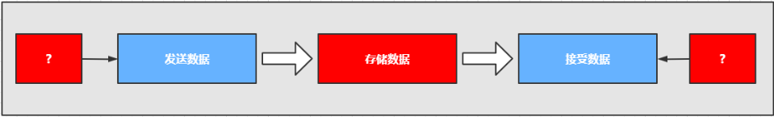

# 第1章_中间件

## 1.中间件简介

### 1.1 什么是中间件

我国企业从 20 世纪 80 年代开始就逐渐进行信息化建设，由于方法和体系的不成熟，以及企业业务和市场需求的不断变化，一个企业可能同时运行着多个不同的业务系统，这些系统可能基于不同的操作系统、不同的数据库、异构的网络环境。现在的问题是，如何把这些信息系统结合成一个有机地协同工作的整体，真正实现企业跨平台、分布式应用。中间件便是解决之道，它用自己的复杂换取了企业应用的简单。

> 中间件（Middleware）是处于操作系统和应用程序之间的软件，也有人认为它应该属于操作系统中的一部分。人们在使用中间件时，往往是一组中间件集成在一起，构成一个平台（包括开发平台和运行平台），但在这组中间件中必须要有一个通信中间件，即中间件=平台+通信，这个定义也限定了只有用于分布式系统中才能称为中间件，同时还可以把它与支撑软件和实用软件区分开来。

**举例**

- RMI（Remote Method Invocations, 远程调用）
- Load Balancing（负载均衡，将访问负荷分散到各个服务器中）
- Transparent Fail-over（透明的故障切换）
- Clustering（集群,用多个小的服务器代替大型机）
- Back-end-Integration（后端集成，用现有的、新开发的系统如何去集成遗留的系统）
- Transaction事务（全局/局部）全局事务（分布式事务）局部事务（在同一数据库联接内的事务）
- Dynamic Redeployment（动态重新部署,在不停止原系统的情况下，部署新的系统）
- System Management（系统管理）
- Threading（多线程处理）
- Message-oriented Middleware面向消息的中间件（异步的调用编程）
- Component Life Cycle（组件的生命周期管理）
- Resource pooling（资源池）
- Security（安全）
- Caching（缓存）

### 1.2 为什么需要使用消息中间件

具体地说，中间件屏蔽了底层操作系统的复杂性，使程序开发人员面对一个简单而统一的开发环境，减少程序设计的复杂性，将注意力集中在自己的业务上，不必再为程序在不同系统软件上的移植而重复工作，从而大大减少了技术上的负担。中间件带给应用系统的，不只是开发的简便、开发周期的缩短，也减少了系统的维护、运行和管理的工作量，还减少了计算机总体费用的投入。

### 1.3 中间件特点

为解决分布异构问题，人们提出了中间件（middleware）的概念。中间件是位于平台（硬件和操作系统）和应用之间的通用服务，如下图所示，这些服务具有标准的程序接口和协议。针对不同的操作系统和硬件平台，它们可以有符合接口和协议规范的多种实现。

也许很难给中间件一个严格的定义，但中间件应具有如下的一些特点：

- 满足大量应用的需要
- 运行于多种硬件和 OS 平台
- 支持分布计算，提供跨网络、硬件和 OS 平台的透明性的应用或服务的交互
- 支持标准的协议
- 支持标准的接口

由于标准接口对于可移植性和标准协议对于互操作性的重要性，中间件已成为许多标准化工作的主要部分。对于应用软件开发，中间件远比操作系统和网络服务更为重要，中间件提供的程序接口定义了一个相对稳定的高层应用环境，不管底层的计算机硬件和系统软件怎样更新换代，只要将中间件升级更新，并保持中间件对外的接口定义不变，应用软件几乎不需任何修改，从而保护了企业在应用软件开发和维护中的重大投资。

> 简单说：中间件有个很大的特点，是脱离于具体设计目标，而具备提供普遍独立功能需求的模块。这使得中间件一定是可替换的。如果一个系统设计中，中间件是不可替换的，不是架构、框架设计有问题，那么就是这个中间件，在 别处可能是个中间件，在这个系统内是引擎。

### 1.4 在项目中什么时候使用中间件技术

在项目的架构和重构中，使用任何技术和架构的改变我们都需要谨慎斟酌和思考，因为任何技术的融入和变化都可能人员，技术，和成本的增加，中间件的技术一般现在一些互联网公司或者项目中使用比较多，如果你仅仅还只是一个初创公司建议还是使用单体架构，最多加个缓存中间件即可，不要盲目追求新或者所谓的高性能，而追求的背后一定是业务的驱动和项目的驱动，因为一旦追求就意味着你的学习成本，公司的人员结构以及服务器成本，维护和运维的成本都会增加，所以需要谨慎选择和考虑。

但是作为一个开放人员，一定要有学习中间件技术的能力和思维，否则很容易当项目发展到一个阶段在去掌握估计或者在面试中提及，就会给自己带来不小的困扰，在当今这个时代这些技术也并不是什么新鲜的东西，如果去掌握和挖掘最关键的还是自己花时间和花精力去探讨和研究。

## 2.中间件技术及架构的概述

### 2.1 学习中间件的方式和技巧

- 理解中间件在项目架构中的作用，以及各中间件的底层实现
- 可以使用一些类比的生活概念去理解中间件
- 使用一些流程图或者脑图的方式去梳理各个中间件在架构中的作用
- 尝试用 java 技术去实现中间件的远离
- 静下来去思考中间件在项目中设计的和使用的原因
- 如果找到对应的替代总结方案
- 尝试编写博文总结类同中间件技术的对比和使用场景
- 学会查看中间件的源码以及开开源项目和博文

### 2.2 学习目标

- 什么是消息中间件
- 什么是协议
- 什么是持久化
- 消息分发
- 消息的高可用
- 消息的集群
- 消息的容错
- 消息的冗余

### 2.3 什么是消息中间件

在实际的项目中，大部分的企业项目开发中，在早期都采用的是单体的架构模式，如下图：

### 2.4 单体架构

在企业开发的中，大部分的初期架构都采用的是单体架构的模式进行架构，而这种架构的典型的特点：就是把所有的业务和模块，源代码，静态资源文件等都放在一个一工程中，如果其中的一个模块升级或者迭代发生一个很小变动都会重新编译和重新部署项目。 这种的架构存在的问题就是：

- 耦合度太高
- 运维的成本过高
- 不易维护
- 服务器的成本高
- 以及升级架构的复杂度也会增大

这样就有后续的分布式架构系统。

### 2.5 分布式架构

> 何谓分布式系统呢？
>
> 通俗一点：就是一个请求由服务器端的多个服务（服务或者系统）协同处理完成。

和单体架构不同的是，单体架构是一个请求发起 jvm 调度线程（确切的是 tomcat 线程池）分配线程 Thread 来处理请求直到释放，而分布式是系统是一个请求是由多个系统共同来协同完成，jvm 和环境都可能是独立。如果生活中的比喻的话，单体架构就想建设一个小房子很快就能够搞定，如果你要建设一个鸟巢或者大型的建筑，你就必须是各个环节的协同和分布，这样目的也是项目发展都后期的时候要去部署和思考的问题。

分布式架构系统存在的特点和问题如下：

**存在问题**

- 学习成本高，技术栈过多
- 运维成本和服务器成本增高
- 人员的成本也会增高
- 项目的负载度也会上升
- 面临的错误和容错性也会成倍增加
- 占用的服务器端口和通讯的选择的成本高
- 安全性的考虑和因素逼迫可能选择 RMI/MQ 相关的服务器端通讯

**好处**

- 服务系统的独立，占用的服务器资源减少和占用的硬件成本减少，确切的说是：可以合理的分配服务资源，不造成服务器资源的浪费
- 系统的独立维护和部署，耦合度降低，可插拔性
- 系统的架构和技术栈的选择可以变的灵活（而不是单纯的选择 java）
- 弹性的部署，不会造成平台因部署造成的瘫痪和停服的状态

## 3.基于消息中间件的分布式系统的架构

### 3.1 基于消息中间件的分布式系统的架构

从上图中可以看出来，消息中间件的特点是：

- 利用可靠的消息传递机制进行系统和系统直接的通讯
- 通过提供消息传递和消息的排队机制，它可以在分布式系统环境下扩展进程间的通讯

### 3.2 消息中间件应用的场景

- 跨系统数据传递

- 高并发的流量削峰

  > 用消息队列来缓冲瞬时流量，把同步的直接调用转换成异步的间接推送，中间通过一个队列在一端承接瞬时的流量洪峰，在另一端平滑地将消息推送出去

- 数据的分发和异步处理

- 大数据分析与传递

- 分布式事务

比如你有一个数据要进行迁移或者请求并发过多的时候，比如你有 10W 的并发请求下订单，我们可以在这些订单入库之前，我们可以把订单请求堆积到消息队列中，让它稳健可靠的入库和执行。

### 3.3 常见的消息中间件

ActiveMQ、RabbitMQ、Kafka、RocketMQ 等。

### 3.4 消息中间件的本质及设计

它是一种接受数据，接受请求、存储数据、发送数据等功能的技术服务。

> MQ 消息队列：负责数据的传接受，存储和传递，所以性能要过于普通服务和技术。

谁来生产消息，存储消息和消费消息呢？

### 3.5 消息中间件的核心组成部分

- 消息的协议
- 消息的持久化机制
- 消息的分发策略
- 消息的高可用，高可靠
- 消息的容错机制