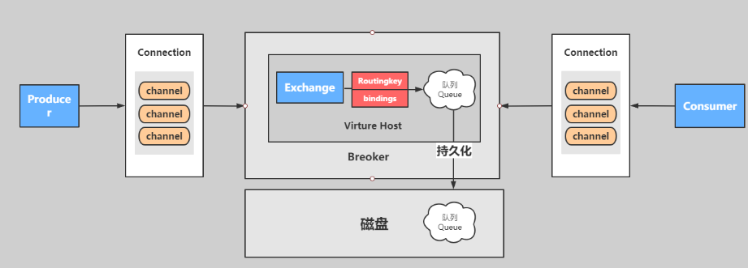

# 第6章_RabbitMQ与SpringBoot整合

## 1.RabbitMQ使用场景

### 1.1 解耦、异步

#### 1.串行方式

将订单信息写入数据库成功后，发送注册邮件，再发送注册短信。以上三个任务全部完成后，返回给客户端。


```java
public void makeOrder(){
    // 1 :保存订单 
    orderService.saveOrder();
    // 2： 发送短信服务
    messageService.sendSMS("order");// 1-2 s
    // 3： 发送email服务
    emailService.sendEmail("order");// 1-2 s
    // 4： 发送APP服务
    appService.sendApp("order");    
}
```

#### 2.并行方式：异步线程池

将订单信息写入数据库成功后，发送注册邮件的同时，发送注册短信。以上三个任务完成后，返回给客户端。与串行的差别是，并行的方式可以提高处理的时间。


```java
public void makeOrder(){
    // 1 :保存订单 
    orderService.saveOrder();
    // 相关发送
    relationMessage();
}
public void relationMessage(){
    // 异步
    theadpool.submit(new Callable<Object>{
        public Object call(){
            // 2： 发送短信服务  
            messageService.sendSMS("order");
        }
    })
    // 异步
    theadpool.submit(new Callable<Object>{
  	    public Object call(){
            // 3： 发送email服务
            emailService.sendEmail("order");
        }
    })
    // 异步
    theadpool.submit(new Callable<Object>{
        public Object call(){
            // 4： 发送短信服务
            appService.sendApp("order");
        }
    })
    // 异步
    theadpool.submit(new Callable<Object>{
        public Object call(){
            // 4： 发送短信服务
            appService.sendApp("order");
        }
    })
}
```

**存在问题**

- 耦合度高
- 需要自己写线程池自己维护成本太高
- 出现了消息可能会丢失，需要你自己做消息补偿
- 如何保证消息的可靠性你自己写
- 如果服务器承载不了，你需要自己去写高可用

#### 3.异步消息队列的方式


**好处**

- 完全解耦，用 MQ 建立桥接
- 有独立的线程池和运行模型
- 出现了消息可能会丢失，MQ 有持久化功能
- 如何保证消息的可靠性，死信队列和消息转移的等
- 如果服务器承载不了，你需要自己去写高可用，HA 镜像模型高可用

按照以上约定，用户的响应时间相当于是订单信息写入数据库的时间，也就是 50 毫秒。注册邮件，发送短信写入消息队列后，直接返回，因此写入消息队列的速度很快，基本可以忽略，因此用户的响应时间可能是 50 毫秒。因此架构改变后，系统的吞吐量提高到每秒 20 QPS。比串行提高了 3 倍，比并行提高了两倍。

**代码**

```JAVA
public void makeOrder(){
    // 1 :保存订单 
    orderService.saveOrder();   
    rabbitTemplate.convertSend("ex","2","消息内容");
}
```

### 1.2 高内聚，低耦合


### 1.3 流量的削峰


### 1.4 其他场景

- 分布式事务的可靠消费和可靠生产
- 索引、缓存、静态化处理的数据同步
- 流量监控
- 日志监控（ELK）
- 下单、订单分发、抢票

## 2.SpringBoot案例

### 2.1 fanout模式（发布订阅模式）

#### 整体核心


#### 目标

**使用 springboot 完成 rabbitmq 的发布订阅模式**


#### 实现步骤

- 创建生产者工程：springboot-rabbitmq-fanout-producer

  > 可以在 spring initializer 中直接导入 rabbitmq

- 创建消费者工程：springboot-rabbitmq-fanout-consumer

- 引入 spring-boot-rabbitmq 的依赖

- 进行消息的分发和测试

- 查看和观察 web 控制台的状况

#### 具体实现

**生产者**

- 创建生产者工程：springboot-rabbitmq-fanout-producer

- 在 pom.xml 中引入依赖

  ```xml
  <dependency>
      <groupId>org.springframework.boot</groupId>
      <artifactId>spring-boot-starter-amqp</artifactId>
  </dependency>
  <dependency>
      <groupId>org.springframework.boot</groupId>
      <artifactId>spring-boot-starter-web</artifactId>
  </dependency>
  ```

- 在 application.yml 进行配置

  ```yaml
  # 服务端口
  server:
    port: 8080
  # 配置rabbitmq服务
  spring:
    rabbitmq:
      # 账号密码默认 guest
      username: admin
      password: admin
      virtual-host: /
      host: 192.168.11.101
      port: 5672
  ```

- 定义订单的生产者

  ```java
  @Component
  public class OrderService {
      @Autowired
      private RabbitTemplate rabbitTemplate;
      // 1: 定义交换机
      private String exchangeName = "fanout";
      // 2: 路由key
      private String routeKey = "";
      
      public void makeOrder(Long userId, Long productId, int num) {
          // 1： 模拟用户下单
          String orderNumer = UUID.randomUUID().toString();
          // 2: 根据商品id productId 去查询商品的库存
          // int numstore = productSerivce.getProductNum(productId);
          // 3:判断库存是否充足
          // if(num >  numstore ){ return  "商品库存不足..."; }
          // 4: 下单逻辑
          // orderService.saveOrder(order);
          // 5: 下单成功要扣减库存
          // 6: 下单完成以后
          System.out.println("用户 " + userId + ",订单编号是：" + orderNumer);
          // 发送订单信息给RabbitMQ fanout
          rabbitTemplate.convertAndSend(exchangeName, routeKey, orderNumer);
      }
  }
  ```

- 配置类绑定

  ```java
  @Configuration
  public class RabbitConf {
      @Bean
      public FanoutExchange fanoutExchange() {
          return new FanoutExchange("fanout", true, false);
      }
  
      @Bean
      public Queue duanxinQueue() {
          return new Queue("duanxin.fanout.queue");
      }
  
      @Bean
      public Queue smsQueue() {
          return new Queue("sms.fanout.queue");
      }
  
      @Bean
      public Binding bindDuanxin() {
          return BindingBuilder.bind(duanxinQueue()).to(fanoutExchange());
      }
  
      @Bean
      public Binding bindSms() {
          return BindingBuilder.bind(smsQueue()).to(fanoutExchange());
      }
  }
  ```

- 进行测试

  ```java
  @SpringBootTest
  class SpringbootRabbitmqFanoutProducerApplicationTests {
      @Autowired
      OrderService orderService;
      
      @Test
      void contextLoads() {
          Long userId = 100L;
          Long productId = 10001L;
          int num = 10;
          orderService.makeOrder(userId, productId, num);
      }
  }
  ```

  ```bash
  用户 100,订单编号是：ee38e1c5-2fbb-4e69-b361-f290c0a37eaa
  ```

  

  

  

**消费者**

- 创建消费者工程：springboot-rabbitmq-fanout-consumer

- 引入依赖 pom.xml

- 在 application.yml 进行配置

  ```yaml
  # 服务端口
  server:
    port: 8081
  # 配置rabbitmq服务
  spring:
    rabbitmq:
      username: admin
      password: admin
      virtual-host: /
      host: 47.104.141.27
      port: 5672
  ```

- 消费者

  - 短信服务

    ```java
    @RabbitListener(queues = {"duanxin.fanout.queue"})
    @Component
    public class DuanxinService {
        @RabbitHandler
        public void messagerevice(String message){
            System.out.println("sms-------------->" + message);
        }
    }
    ```

  - sms 服务

    ```java
    @RabbitListener(queues = {"sms.fanout.queue"})
    @Component
    public class smsService {
        @RabbitHandler
        public void messagerevice(String message){
            System.out.println("weixin-------------->" + message);
        }
    }
    ```

#### 使用注解绑定

使用`queues`属性时**必须保证该队列已存在**，否则会产生异常。若想通过消费者建立 exchange 和 queue 并绑定，可以使用下面的**注解方法**或者跟生产者一样使用**配置类**。

```java
// 生产者不能通过该方法绑定
@RabbitListener(bindings = @QueueBinding(
        // duanxin.fanout.queue 是队列名字，这个名字你可以自定随便定义。
        value = @Queue(value = "duanxin.fanout.queue",autoDelete = "false"),
        // fanout 交换机的名字 必须和生产者保持一致
        exchange = @Exchange(value = "fanout",
                // 这里是确定的rabbitmq模式是：fanout 是以广播模式、发布订阅模式
                type = ExchangeTypes.FANOUT)
))
@Service
public class DuanxinService {
    @RabbitHandler
    public void receiveMessage(String message) {
        System.out.println("duanxin:" + message);
    }
}
```

- 启动服务 SpringbootRabbitmqFanoutConsumerApplication，查看效果

  ```java
  duanxin:ee38e1c5-2fbb-4e69-b361-f290c0a37eaa
  sms:ee38e1c5-2fbb-4e69-b361-f290c0a37eaa
  ```

### 2.2 direct模式（路由模式）

#### 整体核心


#### 目标

**使用 springboot 完成 rabbitmq 的路由模式 - direct**


#### 具体实现

**生产者**

- 创建生产者工程：springboot-rabbitmq-direct-producer

- 引入依赖 pom.xml

- 在application.yml进行配置

- 定义订单的生产者

  ```java
  @Component
  public class OrderService {
  
      // 模板方法模式
      @Autowired
      private RabbitTemplate rabbitTemplate;
  
      // 交换机
      private String exchangeName = "llp_direct_order_ex";
  
      public String makeorder(String userId, String productId, Integer num) {
          // 1: 根据用户查询用户是否存在
          // 2: 根据产品id查询产品信息
          String orderId = num+"";
          // 3: 保存订单
          // 4: 发送邮件，sms,短信
          System.out.println("用户：" + userId + ",购买了一个产品：" + productId + "保存订单是：" + orderId);
          // 发送消息
          rabbitTemplate.convertAndSend(exchangeName, "email", orderId);
          rabbitTemplate.convertAndSend(exchangeName, "duanxin", orderId);
          return "success";
      }
  
  }
  ```

**消费者**

- 创建消费者工程：springboot-rabbitmq-direct-consumer

- 引入依赖 pom.xml

- 在 application.yml 进行配置

- 绑定关系

  ```java
  @Configuration
  public class RabbitMqConfiguration {
  
      @Bean
      public DirectExchange directExchange() {
          // 等价于  channel.exchangeDeclare(exchangeName,exchangeType,true);
          return new DirectExchange("llp_direct_order_ex", true, false);
      }
  
      @Bean
      public Queue duanxinQueue() {
          // 等价于  channel.exchangeDeclare(exchangeName,exchangeType,true);
          return new Queue("duanxin.direct.queue");
      }
  
      @Bean
      public Binding bindingDirectDuanxin() {
          return BindingBuilder.bind(duanxinQueue()).to(directExchange()).with("duanxin");
      }
  
      @Bean
      public Queue emailQueue() {
          // 等价于  channel.exchangeDeclare(exchangeName,exchangeType,true);
          return new Queue("email.direct.queue");
      }
  
      @Bean
      public Binding bindingDirectEmail() {
          return BindingBuilder.bind(emailQueue()).to(directExchange()).with("email");
      }
  
  }
  ```

- 消费者 - 邮件服务

  ```java
  @Component
  @RabbitListener(queues = {"email.direct.queue"})
  public class EmailConsumerService {
  
      @Autowired
      private RabbitTemplate rabbitTemplate;
  
      // @RabbitHandler 代表该方法会当做消费者的方法，如果有消息过来就会进入此方法
      @RabbitHandler
      public void reciverMessage(String message) {
          System.out.println("direct email开始接收消息：" + message);
      }
  }
  ```

- 消费者 - 短信服务

  ```java
  @Component
  @RabbitListener(queues = {"duanxin.direct.queue"})
  public class DuanxinConsumerService {
  
      @Autowired
      private RabbitTemplate rabbitTemplate;
  
      // @RabbitHandler 代表该方法会当做消费者的方法，如果有消息过来就会进入此方法
      @RabbitHandler
      public void reciverMessage(String message) {
          System.out.println("direct 短信开始接收消息：" + message);
      }
  }
  ```

- 进行测试

  ```java
  @SpringBootTest
  class SpringbootRabbitmqFanoutProducerApplicationTests {
      @Autowired
      OrderService orderService;
      @Test
      public void contextLoads() throws Exception {
          for (int i = 0; i < 10; i++) {
              Thread.sleep(1000);
              Long userId = 100L + i;
              Long productId = 10001L + i;
              int num = 10;
              orderService.makeOrder(userId, productId, num);
          }
      }
  }
  ```

- 启动服务 SpringbootRabbitmqFanoutConsumerApplication，查看效果

### 2.3 topic模式

#### 整体核心



#### 目标

**使用==注解方式==完成 rabbitmq 的消费模式 - topic**


#### 具体实现

**生产者**

- 创建生产者工程：sspringboot-rabbitmq-topic-producer

- 在 pom.xml 中引入依赖

- 在 application.yml 进行配置

- 定义订单的生产者

  ```java
  @Component
  public class OrderService {
  
      // 模板方法模式
      @Autowired
      private RabbitTemplate rabbitTemplate;
  
      // 交换机
      private String exchangeName = "llp_topic_order_ex";
      // 路由key
      private String routingKey = "com.order.course.xxx";
  
      public String makeorder(String userId, String productId, Integer num) {
          // 1: 根据用户查询用户是否存在
          // 2: 根据产品id查询产品信息
          String orderId = num+"";
          // 3: 保存订单
          // 4: 发送邮件，sms,短信
          System.out.println("用户：" + userId + ",购买了一个产品：" + productId + "保存订单是：" + orderId);
          // 发送消息
  
          // #.email.#  ---email
          // com.#  ---weixin
          // *.sms.# ---sms
          rabbitTemplate.convertAndSend(exchangeName, routingKey, orderId);
          return "success";
      }
  }
  ```

**消费者**

- 创建消费者工程：springboot-rabbitmq-topic-consumer

- 在 pom.xml 中引入依赖

- 在 application.yml 进行配置

- 消费者 - 邮件服务

  ```java
  @Component
  @RabbitListener(bindings = @QueueBinding(
          value = @Queue(value = "email.topic.queue", durable = "true", autoDelete = "false"),
          exchange = @Exchange(value = "llp_topic_order_ex", type = ExchangeTypes.TOPIC),
          key = "#.email.#"
  ))
  public class EmailConsumerService {
  
      @Autowired
      private RabbitTemplate rabbitTemplate;
  
      // @RabbitHandler 代表该方法会当做消费者的方法，如果有消息过来就会进入此方法
      @RabbitHandler
      public void reciverMessage(String message) {
          System.out.println("email开始接收消息：" + message);
      }
  }
  ```

- 消费者 - 短信服务

  ```java
  @Component
  @RabbitListener(bindings = @QueueBinding(
          value = @Queue(value = "sms.topic.queueu", autoDelete = "false"),
          exchange = @Exchange(value = "llp_topic_order_ex", type = ExchangeTypes.TOPIC),
          key = "*.sms.#"
  ))
  public class SMSConsumerService {
  
      @Autowired
      private RabbitTemplate rabbitTemplate;
  
      // @RabbitHandler 代表该方法会当做消费者的方法，如果有消息过来就会进入此方法
      @RabbitHandler
      public void reciverMessage(String message) {
          System.out.println("sms开始接收消息：" + message);
      }
  }
  ```

- 消费者 - 微信服务

  ```java
  @Component
  @RabbitListener(bindings = @QueueBinding(
          value = @Queue(value = "weixin.topic.queue", autoDelete = "false"),
          exchange = @Exchange(value = "llp_topic_order_ex", type = ExchangeTypes.TOPIC),
          key = "com.#"
  ))
  public class WeixinConsumerService {
  
      @Autowired
      private RabbitTemplate rabbitTemplate;
  
      // @RabbitHandler 代表该方法会当做消费者的方法，如果有消息过来就会进入此方法
      @RabbitHandler
      public void reciverMessage(String message) {
          System.out.println("微信开始接收消息：" + message);
      }
  }
  ```

- 启动服务 SpringbootRabbitmqFanoutConsumerApplication，查看效果

  > `*`匹配一个 ，`#`匹配零个或多个

### 2.4 总结

`交换机`和`队列`的声明和绑定操作在生产者和消费者中都可以指定，考虑到如果不指定的话无法启动消费者，在消费者中声明也可以。但是这样的话，如果还没有启动消费者时生产者需要发送消息到队列中的话就会产生异常。所以最好生产者和消费者中都指定。

**常用方法**

```java
// 可以同步消费者。使用此方法，线程阻塞直到所有的消费者都接收成功
convertSendAndReceive(...) {}
// 不会阻塞
convertAndSend(...) {}
```

