# 第7章_RabbitMQ高级

## 1.过期时间TTL

### 1.1 概述

过期时间 TTL 表示可以对消息设置预期的时间，在这个时间内都可以被消费者接收获取；过了之后消息将自动被删除。RabbitMQ 可以对消息和队列设置 TTL。目前有两种方法可以设置。

- 第一种方法是通过队列属性设置，队列中所有消息都有相同的过期时间
- 第二种方法是对消息进行单独设置，每条消息 TTL 可以不同

如果上述两种方法同时使用，则消息的过期时间以两者之间 TTL **较小**的那个数值为准。消息在队列的生存时间一旦超过设置的 TTL 值，就称为`dead message`被投递到死信队列，消费者将无法再收到该消息。

### 1.2 设置队列TTL

- 配置类

  ```java
  @Configuration
  public class RabbitConf {
  
      @Bean
      public DirectExchange ttldirectExchange() {
          return new DirectExchange("direct", true, false);
      }
  
      @Bean
      public Queue directQueue() {
          Map<String, Object> args = new HashMap<>();
          // 设置 x-message-ttl 参数
          args.put("x-message-ttl", 5000);
          // queueName, durable, exclusive, autoDelete, arguments
          return new Queue("ttl.direct.queue", true, false, false, args);
      }
  
      @Bean
      public Binding bindQueue(DirectExchange directExchange, Queue directQueue) {
          return BindingBuilder.bind(directQueue).to(directExchange).with("ttl");
      }
  
  }
  ```

- 生产者

  ```java
  @Component
  public class OrderService {
      @Autowired
      RabbitTemplate rabbitTemplate;
  
      private String exchangeName = "direct";
      private String routingKey = "ttl";
  
      public void makeOrder(Long userId, Long productId, int num) {
          String orderNumber = UUID.randomUUID().toString();
          System.out.println("用户 " + userId + ",订单编号是：" + orderNumber);
          rabbitTemplate.convertAndSend(exchangeName, routingKey, orderNumber);
      }
  }
  ```

- 测试类

  ```java
  @Test
  void contextLoads() {
      Long userId = 100L;
      Long productId = 10001L;
      int num = 10;
      orderService.makeOrder(userId, productId, num);
  }
  ```

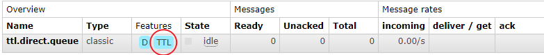

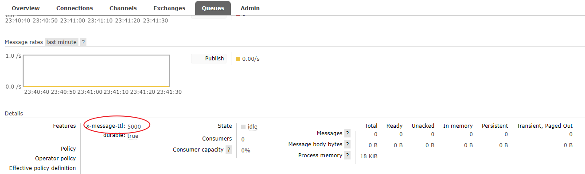

> 参数`x-message-ttl`的值必须是非负 32 位整数 (0 <= n <= 2^32-1) ，以毫秒为单位表示 TTL 的值。
>
> 例：6000 表示存在于队列中的当前消息将最多只存活 6 秒钟。

### 1.3 设置消息TTL

只需要在发送消息（可以发送到任何队列，不管该队列是否属于某个交换机）的时候设置过期时间即可。

- 配置类

  ```java
  @Configuration
  public class RabbitConf {
  
      @Bean
      public DirectExchange ttlMessageExchange() {
          return new DirectExchange("directMessage", true, false);
      }
  
      @Bean
      public Queue directMessageQueue() {
          return new Queue("ttl.direct.message.queue", true, false, false);
      }
  
      @Bean
      public Binding bindDirectMessageQueue(DirectExchange ttlMessageExchange, Queue directMessageQueue) {
          return BindingBuilder.bind(directMessageQueue).to(ttlMessageExchange).with("ttl-message");
      }
  
  }
  ```

- 生产者

  ```java
  @Component
  public class OrderService {
      @Autowired
      RabbitTemplate rabbitTemplate;
      private String exchangeName = "directMessage";
      private String routingKey = "ttl-message";
  
      public void makeOrder(Long userId, Long productId, int num) {
          String orderNumber = UUID.randomUUID().toString();
          System.out.println("用户 " + userId + ",订单编号是：" + orderNumber);
          // 使用 MessagePostProcessor 设置消息过期时间
          MessagePostProcessor messagePostProcessor = new MessagePostProcessor() {
              @Override
              public Message postProcessMessage(Message message) throws AmqpException {
                  message.getMessageProperties().setExpiration("5000");
                  message.getMessageProperties().setContentEncoding("UTF-8");
                  return message;
              }
          };
          rabbitTemplate.convertAndSend(exchangeName, routingKey, orderNumber, messagePostProcessor);
      }
  }
  ```

> expiration 字段以微秒为单位表示 TTL 值。且与 x-message-ttl 具有相同的约束条件。因为 expiration 字段必须为字符串类型，broker 将只会接受以字符串形式表达的数字。
> 当同时指定了 queue 和 message 的 TTL 值，则**两者中较小**的那个才会起作用。
>
> **区别**
>
> 过期队列当消息过期后会移除到`死信队列`中，而过期消息过期后就会被直接移除。

## 2.消息确认机制的配置

- `NONE`值是禁用发布确认模式，是默认值
- `CORRELATED`值是发布消息成功到交换器后会触发回调方法，如 1 示例
- `SIMPLE`值经测试有两种效果，其一效果和 CORRELATED 值一样会触发回调方法，其二在发布消息成功后使用 rabbitTemplate 调用`waitForConfirms`或`waitForConfirmsOrDie`方法等待 broker 节点返回发送结果，根据返回结果来判定下一步的逻辑，要注意的点是 waitForConfirmsOrDie 方法如果返回 false 则会关闭 channel，则接下来无法发送消息到 broker

**代码实现**

1. 修改 yml/properties 配置文件

   ```properties
   #开启发送确认机制，消息到达交换机后会有回调
   spring.rabbitmq.publisher-confirm-type=correlated
   #可以确保消息在未被队列接收时返回
   spring.rabbitmq.publisher-returns=true
    
   ## 发送重试配置
   # 启用发送重试
   spring.rabbitmq.template.retry.enabled=true
   # 最大重试次数
   spring.rabbitmq.template.retry.max-attempts=5
   # 第一次和第二次尝试发布或传递消息之间的间隔
   spring.rabbitmq.template.retry.initial-interval=1000ms
   # 应用于上一重试间隔的乘数步长
   spring.rabbitmq.template.retry.multiplier=2
   # 最大重试时间间隔
   spring.rabbitmq.template.retry.max-interval=10000ms
   
   ## MQ重试配置
   # 开启手动ack，让程序控制 MQ 的消息的重发、删除和转移
   spring.rabbitmq.listener.simple.acknowledge-mode=manual
   # 开启控制MQ重试
   spring.rabbitmq.listener.simple.retry.enabled=true
   # 最大重试次数，超过则会被移除（有死信队列时移到死信队列）
   spring.rabbitmq.listener.simple.retry.max-attempts=10
   # 重试间隔时间
   spring.rabbitmq.listener.simple.retry.initial-interval=2000ms
   ```

2. 新增回调处理

   ```java
   @Configuration
   @Slf4j
   public class RabbitConfig implements RabbitTemplate.ConfirmCallback, RabbitTemplate.ReturnsCallback {
    
       @Autowired
       RabbitTemplate rabbitTemplate;
    
       @PostConstruct
       public void initRabbitTemplate(){
         rabbitTemplate.setConfirmCallback(this);
         rabbitTemplate.setReturnsCallback(this);
       }
    
       /**
        * durable:是否持久化
        * exclusive:是否独享、排外的
        * autoDelete:是否自动删除
        */
       @Bean
       Queue addUserQueue(){
           return new Queue(RabbitConstant.QUEUE_ADD_USER, true, false, false);
       }
    
       /**
        * 消息成功到达交换机触发该方法
        */
       @Override
       public void confirm(CorrelationData correlationData, boolean ack, String cause) {
           if (ack){
               //消息成功到达交换机
               log.info("{}消息成功到达交换机",correlationData.getId());
           }else{
               log.error("{}消息未到达交换机,原因：{}",correlationData.getId(),cause);
           }
    
       }
    
       /**
        * 配置publisher-returns为true 消息未成功到达队列，会触发该方法
        * @param returned
        */
       @Override
       public void returnedMessage(ReturnedMessage returned) {
           log.error("{}消息未到达队列",returned.toString());
       }
   }
   ```

3. 设置消息确认机制

   ```java
   @Component
   public class OrderService {
   
       // 模板方法模式
       @Autowired
       private RabbitTemplate rabbitTemplate;
   
       @Autowired
       private MessageConfirmCallback messageConfirmCallback;
       // 交换机
       private String exchangeName = "llp_direct_order_ex";
   
       public String makeorder(String userId, String productId, Integer num) {
           // 1: 根据用户查询用户是否存在
           // 2: 根据产品id查询产品信息
           String orderId = num + "";
           // 3: 保存订单
           // 4: 发送邮件，sms,短信
           System.out.println("用户：" + userId + ",购买了一个产品：" + productId + "保存订单是：" + orderId);
           // 发送消息
           // 设置消息确认机制
           rabbitTemplate.setConfirmCallback(messageConfirmCallback);
           rabbitTemplate.convertAndSend(exchangeName, "email", orderId);
           rabbitTemplate.convertAndSend(exchangeName, "duanxin", orderId);
           return "success";
       }
   
   }
   ```

4. 或者在发送消息时设置（不推荐，建议声明在配置类中）

   ```java
   public void makeOrder(Long userId, Long productId, int num) {
       String orderNumber = UUID.randomUUID().toString();
       System.out.println("用户 " + userId + ",订单编号是：" + orderNumber);
   
       rabbitTemplate.setConfirmCallback(new RabbitTemplate.ConfirmCallback() {
           @Override
           public void confirm(CorrelationData correlationData, boolean ack, String cause) {
               if (!ack) {
                   System.out.println("MQ队列应答失败，orderID：" + correlationData.getId());
               }
               System.out.println("发送成功");
           }
       });
   }
   ```

**消息消费者通知 Rabbit 消息消费成功**

消息通过`ACK`确认是否被正确接收，每个 Message 都要被确认（acknowledged），可以手动去 ACK 或自动 ACK。

自动确认会在消息发送给消费者后立即确认，但存在丢失消息的可能，如果消费端消费逻辑抛出异常，也就是消费端没有处理成功这条消息，那么就相当于丢失了消息。如果消息已经被处理，但后续代码抛出异常，使用 Spring 进行管理的话消费端业务逻辑会进行回滚，这也同样造成了实际意义的消息丢失。

如果手动确认则当消费者调用 ack、nack、reject 几种方法进行确认，手动确认可以在业务失败后进行一些操作，如果消息未被 ACK 则会发送到下一个消费者，如果某个服务忘记 ACK 了，则 RabbitMQ 不会再发送数据给它，因为 RabbitMQ 认为该服务的处理能力有限，ACK 机制还可以起到限流作用，比如在接收到某条消息时休眠几秒钟。

消息确认模式有：

- AcknowledgeMode.NONE：自动确认

  > 如果消息在业务处理时出现异常没有 ack，则 MQ 会不断重试发送消息，解决方法有三种：
  >
  > 1. 控制 MQ 重试次数
  > 2. try-catch + 手动 ack + 死信队列

- AcknowledgeMode.AUTO：根据情况确认

- AcknowledgeMode.MANUAL：手动确认

**手动通知**

- 配置文件

  ```properties
  #设置消费端手动ack
  #none：不确认
  #auto：自动确认
  #manual：手动确认
  spring.rabbitmq.listener.simple.acknowledge-mode=manual
  ```

- ConsumerService

  ```java
  @Service
  public class ConsumerService {
   
      public static final String QUEUE_ADD_USER = "queue.add.user";
   
      @RabbitListener(queues =QUEUE_ADD_USER)
      @RabbitHandler
      public void addUser(String userStr, Message message, Channel channel){
          long deliveryTag = message.getMessageProperties().getDeliveryTag();
          try {
              //在这里做一些操作
              User user = JSONObject.parseObject(userStr,User.class);
              log.info(user.toString());
              //手动ack 第一个参数是消息的标记，第二个参数代表是 false 代表仅仅确认当前消息，为 true 表示确认之前的所有消息
              channel.basicAck(deliveryTag, false);
          } catch (Exception e) {
              //告诉 mq 本条消息消费失败
              try {
                  channel.basicNack(deliveryTag, false, true);
              } catch (IOException ex) {
                  ex.printStackTrace();
              }
          }
      }
  }
  ```

**补充**

```java
@Scope("prototype")
/**
 * spring中bean的scope属性，有如下5种类型：
 * singleton：表示在spring容器中的单例，通过spring容器获得该bean时总是返回唯一的实例
 * prototype：表示每次获得bean都会生成一个新的对象
 * request：表示在一次http请求内有效（只适用于web应用）
 * session：表示在一个用户会话内有效（只适用于web应用）
 * globalSession：表示在全局会话内有效（只适用于web应用）
 * 在多数情况，我们只会使用singleton和prototype两种scope，如果在spring配置文件内未指定scope属性，默认为singleton。
 */
```

## 3.死信队列

**概述**

DLX，全称为 Dead-Letter-Exchange , 可以称之为死信交换机，也有人称之为死信邮箱。当消息在一个队列中变成死信（dead message）之后，它能被重新发送到另一个交换机中，这个交换机就是DLX ，绑定 DLX 的队列就称之为死信队列。

消息变成死信，可能是由于以下的原因：

- 消息被拒绝

- 消息过期

- 队列达到最大长度

  > 使用参数`x-max-length`设置最大长度

DLX 也是一个正常的交换机，和一般的交换机没有区别，它能在任何的队列上被指定，实际上就是设置某一个队列的属性。当这个队列中存在死信时，Rabbitmq 就会自动地将这个消息重新发布到设置的 DLX 上去，进而被路由到另一个队列，即死信队列。

要想使用死信队列，只需要在定义队列的时候设置队列参数`x-dead-letter-exchange`指定交换机即可。

**消息过期的死信队列测试**

- 修改配置类

  ```java
  @Configuration
  public class RabbitConf {
      
      @Bean
      public DirectExchange ttldirectExchange() {
          return new DirectExchange("direct", true, false);
      }
  
      // 将过期队列与死信队列绑定
      @Bean
      public Queue directQueue() {
          Map<String, Object> args = new HashMap<>();
          args.put("x-message-ttl", 5000);
          args.put("x-dead-letter-exchange", "dead-letter-exchange");
          // direct 交换机需要指定 routing key
          args.put("x-dead-letter-routing-key", "dead");
          return new Queue("ttl.direct.queue", true, false, false, args);
      }
  
      @Bean
      public Binding bindQueue(DirectExchange ttldirectExchange, Queue directQueue) {
          return BindingBuilder.bind(directQueue).to(ttldirectExchange).with("ttl");
      }
  
      // 配置死信队列
      @Bean
      public DirectExchange deadLetterExchange() {
          return new DirectExchange("dead-letter-exchange", true, false);
      }
  
      @Bean
      public Queue deadLetterQueue() {
          return new Queue("dead.letter.queue", true, false, false);
      }
  
      @Bean
      public Binding bindDeadLetterQueue(DirectExchange deadLetterExchange, Queue deadLetterQueue) {
          return BindingBuilder.bind(deadLetterQueue).to(deadLetterExchange).with("dead");
      }
  
  }
  ```

> 注意如果交换机和队列已经创建，那么无法通过代码修改参数，必须删除后创建一个新的。


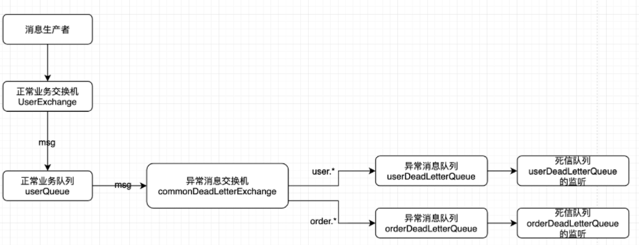

**在 rabbitMQ 管理界面中结果**

未过期：

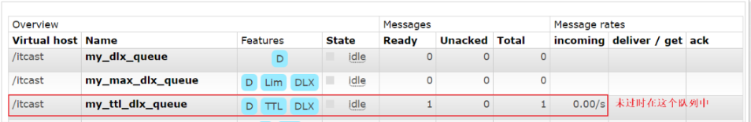

过期后：

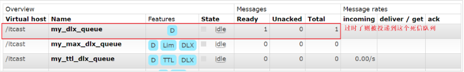

流程

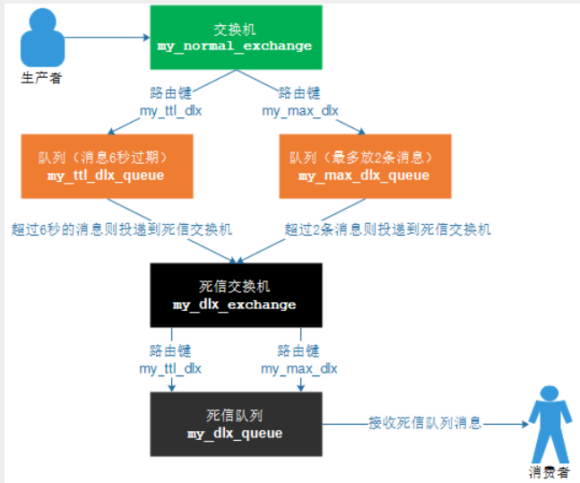


## 4.持久化机制和内存磁盘的监控

### 4.1 RibbitMQ持久化

持久化就把信息写入到磁盘的过程。

**RabbitMQ持久化消息**

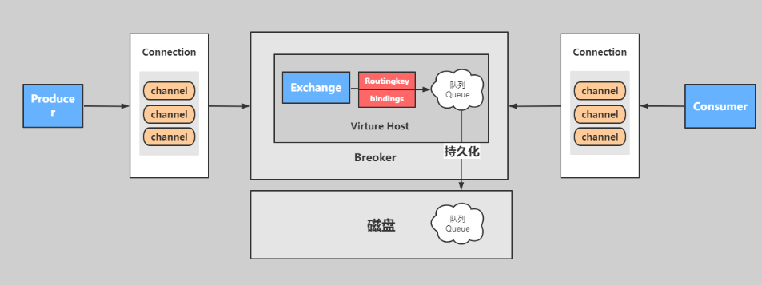

把消息默认放在内存中是为了加快传输和消费的速度，存入磁盘是保证消息数据的持久化。

**RabbitMQ非持久化消息**

非持久消息：只有当内存不够用的时候才会把消息和数据转移到磁盘，但是重启以后非持久化队列消息就丢失。

**RabbitMQ持久化分类**

RabbitMQ 的持久化队列分为：

- 队列持久化
- 消息持久化
- 交换机持久化

不论是持久化的消息还是非持久化的消息都可以写入到磁盘中，只不过非持久的是等内存不足的情况下才会被写入到磁盘中。

#### 1.RabbitMQ队列持久化

队列的持久化是定义队列时的 durable 参数来实现的，durable 为 true 时，队列才会持久化。

```java
// 参数1：名字  
// 参数2：是否持久化
// 参数3：独占的queue
// 参数4：不使用时是否自动删除
// 参数5：其他参数
return new Queue("ttl.direct.queue", true, false, false, args);

```

当参数 2 设置为 true，就代表的是持久化的含义。即 durable=true。持久化的队列在 web 控制台中有一个`D`的标记。

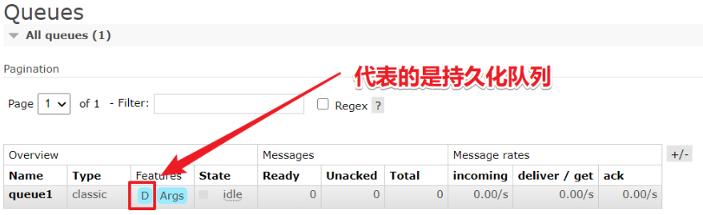

**测试步骤**

1. 建立一个临时队列

   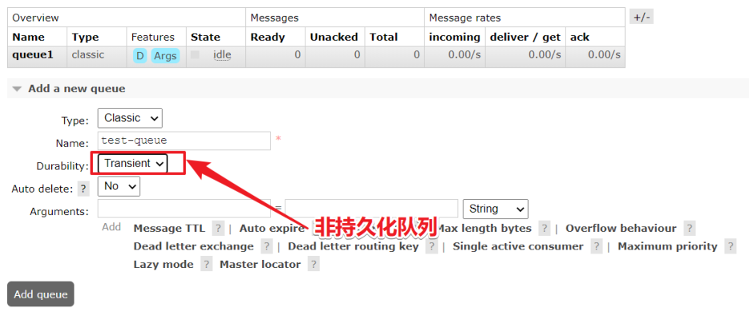

2. 然后重启 rabbit-server 服务，会发现持久化队列依然在，而非持久队列会丢失

   ```bash
   systecmctl restart rabbitmq-server
   # 或者
   docker restart myrabbit
   ```

#### 2.RabbitMQ消息持久化

消息持久化是通过消息的属性 deliveryMode 来设置是否持久化。

```java
public void makeOrder(Long userId, Long productId, int num) {
        String orderNumber = UUID.randomUUID().toString();
        System.out.println("用户 " + userId + ",订单编号是：" + orderNumber);
        MessagePostProcessor messagePostProcessor = new MessagePostProcessor() {
            @Override
            public Message postProcessMessage(Message message) throws AmqpException {
                message.getMessageProperties().setDeliveryMode(MessageDeliveryMode.PERSISTENT);
                return message;
            }
        };
        rabbitTemplate.convertAndSend(exchangeName, routingKey, orderNumber, messagePostProcessor);
    }
```

#### 3.RabbitMQ交换机持久化

和队列一样，交换机也需要在定义的时候设置持久化的标识，否则在 rabbit-server 服务重启以后将丢失。

```java
/**
 * exchangeName
 * durable
 * autoDelete
 */
@Bean
public DirectExchange ttldirectExchange() {
    return new DirectExchange("direct", true, false);
}
```

### 4.2 内存磁盘的监控

#### 1.内存的监控

**RabbitMQ的内存警告**

当内存使用超过配置的阈值或者磁盘空间剩余空间对于配置的阈值时，RabbitMQ 会暂时阻塞客户端的连接，并且停止接收从客户端发来的消息，以此避免服务器的崩溃，客户端与服务端的心跳检测机制也会失效。

如下图：


当出现 blocking 或 blocked 话说明到达了阈值和以及高负荷运行了。

**RabbitMQ的内存控制**

参考帮助文档：https://www.rabbitmq.com/configure.html

当出现警告的时候，可以通过配置去修改和调整。

1. 命令的方式

   ```bash
   rabbitmqctl set_vm_memory_high_watermark <fraction>
   #绝对值方式设置阈值，超过50MB就会内存警告
   rabbitmqctl set_vm_memory_high_watermark absolute 50MB
   #相对值方式设置，默认相对 0.4
   rabbitmqctl set_vm_memory_high_watermark relative 0.4
   ```

   fraction/value 为内存阈值。默认情况是：0.4/2GB，代表的含义是：当 RabbitMQ 的内存超过 40% 时，就会产生警告并且阻塞所有生产者的连接。通过此命令可以即使修改阈值，但是在 broker 重启以后将会失效，通过修改配置文件方式设置的阈值则不会随着重启而消失，但修改了配置文件要重启 broker 才会生效。

   测试

   ```bash
   rabbitmqctl set_vm_memory_high_watermark absolute 50MB
   ```

   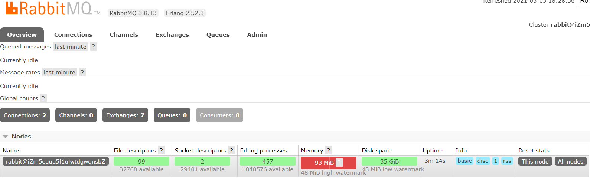

   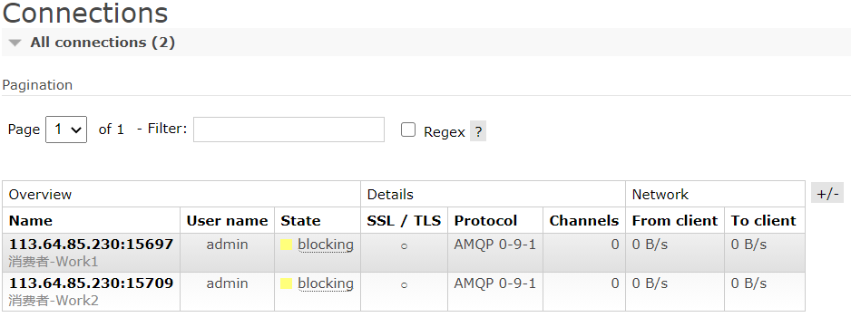

2. 配置文件方式

   > 当前配置文件：/etc/rabbitmq/rabbitmq.conf

   ```bash
   # 默认
   # vm_memory_high_watermark.relative = 0.4
   # 使用 relative 相对值进行设置 fraction，建议取值在 0.4~0.7 之间，不建议超过 0.7
   # 比如内存 8G 相对值为 0.4，则当咱用的内存超过 3.2G 时就会发出内存预警
   vm_memory_high_watermark.relative = 0.6
   # 使用 absolute 的绝对值的方式，指定 KB、MB、GB，对应的命令如下
   vm_memory_high_watermark.absolute = 2GB
   ```

**RabbitMQ的内存换页**

在某个 broker 节点及内存阻塞生产者之前，它会尝试将队列中的消息换页到磁盘以释放内存空间，持久化和非持久化的消息都会写入磁盘中，其中持久化的消息本身就在磁盘中有一个副本，所以在转移的过程中持久化的消息会先从内存中清除掉。

默认情况下，内存到达的阈值是 50% 时就会换页处理。也就是说，在默认情况下该内存的阈值是 0.4 的情况下，当内存超过 0.4*0.5=0.2 时，会进行换页动作。

比如有 1000MB 内存，当内存的使用率达到了 400MB，已经达到了极限，但是因为配置的换页内存 0.5，这个时候会在达到极限 400mb 之前，会把内存中的 200MB 进行转移到磁盘中。从而达到稳健的运行。

可以通过设置`vm_memory_high_watermark_paging_ratio`来进行调整：
```bash
#相对内存设置
vm_memory_high_watermark.relative = 0.4 
#设置内存换页
vm_memory_high_watermark_paging_ratio = 0.7（设置小于 1 的值）
```

#### 2.磁盘的监控

**RabbitMQ的磁盘预警**

当磁盘的剩余空间低于确定的阈值时，RabbitMQ 同样会阻塞生产者，这样可以避免因非持久化的消息持续换页而耗尽磁盘空间导致服务器崩溃。

默认情况下：磁盘预警为 50MB 的时候会进行预警。表示当前磁盘空间第 50MB 的时候会阻塞生产者并且停止内存消息换页到磁盘的过程。这个阈值可以减小，但是不能完全的消除因磁盘耗尽而导致崩溃的可能性。比如在两次磁盘空间的检查空隙内，第一次检查是：60MB ，第二检查可能就是1MB，就会出现警告。

通过命令方式修改如下：
```bash
# 绝对值设置磁盘预警阈值
rabbitmqctl set_disk_free_limit <disk_limit>
# 相对值设置磁盘预警阈值，这里时相对于内存的
# 比如磁盘空间 80GB，内存 2G，fraction=3.0 则超过 2G*3=6GB 时就会发出磁盘预警
rabbitmqctl set_disk_free_limit memory_limit <fraction>
# disk_limit：固定单位 KB MB GB
# fraction ：是相对阈值，建议范围在:1.0~2.0之间。（相对于内存）
```

通过配置文件配置如下：

```properties
disk_free_limit.relative = 3.0
disk_free_limit.absolute = 50mb
```

## 5.集群

RabbitMQ 这款消息队列中间件产品本身是基于 Erlang 编写，Erlang 语言天生具备分布式特性（通过同步 Erlang 集群各节点的 magic cookie 来实现）。因此，RabbitMQ 天然支持 Clustering。这使得 RabbitMQ 本身不需要像 ActiveMQ、Kafka 那样通过 ZooKeeper 分别来实现 HA 方案和保存集群的元数据。集群是保证可靠性的一种方式，同时可以通过水平扩展以达到增加消息吞吐量能力的目的。

在实际使用过程中多采取多机多实例部署方式，为了便于同学们练习搭建，有时候你不得不在一台机器上去搭建一个 rabbitmq 集群，本章主要针对单机多实例这种方式来进行开展。

主要参考官方文档：https://www.rabbitmq.com/clustering.html

### 5.1 集群搭建

配置的前提是你的 rabbitmq 可以运行起来，比如`ps aux|grep rabbitmq`你能看到相关进程，又比如运行`rabbitmqctl status`你可以看到相关信息。

> 注意：确保 RabbitMQ 可以运行的，确保完成之后，把单机版的 RabbitMQ 服务停止，后台看不到 RabbitMQ 的进程为止

### 5.2 单机多实例搭建

场景： 假设有两个 rabbitmq 节点，分别为 rabbit-1、rabbit-2，rabbit-1 作为主节点，rabbit-2 作为从节点。

启动命令 ：`RABBITMQ_NODE_PORT=5672 RABBITMQ_NODENAME=rabbit-1 rabbitmq-server -detached`

结束命令 ：`rabbitmqctl -n rabbit-1 stop`

1. 启动第一个节点 rabbit-1

   ```bash
   RABBITMQ_NODE_PORT=5672 RABBITMQ_NODENAME=rabbit-1 rabbitmq-server start &
   ```

2. 启动第二个节点 rabbit-2

   > **注意**
   >
   > web 管理插件端口会被占用，所以还要指定其 web 插件占用的端口号。
   >
   > `RABBITMQ_SERVER_START_ARGS=”-rabbitmq_management listener [{port,15673}]”`

   ```bash
   RABBITMQ_NODE_PORT=5673 RABBITMQ_SERVER_START_ARGS="-rabbitmq_management listener [{port,15673}]" RABBITMQ_NODENAME=rabbit-2 rabbitmq-server start &
   ```

3. 验证启动`ps aux|grep rabbitmq`

4. rabbit-1 操作作为主节点

   ```bash
   # 停止应用
   rabbitmqctl -n rabbit-1 stop_app
   # 目的是清除节点上的历史数据（如果不清除，无法将节点加入到集群）
   rabbitmqctl -n rabbit-1 reset
   # 启动应用
   rabbitmqctl -n rabbit-1 start_app
   ```

5. rabbit2 操作为从节点

   ```bash
   # 停止应用
   rabbitmqctl -n rabbit-2 stop_app
   # 目的是清除节点上的历史数据（如果不清除，无法将节点加入到集群）
   rabbitmqctl -n rabbit-2 reset
   # 将 rabbit2 节点加入到 rabbit1 集群当中
   rabbitmqctl -n rabbit-2 join_cluster rabbit-1@'主机名'
   # 启动应用
   rabbitmqctl -n rabbit-2 start_app
   ```

6. 验证集群状态

   ```bash
   > sudo rabbitmqctl cluster_status -n rabbit-1
   ```

7. Web 监控

   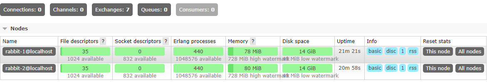

   > **注意**
   >
   > 在访问的时候：web 界面的管理需要给 15672 node-1 和 15673的node-2 设置用户名和密码。如下
   >
   > ```bash
   > rabbitmqctl -n rabbit-1 add_user admin admin
   > rabbitmqctl -n rabbit-1 set_user_tags admin administrator
   > rabbitmqctl -n rabbit-1 set_permissions -p / admin ".*" ".*" ".*"
   > rabbitmqctl -n rabbit-2 add_user admin admin
   > rabbitmqctl -n rabbit-2 set_user_tags admin administrator
   > rabbitmqctl -n rabbit-2 set_permissions -p / admin ".*" ".*" ".*"
   > ```
   >
   > SpringBoot 中用如下配置项：
   >
   > ```properties
   > spring.rabbitmq.addresses= 192.168.11.101:5672,192.168.11.102:5673
   > ```


**小结**

主从节点都运行时，不论主从节点都可以操作数据，但是**如果主节点下线，从节点则无法操作数据**。

如果采用多机部署方式，需读取其中一个节点的 cookie，并**复制**到其他节点（节点之间通过 cookie 确定相互是否可通信，该值需要保持一致）。cookie 存放在 /var/lib/rabbitmq/.erlang.cookie。

例如：主机名分别为 rabbit-1、rabbit-2

1. 逐个启动各节点

2. 配置各节点的 hosts 文件（vim /etc/hosts）

   ip1：rabbit-1

   ip2：rabbit-2

其它步骤雷同单机部署方式。

## 6.分布式事务

分布式事务指事务的操作位于不同的节点上，需要保证事务的 AICD 特性。例如在下单场景下，库存和订单如果不在同一个节点上，就涉及分布式事务。

### 6.1 分布式事务的方式

在分布式系统中，要实现分布式事务，无外乎那几种解决方案。

#### 1.两阶段提交（2PC）

需要数据库产商的支持，java 组件有 atomikos 等。

两阶段提交（Two-phase Commit，2PC），通过引入协调者（Coordinator）来协调参与者的行为，并最终决定这些参与者是否要真正执行事务。

**准备阶段**

协调者询问参与者事务是否执行成功，参与者发回事务执行结果。

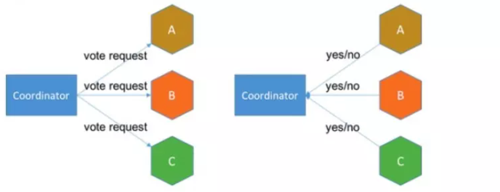

**提交阶段**

如果事务在每个参与者上都执行成功，事务协调者发送通知让参与者提交事务；否则，协调者发送通知让参与者回滚事务。

需要注意的是，在准备阶段，参与者执行了事务，但是还未提交。只有在提交阶段接收到协调者发来的通知后，才进行提交或者回滚。

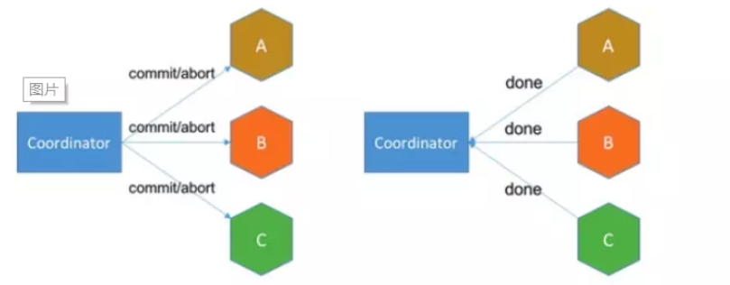

**存在的问题**

- 同步阻塞：所有事务参与者在等待其它参与者响应的时候都处于同步阻塞状态，无法进行其它操作
- 单点问题：协调者在 2PC 中起到非常大的作用，发生故障将会造成很大影响。特别是在阶段二发生故障，所有参与者会一直等待状态，无法完成其它操作
- 数据不一致：在阶段二，如果协调者只发送了部分 Commit 消息，此时网络发生异常，那么只有部分参与者接收到 Commit 消息，也就是说只有部分参与者提交了事务，使得系统数据不一致
- 太过保守：任意一个节点失败就会导致整个事务失败，没有完善的容错机制

#### 2.补偿事务（TCC）

TCC 其实就是采用的补偿机制，其核心思想是：针对每个操作，都要注册一个与其对应的确认和补偿（撤销）操作。它分为三个阶段：

- Try 阶段主要是对业务系统做检测及资源预留
- Confirm 阶段主要是对业务系统做确认提交，Try 阶段执行成功并开始执行 Confirm 阶段时，默认 - - - Confirm 阶段是不会出错的。即：只要 Try 成功，Confirm 一定成功
- Cancel 阶段主要是在业务执行错误，需要回滚的状态下执行的业务取消，预留资源释放

举个例子，假入 Bob 要向 Smith 转账，思路大概是：我们有一个本地方法，里面依次调用

1. 首先在 Try 阶段，要先调用远程接口把 Smith 和 Bob 的钱给冻结起来

2. 在 Confirm 阶段，执行远程调用的转账的操作，转账成功进行解冻

3. 如果第 2 步执行成功，那么转账成功，如果第二步执行失败，则调用远程冻结接口对应的解冻方法（Cancel）

优点： 跟 2PC 比起来，实现以及流程相对简单了一些，但数据的一致性比 2PC 也要差一些

缺点： 缺点还是比较明显的，在 2、3 步中都有可能失败。TCC 属于应用层的一种补偿方式，所以需要程序员在实现的时候多写很多补偿的代码，在一些场景中，一些业务流程可能用 TCC 不太好定义及处理

#### 3.本地消息表（异步确保）

比如：支付宝、微信支付主动查询支付状态，对账单的形式。本地消息表与业务数据表处于同一个数据库中，这样就能利用本地事务来保证在对这两个表的操作满足事务特性，并且使用了消息队列来保证最终一致性。

- 在分布式事务操作的一方完成写业务数据的操作之后向本地消息表发送一个消息，本地事务能保证这个消息一定会被写入本地消息表中
- 之后将本地消息表中的消息转发到 Kafka 等消息队列中，如果转发成功则将消息从本地消息表中删除，否则继续重新转发
- 在分布式事务操作的另一方从消息队列中读取一个消息，并执行消息中的操作

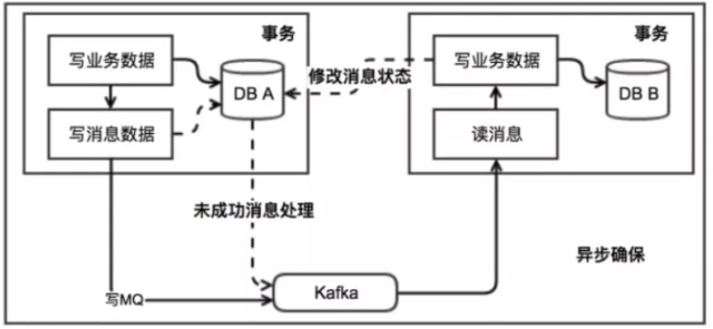

> 优点： 一种非常经典的实现，避免了分布式事务，实现了最终一致性。
>
> 缺点： 消息表会耦合到业务系统中，如果没有封装好的解决方案，会有很多杂活需要处理。

#### 4.MQ事务消息

异步场景，通用性较强，拓展性较高。有一些第三方的 MQ 是支持事务消息的，比如 RocketMQ，他们支持事务消息的方式也是类似于采用的二阶段提交，但是市面上一些主流的 MQ 都是不支持事务消息的，比如 Kafka 不支持。

以阿里的 RabbitMQ 中间件为例，其思路大致为：

- 第一阶段 Prepared 消息，会拿到消息的地址。 第二阶段执行本地事务，第三阶段通过第一阶段拿到的地址去访问消息，并修改状态
- 也就是说在业务方法内要向消息队列提交两次请求，一次发送消息和一次确认消息。如果确认消息发送失败了 RabbitMQ 会定期扫描消息集群中的事务消息，这时候发现了 Prepared 消息，它会向消息发送者确认，所以生产方需要实现一个 check 接口，RabbitMQ 会根据发送端设置的策略来决定是回滚还是继续发送确认消息。这样就保证了消息发送与本地事务同时成功或同时失败

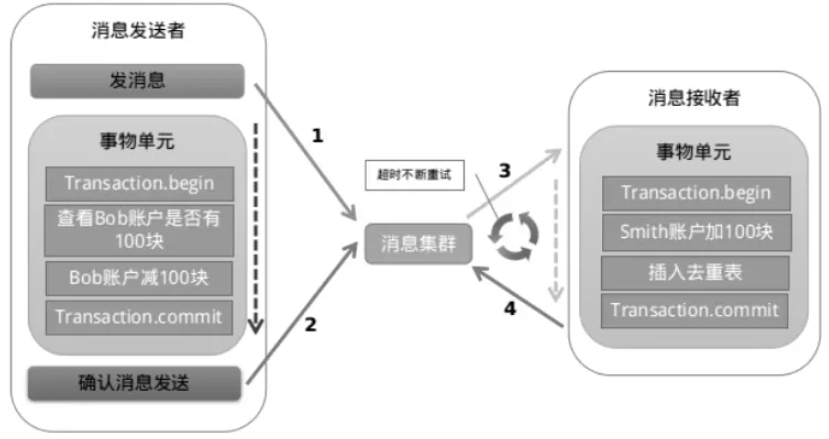

> 优点： 实现了最终一致性，不需要依赖本地数据库事务。
>
> 缺点： 实现难度大，主流 MQ 不支持，RocketMQ 事务消息部分代码也未开源。

**总结**

通过本文我们总结并对比了几种分布式分解方案的优缺点，分布式事务本身是一个技术难题，是没有一种完美的方案应对所有场景的，具体还是要根据业务场景去抉择吧。阿里 RocketMQ 去实现的分布式事务，现在也有除了很多分布式事务的协调器，比如LCN等，大家可以多去尝试。

### 6.2 具体实现

> **注意**
>
> 下面的案例只保证了生产者和消费者的**可靠生产**和**可靠消费**，并没有解决事务的回滚问题！

分布式事务的完整架构图

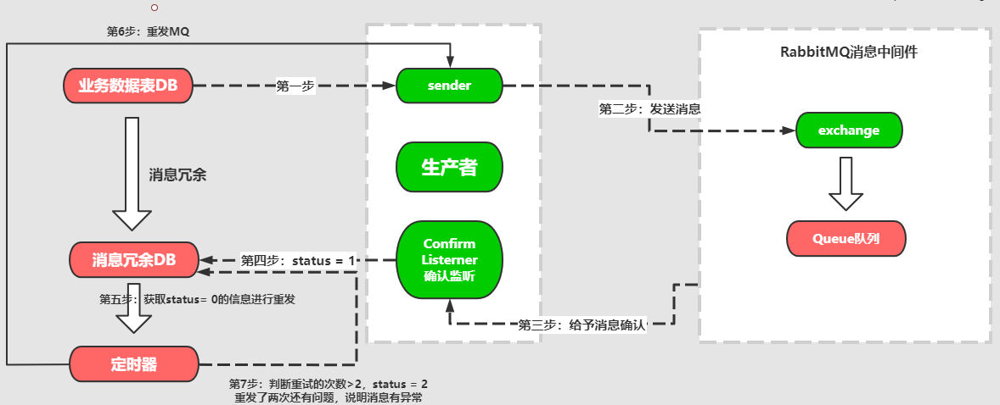

美团外卖架构：

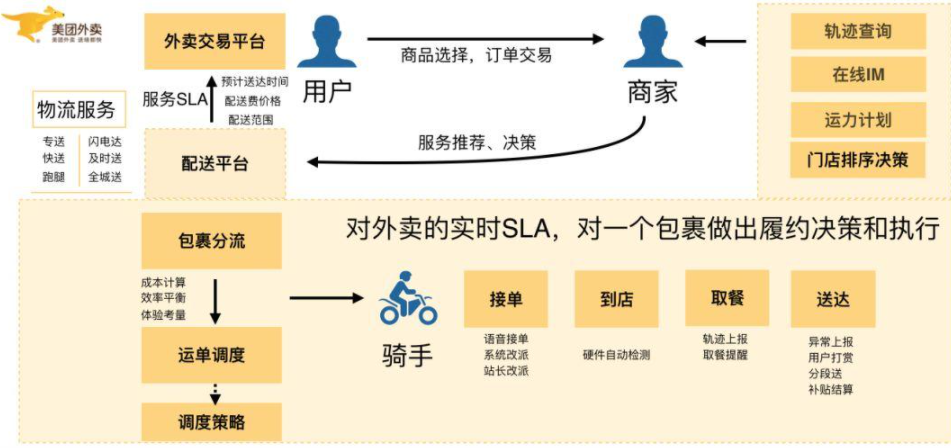

#### 1.分布式事务问题

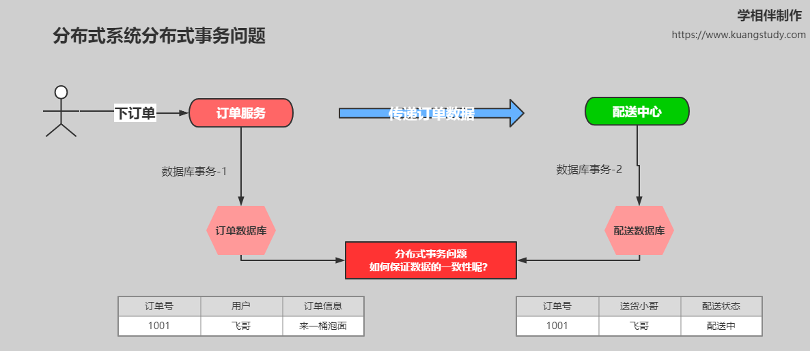

#### 2.事务生产者

```java
@Service
public class OrderService {
    @Autowired
    private OrderDataBaseService orderDataBaseService;
    
    @Autowired
    private OrderMQService orderMQService;
    
    // 创建订单
    public void createOrder(Order orderInfo) throws Exception {
        // 1: 订单信息--插入订单系统
        orderDataBaseService.saveOrder(orderInfo);
        // 2：发送 MQ 消息
        orderMQService.sendMessage(orderInfo);
    }
}
```

#### 3.整体设计思路

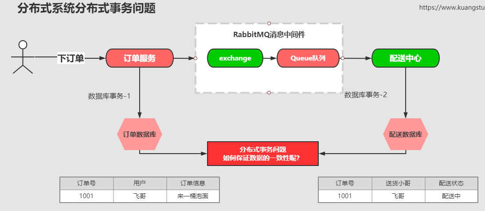

#### 4.可靠生产

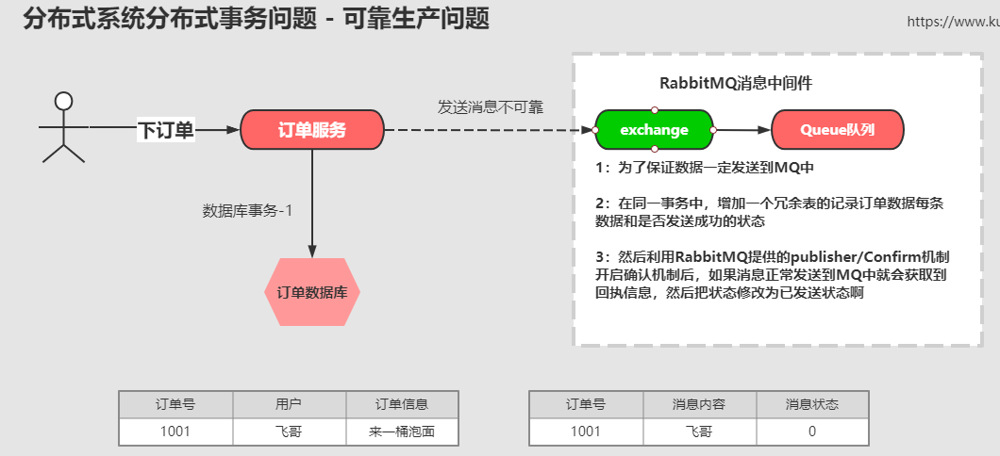

**代码实现**

```java
@Component
public class MQCallBack {
    @Autowired
    RabbitTemplate rabbitTemplate;

    @Autowired
    JdbcTemplate jdbcTemplate;

    // 修饰一个非静态的 void 方法，当构造方法执行后，init 方法执行前执行
    // 可以定义在配置类中
    @PostConstruct
    public void callBack(String orderId) {

        rabbitTemplate.setConfirmCallback(new RabbitTemplate.ConfirmCallback() {
            @Override
            public void confirm(CorrelationData correlationData, boolean ack, String cause) {
                if (!ack) {
                    System.out.println("MQ队列应答失败，orderID：" + correlationData.getId());
                }
                // 发送消息成功后修改冗余表的状态
                try {
                    String sql = "UPDATE ksd_order_message SET status = 1 where order_id = ?";
                    int count = jdbcTemplate.update(sql, orderId);
                    if (count == 1) {
                        System.out.println("消息状态修改成功");
                    }
                } catch (Exception e) {
                    System.out.println("消息状态修改失败");
                }
            }
        });
    }
}
```

如果这个时候 MQ 服务器出现了异常和故障，那么消息是无法获取到回执信息。怎么解决呢？

#### 5.可靠生产问题-定时重发

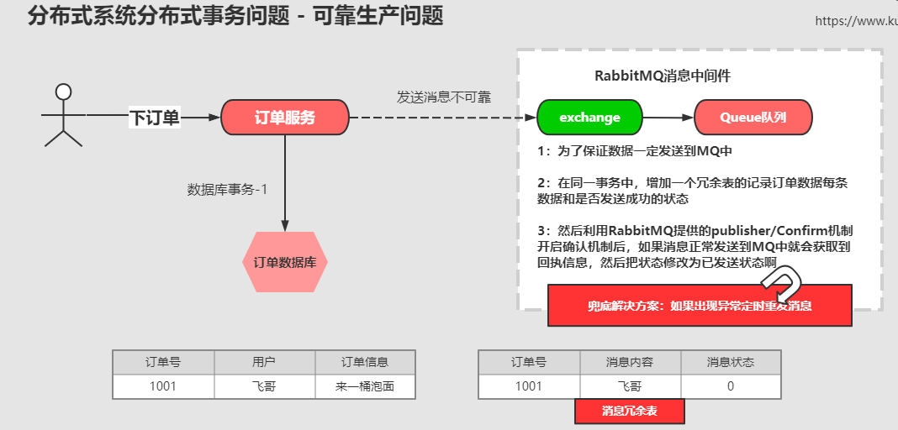

```java
@Component
class TaskService {
    @Scheduled(cron = "xxxxxx")
    public void sendMessage() {
        // 把消息为 0 的消息查询出来重新发送
    }
}
```

#### 6.可靠消费

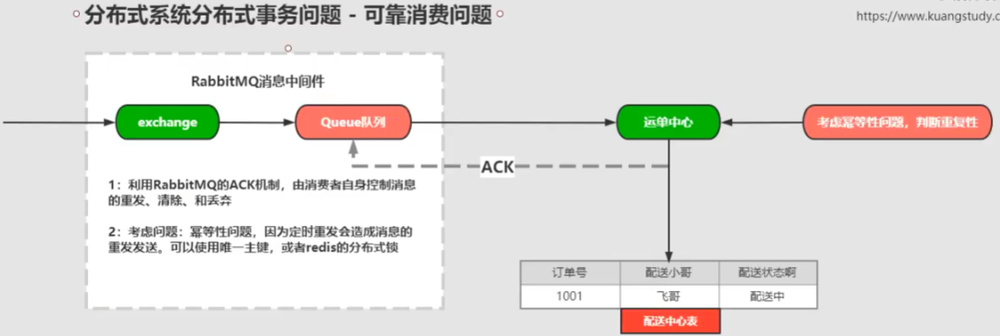

#### 7.控制MQ消息重发 

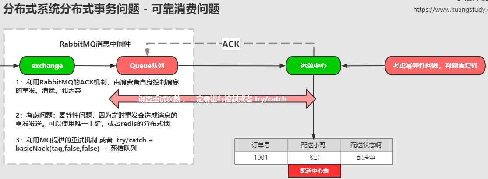

- 控制 MQ 重试

  ```properties
  ## MQ重试配置
  # 开启手动ack，让程序控制 MQ 的消息的重发、删除和转移
  spring.rabbitmq.listener.simple.acknowledge-mode=manual
  # 开启控制MQ重试
  spring.rabbitmq.listener.simple.retry.enabled=true
  # 最大重试次数，超过则会被移除（有死信队列时移到死信队列）
  spring.rabbitmq.listener.simple.retry.max-attempts=10
  # 重试间隔时间
  spring.rabbitmq.listener.simple.retry.initial-interval=2000ms
  ```

- try-catch（建议使用）

  ```java
  @Component
  public class OrderMqConsumer {
  
      @Autowired
      DispatchService dispatchService;
  
      private int count = 1;
  
      @RabbitListener(queues = {"order.queue"})
      public void messageConsuemr(String ordermsg, Channel channel, CorrelationData correlationData, @Header(AmqpHeaders.DELIVERY_TAG) long tag) throws IOException {
          try {
              System.out.println("收到的消息为：" + ordermsg + ", count = " + count++);
              // 获取 order 信息
              Order order = JsonUtil.string2Obj(ordermsg, Order.class);
              String orderId = order.getOrderId();
              // 派单处理
              // 考虑幂等性问题（订单ID唯一主键，redis分布式锁）
              dispatchService.dispatch(orderId);
              // 模拟异常
              int a = 1 / 0;
              // 手动ack
              channel.basicAck(tag, false);
          } catch (Exception e) {
              // 参数1：消息的 tag
              // 参数2：false 代表仅仅确认当前消息
              // 参数3：是否重发，false 则不会重发并把消息打入到死信队列；true 会触发重发，此时不用 try-catch 会死循环，即使配置了控制 MQ 重试次数
              channel.basicNack(tag, false, false);
          }
      }
  }
  ```

#### 8.死信队列消息转移 + 人工处理

新建一个监听服务监听死信队列进行消息处理。

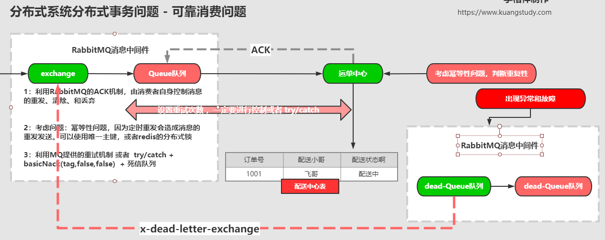

如果死信队列的监听服务报错就进行人工处理。

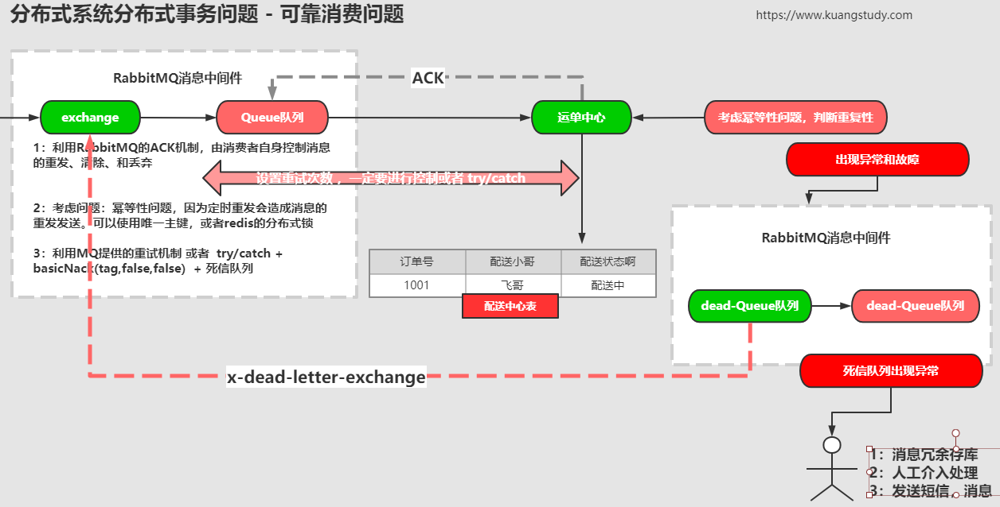

#### 9.死信队列消息重试注意事项

#### 10.消息的定式重发

### 6.3 总结

基于 MQ 的分布式事务解决方案优点：

1. 通用性强
2. 拓展方便
3. 耦合度低，方案也比较成熟

基于 MQ 的分布式事务解决方案缺点：

1. 基于消息中间件，只适合异步场景
2. 消息会延迟处理，需要业务上能够容忍

建议

1. 尽量去避免分布式事务
2. 尽量将非核心业务做成异步