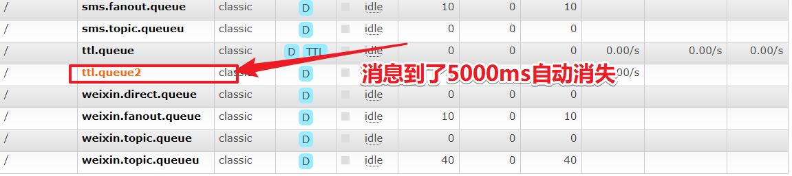

# 第7章_RabbitMQ高级

## 1.过期时间TTL

### 1.1 概述

过期时间 TTL 表示可以对消息设置预期的时间，在这个时间内都可以被消费者接收获取；过了之后消息将自动被删除。RabbitMQ 可以对消息和队列设置 TTL。目前有两种方法可以设置。

- 第一种方法是通过队列属性设置，队列中所有消息都有相同的过期时间
- 第二种方法是对消息进行单独设置，每条消息 TTL 可以不同

如果上述两种方法同时使用，则消息的过期时间以两者之间 TTL 较小的那个数值为准。消息在队列的生存时间一旦超过设置的 TTL 值，就称为`dead message`被投递到死信队列，消费者将无法再收到该消息。

#### 1. 设置队列TTL

- 配置类

  ```java
  @Configuration
  public class RabbitConf {
  
      @Bean
      public DirectExchange ttldirectExchange() {
          return new DirectExchange("direct", true, false);
      }
  
      @Bean
      public Queue directQueue() {
          Map<String, Object> args = new HashMap<>();
          // 设置 x-message-ttl 参数
          args.put("x-message-ttl", 5000);
          // queueName, durable, exclusive, autoDelete, arguments
          return new Queue("ttl.direct.queue", true, false, false, args);
      }
  
      @Bean
      public Binding bindQueue(DirectExchange directExchange, Queue directQueue) {
          return BindingBuilder.bind(directQueue).to(directExchange).with("ttl");
      }
  
  }
  ```

- 生产者

  ```java
  @Component
  public class OrderService {
      @Autowired
      RabbitTemplate rabbitTemplate;
  
      private String exchangeName = "direct";
      private String routingKey = "ttl";
  
      public void makeOrder(Long userId, Long productId, int num) {
          String orderNumber = UUID.randomUUID().toString();
          System.out.println("用户 " + userId + ",订单编号是：" + orderNumber);
          rabbitTemplate.convertAndSend(exchangeName, routingKey, orderNumber);
      }
  }
  ```

- 测试类

  ```java
  @Test
  void contextLoads() {
      Long userId = 100L;
      Long productId = 10001L;
      int num = 10;
      orderService.makeOrder(userId, productId, num);
  }
  ```


> 参数`x-message-ttl`的值必须是非负 32 位整数 (0 <= n <= 2^32-1) ，以毫秒为单位表示 TTL 的值。
>
> 例：6000 表示存在于队列中的当前消息将最多只存活 6 秒钟。

#### 2.设置消息TTL

消息的过期时间；只需要在发送消息（可以发送到任何队列，不管该队列是否属于某个交换机）的时候设置过期时间即可。在测试类中编写如下方法发送消息并设置过期时间到队列：

```java
package com.llp.rabbitmq.ttl;
import com.rabbitmq.client.AMQP;
import com.rabbitmq.client.Channel;
import com.rabbitmq.client.Connection;
import com.rabbitmq.client.ConnectionFactory;
import java.util.HashMap;
import java.util.Map;
/**
 * @author: llp
 * @description: Producer 简单队列生产者
 * @Date : 2021/3/2
 */
public class MessageTTLProducer {
    public static void main(String[] args) {
        // 1: 创建连接工厂
        ConnectionFactory connectionFactory = new ConnectionFactory();
        // 2: 设置连接属性
        connectionFactory.setHost("47.104.141.27");
        connectionFactory.setPort(5672);
        connectionFactory.setVirtualHost("/");
        connectionFactory.setUsername("admin");
        connectionFactory.setPassword("admin");
        Connection connection = null;
        Channel channel = null;
        try {
            // 3: 从连接工厂中获取连接
            connection = connectionFactory.newConnection("生产者");
            // 4: 从连接中获取通道channel
            channel = connection.createChannel();
            // 5: 申明队列queue存储消息
            /*
             *  如果队列不存在，则会创建
             *  Rabbitmq不允许创建两个相同的队列名称，否则会报错。
             *
             *  @params1： queue 队列的名称
             *  @params2： durable 队列是否持久化
             *  @params3： exclusive 是否排他，即是否私有的，如果为true,会对当前队列加锁，其他的通道不能访问，并且连接自动关闭
             *  @params4： autoDelete 是否自动删除，当最后一个消费者断开连接之后是否自动删除消息。
             *  @params5： arguments 可以设置队列附加参数，设置队列的有效期，消息的最大长度，队列的消息生命周期等等。
             * */
            channel.queueDeclare("ttl.queue2", true, false, false, null);
            // 6： 准备发送消息的内容
            String message = "你好，llp！！！";
            Map<String, Object> headers = new HashMap<String, Object>();
            headers.put("x", "1");
            headers.put("y", "1");
            AMQP.BasicProperties basicProperties = new AMQP.BasicProperties().builder()
                    .deliveryMode(2) // 传送方式
                    .priority(1)
                    .contentEncoding("UTF-8") // 编码方式
                    .expiration("5000") // 过期时间
                    .headers(headers).build(); //自定义属性
            // 7: 发送消息给中间件rabbitmq-server
            // @params1: 交换机exchange
            // @params2: 队列名称/routing
            // @params3: 属性配置
            // @params4: 发送消息的内容
            for (int i = 0; i <10 ; i++) {
                channel.basicPublish("", "ttl.queue2", basicProperties, message.getBytes());
                System.out.println("消息发送成功!");
            }
        } catch (Exception ex) {
            ex.printStackTrace();
            System.out.println("发送消息出现异常...");
        } finally {
            // 7: 释放连接关闭通道
            if (channel != null && channel.isOpen()) {
                try {
                    channel.close();
                } catch (Exception ex) {
                    ex.printStackTrace();
                }
            }
            if (connection != null && connection.isOpen()) {
                try {
                    connection.close();
                } catch (Exception ex) {
                    ex.printStackTrace();
                }
            }
        }
    }
}

```



> expiration 字段以微秒为单位表示 TTL 值。且与 x-message-ttl 具有相同的约束条件。因为 expiration 字段必须为字符串类型，broker 将只会接受以字符串形式表达的数字。
> 当同时指定了 queue 和 message 的 TTL 值，则两者中较小的那个才会起作用。

## 2.消息确认机制的配置

NONE值是禁用发布确认模式，是默认值
CORRELATED值是发布消息成功到交换器后会触发回调方法，如1示例
SIMPLE值经测试有两种效果，其一效果和CORRELATED值一样会触发回调方法，其二在发布消息成功后使用rabbitTemplate调用waitForConfirms或waitForConfirmsOrDie方法等待broker节点返回发送结果，根据返回结果来判定下一步的逻辑，要注意的点是waitForConfirmsOrDie方法如果返回false则会关闭channel，则接下来无法发送消息到broker;

1.修改yml/properties配置文件

```properties
# 服务端口
server:
  port: 8080
# 配置rabbitmq服务
spring:
  rabbitmq:
    username: admin
    password: admin
    virtual-host: /
    host: 47.104.141.27
    port: 5672
    publisher-confirm-type: correlated

```

### 2.新增回调处理类

```java
package com.llp.rabbitmq.springbootorderrabbitmqproducer.callback;
import org.springframework.amqp.rabbit.connection.CorrelationData;
import org.springframework.amqp.rabbit.core.RabbitTemplate;
import org.springframework.stereotype.Component;
/**
 * @description:
 * @author: llp
 * @time: 2021/3/5 23:25
 */
public class MessageConfirmCallback implements RabbitTemplate.ConfirmCallback {
    @Override
    public void confirm(CorrelationData correlationData, boolean ack, String cause) {
        if(ack){
            System.out.println("消息确认成功!!!!");
        }else{
            System.out.println("消息确认失败!!!!");
        }
    }
}

```

### 3.设置消息确认机制

```java
@Component
public class OrderService {


    // 模板方法模式
    @Autowired
    private RabbitTemplate rabbitTemplate;

    @Autowired
    private MessageConfirmCallback messageConfirmCallback;
    // 交换机
    private String exchangeName = "llp_direct_order_ex";


    /**
     * @return void
     * @Author xuke
     * @Description 下单方法
     * @Date 22:17 2021/3/4
     * @Param [userId, productId, num]
     **/
    public String makeorder(String userId, String productId, Integer num) {
        // 1: 根据用户查询用户是否存在
        // 2: 根据产品id查询产品信息
        String orderId = num+"";
        // 3: 保存订单
        // 4: 发送邮件，sms,短信
        System.out.println("用户：" + userId + ",购买了一个产品：" + productId + "保存订单是：" + orderId);
        // 发送消息
        // 设置消息确认机制
        rabbitTemplate.setConfirmCallback(messageConfirmCallback);
        rabbitTemplate.convertAndSend(exchangeName, "email", orderId);
        rabbitTemplate.convertAndSend(exchangeName, "duanxin", orderId);
        return "success";
    }

}

```


**注意每个RabbitTemplete对象对应一个ConfirmCallback对象**

```java
java.lang.IllegalStateException: Only one ConfirmCallback is supported by each RabbitTemplate
	at org.springframework.util.Assert.state(Assert.java:76) ~[spring-core-5.3.4.jar:5.3.4]
	at org.springframework.amqp.rabbit.core.RabbitTemplate.setConfirmCallback(RabbitTemplate.java:457) ~[spring-rabbit-2.3.5.jar:2.3.5]
```

**补充**

```java
@Scope("prototype")
spring中bean的scope属性，有如下5种类型：

singleton 表示在spring容器中的单例，通过spring容器获得该bean时总是返回唯一的实例
prototype表示每次获得bean都会生成一个新的对象
request表示在一次http请求内有效（只适用于web应用）
session表示在一个用户会话内有效（只适用于web应用）
globalSession表示在全局会话内有效（只适用于web应用）
在多数情况，我们只会使用singleton和prototype两种scope，如果在spring配置文件内未指定scope属性，默认为singleton。
```

### 1.3 死信队列

概述
DLX，全称为Dead-Letter-Exchange , 可以称之为死信交换机，也有人称之为死信邮箱。当消息在一个队列中变成死信(dead message)之后，它能被重新发送到另一个交换机中，这个交换机就是DLX ，绑定DLX的队列就称之为死信队列。
消息变成死信，可能是由于以下的原因：

消息被拒绝
消息过期
队列达到最大长度
DLX也是一个正常的交换机，和一般的交换机没有区别，它能在任何的队列上被指定，实际上就是设置某一个队列的属性。当这个队列中存在死信时，Rabbitmq就会自动地将这个消息重新发布到设置的DLX上去，进而被路由到另一个队列，即死信队列。
要想使用死信队列，只需要在定义队列的时候设置队列参数 x-dead-letter-exchange 指定交换机即可。


在rabbitMQ管理界面中结果

未过期：


过期后：


流程


消息过期的死信队列测试

### 1.3 持久化机制和内存磁盘的监控

01、RibbitMQ持久化

持久化就把信息写入到磁盘的过程。

02、RabbitMQ持久化消息


把消息默认放在内存中是为了加快传输和消费的速度，存入磁盘是保证消息数据的持久化。

03、RabbitMQ非持久化消息
非持久消息：是指当内存不够用的时候，会把消息和数据转移到磁盘，但是重启以后非持久化队列消息就丢失。

04、RabbitMQ持久化分类
RabbitMQ的持久化队列分为：
1：队列持久化
2：消息持久化
3：交换机持久化
不论是持久化的消息还是非持久化的消息都可以写入到磁盘中，只不过非持久的是等内存不足的情况下才会被写入到磁盘中。

05、RabbitMQ队列持久化的代码实现
队列的持久化是定义队列时的durable参数来实现的，Durable为true时，队列才会持久化。

```java
// 参数1：名字  
// 参数2：是否持久化，
// 参数3：独du占的queue， 
// 参数4：不使用时是否自动删除，
// 参数5：其他参数
channel.queueDeclare(queueName,true,false,false,null);

```

其中参数2：设置为true,就代表的是持久化的含义。即durable=true。持久化的队列在web控制台中有一个`D` 的标记


### 测试步骤

1：可以建立一个临时队列


2：然后重启rabbit-server服务，会发现持久化队列依然在，而非持久队列会丢失。

```bash
systecmctl restart rabbitmq-server
# 或者
docker restart myrabbit
```

## 06、RabbitMQ消息持久化

消息持久化是通过消息的属性deliveryMode来设置是否持久化，在发送消息时通过basicPublish的参数传入。

```java
// 参数1：交换机的名字
// 参数2：队列或者路由key
// 参数3：是否进行消息持久化
// 参数4：发送消息的内容
channel.basicPublish(exchangeName, routingKey1, MessageProperties.PERSISTENT_TEXT_PLAIN, message.getBytes());
```

07、RabbitMQ交换机持久化

和队列一样，交换机也需要在定义的时候设置持久化的标识，否则在rabbit-server服务重启以后将丢失。

```java
// 参数1：交换机的名字
// 参数2：交换机的类型，topic/direct/fanout/headers
// 参数3：是否持久化
channel.exchangeDeclare(exchangeName,exchangeType,true);
```

## 1.4 内存磁盘的监控

## RabbitMQ的内存警告

当内存使用超过配置的阈值或者磁盘空间剩余空间对于配置的阈值时，RabbitMQ会暂时阻塞客户端的连接，并且停止接收从客户端发来的消息，以此避免服务器的崩溃，客户端与服务端的心跳检测机制也会失效。
如下图：


当出现blocking或blocked话说明到达了阈值和以及高负荷运行了。

## 02、RabbitMQ的内存控制

参考帮助文档：https://www.rabbitmq.com/configure.html
当出现警告的时候，可以通过配置去修改和调整

### 02-1、命令的方式

```bash
rabbitmqctl set_vm_memory_high_watermark <fraction>
#绝对值方式设置阈值，超过50MB就会内存警告
rabbitmqctl set_vm_memory_high_watermark absolute 50MB

```

fraction/value 为内存阈值。默认情况是：0.4/2GB，代表的含义是：当RabbitMQ的内存超过40%时，就会产生警告并且阻塞所有生产者的连接。通过此命令修改阈值在Broker重启以后将会失效，通过修改配置文件方式设置的阈值则不会随着重启而消失，但修改了配置文件一样要重启broker才会生效。

分析：

rabbitmqctl set_vm_memory_high_watermark absolute 50MB


### 02-2、配置文件方式 rabbitmq.conf

> 当前配置文件：/etc/rabbitmq/rabbitmq.conf

```bash
#默认
#vm_memory_high_watermark.relative = 0.4
# 使用relative相对值进行设置fraction,建议取值在04~0.7之间，不建议超过0.7. 
#比如内存8G 相对值为0.4，则当咱用的内存超过3.2G时就会发出内存预警
vm_memory_high_watermark.relative = 0.6
# 使用absolute的绝对值的方式，但是是KB,MB,GB对应的命令如下
vm_memory_high_watermark.absolute = 2GB

```

03、RabbitMQ的内存换页
在某个Broker节点及内存阻塞生产者之前，它会尝试将队列中的消息换页到磁盘以释放内存空间，持久化和非持久化的消息都会写入磁盘中，其中持久化的消息本身就在磁盘中有一个副本，所以在转移的过程中持久化的消息会先从内存中清除掉。

默认情况下，内存到达的阈值是50%时就会换页处理。
也就是说，在默认情况下该内存的阈值是0.4的情况下，当内存超过0.4*0.5=0.2时，会进行换页动作。

比如有1000MB内存，当内存的使用率达到了400MB,已经达到了极限，但是因为配置的换页内存0.5，这个时候会在达到极限400mb之前，会把内存中的200MB进行转移到磁盘中。从而达到稳健的运行。

可以通过设置 vm_memory_high_watermark_paging_ratio 来进行调整
```bash
#相对内存设置
vm_memory_high_watermark.relative = 0.4 
#设置内存换页
vm_memory_high_watermark_paging_ratio = 0.7（设置小于1的值）

```

为什么设置小于1，以为你如果你设置为1的阈值。内存都已经达到了极限了。你在去换页意义不是很大了。

## 04、RabbitMQ的磁盘预警

当磁盘的剩余空间低于确定的阈值时，RabbitMQ同样会阻塞生产者，这样可以避免因非持久化的消息持续换页而耗尽磁盘空间导致服务器崩溃。

默认情况下：磁盘预警为50MB的时候会进行预警。表示当前磁盘空间第50MB的时候会阻塞生产者并且停止内存消息换页到磁盘的过程。
这个阈值可以减小，但是不能完全的消除因磁盘耗尽而导致崩溃的可能性。比如在两次磁盘空间的检查空隙内，第一次检查是：60MB ，第二检查可能就是1MB,就会出现警告。

通过命令方式修改如下：
```bash
#绝对值设置磁盘预警阈值
rabbitmqctl set_disk_free_limit  <disk_limit>
#相对值设置磁盘预警阈值，这里时相对于内存的
#比如磁盘空间80GB，内存2G，fraction=3.0则超过2G*3=6GB时就会发出磁盘预警
rabbitmqctl set_disk_free_limit memory_limit  <fraction>
disk_limit：固定单位 KB MB GB
fraction ：是相对阈值，建议范围在:1.0~2.0之间。（相对于内存）

```

通过配置文件配置如下：

```properties
disk_free_limit.relative = 3.0
disk_free_limit.absolute = 50mb
```

## 集群

RabbitMQ这款消息队列中间件产品本身是基于Erlang编写，Erlang语言天生具备分布式特性（通过同步Erlang集群各节点的magic cookie来实现）。因此，RabbitMQ天然支持Clustering。这使得RabbitMQ本身不需要像ActiveMQ、Kafka那样通过ZooKeeper分别来实现HA方案和保存集群的元数据。集群是保证可靠性的一种方式，同时可以通过水平扩展以达到增加消息吞吐量能力的目的。
在实际使用过程中多采取多机多实例部署方式，为了便于同学们练习搭建，有时候你不得不在一台机器上去搭建一个rabbitmq集群，本章主要针对单机多实例这种方式来进行开展。

主要参考官方文档：https://www.rabbitmq.com/clustering.html

02、集群搭建
配置的前提是你的rabbitmq可以运行起来，比如”ps aux|grep rabbitmq”你能看到相关进程，又比如运行“rabbitmqctl status”你可以看到类似如下信息，而不报错：

执行下面命令进行查看：
```bash
ps aux|grep rabbitmq
```

或者

```bash
systemctl status rabbitmq-server
```

> 注意：确保RabbitMQ可以运行的，确保完成之后，把单机版的RabbitMQ服务停止，后台看不到RabbitMQ的进程为止

03、单机多实例搭建
场景： 假设有两个rabbitmq节点，分别为rabbit-1, rabbit-2，rabbit-1作为主节点，rabbit-2作为从节点。
启动命令 ：RABBITMQ_NODE_PORT=5672 RABBITMQ_NODENAME=rabbit-1 rabbitmq-server -detached
结束命令 ：rabbitmqctl -n rabbit-1 stop

03-1、第一步 ：启动第一个节点rabbit-1
```bash
#执行命令
> sudo RABBITMQ_NODE_PORT=5672 RABBITMQ_NODENAME=rabbit-1 rabbitmq-server start &


...............省略...................
  ##########  Logs: /var/log/rabbitmq/rabbit-1.log
  ######  ##        /var/log/rabbitmq/rabbit-1-sasl.log
  ##########
              Starting broker...
 completed with 7 plugins.

```

至此节点rabbit-1启动完成。

03-2、启动第二个节点rabbit-2
注意：web管理插件端口占用,所以还要指定其web插件占用的端口号
RABBITMQ_SERVER_START_ARGS=”-rabbitmq_management listener [{port,15673}]”

```bash
sudo RABBITMQ_NODE_PORT=5673 RABBITMQ_SERVER_START_ARGS="-rabbitmq_management listener [{port,15673}]" RABBITMQ_NODENAME=rabbit-2 rabbitmq-server start &


..............省略..................
  ##########  Logs: /var/log/rabbitmq/rabbit-2.log
  ######  ##        /var/log/rabbitmq/rabbit-2-sasl.log
  ##########
              Starting broker...
 completed with 7 plugins.

```

至此节点rabbit-2启动完成

### 03-3、验证启动 “ps aux|grep rabbitmq”

```bash
rabbitmq  2022  2.7  0.4 5349380 77020 ?       Sl   11:03   0:06 /usr/lib/erlang/erts-9.2/bin/beam.smp -W w -A 128 -P 1048576 -t 5000000 -stbt db -zdbbl 128000 -K true -B i -- -root /usr/lib/erlang -progname erl -- -home /var/lib/rabbitmq -- -pa /usr/lib/rabbitmq/lib/rabbitmq_server-3.6.15/ebin -noshell -noinput -s rabbit boot -sname rabbit-1 -boot start_sasl -kernel inet_default_connect_options [{nodelay,true}] -rabbit tcp_listeners [{"auto",5672}] -sasl errlog_type error -sasl sasl_error_logger false -rabbit error_logger {file,"/var/log/rabbitmq/rabbit-1.log"} -rabbit sasl_error_logger {file,"/var/log/rabbitmq/rabbit-1-sasl.log"} -rabbit enabled_plugins_file "/etc/rabbitmq/enabled_plugins" -rabbit plugins_dir "/usr/lib/rabbitmq/plugins:/usr/lib/rabbitmq/lib/rabbitmq_server-3.6.15/plugins" -rabbit plugins_expand_dir "/var/lib/rabbitmq/mnesia/rabbit-1-plugins-expand" -os_mon start_cpu_sup false -os_mon start_disksup false -os_mon start_memsup false -mnesia dir "/var/lib/rabbitmq/mnesia/rabbit-1" -kernel inet_dist_listen_min 25672 -kernel inet_dist_listen_max 25672 start
rabbitmq  2402  4.2  0.4 5352196 77196 ?       Sl   11:05   0:05 /usr/lib/erlang/erts-9.2/bin/beam.smp -W w -A 128 -P 1048576 -t 5000000 -stbt db -zdbbl 128000 -K true -B i -- -root /usr/lib/erlang -progname erl -- -home /var/lib/rabbitmq -- -pa /usr/lib/rabbitmq/lib/rabbitmq_server-3.6.15/ebin -noshell -noinput -s rabbit boot -sname rabbit-2 -boot start_sasl -kernel inet_default_connect_options [{nodelay,true}] -rabbit tcp_listeners [{"auto",5673}] -sasl errlog_type error -sasl sasl_error_logger false -rabbit error_logger {file,"/var/log/rabbitmq/rabbit-2.log"} -rabbit sasl_error_logger {file,"/var/log/rabbitmq/rabbit-2-sasl.log"} -rabbit enabled_plugins_file "/etc/rabbitmq/enabled_plugins" -rabbit plugins_dir "/usr/lib/rabbitmq/plugins:/usr/lib/rabbitmq/lib/rabbitmq_server-3.6.15/plugins" -rabbit plugins_expand_dir "/var/lib/rabbitmq/mnesia/rabbit-2-plugins-expand" -os_mon start_cpu_sup false -os_mon start_disksup false -os_mon start_memsup false -mnesia dir "/var/lib/rabbitmq/mnesia/rabbit-2" -rabbitmq_management listener [{port,15673}] -kernel inet_dist_listen_min 25673 -kernel inet_dist_listen_max 25673 start
```

### 03-4、rabbit-1操作作为主节点

```bash
#停止应用
> sudo rabbitmqctl -n rabbit-1 stop_app
#目的是清除节点上的历史数据（如果不清除，无法将节点加入到集群）
> sudo rabbitmqctl -n rabbit-1 reset
#启动应用
> sudo rabbitmqctl -n rabbit-1 start_app

```

### 03-5、rabbit2操作为从节点

```bash
> sudo rabbitmqctl cluster_status -n rabbit-1

//集群有两个节点：rabbit-1@Server-node、rabbit-2@Server-node
[{nodes,[{disc,['rabbit-1@Server-node','rabbit-2@Server-node']}]},
 {running_nodes,['rabbit-2@Server-node','rabbit-1@Server-node']},
 {cluster_name,<<"rabbit-1@Server-node.localdomain">>},
 {partitions,[]},
 {alarms,[{'rabbit-2@Server-node',[]},{'rabbit-1@Server-node',[]}]}]

```

### 03-6、验证集群状态

```bash
> sudo rabbitmqctl cluster_status -n rabbit-1

//集群有两个节点：rabbit-1@Server-node、rabbit-2@Server-node
[{nodes,[{disc,['rabbit-1@Server-node','rabbit-2@Server-node']}]},
 {running_nodes,['rabbit-2@Server-node','rabbit-1@Server-node']},
 {cluster_name,<<"rabbit-1@Server-node.localdomain">>},
 {partitions,[]},
 {alarms,[{'rabbit-2@Server-node',[]},{'rabbit-1@Server-node',[]}]}]

```

### 03-7、Web监控


> 注意在访问的时候：web结面的管理需要给15672 node-1 和15673的node-2 设置用户名和密码。如下:

```bash
rabbitmqctl -n rabbit-1 add_user admin admin
rabbitmqctl -n rabbit-1 set_user_tags admin administrator
rabbitmqctl -n rabbit-1 set_permissions -p / admin ".*" ".*" ".*"
rabbitmqctl -n rabbit-2 add_user admin admin
rabbitmqctl -n rabbit-2 set_user_tags admin administrator
rabbitmqctl -n rabbit-2 set_permissions -p / admin ".*" ".*" ".*"

```

03-8、小结
Tips：
如果采用多机部署方式，需读取其中一个节点的cookie, 并复制到其他节点（节点之间通过cookie确定相互是否可通信）。cookie存放在/var/lib/rabbitmq/.erlang.cookie。
例如：主机名分别为rabbit-1、rabbit-2
1、逐个启动各节点
2、配置各节点的hosts文件( vim /etc/hosts)
ip1：rabbit-1
ip2：rabbit-2
其它步骤雷同单机部署方式

## 分布式事务

简述
分布式事务指事务的操作位于不同的节点上，需要保证事务的 AICD 特性。
例如在下单场景下，库存和订单如果不在同一个节点上，就涉及分布式事务。

01、分布式事务的方式
在分布式系统中，要实现分布式事务，无外乎那几种解决方案。

一、两阶段提交（2PC）需要数据库产商的支持，java组件有atomikos等。
两阶段提交（Two-phase Commit，2PC），通过引入协调者（Coordinator）来协调参与者的行为，并最终决定这些参与者是否要真正执行事务。

准备阶段
协调者询问参与者事务是否执行成功，参与者发回事务执行结果。


1.2 提交阶段
如果事务在每个参与者上都执行成功，事务协调者发送通知让参与者提交事务；否则，协调者发送通知让参与者回滚事务。
需要注意的是，在准备阶段，参与者执行了事务，但是还未提交。只有在提交阶段接收到协调者发来的通知后，才进行提交或者回滚。


存在的问题
2.1 同步阻塞 所有事务参与者在等待其它参与者响应的时候都处于同步阻塞状态，无法进行其它操作。
2.2 单点问题 协调者在 2PC 中起到非常大的作用，发生故障将会造成很大影响。特别是在阶段二发生故障，所有参与者会一直等待状态，无法完成其它操作。
2.3 数据不一致 在阶段二，如果协调者只发送了部分 Commit 消息，此时网络发生异常，那么只有部分参与者接收到 Commit 消息，也就是说只有部分参与者提交了事务，使得系统数据不一致。
2.4 太过保守 任意一个节点失败就会导致整个事务失败，没有完善的容错机制。
二、补偿事务（TCC） 严选，阿里，蚂蚁金服。
TCC 其实就是采用的补偿机制，其核心思想是：针对每个操作，都要注册一个与其对应的确认和补偿（撤销）操作。它分为三个阶段：

Try 阶段主要是对业务系统做检测及资源预留
Confirm 阶段主要是对业务系统做确认提交，Try阶段执行成功并开始执行 Confirm阶段时，默认 - - - Confirm阶段是不会出错的。即：只要Try成功，Confirm一定成功。
Cancel 阶段主要是在业务执行错误，需要回滚的状态下执行的业务取消，预留资源释放。
举个例子，假入 Bob 要向 Smith 转账，思路大概是： 我们有一个本地方法，里面依次调用
1：首先在 Try 阶段，要先调用远程接口把 Smith 和 Bob 的钱给冻结起来。
2：在 Confirm 阶段，执行远程调用的转账的操作，转账成功进行解冻。
3：如果第2步执行成功，那么转账成功，如果第二步执行失败，则调用远程冻结接口对应的解冻方法 (Cancel)。

优点： 跟2PC比起来，实现以及流程相对简单了一些，但数据的一致性比2PC也要差一些
缺点： 缺点还是比较明显的，在2,3步中都有可能失败。TCC属于应用层的一种补偿方式，所以需要程序员在实现的时候多写很多补偿的代码，在一些场景中，一些业务流程可能用TCC不太好定义及处理。

三、本地消息表（异步确保）比如：支付宝、微信支付主动查询支付状态，对账单的形式
本地消息表与业务数据表处于同一个数据库中，这样就能利用本地事务来保证在对这两个表的操作满足事务特性，并且使用了消息队列来保证最终一致性。

在分布式事务操作的一方完成写业务数据的操作之后向本地消息表发送一个消息，本地事务能保证这个消息一定会被写入本地消息表中。
之后将本地消息表中的消息转发到 Kafka 等消息队列中，如果转发成功则将消息从本地消息表中删除，否则继续重新转发。
在分布式事务操作的另一方从消息队列中读取一个消息，并执行消息中的操作。


优点： 一种非常经典的实现，避免了分布式事务，实现了最终一致性。
缺点： 消息表会耦合到业务系统中，如果没有封装好的解决方案，会有很多杂活需要处理。

四、MQ 事务消息 异步场景，通用性较强，拓展性较高。
有一些第三方的MQ是支持事务消息的，比如RocketMQ，他们支持事务消息的方式也是类似于采用的二阶段提交，但是市面上一些主流的MQ都是不支持事务消息的，比如 Kafka 不支持。
以阿里的 RabbitMQ 中间件为例，其思路大致为：

第一阶段Prepared消息，会拿到消息的地址。 第二阶段执行本地事务，第三阶段通过第一阶段拿到的地址去访问消息，并修改状态。
也就是说在业务方法内要想消息队列提交两次请求，一次发送消息和一次确认消息。如果确认消息发送失败了RabbitMQ会定期扫描消息集群中的事务消息，这时候发现了Prepared消息，它会向消息发送者确认，所以生产方需要实现一个check接口，RabbitMQ会根据发送端设置的策略来决定是回滚还是继续发送确认消息。这样就保证了消息发送与本地事务同时成功或同时失败。


优点： 实现了最终一致性，不需要依赖本地数据库事务。
缺点： 实现难度大，主流MQ不支持，RocketMQ事务消息部分代码也未开源。

五、总结
通过本文我们总结并对比了几种分布式分解方案的优缺点，分布式事务本身是一个技术难题，是没有一种完美的方案应对所有场景的，具体还是要根据业务场景去抉择吧。阿里RocketMQ去实现的分布式事务，现在也有除了很多分布式事务的协调器，比如LCN等，大家可以多去尝试。

02、具体实现
分布式事务的完整架构图

[外链图片转存失败,源站可能有防盗链机制,建议将图片保存下来直接上传(img-wrHVxQzm-1645174954690)(https://b3logfile.com/file/2021/11/solo-fetchupload-2697059577111817967-6b86ded2.png)]

美团外卖架构：


### 2-01、系统与系统之间的分布式事务问题


### 2-02、系统间调用过程中事务回滚问题

```java
package com.llp.rabbitmq.service;
import com.llp.rabbitmq.dao.OrderDataBaseService;
import com.llp.rabbitmq.pojo.Order;
import org.springframework.beans.factory.annotation.Autowired;
import org.springframework.http.client.SimpleClientHttpRequestFactory;
import org.springframework.stereotype.Service;
import org.springframework.transaction.annotation.Transactional;
import org.springframework.web.client.RestTemplate;
@Service
public class OrderService {
    @Autowired
    private OrderDataBaseService orderDataBaseService;
    // 创建订单
    @Transactional(rollbackFor = Exception.class) // 订单创建整个方法添加事务
    public void createOrder(Order orderInfo) throws Exception {
        // 1: 订单信息--插入丁订单系统，订单数据库事务
        orderDataBaseService.saveOrder(orderInfo);
        // 2：通過Http接口发送订单信息到运单系统
        String result = dispatchHttpApi(orderInfo.getOrderId());
        if(!"success".equals(result)) {
            throw new Exception("订单创建失败,原因是运单接口调用失败!");
        }
    }
    /**
     *  模拟http请求接口发送，运单系统，将订单号传过去 springcloud
     * @return
     */
    private String dispatchHttpApi(String orderId) {
        SimpleClientHttpRequestFactory factory  = new SimpleClientHttpRequestFactory();
        // 链接超时 > 3秒
        factory.setConnectTimeout(3000);
        // 处理超时 > 2秒
        factory.setReadTimeout(2000);
        // 发送http请求
        String url = "http://localhost:9000/dispatch/order?orderId="+orderId;
        RestTemplate restTemplate = new RestTemplate(factory);//异常
        String result = restTemplate.getForObject(url, String.class);
        return result;
    }
}

```

### 2-03、基于MQ的分布式事务整体设计思路


### 2-04、基于MQ的分布式事务消息的可靠生产问题


如果这个时候MQ服务器出现了异常和故障，那么消息是无法获取到回执信息。怎么解决呢？r

#### 2-04-01、基于MQ的分布式事务消息的可靠生产问题-定时重发


### 2-06、基于MQ的分布式事务消息的可靠消费

### 2-07、基于MQ的分布式事务消息的消息重发


### 2-08、基于MQ的分布式事务消息的死信队列消息转移 + 人工处理


如果死信队列报错就进行人工处理


2-09、基于MQ的分布式事务消息的死信队列消息重试注意事项
2-10、基于MQ的分布式事务消息的定式重发
03、总结
基于MQ的分布式事务解决方案优点：
1、通用性强
2、拓展方便
3、耦合度低，方案也比较成熟

基于MQ的分布式事务解决方案缺点：
1、基于消息中间件，只适合异步场景
2、消息会延迟处理，需要业务上能够容忍

建议
1、尽量去避免分布式事务
2、尽量将非核心业务做成异步