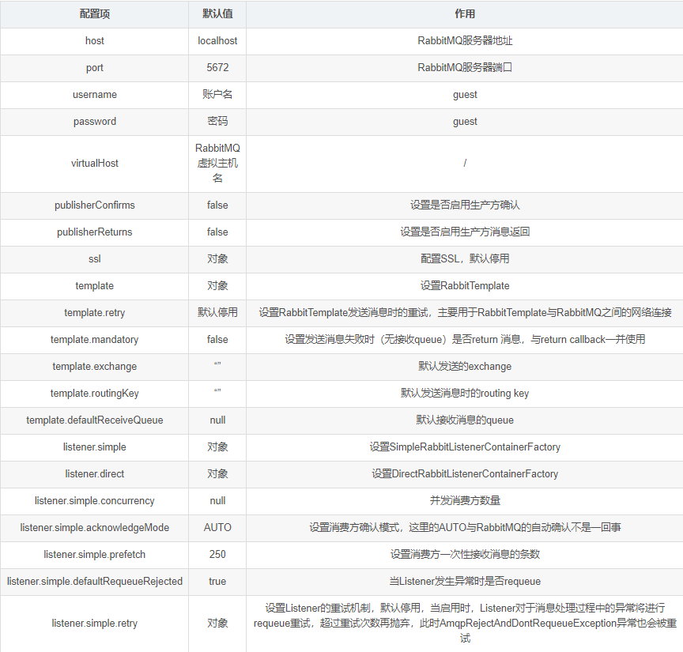
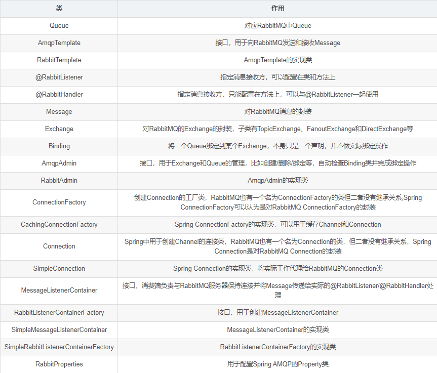
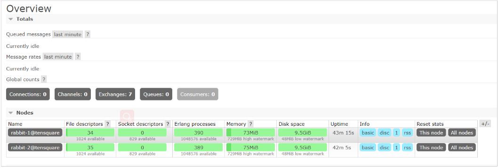
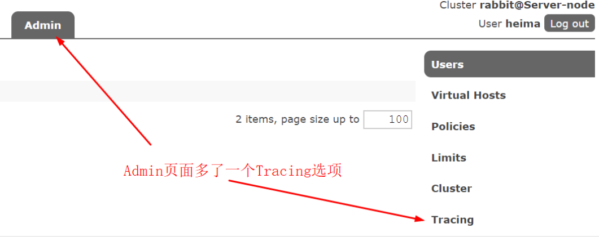
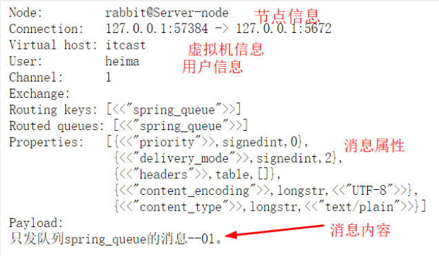
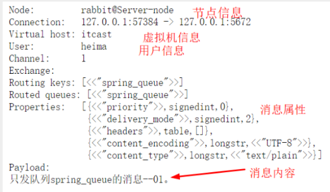

# 第8章_Springboot整合rabbitmq集群

springboot整合rabbitmq
集群创建方式这里省略
整合开始
1 引入starter

```xml
<parent>
    <groupId>org.springframework.boot</groupId>
    <artifactId>spring-boot-starter-parent</artifactId>
    <version>2.2.6.RELEASE</version>
    <relativePath/> <!-- lookup parent from repository -->
</parent>
<dependency>
    <groupId>org.springframework.boot</groupId>
    <artifactId>spring-boot-starter-amqp</artifactId>
</dependency>

```

2：详细配置如下

```yaml
 rabbitmq:
    addresses: 127.0.0.1:6605,127.0.0.1:6606,127.0.0.1:6705 #指定client连接到的server的地址，多个以逗号分隔(优先取addresses，然后再取host)
#    port:
    ##集群配置 addresses之间用逗号隔开
    # addresses: ip:port,ip:port
    password: admin
    username: 123456
    virtual-host: / # 连接到rabbitMQ的vhost
    requested-heartbeat: #指定心跳超时，单位秒，0为不指定；默认60s
    publisher-confirms: #是否启用 发布确认
    publisher-reurns: # 是否启用发布返回
    connection-timeout: #连接超时，单位毫秒，0表示无穷大，不超时
    cache:
      channel.size: # 缓存中保持的channel数量
      channel.checkout-timeout: # 当缓存数量被设置时，从缓存中获取一个channel的超时时间，单位毫秒；如果为0，则总是创建一个新channel
      connection.size: # 缓存的连接数，只有是CONNECTION模式时生效
      connection.mode: # 连接工厂缓存模式：CHANNEL 和 CONNECTION
    listener:
      simple.auto-startup: # 是否启动时自动启动容器
      simple.acknowledge-mode: # 表示消息确认方式，其有三种配置方式，分别是none、manual和auto；默认auto
      simple.concurrency: # 最小的消费者数量
      simple.max-concurrency: # 最大的消费者数量
      simple.prefetch: # 指定一个请求能处理多少个消息，如果有事务的话，必须大于等于transaction数量.
      simple.transaction-size: # 指定一个事务处理的消息数量，最好是小于等于prefetch的数量.
      simple.default-requeue-rejected: # 决定被拒绝的消息是否重新入队；默认是true（与参数acknowledge-mode有关系）
      simple.idle-event-interval: # 多少长时间发布空闲容器时间，单位毫秒
      simple.retry.enabled: # 监听重试是否可用
      simple.retry.max-attempts: # 最大重试次数
      simple.retry.initial-interval: # 第一次和第二次尝试发布或传递消息之间的间隔
      simple.retry.multiplier: # 应用于上一重试间隔的乘数
      simple.retry.max-interval: # 最大重试时间间隔
      simple.retry.stateless: # 重试是有状态or无状态
    template:
      mandatory: # 启用强制信息；默认false
      receive-timeout: # receive() 操作的超时时间
      reply-timeout: # sendAndReceive() 操作的超时时间
      retry.enabled: # 发送重试是否可用
      retry.max-attempts: # 最大重试次数
      retry.initial-interval: # 第一次和第二次尝试发布或传递消息之间的间隔
      retry.multiplier: # 应用于上一重试间隔的乘数
      retry.max-interval: #最大重试时间间隔
```

对于发送方而言，需要做以下配置：
1 配置CachingConnectionFactory
2 配置Exchange/Queue/Binding
3 配置RabbitAdmin创建上一步的Exchange/Queue/Binding
4 配置RabbitTemplate用于发送消息，RabbitTemplate通过CachingConnectionFactory获取到Connection，然后想指定Exchange发送
对于消费方而言，需要做以下配置：
1 配置CachingConnectionFactory
2 配置Exchange/Queue/Binding
3 配置RabbitAdmin创建上一步的Exchange/Queue/Binding
4 配置RabbitListenerContainerFactory
5 配置@RabbitListener/@RabbitHandler用于接收消息
在默认情况下主要的配置如下：



3 Spring AMQP的主要对象



4 使用：
通过配置类加载的方式：

```java
package com.yd.demo.config;
import org.slf4j.Logger;
import org.slf4j.LoggerFactory;
import org.springframework.amqp.core.AcknowledgeMode;
import org.springframework.amqp.core.Binding;
import org.springframework.amqp.core.BindingBuilder;
import org.springframework.amqp.core.DirectExchange;
import org.springframework.amqp.core.Queue;
import org.springframework.amqp.core.TopicExchange;
import org.springframework.amqp.rabbit.config.SimpleRabbitListenerContainerFactory;
import org.springframework.amqp.rabbit.connection.CachingConnectionFactory;
import org.springframework.amqp.rabbit.connection.ConnectionFactory;
import org.springframework.amqp.rabbit.core.RabbitAdmin;
import org.springframework.amqp.rabbit.core.RabbitTemplate;
import org.springframework.amqp.rabbit.listener.RabbitListenerContainerFactory;
import org.springframework.amqp.support.converter.Jackson2JsonMessageConverter;
import org.springframework.beans.factory.annotation.Autowired;
import org.springframework.beans.factory.annotation.Value;
import org.springframework.context.annotation.Bean;
import org.springframework.context.annotation.Configuration;
import java.util.HashMap;
import java.util.Map;
@Configuration
public class RabbitConfig {
    private static final Logger logger = LoggerFactory.getLogger(RabbitConfig.class);
    public static final String RECEIVEDLXEXCHANGE="spring-ex";
    public static final String RECEIVEDLXQUEUE="spring-qu1";
    public static final String RECEIVEDLXROUTINGKEY="aa";
    public static final String DIRECTEXCHANGE="spring-ex";
    public static final String MDMQUEUE="mdmQueue";
    public static final String TOPICEXCHANGE="spring-top";
    @Value("${spring.rabbitmq.addresses}")
    private String hosts;
    @Value("${spring.rabbitmq.username}")
    private String userName;
    @Value("${spring.rabbitmq.password}")
    private String password;
    @Value("${spring.rabbitmq.virtual-host}")
    private String virtualHost;
 /*   @Value("${rabbit.channelCacheSize}")
    private int channelCacheSize;*/
//    @Value("${rabbit.port}")
//    private int port;
/*    @Autowired
    private ConfirmCallBackListener confirmCallBackListener;
    @Autowired
    private ReturnCallBackListener returnCallBackListener;*/
    @Bean
    public ConnectionFactory connectionFactory(){
        CachingConnectionFactory cachingConnectionFactory = new CachingConnectionFactory();
        cachingConnectionFactory.setAddresses(hosts);
        cachingConnectionFactory.setUsername(userName);
        cachingConnectionFactory.setPassword(password);
//        cachingConnectionFactory.setChannelCacheSize(channelCacheSize);
        //cachingConnectionFactory.setPort(port);
        cachingConnectionFactory.setVirtualHost(virtualHost);
        //设置连接工厂缓存模式：
        cachingConnectionFactory.setCacheMode(CachingConnectionFactory.CacheMode.CONNECTION);
        //缓存连接数
        cachingConnectionFactory.setConnectionCacheSize(3);
        //设置连接限制
        cachingConnectionFactory.setConnectionLimit(6);
        logger.info("连接工厂设置完成，连接地址{}"+hosts);
        logger.info("连接工厂设置完成，连接用户{}"+userName);
        return cachingConnectionFactory;
    }
    @Bean
    public RabbitAdmin rabbitAdmin(){
        RabbitAdmin rabbitAdmin = new RabbitAdmin(connectionFactory());
        rabbitAdmin.setAutoStartup(true);
        rabbitAdmin.setIgnoreDeclarationExceptions(true);
        rabbitAdmin.declareBinding(bindingMdmQueue());
        //声明topic交换器
        rabbitAdmin.declareExchange(directExchange());
        logger.info("管理员设置完成");
        return rabbitAdmin;
    }
    @Bean
    public RabbitListenerContainerFactory listenerContainerFactory() {
        SimpleRabbitListenerContainerFactory factory = new SimpleRabbitListenerContainerFactory();
        factory.setConnectionFactory(connectionFactory());
        factory.setMessageConverter(new Jackson2JsonMessageConverter());
        //最小消费者数量
        factory.setConcurrentConsumers(10);
        //最大消费者数量
        factory.setMaxConcurrentConsumers(10);
        //一个请求最大处理的消息数量
        factory.setPrefetchCount(10);
        //
        factory.setChannelTransacted(true);
        //默认不排队
        factory.setDefaultRequeueRejected(true);
        //手动确认接收到了消息
        factory.setAcknowledgeMode(AcknowledgeMode.MANUAL);
        logger.info("监听者设置完成");
        return factory;
    }
    @Bean
    public DirectExchange directExchange(){
        return new DirectExchange(DIRECTEXCHANGE,true,false);
    }
    @Bean
    public Queue mdmQueue(){
        Map arguments = new HashMap<>();
        // 绑定该队列到私信交换机
        arguments.put("x-dead-letter-exchange",RECEIVEDLXEXCHANGE);
        arguments.put("x-dead-letter-routing-key",RECEIVEDLXROUTINGKEY);
        logger.info("队列交换机绑定完成");
        return new Queue(RECEIVEDLXQUEUE,true,false,false,arguments);
    }
    @Bean
    Binding bindingMdmQueue() {
        return BindingBuilder.bind(mdmQueue()).to(directExchange()).with("");
    }
    @Bean
    public RabbitTemplate rabbitTemplate(){
        RabbitTemplate rabbitTemplate = new RabbitTemplate(connectionFactory());
        rabbitTemplate.setMandatory(true);
        //发布确认
//        rabbitTemplate.setConfirmCallback(confirmCallBackListener);
        // 启用发布返回
//        rabbitTemplate.setReturnCallback(returnCallBackListener);
        logger.info("连接模板设置完成");
        return rabbitTemplate;
    }
  /*  @Bean
    public TopicExchange topicExchange(){
        return new TopicExchange(TOPICEXCHANGE,true,false);
    }*/
  /*
*//**
     * @return DirectExchange
     *//*
    @Bean
    public DirectExchange dlxExchange() {
        return new DirectExchange(RECEIVEDLXEXCHANGE,true,false);
    }
*//*
*
     * @return Queue
*//*
    @Bean
    public Queue dlxQueue() {
        return new Queue(RECEIVEDLXQUEUE,true);
    }
*//*
     * @return Binding
     *//*
    @Bean
    public Binding binding() {
        return BindingBuilder.bind(dlxQueue()).to(dlxExchange()).with(RECEIVEDLXROUTINGKEY);
    }*/
}
```

通过两种方式加载
1 通过配置文件
2 通过配置类
说明：上面是通过配置文件与配置类的方式去加载,常用的配置如上所示。实际使用中要生产方与消费方要分开配置，相关配置也会有小变动，大体配置不变。更多信息可查看官网配置。

三十二、RabbitMQ-集群监控
集群监控
在广大的互联网行业中RabbitMQ几乎都会有集群,那么对于集群的监控就成了企业生态中必不可少的一环。接下来我们来将讲解主要的4种监控。

1、管理界面监控
管理界面监控需要我们开启对应的插件(rabbitmq-plugins enable rabbitmq_management)
然后访问http://ip:15672



在管理控制台我们就可以直观的看到集群中的每一个节点是否正常,如果为红色则表示节点挂掉了,同时可以很方便的查看到各个节点的内存、磁盘等相关的信息，使用起来也是非常方便的。但是遗憾的该功能做的比较简陋,没有告警等一些列的个性化设置,同时如果想把他接入到公司其他的监控系统统一管理也是很难做到的,所以扩展性不强，一般在小型企业的小集群中使用。

2、tracing日志监控
对于企业级的应用开发来讲,我们通常都会比较关注我们的消息,甚至很多的场景把消息的可靠性放在第一位,但是我们的MQ集群难免会出现消息异常丢失或者客户端无法发送消息等异常情况,此时为了帮助开发人员快速的定位问题,我们就可以对消息的投递和消费过程进行监控,而tracing日志监控插件帮我们很好的实现了该功能
消息中心的消息追踪需要使用Trace实现，Trace是Rabbitmq用于记录每一次发送的消息，方便使用Rabbitmq的开发者调试、排错。可通过插件形式提供可视化界面。Trace启动后会自动创建系统Exchange：amq.rabbitmq.trace ,每个队列会自动绑定该Exchange，绑定后发送到队列的消息都会记录到Trace日志。

消息追踪启用与查看
以下是trace的相关命令和使用（要使用需要先rabbitmq启用插件，再打开开关才能使用）：

| 命令集 | 描述 |
| ------ | ---- |
|rabbitmq-plugins list	|查看插件列表|
|rabbitmq-plugins enable rabbitmq_tracing	|rabbitmq启用trace插件|
|rabbitmqctl trace_on|	打开trace的开关|
|rabbitmqctl trace_on -p itcast	|打开trace的开关(itcast为需要日志追踪的vhost)|
|rabbitmqctl trace_off	|关闭trace的开关|
|rabbitmq-plugins disable rabbitmq_tracing	|rabbitmq关闭Trace插件|
|rabbitmqctl set_user_tags heima administrator	|只有administrator的角色才能查看日志界面|

安装插件并开启 trace_on 之后，会发现多个 exchange：amq.rabbitmq.trace ，类型为：topic。


## 2、日志追踪

1、发送消息

```java
rabbitTemplate.convertAndSend("spring_queue", "只发队列spring_queue的消息--01。");
```

2、查看trace



点击Tracing查看Trace log files

3、点击Tracing查看Trace log files



4、点击llp-trace.log确认消息轨迹正确性



3、定制自己的监控系统
RabbitMQ提供了很丰富的restful风格的api接口,我们可以通过这些接口得到对应的集群数据,此时我们就可以定制我们的监控系统。

| HTTP API URL | HTTP 请求类型 | 接口含义 |
| ------------ | ------------- | -------- |
|/api/connections|	GET|	获取当前RabbitMQ集群下所有打开的连接|
|/api/nodes|	GET	|获取当前RabbitMQ集群下所有节点实例的状态信息|
|/api/vhosts/{vhost}/connections|	GET|	获取某一个虚拟机主机下的所有打开的connection连接|
|/api/connections/{name}/channels	|GET	|获取某一个连接下所有的管道信息|
|/api/vhosts/{vhost}/channels|	GET|	获取某一个虚拟机主机下的管道信息|
|/api/consumers/{vhost}	|GET|获取某一个虚拟机主机下的所有消费者信息|
|/api/exchanges/{vhost}	|GET|	获取某一个虚拟机主机下面的所有交换器信息|
|/api/queues/{vhost}|	GET|	获取某一个虚拟机主机下的所有队列信息|
|/api/users|	GET	|获取集群中所有的用户信息|
|/api/users/{name}|	GET/PUT/DELETE|	获取/更新/删除指定用户信息|
|/api/users/{user}/permissions|	GET|	获取当前指定用户的所有权限信息|
|/api/permissions/{vhost}/{user}|	GET/PUT/DELETE|	获取/更新/删除指定虚拟主机下特定用户的权限|
|/api/exchanges/{vhost}/{name}/publish	|POST|	在指定的虚拟机主机和交换器上发布一个消息|
|/api/queues/{vhost}/{name}/get	|POST|	在指定虚拟机主机和队列名中获取消息，同时该动作会修改队列状态|
|/api/healthchecks/node/{node}	|GET	|获取指定节点的健康检查状态|

更多API的相关信息和描述可以访问http://ip:15672/api/

接下来我们使用RabbitMQ Http API接口来获取集群监控数据

HttpClient以及Jackson的相关Jar

```xml
<dependency>
    <groupId>org.apache.httpcomponents</groupId>
    <artifactId>httpclient</artifactId>
    <version>4.3.6</version>
</dependency>
<dependency>
 <groupId>com.fasterxml.jackson.core</groupId>
 <artifactId>jackson-databind</artifactId>
 <version>2.7.4</version>
</dependency>
<dependency>
 <groupId>com.fasterxml.jackson.core</groupId>
 <artifactId>jackson-annotations</artifactId>
 <version>2.7.4</version>
</dependency>
<dependency>
 <groupId>com.fasterxml.jackson.core</groupId>
 <artifactId>jackson-core</artifactId>
 <version>2.7.4</version>
</dependency>

```

创建MonitorRabbitMQ类实现具体的代码

```java
package com.llp.rabbitmq;
import com.fasterxml.jackson.databind.DeserializationFeature;
import com.fasterxml.jackson.databind.JsonNode;
import com.fasterxml.jackson.databind.ObjectMapper;
import org.apache.http.HttpEntity;
import org.apache.http.auth.UsernamePasswordCredentials;
import org.apache.http.client.methods.CloseableHttpResponse;
import org.apache.http.client.methods.HttpGet;
import org.apache.http.impl.auth.BasicScheme;
import org.apache.http.impl.client.CloseableHttpClient;
import org.apache.http.impl.client.HttpClients;
import org.apache.http.util.EntityUtils;
import java.io.IOException;
import java.util.HashMap;
import java.util.Iterator;
import java.util.Map;
/**
 * RabbitMQ的监控
 */
public class MonitorRabbitMQ {
    //RabbitMQ的HTTP API——获取集群各个实例的状态信息，ip替换为自己部署相应实例的
    private static String RABBIT_NODES_STATUS_REST_URL = "http://192.168.13.111:15672/api/nodes";
    //RabbitMQ的HTTP API——获取集群用户信息，ip替换为自己部署相应实例的
    private static String RABBIT_USERS_REST_URL = "http://192.168.13.111:15672/api/users";
    //rabbitmq的用户名
    private static String RABBIT_USER_NAME = "guest";
    //rabbitmq的密码
    private static String RABBIT_USER_PWD = "guest";
    public static void main(String[] args) {
        try {
            //step1.获取rabbitmq集群各个节点实例的状态信息
            Map<String, ClusterStatus> clusterMap =
                    fetchRabbtMQClusterStatus(RABBIT_NODES_STATUS_REST_URL, RABBIT_USER_NAME, RABBIT_USER_PWD);
            //step2.打印输出各个节点实例的状态信息
            for (Map.Entry entry : clusterMap.entrySet()) {
                System.out.println(entry.getKey() + " : " + entry.getValue());
            }
            //step3.获取rabbitmq集群用户信息
            Map<String, User> userMap =
                    fetchRabbtMQUsers(RABBIT_USERS_REST_URL, RABBIT_USER_NAME, RABBIT_USER_PWD);
            //step4.打印输出rabbitmq集群用户信息
            for (Map.Entry entry : userMap.entrySet()) {
                System.out.println(entry.getKey() + " : " + entry.getValue());
            }
        } catch (IOException e) {
            e.printStackTrace();
        }
    }
    public static Map<String, ClusterStatus> fetchRabbtMQClusterStatus(String url, String username, String password) throws IOException {
        Map<String, ClusterStatus> clusterStatusMap = new HashMap<String, ClusterStatus>();
        String nodeData = getData(url, username, password);
        JsonNode jsonNode = null;
        try {
            jsonNode = JsonUtil.toJsonNode(nodeData);
        } catch (IOException e) {
            e.printStackTrace();
        }
        Iterator<JsonNode> iterator = jsonNode.iterator();
        while (iterator.hasNext()) {
            JsonNode next = iterator.next();
            ClusterStatus status = new ClusterStatus();
            status.setDiskFree(next.get("disk_free").asLong());
            status.setFdUsed(next.get("fd_used").asLong());
            status.setMemoryUsed(next.get("mem_used").asLong());
            status.setProcUsed(next.get("proc_used").asLong());
            status.setSocketUsed(next.get("sockets_used").asLong());
            clusterStatusMap.put(next.get("name").asText(), status);
        }
        return clusterStatusMap;
    }
    public static Map<String, User> fetchRabbtMQUsers(String url, String username, String password) throws IOException {
        Map<String, User> userMap = new HashMap<String, User>();
        String nodeData = getData(url, username, password);
        JsonNode jsonNode = null;
        try {
            jsonNode = JsonUtil.toJsonNode(nodeData);
        } catch (IOException e) {
            e.printStackTrace();
        }
        Iterator<JsonNode> iterator = jsonNode.iterator();
        while (iterator.hasNext()) {
            JsonNode next = iterator.next();
            User user = new User();
            user.setName(next.get("name").asText());
            user.setTags(next.get("tags").asText());
            userMap.put(next.get("name").asText(), user);
        }
        return userMap;
    }
    public static String getData(String url, String username, String password) throws IOException {
        CloseableHttpClient httpClient = HttpClients.createDefault();
        UsernamePasswordCredentials creds = new UsernamePasswordCredentials(username, password);
        HttpGet httpGet = new HttpGet(url);
        httpGet.addHeader(BasicScheme.authenticate(creds, "UTF-8", false));
        httpGet.setHeader("Content-Type", "application/json");
        CloseableHttpResponse response = httpClient.execute(httpGet);
        try {
            if (response.getStatusLine().getStatusCode() != 200) {
                System.out.println("call http api to get rabbitmq data return code: " + response.getStatusLine().getStatusCode() + ", url: " + url);
            }
            HttpEntity entity = response.getEntity();
            if (entity != null) {
                return EntityUtils.toString(entity);
            }
        } finally {
            response.close();
        }
        return null;
    }
    public static class JsonUtil {
        private static ObjectMapper objectMapper = new ObjectMapper();
        static {
            objectMapper.disable(DeserializationFeature.FAIL_ON_UNKNOWN_PROPERTIES);
            //objectMapper.disable(SerializationFeature.FAIL_ON_EMPTY_BEANS);
        }
        public static JsonNode toJsonNode(String jsonString) throws IOException {
            return objectMapper.readTree(jsonString);
        }
    }
    public static class User {
        private String name;
        private String tags;
        @Override
        public String toString() {
            return "User{" +
                    "name=" + name +
                    ", tags=" + tags +
                    '}';
        }
        //GET/SET方法省略
        public String getName() {
            return name;
        }
        public void setName(String name) {
            this.name = name;
        }
        public String getTags() {
            return tags;
        }
        public void setTags(String tags) {
            this.tags = tags;
        }
    }
    public static class ClusterStatus {
        private long diskFree;
        private long diskLimit;
        private long fdUsed;
        private long fdTotal;
        private long socketUsed;
        private long socketTotal;
        private long memoryUsed;
        private long memoryLimit;
        private long procUsed;
        private long procTotal;
        // 此处省略了Getter和Setter方法
        public long getDiskFree() {
            return diskFree;
        }
        public void setDiskFree(long diskFree) {
            this.diskFree = diskFree;
        }
        public long getDiskLimit() {
            return diskLimit;
        }
        public void setDiskLimit(long diskLimit) {
            this.diskLimit = diskLimit;
        }
        public long getFdUsed() {
            return fdUsed;
        }
        public void setFdUsed(long fdUsed) {
            this.fdUsed = fdUsed;
        }
        public long getFdTotal() {
            return fdTotal;
        }
        public void setFdTotal(long fdTotal) {
            this.fdTotal = fdTotal;
        }
        public long getSocketUsed() {
            return socketUsed;
        }
        public void setSocketUsed(long socketUsed) {
            this.socketUsed = socketUsed;
        }
        public long getSocketTotal() {
            return socketTotal;
        }
        public void setSocketTotal(long socketTotal) {
            this.socketTotal = socketTotal;
        }
        public long getMemoryUsed() {
            return memoryUsed;
        }
        public void setMemoryUsed(long memoryUsed) {
            this.memoryUsed = memoryUsed;
        }
        public long getMemoryLimit() {
            return memoryLimit;
        }
        public void setMemoryLimit(long memoryLimit) {
            this.memoryLimit = memoryLimit;
        }
        public long getProcUsed() {
            return procUsed;
        }
        public void setProcUsed(long procUsed) {
            this.procUsed = procUsed;
        }
        public long getProcTotal() {
            return procTotal;
        }
        public void setProcTotal(long procTotal) {
            this.procTotal = procTotal;
        }
        @Override
        public String toString() {
            return "ClusterStatus{" +
                    "diskFree=" + diskFree +
                    ", diskLimit=" + diskLimit +
                    ", fdUsed=" + fdUsed +
                    ", fdTotal=" + fdTotal +
                    ", socketUsed=" + socketUsed +
                    ", socketTotal=" + socketTotal +
                    ", memoryUsed=" + memoryUsed +
                    ", memoryLimit=" + memoryLimit +
                    ", procUsed=" + procUsed +
                    ", procTotal=" + procTotal +
                    '}';
        }
    }
}

```

1. 启动测试

4、Zabbix 监控RabbitMQ
Zabbix是一个基于WEB界面提供分布式系统监视以及网络监视功能的企业级开源解决方案,他也可以帮助我们搭建一个MQ集群的监控系统,同时提供预警等功能，但是由于其搭建配置要求比较高一般都是由运维人员负责搭建,感兴趣的同学可以访问https://www.zabbix.com/ 官网进行了解学习。

## RabbitMQ面试题分析

面试题：1、Rabbitmq 为什么需要信道，为什么不是TCP直接通信

1、TCP的创建和销毁，开销大，创建要三次握手，销毁要4次分手。

2、如果不用信道，那应用程序就会TCP连接到Rabbit服务器，高峰时每秒成千上万连接就会造成资源的巨大浪费，而且==底层操作系统每秒处理tcp连接数也是有限制的，==必定造成性能瓶颈。

3、信道的原理是一条线程一条信道，多条线程多条信道同用一条TCP连接，一条TCP连接可以容纳无限的信道，即使每秒成千上万的请求也不会成为性能瓶颈。

2：queue队列到底在消费者创建还是生产者创建？

1： 一般建议是在rabbitmq操作面板创建。这是一种稳妥的做法。
2：按照常理来说，确实应该消费者这边创建是最好，消息的消费是在这边。这样你承受一个后果，可能我生产在生产消息可能会丢失消息。
3：在生产者创建队列也是可以，这样稳妥的方法，消息是不会出现丢失。
4：如果你生产者和消费都创建的队列，谁先启动谁先创建，后面启动就覆盖前面的
