# 第1章_RocketMQ历史及安装

## 1.RocketMQ历史及发展

如果想要了解 RocketMQ 的历史，则需了解阿里巴巴中间件团队中的历史。

2011 年，Linkin（领英：全球知名的职场社交平台）推出 Kafka 消息引擎，阿里巴巴中间件团队在研究了 Kafka 的整体机制和架构设计之后，基于 Kafka（Scala 语言编写）的设计使用 Java 进行了完全重写并推出了 MetaQ 1.0 版本，主要是用于解决顺序消息和海量堆积的问题，由开源社区 killme2008 维护。本书重点不在此版本，具体见：https://github.com/killme2008/Metamorphosis

2012 年，阿里巴巴发现 MetaQ 原本基于 Kafka 的架构在阿里巴巴如此庞大的体系下很难进行水平扩展，于是对 MetaQ 进行了架构重组升级，开发出了 MetaQ 2.0，同年阿里把 Meta2.0 从阿里内部开源出来，取名 RocketMQ，为了命名上的规范以及版本上的延续，对外称为 RocketMQ3.0。因为 RocketMQ3 只是 RocketMQ 的一个过渡版本，本书重点也不在此。

2016 年 11 月 28 日，阿里巴巴宣布将开源分布式消息中间件 RocketMQ 捐赠给 Apache，成为 Apache 孵化项目。在孵化期间，RocketMQ 完成编码规约、分支模型、持续交付、发布规约等方面的产品规范化，同时 RocketMQ3 也升级为 RocketMQ4。现在 RocketMQ 主要维护的是 4.x 的版本，也是大家使用得最多的版本，所以本书重点将围绕此版本进行详细的讲解，项目地址：https://github.com/apache/rocketmq/

2015 年，阿里基于 RocketMQ 开发了阿里云上的 Aliware MQ，Aliware MQ（Message Queue）是 RocketMQ 的商业版本，是阿里云商用的专业消息中间件，是企业级互联网架构的核心产品，基于高可用分布式集群技术，搭建了包括发布订阅、消息轨迹、资源统计、定时（延时）、监控报警等一套完整的消息云服务。因为 Aliware MQ 是商业版本，本书也不对此产品进行讲述，产品地址：https://www.aliyun.com/product/rocketmq

2021 年，伴随众多企业全面上云以及云原生的兴起，RocketMQ 也在 github 上发布 5.0 版本。目前来说还只是一个预览版，不过 RocketMQ5 的改动非常大，同时也明确了版本定位，RocketMQ 5.0 定义为云原生的消息、事件、流的超融合平台。本书也将会根据目前所发布的版本进行针对性的讲述。

## 2.RocketMQ的下载及安装

### 2.1 下载

RocketMQ 可以从官网下载，也可以从 Github 上获取，推荐从官网中获取：

官网：http://rocketmq.apache.org/dowloading/releases/

Github：https://github.com/apache/rocketmq/

本书中将使用 4.8.0 的版本，从官网上获取的页面如下。

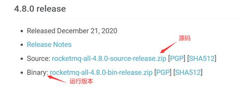

环境要求如下：

- Windows/Linux 64 位系统
- JDK1.8（64位）
- 源码安装需要安装 Maven 3.2.x

### 2.2 安装

#### 1.windows下的安装

**下载**

下载链接：https://archive.apache.org/dist/rocketmq/4.8.0/rocketmq-all-4.8.0-bin-release.zip

解压运行版本（Binary），确保已经安装好了 JDK1.8

**配置环境变量**

变量名：ROCKETMQ_HOME

变量值：MQ 解压路径 \MQ 文件夹名

**启动**

在 RocketMQ 的架构中，都是需要先启动`NameServer`再启动`Broker`的。所以先启动 NameServer。

1. 启动 NameServer

   使用 cmd 命令框执行进入至`MQ文件夹\bin`下，然后执行`start mqnamesrv.cmd`，启动 NameServer。成功后会弹出提示框，此框勿关闭。

2. 启动 Broker

   使用 cmd 命令框执行进入至`MQ文件夹\bin`下，然后执行`start mqbroker.cmd -n 127.0.0.1:9876 autoCreateTopicEnable=true`，启动 Broker。成功后会弹出提示框，此框勿关闭。

**注意事项**

- 弹出提示框‘错误: 找不到或无法加载主类 xxxxxx’的处理

  打开`MQ文件夹\bin`下的`runbroker.cmd`，然后将`%CLASSPATH%`加上英文双引号。保存并重新执行 start 语句。

  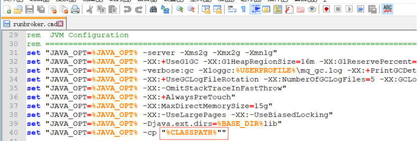

- 内存不足的处理方式

  RocketMQ 默认的虚拟机内存较大，启动 Broker 如果因为内存不足失败，需要编辑如下两个配置文件，修改 JVM 内存大小。编辑`MQ文件夹\bin’下的runbroker.cmd`和`runserver. cmd`修改默认 JVM 大小（Linux 上对应同名 sh 文件）

  runbroker.cmd      --broker 的配置

  runserver. cmd      --nameServer 的配置

  例如：配置以下参数将 RocketMQ 的启动 JVM 的堆空间内存控制在 512m，新生代控制在 256m。元空间初始 128m，最大 320m。

  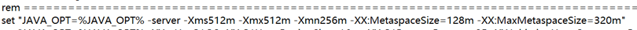

- 修改 RocketMQ 的存储路径

  rocketmq 取的默认路径是 user.home 路径，也就是用户的根目录，一般存储放在跟路径下的`/store`目录。

  源码中可以得到验证，如下图：

  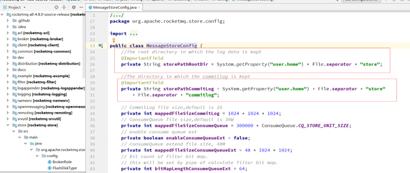

  所以这里会有一个问题，RocketMQ 很容易导致 C 盘空间不够，在使用过程中，创建一个主题默认就是要创建 1G 的文件，很可能会导致出问题。

  所以在 windows 上容易导致 C 盘空间吃满。

  解决方式有两种：

  1. 修改源码，比如：全局替换 user.home 参数为 mq.store，然后重新打包

  2. 使用源码方式启动，源码启动时通过参数设置指定存储位置

##### 控制台插件

**环境要求**

运行前确保：已经有 jdk1.8，Maven（打包需要安装Maven 3.2.x）

**下载**

老版本地址下载：https://codeload.github.com/apache/rocketmq-externals/zip/master

新版本地址：https://github.com/apache/rocketmq-dashboard

解压后如图（以下使用的是老版本，新版本参考老版本即可）

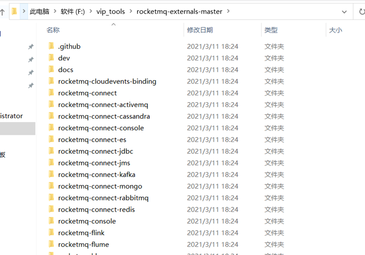

**启动**

后端管理界面是：rocketmq-console

下载完成之后，进入`\rocketmq-console\src\main\resources`文件夹，打开`application.properties`进行配置。

```bash
server:
  # 服务的端口
  port: 8080
  servlet:
    encoding:
      charset: UTF-8
      enabled: true
      force: true

spring:
  application:
    name: rocketmq-dashboard

logging:
  config: classpath:logback.xml

rocketmq:
  config:
    # if this value is empty,use env value rocketmq.config.namesrvAddr  NAMESRV_ADDR | now, default localhost:9876
    # configure multiple namesrv addresses to manage multiple different clusters
    namesrvAddrs:
      # rocketMQ 服务的端口
      - 127.0.0.1:9876
      - 127.0.0.2:9876

```

进入`\rocketmq-externals\rocketmq-console`文件夹，执行`mvn clean package -Dmaven.test.skip=true`，编译生成。

编译成功之后，cmd 命令进入`target`文件夹:，执行`java -jar rocketmq-console-ng-2.0.0.jar`，启动`rocketmq-console-ng-2.0.0.jar`。

#### 2.Linux下的安装

**环境要求**

64bit OS、64bit JDK 1.8+、4g+ free disk for Broker server

**官网下载 bin 文件后解压**

**注意事项**

1. RocketMQ 需要开通的端口

   - rocketMQ 自身占用有 9876 
   - 非 vip 通道端口：10911
   - vip 通道端口：10909 (只针对 producer 而且 4.5 以后已经默认不开启了)

   VIP 通道其实就是多监听一个端口用于接受处理消息，因为默认端口通道可能很多在用，为了防止某些很重要的业务堵塞，就再开一个端口处理。这对于老版本的 RocketMQ 有消息接收队列的时候，作用可能大一点，对于目前的 RocketMQ 的设计，作用没那么大了。所以，这个默认就不开启了，留着只是为了兼容老版本。

2. ==修改配置文件==

   - 记得 Linux 上修改文件权限：`chmod -R 777 /home/linux`

   - RocketMQ 默认的虚拟机内存较大，启动 Broker 如果因为内存不足失败，需要**编辑如下两个配置文件**，修改 JVM 内存大小。（但是这个也仅仅是在测试环境中，RocketMQ 在生产上最低要求至少 8G 内存<官方推荐>才能确保 RocketMQ 的效果）

     编辑`runbroker.sh`和`runserver.sh`修改默认`JVM`大小（windows 上对应 cmd 文件）

     vi runbroker.sh      --broker 的配置

     vi runserver.sh      --nameServer 的配置

     ```bash
     JAVA_OPT="${JAVA_OPT} -server -Xms1024m -Xmx1024m -Xmn512m -XX:MetaspaceSize=128m -XX:MaxMetaspaceSize=320m"
     ```

**启动**

在 RocketMQ 的架构中，都是需要先启动 NameServer 再启动 Broker 的。所以先启动 NameServer。

1. 启动 NameServer

   进入至`MQ文件夹\bin`下，然后执行`nohup sh mqnamesrv &`，启动 NAMESERVER。

   查看日志的命令：`tail -f ~/logs/rocketmqlogs/namesrv.log`

   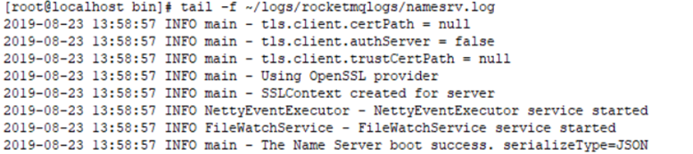

2. 启动 Broker

   进入至`MQ文件夹\bin`下，启动 BROKER。

   修改配置文件增加外网地址（你启动加载哪个配置文件就修改哪个，比如修改 broker.conf）

   ```bash
   brokerIP1=192.168.11.101
   ```

   启动命令如下：

   ```bash
   nohup sh mqbroker -c ../conf/broker.conf -n 192.168.11.101:9876 autoCreateTopicEnable=true &  
   ```

   这样启动的服务器客户端可以自动创建主题。查看日志的命令：`tail -f ~/logs/rocketmqlogs/broker.log`

   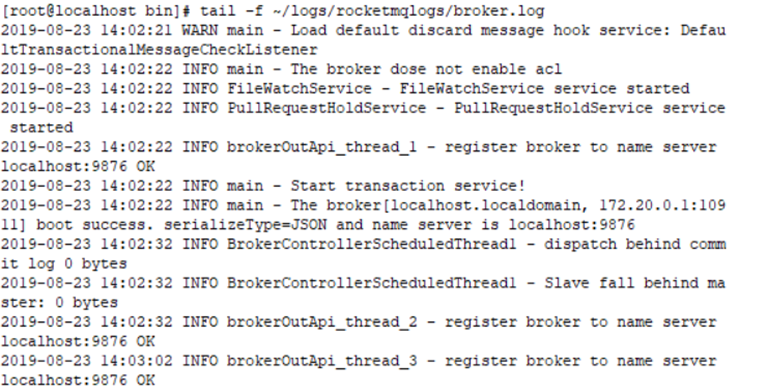

**关闭**

- 关闭 namesrv

  ```bash
  ./mqshutdown namesrv
  ```

- 关闭 broker

  ```bash
  ./mqshutdown broker
  ```

##### 控制台插件

**下载**

https://github.com/apache/rocketmq-dashboard

> **安装 maven**
>
> 1. 首先到Maven官网[下载安装包](http://maven.apache.org/download.cgi)，目前最新版本为 3.8.5，下载文件为 apache-maven-3.8.5-bin.tar.gz
>
> 2. 进入下载文件夹，找到下载的文件，运行如下命令解压
>
>    ```bash
>    tar -zxvf apache-maven-3.8.5-bin.tar.gz
>    ```
>
>    解压后的文件夹名为 apache-maven-3.8.5
>
> 4. 配置环境变量，编辑`/etc/profile`文件，添加如下代码
>
>    ```bash
>    export MAVEN_HOME=/usr/local/maven/apache-maven-3.8.5
>    export PATH=$JAVA_HOME/bin:$MAVEN_HOME/bin:$ANTX_HOME/bin:$ANT_HOME/bin:$MYSQL_HOME/bin:$PATH
>    ```
>
> 5. 保存文件，并运行如下命令使环境变量生效
>
>    ```bash
>     source /etc/profile
>    ```
>
> 6. 在控制台输入如下命令，如果能看到 Maven 相关版本信息，则说明 Maven 已经安装成功
>
>    ```bash
>     mvn -v
>    ```

然后执行以下命令生成 jar 包

```bash
mvn install -Dmaven.test.skip=true
```

执行`nohup java -jar rocketmq-console-ng-1.0.1.jar &`，启动`rocketmq-console-ng-1.0.1.jar`。

#### 3.RocketMQ源码安装与调试

**下载**

http://rocketmq.apache.org/dowloading/releases/


**环境要求**

- 64 位系统
- JDK1.8(64位)
- Maven 3.2.x

**IntelliJ IDEA导入**

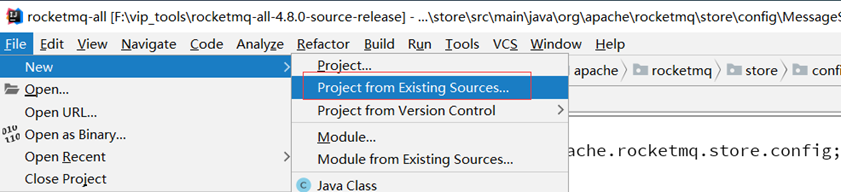

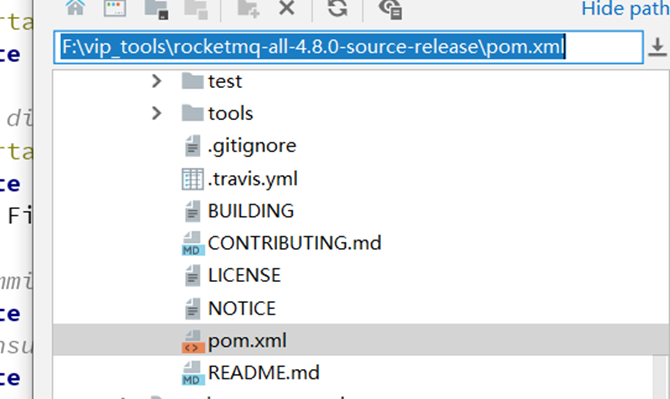

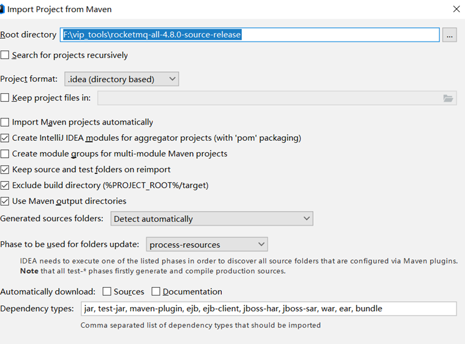

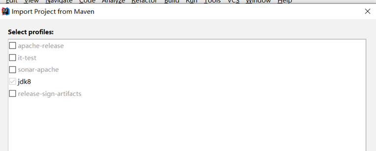

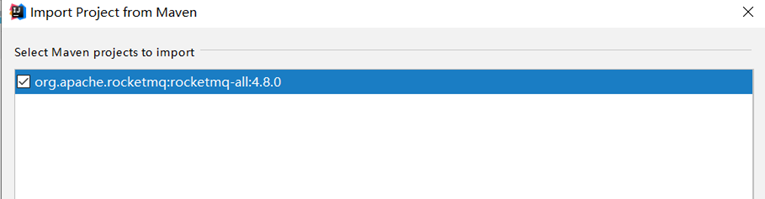

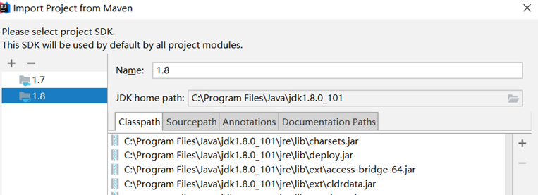

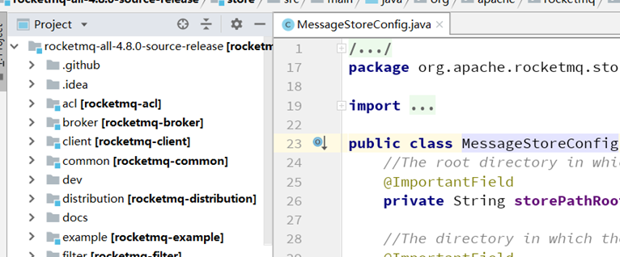

导入后执行 Maven 命令 install

```bash
mvn install -D maven.test.skip=true
```

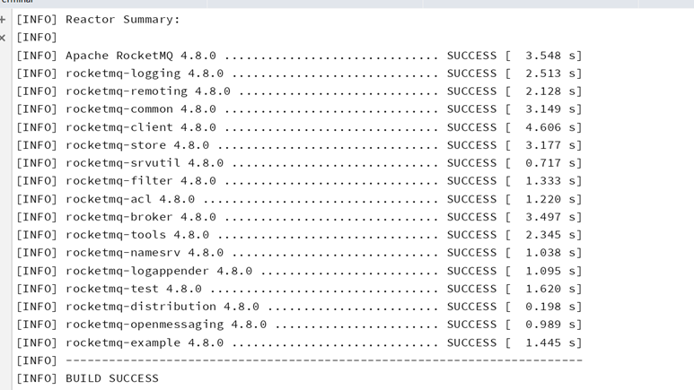

**启动RocketMQ源码**

- 启动NameServer

  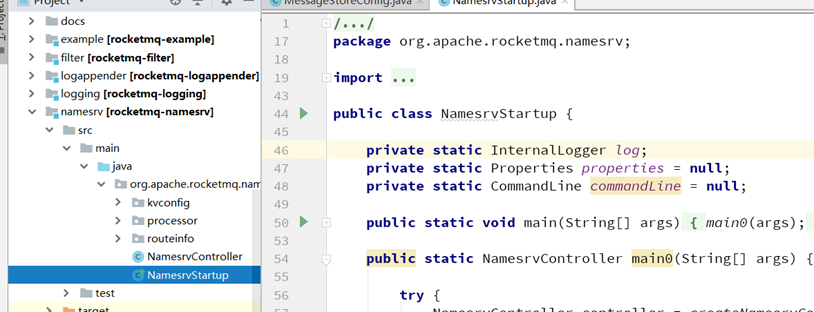

  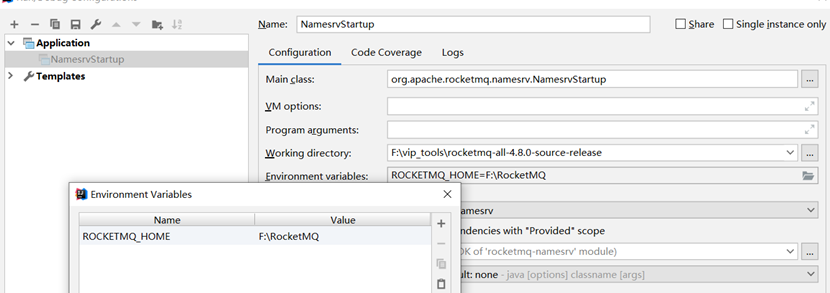

  如上图中 Value 值是一个 Rocket 运行主目录（一般这个目录新建）

  在 Rocket 运行主目录中创建 conf、logs、store 三个文件夹

  然后从源码目录中 distribution 目录下的中将 broker.conf、logback_broker.xml、logback_namesrv.xml 复制到 conf 目录中

  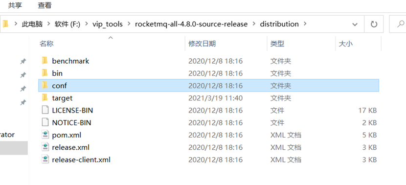

  

  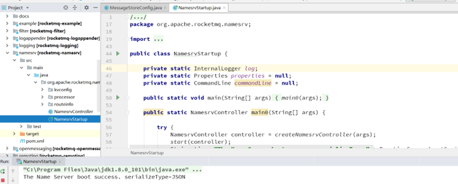

- 启动 Broker

  在 broker 模块找到 broker 模块，同时找到启动类 BrokerStartup.java

  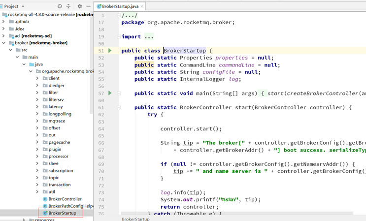

  需要修改配置文件 broker.conf

  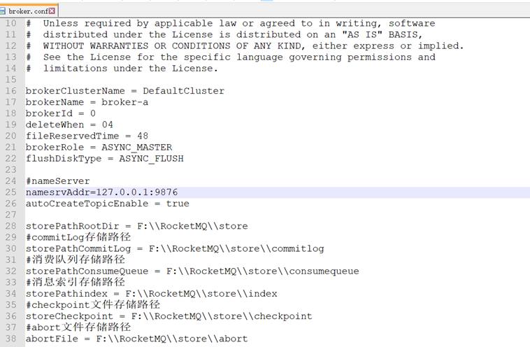

  配置如下：

  ```properties
  #nameServer
  namesrvAddr=127.0.0.1:9876
  autoCreateTopicEnable = true
  storePathRootDir = F:\\RocketMQ\\store
  #commitLog存储路径
  storePathCommitLog = F:\\RocketMQ\\store\\commitlog
  #消费队列存储路径
  storePathConsumeQueue =F:\\RocketMQ\\store\\consumequeue
  #消息索引存储路径
  storePathindex = F:\\RocketMQ\\store\\index
  #checkpoint文件存储路径
  storeCheckpoint = F:\\RocketMQ\\store\\checkpoint
  #abort文件存储路径
  abortFile = F:\\RocketMQ\\store\\abort
  ```

- 配置环境变量

  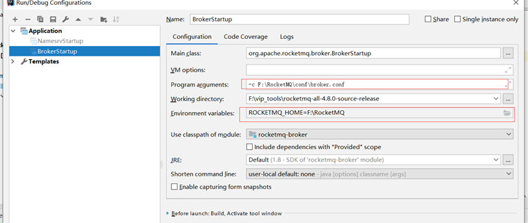

- 启动的日志文件目录

  启动过程中任何的日志信息已经写入

  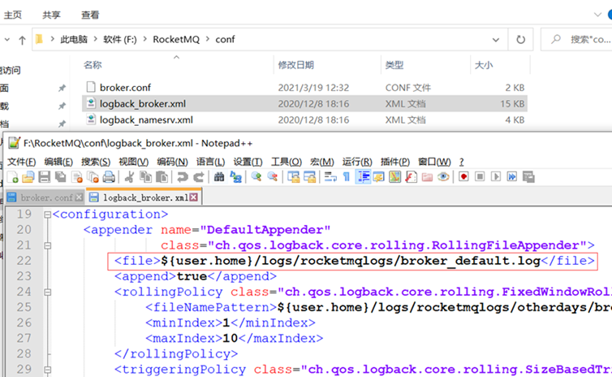

  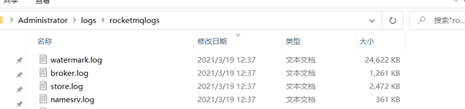

#### 4.控制台使用文档

浏览器中输入`127.0.0.1:8080`，成功后即可进行管理端查看。

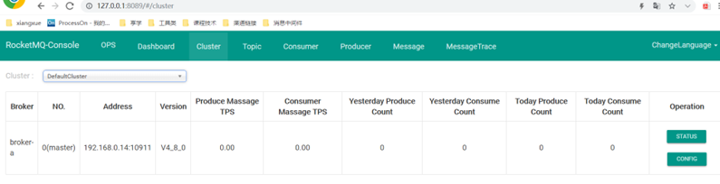


**运维页面**

你可以修改这个服务使用的 namesrv 的地址

你可以修改这个服务是否使用 VIPChannel（如果你的 mq server 版本小于 3.5.8，请设置不使用）

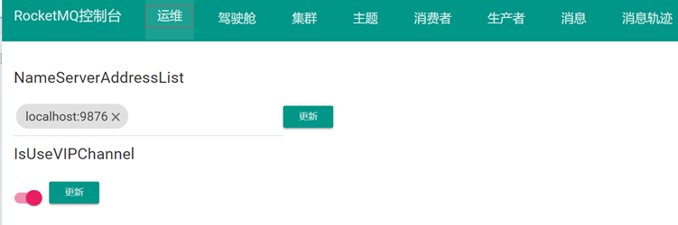

**驾驶舱**

查看 broker 的消息量（总量/5分钟图）

查看单一主题的消息量（总量/趋势图）

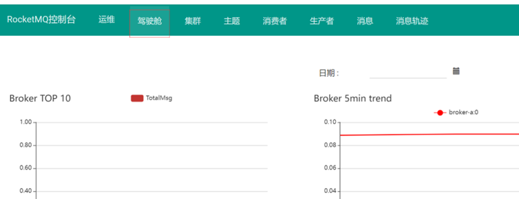

**集群**

查看集群的分布情况：cluster 与 broker 关系、broker

查看 broker 具体信息/运行信息

查看 broker 配置信息

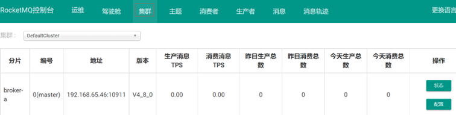

**主题页面**

展示所有的主题，可以通过搜索框进行过滤

筛选`普通/重试/死信`主题

添加/更新主题

- clusterName 创建在哪几个 cluster 上
- brokerName 创建在哪几个 broker 上
- topicName 主题名
- writeQueueNums 写队列数量
- readQueueNums 读队列数量
- perm 
  - 2 是写
  - 4 是读
  - 6 是读写

`状态` 查询消息投递状态（投递到哪些 broker / 哪些 queue / 多少量等）

`路由` 查看消息的路由（现在你发这个主题的消息会发往哪些 broker，对应 broker 的 queue 信息）

`CONSUMER管理` 这个 topic 都被哪些 group 消费了，消费情况何如

`topic配置` 查看变更当前的配置

`发送消息` 向这个主题发送一个测试消息

`重置消费位点` 分为在线和不在线两种情况，不过都需要检查重置是否成功

`删除主题` 会删除掉所有 broker 以及 namesrv 上的主题配置和路由信息

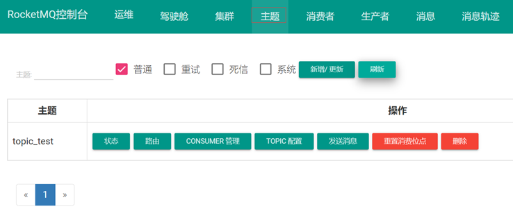

**消费者页面**

展示所有的消费组，可以通过搜索框进行过滤

刷新页面/每隔五秒定时刷新页面

按照`订阅组/数量/TPS/延迟`进行排序

添加 / 更新消费组

- clusterName 创建在哪几个集群上
- brokerName 创建在哪几个broker上
- groupName 消费组名字
- consumeEnable 是否可以消费 FALSE 的话将无法进行消费
- consumeBroadcastEnable 是否可以广播消费
- retryQueueNums 重试队列的大小
- brokerId 正常情况从哪消费
- whichBrokerWhenConsumeSlowly 出问题了从哪消费

`终端` 在线的消费客户端查看，包括版本订阅信息和消费模式

`消费详情` 对应消费组的消费明细查看，这个消费组订阅的所有 Topic 的消费情况，每个 queue 对应的消费 client 查看（包括 Retry 消息）

`配置` 查看变更消费组的配置

`删除` 在指定的 broker 上删除消费组

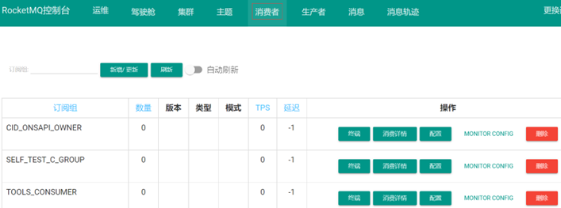

**生产者页面**

通过 Topic 和 Group 查询在线的消息生产者客户端

信息包含客户端主机版本

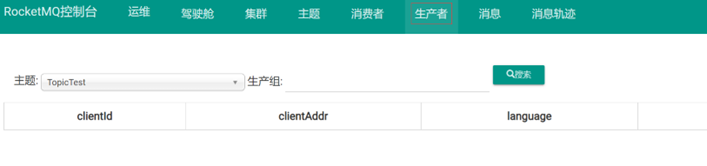

**消息查询页面**

根据 Topic 和时间区间查询

- 由于数据量大最多只会展示 2000 条，多的会被忽略

根据 Topic 和 Key 进行查询

- 最多只会展示 64 条

根据消息主题和消息 Id 进行消息的查询

消息详情可以展示这条消息的详细信息，查看消息对应到具体消费组的消费情况（如果异常，可以查看具体的异常信息）。可以向指定的消费组重发消息

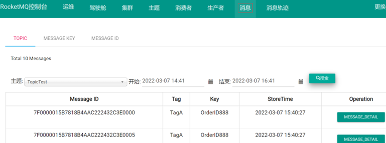

#### 