# 第2章_快速入门

## 1.消息中间件(MQ)的定义

消息中间件，英文 Message Queue，简称 MQ。它没有标准定义，一般认为：消息中间件属于分布式系统中一个子系统，关注于数据的发送和接收，利用高效可靠的异步消息传递机制对分布式系统中的其余各个子系统进行集成。

**高效：**对于消息的处理处理速度快，RocketMQ 可以达到单机 10万+ 的并发。

**可靠：**一般消息中间件都会有消息持久化机制和其他的机制确保消息不丢失。

**异步：**指发送完一个请求，不需要等待返回，随时可以再发送下一个请求，既不需要等待。

**一句话总结：消息中间件不生产消息，只是消息的搬运工。**

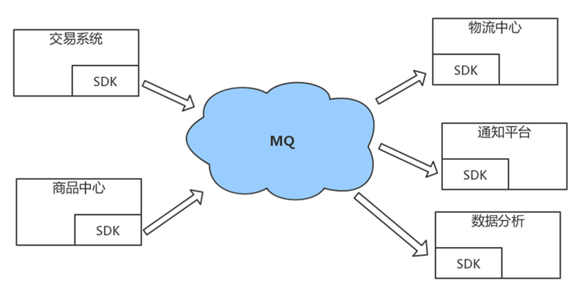

### 1.1 为什么要用消息中间件？

#### 1.应用解耦

系统的耦合性越高，容错性就越低。以电商应用为例，用户创建订单后，如果耦合调用库存系统、物流系统、支付系统，任何一个子系统出了故障或者因为升级等原因暂时不可用，都会造成下单操作异常，影响用户使用体验。

使用消息中间件，系统的耦合性就会提高了。比如物流系统发生故障，需要几分钟才能来修复，在这段时间内，物流系统要处理的数据被缓存到消息队列中，用户的下单操作正常完成。当物流系统恢复后，继续处理存放在消息队列中的订单消息即可，终端系统感知不到物流系统发生过几分钟故障。

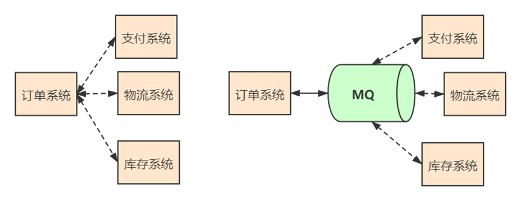

#### 2.流量削峰

应用系统如果遇到系统请求流量的瞬间猛增，有可能会将系统压垮。有了消息队列可以将大量请求缓存起来，分散到很长一段时间处理，这样可以大大提到系统的稳定性和用户体验。

**互联网公司的大促场景（双十一、店庆活动、秒杀活动）都会使用到MQ**。

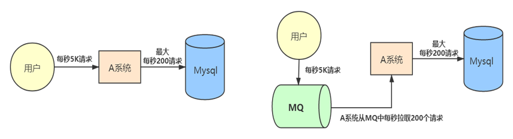

#### 数据分发

通过消息队列可以让数据在多个系统更加之间进行流通。数据的产生方不需要关心谁来使用数据，只需要将数据发送到消息队列，数据使用方直接在消息队列中直接获取数据即可。

接口调用的弊端，无论是新增系统，还是移除系统，代码改造工作量都很大。

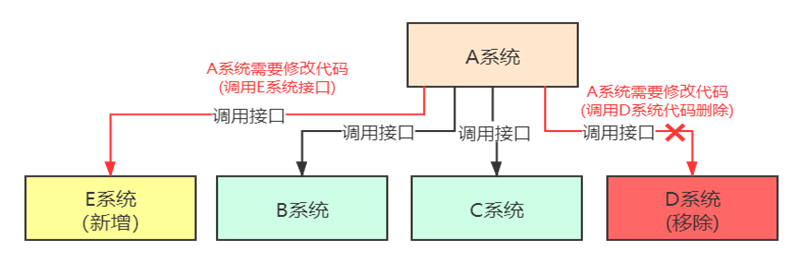

使用 MQ 做数据分发好处，无论是新增系统，还是移除系统，代码改造工作量较小。所以使用 MQ 做数据的分发，可以提高团队开发的效率。

### 1.2 RocketMQ各部分角色介绍

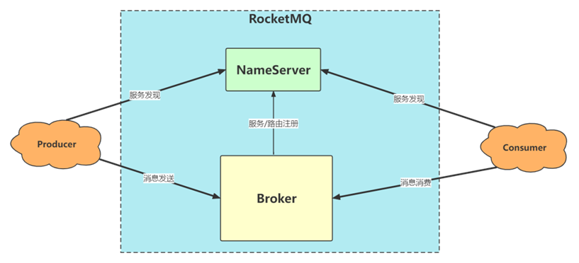

#### 1.NameServer

NameServer 是整个 RocketMQ 的`大脑`，它是 RocketMQ 的服务注册中心，所以 RocketMQ 需要先启动 NameServer 再启动 Rocket 中的 Broker。

Broker 在启动时向所有 NameServer `注册`（主要是服务器地址等），生产者在发送消息之前先从 NameServer 获取 Broker 服务器地址列表（消费者一样），然后根据负载均衡算法从列表中选择一台服务器进行消息发送。

#### 2.主机(Broker)

RocketMQ 的核心，用于暂存和传输消息。

#### 3.生产者(Producer)

也称为消息发布者，负责生产并发送消息至 RocketMQ。

#### 4.消费者(Consumer)

也称为消息订阅者，负责从 RocketMQ 接收并消费消息。

#### 5.消息(Message)

生产或消费的数据，对于 RocketMQ 来说，消息就是字节数组。

### 1.3 使用RocketMQ的核心概念

#### 1.主题(Topic)

标识 RocketMQ 中一类消息的逻辑名字，消息的逻辑管理单位。无论消息生产还是消费，都需要指定 Topic。主题主要用于区分消息的种类：一个生产者可以发送消息给一个或者多个 Topic，消息的消费者也可以订阅一个或者多个 Topic 消息。

#### 2.消息队列(Message Queue)

简称 Queue 或 Q。消息物理管理单位。一个 Topic 将有若干个 Q。

无论生产者还是消费者，实际的生产和消费都是针对 Q 级别。例如 Producer 发送消息的时候，会预先选择（默认轮询）好该 Topic 下面的某一条Q发送；Consumer 消费的时候也会负载均衡地分配若干个 Q，只拉取对应 Q 的消息。

若一个 Topic 创建在不同的 broker，则不同的 broker 上都有若干 Q，消息将物理地存储落在不同 broker 结点上，具有水平扩展的能力。

#### 3.分组(Group)

**生产者：**标识发送同一类消息的 Producer，通常发送逻辑一致。发送普通消息的时候，仅标识使用，并无特别用处。**主要作用用于事务消息**。

**消费者：**标识一类 Consumer 的集合名称，这类 Consumer 通常消费一类消息（也称为 Consumer Group），且消费逻辑一致。同一个 Consumer Group 下的各个实例将共同消费 topic 的消息，起到负载均衡的作用。

#### 4.标签(Tag)

RocketMQ 支持给在发送的时候给消息打 tag，同一个 topic 的消息虽然逻辑管理是一样的。但是消费同一个 topic 时，如果你消费订阅的时候指定的是 tagA，那么 tagB 的消息将不会投递。

#### 5.偏移量(Offset)

RocketMQ 中，有很多 offset 的概念。一般我们只关心暴露到客户端的 offset。不指定的话，就是指 Message Queue 下面的 offset。

Message queue 是无限长的数组。一条消息进来下标就会涨 1，而这个数组的下标就是 offset，Message queue 中的 max offset 表示消息的最大 offset。

Consumer offset 可以理解为标记 Consumer Group 在一条逻辑 Message Queue 上，消息消费到哪里即消费进度。但从源码上看，这个数值是消费过的最新消费的消息 offset+1，即实际上表示的是**下次拉取的offset位置**。

## 2.RocketMQ入门

### 2.1 普通消息

本章节先会使用 RocketMQ 提供的原生客户端的 API，当然除了原生客户端外，SpringBoot、SpringCloudStream 也进行了集成，但本质上这些也是基于原生 API 的封装，所以只需掌握原生 API，其他的也会水到渠成。

Java 代码中使用普通消息的整体流程如下：

- 导入 MQ 客户端依赖

  ```xml
  <dependency>
      <groupId>org.apache.rocketmq</groupId>
      <artifactId>rocketmq-client</artifactId>
      <version>4.8.0</version>
  </dependency>
  ```

- 消息发送者步骤

  1. 创建消息生产者 producer，并指定生产者组名

  2. 指定 Nameserver 地址

  3. 启动 producer

  4. 创建消息对象，指定 Topic、Tag 和消息体

  5. 发送消息

  6. 关闭生产者 producer

- 消息消费者步骤

  1. 创建消费者 Consumer，指定消费者组名

  2. 指定 Nameserver 地址

  3. 订阅主题 Topic 和 Tag

  4. 设置回调函数，处理消息

  5. 启动消费者 consumer

#### 1.三种消息发送方式

##### 1.1 发送同步消息

同步发送是指消息发送方发出数据后，同步等待，直到收到接收方发回响应之后才发下一个请求。这种可靠性同步地发送方式使用的比较广泛，比如：重要的消息通知，短信通知。

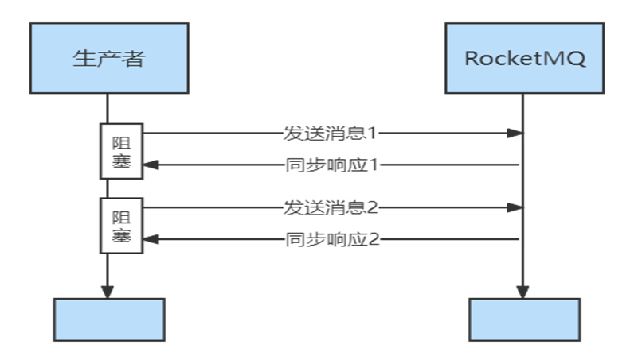

- 代码演示

  ```java
  public class Producer {
      public static void main(String[] args) throws MQClientException, MQBrokerException, RemotingException, InterruptedException {
          // 实例化消息生产者
          DefaultMQProducer producer = new DefaultMQProducer("producer_group");
          // 设置 NameServer 的地址
          producer.setNamesrvAddr("192.168.11.101:9876");
          // 启动 Producer 实例
          producer.start();
  
          for (int i = 0; i < 10; i++) {
              // 创建消息并指定 Topic、Tag 和 Message body
              Message msg = new Message(
                      // Topic
                      "TopicTest",
                      // Tag
                      "tagA",
                      // message body
                      ("Hello rocketMQ" + i).getBytes(StandardCharsets.UTF_8)
              );
              // 发送消息到 broker
              SendResult result = producer.send(msg);
              System.out.printf("%s%n", result);
          }
          // 关闭 producer 实例
          producer.shutdown();
      }
  } 
  ```

- 发送结果分析

  ```bash
  SendResult [sendStatus=SEND_OK, msgId=7F00000140E418B4AAC2515535340000, offsetMsgId=C0A80B6500002A9F0000000000000000, messageQueue=MessageQueue [topic=TopicTest, brokerName=myServer1, queueId=0], queueOffset=0]
  SendResult [sendStatus=SEND_OK, msgId=7F00000140E418B4AAC25155357B0001, offsetMsgId=C0A80B6500002A9F00000000000000BD, messageQueue=MessageQueue [topic=TopicTest, brokerName=myServer1, queueId=1], queueOffset=0]
  SendResult [sendStatus=SEND_OK, msgId=7F00000140E418B4AAC2515535960002, offsetMsgId=C0A80B6500002A9F000000000000017A, messageQueue=MessageQueue [topic=TopicTest, brokerName=myServer1, queueId=2], queueOffset=0]
  SendResult [sendStatus=SEND_OK, msgId=7F00000140E418B4AAC25155359A0003, offsetMsgId=C0A80B6500002A9F0000000000000237, messageQueue=MessageQueue [topic=TopicTest, brokerName=myServer1, queueId=3], queueOffset=0]
  SendResult [sendStatus=SEND_OK, msgId=7F00000140E418B4AAC25155359D0004, offsetMsgId=C0A80B6500002A9F00000000000002F4, messageQueue=MessageQueue [topic=TopicTest, brokerName=myServer1, queueId=0], queueOffset=1]
  SendResult [sendStatus=SEND_OK, msgId=7F00000140E418B4AAC2515535A40005, offsetMsgId=C0A80B6500002A9F00000000000003B1, messageQueue=MessageQueue [topic=TopicTest, brokerName=myServer1, queueId=1], queueOffset=1]
  SendResult [sendStatus=SEND_OK, msgId=7F00000140E418B4AAC2515535A90006, offsetMsgId=C0A80B6500002A9F000000000000046E, messageQueue=MessageQueue [topic=TopicTest, brokerName=myServer1, queueId=2], queueOffset=1]
  SendResult [sendStatus=SEND_OK, msgId=7F00000140E418B4AAC2515535AF0007, offsetMsgId=C0A80B6500002A9F000000000000052B, messageQueue=MessageQueue [topic=TopicTest, brokerName=myServer1, queueId=3], queueOffset=1]
  SendResult [sendStatus=SEND_OK, msgId=7F00000140E418B4AAC2515535B60008, offsetMsgId=C0A80B6500002A9F00000000000005E8, messageQueue=MessageQueue [topic=TopicTest, brokerName=myServer1, queueId=0], queueOffset=2]
  SendResult [sendStatus=SEND_OK, msgId=7F00000140E418B4AAC2515535BB0009, offsetMsgId=C0A80B6500002A9F00000000000006A5, messageQueue=MessageQueue [topic=TopicTest, brokerName=myServer1, queueId=1], queueOffset=2]
  ```
  
  - msgId
  
    消息的全局唯一标识（RocketMQ 的 ID 生成是使用机器 IP 和消息偏移量的组成），由消息队列 MQ 系统自动生成，唯一标识某条消息。
  
    - `sendStatus`：发送的标识：成功，失败等
  
    - `queueId`：queueId 是 Topic 的分区；Producer 发送具体一条消息的时，对应选择的该 Topic 下的某一个 Queue 的标识 ID
  
    - `queueOffset`：Message queue 是无限长的数组。一条消息进来下标就会涨 1，而这个数组的下标就是 queueOffset，queueOffset 是从 0 开始递增

##### 1.2 发送异步消息

异步消息通常用在对响应时间敏感的业务场景，即发送端不能容忍长时间地等待 Broker 的响应。消息发送方在发送了一条消息后，不等接收方发回响应，接着进行第二条消息发送。发送方通过回调接口的方式接收服务器响应，并对响应结果进行处理。

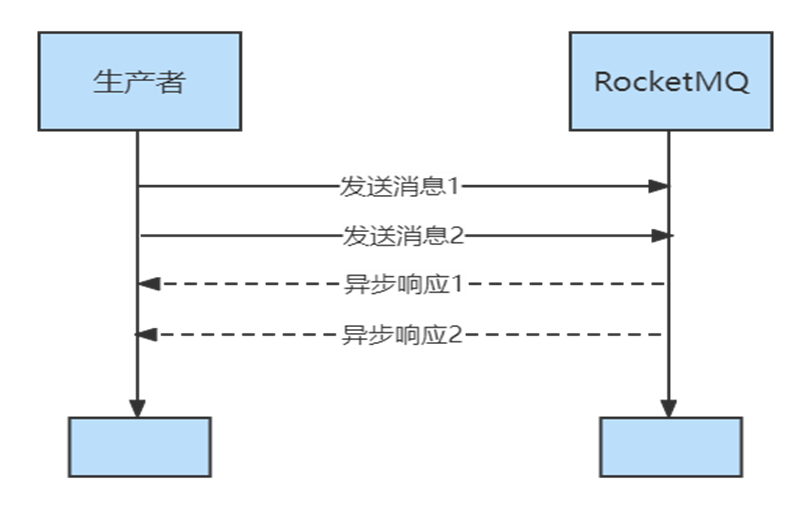

- 代码演示

  ```java
  public class Producer {
      public static void main(String[] args) throws MQClientException, RemotingException, InterruptedException {
          DefaultMQProducer producer = new DefaultMQProducer("producer_group");
          producer.setNamesrvAddr("192.168.11.101:9876");
          producer.start();
  
          for (int i = 0; i < 10; i++) {
              final int index = i;
              Message msg = new Message(
                      "TopicTest",
                      "tagA",
                      ("Hello rocketMQ" + i).getBytes(StandardCharsets.UTF_8)
              );
              // SendCallback 接收异步返回结果的回调
              producer.send(msg, new SendCallback() {
                  // 发送成功的回调
                  @Override
                  public void onSuccess(SendResult sendResult) {
                      System.out.printf("%s%n", sendResult);
                  }
                  // 发送失败的回调
                  @Override
                  public void onException(Throwable e) {
                      System.out.printf("%-10d Exception %s %n", index, e);
                  }
              });
  
          }
          // 主线程休眠接收异步返回结果
          System.out.println("main thread sleep");
          Thread.sleep(10000);
          // 关闭 producer 实例
          producer.shutdown();
      }
  }
  ```
  
  发送结果分析跟发送同步消息相同。

##### 1.3 单向发送

这种方式主要用在不特别关心发送结果的场景，例如日志发送。单向（Oneway）发送特点为发送方只负责发送消息，不等待服务器回应且没有回调函数触发，即只发送请求不等待应答。此方式发送消息的过程耗时非常短，一般在微秒级别。

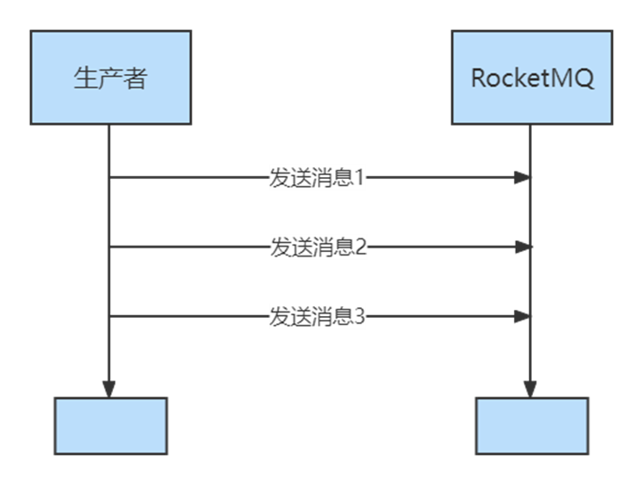

- 代码演示

  ```java
  public class Producer {
      public static void main(String[] args) throws MQClientException, RemotingException, InterruptedException {
          DefaultMQProducer producer = new DefaultMQProducer("producer_group");
          producer.setNamesrvAddr("192.168.11.101:9876");
          producer.start();
          for (int i = 0; i < 10; i++) {
              Message msg = new Message(
                      "TopicTest",
                      "tagA",
                      ("Hello rocketMQ" + i).getBytes(StandardCharsets.UTF_8)
              );
              // 发送消息到 broker
              producer.sendOneway(msg);
          }
          // 关闭 producer 实例
          producer.shutdown();
      }
  }
  ```

##### 1.4 消息发送的权衡

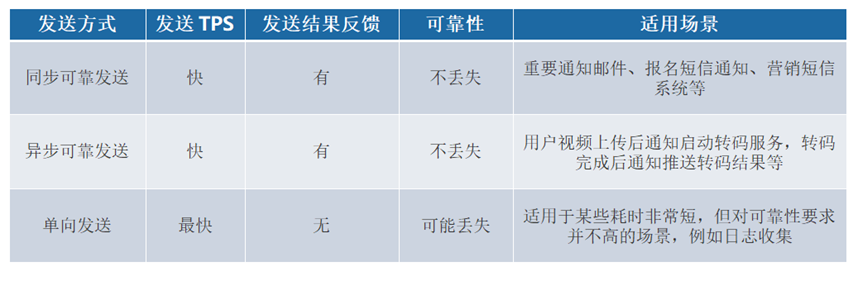

#### 2.两种消息消费方式

##### 2.1 负载均衡模式（集群消费）

消费者采用负载均衡方式消费消息，一个分组（Group）下的多个消费者共同消费队列消息，每个消费者处理的消息不同。一个 Consumer Group 中的各个 Consumer 实例分摊去消费消息，即一条消息只会投递到一个 Consumer Group 下面的一个实例。例如某个 Topic 有 3 个队列，其中一个 Consumer Group 有 3 个实例，那么每个实例只消费其中的 1 个队列。集群消费模式是消费者默认的消费方式。

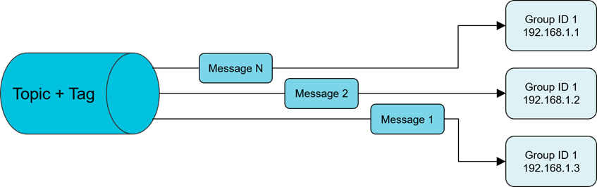

- 代码演示

  ```java
  public class Consumer {
      public static void main(String[] args) throws MQClientException {
          // consumer 的 group 与 producer 的无关
          DefaultMQPushConsumer consumer = new DefaultMQPushConsumer("group_test");
          consumer.setNamesrvAddr("192.168.11.101:9876");
          // 订阅 Topic
          // * 表示订阅全部
          consumer.subscribe("TopicTest", "*");
          // 负载均衡模式消费（默认，可以不设置）
          consumer.setMessageModel(MessageModel.CLUSTERING);
          // 注册回调函数
          consumer.registerMessageListener(new MessageListenerConcurrently() {
              @Override
              public ConsumeConcurrentlyStatus consumeMessage(List<MessageExt> msgs, ConsumeConcurrentlyContext context) {
                  try {
                      for (MessageExt msg : msgs) {
                          String topic = msg.getTopic();
                          String msgBody = new String(msg.getBody(), StandardCharsets.UTF_8);
                          String tags = msg.getTags();
                          System.out.println("收到消息：" + "topic：" + topic + ", tags：" + tags + ", msg：" + msgBody);
                      }
                  } catch (Exception e) {
                      e.printStackTrace();
                      // 告诉 MQ 消费失败，之后进行重试
                      return ConsumeConcurrentlyStatus.RECONSUME_LATER;
                  }
                  // 告诉 MQ 消费成功
                  return ConsumeConcurrentlyStatus.CONSUME_SUCCESS;
              }
          });
          // 启动消费者
          consumer.start();
          System.out.printf("consumer started.%n");
      }
  }
  ```
  
- 结果分析

  启动两个 consumer 监听`TopicTest`，通过 producer 生产 10 条消息，发现每个 consumer 都消费了 5 条消息。

  消费者 1

  ```bash
  收到消息：topic：TopicTest, tags：tagA, msg：Hello rocketMQ1
  收到消息：topic：TopicTest, tags：tagA, msg：Hello rocketMQ2
  收到消息：topic：TopicTest, tags：tagA, msg：Hello rocketMQ5
  收到消息：topic：TopicTest, tags：tagA, msg：Hello rocketMQ6
  收到消息：topic：TopicTest, tags：tagA, msg：Hello rocketMQ9
  ```

  消费者 2

  ```bash
  收到消息：topic：TopicTest, tags：tagA, msg：Hello rocketMQ0
  收到消息：topic：TopicTest, tags：tagA, msg：Hello rocketMQ3
  收到消息：topic：TopicTest, tags：tagA, msg：Hello rocketMQ8
  收到消息：topic：TopicTest, tags：tagA, msg：Hello rocketMQ7
  收到消息：topic：TopicTest, tags：tagA, msg：Hello rocketMQ4
  ```

##### 2.2 广播消费

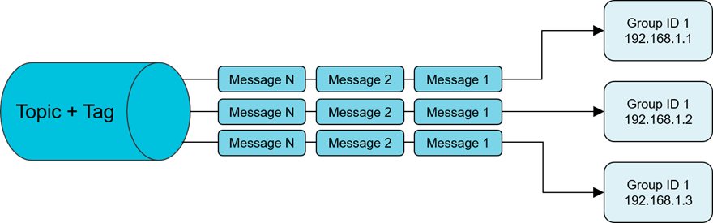

广播消费模式中消息将对一个 Consumer Group 下的各个 Consumer 实例都投递一遍。即使这些 Consumer 属于同一个 Consumer Group，消息也会被 Consumer Group 中的每个 Consumer 都消费一次。实际上，是一个消费组下的每个消费者实例都获取到了 topic 下面的每个 Message Queue 去拉取消费。所以消息会投递到每个消费者实例。

- 代码演示

  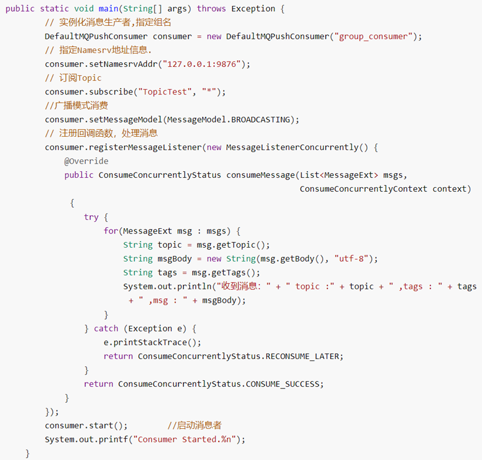

##### 2.3 消息消费时的权衡

- 负载均衡模式：适用场景&注意事项 
  - 消费端集群化部署，每条消息只需要被处理一次
  - 由于消费进度在服务端维护，可靠性更高
  - 集群消费模式下，每一条消息都只会被分发到一台机器上处理。如果需要被集群下的每一台机器都处理，请使用广播模式
  - 集群消费模式下，不保证每一次失败重投的消息路由到同一台机器上，因此处理消息时不应该做任何确定性假设。

- 广播模式：适用场景&注意事项
  - 每条消息都需要被相同逻辑的多台机器处理
  - 消费进度在客户端维护，出现重复的概率稍大于集群模式
  - 广播模式下，消息队列 RocketMQ 保证每条消息至少被每台客户端消费一次，但是并不会对消费失败的消息进行失败重投，因此业务方需要关注消费失败的情况
  - 广播模式下，客户端每一次重启都会从最新消息消费。客户端在被停止期间发送至服务端的消息将会被自动跳过，请谨慎选择
  - 广播模式下，每条消息都会被大量的客户端重复处理，因此推荐尽可能使用集群模式
  - 目前仅 Java 客户端支持广播模式
  - 广播消费模式下不支持顺序消息
  - 广播消费模式下不支持重置消费位点
  - 广播模式下服务端不维护消费进度，所以消息队列 RocketMQ 控制台不支持消息堆积查询、消息堆积报警和订阅关系查询功能

### 2.2 顺序消息

消息有序指的是可以按照消息的发送顺序来消费（FIFO）。RocketMQ 可以严格的保证消息有序，可以分为分区有序或者全局有序。区别如下：

生产消息时在默认的情况下消息发送会采取 Round Robin 轮询方式把消息发送到不同的 queue（分区队列）；而消费消息的时候从多个 queue 上拉取消息，这种情况发送和消费是不能保证顺序。但是如果控制发送的顺序消息只依次发送到同一个 queue 中，消费的时候只从这个 queue 上依次拉取，则就保证了顺序。当发送和消费参与的 queue 只有一个，则是全局有序；如果多个 queue 参与，则为分区有序，即相对每个 queue，消息都是有序的。

#### 1.全局有序

全局有序比较简单，主要控制在于创建 Topic 指定只有一个队列，同步确保生产者与消费者都只有一个实例进行即可。

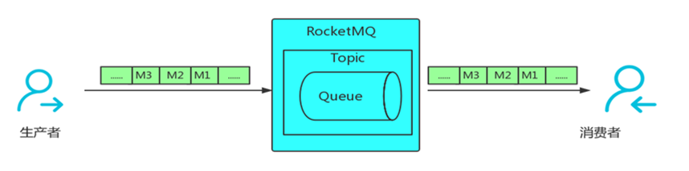

#### 2.分区有序

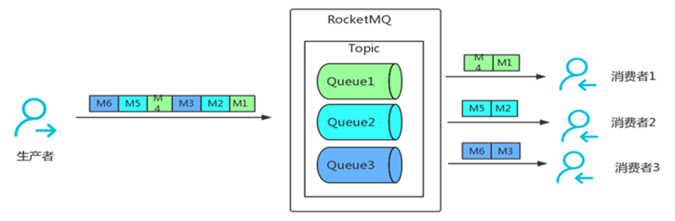

在电商业务场景中，一个订单的流程是：创建、付款、推送、完成。在加入 RocketMQ 后，一个订单会分别产生对于这个订单的创建、付款、推送、完成等消息，如果我们把所有消息全部送入到 RocketMQ 中的一个主题中，这里该如何实现针对一个订单的消息顺序性呢！如下图：

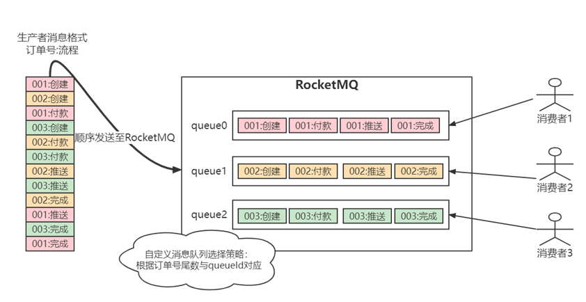

要完成分区有序性，在生产者环节使用自定义的消息队列选择策略，确保订单号尾数相同的消息会被先后发送到同一个队列中（案例中主题有 3 个队列，生产环境中可设定成 10 个满足全部尾数的需求），然后再消费端开启负载均衡模式，最终确保一个消费者拿到的消息对于一个订单来说是有序的。

**代码案例**

1. 生产者代码

   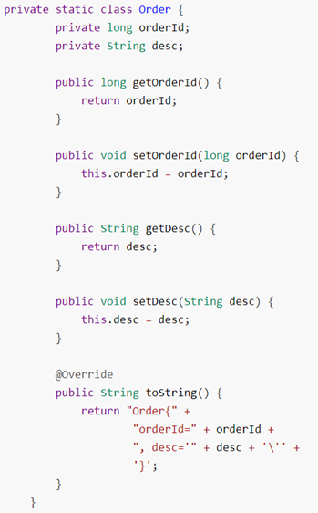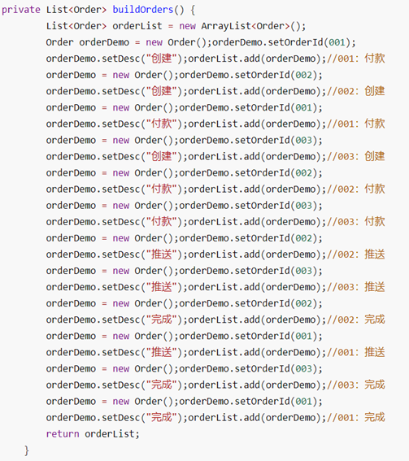

   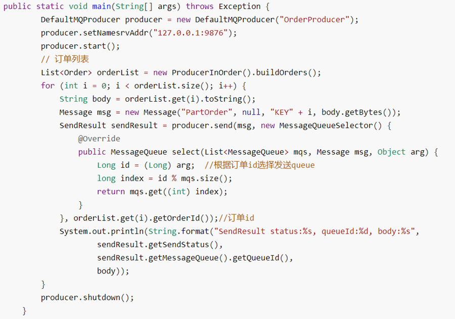

2. 消费者代码

   消费时，同一个 OrderId 获取到的肯定是同一个队列。从而确保一个订单中处理的顺序。

   

**注意事项**

使用顺序消息：首先要保证消息是有序进入 MQ 的，消息放入 MQ 之前，对 id 等关键字进行取模，放入指定 messageQueue，同时 consume 消费消息失败时，不能返回 reconsume——later，这样会导致乱序，所以应该返回suspend_current_queue_a_moment，意思是先等一会，一会儿再处理这批消息，而不是放到重试队列里。

### 2.3 延时消息

Producer 将消息发送到消息队列 RocketMQ 服务端，但并不期望这条消息立马投递（被消费者消费），而是延迟一定时间后才投递到 Consumer 进行消费，该消息即延时消息。

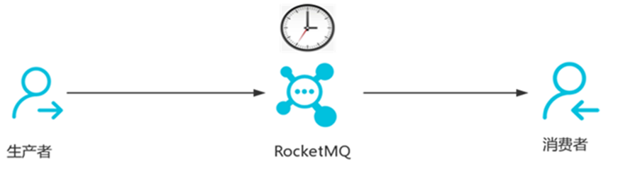

**适用场景**

消息生产和消费有时间窗口要求：比如在电商交易中超时未支付关闭订单的场景，在订单创建时向 RocketMQ 发送一条延时消息。这条消息将会在 30 分钟以后投递给消费者，消费者收到此消息后需要判断对应的订单是否已完成支付。 如支付未完成，则关闭订单。如已完成支付则忽略。

**使用案例**

Apache RocketMQ 目前只支持固定精度的定时消息，因为如果要支持任意的时间精度，在 Broker 层面，必须要做消息排序，如果再涉及到持久化，那么消息排序要不可避免的产生巨大性能开销。（RocketMQ 的商业版本 Aliware MQ 提供了任意时刻的定时消息功能，Apache 的 RocketMQ 并没有，阿里并没有开源）

Apache RocketMQ 发送延时消息是设置在每一个消息体上的，在创建消息时设定一个延时时间长度，消息将从当前发送时间点开始延迟固定时间之后才开始投递。

延迟消息的 level，区分18 个等级：level 为 1，表示延迟 1 秒后消费；level 为 2 表示延迟 5 秒后消费；level 为 3 表示延迟 10 秒后消费；以此类推；最大 level 为 18 表示延迟 2 个小时消费。具体标识如下：

| level | 1    | 2    | 3    | 4    | 5    | 6    | 7    | 8    | 9    |
| ----- | ---- | ---- | ---- | ---- | ---- | ---- | ---- | ---- | ---- |
| 延迟  | 1s   | 5s   | 10s  | 30s  | 1m   | 2m   | 3m   | 4m   | 5m   |
| level | 10   | 11   | 12   | 13   | 14   | 15   | 16   | 17   | 18   |
| 延迟  | 6m   | 7m   | 8m   | 9m   | 10m  | 20m  | 30m  | 1h   | 2h   |

是这生产消息跟普通的生产消息类似，只需要在消息上设置延迟队列的 level 即可。消费消息跟普通的消费消息一致。

#### 1.生产者

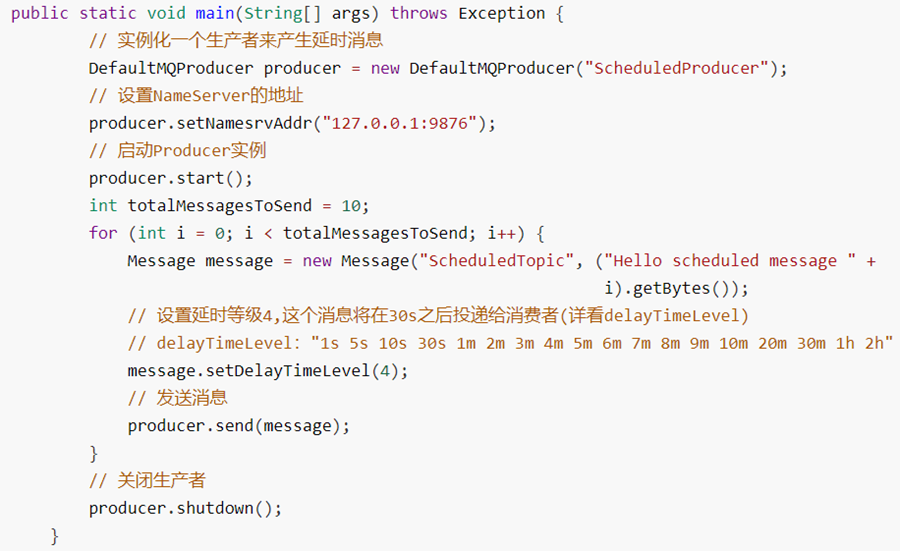

#### 2.消费者

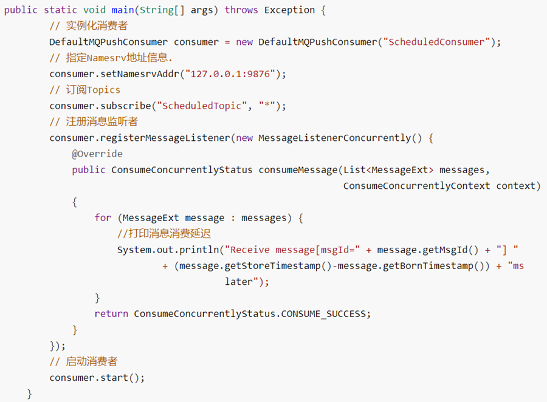

查看消费者消息信息，打印消费延迟与生产时设定符合。

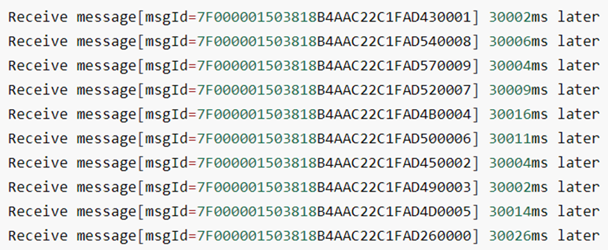

### 2.4 批量消息

在高并发场景中，批量发送消息能显著提高传递消息发送时的性能（减少网络连接及 IO 的开销）。使用批量消息时的限制是这些批量消息应该有相同的 topic，相同的 waitStoreMsgOK（集群时会细讲），且不能是延时消息。

在发送批量消息时先构建一个消息对象集合，然后调用 send（Collection msg）系列的方法即可。由于批量消息的 4MB 限制，所以一般情况下在集合中添加消息需要先计算当前集合中消息对象的大小是否超过限制，如果超过限制也可以使用分割消息的方式进行多次批量发送。

**使用案例**

1. 一般批量发送（不考虑消息分割）

   因为批量消息是一个 Collection，所以送入消息可以是 List，也可以使 Set，这里为方便起见，使用 List 进行批量组装发送。

   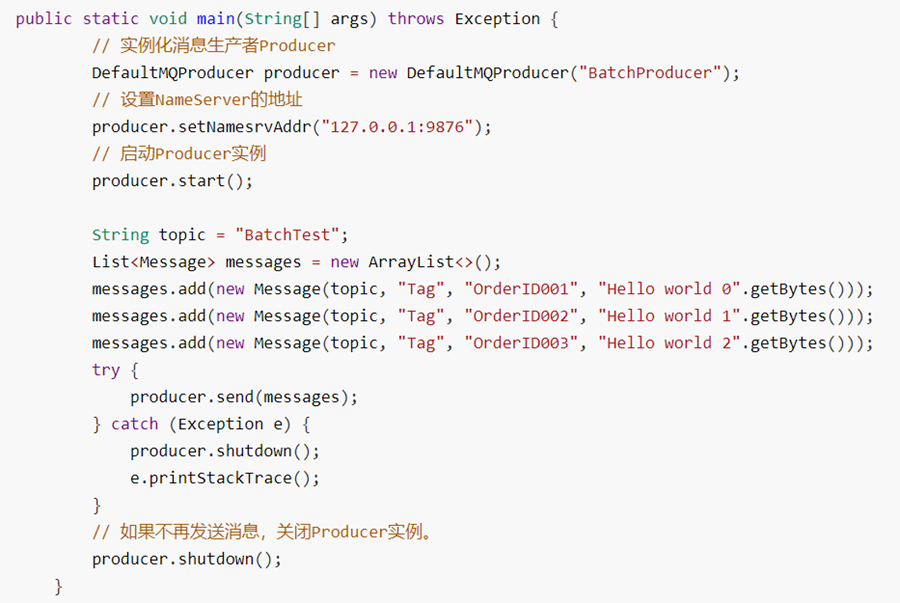

2. 批量切分发送

   如果消息的总长度可能大于 4MB 时，这时候最好把消息进行分割，案例中以 1M 大小进行消息分割。

   我们需要发送 10 万元素的数组，这个量很大，怎么快速发送完。使用批量发送，同时每一批控制在 1M 左右确保不超过消息大小限制。

   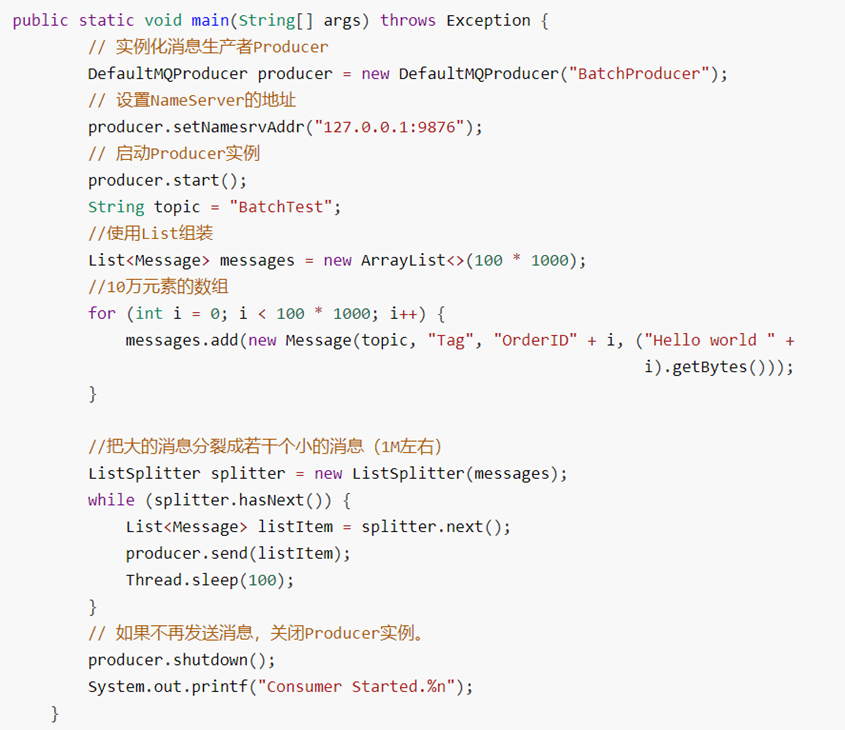

   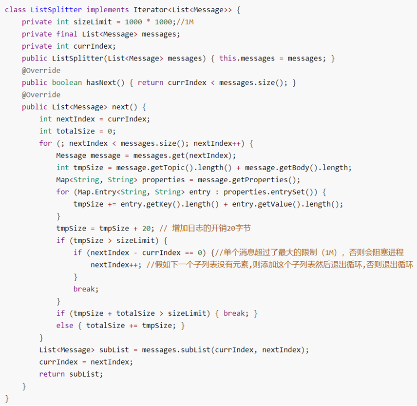

### 2.5 消息的过滤

在实际的开发应用中，对于一类消息尽可能使用一个 Topic 进行存储，但在消费时需要选择您想要的消息，这时可以使用 RocketMQ 的消息过滤功能，具体实现是利用消息的 Tag 和 Key。

Key 一般用于消息在业务层面的唯一标识。对发送的消息设置好 Key，以后可以根据这个 Key 来查找消息。比如消息异常，消息丢失，进行查找会很方便。RocketMQ 会创建专门的索引文件，用来存储 Key 与消息的映射，由于底层实现是 Hash 索引，应尽量使 Key 唯一，避免潜在的哈希冲突。

Tag 可以理解为是二级分类。以淘宝交易平台为例，订单消息和支付消息属于不同业务类型的消息，分别创建 OrderTopic 和 PayTopic，其中订单消息根据不同的商品品类以不同的 Tag 再进行细分，如手机类、家电类、男装类、女装类、化妆品类，最后它们都被各个不同的系统所接收。通过合理的使用 Topic 和 Tag，可以让业务结构清晰，更可以提高效率。

Key 和 Tag 的主要差别是使用场景不同，Key 主要用于通过命令行命令查询消息，而 Tag 用于在消息端的代码中，用来进行服务端消息过滤。

使用 Key 一般使用`mqadmin`管理工具，具体位置在 RocketMQ/bin 目录下。具体文档见：https://github.com/apache/rocketmq/blob/master/docs/cn/operation.md 

#### 1.Tag过滤

使用 Tag 过滤的方式是在消息生产时传入感兴趣的 Tag 标签，然后在消费端就可以根据 Tag 来选择您想要的消息。具体的操作是在创建 Message 的时候添加，一个 Message 只能有一个 Tag。

**使用案例**

生产者发送 60 条消息，分别打上三种 tag 标签。

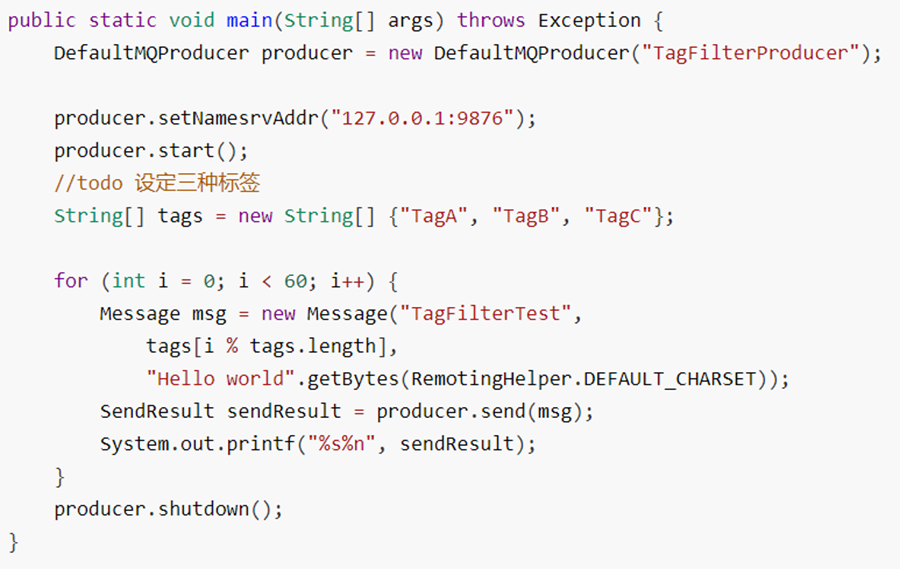

消费者消费时只选择 TagA 和 TagB 的消息。

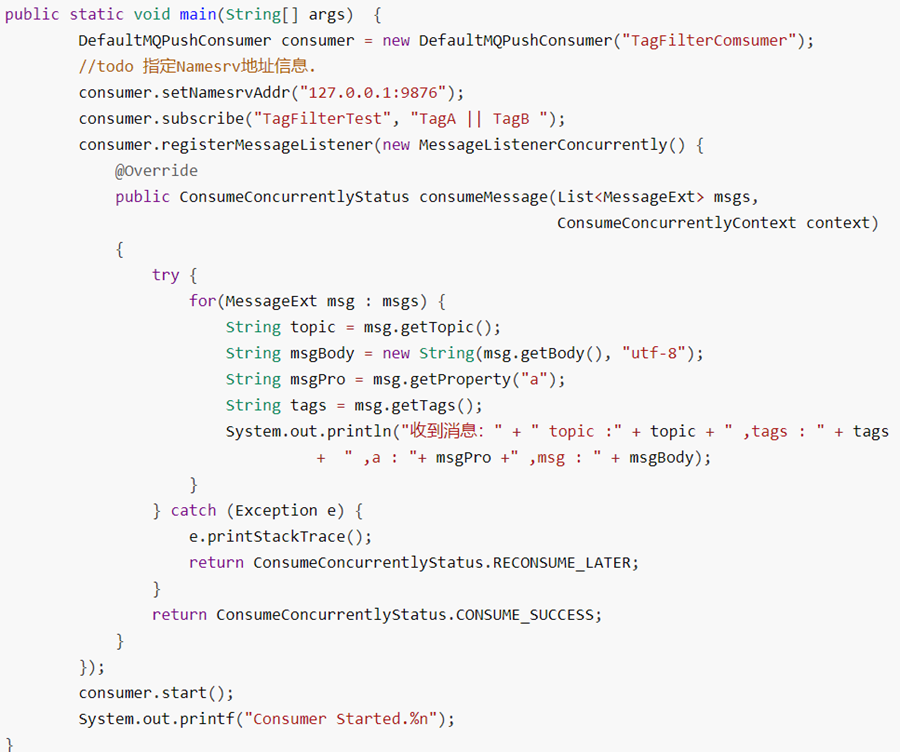

**注意事项**

Tag 过滤的形式非常简单，`||`代表或、`*`代表所有，所以使用 Tag 过滤这对于复杂的场景可能不起作用。在这种情况下，可以使用 SQL 表达式筛选消息。

#### 2.Sql过滤

SQL 特性可以通过发送消息时的属性来进行消息的过滤计算。具体的操作是使用 SQL92 标准的 sql 语句，前提是只有使用 push 模式的消费者才能用（消费的模式就是 push）

**SQL基本语法**

- 数值比较：比如：>，>=，<，<=，BETWEEN，=

- 字符比较：比如：=，<>，IN

- IS NULL 或者 IS NOT NULL
- 逻辑符号：AND，OR，NOT
- 常量支持类型为：
  - 数值，比如：123，3.1415
  - 字符，比如：'abc'，必须用单引号包裹起来
  - NULL，特殊的常量
  - 布尔值，TRUE 或 FALSE

**注意事项**

Sql 过滤需要 Broker 开启这项功能（如果消费时使用 SQL 过滤抛出异常错误，说明 Sql92 功能没有开启），需要修改 Broker.conf 配置文件。加入`enablePropertyFilter=true`然后重启 Broker 服务。

**使用案例**

消息生产者，发送消息时加入消息属性，你能通过 putUserProperty 来设置消息的属性，以下案例中生产者发送 10 条消息，除了设置 Tag 之外，另外设置属性 a 的值。

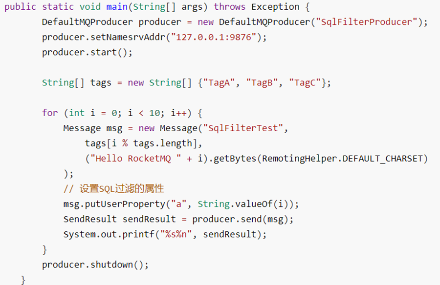

用`MessageSelector.bySql`来使用 sql 筛选消息：

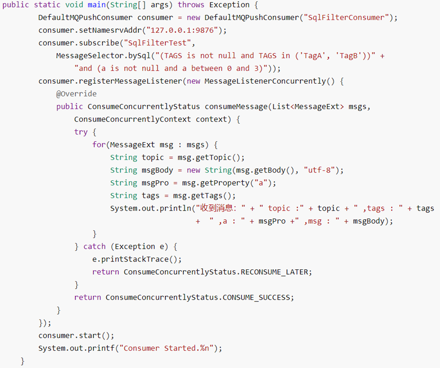

消费结果：按照 Tag 和 SQL 过滤消费 3 条消息。

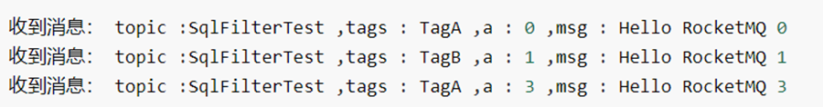