# 第5章_RocketMQ的高可用

## 1.RocketMQ中的高可用机制

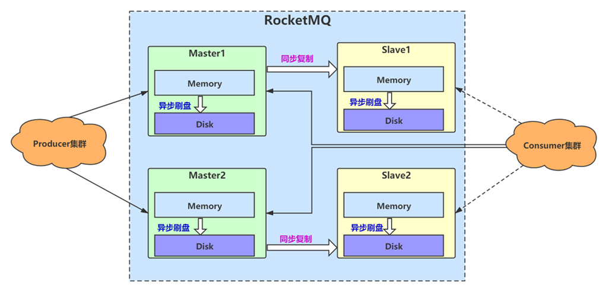

RocketMQ 分布式集群是通过 Master 和 Slave 的配合达到高可用性的。

Master 和 Slave 的区别：在 Broker 的配置文件中，参数 brokerId 的值为`0`表明这个 Broker 是 Master，大于 0 表明这个 Broker 是 Slave，同时 brokerRole 参数也会说明这个 Broker 是 Master 还是 Slave。

`Master`角色的 Broker 支持`读`和`写`，`Slave`角色的 Broker 仅支持`读`，也就是 Producer 只能和 Master 角色的 Broker 连接写入消息；Consumer 可以连接 Master 角色的 Broker，也可以连接 Slave 角色的 Broker 来读取消息。

### 1.1 集群部署模式

#### 1.单master模式

也就是只有一个 master 节点，称不上是集群，一旦这个 master 节点宕机，那么整个服务就不可用。

##### 1）启动NameServer

```bash
### 首先启动Name Server
$ nohup sh mqnamesrv &
 
### 验证Name Server 是否启动成功
$ tail -f ~/logs/rocketmqlogs/namesrv.log
The Name Server boot success...
```

##### 2）启动Broker

```bash
### 启动Broker
$ nohup sh bin/mqbroker -n localhost:9876 &

### 验证Broker是否启动成功，例如Broker的IP为：192.168.1.2，且名称为broker-a
$ tail -f ~/logs/rocketmqlogs/broker.log 
The broker[broker-a, 192.169.1.2:10911] boot success...
```

#### 2.多master模式

一个集群无 Slave，全是 Master，例如 2 个 Master 或者 3 个 Master，这种模式的优缺点如下：

- 优点：配置简单，单个 Master 宕机或重启维护对应用无影响，在磁盘配置为 RAID10 时，即使机器宕机不可恢复情况下，由于 RAID10 磁盘非常可靠，消息也不会丢（异步刷盘丢失少量消息，同步刷盘一条不丢），性能最高
- 缺点：单台机器宕机期间，这台机器上未被消费的消息在机器恢复之前不可订阅，消息实时性会受到影响

##### 1）启动NameServer

NameServer 需要先于 Broker 启动，且如果在生产环境使用，为了保证高可用，建议一般规模的集群启动 3 个 NameServer，各节点的启动命令相同，如下：

```bash
### 首先启动Name Server
$ nohup sh mqnamesrv &
 
### 验证Name Server 是否启动成功
$ tail -f ~/logs/rocketmqlogs/namesrv.log
The Name Server boot success...
```

##### 2）启动Broker集群

```bash
### 在机器A，启动第一个Master，例如NameServer的IP为：192.168.1.1
$ nohup sh mqbroker -n 192.168.1.1:9876 -c $ROCKETMQ_HOME/conf/2m-noslave/broker-a.properties &
 
### 在机器B，启动第二个Master，例如NameServer的IP为：192.168.1.1
$ nohup sh mqbroker -n 192.168.1.1:9876 -c $ROCKETMQ_HOME/conf/2m-noslave/broker-b.properties &
...
```

如上启动命令是在单个 NameServer 情况下使用的。对于多个 NameServer 的集群，Broker 启动命令中`-n`后面的地址列表用分号隔开即可，例如 `192.168.1.1:9876;192.161.2:9876`。

#### 3.多master多slave异步复制模式

每个 Master 配置一个 Slave，有多对 Master-Slave，HA 采用异步复制方式，主备有短暂消息延迟（毫秒级），这种模式的优缺点如下：

- 优点：即使磁盘损坏，消息丢失的非常少，且消息实时性不会受影响，同时 Master 宕机后，消费者仍然可以从 Slave 消费，而且此过程对应用透明，不需要人工干预，性能同多 Master 模式几乎一样
- 缺点：Master 宕机，磁盘损坏情况下会丢失少量消息

##### 1）启动NameServer

```bash
### 首先启动 Name Server
$ nohup sh mqnamesrv &
 
### 验证 Name Server 是否启动成功
$ tail -f ~/logs/rocketmqlogs/namesrv.log
The Name Server boot success...
```

##### 2）启动Broker集群

```bash
### 在机器A，启动第一个Master，例如NameServer的IP为：192.168.1.1
$ nohup sh mqbroker -n 192.168.1.1:9876 -c $ROCKETMQ_HOME/conf/2m-2s-async/broker-a.properties &
 
### 在机器B，启动第二个Master，例如NameServer的IP为：192.168.1.1
$ nohup sh mqbroker -n 192.168.1.1:9876 -c $ROCKETMQ_HOME/conf/2m-2s-async/broker-b.properties &
 
### 在机器C，启动第一个Slave，例如NameServer的IP为：192.168.1.1
$ nohup sh mqbroker -n 192.168.1.1:9876 -c $ROCKETMQ_HOME/conf/2m-2s-async/broker-a-s.properties &
 
### 在机器D，启动第二个Slave，例如NameServer的IP为：192.168.1.1
$ nohup sh mqbroker -n 192.168.1.1:9876 -c $ROCKETMQ_HOME/conf/2m-2s-async/broker-b-s.properties &
```

#### 4.多master多slave主从同步复制（推荐异步刷盘）

每个 Master 配置一个 Slave，有多对 Master-Slave，HA 采用同步双写方式，即只有主备都写成功，才向应用返回成功，这种模式的优缺点如下：

- 优点：数据与服务都无单点故障，Master 宕机情况下，消息无延迟，服务可用性与数据可用性都非常高；
- 缺点：性能比异步复制模式略低（大约低 10% 左右），发送单个消息的 RT 会略高，且目前版本在主节点宕机后，备机不能自动切换为主机。

##### 1）启动NameServer

```bash
### 首先启动Name Server
$ nohup sh mqnamesrv &
 
### 验证Name Server 是否启动成功
$ tail -f ~/logs/rocketmqlogs/namesrv.log
The Name Server boot success...
```

##### 2）启动Broker集群

```bash
### 在机器A，启动第一个Master，例如NameServer的IP为：192.168.1.1
$ nohup sh mqbroker -n 192.168.1.1:9876 -c $ROCKETMQ_HOME/conf/2m-2s-sync/broker-a.properties &
 
### 在机器B，启动第二个Master，例如NameServer的IP为：192.168.1.1
$ nohup sh mqbroker -n 192.168.1.1:9876 -c $ROCKETMQ_HOME/conf/2m-2s-sync/broker-b.properties &
 
### 在机器C，启动第一个Slave，例如NameServer的IP为：192.168.1.1
$ nohup sh mqbroker -n 192.168.1.1:9876 -c $ROCKETMQ_HOME/conf/2m-2s-sync/broker-a-s.properties &
 
### 在机器D，启动第二个Slave，例如NameServer的IP为：192.168.1.1
$ nohup sh mqbroker -n 192.168.1.1:9876 -c $ROCKETMQ_HOME/conf/2m-2s-sync/broker-b-s.properties &
```

以上 Broker 与 Slave 配对是通过指定相同的 BrokerName 参数来配对，Master 的 BrokerId 必须是 0，Slave 的 BrokerId 必须是大于 0 的数。另外一个 Master 下面可以挂载多个 Slave，同一 Master 下的多个 Slave 通过指定不同的 BrokerId 来区分。$ROCKETMQ_HOME 指的 RocketMQ 安装目录，需要用户自己设置此环境变量。

#### Dlegder（不推荐）

在 RocketMQ4.5 版本之后推出了 Dlegder 模式，但是这种模式一直存在严重的 BUG，同时性能有可能有问题，包括升级到了 4.8 的版本后也一样，所以目前不讲这种模式。（类似于 Zookeeper 的集群选举模式）

### 1.2 刷盘与主从同步

生产时首先将消息写入到 MappedFile，内存映射文件，然后根据刷盘策略刷写到磁盘。

大致的步骤可以理解成使用`MMAP`中的`MappedByteBuffer`中实际用`flip()`。

```java
public static void main(String[] args) throws IOException {
    File file = new File("./", "1");
    FileChannel fileChannel = new RandomAccessFile(file, "rw").getChannel();
    MappedByteBuffer mmap = fileChannel.map(FileChannel.MapMode.READ_WRITE, 0, 4);
    mmap.put("king".getBytes());
    // 刷新写入磁盘（刷盘）
    mmap.flip();
    byte[] bb = new byte[4];
    mmap.get(bb, 0, 4);
    System.out.println(new String(bb));
    fileChannel.close();
}
```

RocketMQ 的刷盘是把消息存储到磁盘上的，这样既能保证断电后恢复， 又可以让存储的消息量超出内存的限制。RocketMQ 为了提高性能，会尽可能地保证磁盘的顺序写。消息在通过 Producer 写入 RocketMQ 的时候，有两种写磁盘方式，同步刷盘和异步刷盘。

#### 1.同步刷盘

`SYNC_FLUSH`：生产者发送的每一条消息都在保存到磁盘成功后才返回告诉生产者成功。这种方式不会存在消息丢失的问题，但是有很大的磁盘 IO 开销，性能有一定影响。

#### 2.异步刷盘

`ASYNC_FLUSH`：生产者发送的每一条消息并不是立即保存到磁盘，而是暂时缓存起来，然后就返回生产者成功。随后再异步的将缓存数据保存到磁盘，有两种情况：

- 定期将缓存中更新的数据进行刷盘

- 当缓存中更新的数据条数达到某一设定值后进行刷盘

这种异步的方式会存在消息丢失（在还未来得及同步到磁盘的时候宕机），但是性能很好。默认是这种模式。

```bash
brokerClusterName=DefaultCluster
brokerName=broker-a
brokerId=0
deleteWhen=04
fileReservedTime=48
brokerRole=SYNC_MASTER
flushDiskType=ASYNC_FLUSH
```

4.8.0 版本中默认值下是异步刷盘，如下图：

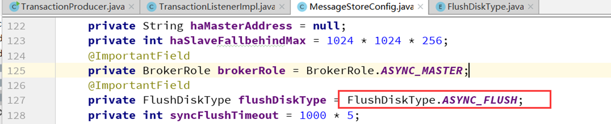

#### 3.主从同步复制

集群环境下需要部署多个 Broker，Broker 分为两种角色：一种是 master，即可以写也可以读，其 brokerId=0，只能有一个；另外一种是 slave，只允许读，其 brokerId 为非 0。多个 master 与多个 slave 通过指定相同的 brokerClusterName 被归为一个 broker 集群。通常生产环境中，我们至少需要 2 个集群。slave 是复制 master 的数据。一个 Broker 组有 Master 和 Slave，消息需要从 Master 复制到 Slave 上，有同步和异步两种复制方式。

主从同步复制方式（**Sync Broker**）：生产者发送的每一条消息都至少同步复制到一个 slave 后才返回告诉生产者成功，即`同步双写`,

在同步复制方式下，如果 Master 出故障， Slave 上有全部的备份数据，容易恢复，但是同步复制会增大数据写入延迟，降低系统吞吐量。

#### 4.主从异步复制

主从异步复制方式（**Async Broker**）：生产者发送的每一条消息只要写入 master 就返回告诉生产者成功。然后再`异步复制`到 slave。

在异步复制方式下，系统拥有较低的延迟和较高的吞吐量，但是如果 Master 出了故障，有些数据因为没有被写入 Slave，有可能会丢失。

同步复制和异步复制是通过 Broker 配置文件里的 brokerRole 参数进行设置的，这个参数可以被设置成`ASYNC_MASTER`、`SYNC_MASTER`、`SLAVE`三个值中的一个。

### 1.3 配置参数及意义

```bash
# 代表主
brokerId=0
# 代表从（大于0都代表从）
brokerId=1
# 同步复制（主从）
brokerRole=SYNC_MASTER
# 异步复制（主从）
brokerRole=ASYNC_MASTER
# 同步刷盘
flushDiskType=SYNC_FLUSH
# 异步刷盘
flushDiskType=ASYNC_FLUSH
```

### 1.4 搭建双主双从同步复制+异步刷盘

#### 1.NameServer集群

106.55.246.66     

94.191.83.120

#### 2.Broker服务器

|  类型   |       IP       |
| :-----: | :------------: |
| MasterA | 106.55.246.66  |
| MasterB | 94.191.83.120  |
| SlaveA  | 106.53.195.121 |
| SlaveB  | 106.55.248.74  |

#### 3.配置文件

注意，因为 RocketMQ 使用外网地址，所以配置文件`MQ文件夹/conf/2m-2s-sync/`需要修改（同时修改 nameserver 地址为集群地址）。

注意如果机器内存不够，建议把启动时的堆内存改小。

106.55.246.66 》MasterA   

`broker-a.properties`增加：`brokerIP1=106.55.246.66`&`namesrvAddr=106.55.246.66:9876;94.191.83.120:9876`

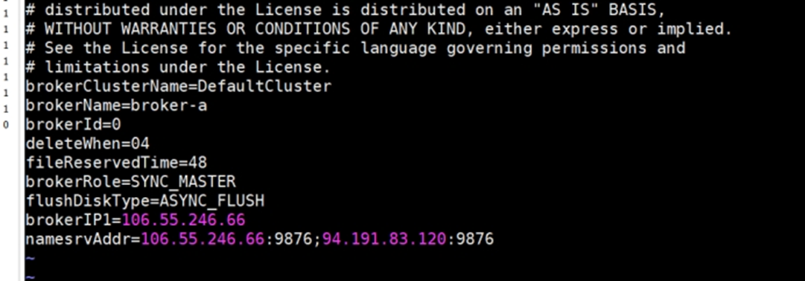

94.191.83.120》MasterB

`broker-b.properties`增加：`brokerIP1=94.191.83.120`&`namesrvAddr=106.55.246.66:9876;94.191.83.120:9876`

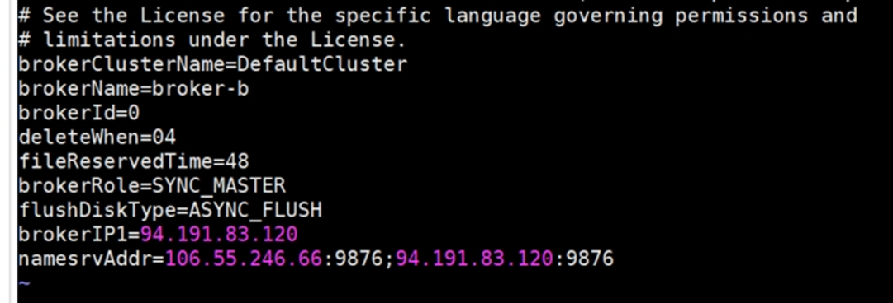

106.53.195.121》SlaveA

`broker-a-s.properties`增加：`brokerIP1=106.53.195.121`&`namesrvAddr=106.55.246.66:9876;94.191.83.120:9876`

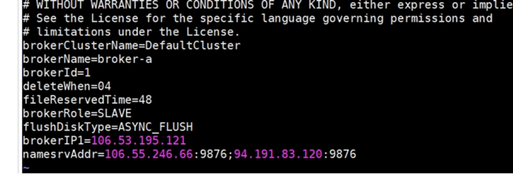

106.55.248.74》从B

`broker-b-s.properties`增加：`brokerIP1=106.55.248.74`&`namesrvAddr=106.55.246.66:9876;94.191.83.120:9876`

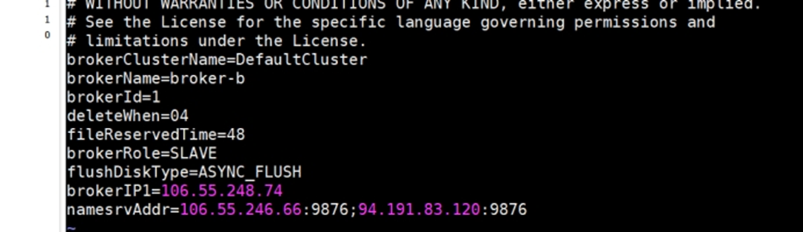

 不管是主还是从，如果属于一个集群，**使用相同的 brokerClusterName 名称**：

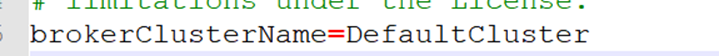

#### 4.启动步骤

##### I 启动NameServer

（记得关闭防火墙或者要开通 9876 端口）

启动 NameServer 集群，这里使用 106.55.246.66 和 94.191.83.120 两台作为集群即可。

- 在机器 A，启动第 1 台 NameServer：102 服务器进入至`MQ 文件夹/bin`下：然后执行

  ```bash
  nohup sh mqnamesrv &
  ```

  查看日志

  ```bash
  tail -f ~/logs/rocketmqlogs/namesrv.log
  ```

-  在机器 B，启动第 2 台 NameServer：103 服务器进入至`MQ文件夹/bin`下：然后执行相同命令

##### II 启动Broker

启动双主双从同步集群，顺序是先启动主，然后启动从。

- 启动主 A：102 服务器进入至`MQ文件夹/bin`下：执行以下命令（`autoCreateTopicEnable=true`测试环境开启，生产环境建议关闭）：

  ```bash
  nohup sh mqbroker -c ../conf/2m-2s-sync/broker-a.properties autoCreateTopicEnable=true &
  ```

- 查看日志启动成功

- 启动主 B：103 服务器进入至`MQ文件夹\bin`下执行命令并查看是否启动成功

- 启动从 A：104 服务器

- 启动从 B：105 服务器

如果是要启动控制台，则需要重新打包：

进入`\rocketmq-console\src\main\resources`文件夹，打开`application.properties`进行配置。（多个 NameServer 使用`;`分隔）

```bash
rocketmq.config.namesrvAddr=106.55.246.66:9876;94.191.83.120:9876
```

进入父级`\rocketmq-externals\rocketmq-console`文件夹，执行`mvn clean package -Dmaven.test.skip=true`，编译生成。

在把编译后的 jar 包丢上服务器：

```bash
nohup java -jar rocketmq-console-ng-2.0.0.jar &
```

进入控制台[http://106.55.246.66:8089/#/cluster](#/cluster)

集群搭建成功。

## 2.消息生产的高可用机制

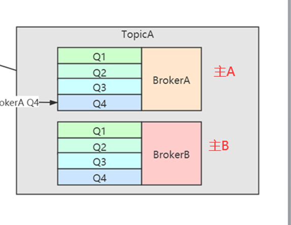

在创建 Topic 的时候，把 Topic 的多个 Message Queue 创建在多个 Broker 组上（相同 Broker 名称，不同 brokerId 的机器组成一个 Broker 组），这样当一个 Broker 组的 Master 不可用后，其他组的 Master 仍然可用，Producer 仍然可以发送消息。

RocketMQ 目前不支持把 Slave 自动转成 Master，如果机器资源不足， 需要把 Slave 转成 Master，则要手动停止 Slave 角色的 Broker，更改配置文件，用新的配置文件启动 Broker。（跟 RabbitMQ 相同）

### 2.1 高可用消息生产流程

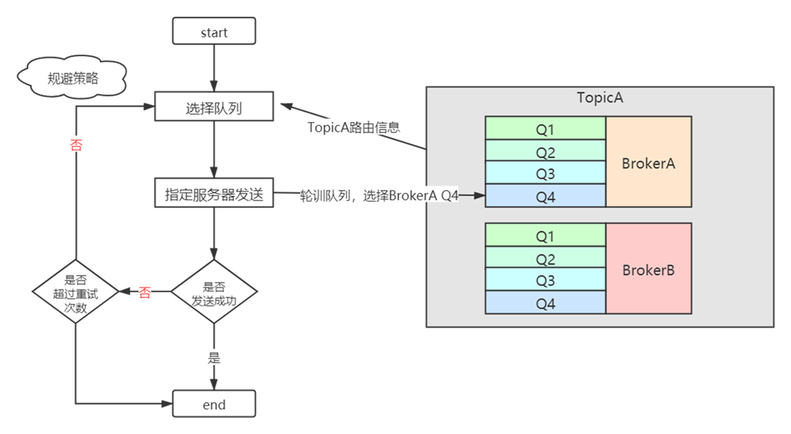

1. TopicA 创建在双主中，BrokerA 和 BrokerB 中，每一个 Broker 中有 4 个队列

2. 选择队列时默认是使用轮训的方式，比如发送一条消息 A 时，选择 BrokerA 中的 Q4

3. 如果发送成功，消息 A 发结束

4. 如果消息发送失败，默认会采用重试机制

   ```java
   // 同步模式下内部尝试发送消息的最大次数  默认值是2
   producer.setRetryTimesWhenSendFailed(2);
   // 异步模式下内部尝试发送消息的最大次数 默认值是2
   producer.setRetryTimesWhenSendAsyncFailed(2);
   ```

5. 如果发生了消息发送失败，这里有一个规避策略（默认配置）：

   ```java
   // 默认 false
   producer.setSendLatencyFaultEnable(true);
   ```
   
   设置为`false`：默认值，不开启，延迟规避策略只在重试时生效，例如在一次消息发送过程中如果遇到消息发送失败，规避 broekr-a，但是在下一次消息发送时，即再次调用 DefaultMQProducer 的 send 方法发送消息时，还是会选择 broker-a 的消息进行发送，只要继续发送失败后，重试时才会规避 broker-a。
   
   设置为`true`：开启延迟规避机制，一旦消息发送失败会将 broker-a “悲观”地认为在接下来的一段时间内该 Broker 不可用，在为未来某一段时间内所有的客户端不会向该 Broker 发送消息。这个延迟时间就是通过 notAvailableDuration、latencyMax 共同计算的，首先先计算本次消息发送失败所耗的时延，然后对应 latencyMax 中哪个区间，即计算在 latencyMax 的下标，然后返回 notAvailableDuration 同一个下标对应的延迟值。
   
   > 温馨提示：如果所有的 Broker 都触发了故障规避，并且 Broker 只是那一瞬间压力大，那岂不是明明存在可用的 Broker，但经过你这样规避，反倒是没有 Broker 可用来，那岂不是更糟糕了？针对这个问题，会退化到队列轮循机制，即不考虑故障规避这个因素，按自然顺序进行选择进行兜底。
   
   为什么会默认这么设计？
   
   - 某一时间段，从 NameServer 中读到的路由中包含了不可用的主机
   - 不正常的路由信息也是只是一个短暂的时间而已
   - 生产者每隔 30s 更新一次路由信息，而 NameServer 认为 broker 不可用需要经过 120s。

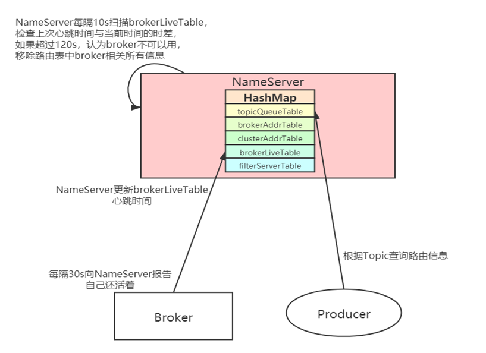

所以生产者要发送时认为 broker 不正常（从 NameServer 拿到）和实际 Broker 不正常有延迟。

## 3.消息消费的高可用机制

### 3.1 主从的高可用原理

在 Consumer 的配置文件中，并不需要设置是从 Master 读还是从 Slave 读，当 Master 不可用或者繁忙的时候，Consumer 会被自动切换到从 Slave 读。有了自动切换 Consumer 这种机制，当一个 Master 角色的机器出现故障后，Consumer 仍然可以从 Slave 读取消息，不影响 Consumer 程序。这就达到了消费端的高可用性。

Master 不可用这个很容易理解，那什么是 Master 繁忙呢？

这个繁忙其实是 RocketMQ 服务器的内存不够导致的。

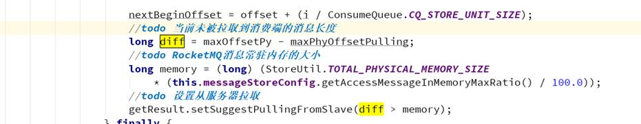

当前需要拉取的消息已经超过常驻内存的大小，表示主服务器繁忙，此时才建议从从服务器拉取。

### 3.2 消息消费的重试

消费端如果发生消息失败，没有提交成功，消息默认情况下会进入重试队列中。


**注意重试队列的名字其实是跟消费群组有关，不是主题，因为一个主题可以有多个群组消费，所以要注意**


#### 1.顺序消息的重试

对于顺序消息，当消费者消费消息失败后，消息队列 RocketMQ 会自动不断进行消息重试（每次间隔时间为 1 秒），这时，应用会出现消息消费被阻塞的情况。因此，在使用顺序消息时，务必保证应用能够及时监控并处理消费失败的情况，避免阻塞现象的发生。

#### 2.无序消息的重试

对于无序消息（普通、定时、延时、事务消息），当消费者消费消息失败时，您可以通过设置返回状态达到消息重试的结果。无序消息的重试只针对集群消费方式生效；广播方式不提供失败重试特性，即消费失败后，失败消息不再重试，继续消费新的消息。

#### 3.重试次数

| **第几次重试** | **与上次重试的间隔时间** | **第几次重试** | **与上次重试的间隔时间** |
| -------------- | ------------------------ | -------------- | ------------------------ |
| 1              | 10 秒                    | 9              | 7 分钟                   |
| 2              | 30 秒                    | 10             | 8 分钟                   |
| 3              | 1 分钟                   | 11             | 9 分钟                   |
| 4              | 2 分钟                   | 12             | 10 分钟                  |
| 5              | 3 分钟                   | 13             | 20 分钟                  |
| 6              | 4 分钟                   | 14             | 30 分钟                  |
| 7              | 5 分钟                   | 15             | 1 小时                   |
| 8              | 6 分钟                   | 16             | 2 小时                   |

如果消息重试 16 次后仍然失败，消息将不再投递。如果严格按照上述重试时间间隔计算，某条消息在一直消费失败的前提下，将会在接下来的 4 小时 46 分钟之内进行 16 次重试，超过这个时间范围消息将不再重试投递。

注意： 一条消息无论重试多少次，这些重试消息的 Message ID 不会改变。

#### 4.重试配置

集群消费方式下，消息消费失败后期望消息重试，需要在消息监听器接口的实现中明确进行配置（三种方式任选一种）：

- 返回 RECONSUME_LATER （推荐）
- 返回 Null
- 抛出异常


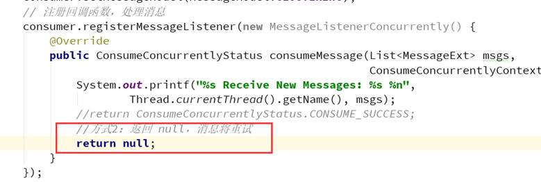


集群消费方式下，消息失败后期望消息不重试，需要捕获消费逻辑中可能抛出的异常，最终返回 CONSUME_SUCCESS，此后这条消息将不会再重试。

#### 5.自定义消息最大重试次数

消息队列 RocketMQ 允许 Consumer 启动的时候设置最大重试次数，重试时间间隔将按照如下策略：

- 最大重试次数小于等于 16 次，则重试时间间隔同上表描述

- 最大重试次数大于 16 次，超过 16 次的重试时间间隔均为每次 2 小时

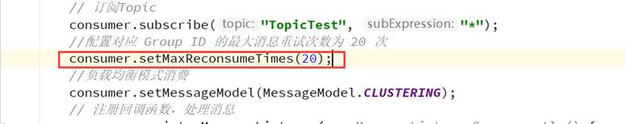

消息最大重试次数的设置对相同 Group ID 下的所有 Consumer 实例有效。

如果只对相同 Group ID 下两个 Consumer 实例中的其中一个设置了 MaxReconsumeTimes，那么该配置对两个 Consumer 实例均生效。

配置采用覆盖的方式生效，即最后启动的 Consumer 实例会覆盖之前的启动实例的配置。

### 3.3 死信队列

当一条消息初次消费失败，消息队列 RocketMQ 会自动进行消息重试；达到最大重试次数后，若消费依然失败，则表明消费者在正常情况下无法正确地消费该消息，此时，消息队列 RocketMQ 不会立刻将消息丢弃，而是将其发送到该消费者对应的特殊队列中。

在消息队列 RocketMQ 中，这种正常情况下无法被消费的消息称为死信消息（Dead-Letter Message），存储死信消息的特殊队列称为死信队列（Dead-Letter Queue）。

#### 1.死信特性

**死信消息具有以下特性：**

- 不会再被消费者正常消费
- 有效期与正常消息相同，均为 3 天，3 天后会被自动删除。因此，请在死信消息产生后的 3 天内及时处理

**死信队列具有以下特性：**

- 不会再被消费者正常消费
- 一个死信队列对应一个 Group ID， 而不是对应单个消费者实例
- 如果一个 Group ID 未产生死信消息，消息队列 RocketMQ 不会为其创建相应的死信队列
- 一个死信队列包含了对应 Group ID 产生的所有死信消息，不论该消息属于哪个 Topic

#### 2.查看死信消息

在控制台查询出现死信队列的主题信息


在消息界面根据主题查询死信消息

选择重新发送消息

一条消息进入死信队列，意味着某些因素导致消费者无法正常消费该消息，因此，通常需要您对其进行特殊处理。排查可疑因素并解决问题后，可以在消息队列 RocketMQ 控制台重新发送该消息，让消费者重新消费一次。

## 4.负载均衡

### Producer负载均衡

Producer 端，每个实例在发消息的时候，默认会轮询所有的 message queue 发送，以达到让消息平均落在不同的 queue 上。而由于 queue 可以散落在不同的 broker，所以消息就发送到不同的 broker 下，如下图：

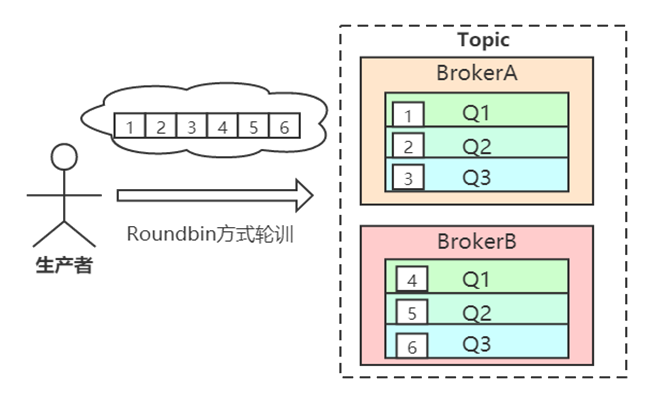

发布方会把第一条消息发送至 Queue 0，然后第二条消息发送至 Queue 1，以此类推。

### Consumer负载均衡

#### 4.1 集群模式

在集群消费模式下，每条消息只需要投递到订阅这个 topic 的 Consumer Group 下的一个实例即可。RocketMQ 采用主动拉取的方式拉取并消费消息，在拉取的时候需要明确指定拉取哪一条 message queue。

而每当实例的数量有变更，都会触发一次所有实例的负载均衡，这时候会按照 queue 的数量和实例的数量平均分配 queue 给每个实例。

默认的分配算法是`AllocateMessageQueueAveragely`。还有另外一种平均的算法是`AllocateMessageQueueAveragelyByCircle`，也是平均分摊每一条 queue，只是以环状轮流分 queue 的形式

如下图：

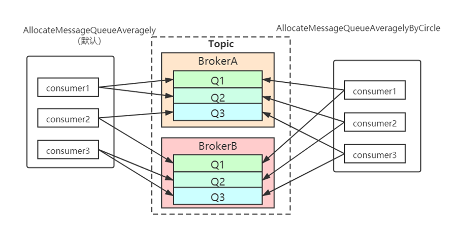

需要注意的是，集群模式下，queue 都是只允许分配一个实例，这是由于如果多个实例同时消费一个 queue 的消息，由于拉取哪些消息是 consumer 主动控制的，那样会导致同一个消息在不同的实例下被消费多次，所以算法上都是一个 queue 只分给一个 consumer 实例，一个 consumer 实例可以允许同时分到不同的 queue。

通过增加 consumer 实例去分摊 queue 的消费，可以起到水平扩展的消费能力的作用。而有实例下线的时候，会重新触发负载均衡，这时候原来分配到的 queue 将分配到其他实例上继续消费。

但是如果 consumer 实例的数量比 message queue 的总数量还多的话，多出来的 consumer 实例将无法分到 queue，也就无法消费到消息，也就无法起到分摊负载的作用了。所以需要控制**让 queue 的总数量大于等于 consumer 的数量**。

#### 4.2 广播模式

由于广播模式下要求一条消息需要投递到一个消费组下面所有的消费者实例，所以也就没有消息被分摊消费的说法。

在实现上，其中一个不同就是在 consumer 分配 queue 的时候，所有 consumer 都分到所有的 queue。

