# 第6章_RocketMQ的存储设计

## 1.Domain Model

领域模型（Domain Model）是对领域内的概念类或现实世界中对象的可视化表示。又称概念模型、领域对象模型、分析对象模型。它专注于分析问题领域本身，发掘重要的业务领域概念，并建立业务领域概念之间的关系。

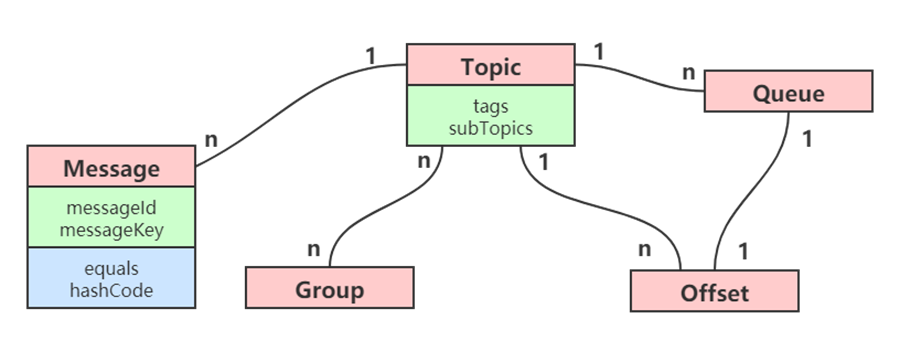

### 1.1 Message

Message 是 RocketMQ 消息引擎中的主体。messageId 是全局唯一的。MessageKey 是业务系统（生产者）生成的，所以如果要结合业务，可以使用 MessageKey 作为业务系统的唯一索引。

> 在某些情况下由于网络波动可能造成消息的重复发送，此时不建议通过 MessageKey 来保证幂等性，可以使用消息的`key`属性

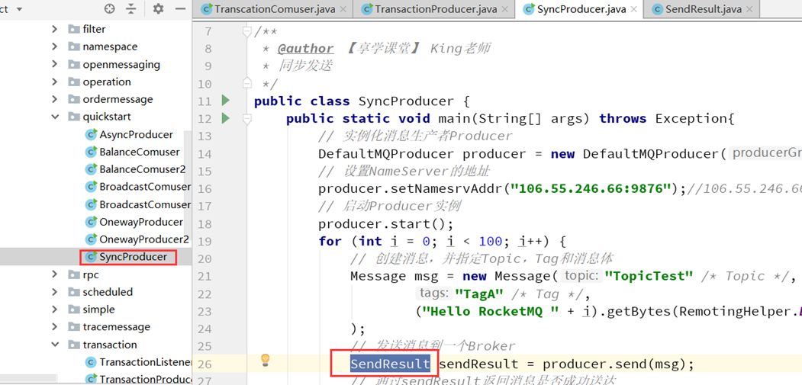

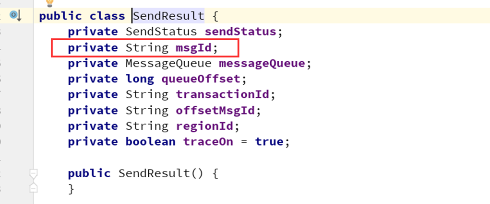

另外 Message 中的 equals 方法和 hashCode 主要是为了完成消息只处理一次（Exactly-Once）。

Exactly-Once 是指发送到消息系统的消息只能被消费端处理且仅处理一次，即使生产端重试消息发送导致某消息重复投递，该消息在消费端也只被消费一次。

### Topic

Tags 是在同一 Topic 中对消息进行分类。

subTopics==Message Queue，其实在内存逻辑中，subTopics 是对 Topics 的一个拓展，尤其是在 MQTT 这种协议下，在 Topic 底下会有很多 subTopics。

### Queue

Queue 是消息物理管理单位，比如在 RocketMQ 的控制台中，就可以看到每一个 queue 中的情况（比如消息的堆积情况、消息的 TPS、QPS）

### Offset

对于每一个 Queue 来说都有 Offset，这个是消费位点。

### Group

业务场景中，如果有一堆发送者，一堆消费者，所以这里使用 Group 的概念进行管理。

### 对应关系

- Message 与 Topic 是多对一的关系，一个 Topic 可以有多个 Message
- Topic 到 Queue 是一对多的关系，这个也是方便横向拓展，也就是消费的时候，这里可以有很多很多的 Queue
- 一个 Queue 只有一个消费位点 Offset，所以 Topic 和 Offset 也是一对多的关系
- Topic 和 Group 也是多对多的关系

### 消费并发度

从上面模型可以看出，要解决消费并发，就是要利用 Queue，一个 Topic 可以分出更多的 queue，每一个 queue 可以存放在不同的硬件上来提高并发。

### 热点问题(顺序、重复)

前面讲过要确保消息的顺序，生产者、队列、消费者最好都是一对一的关系。但是这样设计，并发度就会成为消息系统的瓶颈（并发度不够）。

RocketMQ 不解决这个矛盾的问题。理由如下：

- 乱序的应用实际大量存在
- 队列无序并不意味着消息无序

另外还有消息重复，造成消息重复的根本原因是：网络不可达（网络波动）。所以如果消费者收到两条一样的消息，应该是怎么处理？

RocketMQ 不保证消息不重复，如果你的业务要严格确保消息不重复，需要在自己的业务端进行去重。

- 消费端处理消息的业务逻辑保持幂等性

- 确保每一条消息都有唯一的编号且保证消息处理成功与去重表的日志同时出现（可以使用 key）

  ```java
  Message(String topic, String tags, String keys, byte[] body)；
  ```

## 2.消息存储结构

RocketMQ 因为有高可靠性的要求（宕机不丢失数据），所以数据要进行持久化存储。所以 RocketMQ 采用文件进行存储。

### 2.1 存储文件

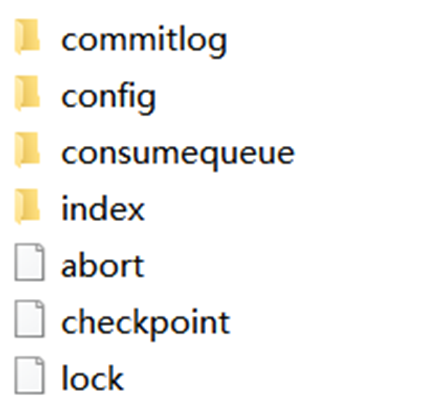

- `commitLog`：消息存储目录
- `config`：运行期间一些配置信息
- `consumequeue`：消息消费队列存储目录
- `index`：消息索引文件存储目录
- `abort`：如果存在改文件则 Broker 非正常关闭
- `checkpoint`：文件检查点，存储 CommitLog 文件最后一次刷盘时间戳、consumerqueue 最后一次刷盘时间，index 索引文件最后一次刷盘时间戳

### 2.2 消息存储结构

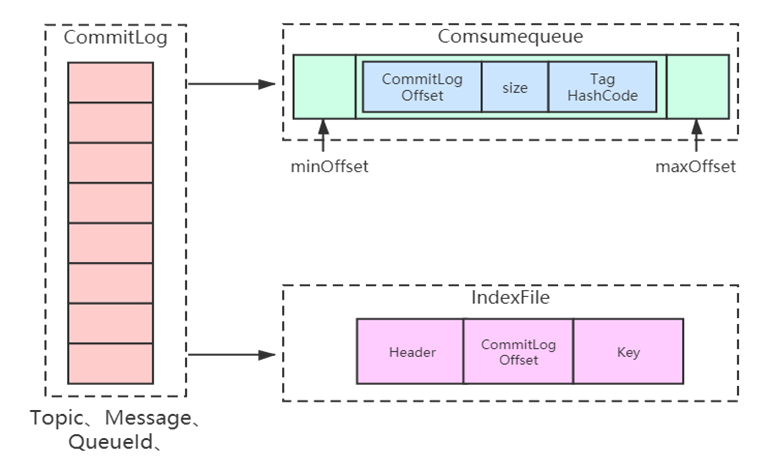

RocketMQ 消息的存储是由`ConsumeQueue`和`CommitLog`配合完成的，消息真正的**物理存储文件**是 CommitLog，ConsumeQueue 是消息的逻辑队列，类似数据库的索引文件，存储的是指向**物理存储的地址**。每 个 Topic 下的每个 Message Queue 都有一个对应的 ConsumeQueue 文件。

- `CommitLog`：存储消息的元数据
- `ConsumerQueue`：存储消息在 CommitLog 的索引
- `IndexFile`：为了消息查询提供了一种通过 key 或时间区间来查询消息的方法，这种通过 IndexFile 来查找消息的方法不影响发送与消费消息的主流程

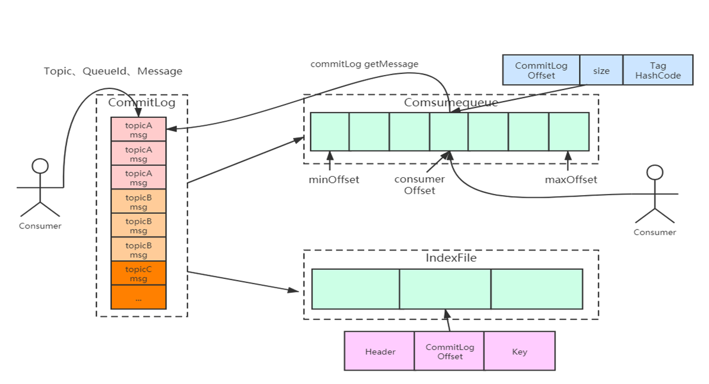

### 2.3 CommitLog

CommitLog 以物理文件的方式存放，每台 Broker 上的 CommitLog 被本机器所有 ConsumeQueue 共享，文件地址：`${user.home}\store\${commitlog}\${fileName}`。在 CommitLog 中，一个消息的存储长度是不固定的， RocketMQ 采取一些机制，尽量向 CommitLog 中顺序写 ，但是随机读。commitlog 文件默认大小为 lG ，可通过在 broker 置文件中设置 `mappedFileSizeCommitLog`属性来改变默认大小。

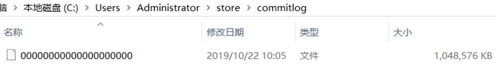

Commitlog 文件存储的逻辑视图如下，每条消息的前面 4 个字节存储该条消息的总长度。但是一个消息的存储长度是不固定的。

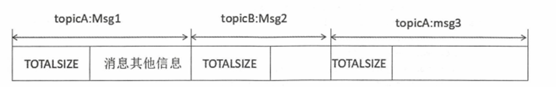

每个 CommitLog 文件的大小为 1G，一般情况下第一个 CommitLog 的起始偏移量为 0，第二个 CommitLog 的起始偏移量为 1073741824 （1G = 1073741824byte）。

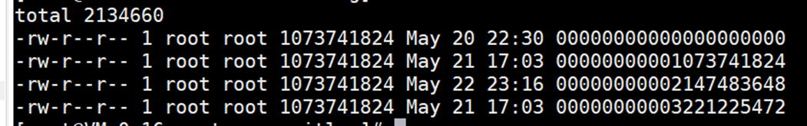

每台 Rocket 只会往一个 commitlog 文件中写，写完一个接着写下一个。

indexFile 和 ComsumerQueue 中都有消息对应的物理偏移量，通过物理偏移量就可以计算出该消息位于哪个 CommitLog 文件上。

### 2.4 ConsumeQueue

ConsumeQueue 是消息的逻辑队列，类似数据库的索引文件，存储的是指向物理存储的地址。每个 Topic 下的每个 Message Queue 都有一个对应的 ConsumeQueue 文件， 文件地址在`$ {$storeRoot}\consumequeue\${topicName}\${queueld}\${fileName}`。

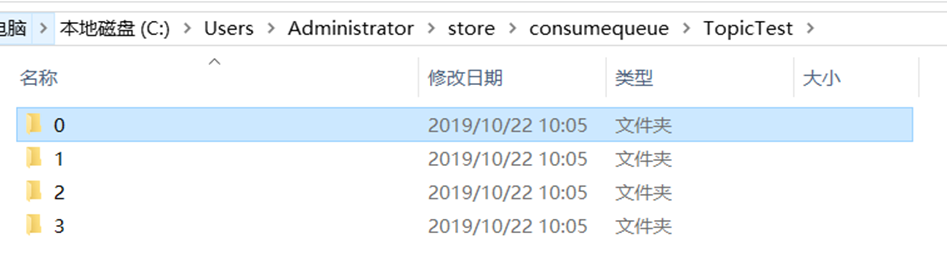


ConsumeQueue 中存储的是消息条目，为了加速 ConsumeQueue 消息条目的检索速度与节省磁盘空间，每一个 Consumequeue 条目不会存储消息的全量信息，消息条目如下：

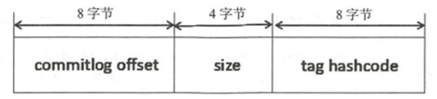

**ConsumeQueue 即为 Commitlog 文件的索引文件**， 其构建机制是当消息到达 Commitlog 文件后由专门的线程产生消息转发任务，从而构建消息消费队列文件（ConsumeQueue）与下文提到的索引文件。

存储机制这样设计有以下几个好处：

1. CommitLog 顺序写 ，可以大大提高写入效率。

   （实际上，磁盘有时候会比你想象的快很多，有时候也比你想象的慢很多，关键在如何使用，使用得当，磁盘的速度完全可以匹配上网络的数据传输速度。目前的高性能磁盘，顺序写速度可以达到600MB/s ，超过了一般网卡的传输速度，这是磁盘比想象的快的地方 但是磁盘随机写的速度只有大概 100KB/s，和顺序写的性能相差 6000 倍！）

2. 虽然是随机读，但是利用操作系统的 pagecache 机制，可以批量地从磁盘读取，作为 cache 存到内存中，加速后续的读取速度。
3. 为了保证完全的顺序写，需要 ConsumeQueue 这个中间结构 ，因为 ConsumeQueue 里只存偏移量信息，所以尺寸是有限的，在实际情况中，大部分的 ConsumeQueue 能够被全部读入内存，所以这个中间结构的操作速度很快，可以认为是内存读取的速度。此外为了保证 CommitLog 和 ConsumeQueue 的一致性， CommitLog 里存储了 Consume Queues、Message Key、 Tag 等所有信息，即使 ConsumeQueue 丢失，也可以通过 commitLog 完全恢复出来。

### 2.5 IndexFile

RocketMQ 还支持通过 MessageID 或者 MessageKey 来查询消息；使用 ID 查询时，因为 ID 就是用 broker+offset 生成的（这里 msgId 指的是服务端的），所以很容易就找到对应的 commitLog 文件来读取消息。但是对于用 MessageKey 来查询消息，RocketMQ 则通过构建一个 index 来提高读取速度。

index 存的是索引文件，这个文件用来加快消息查询的速度。消息消费队列 RocketMQ 专门为消息订阅构建的索引文件 ，提高根据主题与消息检索消息的速度 ，使用**Hash索引机制**，具体是 Hash 槽与 Hash 冲突的**链表结构**。（这里不做过多解释）

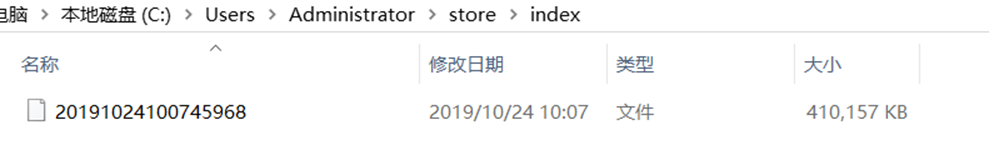

### 2.6 Config

config 文件夹中存储着 Topic 和 Consumer 等相关信息。主题和消费者群组相关的信息就存在在此。

- topics.json：topic 配置属性
- subscriptionGroup.json：消息消费组配置信息
- delayOffset.json：延时消息队列拉取进度
- consumerOffset.json：集群消费模式消息消进度
- consumerFilter.json：主题消息过滤信息

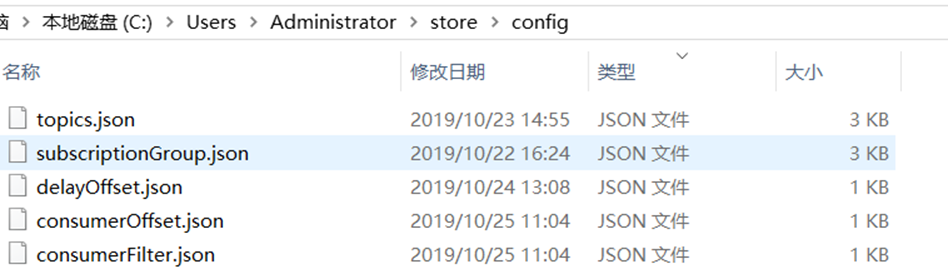

### 2.7 其他

abort：如果存在 abort 文件说明 Broker 非正常闭，该文件默认启动时创建，正常退出之前删除。

checkpoint：文件检测点，存储 commitlog 文件最后一次刷盘时间戳、 consumequeue 最后一次刷盘时间、 index 索引文件最后一次刷盘时间戳。

## 3.过期文件删除

由于 RocketMQ 操作 CommitLog、ConsumeQueue 文件是基于内存映射机制并在启动的时候会加载 commitlog，ConsumeQueue 目录下的所有文件，为了避免内存与磁盘的浪费，不可能将消息永久存储在消息服务器上，所以需要引入一种机制来删除己过期的文件。

删除过程分别执行清理**消息存储文件**（Commitlog）与消息消费队列文件（ConsumeQueue），消息消费队列文件与消息存储文件共用一套过期文件机制。

RocketMQ 清除过期文件的方法是 ：如果非当前写文件（该 log 文件已经超过 1G，当前使用新的 log 文件进行写操作）在一定时间间隔内没有再次被更新，则认为是过期文件，可以被删除， RocketMQ 不会关注这个文件上的消息是否全部被消费。默认每个文件的过期时间为 42 小时（不同版本的默认值不同，这里以 4.4.0 为例），通过在 Broker 配置文件中设置`fileReservedTime`来改变过期时间，单位为小时。

触发文件清除操作的是一个定时任务，而且只有定时任务，文件过期删除定时任务的周期由该删除决定，默认每 10s 执行一次。

### 3.1 过期判断

文件删除主要是由`fileReservedTime`文件保留时间这个配置属性决定。也就是从最后一次更新时间到现在，如果超过了该时间，则认为是过期文件， 可以删除。

另外还有其他两个配置参数：

1. `deletePhysicFilesInterval`：删除物理文件的时间间隔（默认是 100MS），在一次定时任务触发时，可能会有多个物理文件超过过期时间可被删除，因此删除一个文件后需要间隔`deletePhysicFilesInterval`这个时间再删除另外一个文件，由于删除文件是一个非常耗费 IO 的操作，会引起消息插入消费的延迟（相比于正常情况下），所以不建议直接删除所有过期文件。

2. `destroyMapedFileIntervalForcibly`：在删除文件时，如果该文件还被线程引用，此时会阻止此次删除操作，同时将该文件标记不可用并且纪录当前时间戳，destroyMapedFileIntervalForcibly 表示文件在第一次删除拒绝后，文件保存的最大时间，在此时间内一直会被拒绝删除，当超过这个时间时，会将引用每次减少 1000，直到引用小于等于 0 为止，即可删除该文件。

### 3.2 删除条件

1. 指定删除文件的时间点， RocketMQ 通过`deleteWhen`设置一天的固定时间执行一次。删除过期文件操作，默认为凌晨 4 点。
2. 磁盘空间是否充足，如果磁盘空间不充足（`DiskSpaceCleanForciblyRatio`：磁盘空间强制删除文件水位，默认是 85，即系统空间的 85%），会触发过期文件删除操作。

另外还有 RocketMQ 的磁盘配置参数：

1. 物理使用率大于`diskSpaceWarningLevelRatio`（默认 90% 可通过参数设置），则会阻止新消息的插入。
2. 物理磁盘使用率小于`diskMaxUsedSpaceRatio`（默认 75%）表示磁盘使用正常。

## 4.零拷贝与MMAP

### 什么是零拷贝?

零拷贝（英语：Zero-copy）技术是指计算机执行操作时，CPU 不需要先将数据从某处内存复制到另一个特定区域。这种技术通常用于通过网络传输文件时节省 CPU 周期和内存带宽。

- 零拷贝技术可以减少数据拷贝和共享总线操作的次数，消除传输数据在存储器之间不必要的中间拷贝次数，从而有效地提高数据传输效率
- 零拷贝技术减少了用户进程地址空间和内核地址空间之间因为上下文切换而带来的开销

可以看出没有说不需要拷贝，只是说减少冗余的拷贝。

下面这些组件、框架中均使用了零拷贝技术：Kafka、Netty、Rocketmq、Nginx、Apache。

### 传统数据传送机制

比如：读取文件，再用 socket 发送出去，实际经过四次 copy。

伪码实现如下：

```java
buffer = File.read() 
Socket.send(buffer)
```

第一次：将磁盘文件，读取到操作系统内核缓冲区；

第二次：将内核缓冲区的数据，copy 到应用程序的 buffer；

第三步：将应用程序 buffer 中的数据，copy 到 socket 网络发送缓冲区（属于操作系统内核的缓冲区）；

第四次：将 socket buffer 的数据，copy 到网卡，由网卡进行网络传输。

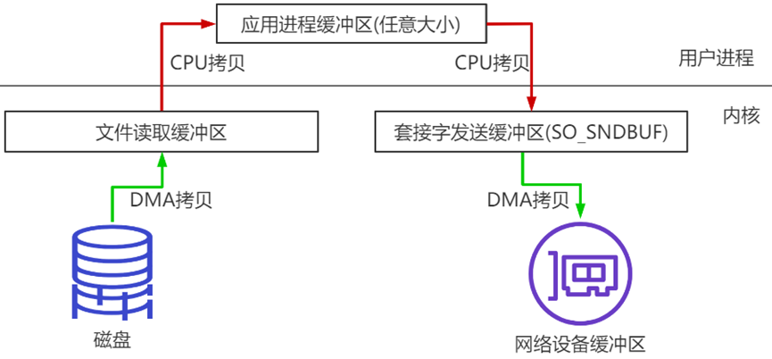

分析上述的过程，虽然引入 DMA 来接管 CPU 的中断请求，但四次 copy 是存在不必要的拷贝的。实际上并不需要第二个和第三个数据副本。应用程序除了缓存数据并将其传输回套接字缓冲区之外什么都不做。相反，数据可以直接从读缓冲区传输到套接字缓冲区。

显然，第二次和第三次数据 copy 其实在这种场景下没有什么帮助反而带来开销（DMA 拷贝速度一般比 CPU 拷贝速度快一个数量级），这也正是零拷贝出现的背景和意义。

打个比喻：200M 的数据，读取文件，再用 socket 发送出去，实际经过四次 copy（2 次 cpu 拷贝每次 100ms ，2 次 DMS 拷贝每次 10ms）。

传统网络传输的话：合计耗时将有 220ms。

同时，read 和 send 都属于系统调用，每次调用都牵涉到两次上下文切换：

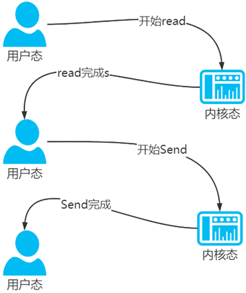

总结下，传统的数据传送所消耗的成本：4 次拷贝，4 次上下文切换。

4 次拷贝，其中两次是 DMA copy，两次是 CPU copy。

### mmap内存映射

硬盘上文件的位置和应用程序缓冲区（application buffers）进行映射（建立一种一一对应关系），由于`mmap()`将文件直接映射到用户空间，所以实际文件读取时根据这个映射关系，直接将文件从硬盘拷贝到用户空间，只进行了一次数据拷贝，不再有文件内容从硬盘拷贝到内核空间的一个缓冲区。

mmap 内存映射将会经历 3 次拷贝：1次 CPU copy，2 次 DMA copy；

打个比喻：200M 的数据，读取文件，再用 socket 发送出去，如果是使用 MMAP 实际经过三次 copy（1 次 cpu 拷贝每次 100ms ，2 次 DMS 拷贝每次 10ms）合计只需要 120ms

从数据拷贝的角度上来看，就比传统的网络传输，性能提升了近一倍。

以及 4 次上下文切换

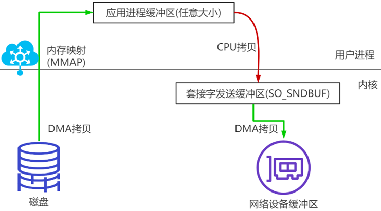

mmap() 是在`<sys/mman.h>`中定义的一个函数，此函数的作用是创建一个新的**虚拟内存**区域，并将指定的对象映射到此区域。mmap 其实就是通过**内存映射**的机制来进行文件操作。

Windows 操作系统上也有虚拟机内存，如下图：

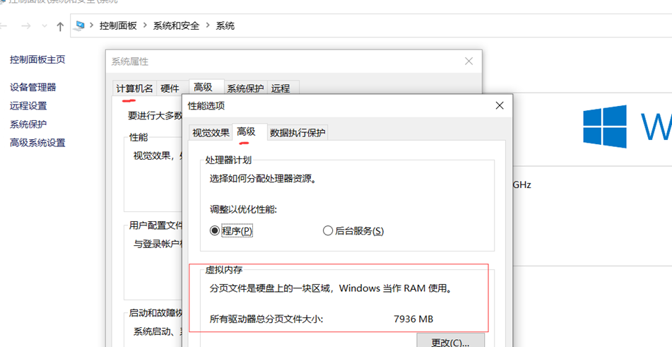

### 代码

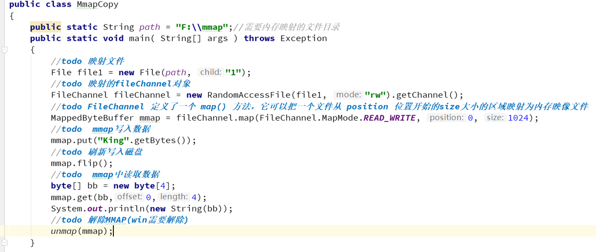

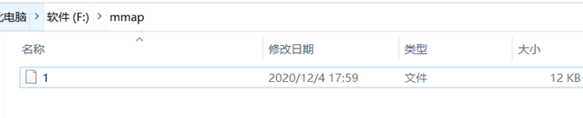

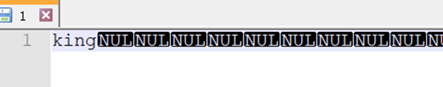


## 5.RocketMQ中MMAP的应用

如果按照传统的方式进行数据传送，那肯定性能上不去，作为 MQ 也是这样，尤其是 RocketMQ，要满足一个高并发的消息中间件，一定要进行优化。所以 RocketMQ 使用的是 MMAP。

RocketMQ 一个映射文件大概是，commitlog 文件默认大小为 1G。

这里需要注意的是，采用 MappedByteBuffer 这种内存映射的方式有几个限制，其中之一是一次只能映射 1.5~2G 的文件至用户态的虚拟内存，这也是为何 RocketMQ 默认设置单个 CommitLog 日志数据文件为 1G 的原因了。

### MMAP文件对应

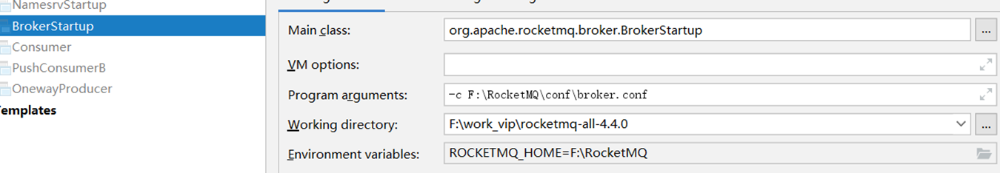

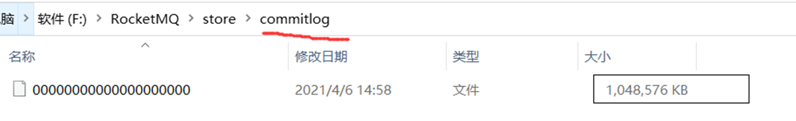


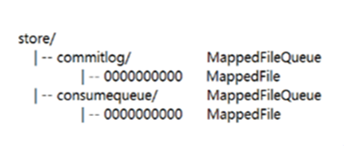

### RocketMQ源码中的MMAP运用

RocketMQ 源码中，使用 MappedFile 这个类进行 MMAP 的映射:

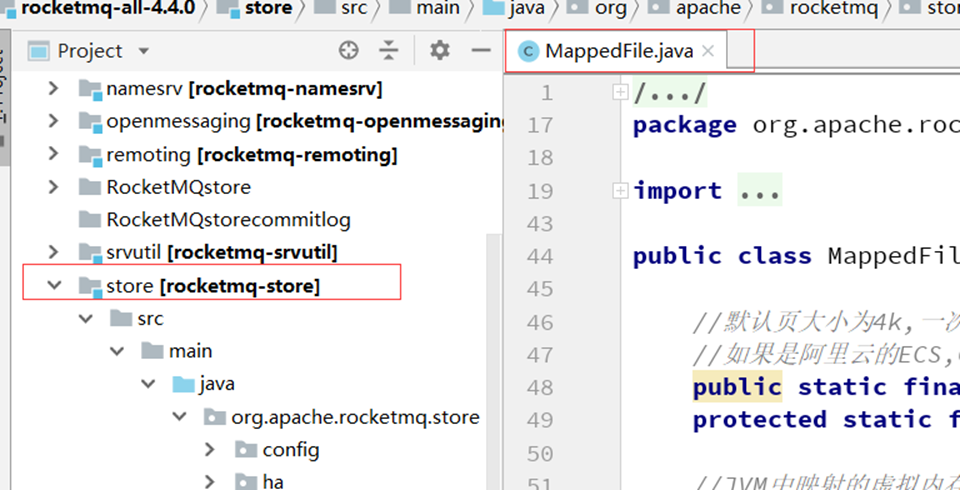

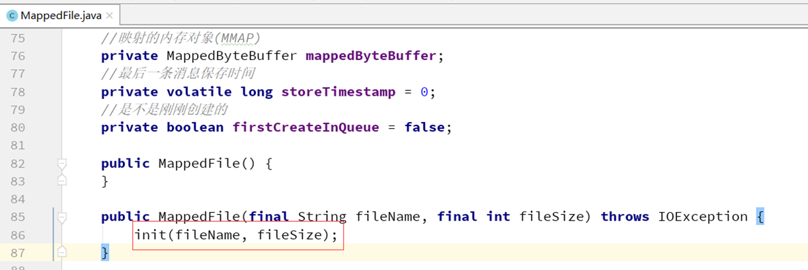

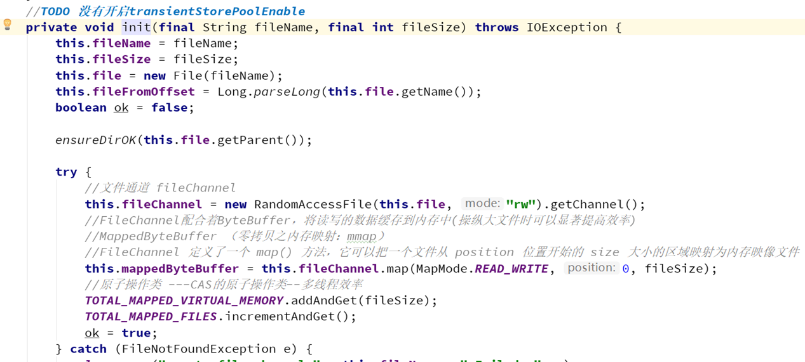

## 6.保证消息不丢失

一个消息从生产者产生，到被消费者消费，主要经过这3个过程：


1. 生产者产生消息
2. 消息发送到存储端，保存下来
3. 消息推送到消费者，消费者消费完，ack应答。

因此如何保证 MQ 不丢失消息，可以从这三个阶段阐述：

- 生产者保证不丢消息
- 存储端不丢消息
- 消费者不丢消息

### 6.1 生产者保证不丢消息

确保生产的消息能顺利到达存储端。

如果是`RocketMQ`消息中间件的话，`Producer`生产者提供了三种发送消息的方式，分别是：

- 同步发送
- 异步发送
- 单向发送

生产者要想发消息时保证消息不丢失，可以：

- 采用同步方式发送，send 消息方法返回成功状态，即消息正常到达了存储端`Broker`
- 如果`send`消息异常或者返回非成功状态，可以发起重试
- 可以使用事务消息，`RocketMQ`的事务消息机制就是为了保证零丢失来设计的

### 6.2 存储端不丢消息

如何保证存储端的消息不丢失呢？确保消息持久化到磁盘，那就是刷盘机制嘛。

刷盘机制分**同步刷盘和异步刷盘**：

- 同步刷盘：生产者消息发过来时，只有持久化到磁盘，`RocketMQ`的存储端`Broker`才返回一个成功的 ACK 响应。它保证消息不丢失，但是影响了性能。
- 异步刷盘：只要消息写入`PageCache`缓存，就返回一个成功的 ACK 响应。这样提高了 MQ 的性能，但是如果这时候机器断电了，就会丢失消息。

除了同步刷盘机制，还有一个维度需要考虑。`Broker`一般是集群部署的，有主节点和从节点。消息到`Broker`存储端，只有主节点和从节点都写入成功，才反馈成功的`ack`给生产者。这就是**同步复制**，它保证了消息不丢失，但是降低了系统的吞吐量。与之对应即是**异步复制**，只要消息写入主节点成功，就返回成功的`ack`，它速度快，但是会有性能问题。

### 6.3 消费阶段不丢消息

消费者**执行完业务逻辑**，再反馈会`Broker`说消费成功，这样才可以保证消费阶段不丢消息。

## 7.RocketMQ存储整体设计总结

### 消息生产与消息消费相互分离

Producer 端发送消息最终写入的是 CommitLog（消息存储的日志数据文件），Consumer 端先从 ConsumeQueue（消息逻辑队列）读取持久化消息的起始物理位置偏移量 offset、大小 size 和消息 Tag 的 HashCode 值，随后再从 CommitLog 中进行读取待拉取消费消息的真正实体内容部分。

### RocketMQ的CommitLog文件采用混合型存储

所有的 Topic 下的消息队列共用同一个 CommitLog 的日志数据文件，并通过建立类似索引文件—ConsumeQueue 的方式来区分不同 Topic 下面的不同 MessageQueue 的消息，同时为消费消息起到一定的缓冲作用（异步服务线生成了 ConsumeQueue 队列的信息后，Consumer 端才能进行消费）。这样，只要消息写入并刷盘至 CommitLog 文件后，消息就不会丢失，即使 ConsumeQueue 中的数据丢失，也可以通过 CommitLog 来恢复。

### RocketMQ每次读写文件的时候真的是完全顺序读写吗？

发送消息时，生产者端的消息确实是**顺序写入CommitLog**；订阅消息时，消费者端也是**顺序读取ConsumeQueue**，然而根据其中的起始物理位置偏移量 offset 读取消息真实内容却是**随机读取CommitLog**。 所以在 RocketMQ 集群整体的吞吐量、并发量非常高的情况下，随机读取文件带来的性能开销影响还是比较大的，RocketMQ 怎么优化的，源码解读部分进行讲解。