## 配置硬件

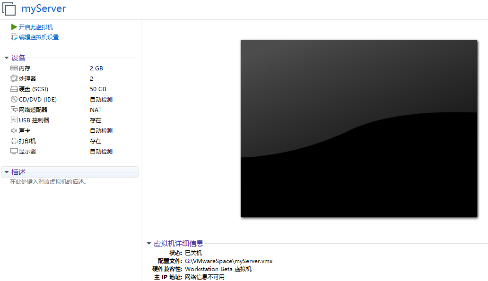

## 加载镜像文件

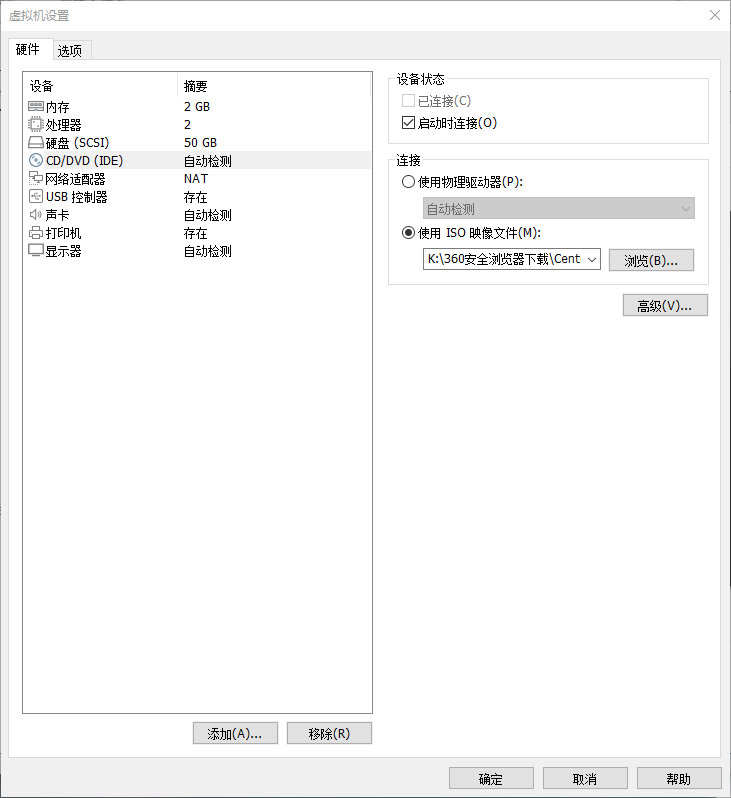

## 设置日期和时间


## 软件选择

最小安装 -- 无桌面模式

## 安装目标位置

**手动配置分区**


**分配 /boot**

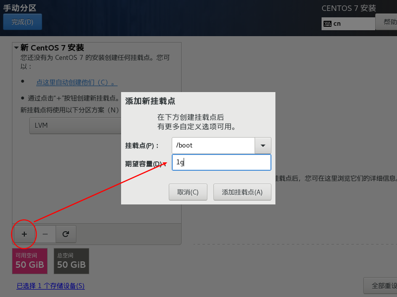

**修改文件系统类型**

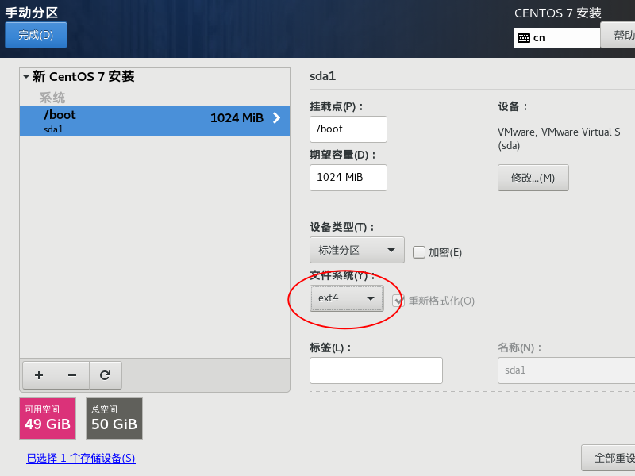

**分配 swap，虚拟内存**

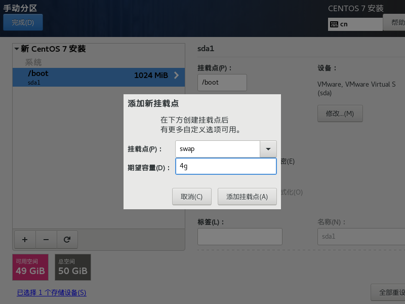

**分配根目录**

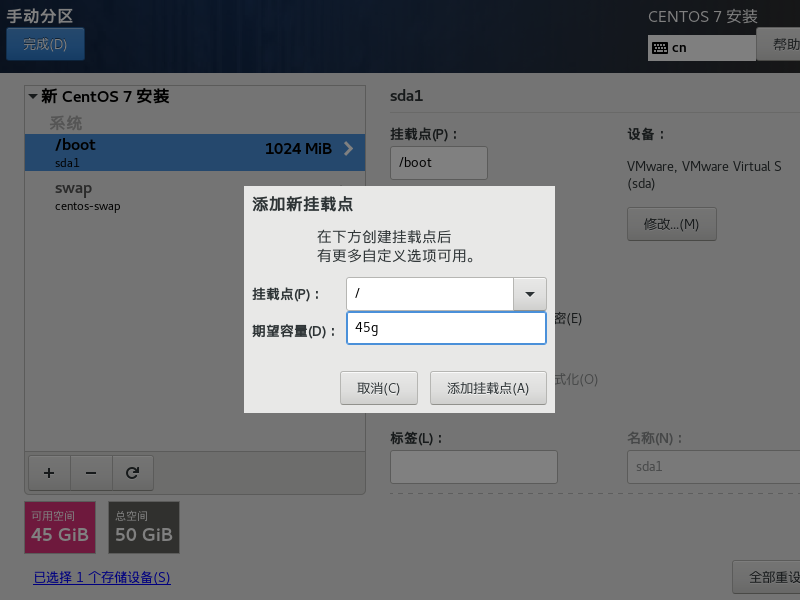

## KDUMP

系统崩溃时的备份

## 网络设置

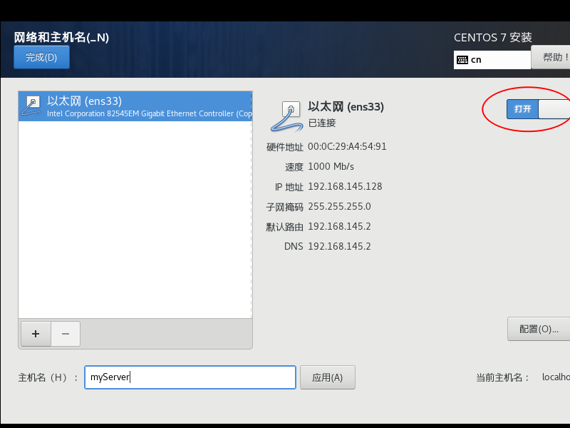

## 设置 root 密码

123456

## 配置 IP 地址

可能出现的问题：Vmware 服务自动停止，此时需要手动开启相应服务

VMnet0：负责直接和宿主机网络连接，可在虚拟网络编辑器中设置连接的宿主机的网卡（注意选择能连上网的网卡）

VMnet8：负责 NAT 地址交换

### 虚拟机

**编辑 - 虚拟网络编辑器**

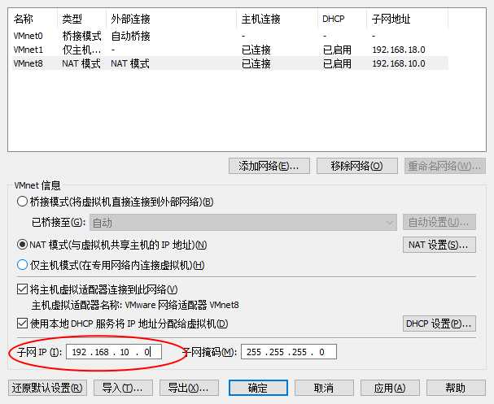

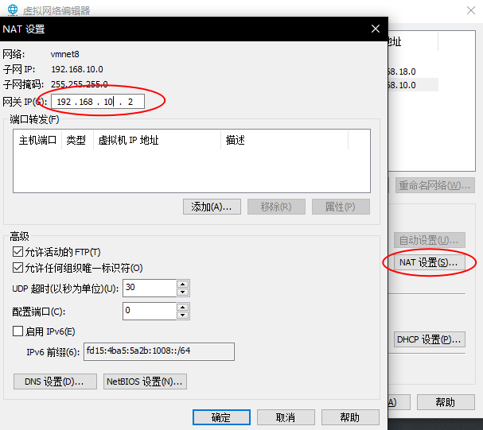

### linux 服务器

**更新 vim 命令**


**修改 IP 类型**

```bash
vim /etc/sysconfig/network-scripts/ifcfg-ens33
```


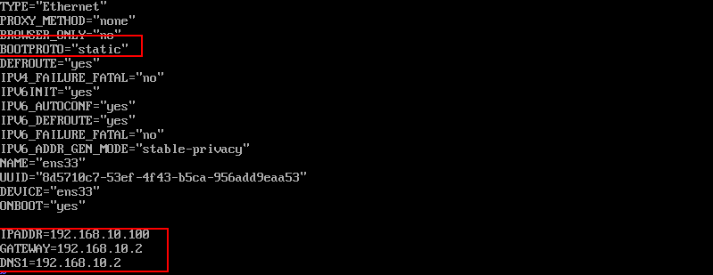

**配置 hostname**

```bash
vim /etc/hostname
```

**配置映射 host 文件**

```bash
vim /etc/hosts
```


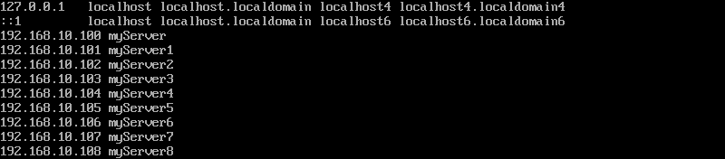

**安装网络工具**


### windows 10

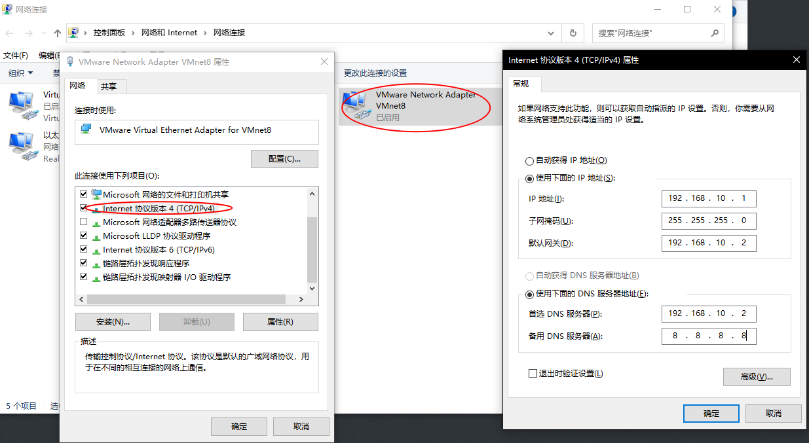

**修改 IP 映射文件**

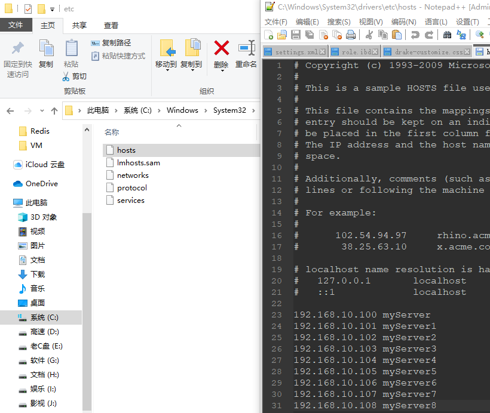

## XShell

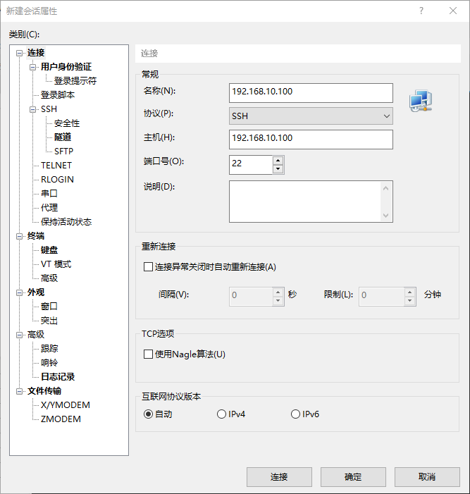

> 若在 windows 中设置了 IP 映射， 则可以直接输入映射的名称

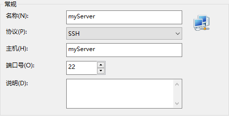

**安装 Xftp**

## 安装 epel-release

`yum install -y epel-release`

## 关闭防火墙

`systemctl stop firewalld`

`systemctl disable firewalld.service`

> **扩展：CentOS 关闭 selinux**
>
> - 查看状态：`sestatus`
>
> - 临时关闭：`setenforce 0`
> - 永久关闭：修改`/etc/selinux/config`设置`SELINUX=disabled`后重启

## 卸载安装的 JDK

```bash
rpm -qa | grep -i java | xargs -n1 rpm -e --nodeps
rom -qa # 查询安装的所有 rpm 包
grep -i # 忽略大小写
xargs -n1 # 每次只传递一个参数，相当于每次从查询结果中取出一个传递给后面的卸载命令
rpm -e pnodeps # 强制卸载
```

## 克隆三个虚拟机


**修改MAC地址**

虚拟机设置 - 网络适配器 - 高级

[**修改IP地址**](#linux 服务器)

**修改主机名称**

## 安装 JDK

**在 myServer1 中上传 JDK1.8**

**解压**

```bash
tar -zxvf jdk... -C /opt/module/
```

**配置环境变量**

```bash
cd /etc/profile.d
vim my_env.sh
```

```text
#JAVA_HOME
export JAVA_HOME=/opt/module/jdk1.8.0_212
export PATH=$PATH:$JAVA_HOME/bin
```

重新加载

```bash
source /etc/profile
```

## 完全分布式运行模式

### 编写集群分发脚本

**scp 安全拷贝**

> scp 可以实现服务器和服务器间的数据拷贝

- 基本语法

  ```bash
  scp -r $pdir/$fname $user@$host:$pdir/$fname
  命令 递归 要拷贝的文件路径/名称 目的地用户@主机：目的地路径/名称
  ```

- 实际操作

  1. 将 myServer1 中的 jdk 拷贝到 myServer2 中

     ```bash
     [root@myServer1 module]# scp -r jdk1.8.0_212/ root@myServer2:/opt/module/
     ```

  2. 从 myServer3 中将 myServer1 中的 jdk 拉过来

     ```bash
     [root@myServer3 module]# scp -r root@myServer1:/opt/module/jdk1.8.0_212/ ./
     ```

  3. 在 myServer2 上将 myServer1 中的 jdk 拷贝到 myServer2 中

     ```bash
     [root@myServer2 module]# scp -r root@myServer1:/opt/module/jdk1.8.0_212/ root@myServer2:/opt/module/
     ```

**rsync 远程同步**

> 主要用于备份和镜像，具有速度快，避免复制相同的内容和支持符号链接等功能
>
> rsync 只对差异文件做更新，而 scp 是复制全部文件

- 基本语法

  ```bash
  rsync -av $pdir/$fname $user@$host:$pdir/$fname
  命令 选项参数 要拷贝的文件路径/名称 目的地用户@主机：目的地路径/名称
  ```

  | 选项 | 功能         |
  | ---- | ------------ |
  | -a   | 归档拷贝     |
  | -v   | 显示复制过程 |

- 实际操作

  ```bash
  rsync -av jdk1.8.0_212/ root@myServer2:/opt/module/jdk1.8.0_212/
  ```

**xsync 集群分发脚本**

循环复制文件到所有结点相同的目录下

```bash
yum -y install rsync
```

```bash
[root@myServer1 home]# echo $PATH
/usr/local/sbin
:/usr/local/bin
:/usr/sbin
:/usr/bin
:/opt/module/jdk1.8.0_212/bin
:/root/bin # 在该目录下创建的命令会加入环境变量中
```

```bash
cd /root
mkdir bin
cd bin
vim xsync
```

```shell
#!/bin/bash
#1. 判断参数个数
if [ $# -lt 1 ]
    then
        echo Not Enough Arguement!
        exit;
fi
#2. 遍历集群所有机器
for host in myServer1 myServer2 myServer3
do
    echo ==================== $host ====================
    #3. 遍历所有目录，挨个发送
    for file in $@
    do
        #4. 判断文件是否存在
        if [ -e $file ]
            then
                #5. 获取父目录
                pdir=$(cd -P $(dirname $file); pwd)
                #6. 获取当前文件的名称
                fname=$(basename $file)
                ssh $host "mkdir -p $pdir"
                rsync -av $pdir/$fname $host:$pdir
            else
            	echo $file does not exists!
        fi
    done
done
```

修改 rsync 文件权限

```bash
chmod 777 xsync
```

分发 ~/bin 目录和 环境变量 /etc/profile.d/my_env.sh

```bash
xsync bin/
xsync /etc/profile.d/my_env.sh
```

## SSH 免密登录

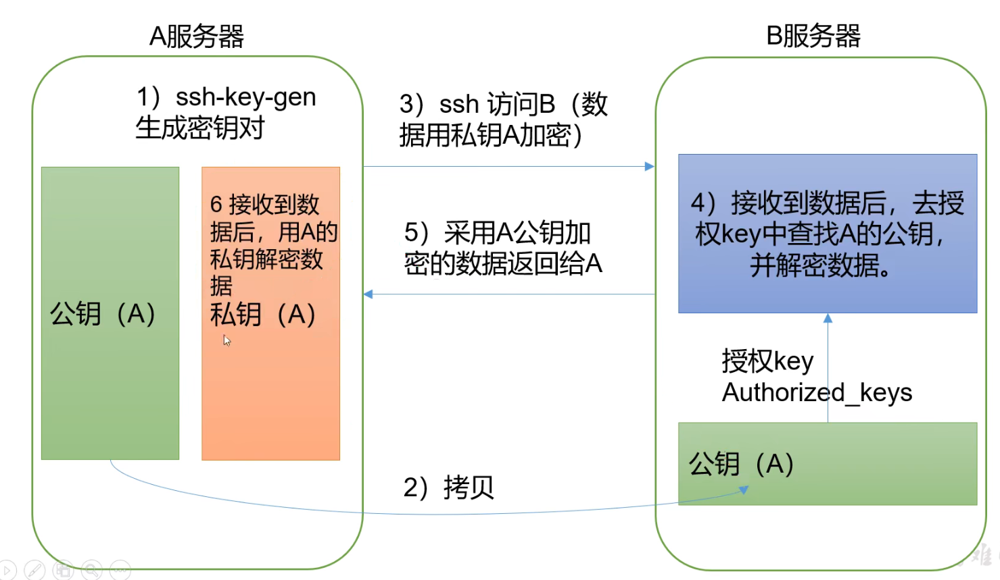

```bash
[root@myServer1 ~]# ssh-keygen -t rsa
[root@myServer1 ~]# cd .ssh
[root@myServer1 .ssh]# cat id_rsa  # 私钥
```

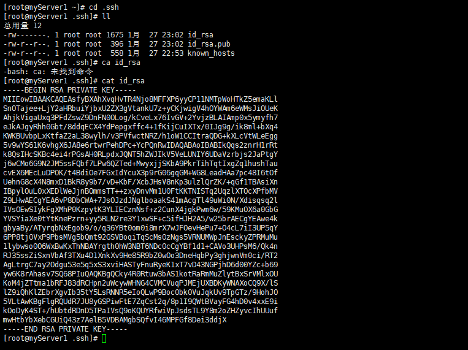

**将公钥拷贝到其他服务器**

```bash
[root@myServer1 .ssh]# ssh-copy-id myServer2
[root@myServer1 .ssh]# ssh-copy-id myServer3
[root@myServer1 .ssh]# ssh-copy-id myServer1  # 自己也需要授权
```

