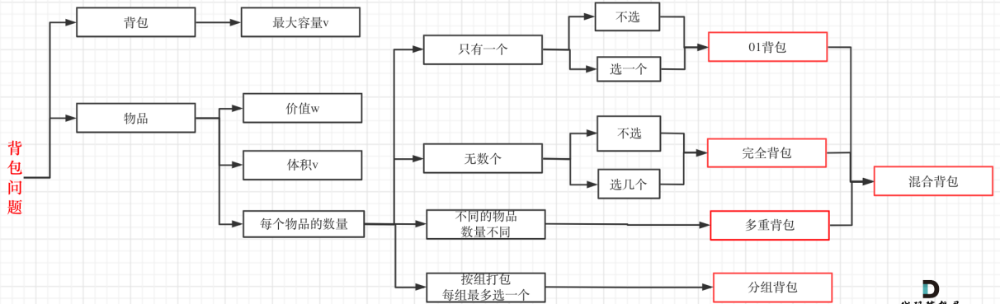

## 算法与数据结构

数据结构演示：https://www.cs.usfca.edu/~galles/visualization/Algorithms.html

## 1.快速排序

从数组中选取一个中心元素，将比元素小的放在左边，比元素大的放在右边。然后再递归比较元素左边的数组和右边的数组。

```java

public class QuickSort {

    public static int partition(int[] array, int low, int high) {
        // 取最后一个元素作为中心元素
        int pivot = array[high];
        // 定义指向比中心元素大的指针，首先指向第一个元素
        int pointer = low;
        // 遍历数组中的所有元素，将比中心元素大的放在右边，比中心元素小的放在左边
        for (int i = low; i < high; i++) {
            if (array[i] <= pivot) {
                // 将比中心元素小的元素和指针指向的元素交换位置
                // 如果第一个元素比中心元素小，这里就是自己和自己交换位置，指针和索引都向下一位移动
                // 如果元素比中心元素大，索引向下移动，指针指向这个较大的元素，直到找到比中心元素小的元素，并交换位置，指针向下移动
                int temp = array[i];
                array[i] = array[pointer];
                array[pointer] = temp;
                pointer++;
            }
        }
        // 将中心元素和指针指向的元素交换位置
        int temp = array[pointer];
        array[pointer] = array[high];
        array[high] = temp;
        return pointer;
    }

    public static void quickSort(int[] array, int low, int high) {
        if (low < high) {
            // 获取划分子数组的位置
            int position = partition(array, low, high);
            // 左子数组递归调用
            quickSort(array, low, position -1);
            // 右子数组递归调用
            quickSort(array, position + 1, high);
        }
    }

    public static void main(String[] args) {
        int[] array = {6,72,113,11,23};
        quickSort(array, 0, array.length -1);
        System.out.println("排序后的结果");
        System.out.println(Arrays.toString(array));
    }
}
```

## 2.动态规划

动态规划，英⽂：Dynamic Programming，简称 DP，如果某⼀问题有很多重叠⼦问题，使⽤动态规划是最有效的。基本步骤为：

1. 确定 dp 数组以及下标的含义
2. 确定递推公式
3. dp 数组如何初始化
4. 确定遍历顺序

### 2.1 背包问题



#### 1.01背包

有 `N` 件物品和⼀个最多能被重量为 `W` 的背包。第 `i` 件物品的重量是 `weight[i]`，得到的价值是 `value[i]` 。每件物品只能⽤⼀次，求解将哪些物品装⼊背包⾥物品价值总和最⼤。

1. **确定 dp 数组以及下标的含义**

   `dp[i][j]` 表示从下标为 `[0-i]` 的物品⾥任意取，放进容量为 `j` 的背包，价值总和的最⼤值。

2. **确定递推公式**

   可以有两个⽅向：

   - 由 `dp[i - 1][j]` 推出：即背包容量为 `j`，⾥⾯不放物品i的最⼤价值，此时 `dp[i][j]` 就是 `dp[i - 1][j]`
   - 由 `dp[i - 1][j - weight[i]]` 推出：即背包容量为 `j - weight[i]` 的时候不放物品 `i` 的最⼤价值，那么 `dp[i - 1][j - weight[i]] + value[i]` 就是背包放物品 `i` 得到的最⼤价值

   `dp[i][j] = Max(dp[i - 1][j], dp[i-1][j - weight[i] + value)`

3. **dp 数组如何初始化**

   `dp[0][j]`：存放编号 0 的物品的时候，各个容量的背包所能存放的最⼤价值。那么很明显当 `j < weight[0]` 的时候，`dp[0][j]` 应该是 0，因为背包容量⽐编号 0 的物品重量还小； 当 `j >= weight[0]` 时，`dp[0][j]` 应该是 `value[0]`，因为背包容量放⾜够放编号 0 物品。

   ```java
   for (int j = weight[0]; j <= bagWeight; j++) {
       dp[0][j] = value[0];
   }
   ```

4. **确定遍历顺序**

   因为 `dp[i][j]` 不管是 `i` 还是 `j` 都是由左边的元素推导出来，因此先遍历物品或背包都可以，但是先遍历物品比较好理解。

   ```java
   // weight数组的⼤⼩就是物品个数
   for(int i = 1; i < weight.size(); i++) {             // 遍历物品
       for(int j = 0; j <= bagWeight; j++) {            // 遍历背包容量
           if (weight[i] <= j)                       // 只有当当前物品重量小于背包重量时才考虑当前物品，若大于背包重量则空置为 0
           	dp[i][j] = max(dp[i - 1][j], dp[i - 1][j - weight[i]] + value[i]);
       }
   }
   ```

#### 2.01背包一维解法

在使⽤⼆维数组的时候，递推公式为 `dp[i][j] = max(dp[i - 1][j], dp[i - 1][j - weight[i]] + value[i])`，其实可以发现如果把 `dp[i - 1]` 那⼀层拷⻉到 `dp[i]` 上，表达式完全可以是：`dp[j] = max(dp[j], dp[j - weight[i]] + value[i])`，`dp[j]` 表示容量为 `j` 的背包，所背的物品价值可以最⼤为 `dp[j]`，那么 `dp[0]` 就应该是 0，因为背包容量为 0 所背的物品的最⼤价值就是 0。

代码如下：

```java
for(int i = 0; i < weight.size(); i++) { // 遍历物品
    for(int j = bagWeight; j >= weight[i]; j--) { // 遍历背包容量
        dp[j] = max(dp[j], dp[j - weight[i]] + value[i]);
    }
}
```

这⾥和⼆维 dp 的**遍历背包的顺序**是不⼀样的！ ⼆维 dp 遍历的时候，背包容量是从⼩到⼤，⽽⼀维 dp 遍历的时候，背包是==**从⼤到⼩**==。

举⼀个例⼦：物品 0 的重量 weight[0] = 1，价值 value[0] = 15

如果正序遍历：

- dp[1] = dp[1 - weight[0]] + value[0] = 15
- dp[2] = dp[2 - weight[0]] + value[0] = 30

此时 dp[2] 就已经是 30 了，意味着物品 0，被放⼊了两次，所以不能正序遍历。

倒序：

- dp[2] = dp[2 - weight[0]] + value[0] = 15 （dp 数组已经都初始化为 0）
- dp[1] = dp[1 - weight[0]] + value[0] = 15

所以从后往前循环，每次取得状态不会和之前取得状态重合，这样每种物品就只取⼀次了。对于⼆维 dp，`dp[i][j]` 都是通过上⼀层即 `dp[i - 1][j]` 计算⽽来，本层的 `dp[i][j]` 并不会被覆盖。

同时**两个嵌套 `for` 循环的顺序也不能调换**。代码中是先遍历物品嵌套遍历背包容量，反过来先遍历背包容量再嵌套遍历物品则不可以！因为⼀维 dp 的写法，背包容量⼀定是要倒序遍历（原因上⾯已经讲了），如果遍历背包容量放在上⼀层，那么内层循环时每次每个 `dp[j]` 只取会放⼊⼀个物品是的最大值，即：背包⾥只放⼊了⼀个物品。

> **补充**
>
> 在考虑最大价值总和的时候递推公式为：`dp[j] = max(dp[j], dp[j - weight[i]] + value[i])`；但在考虑装满背包有几种方法时的递推公式为：`dp[j] += dp[j - weight[j]`，同时初始化 `dp[0] = 1`，表示装满 0 容量的背包总共有 1 种方法：什么也不放。

#### 3.完全背包

有 `N` 件物品和⼀个最多能背重量为 `W` 的背包。第 `i` 件物品的重量是 `weight[i]`，得到的价值是 `value[i]` 。每件物品都有⽆限个（也就是可以放⼊背包多次），求解将哪些物品装⼊背包⾥物品价值总和最⼤。完全背包和 01 背包问题唯⼀不同的地⽅就是，每种物品有⽆限件。

⾸先在回顾⼀下 01 背包的核⼼代码

```java
for(int i = 0; i < weight.size(); i++) { // 遍历物品
    for(int j = bagWeight; j >= weight[i]; j--) { // 遍历背包容量
        dp[j] = max(dp[j], dp[j - weight[i]] + value[i]);
    }
}
```

01 背包内嵌的循环是从⼤到⼩遍历，为了保证每个物品仅被添加⼀次。 ⽽完全背包的物品是可以添加多次的，所以要从⼩到⼤去遍历，即

```java
// 先遍历物品，再遍历背包
for(int i = 0; i < weight.size(); i++) { // 遍历物品
    for(int j = weight[i]; j <= bagWeight; j++) { // 遍历背包容量
        dp[j] = max(dp[j], dp[j - weight[i]] + value[i]);
    }
}
```

关于遍历顺序，01 背包中⼆维 `dp` 数组的两个 `for` 遍历的先后循序是可以颠倒了，⼀位 `dp` 数组的两个 `for` 循环先后循序⼀定是先遍历物品，再遍历背包容量。 在纯完全背包中，对于⼀维 `dp` 数组来说，其实两个 `for` 循环嵌套**顺序同样⽆所谓**：

```java
// 先遍历背包，再遍历物品
for(int j = 0; j <= bagWeight; j++) { // 遍历背包容量
    for(int i = 0; i < weight.size(); i++) { // 遍历物品
        if (weight[i] <= j) dp[j] = max(dp[j], dp[j - weight[i]] + value[i]);
    }
}
```

> **补充**
>
> 特别是在求装满背包有⼏种⽅案的时候，认清遍历顺序是⾮常关键的：
>
> - 如果求组合数，即添加顺序不重要，则外层 `for` 循环遍历物品，内层 `for` 遍历背包
>
>   ```java
>   dp[0] = 1;
>   for (int i = 0; i < coins.size(); i++) { // 遍历物品
>       for (int j = coins[i]; j <= amount; j++) { // 遍历背包容量
>           dp[j] += dp[j - coins[i]];
>       }
>   }
>   ```
>
> - 如果求排列数，即添加顺序重要，则外层 `for` 遍历背包，内层 `for` 循环遍历物品
>
>   ```java
>   dp[0] = 1;
>   for (int j = 0; j <= amount; j++) { // 遍历背包容量
>       for (int i = 0; i < coins.size(); i++) { // 遍历物品
>           if (coins[i] <= j) dp[j] += dp[j - coins[i]];
>       }
>   }
>   ```

#### 4.多重背包

有 N 种物品和⼀个容量为 V 的背包。第 i 种物品最多有 Mi 件可⽤，每件耗费的空间是 Ci，价值是 Wi。求解将哪些物品装⼊背包可使这些物品的耗费的空间总和不超过背包容量，且价值总和最⼤。

多重背包和 01 背包是⾮常像的，每件物品最多有 Mi 件可⽤，把 Mi 件摊开，其实就是⼀个 01 背包问题了。例如背包最⼤重量为 10。物品为：

|        | 重量 | 价值 | 数量 |
| :----: | :--: | :--: | :--: |
| 物品 0 |  1   |  15  |  2   |
| 物品 1 |  3   |  20  |  3   |
| 物品 2 |  4   |  30  |  2   |

问背包能背的物品最⼤价值是多少？和如下情况毫⽆区别：

|        | 重量 | 价值 | 数量 |
| ------ | ---- | ---- | ---- |
| 物品 0 | 1    | 15   | 1    |
| 物品 0 | 1    | 15   | 1    |
| 物品 1 | 3    | 20   | 1    |
| 物品 1 | 3    | 20   | 1    |
| 物品 1 | 3    | 20   | 1    |
| 物品 2 | 4    | 30   | 1    |
| 物品 2 | 4    | 30   | 1    |

这就转成了⼀个 01 背包问题了，且每个物品只⽤⼀次。

实现代码如下：

```java
public void testMultiPack() {
    List<Integer> weight = new ArrayList<>(Arrays.asList(1, 3, 4));
    List<Integer> value = new ArrayList<>(Arrays.asList(15, 50, 30));
    List<Integer> nums = new ArrayList<>(Arrays.asList(15, 20, 30));
    int bagWeight = 10;

    for (int i = 0; i < nums.size(); i++) {
        for(int j = 1; j<= nums.get(i); j++) {
            weight.add(weight.get(i));
            value.add(value.get(i));
        }
    }

    int[] dp = new int[bagWeight + 1];

    for (int i = 0; i < weight.size(); i++) {
        for (int j = bagWeight; j >= weight.get(i); j--) {
            dp[j] = Math.max(dp[j], dp[j - weight.get(i)] + value.get(i));
        }
    }

    System.out.println(dp[bagWeight]);
}
```

时间复杂度：O(m * n * k)，m 为物品种类个数，n 为背包容量，k 为单类物品数量。

也有另⼀种实现⽅式，时间复杂度相同，就是把每种商品遍历的个数放在 01 背包⾥⾯在遍历⼀遍：

```java
List<Integer> weight = new ArrayList<>(Arrays.asList(1, 3, 4));
List<Integer> value = new ArrayList<>(Arrays.asList(15, 50, 30));
List<Integer> nums = new ArrayList<>(Arrays.asList(15, 20, 30));
int bagWeight = 10;

int[] dp = new int[bagWeight + 1];

for (int i = 0; i < weight.size(); i++) {
    for (int j = bagWeight; j >= weight.get(i); j--) {
        // 遍历物品数量
        for (int k = 1; k <= nums.get(i) && j - k * weight.get(i) >= 0; k++)
            dp[j] = Math.max(dp[j], dp[j - weight.get(i) * k] + k * value.get(i));
    }
}

System.out.println(dp[bagWeight]);
```

## 3.回溯算法

## 4.双指针

**典型问题：[leetcode 1624](https://leetcode.com/problems/largest-substring-between-two-equal-characters)**

Given a string `s`, return the length of the longest substring between two equal characters, excluding the two characters. If there is no such substring return `-1`.

```java
public int maxLengthBetweenEqualCharacters(String s) {
    int length = s.length();
    int ans = -1;
    for (int left = 0; left < length; left++) {
        // 当右指针访问到 left + ans + 2 即停止，再访问下去已经不会超过前一个 ans 了
        for (int right = length - 1; right >= left + ans + 2; right--) {
            if (s.charAt(left) == s.charAt(right))
                ans = Math.max(ans, right - left - 1);
        }
    }
    return ans;
}
```

## 5.贪心

贪⼼的本质是选择每⼀阶段的局部最优，从⽽达到全局最优。常会用到排序，双指针等技巧。
