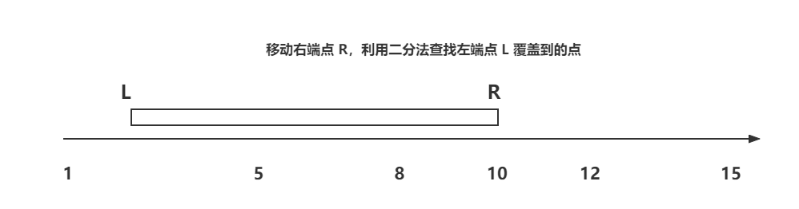
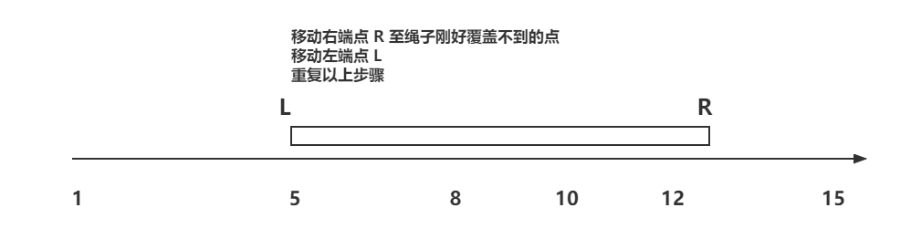

# 题目

## 1.滑动窗口类

### 1.1 绳子覆盖最多的点数

给定一个有序数组 arr，代表坐落在 X 轴上的点，给定一个正数 K，代表绳子的长度，返回绳子最多覆盖住的点数，边缘处也算。

1. **分析：贪心 + 二分 O(NlogN)**

   只需要让绳子右端点放在数组坐标上，观察左端点能覆盖的坐标即可。

   

   ```java
   int maxPoint(int[] arr, int k) {
       int res = 0;
       for (int r = 0; r < arr.length; r++) {
           int leftIndex = getLeftIndex(arr, r, arr[r] - k);
           res = Math.max(res, r - leftIndex + 1);
       }
       return res;
   }
   
   
   /**
    * 找出下标 R(r) 左边刚好比 arr[r]-k 大的点
    *
    * @param arr: 数组
    * @param r: R 的下标
    * @param value：左边下标 L 需要刚好超过的值
    * @return L-左边下标
    */
   int getLeftIndex(int[] arr, int r, int value) {
       int l = 0;
       while (l < r) {
           int middle = (r - l) / 2 + l;
           if (arr[middle] >= value)
               r = middle;
            else
               l = middle + 1;
       }
       return l;
   }
   ```

2. **分析：滑动窗口 O(n)**

   

   ```java
   int moveWindow(int[] arr, int K) {
       int l = 0;
       int r = 0;
       int res =0;
       while (l < arr.length) {
           // 找到右边下标 r 使其值刚好超过 arr[l]+k
           while (r < arr.length && arr[r] - arr[l] <= k)
               r++;
           // 由于 r 的坐标超过了覆盖范围，求覆盖的点时用 r-l
           res = Math.max(res, r - l);
           l++;
       }
       return res;
   }
   ```

### 1.2 最长无重复子串

[leetcode 3](https://leetcode.com/problems/longest-substring-without-repeating-characters/)

求出一个字符中最长的无重复的子串长度。例如对于 `abccadefa` 的最长无重复子串为 `cadef`，长度为 5。

**分析：滑动窗口**

用一个 `array` 记录字符上一次出现的最后位置，再用一个指针 `left` 表示上一个子串左边的索引位置，比较两个位置取最大的即为以当前字符为边界的的左边最远位置。

```java
class Solution {
    public int lengthOfLongestSubstring(String s) {
        // 用于存放字符上一次出现的位置，assic 码范围从 0~255
        int[] lastIndex = new int[256];
        // 初始化上一次出现的位置为 -1
        for (int i = 0; i < 256; i++) {
            lastIndex[i] = -1;
        }
        int ans = 0;
        int left = 0;
        for (int i = 0; i < s.length(); i++) {
            char curChar = s.charAt(i);
            left = Math.max(left, lastIndex[curChar] + 1);
            lastIndex[curChar] = i;
            ans = Math.max(ans, i - left + 1);
        }
        return ans;
    }
}
```

### 1.3 能同时比赛的最大场次

给定一个数组 `arr` 表示参赛人员的战力值，同时给定一个 `k` 表示需要的战力差值，每次比赛只能上场 2 个人且不能重复参赛，返回能够匹配的最多场次。

**分析：滑动窗口**

先将数组进行排序，同时用两个指针向右遍历，用一个 `used` 数组维护右边匹配上的

- 如果 `l` 用过了，`used[l] == true`：`l++`
- 如果 `l >= r`：`r++`

- 如果满足匹配条件，`arr[r] - arr[l] == k`：
  - `ans++`
  - `used[r] = true`
  - `l++`、`r++`

- 如果 `arr[r] - arr[l] < k`：`r++`
- 如果 `arr[l] - arr[k] > k`：`l++`

```java
public int maxPairNum(int[] arr, int k) {
    if (arr.length < 2) return 0;
    Arrays.sort(arr);
    int ans = 0, l = 0, r = 1;
    boolean[] used = new boolean[arr.length];
    while (l < arr.length && r < arr.length)
    {
        if (used[l]) l++;
        else if (l >= r) r++;
        else if (arr[r] - arr[l] == k)
        {
            ans++;
            used[r] = true;
            l++;
            r++;
        }
        else if (arr[r] - arr[l] < k) r++;
        else l++;
    }
    return ans;
}
```

## 2.统计不同电话号码个数

**分析：位图**

可以用位图来统计，代码上可以使用 `int` 数组，也可以使用 <a href="../Java/集合/BitSet.md">BitSet</a>，每一个数组元素占用`4`字节，也就是`32`位，相当于可以存储 32 个号码。

以 00000100 号码为例：

第一步，计算数组下标，`100/32=3`，所以该号码对应的数组下标为`2`。

```java
int数组arr：[{0}, {1}, {2(存放在这里)}, {3}, ...]
```

第二步，计算电话号码在这个 int 数字中具体的 bit 的位置：`100 % 32 = 4`，即将 1 左移 4 位，然后与数组该位置元素进行或运算。

```java
{1|2|3|4|5|6|7|8|9|10|11|12|13|14|15|16|17|18|19|20|21|22|23|24|25|26|27|28|29|30|31|32}
 0 0 0 0 0 0 0 0 0 0  0  0  0  0  0  0  0  0  0  0  0  0  0  0  0  0  0  1  0  0  0  0
arr[2] = arr[2] | 10000
```

第三步，统计数组中各个元素的二进制位上 1 的个数：

```java
// 方法 1：Integer 静态方法
Integer.bitCount(n);

// 方法 2：n&(n-1)
while (n != 0){// 数字的二进制表示中有多少个1就进行多少次操作
    result++;
    n = n & (n-1);
}
```

> 扩展：
>
> 一个数与该数减一的结果进行与运算`n&(n-1)`，会把该数右边（低位）第一个1变为0，而该位左边保持不变（高位）
>
> 例子：比如 1100（对应十进制是 12），减去 1 之后的结果是 1011（也就是十进制的 11），两个数进行与运算之后，我们发现最后的结果是 1000（对应十进制的 8，当然这个 8 与后面没有关系，可以略过）。这样我们每进行一次的与运算就消去一个 1，这样消到最后肯定是 0 了，所以我们可以在代码中以这个为循环的终止条件。

## 3.贪心类

### 3.1 交换字符

一个数组中只有两种字符 "G" 和 "B"，想把所有 "G" 放在一端，所有的 "B" 放在另一端，但是只能移动交换相邻的字符，返回最少交换的次数。

**分析：贪心 O(n)**

将 "G" 全部放在左边时，对于出现的第一个 "G"，只需将其放在坐标 0 的位置，假如其下标是 3，则放到下标 0 的位置需要 3 次。第二个 "G" 的下标为  4，要将其移动到 1，则需移动 3 次。

```bash
arr                   BBBGGBBG
index                 01234567
index after moved        01  2
times                    33  5  
```

将 "B" 放在左边时同理。

```java
int getExchangeCount(String[] arr) {
    // gCount 表示移动过的 G 的次数
   int gCount = 0;
   int bCount = 0;
    // gLeftRes 表示将所有 G 移动到左侧的总次数
   int gLeftRes = 0;
   int bLeftRes = 0;
    for (int i = 0; i < arr.length; i++) {
        if ("G".equals(arr[i])) {
            gLeftRes += i - gCount;
            gCount++;
        } else {
            bLeftRes += i - bCount;
            bCount++;
        }
    }
    return Math.min(gLeftRes, bLeftRes);
}
```

## 4.动态规划类

### 4.1 累加和

【[leetcode 494](https://leetcode.com/problems/target-sum/)】给定一个数组 nums，可以在每个数字前使用 "+" 和 "-"，必须所有数字都参与计算且不能改变顺序；再在给定一个数 target，问最后能算出 target 的组合数。

1. **分析：递归**

   ```java
   public int findTargetSumWays(int[] nums, int target) {
       return process(nums, 0, target);
   }
   
   private int process(int[] nums, int index, int res) {
       // 递归到最后 res 等于 0 说明满足条件，则返回 1
       if (index >= nums.length) {
           return res == 0 ? 1 : 0;
       }
       return process(nums, index + 1, res - nums[index]) + process(nums, index + 1, res + nums[index]);
   }
   ```

2. **分析：记忆化搜索**

   对于 `process` 方法，其返回值与入参 `index` 和 `res` 强相关，因此可以将 `index`、`res` 的返回结果做成缓存。

   ```java
   // 缓存表，用于存放 index 和 res 组合的结果
   Map<Integer, Map<Integer, Integer>> cache = new HashMap<>();
   
   public int findTargetSumWays(int[] nums, int target) {
       return process(nums, 0, target);
   }
   
   private int process(int[] nums, int index, int res) {
       // 如果缓存中有数据则返回
       if (cache.containsKey(index) && cache.get(index).containsKey(res)) {
           return cache.get(index).get(res);
       }
   
       // 没有则记录当前 index 和 res 的计算结果
       int ans = 0;
       if (index >= nums.length) {
           ans = res == 0 ? 1 : 0;
       } else {
           ans = process(nums, index + 1, res - nums[index]) + process(nums, index + 1, res + nums[index]);
       }
       if (!cache.containsKey(index)) {
           cache.put(index, new HashMap<>());
       }
       // 将结果放入缓存
       cache.get(index).put(res, ans);
       return ans;
   }
   ```

3. **动态规划：01背包**

   将所有加号的整数看成一个组 A，将所有负号的整数看成一个组 B，则有以下等式：
   
   - A + B = sum
   - A - B = target
   
   因此得出 A = (sum + target) / 2，只需要找出存在某些值的和为 A 即可。
   
   **分析步骤**
   
   **（1）确定 dp 数组以及下标的含义**
   
   `dp[j]` 的定义：前 i 个元素中和为 j 的组合有 `dp[j]` 种。
   
   **（2）确定递推公式**
   
   考虑 nums[i] 的话有 `dp[j - nums[i]]` 种，不考虑的话还是其本身 `dp[j]`。
   
   `dp[j] += dp[j - nums[i]]`
   
   **（3）dp 数组如何初始化**
   
   `dp[0] = 1`，表示和为 0 的有 1 种。
   
   **（4）确定遍历顺序**
   
   01 背包一维数组通用：外层从左向右，内层从右向左。
   
   **代码**
   
   ```java
   public int findTargetSumWays(int[] nums, int target) {
       int sum = 0;
       for (int i : nums) sum += i;
       // 由于 target 可能为负，因此这里比较绝对值
       if (((sum + target) & 1) != 0 || Math.abs(target) > sum) return 0;
       int bagSize = (sum + target) >> 1;
       int[] dp = new int[bagSize + 1];
       dp[0] = 1;
       for (int i = 0; i < nums.length; i++) {
           for (int j = bagSize; j >= nums[i]; j--) {
               dp[j] += dp[j - nums[i]];
           }
       }
       return dp[bagSize];
   }
   ```

### 4.2 最小花费爬楼梯

数组的每个下标作为⼀个阶梯，第 `i` 个阶梯对应着⼀个⾮负数的体⼒花费值 `cost[i]`（下标从 0 开始）。 每当你爬上⼀个阶梯你都要花费对应的体⼒值，⼀旦⽀付了相应的体⼒值，你就可以选择向上爬 1 个阶梯或者爬 2 个阶梯。 请你找出达到楼层顶部的最低花费。在开始时，你可以选择从下标为 0 或 1 的元素作为初始阶梯。

**示例 1**

- 输⼊：cost = [10, 15, 20]
- 输出：15
- 解释：最低花费是从 cost[1] 开始，然后⾛两步即可到阶梯顶，⼀共花费 15

**示例 2**

- 输⼊：cost = [1, 100, 1, 1, 1, 100, 1, 1, 100, 1]
- 输出：6
- 解释：最低花费⽅式是从 cost[0] 开始，逐个经过那些 1 ，跳过 cost[3] ，⼀共花费 6 

**分析步骤**

**（1）确定 dp 数组以及下标的含义**

`dp[i]` 的定义：到达第 `i` 个台阶所花费的最少体力为 `dp[i]`。

**（2）确定递推公式**

可以有两个途径得到 `dp[i]`，⼀个是 `dp[i-1]`；⼀个是 `dp[i-2]`，然后选其中最⼩的，即`dp[i] = min(dp[i-1], dp[i-2]) + cost[i]`。

**（3）dp 数组如何初始化**

`dp[0] = cost[0]; dp[1] = cost[1]`，表示爬上 0 和 1 号阶梯分别最少消耗 `cost[0]` 和 `cost[1]` 的体力。

**（4）确定遍历顺序**

因为 `dp[i]` 由 `dp[i-1]` 和 `dp[i-2]` 推出，从左向右遍历即可。

**代码**

```java
int minCostClimbingStairs(int[] cost) {
    int[] dp = new int[cost.length];
    dp[0] = cost[0];
    dp[1] = cost[1];
    for (int i = 2; i < cost.length; i++) {
        dp[i] = Math.min(dp[i-1], dp[i-2]) + cost[i];
    }
    // 注意最后⼀步可以理解为不⽤花费，所以取倒数第⼀步，第⼆步的最少值
    return Math.min(dp[dp.length-1], dp[dp.length-2]);
} 
```

- 时间复杂度：O(n)
- 空间复杂度：O(n)

还可以优化空间复杂度，因为 `dp[i]` 就是由前两位推出来的，那么也不⽤ dp 数组了：

```java
int minCostClimbingStairs(int[] cost) {
    int dp0 = cost[0];
    int dp1 = cost[1];
    for (int i = 2; i < cost.length; i++) {
        int dpi = Math.min(dp0, dp1) + cost[i];
        dp0 = dp1;
        dp1 = dpi;
    }
    return Math.min(dp0, dp1);
} 
```

- 时间复杂度：O(n)

- 空间复杂度：O(1)

### 4.3 整数拆分

【[leetcode 343](https://leetcode.com/problems/integer-break/submissions/)】给定⼀个正整数 n，将其拆分为⾄少两个正整数的和，并使这些整数的乘积最⼤化。返回你可以获得的最⼤乘积。

**示例 1**

- 输⼊：2
- 输出：1
- 解释：2 = 1 + 1, 1 × 1 = 1

**示例 2**

- 输⼊：10
- 输出：36
- 解释：10 = 3 + 3 + 4, 3 × 3 × 4 = 36

**分析步骤**

**（1）确定 dp 数组以及下标的含义**

`dp[i]` 的定义：拆分数字 `i` 可以获得的最大乘积。

**（2）确定递推公式**

可以用 `j` 从 1 遍历到 `i-1`，每次计算时有两种方式：

- 不拆分 `i-j`：`j * (i-j)`
- 拆分 `i-j`：`j * dp[i-j]`

每次取其最大的：`dp[i] = Math.max(dp[i], Math.max((i-j) * j, dp[i-j] * j))`

**（3）dp 数组如何初始化**

`dp[1] = 0`，表示拆分 1 时的最大乘积为 0。

**（4）确定遍历顺序**

因为 `dp[i]` 由 `dp[i-1]` 推出，从左向右遍历即可。

**代码**

```java
public int integerBreak(int n) {
    int[] dp = new int[n+1];
    for (int i = 2; i <= n; i++) {
        for (int j = 1; j < i; j++) {
            dp[i] = Math.max(dp[i], Math.max((i-j) * j, dp[i-j] * j));
        }
    }
    return dp[n];
}
```

> **扩展**
>
> 每次拆成 n 个 3，如果剩下是 4，则保留 4，然后相乘，此时乘积最大：
>
> ```java
> public int integerBreak(int n) {
> 	if (n == 2) return 1;
>     if (n == 3) return 2;
>     int result = 1;
>     while (n > 4) {
>         result *= 3;
>         n -= 3;
>     }
>     result *= n;
>     return result;
> }
> ```

### 4.4 不同的⼆叉搜索树

【[leetcode 96](https://leetcode.com/problems/unique-binary-search-trees/)】给定⼀个整数 n，求以 `1 ... n` 为节点组成的⼆叉搜索树有多少种。

**示例**

- 输入：3

- 输出：5

- 解释

  ```bash
  1    1        3      3      2 
   \    \      /      /      / \      
    3    2    2      1      1   3      
   /      \    \      \                 
  2        3    1      2  
  ```

**分析步骤**

当 n = 1 时只有一棵树（一个节点），输出 1：

```bash
1
```

当 n = 2 时，有两棵树，输出 2：

```bash
1      2
 \    /
  2  1
```

当 n = 3：头节点为 1 时他的子树数量与 n = 2 时相同；头节点为 3 时也一样；头节点为 2 时子树与 n = 1 时相同。

因此得出结论：`dp[3]` 就是元素 1 为头结点搜索树的数量 + 元素 2 为头结点搜索树的数量 + 元素 3 为头结点搜索树的数量：

- 元素 1 为头结点搜索树的数量 = 右⼦树有 2 个元素的搜索树数量 * 左⼦树有 0 个元素的搜索树数量
- 元素 2 为头结点搜索树的数量 = 右⼦树有 1 个元素的搜索树数量 * 左⼦树有 1 个元素的搜索树数量
- 元素 3 为头结点搜索树的数量 = 右⼦树有 0 个元素的搜索树数量 * 左⼦树有 2 个元素的搜索树数量

所以 `dp[3] = dp[2] * dp[0] + dp[1] * dp[1] + dp[0] * dp[2]`。

**（1）确定 dp 数组以及下标的含义**

`dp[i] `：1 到 `i` 为节点组成的⼆叉搜索树的个数为 `dp[i]`。

**（2）确定递推公式**

可以用 `j` 从 0 遍历到 `i - 1`：

`dp[i] += dp[j] * dp[i - j - 1]`，`j` 为右子树元素数量，`i - j - 1` 为左子树元素数量。

**（3）dp 数组如何初始化**

`dp[0] = 1`，表示空节点也是一颗树。

**（4）确定遍历顺序**

节点数为 `i` 的状态是依靠 `i` 之前节点数的状态，因此从左向右遍历。

**代码**

```java
public int numTrees(int n) {
    int[] dp = new int[n+1];
    dp[0] = 1;
    for (int i = 1; i <= n; i++) {
        for (int j = 0; j <= i - 1; j++) {
            dp[i] += dp[j] * dp[i - j - 1];
        }
    }
    return dp[n];
}
```

### 4.5 司机最大收入总和

现有司机共 N 人，N 为偶数，调度公司会将所有的司机平分到 A、B 两个区域，第 `i` 号司机去 A 区域的收入是 `income[i][0]`，去 B 区域的收入是 `income[i][1]`，返回所有调度方案中能使所有司机整体收入最高的方案的总钱数。

1. **动态规划：01 背包**

   **（1）确定 dp 数组以及下标的含义**

   `dp[i][j]`：下标为 `i`（从 0 开始）的司机到下标为 `N-1` 的司机在 A 区域还剩 `j` 个名额的时候的最大收入总和。

   **（2）确定递推公式**

   `rest` 表示 A 区域还剩的名额，从 0 遍历到 `N >> 1`

   - 如果 `rest == 0`，则 `i` 只能去 B，加上剩下的人 `dp[i+1]` 在 A 区域还剩 `0` 名额是的最大收入

     `dp[i][0] = income[i][1] + dp[i+1][0]`

   - 如果 `rest == N - i`，说明 A 区域还剩余的名额刚好等于剩余的人数，则 `i` 只能去 A

     `dp[i][rest] = income[i][0] + dp[i+1][rest-1];`

   - 否则取 `i` 去 A 和去 B 的最大值

     `dp[i][rest] = Math.max(income[i][0] + dp[i+1][rest-1], income[i][1] + dp[i+1][rest])`

   **（3）dp 数组如何初始化**

   `dp[N-1][0] = income[N-1][1]`，表示第 `N-1` 个人在 A 区域还剩 0 个人的时候只能去 B

   `dp[N-1][1] = income[N-1][0]`，表示第 `N-1` 个人在 A 区域还剩 1 个人的时候只能去 A

   **（4）确定遍历顺序**

   `dp[i]` 由 `dp[i+1]`推导而来，因此倒序遍历，而 `dp[i][rest]` 依存于 `dp[i][rest-1]`，因此顺序遍历

   **代码**

   ```java
   public static int maxMoney(int[][] income){
       int N = income.length;
       int M = N >> 1;
       int[][]dp = new int[N][M+1];
       dp[N-1][0] = income[N-1][1];
       dp[N-1][1] = income[N-1][0];
       for (int i = N - 2; i >= 0; i--) {
           dp[i][0] = income[i][1] + dp[i+1][0];
           for (int rest = 1; rest <= M; rest++) {
               if (rest == N - i)
                   dp[i][rest] = income[i][0] + dp[i+1][rest-1];
               else
                  dp[i][rest] = Math.max(income[i][0] + dp[i+1][rest-1], income[i][1] + dp[i+1][rest]);
           } 
       }
       return dp[0][M];
   }
   ```

2. **分析：贪心**

   计算每个司机去 A 的期望工资 `income[i][0] - income[i][1]`，排序找出前 `N >> 1` 个让他们去 A。

   ```java
   public static int maxMoney(int[][] income){
       Queue<int[]> queue = new PriorityQueue<>((i1, i2) -> (i2[0]-i2[1]) - (i1[0]-i1[1]));
       for (int[] in : income) {
           queue.add(in);
       }
       int result = 0;
       int count = 0;
       while (!queue.isEmpty()) {
           if (count++ >= (income.length >> 1))
               result += queue.poll()[1];
           else
               result += queue.poll()[0];
       }
       return result;
   }
   ```

## 5.为HashMap添加setAll功能

实现了一个 `O(1)` 的 `setAll(value)` 方法可以将当前所有值设置为 value。

**分析：时间戳**

可以添加时间戳变量 `time`，每次插入时绑定该时间戳并让时间戳 `++`，同时新增 `setAllTime` 时间戳，当调用 `setAll` 时令 `setAllTime = time`。

此后每当调用 `get(key)` 方法时判断该 `key` 的时间戳是否小于 `setAllTime`，若小于则返回 `setAll` 的值，否则返回原有值。

```java
class MyMap<K, V> {
	
	private HashMap<K, MyMap.WrappedValue<V>> map = new HashMap<>();
	private volatile AtomicInteger time = new AtomicInteger(0);
	private volatile int setAllTime;
	private volatile V setAllValue;
    
	public V put(K key, V value) {
		map.put(key, new WrappedValue<>(value, time.getAndIncrement()));
		return value;
	}
	
	public V get(K key) {
		WrappedValue<V> wrappedValue = map.get(key);
		if (wrappedValue.curTime >= setAllTime)
			return wrappedValue.value;
		return setAllValue;
	}
	
	public void setAll(V value) {
		this.setAllValue = value;
		this.setAllTime = time.getAndIncrement();
	}
	
	static class WrappedValue<V> {
		public V value;
		public volatile int curTime;
		
		public WrappedValue(V value, int curTime) {
			this.value = value;
			this.curTime = curTime;
		}
	}
}
```

## 6.回溯算法类

### 6.1 压缩字符串

[leetcode 1531](https://leetcode.com/problems/string-compression-ii/description/?envType=daily-question&envId=2023-12-28)

```java
class Solution {

    // 缓存，表示从 i 开始删除 j 个元素的最小压缩长度
    int[][] dp;
    int length;
    char[] chars;

    public int getLengthOfOptimalCompression(String s, int k) {
        this.chars = s.toCharArray();
        this.length = chars.length;
        dp = new int[length][k + 1];
        // 初始化为 -1
        for (int[] dpi : dp) {
            Arrays.fill(dpi, -1);
        }
        return dfs(0, k);
    }

    private int dfs(int i, int k) {
        // 如果 k 小于 0 说明取不到，则返回一个大点的数即可
        if (k < 0) return length;
        // 如果当前索引 i + k 大于等于长度，说明剩余元素可以全部删完，返回 0
        if (i + k >= length) return 0;
        // 如果 dp[i][k] 缓存中存在则直接返回
        if (dp[i][k] != -1) return dp[i][k];
        // **删除当前元素 i 时的最小长度**
        int ans = dfs(i + 1, k - 1);
        // **留下当前元素，则往后遍历遇到不同的则删除，相同的则压缩**
        int same = 0;
        int diff = 0;
        // 记录进位值，例如 "" -> "a" 则 +1，"a" -> "a2" 也 +1
        int incr = 0;
        // 如果不同的元素个数 diff 大于 k 则退出
        for (int j = i; j < length && diff <= k; j++) {
            if (chars[j] == chars[i]) {
                same++;
                if (same <= 2 || same == 10 || same == 100) incr++;
            } else {
                diff++;
            }
            // i ~ j 间不同元素有 diff 个，因此剩余 k - diff 个机会，计算从 j + 1 开始有 k - diff 个机会时的最小长度
            ans = Math.min(ans, incr + dfs(j + 1, k - diff));
        }
        dp[i][k] = ans;
        return ans;
    }
}


```

