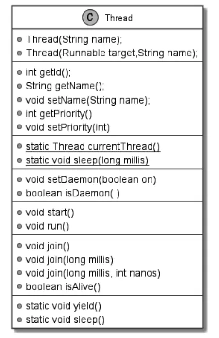
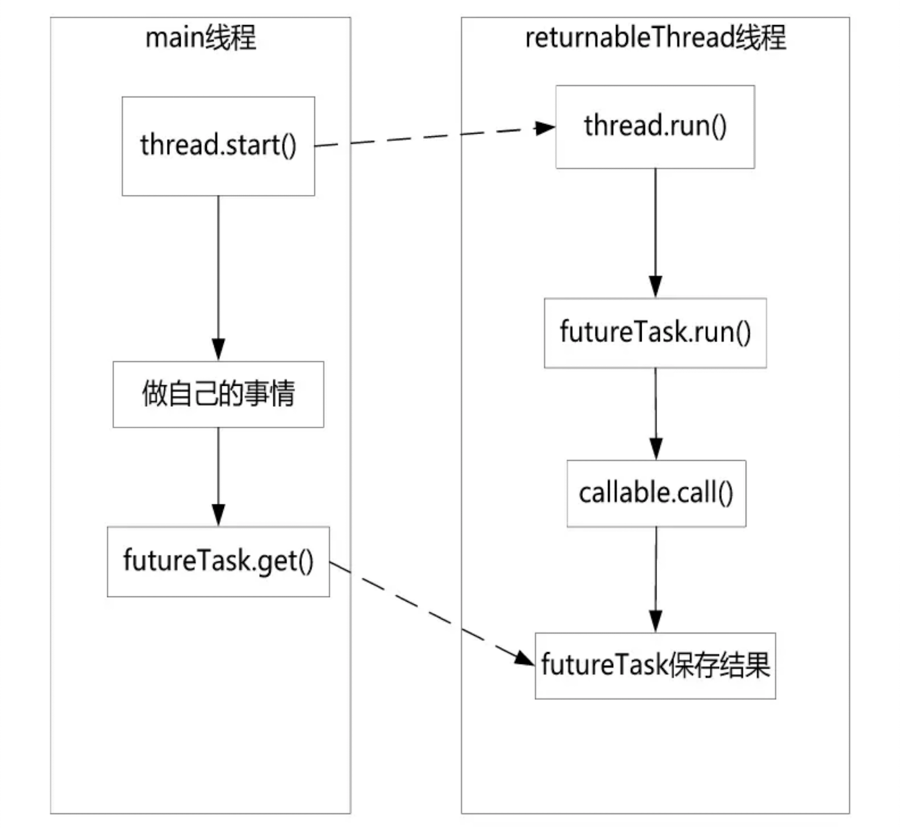
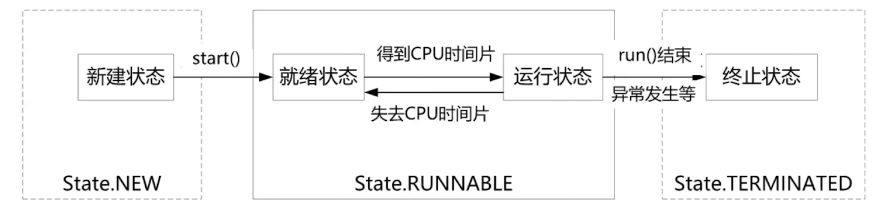

# 第01章_多线程原理与实战

## 1.进程和线程

计算机处理任务的调度单位就是进程和线程。

### 1.1 进程的基本原理

**进程是程序的一次启动执行**，程序就是存放在硬盘中的可执行文件，主要包括代码指令和数据。**一个进程是操作系统将程序装入内存，给程序分配必要的系统资源，并开始运行程序的指令**。同一个程序则可以多次启动，对应多个线程。

在计算机中，CPU 是核心的硬件资源，承担了所有的计算任务；内存资源承担了运行时数据的保存任务；外存资源（硬盘等）承担了数据外部永久存储的任务。其中，计算任务的调度、资源的分配由操作系统来统领。应用程序以进程的形式运行于操作系统之上，享受操作系统提供的服务。

一般来说，一个进程由**程序段**、**数据段**和**进程控制块**三部分组成，大致结构如下：


程序段也一般被称为代码段。代码段是进程的程序指令在内存中的位置，包含需要执行的指令集合；数据段是进程的操作数据在内存中的位置，包含需要操作的数据集合；程序控制块包含进程的描述信息和控制信息，是进程存在的唯一标志。

程序控制块（Program Control Block，PCB）主要由四大部分组成：

1. 进程的描述信息
   
   主要包括：进程 ID 和进程名称，进程 ID 是唯一的，代表进程的身份；进程状态，比如运行、就绪、阻塞；进程优先级，是进程调度的重要依据。

2. 进程的调度信息
   
   主要包括：程序起始地址，程序的第一行指令的内存地址；通信信息，进程间通信时的消息队列。

3. 进程的资源信息
   
   主要包括：内存信息，内存占用情况和内存管理所用的数据结构；I/O 设备信息，所用的 I/O 设备编号及相应的数据结构；文件句柄，所打开文件的信息。

4. 进程上下文
   
   主要包括执行时各种 CPU 寄存器的值、当前程序计数器的值以及各种栈的值等，即进程的环境。在操作系统切换进程时，当前进程被迫让出 CPU，当前进程的上下文就保存在 PCB 结构中，供下次恢复运行时使用。

现代操作系统中，进程是并发执行的，任何进程都可以同其他进程一起执行。在进程内部，代码段和数据段有自己的独立地址空间，不同进程的地址空间是相互独立的。

Java 编写的程序都运行在 Java JVM 虚拟机中，每当使用 Java 命令启动一个 Java 应用程序时，就会启动一个 JVM 进程。在这个 JVM 进程内部，所有 Java 程序代码都是以线程来运行的。JVM 找到程序的入口点`main()`方法，然后运行`main()`方法，这样就产生了一个线程，这个线程被称为**主线程**。当`main()`方法结束后主线程运行完成，JVM 进程也随即退出。

### 1.2 线程的基本原理

早期的操作系统中只有进程而没有线程。进程是程序执行和系统进行并发调用的最小单位。随着 CPU 性能的提升，为了充分利用 CPU，同时弥补进程调度过于笨重产生的问题，进程内部演进出了并发调度的诉求，于是就发明了线程。**线程是指"进程代码段"的一次顺序执行流程**。线程是 CPU 调度的最小单位。一个进程可以有一个或多个线程，各个线程之间共享进程的内存空间、系统资源，进程仍然是操作系统资源分配的最小单位。

Java 程序的进程执行过程就是标准的多线程的执行过程。每当使用 Java 命令执行一个 class 类时，实际上就是启动了一个 JVM 进程。理论上，在该进程的内部至少会启动两个线程，一个是 main 线程，另一个是 GC 线程。但是实际上执行一个 Java 程序后启动的线程远远不止 2 个。

一个标准的线程主要由三部分组成，即**线程描述信息**、**程序计数器**和**栈内存**，如下图所示。


在线程的结构中，线程描述信息即线程的基本信息，主要包括：

1. 线程 ID（线程标识符），是线程的唯一标识，同一个进程内不同线程的 ID 不会重叠。
2. 线程名称，如果没有指定则系统自动分配一个。
3. 线程优先级，优先级越高获得 CPU 的执行机会越大。
4. 线程状态，为新建、就绪、运行、阻塞、结束等状态中的一种

而程序计数器负责记录线程下一条指令的代码段内存地址。栈内存则是代码段中局部变量的存储空间，各个线程间独立。在 JDK 8 中，每个线程创建时默认分配 1MB 大小的栈内存。

在 Java 中，执行程序流程的重要单位是"方法"，而栈内存的分配单位是"栈帧"，**方法的每一次执行都需要为其分配一个栈帧，栈帧主要保存该方法中的局部变量、方法的返回地址以及其他方法的相关信息**。当线程的执行流程进入方法时，JVM 就会为方法分配一个对应的栈帧压入栈内存；当线程的执行流程跳出方法时，JVM 就从栈内存弹出该方法的栈帧，此时方法帧的局部变量的内存空间就会被回收。

### 1.3 进程与线程的区别

（1）线程是"进程代码段"的一次顺序执行流程。一个进程由一个或多个线程组成，一个进程至少有一个线程。

（2）线程是 CPU 调度的最小单位，进程是操作系统分配资源的最小单位。线程的划分尺度小于进程，使得多线程程序的并发性高。

（3）线程是出于高并发的调度诉求从进程内部演进而来的。线程的出现既充分发挥了 CPU 的计算性能，又弥补了进程调度过于笨重的问题。

（4）进程之间是相互独立的，但进程内部的各个线程之间并不完全独立。各个线程之间共享进程的方法区内存、堆内存、系统资源（文件句柄、系统信号等）。

（5）切换速度不同，线程上下文切换比进程上下文切换要快得多。所有有时候线程也称为轻量级进程。

## 2.创建线程的4种方法

Java 进程中每一个线程都对应着一个`Thread`实例。线程的描述信息在`Thread`的实例属性中保存，供 JVM 进行线程管理和调度时使用。虽然一个进程有多个线程，但是在一个 CPU 内核上，同一时刻只能有一个线程是正在执行的，该线程也被称作**当前线程**。

### 2.1 Thead类

`Thread`类位于 java.lang 包中，其结构大致如下图所示。



下面介绍`Thread`类中比较重要的属性和方法：

1. 线程 ID
   
   属性：`private long tid`，用于保存线程的 ID，在进程内唯一。外部通过调用`getId()`方法访问线程 ID。

2. 线程名称
   
   属性：`private String name`，该属性保存一个 Thread 线程实例的名字。可以在创建线程时指定一个名称`Thread(String threadName)`，通过`getName()`和`setName()`来操作，不指定则由 JVM 默认分配一个。

3. 线程优先级
   
   属性：`private int priority`，保存一个`Thread`线程实例的优先级。可通过`getPriority()`和`setPriority()`来操作。Java 线程的最大优先级值为 10，最小值为 1，默认值是 5.这三个优先级值为三个常量值，在`Thread`类中使用类常量定义：

   ```java
   public static final int MIN_PRIORITY = 1;
   public static final int NORM_PRIORITY = 5;
   public static final int MAX_PRIORITY = 10;
   ```

4. 是否为守护线程
   
   守护线程是在进程运行时提供某种后台服务的线程，比如 GC 线程。属性：`private boolean daemon = false`，该属性保存`Thread`线程实例的守护状态，默认为 false，表示是普通的用户线程而不是守护线程。可通过`setDaemon(boolean on)`方法改变线程实例的类型。

5. 线程的状态
   
   属性：`private int threadStatus`，该属性以整数的形式保存线程的状态。执行方法`getState()`可返回当前线程的执行状态，为新建、就绪、运行、阻塞、结束等状态的一种。

   `Thread`的内部静态枚举类`State`用于定义 Java 线程的所有状态，具体如下：

   ```java
   public static enum State {
      NEW, // 新建
      RUNNABLE, // 就绪，运行
      BLOCKED, // 阻塞
      WAITING, // 等待
      TIMED_WAITING, // 计时等待
      TERMINATED; // 结束
   }
   ```

   在 Java 线程的状态中，就绪状态和运行状态在内部使用同一种状态 RUNNABLE 表示。就绪状态表示线程具备运行条件，正等待获取 CPU 时间片；运行状态表示线程已经获取了 CPU 时间片，CPU 正在执行线程代码逻辑。

6. 线程的启动和运行
   
   - `public void start()`：用来启动一个线程，当调用`start()`方法后，JVM 才会开启一个新的线程来执行用户定义的线程代码逻辑，在这个过程中会为相应的线程分配需要的资源。
   - `public void run()`：作为线程代码逻辑的入口方法。`run()`方法不是由用户线程来调用的，当调用`start()`方法启动一个线程后，只要线程获得了 CPU 执行时间，便进入`run()`方法体去执行具体的用户线程代码。

7. 取得当前线程
   
   `public static Thread currentThread()`：用来获取当前线程的`Thread`实例对象。

### 2.2 创建空线程

我们可以通过继承`Thread`类创建一个线程实例。首先演示创建一个空线程：

```java
Thread thread = new Thread();
System.out.println(thread.getName()); // Thread-0
System.out.println(thread.getId()); // 8
System.out.println(thread.getState()); // NEW
System.out.println(thread.getPriority()); // 5
thread.start(); // 启动线程但没有执行任何操作
```
调用`start()`后就会执行`Thread`的`run()`方法，源码为：

```java
public void run() {
   if (this.target != null) {
      this.target.run();
   }
}
```

这里的**target**属性是`Thread`类的一个实例属性，默认为空。

### 2.3 方法一：继承Thread类

创建新线程需要以下两个步骤：

1. 继承`Thread`类，创建新的线程类
2. 重写`run()`方法，将需要并发执行的业务代码写在`run()`方法中

下面是个创建线程的示例：

```java
public class CreateDemo1 {

    static final int MAX_TURN = 5;

    static class DemoThread extends Thread {
        public void run() {
            for (int i = 1; i < MAX_TURN; i++) {
                System.out.println(getName() + "，轮次：" + i);
            }
            System.out.println(getName() + "运行结束。");
        }
    }
    
    public static void main(String[] args) throws InterruptedException {
        Thread thread = null;
        for (int i = 0; i < 2; i ++) {
            thread = new DemoThread();
            thread.start();
        }
        System.out.println(Thread.currentThread().getName() + "运行结束。");
    }
}
```

### 2.4 方法二：实现Runnable接口

在`Thread`类的`run()`方法中如果`target`不为空就执行`target`属性的`run()`方法，`target`是`Thread`类的一个属性并且类型是`Runnable`。在创建`Thread`类的时候可以通过构造器为`target`赋值：

1. `public Thread(Runnable target)`
2. `public Thread(Runnable target, String name)`

使用这两个构造器传入`target`执行目标实例就可以直接通过`Thread`的`run()`方法以默认方式实现线程并发。使用这种方法不用继承`Thread`。

`Runnable`接口位于 java.lang 包中，是一个函数式接口：

```java
@FunctionalInterface

public interface Runnable {
   void run();
}
```

实际创建线程时需要以下几个步骤：

1. 定义一个新类实现`Runnable`接口

2. 实现`Runnable`接口的`run()`抽象方法，将线程代码逻辑放在该实现方法中

3. 通过`Thread`类创建线程对象，将`Runnable`实例作为参数传递给`Thread`类的构造器，由构造器将该`Runnable`实例赋值给`target`

   可以调用的构造器方法有三个：

   - `public Thread(Runnable target)`
   - `public Thread(Runnable target, String name)`
   - `public Thread(ThreadGroup group, Runnable target)`

4. 调用`Thread`实例的`start()`方法启动线程

5. 线程启动后，线程的`run()`方法将被 JVM 执行，该`run()`方法调用`target`属性的`run()`方法，最终执行用户定义的业务代码逻辑

下面是一个多线程演示实例：

```java
public class CreateDemo2 {

    public static final int MAX_TURN = 5;
    static int threadNo = 1;

    static class RunTarget implements Runnable {
        @Override
        public void run() {
            for (int i = 0; i < threadNo; i++) {
                // 因为不是继承的 Thread，这里无法直接调用 getName() 方法
                System.out.println(Thread.currentThread().getName() + "，轮次：" + i);
            }
            System.out.println(Thread.currentThread().getName() + "运行结束。");
        }
    }

    public static void main(String[] args) {
        Thread thread = null;
        for (int i = 0; i < 2; i++) {
            Runnable target = new RunTarget();
            thread = new Thread(target, "RunnableThread" + threadNo++);
            thread.start();
        }
    }
}
```

#### 1.创建Runnable线程目标类的两种方式

使用`Runnable`创建线程目标类除了直接实现`Runnable`接口外，还有两种创建方式：

1. **通过匿名类创建**

   ```java
   // 修改上节的代码
   thread = new Thread(new Runnable(){
       @Override
       public void run() {
           for (int i = 0; i < threadNo; i++) {
           	System.out.println(Thread.currentThread().getName() + "，轮次：" + i);
       }
       	System.out.println(Thread.currentThread().getName() + "运行结束。");
       }
   }, "RunnableThread" + threadNo++);
   thread.start();
   ```

2. **使用`Lambda`表达式创建**

   由于`Runnable`是一个函数式接口（有且仅有一个抽象方法），在接口实现时可以使用`Lambda`表达式提供匿名实现：

   ```java
   thread = new Thread(() -> {
       for (int i = 0; i < threadNo; i++) {
           System.out.println(Thread.currentThread().getName() + "，轮次：" + i);
       }
       System.out.println(Thread.currentThread().getName() + "运行结束。");
   }, "RunnableThread" + threadNo++);
   ```

#### 2.优点

**（1）避免 Java 单继承带来的局限性**

**（2）逻辑和数据更好分离**

通过实现`Runnable`接口的方式创建线程目标类更加适合多个线程去共享计算和处理同一个资源的场景，例如下面的例子。

```java
public class SalesDemo {

    // 商品数量
    public static final int MAX_AMOUNT = 5;

    // 商店商品类，一个商品一个销售线程
    static class StoreGoods extends Thread {

        StoreGoods(String name) {
            super(name);
        }

        private int goodsAmount = MAX_AMOUNT;

        @Override
        public void run() {
            for (int i = 0; i < MAX_AMOUNT; i++) {
                if (this.goodsAmount > 0) {
                    System.out.println(getName() + "卖出一件，还剩：" + --goodsAmount);
                    // omit try-catch
                    Thread.sleep(10);
                }
            }
            System.out.println(getName() + "运行结束.");
        }
    }

    // 商场商品类，可以多人销售一个商品
    static class MallGoods implements Runnable {

        // 使用原子类保证线程安全
        private AtomicInteger goodsAmount = new AtomicInteger(MAX_AMOUNT);

        @Override
        public void run() {
            for (int i = 0; i < MAX_AMOUNT; i++) {
                if (this.goodsAmount.get() > 0) {
                    System.out.println(Thread.currentThread().getName() + "卖出一件，还剩：" + goodsAmount.decrementAndGet());
                    // omit try-catch
                    Thread.sleep(10);
                }
            }
            System.out.println(Thread.currentThread().getName() + "运行结束.");
        }
    }

    public static void main(String args[]) throws InterruptedException {
        System.out.println("===商店销售的版本===");
        for (int i = 1; i <= 2; i++) {
            Thread thread = new StoreGoods("店员-" + i);
            thread.start();
        }
        Thread.sleep(1000);
        System.out.println("===商场销售的版本===");
        MallGoods mallGoods = new MallGoods();
        for (int i = 1; i <= 2; i++) {
            Thread thread = new Thread(mallGoods, "商场销售员-" + i);
            thread.start();
        }
        System.out.println(Thread.currentThread().getName() + "运行结束.");
    }
}
```

结果：

```bash
===商店销售的版本===
店员-2卖出一件，还剩：4
店员-1卖出一件，还剩：4
店员-2卖出一件，还剩：3
店员-1卖出一件，还剩：3
店员-2卖出一件，还剩：2
店员-1卖出一件，还剩：2
店员-1卖出一件，还剩：1
店员-2卖出一件，还剩：1
店员-2卖出一件，还剩：0
店员-1卖出一件，还剩：0
店员-2运行结束.
店员-1运行结束.
===商场销售的版本===
商场销售员-1卖出一件，还剩：4
商场销售员-2卖出一件，还剩：3
main运行结束.
商场销售员-2卖出一件，还剩：2
商场销售员-1卖出一件，还剩：1
商场销售员-1卖出一件，还剩：0
商场销售员-2运行结束.
商场销售员-1运行结束.
```

上面的例子中，`StoreGoods`继承了`Thread`类，创建的每个`StoreGoods`类都维护有一个单独的商品数量，互相之间没有联系；而`MallGoods`类只创建了一次，创建线程时将其传入，相当于所有线程都共享了一个商品数量，即共享了一个`Runnable`实例。

通过对比可以看出：

1. 继承`Thread`类实现多线程可以更好地分离各个线程
2. 实现`Runnable`接口实现多线程能更好地做到多个线程并发地完成同一个任务，但需要注意对于共享资源使用**原子类型数据**保证线程安全

总之，在大多数情况下更推荐实现`Runnable`接口创建执行任务。

### 2.5 方法三：使用Callable和FutureTask

前面介绍的`Thread`类和`Runnable`接口方式无法获取异步执行的任务，因为`run()`没有返回值。因此 Java 在 1.5 版本后提供了一种新的多线程创建方法：通过`Callable`接口和`FutureTask`类相结合创建线程。

#### 1.Callable接口

`Callable`接口位于 java.util.concurrent 包下：

```java
package java.util.concurrent;

@FunctionalInterface
public interface Callable<V> {
    V call() throws Exception;
}
```

`Callable`接口是一个函数式接口，它的抽象方法`call()`有返回值，其类型是`Callable`接口的范型参数类型。`call()`抽象方法还有一个`Exception`的异常声明，允许方法的实现版本中直接抛出异常。相比起来，`Runnable`的`run()`方法没有返回值也没有受检异常的异常声明。

由于`Callable`与`Runnable`没有任何继承关系，因此不能直接传入`Thread`，这时就要使用到`RunnableFuture`接口这个中间搭桥接口。

#### 2.RunnableFuture接口

位于 java.util.concurrent 包下，它继承了`Runnable`接口，保证了可以作为`Thread`线程实例的target 传入，并通过继承`Future`接口保证了可以获取异步执行结果。

```java
package java.util.concurrent;
public interface RunnableFuture<V> extends Runnable, Future<V> {
    void run();
}
```

#### 3.Future接口

`Future`是一个对异步任务进行交互、操作的接口，其至少提供了三大功能：

1. 能够取消异步执行中的任务
2. 判断异步任务是否执行完成
3. 获取异步任务完成后的执行结果

源码如下：

```java
package java.util.concurrent;

public interface Funture<V> {
    // 取消异步执行
    boolean cancel(boolean mayInterruptRunning);
    boolean isCancelled();
    // 判断异步任务是否执行完成
    boolean isDone();
    V get() throws InterruptedException, ExecutionException;
    // 设置时限，获取异步任务完成后的执行结果
    V get(long timeout, TimeUnit unit) throws InterruptedException, ExecutionException, TimeoutException;
    ...
}
```

- `V get()`：调用线程阻塞直到异步任务执行完成并异步返回结果给调用线程
- `V get(long timeout, TimeUnit unit) `：带时限的阻塞获取异步任务执行的结果，如果阻塞时间超过设定的时间则抛出异常
- `boolean isDone()`：获取异步任务的执行状态，如果执行结束则返回 true
- `boolean isCancelled()`：获取异步任务的取消状态，如果任务完成前被取消就返回 true
- `boolean cancel(boolean mayInterruptRunning)`：取消异步任务的执行

需要注意的是`Future`仅仅是一个接口，无法通过它直接完成对异步任务的操作，对此 JDK 提供了一个默认的实现类——`FutureTask`。

#### 4.FutureTask类

`FutureTask`是`RunnableFuture`接口的实现类，相当于**实现了`Runnable`和`Future`接口**，因此它既可以作为一个`Runnable`类型的 target 执行目标被`Thread`执行，也可以作为`Future`异步任务来获取`Callable`的计算结果。

同时`FutureTask`**内部有一个`Callable`类型的`callable`实例属性**：

```java
private Callable<V> callable;
```

`callable`实例属性用来保存并发执行的`Callable<V>`类型的任务，并且`callable`实例属性需要在`FatureTask`实例构造时进行初始化。`FutureTask`类实现了`Runnable`接口，在其`run()`方法的实现版本中会执行`callable`成员的`call()`方法。

此外`FutureTask`内部还有一个非常重要的`Object`类型的实例属性——`outcome`，用来保存`callable`成员的`call()`方法的异步执行结果。在`FutureTask`类的`run()`方法完成`callable`成员的`call()`方法执行后，其结果将被保存在`outcome`实例属性中，供`FutureTask`类的`get()`方法获取。

```java
private Object outcome;
```

#### 5.创建线程的具体步骤

1. 创建一个`Callable`接口的实现类并实现其`call()`方法
2. 使用`Callable`实现类的实例构造一个`FutureTask`实例
3. 使用`FutureTask`实例作为`Thread`构造器的 target 入参构造新的`Thread`线程实例
4. 调用`Thread`实例的`start()`方法启动新的线程执行`run()`方法，内部执行过程为：启动`Thread`实例的`run()`方法并发执行后，会执行`FutureTask`实例的`run()`方法，最终会并发执行`Callable`实现类的`call()`方法

5. 调用`FutureTask`对象的`get()`方法阻塞性地获取并发线程的执行结果

代码示例如下：

```java
public class CreateDemo3 {
    public static final int MAX_TURN = 5;
    public static final int COMPUTE_TIMES = 100000000;

    // 创建 Callable 接口的实现类
    static class ReturnableTask implements Callable<Long> {
        @Override
        public Long call() throws Exception {
            long startTime = System.currentTimeMillis();
            System.out.println(Thread.currentThread().getName() + "线程开始运行.");
            Thread.sleep(1000);

            for (int i = 0; i < COMPUTE_TIMES; i++) {
            	int j = i * 10000;
            }

            long used = System.currentTimeMillis() - startTime;
            System.out.println(Thread.currentThread().getName() + "线程运行结束.");
            return used;
        }
    }

    public static void main(String args[]) throws InterruptedException {
        ReturnableTask task = new ReturnableTask();
        FutureTask<Long> futureTask = new FutureTask<Long>(task);
        Thread thread = new Thread(futureTask, "returnableThread");
        thread.start();
        Thread.sleep(500);
        
        System.out.println(Thread.currentThread().getName() + "干点啥...");
        for (int i = 0; i < COMPUTE_TIMES / 2; i++) {
            int j = i * 10000;
        }

        System.out.println(Thread.currentThread().getName() + "获取并发任务的执行结果.");
        try {
            System.out.println(thread.getName() + "线程占用时间：" + futureTask.get());
        } catch (InterruptedException | ExecutionException e) {
            e.printStackTrace();
        }
        System.out.println(Thread.currentThread().getName() + "运行结束.");
    }
}
```

结果如下：

```bash
returnableThread线程开始运行.
main干点啥...
main获取并发任务的执行结果.
returnableThread线程运行结束.
returnableThread线程占用时间：1012
main运行结束.
```

执行流程大致如下：



调用`futureTask.get()`获取异步执行结果时有两种情况：

1. `futureTask`结果`outcome`不为空，`callable.call()`执行完成

   此时会直接返回结果。

2. `futureTask`结果`outcome`为空，`callable.call()`还没有执行完

   此时调用线程 main 会被阻塞住，一直到`callable.call()`执行完成。但执行完后结果会被保存到`outcome`中，`futureTask`会唤醒 main 线程去提取执行结果。

### 2.6 方法四：使用线程池

前面的实例中创建的`Thread`实例在执行完成后都销毁了，它们是不可复用的。但是由于创建线程的资源消耗很高，实际开发中不能频繁进行线程实例的创建与销毁，而是需要对已经创建好的线程实例进行复用，这就涉及线程池的技术。Java 中提供了一个静态工厂`Executors`来创建不同的线程池。

#### 1.创建线程池

通过`Executors`工厂类创建一个线程池的示例如下：

```java
private static ExecutorService pool = Executors.newFixedThreadPool(3);
```

工厂类方法`newFixedThreadPool(int threads)`用于创建包含固定数目的线程池。

`ExecutorService`是 Java 提供的一个线程池接口，每次在异步执行 target 目标任务的时候，可以通过`ExecutorService`线程池实例提交或者执行。`ExecutorService`实例负责对池中的线程进行管理和调度，并且可以有效控制最大并发线程数，提高系统资源的使用率，同时提供定时执行、定频执行、单线程、并发数控制等功能。

向`ExecutorService`线程池提交异步执行 target 目标任务的常用方法有：

```java
// 执行一个 Runnable 类型的 target 执行目标实例，无返回值
void execute(Runnable command);
// 执行一个 Thread 实例，无返回值
void execute(Thread thread);
// 提交一个 Callable 类型的 target 执行目标实例，返回一个 Future 异步任务实例
<T> Future<T> submit(Callable<T> task);
// 提交一个 Runnable 类型的 target 执行目标实例，返回一个 Future 异步任务实例
Future<?> submit(Runnable task);
```

#### 2.execute()和submit()区别

1. **接收的参数不同**

   `submit()`可以接收两种参数：无返回值的`Runnable`类型（此时调用`get()`只会返回 null）和有返回值的`Callable`类型；`execute()`仅仅接收无返回值的 target 执行目标实例，或者无返回值的 Thread 实例。

2. **`submit()`有返回值，`execute()`无返回值**

   `submit()`方法在提交异步 target 执行目标后会返回`Future`异步任务实例，以便对 target 的异步执行过程进行控制，比如取消执行、获取结果等；`exeute()`没有任何返回值，target 执行目标实例在执行后无法对其异步执行过程进行控制，只能任其执行到结束。

## 3.线程的核心原理

现代操作系统提供了强大的线程管理能力，Java 无需再进行独立的线程管理和调度，而是将线程调度工作**委托给了操作系统的调度进程**去完成。在某些操作系统（例如 Solaris）上，JVM 甚至将每个 Java 线程一对一的对应到操作系统的本地线程，彻底将线程调度委托给操作系统。

### 3.1 线程调度与时间片

由于 CPU 的计算频率非常高，每秒计算数十亿次，因此可以将 CPU 的时间**从毫秒的维度进行分段**，每一小段叫做一个 CPU 时间片。对于不同的操作系统、不同的 CPU、线程的 CPU 时间片长度都不同。假定操作系统线程的时间片长度为 20 毫秒，在一个 2GHz（表示每秒钟可以执行 2 × 10^9 次时钟周期）的 CPU 上，一个时间片可以计算的次数是 20 亿 / 1000 * 20 = 4000 万次，即一个时间片内的计算量是非常巨大的。

目前操作系统中主流的线程调度方式是**基于 CPU 时间片**，即线程只有得到 CPU 时间片才能执行指令，处于执行状态，没有得到时间片的线程处于就绪状态，等待系统分配下一个 CPU 时间片。由于时间片非常短，**在各个线程之间快速地切换**，因此表现出来的特征是很多个线程在“同时执行”或”并发执行“。

线程的调度模型目前主要分为两种：**分时调度模型**和**抢占式调度模型**。

1. 分时调度模型：系统平均分配 CPU 时间片，所有线程轮流占用 CPU

2. 抢占式调度模型：系统按照线程优先级分配 CPU 时间片，优先级高的线程优先分配；如果优先级相同，则随机选择一个

由于目前大部分操作系统都是**抢占式调度模型**，与之相对的，Java 的线程调度也基本上是使用抢占式调度模型，因此 Java 的线程具有优先级。

### 3.2 线程优先级

在`Thread`类中有一个实例属性和两个实例方法用于进行线程优先级相关操作：

```java
private int priority;                        // 优先级，1～10
public final int getPriority();              // 获取线程优先级
public final void setPriority(int priority); // 设置线程优先级
```

`Thread`类中定义的三个优先级常量如下：

```java
public static final int MIN_PRIORITY = 1;
public static final int MIN_PRIORITY = 5;  // 默认
public static final int MIN_PRIORITY = 10;
```

Java 中使用抢占式调度模型进行线程调度，`priority`值越高，线程获得 CPU 时间片的机会越多，但**并不是绝对的**，执行机会的获取具有随机性，某段时间内`thread=10`的线程不一定比`thread=9`的线程获得的时间分片多。

### 3.3 线程生命周期

Java 中线程的生命周期分为 6 种状态，Thread 类中有一个实例属性和一个实例方法专门用于保存和获取线程的状态：

```java
private int threadStatus;             // 整数的形式保存线程状态
public Thread.State getState();       // 返回当前线程的执行状态
```

`Thread.State`是一个内部枚举类，定义了 6 个枚举常量，分别代表线程的 6 种状态：

```java
public static enum State {
    NEW,                  // 新建
    RUNNABLE,             // 可执行状态：包含操作系统的就绪、运行两种状态
    BLOCKED,              // 阻塞
    WAITING,              // 等待
    TIMED_WAITING,        // 限时等待
    TERMINATED;           // 终止
}
```

其中以下 4 种状态比较常见：

#### 1.NEW

Java 源码对 NEW 状态的说明是：创建成功但是没有调用`start()`方法启动的`Thread`线程实例都处于 NEW 状态。但是并不是`start()`方法一经调用状态就从 NEW 到 RUNNABLE，此时并不意味着线程立即获取 CPU 时间片并且立即执行，中间需要一系列操作系统的内部操作。

#### 2.RUNNABLE

Java 中的线程管理是通过 JNI 本地调用的方式委托**操作系统的线程管理 API** 完成的。当 Java 线程的`Thread`实例的`start()`方法被调用后，操作系统中的对应线程进入的并不是运行状态而是就绪状态，而 Java 线程并没有这个就绪状态，而是将运行状态和就绪状态合并为 RUNNABLE 状态，这是 Java 线程状态和操作系统中线程状态不同的地方。

JVM 的线程状态与其幕后的操作系统线程状态之间的转换关系简化后如图：



处于就绪状态的线程需要等待系统的调度，一旦被系统选中获得 CPU 时间片，线程就开始占用 CPU 并执行代码，此时线程的操作系统状态进入了运行状态。当 CPU 时间片用完后又回到就绪状态，等待下一次调度。这种反复调度会一直持续到线程的代码逻辑执行完成或异常终止，此时线程的操作系统状态进入终止状态，即线程的 TERMINATED 状态。

#### 3.TERMINATED

处于 RUNNABLE 状态的线程在`run()`方法执行完成后就变成终止状态 TERMINATED。如果在`run()`方法执行过程中发生了运行时异常而没有被捕获，`run()`方法将被异常终止，线程也会进入 TERMINATED 状态。

#### 4.TIMED_WAITING

线程处于限时等待状态的操作大致有以下几种：

- `Thread.sleep(int n)`：使当前线程进入限时等待状态，等待时间为 n 毫秒
- `Object.wait(long timeout)`：带时限的抢占对象的 monitor 锁
- `Thread.join(long millis)`：带时限的线程合并
- `LockSupport.partNanos(long nanos)`：让线程等待，以纳秒为单位
- `LockSupport.partUntil(long deadline)`：让线程等待直到指定的纳秒时间，可以用`System.nanoTime()`获取当前时间

### 3.4 使用Jstack查看线程状态

Jstack 是 Java 虚拟机自带的一种堆栈跟踪工具，用于生成或导出 JVM 虚拟机运行实例当前时刻的**线程快照**。线程快照是当前 JVM 实例内每一个线程正在执行的方法堆栈的集合，生成或导出线程快照的主要目的是定位线程出现长时间运行、停顿或者阻塞的原因，如线程间死锁、死循环、请求外部资源导致的长时间等待等。

命令的语法格式如下：

```bash
jstack <pid>  # pid 可通过 jps 命令查看
```

通过 Jstack 输出的线程信息主要包括：JVM 线程、用户线程等。其中 JVM 线程在 JVM 启动时就存在，主要包括如执行垃圾回收、周期性任务调度（用于内存监控、运行状况监控）等多个后台线程；用户线程则是在程序创建了新的线程时才会生成。这里需要注意：

1. 实际运行中建议产生三次 DUMP 信息，如果这三次信息都指向同一个问题，才能确定问题的典型性
2. 不同的 Java 虚拟机线程 DUMP 的信息格式是不一样的，即是同一个 JVM 的不同版本也会有差别

Jstack 指令所输出的信息中包含以下重要信息：

1. `tid`：线程实例在 JVM 进程中的 id
2. `nid`：线程实例在操作系统中对应的底层线程的线程 id
3. `prio`：线程实例在 JVM 进程中的优先级
4. `os_prio`：线程实例在操作系统中对应的底层线程的优先级
5. 线程状态：如 runnable、waiting on condition 等

一个示例如下：

```bash
$ jstack 43137
2023-12-10 02:01:59
Full thread dump OpenJDK 64-Bit Server VM (25.362-b08 mixed mode):
...
"Thread-0" #10 prio=5 os_prio=31 tid=0x0000000147919000 nid=0x5803 waiting on condition [0x0000000171bd2000]
   java.lang.Thread.State: TIMED_WAITING (sleeping)
	at java.lang.Thread.sleep(Native Method)
	at CreateDemo3.lambda$0(CreateDemo3.java:32)
	at CreateDemo3$$Lambda$1/1418481495.run(Unknown Source)
	at java.lang.Thread.run(Thread.java:750)
...
```

## 4.线程的基本操作

### 4.1 名称

在`Thread`类中可以通过构造器`Threaed(...)`初始化设置线程名称，也可以通过`setName(...)`实例方法设置线程名称，通过`getName()`取得线程名称。

关于线程名称有以下几个要点：

1. 线程名称一般在启动线程前设置，但也允许为运行中的线程设置名称
2. 允许两个`Thread`对象有相同的名称，但应该避免
3. 如果没有指定，则系统会自动分配一个名称

### 4.2 sleep

`sleep`作用是让正在执行的线程休眠，让 CPU 执行其他的任务，从线程状态来说就是从执行状态变成限时阻塞状态。它有两个重载版本：

```java
// 让目前正在执行的线程休眠 millis 毫秒
public static void sleep(long millis) throws InterruptException;
// 让目前正在执行的线程休眠 millis 毫秒，nanos 纳秒
public static void sleep(long millis, int nanos) throws InterruptException;
```

当线程睡眠时间满后，线程会首先进入就绪状态，等待分配 CPU 时间片。

### 4.3 interrupt

Java 提供了`stop()`方法用于终止正在运行的线程，但是该方法已被设置为过时，因为中断线程时，该线程可能持有某把锁，强行中断会导致锁不能释放的问题；或者线程在操作数据库，强行中断可能导致数据不一致的问题。

这里介绍的`interrupt()`方法本质并不是用来中断一个线程的，而是将线程中断状态位设置为 true。当调用线程的`interrupt()`方法时有两个作用：

1. 如果线程被`Object.wait()`、`Thread.join()`、`Thread.sleep()`三种方法之一阻塞，调用`interrupt()`会立刻退出阻塞，并抛出`interruptedException`异常
2. 如果线程处于运行中，线程不会受到任何影响，仅仅是线程的中断标记被设置为 true，此时线程可以在适当位置自旋，通过调用`isInterrupted()`来查看自己是否被中断，并选择退出

> **注意**
>
> 如果在线程启动后先调用`interrupt()`方法再调用阻塞方法依然会直接抛出异常，如果捕获了该异常后又调用了阻塞方法，则此时不回抛出异常，除非再次调用`interrupt()`方法。即`interrupt()`方法只会影响一次阻塞方法。

### 4.4 join

当线程 A 需要等待线程 B 的执行完成时就需要用到线程合并，被动方线程 B 可以叫做被合并线程。`join()`方法无法获得线程 B 的执行结果。

#### 1.join的三个版本

`join()`方法是 Thread 类的一个实例方法，有三个重载版本：

```java
// 1.此方法会把当前线程变为 TIMED_WAITING，直到被合并线程执行结束
public final void join() throws InterruptedException;
// 2.此方法会把当前线程变为 TIMED_WAITING，直到被合并线程执行结束，或等待被合并线程执行 millis 的时间
public final synchronized void join(long millis) throws InterruptedException;
// 3.此方法会把当前线程变为 TIMED_WAITING，直到被合并线程执行结束，或等待被合并线程执行 millis + nanos 的时间
public final synchronized void join(long millis, int nanos) throws InterruptedException;
```

调用时需要在主动合并线程中调用被合并线程的`join()`方法；带时限的方法与`sleep()`方法相同，等待结束后首先会进入就绪状态，等待 CPU 分片；如果在等待时被中断，就会抛出`InterrupedException`。

```java
class ThreadA extends Thread {
    void run() {
        Thread threadB = new Thread();
        try {
        	threadB.join(10000);  // 线程 A 进入等待，直到线程 B 执行完成或等待超时
        } catch (InterrupedException e) {
            e.printStackTrace();
        }
    }
}
```

#### 2.join的WAITING状态


#### 3.join的TIMED_WAITING状态

### 4.5 yield

### 4.6 daemon

## 5.线程池原理与实战

## 6.确定线程池的线程数

## 7.ThreadLocal原理与实战


