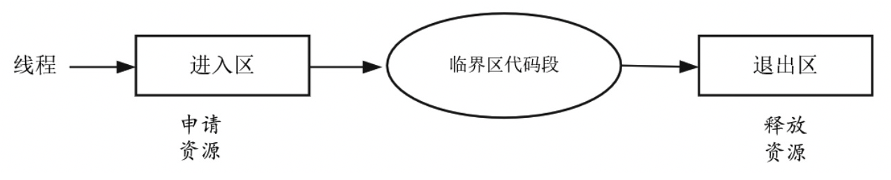
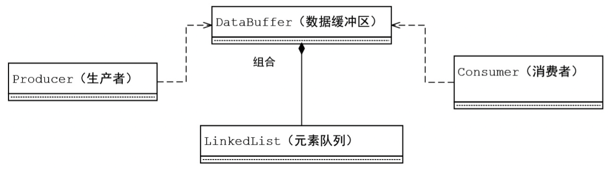
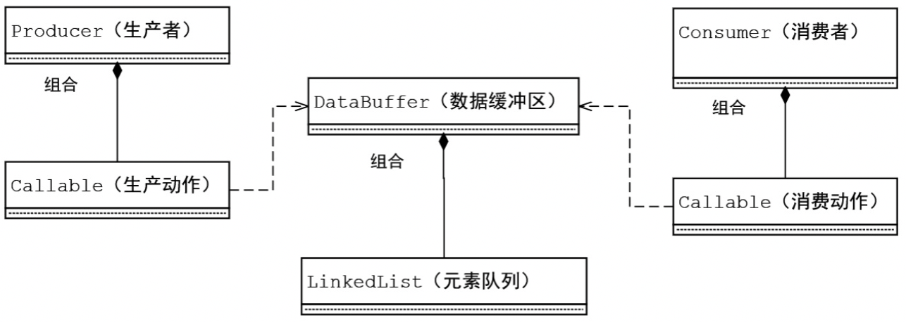
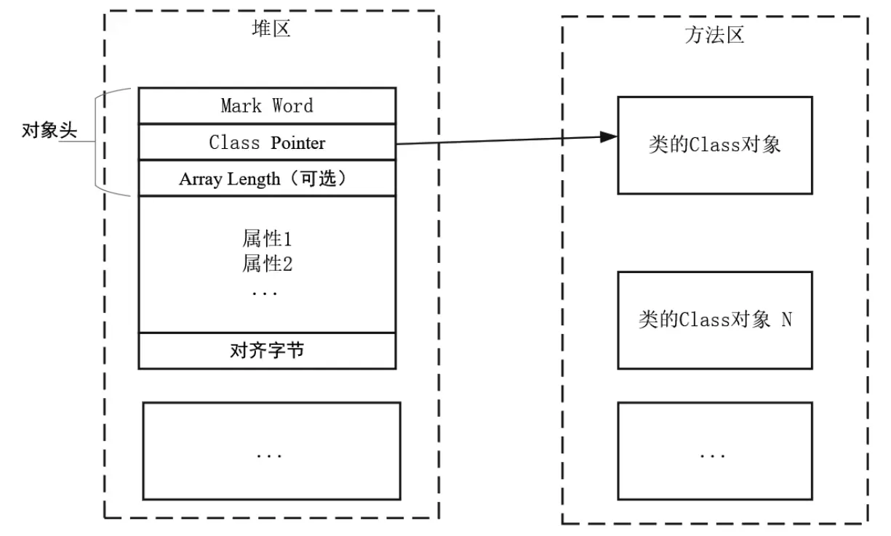

# 第02章_Java内置锁的核心原理

Java 内置锁是一个互斥锁，即最多只有一个线程能够获得该锁，当线程 B 尝试去获得线程 A 持有的内置锁时，线程 B 必须等待或者阻塞，直到线程 A 释放这个锁。

Java 中每个对象都可以用作锁，这些锁称为**内置锁**。线程进入同步代码块或方法时会自动获得该锁，在退出同步代码块或方法时会释放该锁。获得内置锁的唯一途径就是进入这个锁保护的同步代码块或方法。

## 1.线程安全问题

### 1.1 简介

当多个线程并发访问某个 Java 对象时，无论系统如何调度这些线程，也无论这些线程将如何交替操作，这个对象都能表现出一致的、正确的行为，那么对这个对象的操作是线程安全的。

例如自增运算符就不是线程安全的。一个自增运算符是一个符合操作，至少包含三个 JVM 指令：内存取值、寄存器增加 1、存值到内存。这三个 JVM 指令本身是不可再分的，它们都具备原子性，是线程安全的，也叫原子操作。但是两个或者两个以上的原子操作合在一起进行操作就不再具备原子性的。

### 1.2 临界区资源

**临界区资源**表示一种可以被多个线程使用的公共资源或共享资源，但是每一次只能有一个线程使用它。一旦临界区资源被占用，想使用该资源的其他线程则必须等待。

在并发情况下，临界区资源是受保护的对象。**临界区代码段**是每个线程中访问临界资源的那段代码，多个线程必须互斥地对临界区资源进行访问。线程进入临界区代码段之前，必须在进入区申请资源，申请成功之后执行临界区代码段，执行完成之后释放资源。



**竞态条件**可能是由于在访问临界区代码段时没有互斥地访问而导致的特殊情况。如果多个线程在临界区代码段的并发执行结果可能因为代码的执行顺序不同而不同，我们就说这时在临界区出现了竞态条件问题。

例如下面的代码：

```java
public class NotSafePlus
{
    // 临界区资源
    private  Integer amount = 0;

     // 临界区代码段
    public void selfPlus()
    {
        amount++; 
    }
}
```

当多个线程访问临界区的 `selfPlus()` 方法时，就会出现竞态条件的问题。

为了避免竞态条件的问题，我们必须保证临界区代码段操作具备排他性。在 Java 中，我们可以使用 `synchronized` 关键字同步代码块，对临界区代码段进行排他性保护，示意代码如下：

```java
synchronized(syncObject) { 
 //critical section
}
```

在 Java 中，使用 `synchronized` 关键字还可以使用 `Lock` 显式锁实例，或者使用原子变量对临界区代码段进行排他性保护。

## 2.synchronized关键字

在 Java 中，线程同步使用最多的方法是使用 `synchronized` 关键字，每个 Java 对象都隐含有一把琐，这里称为 Java 内置锁（或对象锁、隐式锁）。使用 `synchronized` 调用相当于获取 `syncObject` 的内置锁，所以可以使用内置锁对临界区代码段进行排他性保护。

### 2.1 同步方法

`synchronized` 关键字是 Java 的保留字，当使用 `synchronized` 关键字修饰一个方法的时候，该方法被声明为同步方法。

```java
//同步方法
public synchronized void selfPlus()
{
    amount++; 
}
```

关键字 `synchronized` 的位置处于同步方法的返回类型之前。回到前面的线程安全小实验，现在使用 `synchronized` 关键字对临界区代码段进行保护，代码如下：

```java
package com.crazymakercircle.plus;
// 省略import
public class SafePlus
{
    private Integer amount = 0;
    // 临界区代码段使用 synchronized 进行保护
    public synchronized void selfPlus()
    {
        amount++;
    }

}
```

### 2.2 同步块

对于小的临界区，我们直接在方法声明中设置 `synchronized` 同步关键字，可以避免竞态条件的问题。但是对于较大的临界区代码段，为了执行效率，最好将同步方法分为小的临界区代码段。

```java
 public class TwoPlus {

    private int sum1 = 0;
    private int sum2 = 0;
     // 同步方法
    public synchronized void plus(int val1, int val2){
          // 临界区代码段
        this.sum1 += val1;
        this.sum2 += val2;
    }
 }
```

在以上代码中，临界区代码段包含对两个临界区资源的操作，这两个临界区资源分别为 sum1 和 sum2。使用 `synchronized` 对 `plus(int val1,int val2)` 进行同步保护之后，进入临界区代码段的线程拥有 sum1 和 sum2 的操作权，并且是全部占用。一旦线程进入，当线程在操作 sum1 而没有操作 sum2 时，也将 sum2 的操作权白白占用，其他的线程由于没有进入临界区，只能看着 sum2 被闲置而不能去执行操作。

所以，将 `synchronized` 加在方法上，如果其保护的临界区代码段包含的**临界区资源（要求是相互独立的）多于一个**，就会造成临界区资源的闲置等待，进而会影响临界区代码段的吞吐量。为了提升吞吐量，可以将 `synchronized` 关键字放在函数体内，同步一个代码块。`synchronized` 同步块的写法是：

```java
synchronized(syncObject) // 同步块而不是方法
{
    // 临界区代码段的代码块
}
```

在 `synchronized` 同步块后边的括号中是一个 `syncObject` 对象，代表着进入临界区代码段需要获取 `syncObject` 对象的监视锁，或者说将 `syncObject` 对象监视锁作为临界区代码段的同步锁。由于每一个 Java 对象都有一把监视锁，因此任何 Java 对象都能作为 `synchronized` 的同步锁。当一个线程获得 `syncObject` 对象的监视锁后，其他线程就只能等待。

使用 `synchronized` 同步块对上面的 `TwoPlus` 类进行吞吐量的提升改造，具体的代码如下：

```java
public class TwoPlus{

    private int sum1 = 0;
    private int sum2 = 0;
    private Integer sum1Lock = new Integer(1); // 同步锁一
    private Integer sum2Lock = new Integer(2); // 同步锁二

    public void plus(int val1, int val2){
        // 同步块1
         synchronized(this.sum1Lock){
             this.sum1 += val1;
         }
        // 同步块2
        synchronized(this.sum2Lock){
             this.sum2 += val2;
        }
    }
}
```

改造之后，对两个独立的临界区资源 sum1 和 sum2 的加法操作可以并发执行了，在某一个时刻，不同的线程可以对 sum1 和 sum2 同时进行加法操作，提升了 `plus()` 方法的吞吐量。

**synchronzied 方法和 synchronized 同步代码块**

`syncrhonzied` 方法是一种粗粒度的并发控制，某一时刻只能有一个线程执行该 `syncrhonized` 方法；而 `syncrhonized` 代码块是一种细粒度的并发控制，处于 `syncrhonized` 块之外的其他代码是可以被多个线程并发访问的。

在 Java 的内部实现上，`syncrhonized` 方法实际上等同于同一个 `syncrhonized` 代码块，这个代码块包含同步方法中的所有语句，然后在 `syncrhonized` 代码块的括号中传入 `this` 关键字，使用 `this` 对象锁作为进入临界区的同步锁。

例如下面两种实现编译成 JVM 内部字节码后结果是一样的：

```java
public void plus() {
    synchronized(this){
       amount++; 
    }
    
    public syncrhonzied void plus() {
        amount++;
    }
}
```

### 2.3 静态同步方法

Java 有两种对象：Object 实例对象和 Class 对象。每个类运行时的类型信息用 Class 对象表示，它包含与类名称、继承关系、字段、方法有关的信息。JVM 将一个类加载入自己的方法区内存时，会为其创建一个 Class 对象，对于一个类来说其 Class 对象是唯一的。

Class 类没有公共的构造方法，Class 对象是在类加载的时候由 Java 虚拟机调用类加载器中的 `defineClass` 方法自动构造的，因此不能显式地声明一个 Class 对象。

所有的类都是在第一次使用时被动态加载到 JVM 中的（懒加载），其各个类都是在必需时才加载的。这一点与许多传统语言（如 C++）都不同，JVM 为动态加载机制配套了一个判定一个类是否已经被加载的检查动作，使得类加载器首先检查这个类的 Class 对象是否已经被加载。如果尚未加载，类加载器就会根据类的全限定名查找 .class 文件，验证后加载到 JVM 的方法区内存，并构造其对应的 Class 对象。


使用 `synchronized` 关键字修饰 `static` 方法时，`synchronized` 的同步锁并不是普通 `Object` 对象的监视锁，而是类所对应的 `Class` 对象的监视锁。

```java
package com.crazymakercircle.plus;

public class SafeStaticMethodPlus
{   // 静态的临界区资源
    private static Integer amount = 0;
    // 使用 synchronized 关键字修饰 static 方法
    public static synchronized void selfPlus()
    {
        amount++;
     }
}
```
由于类的对象实例可以有很多，但是每个类只有一个 Class 实例，因此使用类锁作为 `synchronized` 的同步锁时会造成同一个 JVM 内的所有线程只能互斥地进入临界区段。所以，使用 `synchronized` 关键字修饰 `static` 方法是非常**粗粒度**的同步机制。

```java
public static syncrhonized void selfPlus() {
    // 临界区代码
}
```

### 2.4 锁的释放

通过 `synchronized` 关键字所抢占的同步锁的释放场景如下：
- `synchronized` 块（代码块或者方法）正确执行完毕，监视锁自动释放
- 程序出现异常，非正常退出 `synchronized` 块，监视锁也会自动释放

## 3.生产者-消费者问题

生产者-消费者问题（Producer-Consumer Problem）也称**有限缓冲问题**（Bounded-Buffer Problem），是一个多线程同步问题的经典案例。

生产者线程的主要功能是生成一定量的数据放到缓冲区中，然后重复此过程。消费者线程的主要功能是从缓冲区提取（或消耗）数据。这里面的关键问题是：

- 保证生产者不会在缓冲区满时加入数据，消费者也不会在缓冲区空时消耗数据
- 保证在生产者加入过程、消费者消耗过程中，不会产生错误的数据和行为

### 3.1 生产者-消费者模式

关系如下图所示：



在生产者-消费者模式中，至少有以下关键点：

- 生产者与生产者之间、消费者与消费者之间，对数据缓冲区的操作是并发进行的
- 数据缓冲区是有容量上限的。数据缓冲区满后，生产者不能再加入数据；数据缓冲区空时，消费者不能再取出数据
- 数据缓冲区是线程安全的。在并发操作数据缓冲区的过程中，不能出现数据不一致的情况；或者在多个线程并发更改共享数据后，不会造成出现脏数据的情况
- 生产者或者消费者线程在空闲时需要尽可能阻塞而不是执行无效的空操作，尽量节约 CPU 资源

### 3.2 代码实现

生产者、消费者逻辑与对应动作解耦后的类结构如下图：



#### 1.Producer实现

```java
public class Producer implements Runnable {
    // 总次数
    static final AtomicInteger TURN = new AtomicInteger(0);
    // 生产者编号
    static final AtomicInteger PRODUCER_NO = new AtomicInteger(0);
    // 生产者名称
    String name;
    // 生产的动作
    Callable action;
    // 每次生产的间隔时间
    int gap;
    
    public Producer(Callable action, int gap) {
        this.action = action;
        this.gap = gap;
        name = "生产者-" + PRODUCER_NO.incrementAndGet();
    }
    
    @Override
    public void run() {
        while (true) {
            try {
                Object out = action.call();
                if (out != null) {
                    System.out.println("第" + TURN.incrementAndGet() + "轮生产：" + out);
                }
                Thread.sleep(gap);
            } catch (Exception e) {
                e.printStackTrace();
            }
        }
    }
}
```

#### 2.Consumer实现

```java
public class Consumer implements Runnable {
    // 总次数
    static final AtomicInteger TURN = new AtomicInteger(0);
    // 消费者编号
    static final AtomicInteger CONSUMER_NO = new AtomicInteger(0);
    // 消费者名称
    String name;
    // 消费的动作
    Callable action;
    // 每次消费的间隔时间
    int gap;
    
    public Consumer(Callable action, int gap) {
        this.action = action;
        this.gap = gap;
        name = "消费者-" + CONSUMER_NO.incrementAndGet();
    }
    
    @Override
    public void run() {
        while (true) {
            try {
                // 执行消费动作
                Object out = action.call();
                if (out != null) {
                    System.out.println("第" + TURN.incrementAndGet() + "轮消费：" + out);
                }
                Thread.sleep(gap);
            } catch (Exception e) {
                e.printStackTrace();
            }
        }
    }
}
```

#### 3.数据缓存区类

```java
public class SafeDataBuffer<T> {
    public static final int MAX_AMOUNT = 10;
    private BlockingQueue<T> dataList = new LinkedBlockingQueue<>(MAX_AMOUNT);

    public void add(T element) throws InterruptedException {
        // 阻塞添加元素
		dataList.put(element);
    }

    public T fetch() throws InterruptedException {
        // 阻塞获取元素
		return dataList.take();
    }
}
```

#### 4.主类

```java
public class SafeStore {
    private static SafeDataBuffer<Integer> safeDataBuffer = new SafeDataBuffer<>();

    // 生产者动作
    static Callable<Integer> produceAction = () -> {
        int n = new Random().nextInt(10);
        safeDataBuffer.add(n);
        return n;
    };

    // 消费者动作
    static Callable<Integer> consumerAction = () -> {
		return safeDataBuffer.fetch();
    };

    public static void main(String[] args) throws InterruptedException {
        // 并发数
        final int THREAD_TOTAL = 20;
        ExecutorService threadPool = Executors.newFixedThreadPool(THREAD_TOTAL);
        for (int i = 0; i < 5; i++) {
            // 生产者每隔 500 毫秒生产一个商品
            threadPool.submit(new Producer(produceAction, 500));
            // 消费者每隔 1500 毫秒消费一个商品
            threadPool.submit(new Consumer(consumerAction, 1500));
        }
    }
}
```

## 4.Java对象结构与内置锁

### 4.1 Java对象结构

Java 对象结构包括三部分：对象头、对象体和对齐字节：



#### 1.对象三部分

**（1）对象头**

对象头包括三个字段，第一个字段叫做 **Mark Word**（标记字），用于存储自身运行时数据，例如 GC 标志位、哈希码、锁状态等信息。

第二个字段叫做 **Class Pointer**（类对象指针），用于存放方法区 Class 对象的地址，虚拟机通过这个指针来确定这个对象是哪个类的实例。

第三个字段叫做 **Array Length**（数组长度）。可选字段，如果对象是一个 Java 数组，那么此字段必须有，用于记录数据长度的数据；如果对象不是一个 Java 数据，则此次段不存在。

**（2）对象体**

对象体包含对象的实例变量，用于成员属性值，包括父类的成员属性。这部分内存按 4 字节对齐，占用大小取决于对象的属性数量和类型。

**（3）对齐字节**

也叫做填充字节，用来保证 Java 对象所占内存字节数为 8 的倍数。HotSpot VM 的内存管理要求对象起始地址必须是 8 字节的整数倍。对象头本身是 8 的倍数，当对象的实例变量数据不是 8 的倍数时，便需要填充数据来保证 8 字节的对齐。

#### 2.字段长度

Mark Word、Class Pointer、Array Length 等字段的长度都与 JVM 的位数有关。它们的长度都是 JVM 的一个 Word 大小，即 32 位 JVM 的占 32 位，64 位 JVM 为 64 位。

对于 Class Pointer 而言，如果 JVM 中的对象数量过多，使用 64 位的指针将浪费大量内存，通常 64 位 JVM 将会比 32 位 JVM 多耗费 50% 内存。为了节约内存可以使用选项 `+UseCompressedOops` 开启指针压缩（`Oop` 是 Ordinary object pointer 的缩写，表示普通对象指针）。

如果开启 `UseCompressedOops`，则以下类型的指针将从 64 位压缩至 32 位：

- Class 对象的属性指针（静态变量）
- Object 对象的属性指针（成员变量）
- 普通对象数组的元素指针

当然也不是所有的指针都会压缩，一些特殊类型的指针不会压缩，如指向永久代的 Class 对象指针（JDK 8 中指向元空间）、本地变量、堆栈元素、入参、返回值和 NULL 指针等。

> **说明**
>
> 在堆内存小于 32GB 的情况下，64 位虚拟机的 `UseCompressedOops` 是默认开启的。

### 4.2 Mark Word结构信息


### 4.3 使用JOL工具查看对象布局

### 4.4 大小端问题

### 4.5 锁的类型

## 5.偏向锁原理与实战

## 6.轻量级锁原理与实战

## 7.重量级锁原理与实战

## 8.偏向锁、轻量级锁与重量级锁对比

## 9.线程间通信