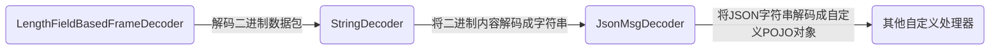
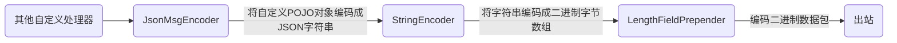

# 第06章_序列化与反序列化

在开发一些远程过程调用（RPC）的程序时通常会涉及对象的序列化/反序列化问题。例如一个 Person 对象从客户端通过 TCP 方式发送到服务端。由于 TCP 只能发送字节流，因此需要应用层将 Java POJO 对象“序列化”成字节流，发送过去之后，数据接收端再将字节流“反序列化”成 Java POJO 对象。

“序列化”和“反序列化”一定会涉及 POJO 的编码和格式化，目前可供选择的编码方式有：

- 将 Java POJO 对象转换成 JSON 结构化字符串，可读性强但性能稍差

- 基于`XML`，和 JSON 一样，可读性强，但性能差

- 使用 Java 内置的编码和序列化机制，可移植性强，性能稍差，无法跨语言

- 开源的二进制序列化/反序列化框架，如 Apache Avro、Apache Thrift、Protobuf 等

  前面两个框架和 Protobuf 相比性能非常接近，而且设计原理一样。其中，Avro 在大数据存储（RPC 数据交换、本地存储）时比较常用；Thrift 的亮点在于内置了 RPC 机制，所以在开发一些 RPC 交互式应用时，客户端和服务端的开发与部署都非常简单。

评价一个序列化框架的优缺点大概从两方面着手：

- 结果数据大小：原则上序列化后的数据尺寸越小，传输效率越高
- 结构复杂度：结构越复杂越耗时

理论上，对于性能要求不是太高的服务器程序，可以选择 JSON 文本格式的序列化框架；对于性能要求比较高的服务器程序，应该选择传输效率更高的二进制序列化框架，如 Protobuf。

Protobuf 是一个高性能、易扩展的序列化框架，性能比较高，本身也非常简单，易于开发，Netty 也提供了相应的编解码器，解决了。Socket 通信中的“半包、粘包”等问题。

## 1.粘包和半包

### 1.1 示例

Netty 发送和读取数据的场所是 ByteBuf 缓冲区，最为理想的情况是：发送端每发送一个缓冲区，接收端就能收到一个缓冲区，并且发送端和接收端的缓冲区内容一模一样。然而在实际的通信中，往往会出现各种各样的问题。

下面改造一下前面的 NettyEchoClient，通过循环的方式向 NetyEchoServer 写入大量的 ByteBuf，观察服务器响应结果：

```java
public class NettyDumpSendClient {

    private String serverIp;
    private int serverPort;
    Bootstrap b = new Bootstrap();

    public NettyDumpSendClient(String serverIp, int serverPort) {
	this.serverIp = serverIp;
	this.serverPort = serverPort;
    }

    public void runClient() {
	NioEventLoopGroup eventLoopGroup = new NioEventLoopGroup();
	try {
	    b.group(eventLoopGroup);
	    b.channel(NioSocketChannel.class);
	    b.remoteAddress(serverIp, serverPort);
	    b.option(ChannelOption.ALLOCATOR, PooledByteBufAllocator.DEFAULT);
	    b.handler(new ChannelInitializer<SocketChannel>() {
		@Override
		protected void initChannel(SocketChannel ch) throws Exception {
		    ch.pipeline().addLast(NettyEchoClientHandler.INSTANCE);
		}
	    });
	    ChannelFuture channelFuture = b.connect();
	    channelFuture.addListener(l -> {
		if (l.isSuccess())
		    Logger.info("客户端连接成功");
		else
		    Logger.info("客户端连接失败");
	    });
	    channelFuture.sync();
	    Channel channel = channelFuture.channel();

	    byte[] bytes = "测试粘包半包问题".getBytes(Charset.forName("UTF-8"));
	    for (int i = 0; i < 1000; i++) {
		ByteBuf buffer = channel.alloc().buffer();
		buffer.writeBytes(bytes);
		channel.writeAndFlush(buffer);
	    }

	    channel.closeFuture().sync();
	} catch (Exception e) {
	    e.printStackTrace();
	} finally {
	    eventLoopGroup.shutdownGracefully();
	}
    }

    public static void main(String[] args) {
	new NettyDumpSendClient("localhost", 18899).runClient();
    }

}
```

服务端控制台

```bash
[nioEventLoopGroup-2-1|NettyEchoClientHandler.channelRead] |>  client received: 测试粘包半包问题
[nioEventLoopGroup-2-1|NettyEchoClientHandler.channelRead] |>  client received: 测试粘包半包问题测试粘包半包问题测试粘包半�
[nioEventLoopGroup-2-1|NettyEchoClientHandler.channelRead] |>  client received: ��问题
```

观察服务端和客户端的控制台输出，可以发现存在三种类型的输出：

- 读到一个完整的客户端输入 ByteBuf —— 全包
- 读到多个客户端的 ByteBuf 输入，但是粘在了一起 —— 粘包
- 读到部分 ByteBuf 的内容，并且有乱码 —— 半包

总的来说，半包问题包含了“粘包”和“半包”两种情况：

- 粘包：接收端收到一个 ByteBuf，包含了发送端的多个 ByteBuf，发送端的多个 ByteBuf 在接受端粘在了一起
- 半包：接收端将发送端的一个 ByteBuf 拆开了，收到了多个破碎的包

### 1.2 半包问题的根本原因

众所周知，底层网络是以二进制字节报文的形式来传输数据的。

- 读数据的过程大致为：当 IO 可读时，Netty 会从底层网络将二进制数据读到 ByteBuf 缓冲区中，再交给 Netty 程序转成 Java POJO 对象
- 写数据的过程大致为：编码器将一个 Java 类型的数据转换成底层能够传输的二进制 ByteBuf 缓冲数据

在发送端 Netty 的应用层进程缓冲区中，程序以 ByteBuf 为单位来发送数据，但是到了底层操作系统内核缓冲区，底层会按照协议的规范对数据包进行二次封装，封装成传输层的协议报文，再进行发送。在接收端收到传输层的二进制包后，首先复制到内核缓冲区，Netty 读取 ByteBuf 时才复制到应用的用户缓冲区。

在接收端，当 Netty 程序将数据从内核缓冲区复制到用户缓冲区的 ByteBuf 时，问题来了：

- 每次读取底层换冲的数据容量是有限制的，当 TCP 内核缓冲区的数据包比较大时，可能会将一个底层包分成多次 ByteBuf 进行复制，进而造成用户缓冲区读到半包
- 当 TCP 内核缓冲区的数据包比较小时，一次复制的是不止一个内核缓冲区包，进而造成用户缓冲区读到粘包

### 1.3 解决的基本思路

在接收端，Netty 程序需要根据自定义协议将读取到的进程缓冲区 ByteBuf 在应用层进行二次组装，重新组装应用层的数据包。接收端的这个过程通常也称为分包或者拆包。

在 Netty 中分包的方法主要有以下两种：

- 自定义解码器分包器：实现`ByteToMessageDecoder`或者`ReplayingDecoder`
- 使用 Netty 内置解码器：例如可以使用`LengthFieldBasedFrameDecoder`

## 2.使用JSON协议通信

JSON（JavaScript Object Notation，JS 对象简谱）是一种轻量级的数据交换格式。它是基于 ECMAScript（欧洲计算机协会制定的 JS 规范）的一个子集，采用完全独立于编程语言的文本格式来存储和表示数据。

JSON 和 XML 一样都使用结构化方法来标记数据，但它不像 XML 那样需要有严格的闭合标签，数据量与数据包比大大提升，在同等数据流量的前提下减少了网络的传输压力。

### 2.1 开源库

Java 处理 JSON 数据有三个比较流行的开源类库：阿里巴巴的 FastJson、谷歌的 Gson 和开源社区的 Jackson。

- Jackson

  一个简单的、基于 Java 的 JSON 开源库。使用 Jackson 开源库可以轻松地在 Java POJO 和 JSON、XML 格式字符串间互相转换。其优点是：依赖的 Jar 包较少、简单易用、性能也不错，社区活跃；缺点是：对于复杂的 POJO 类型以及复杂的集合 Map、List 的转换结果，不是标准的 JSON 格式，或者会出现一些问题。

- Gson

  一个功能齐全的 JSON 解析库，可以完成复杂类型的 POJO 和 JSON 字符串的相互转换，转换能力强。

- FastJson

- 一个高性能的 JSON 库，采用独创的快速算法，将 JSON 转成 POJO 的速度提升到极致，序列化速度超过其他 JSON 开源库。

在实际开发中，目前主流的策略是 Gson 和 FastJson 结合使用，在 POJO 序列化成 JSON 字符串的应用场景下使用谷歌的 Gson；在 JSON 字符串反序列化成 POJO 的应用场景下，使用阿里巴巴的 FastJson。

下面编写一个简单的序列化反序列化通用类`JsonUtil`：

```java
public class JsonUtil {
    static GsonBuilder gb = new GsonBuilder();

    static {
	// 允许接收 HTML 标签
	gb.disableHtmlEscaping();
    }

    public static String pojoToJson(Object obj) {
	return gb.create().toJson(obj);
    }

    public static <T> T jsonToPojo(String json, Class<T> clazz) {
	return JSONObject.parseObject(json, clazz);
    }
}
```

### 2.3 案例：JSON序列化与反序列化

定义一个 POJO 类

```java
@Data
@AllArgsConstructor
@NoArgsConstructor
public class JsonMsg {

    private int id;
    private String content;

}
```

测试

```java
public class JsonSerializationTester {
    @Test
    void testJsonSerialization() {
	JsonMsg jsonMsg = new JsonMsg(1, "msg");
	String json = JsonUtil.pojoToJson(jsonMsg);
	Logger.info(json);
	Logger.info(JsonUtil.jsonToPojo(json, JsonMsg.class));
    }
}
```

### 2.4 JSON传输的编码器和解码器

本质上，传输 JSON 所用到的协议与传输普通文本所使用的协议没有什么不同，下面用常用的 Head-Content 协议来实现 JSON 传输。

解码过程



编码过程与解码过程类似



**`LengthFieldPrepender`**

Netty 内置`LengthFieldPrepender`编码器，其作用是在数据包的前面加上内容的二进制字节数组的长度。它与`LengthFieldBasedFrameDecoder`解码器是配套使用的。

`LengthFieldPrepender`有两个常用的构造器：

```java
public LengthFieldPrepender(int lengthFieldLength) {
    this(lengthFieldLength, false);
}

public LengthFieldPrepender(int lengthFieldLength, Boolean lengthIncludesLengthFieldLength) {
    this(lengthFieldLength, 0, lengthIncludesLengthFieldLength);
}
```

- `lengthFieldLength`：Head 长度字段所占用的字节数
- `lengthIncludesLengthFieldLength`：`lengthFieldLength`是否包含长度字段自身的字节数，一般为 false，表示只包含内容的二进制数据的长度

### 2.5 案例：JSON传输的服务端

服务端接收客户端的数据包，并解码成 JSON，再转换成 POJO。

```java
```


### 2.6 案例：JSON传输的客户端

## 3.使用Protobuf协议通信

## 4.案例：Protobuf编解码

## 5.Protobuf协议语法