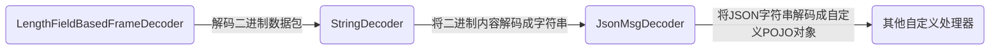
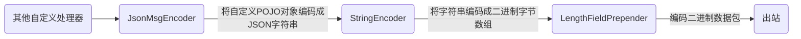
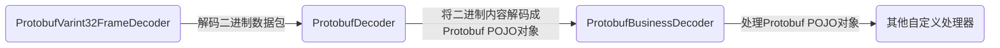
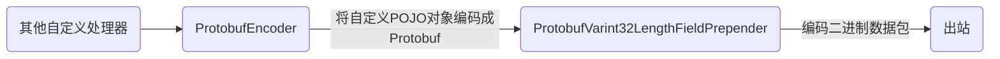

# 第06章_序列化与反序列化

在开发一些远程过程调用（RPC）的程序时通常会涉及对象的序列化/反序列化问题。例如一个 Person 对象从客户端通过 TCP 方式发送到服务端。由于 TCP 只能发送字节流，因此需要应用层将 Java POJO 对象“序列化”成字节流，发送过去之后，数据接收端再将字节流“反序列化”成 Java POJO 对象。

“序列化”和“反序列化”一定会涉及 POJO 的编码和格式化，目前可供选择的编码方式有：

- 将 Java POJO 对象转换成 JSON 结构化字符串，可读性强但性能稍差

- 基于`XML`，和 JSON 一样，可读性强，但性能差

- 使用 Java 内置的编码和序列化机制，可移植性强，性能稍差，无法跨语言

- 开源的二进制序列化/反序列化框架，如 Apache Avro、Apache Thrift、Protobuf 等

  前面两个框架和 Protobuf 相比性能非常接近，而且设计原理一样。其中，Avro 在大数据存储（RPC 数据交换、本地存储）时比较常用；Thrift 的亮点在于内置了 RPC 机制，所以在开发一些 RPC 交互式应用时，客户端和服务端的开发与部署都非常简单。

评价一个序列化框架的优缺点大概从两方面着手：

- 结果数据大小：原则上序列化后的数据尺寸越小，传输效率越高
- 结构复杂度：结构越复杂越耗时

理论上，对于性能要求不是太高的服务器程序，可以选择 JSON 文本格式的序列化框架；对于性能要求比较高的服务器程序，应该选择传输效率更高的二进制序列化框架，如 Protobuf。

Protobuf 是一个高性能、易扩展的序列化框架，性能比较高，本身也非常简单，易于开发，Netty 也提供了相应的编解码器，解决了。Socket 通信中的“半包、粘包”等问题。

## 1.粘包和半包

### 1.1 示例

Netty 发送和读取数据的场所是 ByteBuf 缓冲区，最为理想的情况是：发送端每发送一个缓冲区，接收端就能收到一个缓冲区，并且发送端和接收端的缓冲区内容一模一样。然而在实际的通信中，往往会出现各种各样的问题。

下面改造一下前面的 NettyEchoClient，通过循环的方式向 NetyEchoServer 写入大量的 ByteBuf，观察服务器响应结果：

```java
public class NettyDumpSendClient {

    private String serverIp;
    private int serverPort;
    Bootstrap b = new Bootstrap();

    public NettyDumpSendClient(String serverIp, int serverPort) {
	this.serverIp = serverIp;
	this.serverPort = serverPort;
    }

    public void runClient() {
	NioEventLoopGroup eventLoopGroup = new NioEventLoopGroup();
	try {
	    b.group(eventLoopGroup);
	    b.channel(NioSocketChannel.class);
	    b.remoteAddress(serverIp, serverPort);
	    b.option(ChannelOption.ALLOCATOR, PooledByteBufAllocator.DEFAULT);
	    b.handler(new ChannelInitializer<SocketChannel>() {
		@Override
		protected void initChannel(SocketChannel ch) throws Exception {
		    ch.pipeline().addLast(NettyEchoClientHandler.INSTANCE);
		}
	    });
	    ChannelFuture channelFuture = b.connect();
	    channelFuture.addListener(l -> {
		if (l.isSuccess())
		    Logger.info("客户端连接成功");
		else
		    Logger.info("客户端连接失败");
	    });
	    channelFuture.sync();
	    Channel channel = channelFuture.channel();

	    byte[] bytes = "测试粘包半包问题".getBytes(Charset.forName("UTF-8"));
	    for (int i = 0; i < 1000; i++) {
		ByteBuf buffer = channel.alloc().buffer();
		buffer.writeBytes(bytes);
		channel.writeAndFlush(buffer);
	    }

	    channel.closeFuture().sync();
	} catch (Exception e) {
	    e.printStackTrace();
	} finally {
	    eventLoopGroup.shutdownGracefully();
	}
    }

    public static void main(String[] args) {
	new NettyDumpSendClient("localhost", 18899).runClient();
    }

}
```

服务端控制台

```bash
[nioEventLoopGroup-2-1|NettyEchoClientHandler.channelRead] |>  client received: 测试粘包半包问题
[nioEventLoopGroup-2-1|NettyEchoClientHandler.channelRead] |>  client received: 测试粘包半包问题测试粘包半包问题测试粘包半�
[nioEventLoopGroup-2-1|NettyEchoClientHandler.channelRead] |>  client received: ��问题
```

观察服务端和客户端的控制台输出，可以发现存在三种类型的输出：

- 读到一个完整的客户端输入 ByteBuf —— 全包
- 读到多个客户端的 ByteBuf 输入，但是粘在了一起 —— 粘包
- 读到部分 ByteBuf 的内容，并且有乱码 —— 半包

总的来说，半包问题包含了“粘包”和“半包”两种情况：

- 粘包：接收端收到一个 ByteBuf，包含了发送端的多个 ByteBuf，发送端的多个 ByteBuf 在接受端粘在了一起
- 半包：接收端将发送端的一个 ByteBuf 拆开了，收到了多个破碎的包

### 1.2 半包问题的根本原因

众所周知，底层网络是以二进制字节报文的形式来传输数据的。

- 读数据的过程大致为：当 IO 可读时，Netty 会从底层网络将二进制数据读到 ByteBuf 缓冲区中，再交给 Netty 程序转成 Java POJO 对象
- 写数据的过程大致为：编码器将一个 Java 类型的数据转换成底层能够传输的二进制 ByteBuf 缓冲数据

在发送端 Netty 的应用层进程缓冲区中，程序以 ByteBuf 为单位来发送数据，但是到了底层操作系统内核缓冲区，底层会按照协议的规范对数据包进行二次封装，封装成传输层的协议报文，再进行发送。在接收端收到传输层的二进制包后，首先复制到内核缓冲区，Netty 读取 ByteBuf 时才复制到应用的用户缓冲区。

在接收端，当 Netty 程序将数据从内核缓冲区复制到用户缓冲区的 ByteBuf 时，问题来了：

- 每次读取底层换冲的数据容量是有限制的，当 TCP 内核缓冲区的数据包比较大时，可能会将一个底层包分成多次 ByteBuf 进行复制，进而造成用户缓冲区读到半包
- 当 TCP 内核缓冲区的数据包比较小时，一次复制的是不止一个内核缓冲区包，进而造成用户缓冲区读到粘包

### 1.3 解决的基本思路

在接收端，Netty 程序需要根据自定义协议将读取到的进程缓冲区 ByteBuf 在应用层进行二次组装，重新组装应用层的数据包。接收端的这个过程通常也称为分包或者拆包。

在 Netty 中分包的方法主要有以下两种：

- 自定义解码器分包器：实现`ByteToMessageDecoder`或者`ReplayingDecoder`
- 使用 Netty 内置解码器：例如可以使用`LengthFieldBasedFrameDecoder`

## 2.使用JSON协议通信

JSON（JavaScript Object Notation，JS 对象简谱）是一种轻量级的数据交换格式。它是基于 ECMAScript（欧洲计算机协会制定的 JS 规范）的一个子集，采用完全独立于编程语言的文本格式来存储和表示数据。

JSON 和 XML 一样都使用结构化方法来标记数据，但它不像 XML 那样需要有严格的闭合标签，数据量与数据包比大大提升，在同等数据流量的前提下减少了网络的传输压力。

### 2.1 开源库

Java 处理 JSON 数据有三个比较流行的开源类库：阿里巴巴的 FastJson、谷歌的 Gson 和开源社区的 Jackson。

- Jackson

  一个简单的、基于 Java 的 JSON 开源库。使用 Jackson 开源库可以轻松地在 Java POJO 和 JSON、XML 格式字符串间互相转换。其优点是：依赖的 Jar 包较少、简单易用、性能也不错，社区活跃；缺点是：对于复杂的 POJO 类型以及复杂的集合 Map、List 的转换结果，不是标准的 JSON 格式，或者会出现一些问题。

- Gson

  一个功能齐全的 JSON 解析库，可以完成复杂类型的 POJO 和 JSON 字符串的相互转换，转换能力强。

- FastJson

- 一个高性能的 JSON 库，采用独创的快速算法，将 JSON 转成 POJO 的速度提升到极致，序列化速度超过其他 JSON 开源库。

在实际开发中，目前主流的策略是 Gson 和 FastJson 结合使用，在 POJO 序列化成 JSON 字符串的应用场景下使用谷歌的 Gson；在 JSON 字符串反序列化成 POJO 的应用场景下，使用阿里巴巴的 FastJson。

下面编写一个简单的序列化反序列化通用类`JsonUtil`：

```java
public class JsonUtil {
    static GsonBuilder gb = new GsonBuilder();

    static {
	// 允许接收 HTML 标签
	gb.disableHtmlEscaping();
    }

    public static String pojoToJson(Object obj) {
	return gb.create().toJson(obj);
    }

    public static <T> T jsonToPojo(String json, Class<T> clazz) {
	return JSONObject.parseObject(json, clazz);
    }
}
```

### 2.3 案例：JSON序列化与反序列化

定义一个 POJO 类

```java
@Data
@AllArgsConstructor
@NoArgsConstructor
public class JsonMsg {

    private int id;
    private String content;

}
```

测试

```java
public class JsonSerializationTester {
    @Test
    void testJsonSerialization() {
	JsonMsg jsonMsg = new JsonMsg(1, "msg");
	String json = JsonUtil.pojoToJson(jsonMsg);
	Logger.info(json);
	Logger.info(JsonUtil.jsonToPojo(json, JsonMsg.class));
    }
}
```

### 2.4 JSON传输的编码器和解码器

本质上，传输 JSON 所用到的协议与传输普通文本所使用的协议没有什么不同，下面用常用的 Head-Content 协议来实现 JSON 传输。

解码过程



编码过程与解码过程类似



**`LengthFieldPrepender`**

Netty 内置`LengthFieldPrepender`编码器，其作用是在数据包的前面加上内容的二进制字节数组的长度。它与`LengthFieldBasedFrameDecoder`解码器是配套使用的。

`LengthFieldPrepender`有两个常用的构造器：

```java
public LengthFieldPrepender(int lengthFieldLength) {
    this(lengthFieldLength, false);
}

public LengthFieldPrepender(int lengthFieldLength, Boolean lengthIncludesLengthFieldLength) {
    this(lengthFieldLength, 0, lengthIncludesLengthFieldLength);
}
```

- `lengthFieldLength`：Head 长度字段所占用的字节数
- `lengthIncludesLengthFieldLength`：`lengthFieldLength`是否包含长度字段自身的字节数，一般为 false，表示只包含内容的二进制数据的长度

### 2.5 案例：JSON传输的服务端

服务端接收客户端的数据包，并解码成 JSON，再转换成 POJO。

```java
public class JsonServer {

    private final int serverPort;
    ServerBootstrap b;

    public JsonServer(int serverPort) {
        this.serverPort = serverPort;
        b = new ServerBootstrap();
    }

    public void runServer() {
        NioEventLoopGroup bossLoopGroup = new NioEventLoopGroup(1);
        NioEventLoopGroup workerLoopGroup = new NioEventLoopGroup();

        try {
            b.group(bossLoopGroup, workerLoopGroup);
            b.channel(NioServerSocketChannel.class);
            b.localAddress(serverPort);
            b.option(ChannelOption.SO_KEEPALIVE, true);
            b.option(ChannelOption.ALLOCATOR, PooledByteBufAllocator.DEFAULT);
            b.childOption(ChannelOption.ALLOCATOR, PooledByteBufAllocator.DEFAULT);

            b.childHandler(new ChannelInitializer<SocketChannel>() {

            @Override
            protected void initChannel(SocketChannel ch) throws Exception {
                ch.pipeline().addLast(new LengthFieldBasedFrameDecoder(1024, 0, 4, 0, 4));
                // Netty 内置的字符串解码器
                ch.pipeline().addLast(new StringDecoder(CharsetUtil.UTF_8));
                ch.pipeline().addLast(new JsonMsgDecoder());
            }

            });

            ChannelFuture channelFuture = b.bind();
            channelFuture.addListener(l -> {
            Logger.info("服务器启动成功，监听端口：" + channelFuture.channel().localAddress());
            });
            channelFuture.sync();

            ChannelFuture closeFuture = channelFuture.channel().closeFuture();
            closeFuture.sync();
        } catch (Exception e) {
            e.printStackTrace();
        } finally {
            bossLoopGroup.shutdownGracefully();
            workerLoopGroup.shutdownGracefully();
        }
    }

    public static void main(String[] args) {
	new JsonServer(18899).runServer();
    }
}
```

```java
public class JsonMsgDecoder extends MessageToMessageDecoder<String> {

    @Override
    protected void decode(ChannelHandlerContext ctx, String msg, List<Object> out) throws Exception {
        JsonMsg jsonMsg = JsonUtil.jsonToPojo(msg, JsonMsg.class);
        Logger.info("收到一个 jsonMsg：" + jsonMsg);
        out.add(jsonMsg);
    }

}
```

### 2.6 案例：JSON传输的客户端

客户端仅仅进行数据的编码，然后把数据包写到服务器。

```java
public class JsonClient {

    private final static String CONTENT = "hello world!";
    private final String serverIp;
    private final int serverPort;
    private final Bootstrap b;

    public JsonClient(String serverIp, int serverPort) {
        this.serverIp = serverIp;
        this.serverPort = serverPort;
        b = new Bootstrap();
    }

    public void runClient() {
        NioEventLoopGroup workerLoopGroup = new NioEventLoopGroup();

        try {
            b.group(workerLoopGroup);
            b.channel(NioSocketChannel.class);
            b.remoteAddress(serverIp, serverPort);
            b.option(ChannelOption.ALLOCATOR, UnpooledByteBufAllocator.DEFAULT);

            b.handler(new ChannelInitializer<SocketChannel>() {

            @Override
            protected void initChannel(SocketChannel ch) throws Exception {
                ch.pipeline().addLast(new LengthFieldPrepender(4));
                // Netty 内置的字符串编码器
                ch.pipeline().addLast(new StringEncoder(CharsetUtil.UTF_8));
                ch.pipeline().addLast(new JsonMsgEncoder());
            }

            });

            ChannelFuture channelFuture = b.connect();
            channelFuture.addListener(l -> {
            if (l.isSuccess())
                Logger.info("客户端连接成功");
            else
                Logger.info("客户端连接失败");
            });
            channelFuture.sync();

            Channel channel = channelFuture.channel();

            for (int i = 0; i < 10; i++) {
            channel.writeAndFlush(new JsonMsg(i, CONTENT));
            }

            ChannelFuture closeFuture = channel.closeFuture();
            closeFuture.sync();
        } catch (Exception e) {
            e.printStackTrace();
        } finally {
            workerLoopGroup.shutdownGracefully();
        }
    }

    public static void main(String[] args) {
		new JsonClient("localhost", 18899).runClient();
    }
}
```

```java
public class JsonMsgEncoder extends MessageToMessageEncoder<JsonMsg> {

    @Override
    protected void encode(ChannelHandlerContext ctx, JsonMsg msg, List<Object> out) throws Exception {
	String json = JsonUtil.pojoToJson(msg);
	Logger.info("发送一个 json：" + json);
	out.add(json);
    }

}
```

## 3.使用Protobuf协议通信

Protobuf（Protocol Buffer）是 Google 提出的一种数据交换格式，是一条类似 JSON 或者 XML 的数据传输格式和规范，微信的消息传输就采用了 Protobuf 协议，其具有以下特点：

- 语言无关、平台无关

- 二进制格式，不具有可读性

- 体积小，传输效率高
- 扩展性、兼容性好

Protobuf 的编码过程为：使用预先定义的 Message 数据结构将实际的传输数据进行打包，然后编码成**二进制的码流**进行传输或者存储。Protobuf 的解码过程刚好相反：将二进制码流解码成 Protobuf 自定义的 Message 结构的 POJO 实例。

### 3.1 案例：简单的proto文件

Protobuf 使用 proto 文件来预先定义消息格式。数据包按照 proto 文件所定义的消息格式完成二进制码流的编解码。proto 文件相当于一个消息的协议文件，这个协议文件的后缀为`.proto`。

作为演示，下面介绍一个非常简单的 proto 文件：仅仅定义一个消息结构体，包含两个字段：

```protobuf
// [开始声明]
syntax = "proto3";
//定义 protobuf 的包名称空间
//package com.crazymakercircle.netty.protocol;
// [结束声明]

// [开始 java 选项配置]
option java_package = "model";
option java_outer_classname = "MsgProtos";
// [结束 java 选项配置]

// [开始 消息定义]
message Msg {
  uint32 id = 1;  // Unique ID number for this person.
  string content = 2;
}
// [结束 消息定义]
```

在 proto 文件的头部声明中需要声明一下所使用的协议版本，默认的协议版本为`proto2`，这里使用`proto3`，两者消息格式略有不同。

Protobuf 支持多种语言，所以它为不同的语言提供了一些可选的配置选项，使用`option`关键字。

- `option java_package`

  在生成 proto 文件中消息的 POJO 类和 Builder 的 Java 代码时，将生成的 Java 代码放入该选项所指定的 package 类路径中。

- `option java_outer_classname`

  在生成 proto 文件所对应的 Java 代码时，生成的 Java 外部类使用配置的名称。

在 proto 文件中，使用`message`关键字来定义消息的结构体。在生成 proto 对应的 Java 代码时，每个具体的消息结构体将对应于一个最终的 Java POJO 类。结构体的字段对应到 POJO 类的属性。proto 文件的`message`可以内嵌`message`，就像 Java 的内部类一样。

每个消息结构体可以有多个字段。定义一个字段的格式为“类型名称 = 编号”。例如：`string content = 2;`表示该字段是 String 类型，字段名为 content，编号为 2。字段编号表示在 Protobuf 数据包的序列化、反序列化时该字段的**具体排序**。

### 3.2 生成POJO和Builder

完成`.proto`文件定义后，下一步是生成消息的 POJO 类 和 Builder 类。生成 Java 类有两种方式：一种通过控制台命令；另一种是使用 Maven 插件。

#### 1.控制台命令

首先从 https://github.com/protocolbuffers/protobuf/releases 下载 Protobuf 的安装包。

生成构造者代码需要用到`protoc`执行文件，安装完成后，将`protoc`安装目录加入 path 环境变量中。生成 Java 的 Builder 命令如下：

```java
protoc --java_out=./src/main/java/ ./Msg/proto
```

在上面的命令中，使用的 proto 文件的名称为`./Msg/proto`，生成的 POJO 类和构造者类的输出文件夹为：`./src/main/java`。

#### 2.Maven插件

使用`protobuf-maven-plugin`插件可以非常方便地生成 POJO 和 Builder 类的 Java 代码。在 Maven 的 pom 文件中增加插件的配置项如下：

```xml
<plugin>
    <groupId>org.xolstice.maven.plugins</groupId>
    <artifactId>protobuf-maven-plugin</artifactId>
    <version>0.5.0</version>
    <extensions>true</extensions>
    <configuration>
        <!--proto文件路径-->
        <protoSourceRoot>${project.basedir}/src/main/java/protobuf</protoSourceRoot>
        <!--目标路径-->
        <outputDirectory>${project.basedir}/src/main/java</outputDirectory>
        <!--设置是否在生成 java 文件之前清空 outputDirectory 的文件-->
        <clearOutputDirectory>false</clearOutputDirectory>
        <!--临时目录-->
        <temporaryProtoFileDirectory>${project.basedir}/src/main/java/protobuf-temp</temporaryProtoFileDirectory>
        <!--protoc 可执行文件路径-->
        <protocExecutable>/Users/youyi/Downloads/protoc-22/bin/protoc</protocExecutable>
    </configuration>
    <executions>
        <execution>
            <goals>
                <goal>compile</goal>
                <goal>test-compile</goal>
            </goals>
        </execution>
    </executions>
</plugin>
```

配置好后执行插件的`compile`命令就自动生成 Java 代码。

### 3.3 案例：Protobuf序列化反序列化

在 Maven 的 pom.xml 加上 protobuf 的 Java 运行包的依赖：

```xml
<!-- https://mvnrepository.com/artifact/com.google.protobuf/protobuf-java -->
<dependency>
    <groupId>com.google.protobuf</groupId>
    <artifactId>protobuf-java</artifactId>
    <version>3.22.0-RC3</version>
</dependency>
```

这里的版本号要与`proto`详细结构体文件中的`syntax`配置项值，以及 protoc 的可执行文件的版本一致。

#### 1.使用Builder构造POJO消息对象

```java
public class ProtobufDemo {
    public static MsgProtos.Msg buildMsg() {
	Builder builder = MsgProtos.Msg.newBuilder();
	builder.setId(100);
	builder.setContent("hello world");
	return builder.build();
    }
}
```

Protobuf 为每个 message 结构体生成的 Java 类中包含了一个 POJO 类、一个 Builder 类。

#### 2.序列化与反序列化的方式

获得消息 POJO 的实例之后，可以通过多种方法调用 POJO 对象序列化成二进制字节或者反序列化。

##### 2.1 方式1

调用 Protobuf POJO 对象的`toByteArray()`方法将 POJO 对象序列化成字节数组；调用静态方法`parseFrom(byte[] data)`方法将字节数组反序列化为 POJO 对象。

```java
@Test
public void serAndDesr1() throws IOException {
    Msg msg = buildMsg();
    byte[] array = msg.toByteArray();
    ByteArrayOutputStream outputStream = new ByteArrayOutputStream();
    outputStream.write(array);

    byte[] out = outputStream.toByteArray();
    Msg inMsg = Msg.parseFrom(out);

    Logger.info("msg: " + msg);
    Logger.info("msg2: " + inMsg);
}
```

##### 2.2 方式2

调用 Protobuf POJO 对象的`writeTo(OutputStream)`将 POJO 对象的二进制字节写出到输出流；调用静态方法`parseFrom(InputStream)`从输入流中读取二进制码然后反序列化。

```java
@Test
public void serAndDesr2() throws IOException {
    Msg msg = buildMsg();
    ByteArrayOutputStream outputStream = new ByteArrayOutputStream();
    msg.writeTo(outputStream);

    ByteArrayInputStream inputStream = new ByteArrayInputStream(outputStream.toByteArray());
    Msg inMsg = Msg.parseFrom(inputStream);

    Logger.info("msg: " + msg);
    Logger.info("msg2: " + inMsg);
}
```

##### 2.3 方式3

调用 Protobuf POJO 对象的`writeDelimitedTo(OutputStream)`在序列化的字节码之前添加了字节数组的长度，这里长度的类型不是固定长度的 int 类型，而是可变长度 varint32 类型；反序列化时调用静态方法`parseDelimitedFrom(intputStream)`从输入流中先读取 varint32 类型的长度值，再根据长度值读取消息的二进制字节，在反序列化得到 POJO 实例。

适用于异步操作的 NIO 应用中，解决了粘包/半包问题。

```java
@Test
public void serAdnDesr3() throws IOException {
    Msg msg = buildMsg();
    ByteArrayOutputStream outputStream = new ByteArrayOutputStream();
    msg.writeDelimitedTo(outputStream);

    ByteArrayInputStream inputStream = new ByteArrayInputStream(outputStream.toByteArray());
    Msg inMsg = Msg.parseDelimitedFrom(inputStream);

    Logger.info("msg: " + msg);
    Logger.info("msg2: " + inMsg);
}
```

## 4.Protobuf编解码

Netty 默认支持 Protobuf 的编码与解码，内置了一套基础的 Protobuf 编码和解码器。

### 4.1 Netty内置的Protobuf编解码器

#### 1.ProtobufEncoder

`ProtobufEncoder`的实现逻辑非常简单，直接调用了 Protobuf POJO 实例的`toByteArray()`方法将其编码成二进制字节，然后放入 ByteBuf 缓冲区中，传入下一站。

**源码**

```java
@Sharable
public class ProtobufEncoder extends MessageToMessageEncoder<MessageLiteOrBuilder> {
    @Override
    protected void encode(ChannelHandlerContext ctx, MessageLiteOrBuilder msg, List<Object> out)
            throws Exception {
        if (msg instanceof MessageLite) {
            out.add(wrappedBuffer(((MessageLite) msg).toByteArray()));
            return;
        }
        if (msg instanceof MessageLite.Builder) {
            out.add(wrappedBuffer(((MessageLite.Builder) msg).build().toByteArray()));
        }
    }
}
```

#### 2.ProtobufDecoder

`ProtobufDecoder`和`ProtobufEncoder`相互对应，在使用的时候需要指定一个 Protobuf POJO 实例作为解码的参考原型，解码时会根据原型实例找到对应的 Parser 解析器，将二进制字节解码成 Protobuf POJO 实例。

**使用**

```java
new ProtobufDecoder(MsgProtos.Msg.getDefaultInstance());
```

仅仅使用以上这组编码器和解码器在 NIO 通信中会存在粘包/半包问题。Netty 提供了配套的 Head-Content 类型的 Protobuf 编码器和解码器，在二进制码流之前加上二进制字节数组的长度。

#### 3.ProtobufVarint32LengthFieldPrepender

这个编码器的作用是在 ProtobufEncoder 生成的字节数组之前前置一个 varint32 数字，表示序列化的二进制字节数量或者长度。

#### 4.ProtobufVarint32FrameDecoder

这个解码器的作用是根据数据包中长度域（Varint 32）中的长度值解码一个足够的字节数组，然后将字节数组交给下一站的解码器`ProtobufDecoder`。

> **补充：Varint32 类型**
>
> Varint32 是一种紧凑的表示数字的方法，不是一种固定长度的数字类型。它用一个或多个字节来表示一个数字，值越小，使用的字节数越少。varint32 根据值的大小自动进行收缩，能够减少用于保存长度的字节数。所以为了更好地减少通信过程中的传输量，消息头中的长度尽量采用 varint 格式。

使用 Netty 内置的 Protobuf 编解码器可以完成简单的 Head-Content（Length + Protobuf data）协议的数据传输。但是在更复杂的传输应用场景下，Netty 的内置编码器和解码器是不够用的。例如在 Head 部分加上魔数字段进行安全验证或者需要对 Protobuf 字节内容进行加解密，此时就需要自定义 Protobuf 编解码器。

### 4.2 案例：Protobuf传输的服务端



```java
public class ProtobufServer {

    private final int serverPort;
    private ServerBootstrap b;

    public ProtobufServer(int serverPort) {
        this.serverPort = serverPort;
        b = new ServerBootstrap();
    }

    public void runServer() {
        NioEventLoopGroup bossLoopGroup = new NioEventLoopGroup(1);
        NioEventLoopGroup workerLoopGroup = new NioEventLoopGroup();

        try {
            b.group(bossLoopGroup, workerLoopGroup);
            b.channel(NioServerSocketChannel.class);
            b.localAddress(serverPort);
            b.option(ChannelOption.SO_KEEPALIVE, true);
            b.option(ChannelOption.ALLOCATOR, PooledByteBufAllocator.DEFAULT);
            b.childOption(ChannelOption.ALLOCATOR, PooledByteBufAllocator.DEFAULT);

            b.childHandler(new ChannelInitializer<SocketChannel>() {
                @Override
                protected void initChannel(SocketChannel ch) throws Exception {
                    ch.pipeline().addLast(new ProtobufVarint32FrameDecoder());
                    ch.pipeline().addLast(new ProtobufDecoder(Msg.getDefaultInstance()));
                    ch.pipeline().addLast(new ProtobufBusinessHandler());
                }
            });

            ChannelFuture channelFuture = b.bind();
            channelFuture.addListener(l -> {
            if (l.isSuccess())
                Logger.info("服务器启动成功，监听端口：" + channelFuture.channel().localAddress());
            else
                Logger.info("服务启动失败");
            });

            channelFuture.sync();

            ChannelFuture closeFuture = channelFuture.channel().closeFuture();
            closeFuture.sync();
        } catch (Exception e) {
            e.printStackTrace();
        } finally {
            bossLoopGroup.shutdownGracefully();
            workerLoopGroup.shutdownGracefully();
        }
    }

    class ProtobufBusinessHandler extends ChannelInboundHandlerAdapter {

        @Override
        public void channelRead(ChannelHandlerContext ctx, Object msg) throws Exception {
            Msg protoMsg = (Msg) msg;
            Logger.info("收到一个Msg");
            Logger.info("msg 的 id 是：" + protoMsg.getId());
            Logger.info("msg 的 content 是：" + protoMsg.getContent());
            super.channelRead(ctx, msg);
    	}
    }

    public static void main(String[] args) {
		new ProtobufServer(18899).runServer();
    }

}
```

### 4.3 案例：Protobuf传输的客户端



```java
public class ProtobufClient {

    private final String serverIp;
    private final int serverPort;
    private Bootstrap b;
    private final static String CONTENT = "hello world!";

    public ProtobufClient(String serverIp, int serverPort) {
        this.serverIp = serverIp;
        this.serverPort = serverPort;
        b = new Bootstrap();
    }

    public void runClient() {
        NioEventLoopGroup workLoopGroup = new NioEventLoopGroup();

        try {
            b.group(workLoopGroup);
            b.channel(NioSocketChannel.class);
            b.remoteAddress(serverIp, serverPort);
            b.option(ChannelOption.ALLOCATOR, UnpooledByteBufAllocator.DEFAULT);

            b.handler(new ChannelInitializer<SocketChannel>() {
                @Override
                protected void initChannel(SocketChannel ch) throws Exception {
                    ch.pipeline().addLast(new ProtobufVarint32LengthFieldPrepender());
                    ch.pipeline().addLast(new ProtobufEncoder());
                }
            });

            ChannelFuture channelFuture = b.connect();
            channelFuture.addListener(l -> {
            if (l.isSuccess())
                Logger.info("客户端连接成功");
            else
                Logger.info("客户端连接失败");
            });
            channelFuture.sync();

            Channel channel = channelFuture.channel();
            for (int i = 0; i < 10; i++) {
            Msg msg = Msg.newBuilder().setId(i).setContent(CONTENT).build();
            channel.writeAndFlush(msg);
            }

            ChannelFuture closeFuture = channel.closeFuture();
            closeFuture.sync();
        } catch (Exception e) {
            e.printStackTrace();
        } finally {
            workLoopGroup.shutdownGracefully();
        }
    }

    public static void main(String[] args) {
		new ProtobufClient("localhost", 18899).runClient();
    }

}
```

## 5.Protobuf协议语法

一个 proto 文件有两大组成部分：头部声明、消息结构体的定义。头部声明部分主要包含了协议的版本、包名、特定语言的选项设置等；消息结构体部分可以定义一个或者多个消息结构体。在 Java 中，当用 Protobyf 编译器来编译`.proto`文件时，编译器将生成 Java 语言的 POJO 消息类和 Builder 构造者类。

**示例**

```protobuf
// [开始声明]
syntax = "proto3";
//定义 protobuf 的包名称空间
//package com.crazymakercircle.netty.protocol;
// [结束声明]

// [开始 java 选项配置]
option java_package = "model";
option java_outer_classname = "MsgProtos";
// [结束 java 选项配置]

// [开始 消息定义]
message Msg {
  uint32 id = 1;  // Unique ID number for this person.
  string content = 2;
}
// [结束 消息定义]
```

### 5.1 头部声明

**1.syntax版本号**

对于一个 proto 文件，文件的第一个非空、非注释的行必须注明 Protobuf 的语法版本，如果没有声明则默认版本是“proto2”。

**2.package包**

在 Java 语言中，会以`package`指定的包名作为生成的 POJO 类的包名（和`option java_package`叠加）。

**3.option配置选项**

不是所有的 `option`配置选项都会生效，`option`选项是否生效与 proto 文件使用的一些特定语言场景有关。在 Java 语言中，以“java_”打头的`option`选项会生效。

- `option java_package`

  表示 Protobuf 编译器在生成 Java POJO 消息类时，生成再次选项所配置的 Java 包名下。如果没有该选项，则会以头部声明中的 package 作为 Java 包名。

- `option java_multiple_files`

  表示在生成 Java 类时的打包方式，具体来说有以下两种方式：

  - 一个消息对应一个独立的 Java 类
  - 所有的消息都作为内部类，打包到一个外部类中（默认）

- `option java_outer_classname`

  表示 Protobuf 编译器在生成 Java POJO 消息类时，如果采用的是打包到一个外部类的方式，则此选项所配置的值作为唯一外部类的类名。

### 5.2 消息结构体与消息字段

定义一个 Protobuf 消息结构体的关键字是`message`，一个消息结构体由一个或者多个消息字段组合而成。

Protobuf 消息字段的格式为：

```bash
限定修饰符 ｜ 数据类型 ｜ 字段名称 ｜ = ｜ 分配标示号
```

**1.限定修饰符**

- `repeated`：表示该字段可以包含 0～N 个元素值，相当于 Java 中的 List

- `singular`（默认）：表示该字段可以包含 0～1 个元素值

- `reserved`：指定保留字段名称和分配标示号，用于将来的扩展

  ```protobuf
  message MsgFoo {
  	reserved 12, 15, 9 to 11; // 预留将来使用的分配标示号
  	reserved "foo", "bar"; // 预留将来使用的字段名
  }
  ```

**2.数据类型**

见下一小节。

**3.字段名称**

字段名称的命名与 Java 的成员变量命名方式几乎相同，Protobuf 建议字段的命名以下划线分隔，而不是驼峰式。

**4.分配标示号**

对于开发者而言没有太大的关系。

在消息定义中，每个字段都有唯一的一个数字标识符，可以理解为字段编码值，称为分配标示号。通过该值，通信双方才能互相识别对方的字段。相同的编码值，它的限定修饰符和数据类型必须相同。

分配标示号用来在消息的二进制格式中识别各个字段的，一旦开始使用就不能够再改变。

分配标示号的取值范围是 1～2^32^，其中编号 1～15 的分配标示号在编码时只占用一个字节，因此时间和空间效率都是最高的，16～2047 字内的标示号要占用两个字节。切记！要为将来有可能添加的、频繁出现的字段预留一些标示号。另外，1900～2000 之类的标示号为 Protobuf 内部保留值，建议不要在项目中使用。

特点：一个消息结构体中的标示号可以是不连续的；同一个消息结构体中不同字段不能使用相同的标示号。

### 5.3 数据类型

| Proto Type |                             说明                             | 对应的 Java Type |
| :--------: | :----------------------------------------------------------: | :--------------: |
|   double   |                        双精度浮点类型                        |      double      |
|   float    |                        单精度浮点类型                        |      float       |
|   int32    | 使用变长编码，对于负值的效率很低，如果字段有可能有负值，就使用 sint64 替代 |       int        |
|   unit32   |                 使用变长编码的 32 位整数类型                 |       int        |
|   unit64   |                 使用变长编码的 64 位整数类型                 |       long       |
|   sint32   | 使用变长编码，有符号的 32 位整数类型值。这些编码在负值时比 int32 高效 |       int        |
|   sint64   | 使用变长编码，有符号的 64 位整数类型值。这些编码在负值时比 int64 高效 |       long       |
|  fixed32   |  4 个字节，如果数值总是比 2^28^ 大，这个类型比 unit32 高效   |       int        |
|  fixed64   |  8 个字节，如果数值总是比 2^56^ 大，这个类型比 unit64 高效   |       long       |
|  sfixed32  |                           4 个字节                           |       int        |
|  sfixed64  |                           8 个字节                           |       long       |
|    bool    |                           布尔类型                           |     boolean      |
|   string   |     一个字符必须是 UTF-8 编码或者 7-bit ASCII 编码的文本     |      string      |
|   bytes    |                  可能包含任意顺序的字节数据                  |    bytestring    |

变长编码的类型表示打包的字节并不是固定的，而是根据数据的大小或者长度来定的。例如 int32，如果数值比较小，在 0～127 之间时就使用一个字节打包。

定长编码和变长编码的区别是：fixed23 的打包效率比 int32 的效率高，但是使用的空间一般比 int32 多。因此定长编码时间效率高，变长编码空间效率高。一般情况下可以选择 fixed32，但是遇到对传输效率要求比较苛刻的环境时可以选择 int32。

### 5.4 其他语法规范

**1.声明**

在需要多个消息结构体时，proto 文件可以像 Java 语言的类文件一样按照模块进行分开设计，所以一个项目可能有多个 proto 文件，一个文件在需要依赖其他 proto 文件时可以通过`import`导入。

**2.嵌套消息**

消息中既可以包含另一个消息实例作为其字段，也可以在消息中定义一个新的消息。

```protobuf
message outer {
	message MiddleA {
		message Inner {
			int64 ival = 1;
			bool booly = 2;
		}
	}
	message MiddleB {
		message Inner {
			int32 ival = 1;
			bool booly = 2;
		}
	}
}
```

如果想在父消息类型的外部重复使用这些内部的消息类型，可以使用`Parent.Type`的形式来引用：

```protobuf
message SomeOtherMessage {
	Outer.MiddleA.Inner ref = 1;
}
```

**3.枚举**

枚举值必须是大于等于 0 的整数，需要使用分号`;`分割枚举变量，而不是 Java 语言中的逗号`,`。

```protobuf
enum VoipProtocol {
	H323 = 1;
	SIP = 2;
	MGCP = 3;
	H248 = 4;
}
```

