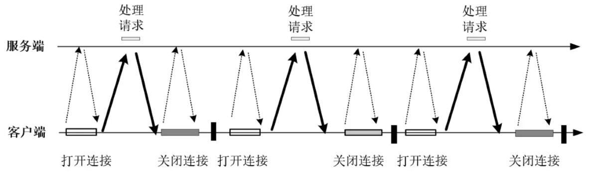
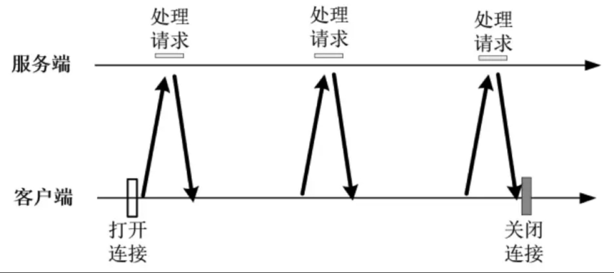
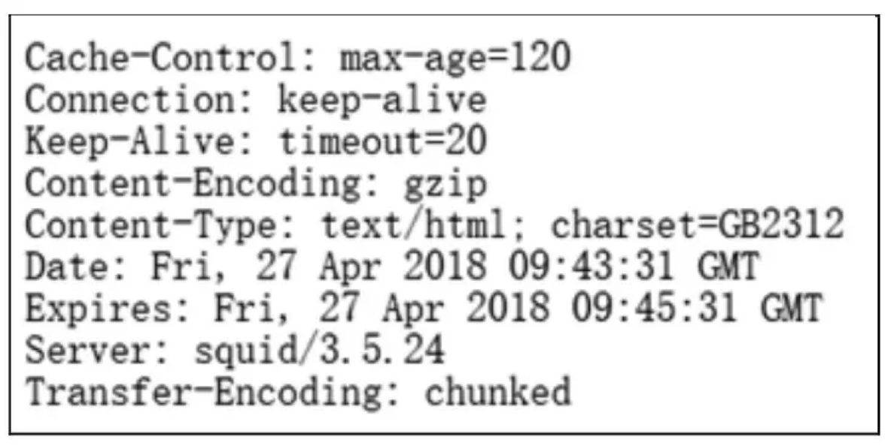
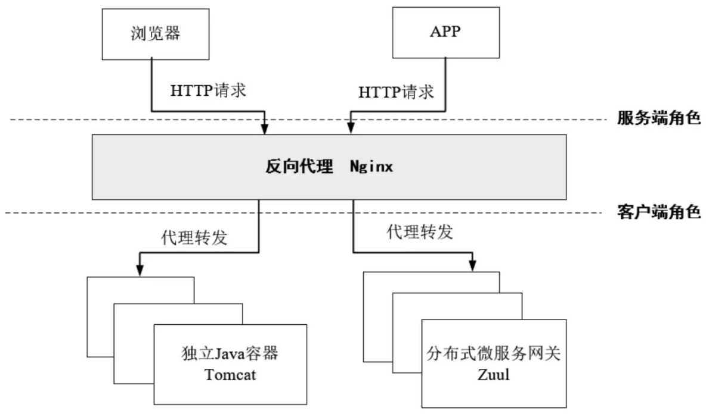

# 第09章_高并发HTTP通信核心原理

HTTP 是应用层协议，是建立在传输层 TCP 基础之上。在通信过程中，TCP 每一次连接的建立与拆除都会经历 3 次握手和 4 次挥手，性能和效率较低。HTTP 一个显著的特点是无状态的，并且最初的设计初衷是用于短连接场景，请求时建立连接、请求完释放连接。这就导致每一次原始 HTTP 协议的传输都需要进行连接的建立和拆除，导致性能较差。

在单个客户端和服务器通信部频繁的场景下，短连接的性能还是很高的。但是随着微服务技术的发展，分布式应用内部会存在大量、高频率的内部 RPC 调用或者 HTTP 通信，如果依然频繁地进行传输层 TCP 连接的建立与拆除，就会拖慢整体的性能，此时就需要用到 **HTTP 连接复用技术**。

在 Java 分布式应用的架构和实现中，涉及 HTTP 连接复用的高并发场景大致有以下几种：

1. **反向代理 Nginx 到 Java Web 应用服务之间的 HTTP 高并发通信**

   传统的 Nginx + Tomcat 架构的 Web 应用一般使用 Tomcat 作为 Web 服务器，在并发访问量上升之后会引入 Nginx 作为接入层反向代理服务器，利用其负载均衡的能力，将请求代理分发到多个上游 Web 服务器。

   一个简单的传统 Nginx + Tomcat 架构如下图所示

   

   该架构可以通过 Web 服务器的横向扩展甚至反向代理的分层扩展提高系统并发的能力。

   这种架构中在 Nginx 和 Tomcat 之间进行反向代理请求转发时，对性能和速度的要求是很高的，此时需要 HTTP 下层的 TCP 连接通道具备可复用的能力，以提升响应效率和高并发能力。

2. **微服务网关和微服务 Provider 实例之间的 HTTP 高并发通信**

   一个经典的分布式微服务应用架构如下图所示

   

   在使用 Nginx + Spring Cloud 微服务架构的应用中，外部接入网关 Nginx 和 内部网关 Zuul（或 Spring Cloud Gateway）之间，以及内部网关与微服务 Provider 实例之间，都存在着 HTTP 请求的反向代理（或者请求转发）的关系，所以要求这些 HTTP 连接传输层的通道具备可复用的能力，以提升效应效率和高并发能力。

3. **分布式微服务 Provider 实例与实例之间 RPC 远程调用的 HTTP 高并发通信**

   

   在微服务架构中，微服务 Provider 实例之间的 RPC 也是通过 HTTP 完成的，因此要求连接通道具备可复用的能力，以提升效应效率和高并发能力。

4. **Java 通过 HTTP 客户端访问 REST 接口服务的 HTTP 高并发通信**

   在这种场景下，本地 HTTP 客户端和远程 REST 接口服务之间需要进行频繁的 HTTP 通信，要求连接通道具备可复用的能力，以提升效应效率和高并发能力。

除此之外，只要是在进行 HTTP 通信的两端之间通信和交互的频率高，就都需要具备连接复用的能力，都属于需要复用 HTTP 连接的场景。

## 1.详解传输层TCP

TCP/IP 包含了一系列协议，也叫做 TCP/IP 协议族（TCP/IP Protocol Suite，或 TCP/IP Protocols），简称 TCP/IP。TCP/IP 协议族提供了点对点的连接机制，并且将传输数据帧的封装、寻址、传输、路由以及接受方式都予以标准化。

### 1.1 TCP/IP的分层模型

首先介绍一下七层 ISO 模型。国际标准化组织 ISO 为了使网络应用更为普及，推出了 OSI 参考模型，即开放式系统互联（Open System Interconnect）模型，一般称为 **OSI 参考模型**。OSI 参考模型是 ISO 组织在 1985 年发布的网络互联模型，含义就是为所有公司使用一个统一的规范来控制网络，这样所有公司遵循相同的通信规范，网络就能互联互通了。

OSI 模型定义了网络互联的七层框架（物理层、数据链路层、网络层、传输层、会话层、表示层、应用层）每一层实现各自的功能和协议，并完成与相邻层的接口通信。OSI 模型各层的通信协议大致如下：


TCP/IP 协议是互联网最基本的协议，在一定程度上参考了七层 ISO 模型，在 TCP/IP 协议中七层被简化为四个层次。TCP/IP 协议与七层 ISO 模型的对应关系大致如下：


#### 1.TCP/IP协议的应用层

应用层包括所有和应用程序协同工作并利用基础网络交换应用程序的业务数据的协议。应用层协议包括 HTTP（万维网服务）、FTP（文件传输）、SMTP（电子邮件）、SSH（安全远程登录）、DNS（域名解析）以及许多其他协议。

#### 2.TCP/IP协议的传输层

传输层的协议解决了端到端可靠性等问题，能确保数据可靠地到达目的地，甚至能保证数据按照正确的顺序到达目的地。传输层的主要功能大致如下：

- 为端到端连接提供传输服务
- 提供流量控制、差量控制、服务质量（Qos，Quality of Service）等管理服务

传输层中主要有两个性质不同的协议：TCP（传输控制协议）和 UDP（用户数据报协议）。

TCP 是一个面向连接的、可靠的传输协议，提供一种可靠的字节流，能保证数据完整、无损并且按序到达。TCP 尽量连续不断地测试网络的负载并且控制发送数据的速度以避免网络过载。另外 TCP 还会尽量将数据按照规定的顺序发送。

UDP 是一个无连接的数据报协议，是一个“尽力传递”和“不可靠”协议，不会对数据包是否已经到达目的地进行检查，并且不保证数据包按序到达。

总体来说，TCP 传输效率低，但可靠性强；UDP 传输效率高，但可靠性略低，适用于传输可靠性要求不高、体量小的数据（例如 QQ 聊天）。

#### 3.TCP/IP协议的网络层

网络层的作用是在复杂的网络环境中为要发送的数据包找到一个合适的路径进行传输。简单来说，就是将数据传输到目标地址，目标地址可以是多个网络通过路由器连接而成的某一个地址。并且，网络层负责寻找合适的路径到达对方计算机，并把数据帧发送给对方，网络层还可以实现拥塞控制、网际互联等功能。

#### 4.TCP/IP协议的链路层

链路层也称作数据链路层或网络接口层，用来连接处理网络的硬件部分。该层既包括操作系统硬件的设备驱动、NIC（网卡）、光纤等物理可见部分，也包括连接器等一切传输媒介。在这一层中，数据的传输单位为比特。

### 1.2 HTTP报文传输原理

利用 TCP/IP 进行网络通信时，数据包会按照分层顺序与对方进行通信。发送端从应用层往下走，接收端从链路层往上走。

以一个 HTTP 请求的传输为例，请求从 HTTP 客户端和 HTTP 服务端应用的传输过程大致如下：


在发送数据的时候需要对数据进行封装，在数据封装时，数据经过每个层都会打上该层特定标识，添加上头部，在接收端每通过一层就删除该层的头部，TCP/IP 协议的数据分装过程大致如下：


在传输层封装时，添加的报文首部要存入一个应用程序的标识符，无论是 TCP 还是 UDP 都用一个 16 位的**端口号**来表示不同的应用程序，并且都会将原端口和目的端口存入报文首部中。

在网络层封装时，IP 首部会标识处理数据的**协议类型**，或者说标识出网络层数据帧所携带的上层数据类型（即可以是传输层的协议也可以是网络层的协议，这个过程的目的是为了让网络层能够正确地将数据帧传递到上层协议进行处理），如 TCP、UDP、ICMP、IP、IGMP 等。具体来说，会在 IP 首部存入一个长度为 8 位的数值，称为协议域：1 表示 ICMP 协议、2 表示 IGMP 协议、6 表示 TCP 协议、17 表示 UDP 协议等。IP 首部还会标识发送方地址（源 IP）和接收方地址（目标 IP）。

在链路层封装时，网络接口分别要发送和接收 IP、ARP 和 RARP 等多种不同协议的报文，因此也必须在以太网的帧首部加入某种形式的标识，以指明所处理的协议类型。为此，以太网报文帧的首部也有一个 16 位的类型字段，标识出以太网数据帧所携带的上层数据类型，如 IPv4、ARP、IPV6、PPPoE 等。

总体来说，TCP/IP 分层管理、数据封装和分用的好处是：分层之后若需要改变相关设计，只需替换变动的层，各个层只需要考虑分派给自己的传输任务即可。

TCP/IP 除了与 OSI 在分层模块上的区别外，更重的要区别是：OSI 参考模型注重“通信协议必要的功能是什么”，而 TCP/IP 则更强调“在计算机上实现协议应该开发那种程序”。

实际上，在传输过程中，数据报文会在不同的物理网络之间传递。以一个 HTTP 请求的传输为例：


在不同物理网络之间的传输过程中，网络层会通过路由器对不同网络之间的数据包进行存储、分组转发处理。路由器是一种特殊的用于网络互联的硬件盒，作用是为不同类型的物理网络提供连接：以太网、令牌环网、点对点的链接和 FDDI（光纤分布式数据接口）等。

物理网络之间通过路由器进行互联，可能会存在很多个路由器，但是 TCP 协议栈屏蔽了物理层的复杂性，对于应用层来说无需特别处理。

### 1.3 TCP的报文格式

在 TCP/IP 协议栈中，IP 层只关心如何使数据能够跨越本地网络边界的问题，而不关心数据如何传输。TCP/IP 协议栈配合起来解决数据如何通过许多个点对点通路顺利传输到目的地。一个点对点通路被称为一“跳”（hop），通过 TCP/IP 协议栈，网络成员能够在许多“跳”的基础上建立相互的数据通路。

传输层 TCP 提供了一种面向连接的、可靠的字节流服务，其数据帧格式大致如下：


- **源端口号**

  源端口号表示报文的发送端口，占 16 位。源端口号和源 IP 地址组合起来可以标识报文的发送地址。

- **目的端口号**

  目的端口号表示报文的接受端口，占 16 位。目的端口号和目的 IP 地址相结合，可以标识报文的接受地址。

  TCP 是在 IP 基础上传输的，TCP 报文中的“源端口号 + 源 IP”与“目的端口号 + 目的 IP”组合起来唯一确定一条 TCP 连接。

- **序号**

  TCP 传输过程中，在发送端发出的字节流中，传输报文中的数据部分的每一个字节都有它的编号。序号（SN）占 32 位，发起方发送数据时，都需要标记序号。

  序号的语义与 SYN 控制标志的值有关。根据控制标志中的 SYN 来表达不同的序号含义：

  - 当 SYN = 1 时，当前为连接建立阶段，序号为初始序号 ISN（Initial Sequence Number），通过算法来随机生成序号
  - 当 SYN = 0 时，在数据传输正式开始时，第一个报文的序号为 ISN + 1，后面的报文序号为前一个报文的 SN 值 + TCP 报文的净荷字节数（不包括 TCP 头）。如果发送端发送的一个 TCP 帧的净荷为 12B，序号为 5，则发送端接着发送下一个数据包时，序号的值应该设置为 5 + 12 = 17

  在数据传输过程中，TCP 通过序号（SN）对上层提供有序的数据流。发送端可以用序号来跟踪发送的数据量；接收端可以用序号识别出重复接收到的 TCP 包，从而丢弃重复包；对于乱序的数据包，接收端也可以依靠序号对其进行排序。

- **确认序号**

  确认序号表示了报文接收端期望接受的字节序列。如果设置了 ACK 控制位，确认序号的值表示下一个准备接收的包的序列码。

  如果发送端发送 3 个净荷为 1000B，起始 SN 序号为 1 的数据包给服务端，服务端每收到一个包之后，需要回复一个 ACK 响应确认数据包给客户端。ACK 响应数据包的 ACK Number 值为“每个客户端包的 SN + 包净荷”。除了表示服务端已经确认收到的字节数，还表示期望接受到的下一个客户端发送包的 SN 序号。

  

  在TCP协议中，ACK（Acknowledgment）控制位是 TCP 首部中的一个控制位，用于表示确认标志。ACK 控制位用于指示 TCP 报文段中是否携带确认号字段（ACK 字段）。

  - 如果 ACK = 1，说明确认号字段（ACK 字段）是有效的，并且接收方已经成功接收并处理了之前发送方的数据包，因此在确认响应中应该包含确认号字段，以指示下一个期望接收的数据包序列号

  - 如果 ACK = 0，则发送时将不会发送确认响应，即使它已经成功接收并处理了之前的数据包，这种情况通常发生在接收方发送数据包时不需要确认响应的情况下（例如，TCP 连接建立阶段中的 SYN 包）

- **头部长度**

  该字段占用 4 位，用来表示 TCP 报文首部的长度。其值所表示的并不是字节数，而是头部所含有的 32 位的个数（或者倍数），或者 4 字节的倍数，所以 TCP 头部最多可以有 60 字节（4 * (2^4^-1)）。没有任何选项字段的 TCP 头部长度为 20 字节，此时头部长度为 5。

- **保留字段**

  头部长度后面预留的字段长度为 6 位，作为保留字段暂时没有用。

- **控制标志**

  控制标志共 6 位，具体的标志位为 URG、ACK、PSH、RST、SYN、FIN，如下图所示：

  

- **窗口**

  长度共 16 位，2 个字节，用来进行流量控制。流量控制的单位是字节，这个值是本端期望一次接收的字节数。它的大小会随着数据传输的进行而动态调整，它可以根据网络拥塞的情况来进行自适应调整，以保证数据传输的效率和可靠性。

  > **注意**
  >
  > 在 TCP 数据传输过程中，发送端会将数据分成若干个 TCP 段，每个 TCP 段的大小不会超过 MSS 值，然后发送到接收端。接收端会根据滑动窗口的大小来确认接收到的 TCP 段，并向发送端发送确认信息。通过滑动窗口和 MSS 选项的协同作用，TCP 协议可以控制数据传输的速度和可靠性，以适应不同的网络环境和应用需求。

- **校验和**

  长度共 16 位，2 个字节。对整个 TCP 报文段，即 TCP 头部和 TCP 数据进行校验和计算，接收端用于对收到的数据包进行验证。

- **紧急指针**

  长度共 16 位，2 个字节。是一个偏移量，和 SN 序号值相加表示紧急数据最后一个字节的序号。

以上 10 项是 TCP 报文首部必须的字段，也称固有字段，长度为 20 字节。接下来是 TCP 报文的可选项和填充部分。

- **可选项和填充部分**

  可选项和填充部分的长度为 4n 字节，是根据需要而增加的选项。如果不足 4n 字节，则要加填充位，是的选项长度为 4 字节的整数倍，具体做法是在这个字段中加入额外的零，以确保 TCP 头是 4 字节的整数。

  常见的选项字段是 **MSS**（Maximum Segment Size，最大数据包长度），每个连接方通常都在通信的第一个报文段（SYN 标志为 1 的那个段）中指明这个选项字段，表示当前连接方所能接受的最大报文段的长度。MSS 只能出现在 SYN 报文段中，若一方不接收来自另一方的 MSS 值，则 MSS 就定为 536 字节。一般 MSS 值越大越好，以提高网络的利用率。在 TCP 建立连接时，双方会交换各自的MSS值，并选择较小的值作为双方共同使用的 MSS 值。

  如果一方没有数据要发送，就不会使用可选项和填充部分，比如在处理超时的过程中，会发送不带任何数据的报文段。

总体来说，TCP 的可靠性主要通过以下几点保障：

- **应用数据分割成 TCP 认为最合适发送的数据块**

  这部分是通过 MSS（最大数据包长度）选项来控制的，通常被称为一种协商机制。

- **重传机制**

  设置定时器，等待确认包，如果定时超时还没有收到确认包，则报文重传。

- **对首部和数据进行校验**

- **接收端对收到的数据进行排序，然后交给应用层**

- **接收端丢弃重复的数据**

- **提供流量控制**

  主要通过滑动窗口来实现。发送窗口内的字节都允许被发送，接收窗口内的字节都允许被接收。如果发送窗口左部的字节已经发送并且收到了确认，那么就将发送窗口向右滑动一定距离，直到左部第一个字节不是已发送并且已确认的状态；接收窗口的滑动类似，接收窗口左部字节已经发送确认并交付主机，就向右滑动接收窗口。

  接收窗口只会对窗口内最后一个按序到达的字节进行确认，例如接收窗口已经收到的字节为 {31, 34, 35}，其中 {31} 按序到达，而 {34, 35} 就不是，因此只对字节 31 进行确认。发送方得到一个字节的确认之后，就知道这个字节之前的所有字节都已经被接收。

### 1.4 TCP的三次握手

通常建立连接的双方由一端监听来自请求方的 TCP（Socket）连接，当服务端监听开始时，必须准备好接受外来的连接，在 Java 中该操作通过创建一个`ServerSocket`服务监听套接字实例来完成。此操作会调用底层操作系统 C 代码中的三个函数`socket()`、`bind()`、`listen()`来完成。开始监听之后，服务端就做好接收外来连接的准备，如果监听到建立新连接的请求，就会开启一个传输套接字，称为**被动打开**（Passive Open）。

服务端代码示例如下：

```java
public class SocketServer {
    public static void main(String[] args) {
        try {
            ServerSocket serverSocket = new ServerSocket(8080);
            // 循环监听等待客户端
            while (true) {
                // 监听到客户端连接，传输套接字被动开启
                Socket socket = serverSocket.accept();
                // 开启线程进行连接的 IO 处理
                ServerThread thread = new ServerThread(socket);
                thread.start();
            }
        } catch (Exception e) {
            e.printStackTrace();
        }
    }
}
```

客户端发起连接建立时，Java 代码通过创建 Socket 示例调用底层的`connect()`方法，主动打开（Active Open）Socket 连接。套接字监听方在收到请求之后，和发起方之间就会建立一条连接通道（由双方 IP 和双方端口唯一确定）。

客户端代码示例如下：

```java
public class socketClient {
    public static void main(String[] args) throws InterruptedException {
        try {
            Socket socket = new Socket("localhost", 8080);
            // 写入给监听方的输出流
            OutputStream os = socket.getOutputStream();
            // 读取监听方的输入流
            InputStream is = socket.getInputStream();
        } catch (Exception e) {
            e.printStackTrace();
        }
    }
}
```

TCP 连接建立时，双方需要经过三次握手，具体过程如下：


- **第一次握手**

  Client 进入`SYN_SENT`状态，发送一个 SYN 帧来主动打开传输通道，该帧的 SYN 标志位被设置为 1，同时会带上 Client 分配好的 SN 序列号，该 SN 是根据时间产生的一个随机值，通常情况下每间隔 4ms（毫秒）会加 1.除此之外，SYN 帧还会带一个 MSS（最大报文段长度）。

- **第二次握手**

  Server 在收到 SYN 帧后，会进入`SYN_RCVD`状态，同时返回 SYN + ACK 帧给 Client，通知 Client “Server 已经收到 SYN 消息，现在需要进行确认”。Server 发出的 SYN + ACK 帧的 ACK 标志位被设置为 1，确认序号 AN 值被设置为 Client 的 SN + 1；SYN + ACK 帧的 SYN 标志位被设置为 1，SN 值为 Server 生成的 SN 序号。SYN + ACK 帧的 MSS 表示的是 Server 的最大数据块长度。

- **第三次握手**

  Client 在收到 Server 的第二次握手 SYN + ACK 确认帧之后，首先将自己的状态从`SYN_SENT`变成`ESTABLISHED`，表示自己方向的连接通道已经建立成功，Client 可以发送数据给 Server 了。然后，Client 发 ACK 帧给 Server，该 ACK 帧的 ACK 标志位被设置为 1，确认序号 AN 值被设置为 Server 的 SN + 1。还有一种情况，Client 可能会将 ACK 帧的第一帧要发送的数据**合并到一起**发送给 Server。

  > **说明**
  >
  > TCP 协议中的 ACK 帧用于确认接收到的数据，它通常不包含任何数据。然而，在一些情况下，TCP 连接的接收端可能会将 ACK 帧和要发送的数据合并到一起发送给发送端，这种操作被称为 TCP 延迟确认。
  >
  > 当 TCP 接收端接收到一个数据段时，它会向发送端发送一个 ACK 帧以确认接收到的数据。然而，如果接收端在一段时间内没有收到其他数据段，它可能会延迟发送 ACK 帧，将 ACK 帧和自己要发送的数据一起发送给发送端。这种操作可以减少 ACK 帧的数量，从而减少网络传输的负载。
  >
  > 需要注意的是，TCP 延迟确认可能会对实时性要求高的应用程序产生一定的影响。因为延迟确认会导致接收端延迟发送 ACK 帧，从而使得发送端无法立即知道数据是否被成功接收。如果在此期间出现了数据包丢失或损坏等问题，那么发送端可能需要等待一段时间才能检测到问题并进行重传，从而导致通信延迟和效率的降低。并且，如果接收端延迟发送 ACK 帧的时间过长，可能会导致发送端重传的数据过多，从而导致网络传输的负载增加和效率降低。
  >
  > 因此，在实现 TCP 协议时，需要根据具体应用场景和网络环境的要求，选择是否启用 TCP 延迟确认机制。

  Server 在收到 Client 的 ACK 帧之后会从会从`SYN_RCVD`状态进入`ESTABLISHED`状态，至此 Server 方向的通道连接建立成功，TCP 的全双工连接建立完成。
  
  > **说明**
  >
  > - **全双工连接**
  >
  >   在网络通信中，TCP协议就是一种全双工连接的协议。在TCP连接中，通信双方可以同时发送和接收数据，可以进行双向通信。
  >
  > - **半双工连接**
  >
  >   在半双工连接中，通信双方可以进行双向通信，但不能同时发送和接收数据。通信双方必须在通信过程中进行切换，只能有一方发送数据，另一方接收数据，不能同时进行。例如对讲机就是一种典型的半双工连接。
  >
  > - **单工连接**
  >
  >   在单工连接中，通信只能在一个方向上进行，不能进行双向通信。其中一个通信方向被称为发送方，另一个被称为接收方。在单工连接中，只有发送方可以发送数据，接收方只能接收数据。例如广播电台就是一种典型的单工连接。
  >
  > - **异步连接**
  >
  >   在异步连接中，通信双方可以在任意时间点发送和接收数据，不需要按照固定的时序进行。通信双方之间的数据传输是异步的，不需要在通信过程中进行同步。异步连接通常用于异步通知、事件驱动等场景。

Client 和 Server 完成了三次握手后，双方就进入数据传输阶段。数据传输完成后连接将断开，连接的断开过程需要经历四次挥手。

### 1.5 TCP的四次挥手

在 TCP 连接开始断开的过程中，连接的每个端都能独立、主动地发起。具体过程如下：


- 第一次挥手

  主动断开方（可以是客户端也可以是服务端），向对方发送一个 FIN 结束请求报文，此报文的 FIN 位被设置为 1，并且正确设置 SN 和 AN。发送完成后，主动断开方进入`FIN_WAIT_1`状态，表示主动断开方没有业务数据要发送给对方，准备关闭 Socket 连接了。

- 第二次挥手

  正常情况下，在收到了主动断开方发送的 FIN 断开请求报文后，被动断开方会发送一个 ACK 响应报文，报文的 AN 值为断开请求报文的 SN + 1，该 ACK 确认报文的含义是“我同意你的连接断开请求”。之后，被动断开方就进入了`CLOSE-WAIT`（关闭等待）状态，TCP 服务会通知高层的应用进程，对方向本地方向的连接已经关闭，没有数据要发送了，若本地还要发送数据给对方，对方依然会接收。被动断开方的`CLOSE-WAIT`会持续一段时间直到数据全部发送完毕。

  主动断开方在收到 ACK 报文后，由`FIN_WAIT_1`转换成`FIN_WAIT_2`状态。

- 第三次挥手

  在发送完成 ACK 报文后，被动断开方还可以继续完成业务数据的发送，待剩余数据发送完成或者`CLOSE-WAIT`截止后，被动断开方会向主动断开方发送一个 FIN + ACK 结束响应报文，表示被动断开方的数据都发送完了，然后被动断开方进入`LAST_ACK`状态。

- 第四次挥手

  主动断开方收到 FIN + ACK 断开响应报文后，还需要进行最后的确认，向被动断开方发送一个 ACK 确认报文，然后自己就进入`TIME_WAIT`状态，等待超时后最终关闭连接。处于`TIME_WAIT`状态的主动断开方在等待完成 2MSL 的时间后，如果期间没有收到其他报文，则证明对己方已正常关闭，主动断开方的连接最终关闭。

  被动断开方在收到主动断开方的最后 ACK 报文后最终关闭连接，什么也不需要做。

  > **说明**
  >
  > 处于`TIME_WAIT`状态的主动断开方在等待 2MSL 时间后才真正关闭连接通道。2MSL 指 2 倍的 MSL。MSL（Maximum Segment Lifetime）指的是一个 TCP 报文片段在网络中的最大存活时间，当一个 TCP 数据包被发送出去后，如果在 MSL 的时间内没有被确认接收，那么发送方就认为这个数据包已经丢失，并会尝试重新发送。
  >
  > 2MSL 就是一次消息来回（发送和回复）所需的最大时间。如果直到 2MSL 主动断开方都没有再一次收到对方的报文（如 FIN 报文），则可以推断 ACK 已经被对方成功接收。此时，主动断开方将最终结束自己的 TCP 连接。所以，TCP 的`TIME_WAIT`状态也称为 2MSL 等待状态。
  >
  > 有关 MSL 的具体时间长度，在 RFC1122 协议中推荐为 2 分钟，在 SICS（瑞典计算机科学院）开发的一个小型开源的 TCP/IP 协议栈——LwIP 开源协议栈中默认为 1 分钟，在源自 Berkeley 的 TCP 协议栈实现中默认为 30 秒。总体来说，2 MSL 等待状态的时间长度一般维持在 1~4 分钟。

通过三次握手建立连接和四次挥手拆除连接，一次 TCP 的连接建立与拆除至少进行 7 次通信，成本是很高的。

### 1.6 常见问题

**（1）为什么关闭连接时需要四次挥手，而建立连接只要三次握手？**

关闭连接时，被动断开方在收到对方的 FIN 结束请求报文时很可能没有发送完业务数据，并不能立即关闭连接，被动方只能先回复一个 ACK 响应报文，告诉主动断开方：“你发的 FIN 报文我收到了，只有等到我所有的业务报文都发送完了，我才能真正结束，在结束之前，我会发给你 FIN + ACK 报文的，你先等着”。所以，被动断开方的确认报文需要拆成两步，共需要 4 次挥手。

在建立连接时，Server 的应答可以稍微简单一些。当 Server 收到 Client 的 SYN 连接请求报文后，会发送一个 ACK + SYN 报文。其中 ACK 报文表示对请求报文的应答，SYN 报文表示服务端的连接也已经同步开启了，而 ACK 报文和 SYN 报文之间不会有其他报文需要发送，因此可以只发送一次。只需要 3 次握手即可。

**（2）为什么建立连接是三次握手，两次可以吗？**

三次握手完成两个重要功能：一是双方都做好发送数据的准备工作，而且双方都知道对方已经准备好；二是双方完成初始 SN 序列号的协商，双方的 SN 序列号在握手过程中被发送和确认。

如果把三次握手改成两次握手可能发生**死锁**。例如如下的二次握手：


Client 给 Server 发送一个 SYN 请求帧，Server 收到后发送确认应答 SYN + ACK 帧。按照两次握手的协定，Server 认为连接已经成功的建立，可以开始发送数据帧。

在这个过程中，如果确认应答 SYN + ACK 帧在传输中被丢失，Client 没有收到，则 Client 将不知道 Server 是否已经准备好，也不知道 Server 的 SN 序列号，会认为连接还未建立成功，将**忽略 Server 发来的任何数据分组**，一直等待 Server 的 SYN + ACK 确认应答帧。

而 Server 在发出数据帧后，一直没有收到对应的 ACK 确认后就会超时重发，这样就形成了死锁。

**（3）为什么主动断开方在`TIME-WAIT`状态必须等待 2MSL？**

- 为了确保两端都能最终关闭

  假设网络是不可靠的，被动断开方发送 FIN + ACK 报文后，其主动方的 ACK 报文响应有可能丢失，这时的被动断开方处于`LAST-ACK`状态，由于收不到 ACK 确认被动方一直不能正常进入`CLOSED`状态。在这种场景下，被动断开方会超时重发 FIN + ACK 断开响应报文，如果主动断开方在 2MSL 时间内收到这个重传的 FIN + ACK 报文，就会重传一次 ACK 报文，然后再一次启动 2MSL 计时等待，这样就能确保被动断开方能收到 ACK 报文，从而能确保被动方顺利进入`CLOSED`状态。

  反过来说，如果主动断开方在发送完 ACK 响应报文后不进入`TIME_WAIT`状态去等待 2MSL 时间而是立即释放连接，则将无法收到被动方重发的 FIN + ACK 报文，所以就不会再发送 ACK 确认报文，此时处于`LAST_ACK`状态的被动方将无法正常关闭。

- 防止“旧连接已失效的数据报文”出现在新连接中

  主动断开方在发送完最后一个 ACK 报文后再经过 2MSL 才能最终关闭和释放端口。这就意味着相同端口的新 TCP 连接需要在 2MSL 时间之后才能正常建立。2MSL 这段时间内，旧连接所产生的所有数据报文都已经从网络中消失了，从而确保下一个新的连接中不会出现这种旧连接请求报文。

**（4）如果建立了连接但是 Client 端突然出现故障怎么办**

TCP 有一个**保活（keep alive）计时器**，每收到一次 Client 的数据帧后，Server 的保活计时器都会复位。计时器的超时时间通常设置为 2 小时，若 2 小时还没有收到 Client 的任何数据帧，Server 就会发送一个探测报文段，以后每隔 75 秒发送一次。若一连发送 10 个探测报文仍然没有反应，Server 就认为 Client 出现了故障，接着关闭连接。可以自行调整 TCP 连接的保活参数。

## 2.TCP连接状态的原理与实验

### 2.1 TCP/IP连接的11种状态

可以用**有限状态机**来描述 TCP 建立连接、传输数据和断开连接的过程。有限状态机包含有限个状态，在某一时刻，连接必然处于某一特定状态，当在一个状态下发生特定事件时，连接会进入一个新的状态。

TCP 连接的 11 种状态如下：

1. `LISTEN`

   表示服务端的某个 ServerSocket 监听连接处于监听状态，可以接受客户端的连接。

2. `SYN_SENT`

   当客户端 Socket 连接的底层开始执行`connect()`方法发起连接请求时，本地连接会进入`SYN_SENT`状态，并发送 SYN 报文，并等待服务端发送三次握手中的 SYN + ACK 报文。`SYN_SENT`状态表示客户端连接已发送 SYN 报文。

3. `SYN_RCVD`

   表示服务端 ServerSocket 接收到了来自客户端连接的 SYN 报文。正常情况下，这个状态是 ServerSocket 连接在建立 TCP 连接时的三次握手会话过程中的一个中间状态，很短暂，基本上用`netstat`指令很难看到这种状态，除非故意写一个检测程序，将三次 TCP 握手过程中最后一个 ACK 报文不予发送。当 TCP 连接处于此状态时，再收到客户端的 ACK 报文就会进入`ESTABLISHED`状态。

4. `ESTABLISHED`

   表示 TCP 连接成功建立。

5. `FIN_WAIT_1`

   当连接处于`ESTABLISHED`状态时，想主动关闭连接时，主动断开会调用底层的`close()`方法，要求主动关闭连接，此时主动断开方进入`FIN_WAIT_1`状态。当对方回应 ACK 报文后，主动方进入`FIN_WAIT_2`状态。在实际情况中，无论对方处于何种情况，都应该马上回应 ACK 报文，所以`FIN_WAIT_1`状态一般比较难见到。

6. `FIN_WAIT_2`

   主动断开方处于`FIN_WAIT_1`状态后，如果收到对方的 ACK 报文，主动方会进入`FIN_WAIT_2`状态，此状态下的双向通道处于半连接（半开）状态，即被动断开方还可以传递数据过来，但主动断开方不可再发送数据出去。此状态是没有超时的（不像`TIME_WAIT`），这种状态下如果对方不发送 FIN + ACK 关闭响应，那么`FIN_WAIT_2`状态将一直保持，该连接会一直被占用，资源不会被释放，当这种半连接堆积越来越多时最终导致操作系统崩溃（可利用心跳机制和设置最大连接时间）。

7. `TIME_WAIT`

   该状态表示主动断开方已收到了对方的 FIN + ACK 关闭响应，并发送出 ACK 报文。`TIME_WAIT`状态下的主动方 TCP 连接会等待 2MSL 的时间，然后回到`CLOSED`状态。如果`FIN_WAIT_1`状态下同时收到了对方带 FIN + ACK 关闭响应报文，就可以直接进入`TIME_WAIT`状态而无须经过`FIN_WAIT_2`状态，此时四次挥手就变成了三次挥手。

8. `CLOSING`

   只有当双方几乎在同时发出`close()`双向连接时，才会出现双方同时发送 FIN 报文的情况，这时就会出现`CLOSING`状态，表示双方都正在关闭 SOCKET 连接。这种状态在实际情况中很少见，属于比较罕见的例外状态。正常情况下，当一方发送 FIN 报文后，理论上应该先收到对方的 ACK 报文在收到对方的 FIN + ACK 关闭响应报文，或同时收到。`CLOSING`状态表示一方发送 FIN 报文后并没有收到对方的 ACK 报文，却收到了对方的 FIN 报文。

9. `CLOSE_WAIT`

   表示正在等待关闭。在主动断开方调用`close()`方法关闭一个连接后，主动方会发送 FIN 报文给被动方，被动方在收到之后会回应一个 ACK 报文给主动方，回复完成后，被动方的 TCP 连接进入`CLOSE_WAIT`状态。接下来，被动方需要检查是否还有数据要发送给主动方，如果没有则被动方也可以关闭连接，此时给主动方发送 FIN + ACK 报文，即关闭自己到对方这个方向的连接。

10. `LAST_ACK`

    当被动断开方发送完 FIN + ACK 确认断开后，就处于`LAST_ACK`状态，等待主动断开方的最后一个 ACK 报文。当收到对方的 ACK 报文后，被动关闭方也就可以进入`CLOSED`状态了。

11. `CLOSED`

    关闭状态或者初始状态，表示 TCP 连接是可用的。

### 2.2 netstat查看连接状态

`netstat`是一款命令行工具，用于列出系统中所有 TCP/IP 的连接情况，包括 TCP、UDP 和 UNIX 套接字，而且该工具也能列出处于监听状态的服务端监听套接字，可以用于查看路由表、实际的网络连接甚至每一个网络接口设备的状态信息。

例如，可以使用`netstat -ant`查看当前 Linux 系统中所有的 TCP/IP 网络的连接信息。

```bash
youyi@zhaoyouyideMacBook-Air ~ % netstat -ant
Active Internet connections (including servers)
Proto Recv-Q Send-Q  Local Address          Foreign Address        (state)    
tcp6       0      0  fe80::747:4233:1.1025  fe80::de17:eb7c:.1038  ESTABLISHED
tcp6       0      0  *.49279                *.*                    LISTEN        
tcp4       0      0  192.168.11.10.55593    172.217.175.110.443    TIME_WAIT 
```

- `Proto`

  表示套集资所使用的协议，比如 TCP、UDP、UDPL、RAW 等。

- `Recv-Q`、`Send-Q`

  分别表示网络接收队列、发送队列中的字节数，其中的字母 Q 是 Queue 的缩写。具体来说，`Recv-Q`表示内核空间的套接字连接接收缓冲区中，还没有被应用程序取走（没有复制到用户控件缓冲区）的字节数，单位字节。`Send-Q`表示套接字连接的发送队列中，对方没有收到的数据或者说没有被对方确认（Ack）的数据，单位字节。

- `State`

  展示条接字连接的状态，对于 TCP 连接将展示 11 种状态中的某种。

`netstat`命令的选项如下：


一般情况下，可以使用`netstat -antp`指令查看 TCP 的连接信息，包含进程的 PID 和名称。在实际的连接状态查看过程中，会通过`while`循环查看服务端特定监听端口的所有 TCP 连接：

```bash
while [ 1 -eq 1 ] ; do netstat -antp | grep 18899 ; sleep 2; echo --; done
```

## 3.HTTP长连接原理

HTTP 属于 TCP/IP 模型中的应用层协议，HTTP 长连接和 HTTP 短连接指的是传输层的 TCP 连接是否被多次使用。

一般来说，用户通过浏览器输入 URL 后按回车键，浏览器会通过 DNS 解析域名得到服务器的 IP 地址，然后通过解析出来的 IP 和 URL 中的端口发起建立 TCP 连接请求，通过三次握手之后建立 TCP 连接。

### 3.1 HTTP长连接与短连接

#### 1.短连接

默认情况下，在 HTTP 的 1.0 版本协议中，HTTP 在每次请求结束后都会释放 TCP 连接，因此 HTTP 连接是一种"短连接"。客户端与服务端通过 HTTP 短连接的交互过程如下图所示。



在短连接通信场景下，要保持客户端程序的在线状态，客户端需要不断地向服务器发起连接请求。通常的做法是即使不需要获得任何数据，客户端也保持每隔一段固定的时间向服务器发送一次"保持连接"的请求，客户端在受到该请求后对客户端进行回复，表明知道客户端"在线"。若服务器长时间无法收到客户端的请求，则认为客户端"下线"，若客户端长时间无法收到服务器的回复，则认为网络已经断开。

在高并发场景使用 HTTP "短连接"通信会出现两个问题：

1. 性能较差：传输层的 TCP 连接不会复用，每一次请求都需要建立和拆除一次 TCP 连接，也就是每次请求均需要 TCP 三次握手建立连接，四次挥手关闭连接，性能较差。
2. 很容易出现端口被占满：在主动断开方，系统会出现大量的`TIME_WAIT`状态的 TCP 连接，只有等 2MSL 后 TCP 连接才会关闭。在高并发场景中，如果服务器主动断开连接，则很容易发生端口耗尽。当然如果连接被设置了`SO_RESUSEADDR`特性，则其端口可能被其他连接复用。尽管如此还是会存在不少的约束条件影响到端口复用。

#### 2.长连接

HTTP 长连接也叫 HTTP 持久连接，指的是 TCP 连接建立后该传输层连接不再进行释放，供应用层反复使用。客户端与服务端通过 HTTP 长连接的交互过程如下图所示。



HTTP 长连接的特点是：

1. 性能较高，不需要重复建立 TCP 连接或者关闭 TCP 连接。
2. TCP 数据传输连接基本上不会出现`CLOSE_WAIT`和`TIME_WAIT`的问题，系统资源的使用效率大大提升。

HTTP 长连接的缺点是：一般需要一个连接池对可供复用的 TCP 长连接进行管理和监测。常见的数据库连接池、HTTP 连接池本质上都属于 TCP 连接池。

### 3.2 不同HTTP版本中的长连接

#### 1.HTTP/1.0版本

从 1996 年开始，很多 HTTP/1.0 浏览器与服务器都对 HTTP 协议进行了扩展，那就是`Keep-Alive`扩展协议，该扩展作为 HTTP/1.0 版本的补充"实验型持久连接"协议出现，在 HTTP/1.0 协议基础上增加一些选项，从而实现 HTTP 长连接的建立和使用。

在`Keep-Alive`扩展中，如果客户端在首部加上`Connection:Keep-Alive`请求头，表示请求服务端将传输层 TCP 连接保持在打开状态；如果服务端同意将这条 TCP 连接保持在打开状态，就会在 HTTP 相应中包含同样的首部；如果 HTTP 响应中没有包含该首部，则客户端会认为服务端不支持`Keep-Alive`扩展协议，会在发送完响应报文之后关闭当前的 TCP 连接。如果客户端和服务端都支持`Keep-Aive`扩展协议，则双方可以使用 HTTP 长连接，实现 TCP 连接的复用。

包含`Keep_Alive`扩展头的 HTTP 报文首部如下图所示：



但是 HTTP/1.0 的 Keep-Alive 扩展协议存在一些问题：

1. 该扩展不是标准协议，客户端必须发送`Connection:Keep-Alive`请求头，请求服务端将传输层 TCP 连接保持在打开状态；如果没有发送该请求头，则服务端回复后会将 TCP 连接关闭。
2. 处于客户端和服务器数据链路中间的反向代理服务器可能无法支持`Keep-Alive`扩展协议，导致无法使用 HTTP 长连接。

请注意不要将 HTTP/1.0 协议的`Keep-Alive`和 TCP 协议的`Keepalive`概念搞混。HTTP/1.0 协议的`Keep-Alive`是一个 HTTP 连接复用的扩展协议，属于应用层的协议内容；而`Keepalive`是 Socket 连接的一个可选项，主要用于 Socket 连接的保活，在新建 Socket 的时候可以设置`SO_KEEPALIVE`套接字可选项，打开保活机制。`SO_KEEPALIVE`套接字保活可选项主要有三个参数：

1. `tcp_keepalive_time`：最后一次数据交换到 TCP 发送第一个保活探测报文的时间，即允许连接空闲的时间，单位为秒，默认 7200 秒。
2. `tcp_keepalive-probes`：发送 TCP 保活探测数据包的最大数量，默认是 9，即如果发送 9 个保活探测包后对端仍然没有响应，便发送 RST 关闭连接。
3. `tcp_keepalive_intvl`：发送两个 TCP 保活探测数据包的间隔时间，默认 75 秒。

`SO_KEEPALIVE`只是 TCP 连接的一个可选项，其参数配置可能会引起一些问题，所以该选项默认是关闭的。TCP 连接的保活也可以通过应用程序自己完成，类似的如 Netty 中保活报文和空闲监测机制。

#### 2.HTTP/1.1版本

HTTP/1.1 标准协议并没有使用 HTTP/1.0 的`Keep-Alive`扩展协议，而是定义了自己的连接复用方案。

HTTP/1.1 默认使用长连接而不是短连接，除非显示关闭 TCP 连接。如果要显示关闭连接，需要在 HTTP 报文首部加上`Connection:Close`请求头，也就是说 HTTP/1.1 协议中，默认情况下所有的 TCP 连接都可以进行复用。

不发送`Collection:Close`请求头并不意味着服务器承诺 TCP 连接永远保持打开，空闲的 TCP 连接也可以被客户端和服务端关闭。

## 4.服务端HTTP长连接技术

本节介绍主流的反向代理服务器 Nginx 和应用服务器 Tomcat 的服务端长连接配置。

### 4.1 Tomcat长连接配置

生产环境所用的 Java 应用服务器有多种如 Tomcat、JBoss、Jetty 等。无论哪一种服务器，其 HTTP 长连接配置的原理都是类似的，这里以 Tomcat 为例进行配置介绍。

默认情况下 Tomcat 时使用长连接的，服务端 Tomcat 的长连接配置主要分为**独立部署场景**和**内嵌部署场景**两种。

#### 1.独立部署Tomcat配置

在改 Tomcat 配置文件中修改**Connector（连接器）**的配置。一个使用 HTTP 长连接的 Connector 连接器的配置示例大致如下（Tomcat 8.0 或以上）：

```xml
<Connector port="8080" redirectPort="8443"
  protocol="org.apache.coyote.http11.Http11NioProtocol"
  connectionTimeout="20000"
  URIEncoding="UTF-8"
  keepAliveTimeout="15000"
  maxKeepAliveRequests="-1"
  maxConnections="3000"
  maxThreads="1000"
  maxIdleTime="300000"
  minSpareThreads="200"
  acceptCount="100"
  enableLookups="false"
  />
```

1. `keepAliveTimeout`
   
   此选项为 TCP 连接保持时长，单位为毫秒，表示在下次请求过来之前该连接将被 Tomcat 保持多久。即一个不活跃的连接保持的最大时间。设置为 0 时会禁用 HTTP 长连接。

2. `maxKeepAliveRequests`
   
   此选项表示一个长连接最大支持的请求数。超过该请求数的连接将被关闭，关闭的时候 Tomcat 会返回一个带`Connection:close`响应头的消息。
   
   当`maxKeepAliveRequests`的值为 -1 时，表示没有最大请求数的限制；为 1 时表示只允许发送一次请求，即禁用 HTTP 长连接。

3. `maxConnections`
   
   Tomcat 在任意时刻能接收和处理的最大连接数。如果被设置为 -1 则表示连接数不受限制。
   
   由于 Linux 的内核默认限制了单进程最大打开文件句柄数 1024， 因此如果此配置项的值超过 1024，则响应的需要对 Linux 系统的单进程最大打开文件句柄数进行修改。
   
   使用长连接意味着一个 TCP 连接在当前请求结束后如果没有新的请求到来，Socket 连接不会立马释放，而是等`keepAliveTimeout`到期后才释放，如果一个高负载的 Tomcat 服务器建立很多长连接，就讲无法继续建立新的连接，无法为新的客户端提供服务。实际使用时需要根据具体的负载配置合适的`keepAliveTimeout`和`maxKeepAliveRequests`。

#### 2.内嵌部署Tomcat配置

对于 SpringBoot 内嵌 Tomcat，其长连接配置可以通过一个自动配置类完成。在自动配置类中，可以配置一个`TomcatServletWebServerFactory`容器工厂 Bean 实例，SpringBoot 将通过该工厂实例在运行时获取内嵌式 Tomcat 容器实例。在容器工厂配置代码中，可以对 Tomcat 的`Connector`的三个长连接相关属性进行具体的配置。

```java
@Configuration
@ConditionalOnClass({Connector.class})
public class TomcatConfig {
    
    @Bean
    public TomcatServletWebServerFactory createEmbeddedServletContainerFactory() {
        TomcatServletWebServerFactory tomcatFactory = new TomcatServletWebServerFactory();
        // 增加连接器的定制配置
        tomcatFactory.addConnectorCustomizers( connector -> {
            Http11NioProtocol protocol = (Http11NioProtocol) connector.getProtocolHandler();
            // 定制 keepAliveTimeout，确定下此请求过来之前 Socket 连接保持多久
            // 设置 600 秒内没有请求则服务端自动断开 Socket 连接
            protocol.setKeepAliveTimeout(600000);
            // 当客户端发送的请求超过 10000 个时强制关闭 Socket 连接
            protocol.setMaxKeepAliveRequests(1000);
            // 设置最大连接数
            protocol.setMaxConnections(3000);
        });
        return tomcatFactory;
    }
    
}
```

### 4.2 Nginx长连接配置

Nginx 承担的两种角色如下图所示。



Nginx 承担服务端角色时的长连接，主要通过`keepalive_timeout`和`keepalive-requests`两个指令完成相关设置。一个简单的 Nginx 承担服务端角色时的长连接配置如下：

```bash
http {
  include mime.types;
  default_type application/octet-stream;

  # 长连接保持时长
  keepalive_timeout 65s;
  # 长连接最大处理请求数
  keepalive_requests 1000;

  server {
    listen 80;
    server_name openresty localhost;
    # 长连接保持时长
    keepalive_timeout 10s;
    # 长连接最大处理请求数
    keepalive_requests 10;

    location / {
      root html;
      index index.html index.htm;
    }
  }
}
```

对于其中涉及的两个长连接相关指令介绍如下：

1. `keepalive_requests`
   
   此指令设置同一个长连接可以处理的最大请求数，请求数超过此值时长连接将关闭，格式如下：

   ```bash
    语法：keepalive_requests number
    默认值：keepalive_requests 100
    上下文：http、server、location
   ```

   一个长连接建立之后，Nginx 就会为这个连接设置一个计数器，记录这个长连接上已经接收并处理的客户端请求的数量。如果达到这个参数设置的最大值，则 Nginx 会强行关闭这个长连接。

2. `keepalive_timeout`
   
   此指令用于设置长连接的空闲保持时长，表示在下次请求过来之前该连接将被 Nginx 保持多久。在 keepalive_timeout 时间范围内，假如客户端不断有新的请求过来，则该连接将一直被保持。格式如下：

   ```bash
    语法：keepalive_timeout timeout [header_timeout];
    默认值：keepalive_timeout 60s
    上下文：http、server、location
   ```

   设置为 0 时表示禁用 HTTP 长连接，对于一些并发量较高的内部服务器通信场景，可以设置为 120 秒甚至 300 秒。

   `keepalive_timeout`第二个参数是一个可选参数，作用是为 HTTP 响应报文增加一个`Keep-Alive: timeout=time`头部选项，用于告知客户端长连接的保持时间，通常不用设置。该响应头可以被 Mozilla 浏览器识别和处理，Mozilla 浏览器会在 timeout 空闲时间之后关闭 TCP 长连接；MSIE 浏览器则在大约 60 秒后关闭长连接。

### 4.3 服务端长连接设置的注意事项

在进行服务端长连接设置时，`keepalive_timeout`和`keepalive_requests`的值需要根据具体场景而定。

#### 1.单个客户端请求数较少时

假设客户端是普通用户，客户端是网页浏览器，当用户通过浏览器在访问服务端时，其单个用户的请求数是比较有限的，1 分钟之内发出的请求数最多在百位数左右。这种场景下，如果 Nginx 的服务端长连接设置如下：

```bash
# 长连接保持时长
keepalive_timeout 65s;
# 长连接最大处理请求数
keepalive_requests 1000;
```

则会导致大量的长连接由于请求数达不到 1000 而一直空闲等待，需要等到 65 秒结束之后才被关闭，造成服务器资源的浪费。所以，需要减少长连接最大处理请求数和长连接保持时长，优化如下：

```bash
# 长连接保持时长
keepalive_timeout 10s;
# 长连接最大处理请求数
keepalive_requests 100;
```

如果配置的比较极端，将长连接最大处理请求数减小得太多，就可能导致其他问题。比如将长连接最大处理请求数减到 10，则当 QPS=10000 时，假定一共有 100 个用户，当个客户端每秒发出 100 个请求。由于以上配置中每个连接只能最多处理 10 次请求，因此单个客户端每秒发出 100 个请求相当于每个用户需要 10 个连接，这意味着平均每秒钟就会有 1000 个长连接被 Nginx 主动关闭，会导致服务端 Nginx 有大量的 TIME_WAIT 的 Socket 连接。

因此，`keepalive_requests`的值与单客户端在`keepalive_timeout`时间范围的实际请求数量要做到基本匹配。

#### 2.单个客户端请求数较多时

假设客户端不是普通用户，而是下游的代理服务器，在这种场景下，客户端数量是很少的，而单个客户端与服务器之间的请求数是非常多的。

这种场景的设置比较简单，可以尽可能地对长连接进行复用，`keepalive_requests`值可以设置偏大，实例如下：

```bash
# 长连接保持时长
keepalive_timeout 65s;
# 长连接最大处理请求数
keepalive_requests 100000;
```

在此场景中，选项`keepalive_timeout`可以配置一个较大的值。但是对于 Nginx 来说，不能不对单个连接的处理请求数做限制，必须定期关闭连接，才能释放每个连接所分配的内存。

在Web服务器中，每个客户端连接通常会分配一些内存来存储与该连接相关的信息，如请求头、请求体等。如果一个连接一直保持打开状态并不断处理请求，这些内存资源可能会积累，最终导致服务器资源耗尽。

## 5.客户端HTTP长连接技术原理与实验

使用 HTTP 长连接通信还需要客户端配合，例如：

1. Java 内置的`HttpURLConnection`的 HTTP 短连接通信编程技术
2. 第三方开源 HTTP 长连接通信编程技术，如 Apache HttpClient 客户端
3. 反向代理在承担客户端角色访问上游 RS（真实服务器）时的 HTTP 长连接配置技术

### 5.1 HttpURLConnection短连接技术

客户端通过 Java 内置的`HttpURLConnection `短连接访问远程服务的流程如下图所示。


1. 创建 URL 实例
   
   ```java
    URL restServiceURL = new URL(url);
   ```

2. 打开`HttpURLConnection`连接实例
   
   ```java
    HttpURLConnection httpConnection = restServiceURL.openConnection();
   ```
3. 设置请求头
   
   HTTP 请求头允许一个 Key 带多个用逗号分开的 Value，但是`HttpURLConnection`只提供了单个键值对的操作：

   ```java
   // 重置请求头的 key-value
   setRequestProperty(key, value);
   // 新增请求头的 key-value
   addRequestProperty(key, value);
   `
4. 建立连接，发送请求
   
   ```java
   httpConnection.connect();
   ```

   如果需要发送请求体（Request Body）则需要获取其输出流`outputStream`，并通过该流写入要发送的数据。

   ```java
   OutputStream outputStream = httpConnection.getOutputStream();
   ```

   如果调用了`getOutputStream()`方法，就会隐含地调用`connect()`方法，所以在开发中如果获取了输出流，就可以不用显式地调用`connect()`方法。

5. 读取响应码和响应内容
   
   请求发送成功之后即可获取响应的状态码，如果返回成功就可以读取响应中的返回数据。获取这些返回数据的方法如下：

   ```java
   // 获取响应内容
   getContent();
   // 获取响应头
   getHeaderField();
   // 获取输入流
   getInputStream();
   ```

6. 关闭连接
   
   每一个`HttpURLConnection`请求结束之后，应该调用`HttpURLConnections`的`InputStream`或`OutputStream`的`close()`方法，以释放请求的网络资源。

HTTP 客户端处理的 Java 代码示例如下：

```java
public class HttpClientHelper {
    public static String jdkGet(String url) {
	InputStream inputStream = null;
	HttpURLConnection httpConnection = null;
	StringBuilder sb = new StringBuilder();
	try {
	    URL restServiceURL = new URL(url);
	    // 打开 HttpURLConnection 连接
	    httpConnection = (HttpURLConnection) restServiceURL.openConnection();
	    // 设置请求头
	    httpConnection.setRequestMethod("GET");
	    httpConnection.setRequestProperty("accept", "application/json");
	    // 建立连接，发送请求
	    httpConnection.connect();
	    // 读取响应码
	    if (httpConnection.getResponseCode() != 200) {
		throw new RuntimeException("Failed with Error code: " + httpConnection.getResponseCode());
	    }
	    // 读取响应内容
	    inputStream = httpConnection.getInputStream();
	    byte[] b = new byte[1024];
	    int length = -1;
	    while ((length = inputStream.read(b)) != -1)
		sb.append(new String(b, 0, length));
	} catch (IOException e) {
	    e.printStackTrace();
	} finally {
	    quietlyClose(inputStream);
	    httpConnection.disconnect();
	}
	return sb.toString();
    }

    private static void quietlyClose(Closeable closeable) {
	if (null == closeable)
	    return;
	try {
	    closeable.close();
	} catch (Exception e) {
	    e.printStackTrace();
	}
    }
}
```

参考地址：https://gitee.com/crazymaker/netty_redis_zookeeper_source_code/blob/master/chatcommon/src/main/java/com/crazymakercircle/util/HttpClientHelper.java

### 5.2 HTTP短连接的通信实验

这里访问的服务端应用使用上一章编写的 HTTP Echo 回显服务，将其部署在 LINUX 虚拟机上。调用`jdkGet(String url)`方法访问服务的代码如下：

```java
public class HTTPKeepAliveTester {

    private String url = "http://localhost:18899/";
    private ExecutorService pool = Executors.newFixedThreadPool(10);

    @Test
    void simplGet() throws InterruptedException {
	int index = 100;
	while (--index > 0) {
	    String target = url + index;
	    pool.submit(() -> {
		String out = HttpClientHelper.jdkGet(target);
		System.out.println("out= " + out);
	    });
	}
	Thread.sleep(Integer.MAX_VALUE);
    }
}
```

在 Linux 虚拟机上可以通过`netstat`指令看到具体的 TCP 连接信息。可以观察到上面实验中所建立的 HTTP 连接都是短连接。因为 HTTP 协议下层的 TCP 连接端口每一轮循环的输出都是不相同的。`netstat`指令每隔 1 秒输出一批 ESTABLISHED 状态的连接（10 个），它们的端口都是不同的。

使用`netstat`指令看到的连接信息如下：

```bash
[root@localhost ~]# while [1 -eq 1]; do netstat -antp|grep 18899; sleep 2; echo; done
```

尽管服务端 HTTP Echo 服务是支持长连接的，但由于客户端完成请求之后关闭了连接，因此通信过程中仍然是一次性的 HTTP 短连接。

实际上，JDK 自带的`HttpURLConnection`连接类底层通过 Map 类型的内存映射组件实现了非常简单的 TCP 连接的缓存和复用，但是实际的复用效率很低。在客户端使用长连接，还需要有一个活跃连接的管理和复用组件，这些组件一般为开源或者自制的 TCP 连接池，其原理和数据库连接池类似。

### 5.3 Apache HttpClient客户端长连接技术

在开发 Java 应用的过程中所涉及的 HTTP 连接复用的高并发场景大致有以下几种：

1. 反向代理 Nginx 到 Java Web 应用服务之间的 HTTP 高并发通信
2. 微服务网关之间、网关与微服务 Provider 实例之间的 HTTP 高并发通信
3. 分布式微服务 Provider 实例与 Provider 实例之间 RPC 远程调用的 HTTP 高并发通信。例如 Spring Cloud 中的 Feign，通过合理配置，Feign 可以使用 Apache HttpClient 组件或 Google 的 okHttp 组件进行 HTTP 连接的高效复用
4. Java 通过 HTTP 客户端调用其他 Java Web 应用的 HTTP 接口时的高并发通信

以上 4 场景中，除了第 1 场景外，其他都需要 Java 客户端高性能访问远程 HTTP 接口，需要 Java 客户端具备 HTTP 长连接管理和复用的能力。

带连接池的、具备长连接管理和复用能力的 HTTP 客户端开源组件很多，著名的有 Apache HttpClient 组件和 Google 的 OkHttp 组件。这里以 Apache HttpClient 组件为例介绍 Java 客户端的 HTTP 长连接使用技术。

HttpClient 中使用连接池来管理持有连接，在原理上，无论是数据库连接池还是 HTTP 连接池，连接的"池化管理"技术是一种通用设计：

- 在请求连接时，如果池中没有连接则建立一条新的连接
- 在归还连接时，连接不直接关闭，而是归还到池中
- 在请求连接时，如果池中有可用连接，则可从池中获取一个可用连接
- 定期清理过期连接

Apache HttpClient 客户端组件实现了自己的连接池组件，该组件负责长连接的创建、监控和释放，具体的类为`PoolingHttpClientConnectionManager`。

以下为一个创建连接池的代码示例：

```java
public class HttpClientHelper {

    // 长连接的保持时长， 单位ms
    private static final long KEEP_ALIVE_DURATION = 600000;
    // 连接池对不活跃连接的检查间隔，单位ms
    private static final int VALIDATE_AFTER_INACTIVITY = 2000;
    // 最大连接数
    private static final int POOL_MAX_TOTAL = 500;
    // 每一个路由（可以理解为 IP+端口）的最大连接数
    private static final int MAX_PER_ROUTE = 500;
    // 单例：HTTP长连接管理器，也就是连接池
    private static PoolingHttpClientConnectionManager httpClientConnectionManager;

    // 连接池：HTTP管理器
    public static void createHttpClientConnectionManager() {

	// DNS解析器
	DnsResolver dnsResolver = SystemDefaultDnsResolver.INSTANCE;
	// 负责HTTP传输的Socket套接字工厂
	ConnectionSocketFactory plainSocketFactory = PlainConnectionSocketFactory.getSocketFactory();
	// 负责HTTPS传输的安全Socket套接字工厂
	LayeredConnectionSocketFactory sslSocketFactory = SSLConnectionSocketFactory.getSocketFactory();
	// 根据应用层协议，为其注册传输层的套接字工厂
	Registry<ConnectionSocketFactory> registry = RegistryBuilder.<ConnectionSocketFactory>create()
		.register("http", plainSocketFactory).register("https", sslSocketFactory).build();
	// 创建连接池管理器
	httpClientConnectionManager = new PoolingHttpClientConnectionManager(registry, // 传输层套接字注册器
		null, null, dnsResolver, // DNS解析器
		KEEP_ALIVE_DURATION, // 长连接的连接保持时长
		TimeUnit.MILLISECONDS); // 保持时长的时间单位

	// 在从连接池获取连接时，连接不活跃多长时间后需要进行一次验证
	// 默认为2s TimeUnit.MILLISECONDS
	httpClientConnectionManager.setValidateAfterInactivity(VALIDATE_AFTER_INACTIVITY);
	// 最大连接数，高于这个值时的新连接请求，需要阻塞和排队等待
	httpClientConnectionManager.setMaxTotal(POOL_MAX_TOTAL);
	// 设置每个route默认的最大连接数
	// 路由是对MaxTotal的细分。
	// 每个路由实际最大连接数默认值是由DefaultMaxPerRoute控制。
	// MaxPerRoute设置的过小，无法支持大并发
	httpClientConnectionManager.setDefaultMaxPerRoute(MAX_PER_ROUTE);
    }
}
```

通常，服务端不会允许无限期的长连接存在，会通过设置`keepalive_timeout`选项或其他类似选项关闭超过保持时常的空闲连接。但是长连接被服务端关闭后客户端不一定能收到通知，如果客户端将已经被服务端关闭的 HTTP 连接提供给 Java 线程就会导致发送请求和获取响应时发生异常。因此客户端需要开启监控线程，每隔一段时间检测一下连接池中长连接的情况并及时关闭异常连接。

客户端关闭异常连接的定时代码示例如下：

```java
public class HttpClientHelper{
    
    //无效线程的清理间隔，单位ms
    
    private static final int EXPIRED_CHECK_GAP = 6000;
    
	/**
     * 定时处理线程：对异常和空闲连接进行关闭
     */
    private static void startExpiredConnectionsMonitor(){
        //空闲监测,配置文件默认为6s,生产环境建议稍微放大一点
        int idleCheckGap = EXPIRED_CHECK_GAP;
        // 设置保持连接的时长,根据实际情况调整配置
        long keepAliveTimeout = KEEP_ALIVE_DURATION;
        //开启监控线程,对异常和空闲线程进行关闭
        monitorExecutor = Executors.newScheduledThreadPool(1);
        monitorExecutor.scheduleAtFixedRate(new TimerTask()
        {
            @Override
            public void run()
            {
                //关闭异常连接
                httpClientConnectionManager.closeExpiredConnections();
                //关闭keepAliveTimeout（保持连接时长）超时的不活跃的连接
                httpClientConnectionManager.closeIdleConnections(keepAliveTimeout, TimeUnit.MILLISECONDS);
                //获取连接池的状态
                PoolStats status = httpClientConnectionManager.getTotalStats();
                //输出连接池的状态,仅供测试使用
                /*
                log.info(" manager.getRoutes().size():" + manager.getRoutes().size());
                log.info(" status.getAvailable():" + status.getAvailable());
                log.info(" status.getPending():" + status.getPending());
                log.info(" status.getLeased():" + status.getLeased());
                log.info(" status.getMax():" + status.getMax());
                */
            }
        }, idleCheckGap, idleCheckGap, TimeUnit.MILLISECONDS);
    }    
}
```

一般来说，在 Java 程序中可以维护一个全局静态的带连接池的 HttpClient 客户端实例。需要使用 HTTP 长连接时只需要通过全局静态的实例获取即可，不必每一次请求都去创建新的带连接池的 HttpClient 客户端实例。

下面是一个创建带连接池的全局客户端实例的代码：

```java
public class HttpClientHelper{
    
    private static final int REQUEST_TIMEOUT = 2000;//从连接池获取连接的超时时长， 单位ms
    private static final int CONNECT_TIMEOUT = 2000;//客户端和服务器建立连接的超时时长， 单位ms
    private static final int SOCKET_TIMEOUT = 2000;//建立连接后，客户端从服务器读取数据的超时时长， 单位ms
    
    /**
     * 创建带连接池的 httpClient 客户端
     */
    public static CloseableHttpClient pooledHttpClient()
    {
        if (null != pooledHttpClient)
        {
            return pooledHttpClient;
        }
        createHttpClientConnectionManager();
        log.info(" Apache httpclient 初始化HTTP连接池  starting===");

        //请求配置实例
        RequestConfig.Builder requestConfigBuilder = RequestConfig.custom();
        // 等待数据超时设置
        requestConfigBuilder.setSocketTimeout(SOCKET_TIMEOUT);
        // 连接超时设置
        requestConfigBuilder.setConnectTimeout(CONNECT_TIMEOUT);
        //从连接池获取连接的等待超时时间设置
        requestConfigBuilder.setConnectionRequestTimeout(REQUEST_TIMEOUT);
        RequestConfig config = requestConfigBuilder.build();

        // httpclient建造者实例
        HttpClientBuilder httpClientBuilder = HttpClientBuilder.create();
        //设置连接池管理器
        httpClientBuilder.setConnectionManager(httpClientConnectionManager);
        //设置请求配置信息
        httpClientBuilder.setDefaultRequestConfig(config);

        //httpclient默认提供了一个Keep-Alive策略
        //这里进行定制：确保客户端与服务端在长连接的保持时长一致
        httpClientBuilder.setKeepAliveStrategy(new ConnectionKeepAliveStrategy()
        {
            @Override
            public long getKeepAliveDuration(HttpResponse response, HttpContext context)
            {
                //获取响应头中HTTP.CONN_KEEP_ALIVE中的“Keep-Alive”部分值
                //如服务端响应“Keep-Alive: timeout=60”，表示服务端保持时长为60秒
                //则客户端也设置连接的保持时长为60秒
                //目的：确保客户端与服务端在长连接的保持时长一致
                HeaderElementIterator it = new BasicHeaderElementIterator
                        (response.headerIterator(HTTP.CONN_KEEP_ALIVE));
                while (it.hasNext())
                {
                    HeaderElement he = it.nextElement();
                    String param = he.getName();
                    String value = he.getValue();
                    if (value != null && param.equalsIgnoreCase
                            ("timeout"))
                    {
                        try
                        {
                            return Long.parseLong(value) * 1000;
                        } catch (final NumberFormatException ignore)
                        {
                        }
                    }
                }
                //如果服务端响应头中没有设置保持时长，则使用客户端统一定义时长为600s
                return KEEP_ALIVE_DURATION;
            }
        });
        //实例化：全局的池化HTTP客户端实例
        pooledHttpClient = httpClientBuilder.build();
        log.info(" Apache httpclient 初始化HTTP连接池  finished===");
        //启动定时处理线程：对异常和空闲连接进行关闭
        startExpiredConnectionsMonitor();
        return pooledHttpClient;
    }
}
```

对于同一条 HTTP 长连接需要尽量保证客户端和服务端的保持时长一致。在创建长连接时，有的服务端（如 Nginx）可以通过设置将自己的保持时长值返回给客户端。所以，客户端在设置保持时长时，可以优先获取服务端返回的保持时长，如果没有则可以使用自己设置的默认保持时长。

在创建 HttpClient 客户端实例时，需要进行`requestConfigBuilder`实例配置，其中大致可以设置三个超时时长：

1. `CONNECT_TIMEOUT`：表示 TCP 连接的建立时间，也就是三次握手完成的最长时间，超时后一般会抛出`ConnectionTimeOutException`
2. `SOCKET_TIMEOUT`：客户端从服务器读取数据的时间长度，相当于数据传输过衡中数据包之间间隔的最大时间，超时后一般会抛出`SocketTimeOutException`
3. `REQUEST_TIMEOUT`：设置从连接池获取一个连接的请求超时时间，主要指连接池中连接不够用时阻塞等待的超时时间

### 5.4 Apache HttpClient客户端长连接实验

从连接池中获取连接然后发送 HTTP 请求大致有以下三步：

1. 获取带连接池的 HttpClient 客户端实例

   此步骤的前提是存在一个提前创建、初始化了的静态 HttpClient 客户端实例或者 Spring IOC 容器化的 HttpClient 客户端实例，该实例一般使用单例模式。

2. 创建一个 HTTP 请求实例

   这一步创建的 HTTP 请求实例一般可以为 HttpGet、HttpPoint、HttpHead、HttpPut、HttpDelete 等类型。

3. 发送请求获取响应结果

   使用带连接池的 HTTP 客户端发送请求，在完成发送请求后，可以通过 response 响应实例读取到最终的内容，一般会以字符串的形式返回给调用者。

通过带连接池的 HttpClient 客户端实例发送请求和获取响应的代码如下：

```java
public class HttpClientHelper {
    /**
     * 使用带连接池的HTTP客户端，发送GET请求
     * @param url 连接地址
     * @return 请求字符串
     */
    public static String get(String url)
    {
        //1 取得带连接池的客户端
        CloseableHttpClient client = pooledHttpClient();
        //2 创建一个HTTP请求实例
        HttpGet httpGet = new HttpGet(url);
        //3 使用带连接池的HTTP客户端，发送请求，并且获取结果
        return poolRequestData(url, client, httpGet);
    }
    
    /**
     * 使用带连接池的HTTP客户端，发送请求
     * @param url     连接地址
     * @param client  客户端
     * @param request post、get或者其他请求
     * @return 响应字符串
     */
    private static String poolRequestData(
            String url, CloseableHttpClient client, HttpRequest request)
    {
        CloseableHttpResponse response = null;
        InputStream in = null;
        String result = null;
        try
        {
            //从url中获取HttpHost实例，含主机和端口
            HttpHost httpHost = getHost(url);
            //执行HTTP请求
            response = client.execute(httpHost, request, HttpClientContext.create());
            //获取HTTP响应
            HttpEntity entity = response.getEntity();
            if (entity != null)
            {
                in = entity.getContent();
                result = IOUtils.toString(in, "utf-8");
            }
        } catch (IOException e)
        {
            e.printStackTrace();
        } finally
        {
            quietlyClose(in);
            quietlyClose(response);
            //无论执行成功或出现异常，HttpClient都会自动处理并保证释放连接
        }

        return result;
    }

}
```

接下来通过调用上面的`get(String url)`方法进行 HTTP 长连接的实验。

这里访问的服务端仍然使用上一章的 HTTP Echo 服务，调用`get()`方法访问 HTTP Echo 服务的代码示例如下：

```java
public class HTTPKeepAliveTester {
    //HTTP echo 回显服务的地址，该服务部署在虚拟机192.168.233.128上
    private String url = "http://192.168.233.128:18899/";
    private ExecutorService pool = Executors.newFixedThreadPool(10);

    /**
     * 测试用例：使用带连接池的Apache HttpClient提交的HTTP请求
     */
    @Test
    public void pooledGet() throws IOException, InterruptedException {
        int index = 1000000;
        while (--index > 0) {
            String target = url + index;
            //使用固定20个线程的线程池发起请求
            pool.submit(() ->
            {
                //使用Apache HttpClient提交的HTTP请求
                String out = HttpClientHelper.get(target);
                System.out.println("out = " + out);
            });
        }
        Thread.sleep(Integer.MAX_VALUE);
    }

}
```

在虚拟机上通过`netstat`查看具体的 TCP 连接信息，可以发现 HTTP 通信所建立的传输层 TCP 连接都进行了复用，每一轮 TCP 连接端口的循环输出都是相通的，所以这些都是 HTTP 长连接。

### 5.5 Nginx承担客户端角色时的长连接技术

反向代理 Nginx 承担了两种角色：对于终端用户（或下游代理）来说，Nginx 承担了服务端角色；对于上游的真实服务器来说，Nginx 承担了客户端角色。

在反向代理和上游服务器之间一定要使用 HTTP 长连接进行通信。因为如果 Nginx 服务器使用短连接请求上游服务器，当请求完成后 Nginx 进行连接的主动断开就会造成 Nginx 服务器产生大量的 TIME_WAIT 连接，压力增大可能导致 Nginx 服务器无法提供新的连接。

因此我们需要调整 Nginx 参数，在 Nginx 与上游服务器上都保持一定数据量的长连接。与 Apache HttpClient 类似，Nginx 也有自己的类似客户端 TCP 连接池的连接管理组建。对于池中单个 TCP 连接的保持配置，可以通过在`upstream`区块中使用`keepalive`指令完成：

```bash
语法：keepalive connections;
默认值：——
上下文：upstream
```

`keepalive`指令的`connections`参数用于设置到上游服务器之间保持的长连接的最大数量，这些连接保留在每个工作进程的连接池中。池化的 TCP 连接超过此数目时，最近使用的最少的 TCP 长连接将关闭。

使用示例大致如下：

```nginx
upstream memcached_backend {
    server 127.0.0.1:11211;
    server 10.0.2:11211;
    # 可以理解为连接池可以缓存 32 个连接
    keepalive 32;
}
```

> **注意**
>
> 当反向代理 Nginx 承担客户端角色时，`keepalive`指令并没有限制可以打开的到上游服务器之间的连接总数。这意味着，Nginx 可以在不断重新建立连接的情况下，同时保持多达 32 个与每个后端服务器的持久连接。Nginx 的最大打开连接数受操作系统和 Nginx 配置的限制，例如在 Linux 系统中默认情况下最大只能打开 1024 个文件句柄。

要想`keepalive`指令生效还需要两个必要的条件：

1. 需要强制 Nginx 与后端上游服务器之间使用 1.1 版本的 HTTP，因为该版本的 HTTP 连接默认是长连接
2. 反向代理对于下游是透明的，下游可能发送`Connection:close`头部关闭 TCP 连接。如果下游客户端传过来`Connection:close`头部并且直接被 Nginx 转发到上游的后端服务器，那么后端服务器会以为 Nginx 要求关闭连接，此时后端服务器将主动关闭 TCP 连接，Nginx 与后端服务器之间的 TCP 连接也就无法保持了。所以需要将下游客户端发送过来的 HTTP 请求头`Connection:close`重置为空白字符串

综合以上两点，在 Nginx 上负责下游 HTTP 请求路由和转发的`location`配置区块中，需要使用`proxy_http_version`指令和`proxy_set_header`指令完成 HTTP 请求头的配置优化：

```nginx
server {
    listen 8080 default_server;
    server_name "";
    # 处理下游客户端请求转发的 location 配置区块
    location / {
        proxy_pass http://memcached_backend;
        # 转发之前重制 HTTP 协议版本为 1.1
        proxy_http_version 1.1;
        # 转发之前充值 Connection:close
        proxy_set_header Connection ""
    }
}
```


