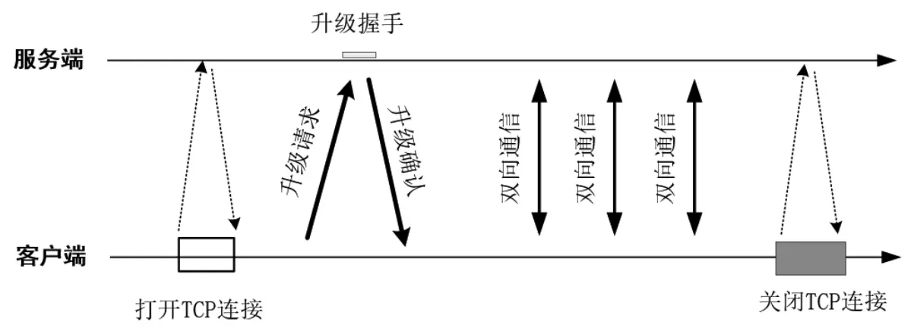

# 第10章_WebSocket原理与实战

WebSocket 是一种全双工通信的协议，其通信在 TCP 连接上进行，所以属于应用层协议。WebSocket 使得客户端和服务器之间的数据交换变得更加简单，允许服务端主动向客户端推送数据。在 WebSocket 编程中，浏览器和服务器只需要完成一次升级握手就可以直接创建持久性的连接，并进行双向数据传输。

对于 WebSocket 的 Java 开发，Java 官方发布了 JSR-356 规范，该规范的全称为 Java API for WebSocket。不少 Web 容器（如 Tomcat、Jetty 等）都支持 JSR-356 规范，提供了 WebSocket 应用开发 API。Tomcat 从 7.0.27 开始支持 WebSocket，从 7.0.47 开始支持 JSR-356 规范。

无论是 Tomcat 还是 Jetty，其性能在高并发场景下的表现并不是非常理想。所以编写 WebSocket 服务端程序时一般基于 Netty 框架进行编写。

> **扩展**
>
> 一个具备在线聊天、在线推送功能的综合性 WebSocket 项目：https://gitee.com/crazymaker/websocket_chat_room

## 1.WebSocket协议简介

WebSocket 协议的目标是在一个独立的持久连接上提供全双工双向通信。客户端和服务端可以向对方主动发送和接收数据。WebSocket 通信协议于 2011 年被 IETF 发布为 RFC6455 标准，后又发布了 RFC7936 标准补充规范。WebSocket API 也被 W3C（World Wid Web Consortium，万维网联盟）定为标准。

### 1.1 Ajax短轮训和Long Poll长轮训的原理

在 WebSocket 双向通信技术前，浏览器与服务器之间的双向通信大致有两种方式：Ajax 短轮询和 Long Poll 长轮询。

#### 1.Ajax短轮询

Ajax 短轮询即浏览器周期性地向服务器发起 HTTP 请求，不管服务器是否真正获取到数据，都会向浏览器返回响应，浏览器通过 HTTP 1.1 的持久连接（建立一次 TCP 连接，发送多个请求），可以在建立一次 TCP 连接之后发起多个异步请求。

在 Ajax 短轮询中，每个请求对应一个响应。这种模式需要浏览器不断地向服务器发出请求，然而 HTTP 请求在每次发送时都会带上很长的请求头部字段，其中真正有效的数据可能只是很小的一部分（Cookie），显然会浪费服务器带宽和 CPU 资源。

#### 2.Long Poll长轮询

Long Poll 长轮询在原理上跟 Ajax 短轮询差不多，不过采取的是服务端阻塞模型。在轮询过程中，服务端在收到浏览器的请求后，如果暂时没有消息需要推送给浏览器，服务端就会一直阻塞，直到服务端有消息才返回响应给客户端。客户端收到响应后开始发送下一轮的轮询请求。

无论是 Ajax 短轮询还是 Long Poll 长轮询，都不是最好的双向通信方式，都需要很多资源。而 WebSocket 协议则只需要经过一次 HTTP 请求就可以高效地实现双向通信。

### 1.2 WebSocket与HTTP之间的关系

WebSocket 的最大特点就是全双工通信，服务器可以主动向客户端推送信息，客户端也可以主动向服务器发送信息。WebSocket 与 HTTP 之间的关系是：WebSocket 是一个新协议，通信过程与 HTTP 基本没有关系，只是为了兼容现有浏览器，所以**在握手阶段使用了 HTTP**。WebSocket 协议的握手和通信过程如下图所示：



WebSocket 协议和 HTTP 一样，处于 TCP/IP 协议栈的应用层，都是 TCP/IP 协议的子集。WebSocket 协议和 HTTP 有一个显著的不同：**HTTP 是单向通信的协议**，只有客户端发起 HTTP 请求，服务端才会返回数据；**WebSocket 协议是双向通信协议**，在建立连接之后，客户端和服务器都可以主动向对方发送或接收数据。

## 2.WebSocket回显程序开发

本节演示程序的功能：客户端通过 WebSocket 向服务器发送任意一段字符串消息，服务器将该消息通过 WebSocket 回写到客户端，最后客户端将回显消息展现到网页。

### 2.1 WebSocket回显程序客户端代码

使用 JavaScript 实现 WebSocket 协议通信主要分为三个步骤：

1. **建立 WebSocket 连接**

   使用 JavaScript 建立 WebSocket 连接的代码大致如下：

   ```javascript
   socket = new WebSocket("ws://localhost:18899/ws", "echo");
   ```

   第一个参数为服务端 WebSocket 监听 URL 地址，第二个参数为服务端配置的 WebSocket 子协议，子协议为应用程序自己使用的某个标识或者命名，客户端与服务端保持一致即可。WebSocket 有自己的协议规范，其 URL 规则与 HTTP 的 URL 规则不同。WebSocket 中未加密的 URL Schema 为`ws://`，而不是`http://`。WebSocket 中加密的 URL Schema 为`wss://`，而不是`https://`。

   > **注意**
   >
   > 建立 WebSocket 连接时，传递的 URL 参数没有**同源策略**的限制。如果两个通信协议的 URL 的主机名（域名或者 IP）和端口都相同，则两个 URL 是同源的。同源策略是浏览器的一个安全功能，不同源的客户端在没有明确授权的情况下不能读写对方资源。WebSocket 并不受同源策略的限制，可以向不同源的 URL 发起 WebSocket 连接请求。

2. **监听 WebSocket 连接的 open 事件**

   在成功建立 WebSocket 连接后，客户端可以通过`onopen()`方法监听连接的 open 事件，在成功连接后可以进行后续的业务处理，大致代码如下：

   ```javascript
   socket.onopen = function(event) {
   	var target = document.getElementById('responseText');
       target.value = "Web Socket connected";
   }
   ```

3. **监听 WebSocket 连接的 message 消息事件**
   
   当服务端的消息推送过来时会触发 message 消息事件，客户端代码可以通过`onmessage()`方法监听该事件，然后在监听方法中获取所接收到的服务端数据。

   ```javascript
   socket.onmessage = function(event) {
       var ta = document.getElementById('responseText');
       ta.value = ta.value + '\n' + event.data;
   }
   ```


