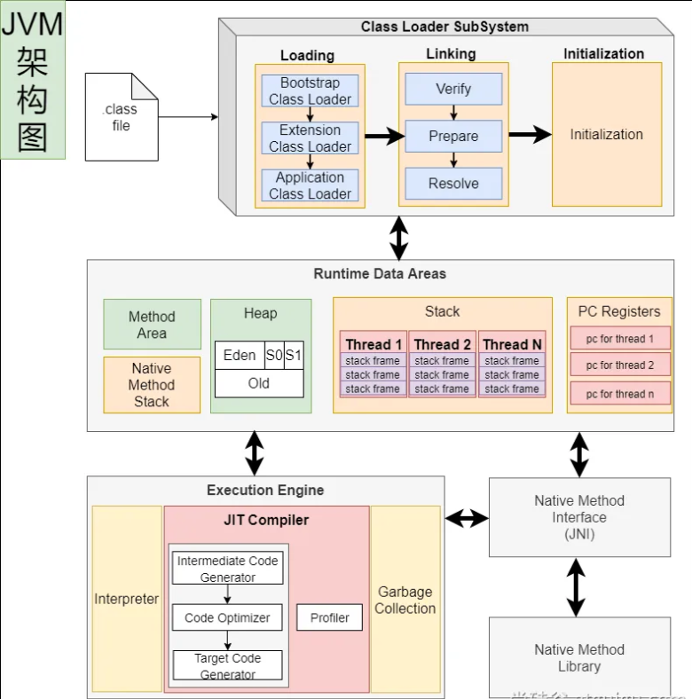
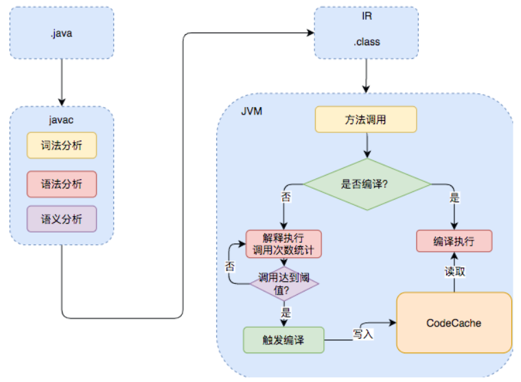
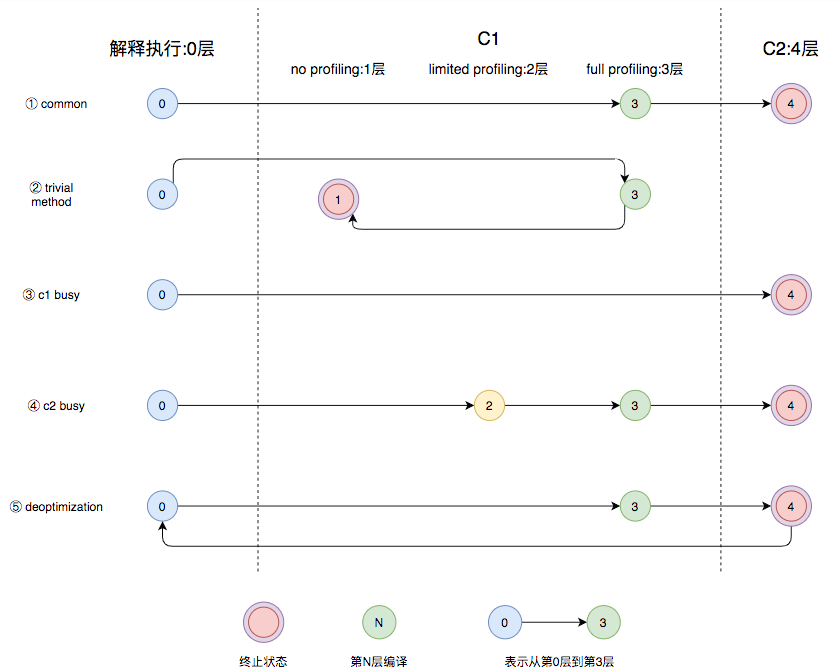

## AOT

AOT 指的是提前编译（Ahead-Of-Time），表示在程序执行前将源代码全部编译成机器码。与之相对的，JIT（Just In Time） 表示即时编译，指程序边编译边执行。

**解释器与编译器对比**

| 对比                   | **编译器**                                         | **解释器**                                               |
| ---------------------- | -------------------------------------------------- | -------------------------------------------------------- |
| **机器执行速度**       | **快**，因为源代码只需被转换一次                   | **慢**，因为每行代码都需要被解释执行                     |
| **开发效率**           | **慢**，因为需要耗费大量时间编译                   | **快**，无需花费时间生成目标代码，更快的开发和测试       |
| **调试**               | **难以调试**编译器生成的目标代码                   | **容易调试**源代码，因为解释器一行一行地执行             |
| **可移植性（跨平台）** | 不同平台需要重新编译目标平台代码                   | 同一份源码可以跨平台执行，因为每个平台会开发对应的解释器 |
| **学习难度**           | 相对较高，需要了解源代码、编译器以及目标机器的知识 | 相对较低，无需了解机器的细节                             |
| **错误检查**           | 编译器可以在编译代码时检查错误                     | 解释器只能在执行代码时检查错误                           |
| **运行时增强**         | 无                                                 | 可以**动态增强**                                         |

**JIT 与 AOT 对比**

|      | JIT                                                          | AOT                                                          |
| ---- | ------------------------------------------------------------ | ------------------------------------------------------------ |
| 优点 | 1.具备**实时调整**能力<br />2.生成**最优机器指令**<br />3.根据代码运行情况**优化内存占用** | 1.速度快，优化了运行时编译时间和内存消耗<br />2.程序初期就能达最高性能<br />3.加快程序启动速度 |
| 缺点 | 1.运行期编译**速度慢**<br />2.初始编译不能达到**最高性能**   | 1.程序第一次编译占用时间长<br />2.牺牲**高级语言**一些特性   |

## JVM架构



## Java的执行过程

[参考](https://tech.meituan.com/2020/10/22/java-jit-practice-in-meituan.html)



**几个常用 JVM 参数**

| 命令                         | 说明                        |
| ---------------------------- | --------------------------- |
| `-XX:CompileThreshold`       | 需要即时编译的阈值          |
| `-XX:+BackgroundCOmpilation` | 是否开启异步编译，默认 true |
| `-XX:ReservedCodeCacheSize`  | CodeCache 的最大值          |
| `-XX:InitialCodeCacheSize`   | CodeCache 的初始值          |

## JVM编译器

JVM中集成了两种编译器，Client Compiler 和 Server Compiler：

- Client Compiler 注重启动速度和局部的优化
- Server Compiler 更加关注全局优化，性能更好，但由于会进行更多的全局分析，所以启动速度会慢

**Client Compiler**

- HotSpot VM 带有一个Client Compiler **C1 编译器**
- 这种编译器**启动速度快**，但是性能比较 Server Compiler 来说会差一些
- 编译后的机器码执行效率没有 C2 的高

**Server Compiler**

- Hotspot 虚拟机中使用的 Server Compiler 有两种：**C2** 和 **Graal**
- 在 Hotspot VM 中，默认的 Server Compiler 是 **C2 编译器**

## 分层编译

Java 7 开始引入了分层编译（**Tiered Compiler**）的概念，它结合了 **C1** 和 **C2** 的优势，追求启动速度和峰值性能的一个平衡。分层编译将 JVM 的执行状态分为了五个层次。**五个层级**分别是：

- 解释执行
- 执行不带 profiling 的 C1 代码
- 执行仅带方法调用次数以及循环回边执行次数 profiling 的 C1 代码
- 执行带所有 profiling 的 C1 代码
- 执行 C2 代码

**profiling 就是收集能够反映程序执行状态的数据**。其中最基本的统计数据就是方法的调用次数，以及循环回边的执行次数。



- 图中第①条路径代表编译的一般情况，**热点方法**从解释执行到被 3 层的 C1 编译，最后被 4 层的 C2 编译。
- 如果**方法比较小**（比如 Java 服务中常见的 **getter/setter** 方法），3 层的 profiling 没有收集到有价值的数据，JVM 就会断定该方法对于 C1 代码和 C2 代码的执行效率相同，就会执行图中第②条路径。在这种情况下，JVM会在 3 层编译之后，放弃进入 C2 编译，**直接选择用 1 层的 C1 编译运行**。
- 在 **C1 忙碌**的情况下，执行图中第③条路径，在解释执行过程中对程序进行 **profiling** ，根据信息直接由第 4 层的 **C2 编译**。
- 前文提到 C1 中的执行效率是 **1 层 > 2 层 > 3 层**，**第 3 层**一般要比**第 2 层**慢 35% 以上，所以在 **C2 忙碌**的情况下，执行图中第④条路径。这时方法会被 2 层的 C1 编译，然后再被 3 层的 C1 编译，以减少方法在 **3 层**的执行时间。
- 如果**编译器**做了一些比较**激进的优化**，比如分支预测，在实际运行时**发现预测出错**，这时就会进行**反优化**，重新进入**解释执行**，图中第⑤条执行路径代表的就是**反优化**。

总的来说，C1 的编译速度更快，C2 的编译质量更高，分层编译的不同编译路径，也就是 JVM 根据当前服务的运行情况来寻找当前服务的最佳平衡点的一个过程。从 JDK 8 开始，JVM 默认开启分层编译。

存在的问题：

- java 应用如果用 jar 会解释执行，只有热点代码才编译成机器码；初始启动速度慢，初始处理请求数量少
- 大型云平台，要求每一种应用都必须秒级启动，每个应用都要求效率高
- 服务器需要安装 Java 环境

希望的效果：

- java 应用也能提前被编译成**机器码**，随时**急速启动**，一启动就急速运行，最高性能

- 编译成**机器码**可以在所有该平台**直接运行**。

原生镜像：`native-image`（机器码、本地镜像），指的是把应用直接打包成能适配本机平台的可执行文件（机器码、本地镜像）

## GraalVM

[官网](https://www.graalvm.org/)

**GraalVM** 是一个高性能的 **JDK**，旨在**加速**用 Java 和其他 JVM 语言编写的**应用程序**的**执行**，同时还提供 JavaScript、Python 和许多其他流行语言的运行时。 

**GraalVM** 提供了**两种**运行 **Java 应用程序**的方式：

1. 在 HotSpot JVM 上使用 **Graal 即时（JIT）编译器**
2. 作为**预先编译（AOT）**的本机**可执行文件**运行（**本地镜像**）

 GraalVM 的多语言能力使得在单个应用程序中混合多种编程语言成为可能，同时消除了外部语言调用的成本。

### 安装

安装官网的指引下载并配置环境变量即可。

> **注意**
>
> Windows 下安装 VS Installer 时要选择英语。

### 测试

**（1）创建项目**

- 创建普通 java 项目。编写 HelloWorld 类

- 使用 `mvn clean package` 进行打包
- 确认 jar 包是否可以执行 `java -jar xxx.jar`
- 可能需要打开 Jar 包给 `MANIFEST.MF` 添加 `Main-Class: 你的主类`

**（2）编译镜像**

编译为原生镜像（native-image）：使用 `native-tools` 终端

```bash
#方法 1：从入口开始，编译整个jar
native-image -cp grallvm-demo-1.0-SNAPSHOT.jar xxx.MainApplication -o Hello

#方法 2：编译某个类【必须有 main 入口方法，否则无法编译】
native-image -cp target\classes xxx.MainApplication -o Hello
```

### SpringBoot 整合

并不是所有 Java 代码都支持本地打包，如反射的代码，因此需要告知 graalvm 反射会用到哪些方法，构造器。同时配置文件不能直接打包到可执行文件中，需要告知 graalvm 如何处理。同时，不是所有框架都支持本地打包，而 SpringBoot 项目通过插件可以完成大部分场景的本地打包。

**（1）导入依赖**

```xml
<build>
    <plugins>
        <plugin>
            <groupId>org.graalvm.buildtools</groupId>
            <artifactId>native-maven-plugin</artifactId>
        </plugin>
        <plugin>
            <groupId>org.springframework.boot</groupId>
            <artifactId>spring-boot-maven-plugin</artifactId>
        </plugin>
    </plugins>
</build>
```

**（2）生成 native-image**

打包：`mvn clean package`

运行 aot 提前处理命令：`mvn springboot:process-aot`

运行 native 打包：`mvn -Pnative native:build -f pom.xml`

> **注意**
>
> 前两个步骤在 IDEA 中执行，最后一个如果不能执行则在 CMD 中执行。

**常见问题**

可能提示如下各种错误，无法构建原生镜像，需要配置环境变量：

- 出现 `cl.exe` 找不到错误
- 出现乱码
- 提示 `no include path set`
- 提示 fatal error LNK1104: cannot open file 'LIBCMT.lib'
- 提示 LINK : fatal error LNK1104: cannot open file 'kernel32.lib'
- 提示各种其他找不到

**需要修改三个环境变量**：`Path`、`INCLUDE`、`lib`

- Path：添加如下值：`G:\Program Files (x86)\MSVC\VC\Tools\MSVC\14.37.32822\bin\Hostx64\x64`

  > **提示**
  >
  > 在 MSVC 的安装目录下。

- 新建 `INCLUDE` 环境变量：值为

  ```bash
  G:\Program Files (x86)\MSVC\VC\Tools\MSVC\14.37.32822\include;C:\Program Files (x86)\Windows Kits\10\Include\10.0.22621.0\shared;C:\Program Files (x86)\Windows Kits\10\Include\10.0.22621.0\ucrt;C:\Program Files (x86)\Windows Kits\10\Include\10.0.22621.0\um;C:\Program Files (x86)\Windows Kits\10\Include\10.0.22621.0\winrt
  ```

- 新建 `lib` 环境变量：值为

  ```bash
  G:\Program Files (x86)\MSVC\VC\Tools\MSVC\14.37.32822\lib\x64;C:\Program Files (x86)\Windows Kits\10\Lib\10.0.22621.0\um\x64;C:\Program Files (x86)\Windows Kits\10\Lib\10.0.22621.0\ucrt\x64
  ```

然后设置 IDEA 的 terminal 使用 CMD 作为命令窗口。

配置好后重新启动 IDEA。