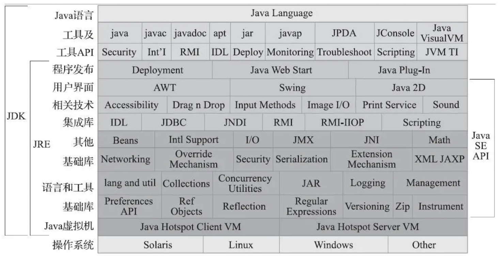

# 第01章_介绍Java

## 1.走进Java

### 1.1 概述

Java 的优点：

- Java 摆脱了硬件平台的束缚，实现了“一次编写，到处运行”
- 它提供了一种相对安全的内存管理和访问机制，避免了绝大部分内存泄漏和指针越界的问题
- 它实现了热点代码检测和运行时编译及优化，使得 Java 应用能随着运行时间的增长而获得更高的性能
- 它有一套完善的应用程序接口，还有无数来自商业机构和开源社区的第三方类库

### 1.2 Java技术体系

从广义上讲，Kotlin、Clojure、Jruby、Groovy 等运行于 Java 虚拟机上的编程语言及其相关的程序都属于 Java 技术体系的一员。如果仅从传统意义上来看，JCP 官方所定义的 Java 技术体系包括了以下几个组成部分：

- Java 程序设计语言
- 各种硬件平台上的 Java 虚拟机实现
- Class 文件格式
- Java 类库 API
- 来自商业机构和开源社区的第三方 Java 类库

> **扩展**
>
> JCP：Java Community Process，即 Java 社区，这是一个由业界多家技术巨头组成的社区组织，用于定义和发展 Java 的技术规范。

我们可以把 **Java 程序设计语言**、**Java 虚拟机**和 **Java 类库**这三部分统称为 JDK（Java Development Kit）。JDK 是用于支持 Java 程序开发的最小环境。可以把 Java 类库 API 中的 **Java SE API 子集**和  **Java 虚拟机**这两部分统称为 JRE（Java Runtime Environment），JRE 是支持 Java 程序运行的标准环境。

下图展示了 Java 技术体系所包括的内容，以及 JDK 和 JRE 所涵盖的范围。



以上是根据 Java 各个组成部分的功能来进行划分，如果按照技术所服务的领域来划分，或者按照技术关注的重点业务来划分的话，则 Java 技术体系可以分为以下四条主要的产品线：

1. Java Card：支持 Java 小程序（Applets）运行在小内存设备（如智能卡）上的平台。
2. Java ME（Micro Edition）：支持 Java 程序运行在移动终端上的平台，对 Java API 有所精简，并加入了移动终端的针对性支持，这条产品线在 JDK 6 以前被称为 J2ME。注意主要用 Java 语言开发程序的 Android 并不属于 Java ME。
3. Java SE（Standard Edition）：支持面向桌面级应用的 Java 平台，提供了完整的 Java 核心 API，这条产品线在 JDK 6 以前被称为 J2SE。
4. Java EE（Enterprise Edition）：支持多层架构的企业应用（如 ERP、MIS、CRM 应用）的 Java 平台，除了提供 Java SE API 外，还对其做了大量有针对性地扩充和部署支持，这条产品线在 JDK 6 前被称为 J2EE，在 JDK 10 后被 Oracle 放弃，捐赠给 Eclipse 基金会管理，此后被称为 Jakarta EE。

### 1.3 Java发展史

1991 年 4 月，由 James Gosling 博士领导的绿色计划（Green Project）开始启动，旨在开发一种能够在各种消费性电子产品（如机顶盒、冰箱等）上运行的程序架构，这就是 Java 语言的前身：Oak（得名于 James Gosling 办公室外的一颗橡树）。

1995 年 5 月 23 日，Oak 语言改名为 Java，并在 SunWorld 大会上正式发布 Java 1.0 版本，第一次提出了 “Write Once, Run Any where” 的口号。

1996 年 1 月 23 日，JDK 1.0 发布，提供了一个纯解释执行的 Java 虚拟机实现（Sun Classic VM）。

1998 年 12 月 4 日，工程代号为 Playground（竞技场）的 JDK 1.2 发布，Sun 在这个版本中把 Java 技术体系拆分为三个方向：面向桌面应用开发的 J2SE，面向企业级开发的 J2EE，面向手机等移动终端开发的 J2ME。并且在这个版本中 Java 虚拟机第一次内置了 JIT（Just In Time）即时编译器。

> **扩展**
>
> JDK 1.2 曾并存过三个虚拟机，Classic VM、HotSpot VM 和 Exact VM，其中 Exact VM 只在 Solaris 平台出现过；后面两款虚拟机都内置了 JIT，而 Classic VM 只能以外挂的形式使用 JIT。

1999 年 4 月 27 日，HotSpot 虚拟机诞生。HotSpot 最初由一家名为 “Longview Techno-logies” 的小公司开发，由于其优异变现，这家公司在 1997 年被 Sun 收购。HotSpot 刚发布时是作为 JDK 1.2 的附加程序提供，后来成为了 JDK 1.3 及之后所有 JDK 版本的默认 Java 虚拟机。

2004 年 9 月 30 日，JDK 5 发布，工程代号为 Tiger。Sun 公司从这个版本放弃了 “JDK 1.x” 的命名方式，而改为使用 “JDK x”。

在 2006 年 11 月 13 日的 JavaOne 大会上，Sun 宣布计划将 Java 开源，在随后一年多时间内它陆续地将 JDK 的各个部分在 GPL v2（GNU General Public License v2）协议下公开了源码，并建立了 OpenJDK 组织对这些源码进行独立管理。除了极少量的的产权代码（Encumbered Code） 外，OpenJDK 几乎拥有了当时 SunJDK 7 的全部代码。

2006 年 12 月 11 日，JDK 6 发布，工程代号为 Mustang（野马）。在这个版本中，Sun 启用了 Java EE 6、Java SE 6、Java ME 6 的新命名方式。

2009 年 4 月 20 日，Oracle 宣布正式以 74 亿美元的价格收购市值曾超过 2000 亿美元的 Sun，Java 商标正式划归 Oracle 所有（Java 语言本身并不属于哪个公司，它由 JCP 组织进行管理，然而 JCP 中 Sun 及后来的 Oracle 话语权很大）。由于此前 Oracle 已经收购了 BEA，至此 Oracle 分别从 BEA 和 Sun 手中取得了世界三大商用虚拟机其中两个：JRockit 和 HotSpot。

Oracle 收购 Sun 并接手 JDK 7 开发工作后，缩减了 JDK 7 的预定目标（如 Lambda 等延迟到 JDK 8 中）以使正式版能在 2011 年 7 月 28 日准时发布。且很快定义了一套新的 Java SE Support 产品计划，把 JDK 的更新支持作为一项商业服务。从 JDK 7 开始，Java SE 的核心功能正式开始为 Mac OS X 操作系统提供支持。

JDK 8 的第一个正式版跳票于 2014 年 3 月 18 日发布，并且为了保证日后 JDK 研发能更顺利，Oracle 启用了 **JEP（JDK Enhancement Proposals）**来定义和管理纳入新版的 JDK 发布范围的功能特性。

JDK 9 延期至 2017 年 9 月 21 日才得以艰难面世。经过 Oracle 不断的争取，Jigsaw 被引入了 JDK 9 中。JDK 9 发布后，Oracle 随即宣布 Java 将会以持续交付的形式和更加敏捷的研发节奏向前推进，以后 JDK 将会在每年的 3 月和 9 月个发布一个大版本来解决过多功能特性被捆绑在一个 JDK 版本上而引发的交付风险。且每 6 个 JDK 大版本中才会被划出一个长期支持（Long Term Support，LTS）版，只有 LTS 版的 JDK 能够获得为期 3 年的支持和更新，普通版的 JDK 只有短短 6 个月的生命周期。例如 JDK 8、JDK 11、JDK 17 都是 LTS 版。

2018 年 3 月，Oracle 正式宣告 Java EE 成为历史，所有权直接赠送给 Eclipse 基金会，唯一条件是不准许使用 “Java” 商标，所以取而代之的将是 Jakarta EE。

2018 年 9 月 25 日，JDK 11 发布，这是一个 LTS 版本，其中包含 ZGC 这样的革命性垃圾收集器出现。从 JDK 11 开始，Oracle 把以前的商业特性（需要使用`+XX: +UnlockCommercialFeatures`解锁的特性，如 JMC、JFR、NMT、AppCDS 和 ZGC 等）全部开源给 IpenJDK，这样 OpenJDK 11 和 OracleJDK 11 的代码和功能在本质上就是完全相同的。随后 Oracle 宣布以后将会同时发行两个 JDK：一个是以 GPLv2+CE 协议下由 Oracle 发行的 OpenJDK，另一个是在新的 OTN 协议下发行的传统 OracleJDK，这两个 JDK 共享绝大部分源码并在功能上几乎一致。核心差异是前者可以免费在开发、测试和生产环境中使用，但是只有半年时间的更新支持；后者个人依然可以免费使用，但在生产环境中商用必须付费，可以有三年时间的更新支持。

2018 年 10 月，最后一届 JavaOne 2018 在旧金山举行，其后合并为 Oracle CodeOne 大会。

2019 年 2 月，在 JDK 12 发布前夕，Oracle 放弃了对上一个版本 OpenJDK 的维护，RedHat 同时从 Oracle 手上接过 OpenJDK 8 和 OpenJDK 11 的管理权力和维护指责。

2019 年 3 月 20 日，JDK 12 发布，其中最引人注目的特性是由 RedHat 领导开发的 Shen-andoah 垃圾收集器。由于这是首个由非 Oracle 开发的垃圾收集器，其目标又与 Oracle 在 JDK 11 中发布的 ZGC 几乎完全一致，Oracle 违背了当初保证的 OracleJDK 和 OpenJDK 的兼容一致性，转眼就在 OracleJDK 12 里把 Shenandoah 的代码通过条件编译强行剔除掉，使其成为历史上唯一进入了 OpenJDK 发布清单，但在 OracleJDK 中无法使用的功能。

### 1.4 Java虚拟机家族

#### 1.Sun Classic/Exact VM

CLassic VM 是世界上第一款商用 Java 虚拟机，尽管现在看来其中的技术相当原始。

1996 年 1 月 23 日，Sun 发布 JDK 1.0，Java 语言首次拥有了商用的正式运行环境，这个 JDK 中所带的虚拟机就是 Classic VM。这款虚拟机只能使用纯解释器方式来执行 Java 代码，如果使用即时编译器就必须进行外挂，但是如果外挂了即时编译器，它就会完全接管虚拟机的执行系统，解释器便不再工作了。这意味着如果使用编译执行，编译器就不得不对每一个方法、每一行代码都进行编译，而无论他们执行的频率是否具有编译价值。基于程序响应时间的压力，这些编译器根本不敢应用编译耗时稍高的优化技术，因此这个阶段的虚拟机虽然用了即时编译器输出本地代码但执行效率相比传统的 C/C++ 有很大差距。

在 JDK 1.2 时，Sun 的虚拟机团队曾在 Solaris 平台上发布过一款名为 Exact VM 的虚拟机，它已具备热点探测、两级即时编译器、编译器与解释器混合工作模式等现代高性能虚拟机的特性。

Exact VM 因其使用**准确式内存管理**（Exact Memory Management，可以叫 Non-Con-Servative/Accurate Memory Management）而得名。 准确式内存管理是指虚拟机可以知道内存中某个未知的数据具体是什么类型。例如内存中有一个 32bit 的整数 123456，虚拟机将有能力分辨出它到底是一个指向了 123456 的内存地址的引用类型还是一个数值为 123456 的整数。

准确分辨出哪些内存是引用类型是在垃圾收集时准确判断堆上数据是否还可能被使用的前提。由于使用了准确式内存管理，Exact VM 可以抛弃掉前 Classic VM 基于句柄（handle）的对象查找方式。这样每次定位对象都少了一次间接查找的开销，显著提升执行性能。

> **扩展**
>
> 在句柄模型中，Java 对象的引用实际上是一个指向句柄的指针，而句柄是一个包含实际对象数据的数据结构，存在于堆内存中。这种方式允许 Java 虚拟机更容易地进行垃圾回收和对象移动。
>
> 如果不使用句柄，因为垃圾收集后对象将可能会被移动位置，如果把对象从地址 123456 移动到 654321， 在没有明确信息表明内存中那些数据是引用类型的前提下，虚拟机肯定不敢把内存中所有为 123456 的值改为 654321。使用句柄时因为句柄不会改变，只更新句柄中的指向即可。

虽然 Exact VM 技术先进了许多，但是很快就被 HtoSpot VM 所取代。而 Classic VM 在 JDK 1.2 之前是 JDK 中唯一的虚拟机，在 JDK 1.2 时作为默认虚拟机与 Exact VM 和 HotSpot VM 共存，在 1.3 时即被 HotSpot VM 所取代，但仍可作为备用选择通过参数切换。直到 JDK 1.4， Classic VM 才完全退出商用虚拟机的舞台，与 Exact VM 一同进入了 Sum Labs Research VM 中。

#### 2.HotSpot VM

HotSpot VM 是 Sun/Oracle JDK 和 OpenJDK 中的默认 Java 虚拟机，也是目前使用范围最广的 Java 虚拟机。HotSpot 既继承了 Sun 之前两款虚拟机的优点（如准确式内存管理），也有自己新的技术优势，如**热点代码探测技术**。HotSpot 虚拟机的热点代码探测能力可以通过执行计数器找出最具有编译价值的代码，然后通知即时编译器**以方法为单位进行编译**（解释执行是逐行或逐条指令执行代码，而编译执行是将整个方法翻译成本机机器码，以便更快地执行）。如果一个方法被频繁调用，或方法中有效循环次数很多，将会分别触发**标准即时编译**和**栈上替换编译**（On-Stack Replacement，OSR）行为。通过编译器和解释器协同工作，可以在最优化的程序响应时间与最佳执行性能中取得平衡，而且无需等待本地代码输出才能执行程序，即时编译的时间压力也相对较小，这样有助于引入更复杂的代码优化技术，输出质量更高的本地代码。

Oracle 收购 Sun 后，建立了 HotRockit 项目把原来 BEA JRockit 中优秀特性融合到 HotSpot 中。到了 2014 年的 JDK 8 时期，HotSpot 已经是二者融合的产物，在这个过程中 HotSpot 移除了永久代，吸收了 JRockit 的 Java Mission Control 监控工具等功能。

#### 3.BEA JRockit/IBM J9 VM

HotSpot 和 BEA JRockit 与 IMB J9 曾经是三大商业 Java 虚拟机。

JRockit 是 BEA 在 2002 年从 Appeal Virtual Machines 公司收购获得的 Java 虚拟机。由于专注于服务端应用，他不太关注于程序启动速度，因此 JRockit 内部不包含解释器实现，全部代码靠即时编译器编译后执行。JRokit 随着 BEA 被 Oracle 收购，其永远停留在 R28 版本，这是 JDK 6 版 JRockit 的代号。

 J9 虚拟机最初是由 IBM Ottawa 实验室的一个 SmallTalk 虚拟机项目扩展而来，当时这个虚拟机有一个 Bug 是因为 8KB 常量值定义错误引起，工程师们花了很长时间解决了这个错误，此后这个版本的虚拟机就被称为 K8，后来由其扩展而来、支持 Java 语言的虚拟机就被命名为 J9.它是一款在设计上全面考虑服务端、桌面应用，再到嵌入式的多用途虚拟机。

IMB J9 直到今天仍旧非常活跃，其职责分离与模块化做的比 HotSpot 更优秀，由 J9 虚拟机中抽象封装出来的核心组件库（如垃圾收集器、即时编译器、诊断见孔子系统等）就单独构成了 IBM OMR 项目，可以在其他语言平台如 Ruby、Python 中快速组装成相应的功能。从 2016 年起，IBM 逐步将 OMR 项目和 J9 虚拟机进行开源，完全开源后便将它们捐献给了 Eclipse 基金会管理，并重新命名为 Eclipse OMR 和 OpenJ9（只是一个单独的虚拟机，不包含 JDK 中的其他内容）。可以通过 AdoptOpenJDK 来获得采用 OpenJ9 搭配上 OpenJDK 其他类库组成的完整 JDK。

#### 4.Zing虚拟机

Zing 虚拟机是一个从 HotSpot 某旧版代码分支基础上独立出来重新开发的高性能 Java 虚拟机，它可以运行在通用的 Linux/x86-64平台上。Azul 公司为它编写了新的垃圾收集器，也修改了 HotSpot 内的许多实现细节，在要求低延迟、快速预热等场景中表现比 HotSpot 更好。Zing 的 PGC、C4 收集器可以轻易支持 TB 级别的 Java 堆内存，而且保证暂停时间仍然可以维持在不超过 10 毫秒的范围内，HotSport 要一直到 JDK 11 和 JDK 12 的 ZGC 及 Shenandoah 收集器才达到了相同的目标，而且目前效果仍然远不如 C4。

Zing 的 ReadNow! 功能可以利用之前运行时收集到的性能监控数据，引导虚拟机在启动后快速达到稳定的高性能水平，减少启动后从解释执行到即时编译的等待时间。Zing 自带的 Zvision/ZVRobot 功能可以方便用户监控 Java 虚拟机的运行状态，从找出代码热点到对象分配监控、锁竞争监控等。Zing 能让普通用户无需了解垃圾收集等底层调优，就可以使得 Java 应用享有低延迟、快速预热、易于监控的功能。

### 1.5 自己编译JDK

#### 1.获取源码

OpenJDK 不同版本的源码都可以在它们的主页找到：http://openjdk.java.net/

本次尝试编译 OpenJDK 12，获取 OpenJDK 源码时，可以直接访问：https://hg.openjdk.java.net/jdk/jdk12，点击左边菜单中的`Browse`，然后点击左边的`zip`即可下载当前版本的源码，下载后**解压**即可。

```bash
unzip jdk12-xxx.zip
```

#### 2.系统需求

在 Linux 或者 MacOS 上构建 OpenJDK 要比 Windows 或 Solaris 平台上要容易许多，本次以 Ubuntu 18.04 LTS 为平台进行构建。在编译前最好认真阅读一遍源码中的`doc/building.html`文档，同时注意所有文件都不要放在包含中文的目录中。

本次编译中采用的是 64 位操作系统，默认参数下编译出来的也是 64 位的 OpenJDK，如果需要编译 32 位版本，则可以指定编译参数`--with-target-bits=32`。因为编译过程中会产生大量的中间文件，官方文档上要求编译 OpenJDK 至少需要 2～4GB 的内存空间（CPU 核心数越多，需要的内存越大），而且至少要 6～8GB 的空闲磁盘空间。

#### 3.构建编译环境

对于 MacOS，需要 MacOS X 10.13 版本以上，并安装好最新版本的 XCode 和 Command Line Tools for Xcode（在 [Apple Developer 网站](https://developer.apple.com)上可以免费下载），这两个 SDK 提供了 OpenJDK 所需的 CLang 编译器和 Makefile 中用到的其他外部命令。

对于 Linux 系统，Ubuntu 用户可以选择安装 GCC 或 CLang 来进行编译，但必须确保最低版本为 GCC 4.8 或者 CLang 3.2 以上，官方推荐使用 GCC 7.8 或者 CLang 9.1 来完成编译。在 Ubuntu 系统上安装 GCC 命令为：

```bash
sudo apt-get install build-essential
```

在编译过程中需要依赖 FreeType、CUPS 等若干第三方库，OpenJDK 全部的依赖库如下表所示。

|   工具   |                   库名称                    |                           安装命令                           |
| :------: | :-----------------------------------------: | :----------------------------------------------------------: |
| FreeType |            The FreeType Project             |           `sudo apt-get install libfreetype6-dev`            |
|   CUPS   |         Common UNIX Printing System         |             `sudo apt-get install libcups2-dev`              |
|   X11    |               X Window System               | `sudo apt-get install libx11-dev libxext-dev libxrender-dev libxrandr-dev libxtst-dev libxt-dev` |
|   ALSA   |      Advanced Linux Sound Architecture      |            `sudo apt-get install libasound2-dev`             |
|  Libffi  | Portable Foreign Function Interface Library |              `sudo apt-get install libffi-dev`               |
| AutoConf |       Extensible Package of M4 Macros       |               `sudo apt-get install autoconf`                |

最后，假设要编译大版本号为 N 的 JDK，我们还要另外准备一个大版本号至少为 N-1 的、已经编译好的 JDK。因为 OpenJDK 由多个部分（HotSpot、JDK 类库、JAXWS、JAXP 等）构成，其中一部分（HotSpot）代码使用 C、C++ 编写，而更多的代码则是使用 Java 语言实现，因此编译这些 Java 代码需要用到另一个编译期可用的 JDK，官方称这个 JDK 为 “Bootstrap JDK”。编译 OpenJDK 12 时 Bootstrap JDK 必须使用 JDK 11 及之后的版本。在 Ubuntu 中使用以下命令安装 OpenJDK 11:

```bash
sudo apt-get install openjdk-11-jdk
```

#### 4.进行编译

##### 4.1 依赖检查

OpenJDK 提供了一系列的编译参数，这些参数可以使用`bash configure--help`命令查看，其中常用的命令如下：

- `--with-debug-level=<level>`：设置编译的级别，可选值为 release（默认）、fastdebug、slowdebug，越往后进行的优化措施越少，带的调试信息就越多。还有一些虚拟机调试参数必须在特定模式下才可以使用。
- `--enable-debug`：等效于`--with-debug-level=fastdebug`。
- `--with-native-debug-symbols=<method>`：确定调试符号信息的编译方式，可选值为none、internal、external、zipped。
- `--with-version-string=<string>`：设置编译 JDK 的版本号，譬如`java version`的输出就会显示该信息。这个参数还有`--with-version-<part>=<value>`的形式，其中`part`可以是 pre、opt、build、major、minor、security、patch 之一，用于设置版本号的某个部分。
- `--with-jvm-variants=<variant>[, <variant>...]`：编译特定模式（Variants）的 HotSpot 虚拟机，可以多个模式并存，可选值为 server、client、minimal、core、zero、custom。
- `--with-jvm-features=<feature>[, <feature>...]`：针对`--with-jvm-variants=custom`时的自定义虚拟机特性列表（Features），可以多个特性并存，可选值较多，可参考`help`命令输出。
- `with-target-bits=<bits>`：指明要编译 32 位还是 64 位的 Java 虚拟机，在 64 位机器上也可以通过交叉编译生成 32 位的虚拟机。
- `--with-<lib>=<path>`：用于指明依赖包的具体路径，通常使用在安装了多个不同版本的 Bootstrap JDK 和依赖包的情况。其中`lib`的可选值包括 bootjd、freetype、cups、x、alsa、libffi、jtreg、libjpeg、giflib、libpng、lcms、zlib。
- `--with-extra-<flagtype>=<flags>`：用于设定 C、C++ 和 Java 代码编译时的额外编译器参数，其中`flagtype`可选值为 cflags、cxxflags、ldflags，分别代表 C、C++ 和 Java 代码的参数。
- `--with-conf-name=<name>`：指定编译配置名称，OpenJDK 支持使用不同的配置进行编译，默认会根据编译的操作系统、指令集架构、调试级别自动生成一个配置名称，譬如 "linux-x86_64-server-release"。

例如编译 FastDebug 版，仅含 Server 模式的 HotSpot 虚拟机命令为：

```bash
bash configure --enable-debug --with-jvm-variants=server
```

`configure`命令承担了依赖项检查、参数配置和构建输出目录结构等多项职责，如果编译过程中需要的工具链或者依赖项有缺失，命令执行后也会得到明确的提示，并给出该依赖的安装命令，例如：

```bash
configure: error: could not find fontconfig! you might be able to fix this by running 'sudo apt-get install libfontconfig1-dev'
```

如果配置成功最终会输出调试级别，Java 虚拟机的模式、特性，使用的编译器版本等配置摘要信息：

```bash
A new configuration has been successfully created in
/home/zhaoyouyi/Downloads/jdk12-06222165c35f/build/linux-x86_64-server-fastdebug
using configure arguments '--enable-debug --with-jvm-variants=server'.

Configuration summary:
* Debug level:    fastdebug
* HS debug level: fastdebug
* JVM variants:   server
* JVM features:   server: 'aot cds cmsgc compiler1 compiler2 epsilongc g1gc graal jfr jni-check jvmci jvmti management nmt parallelgc serialgc services shenandoahgc vm-structs zgc' 
* OpenJDK target: OS: linux, CPU architecture: x86, address length: 64
* Version string: 12-internal+0-adhoc.root.jdk12-06222165c35f (12-internal)

Tools summary:
* Boot JDK:       openjdk version "11.0.19" 2023-04-18 OpenJDK Runtime Environment (build 11.0.19+7-post-Ubuntu-0ubuntu118.04.1) OpenJDK 64-Bit Server VM (build 11.0.19+7-post-Ubuntu-0ubuntu118.04.1, mixed mode, sharing)  (at /usr/lib/jvm/java-11-openjdk-amd64)
* Toolchain:      gcc (GNU Compiler Collection)
* C Compiler:     Version 7.5.0 (at /usr/bin/gcc)
* C++ Compiler:   Version 7.5.0 (at /usr/bin/g++)

Build performance summary:
* Cores to use:   2
* Memory limit:   5918 MB
```

##### 4.2 编译

依赖检查通过后便可以执行`make images`进行 OpenJDK 编译，这里的`images`是 “product-images” 编译目标的简写别名，这个目标的作用是编译出整个 JDK 镜像。除了 “product-images” 以外，其他编译目标还有：

- `hotspot`：只编译 HotSpot 虚拟机
- `hotspot-<variant>`：只编译特定模式的 HotSpot 虚拟机
- `docs-image`：产生 JDK 的文档镜像
- `test-image`：产生 JDK 的测试镜像
- `all-images`：相当于连续调用 product、docs、test 三个编译目标
- `bootcycle-images`：编译两次 JDK，其中第二次使用第一次的编译结果作为 Bootstrap JDK
- `clean`：清理`make`命令产生的临时文件
- `dist-clean`：清理`make`和`configure`命令产生的临时文件

如果之前已经全量编译过，只是修改了少量文件的话，增量编译可以在数十秒内完成。编译完成后，进入 OpenJDK 源码的`build/配置名称/jdk`目录下就可以看到 OpenJDK 的完成编译结果，把它复制到`JAVA_HOME`目录，就可以作为一个完整的 JDK 使用，如果没有人为设置过 JDK 开发版本的话，这个 JDK 的开发版本号里默认会带上编译的机器名。

#### 5.在IDE工具中进行调试

使用 Clion 进行调试时，首先新建一个项目选择 “New Cmake Project from Sources”，在源码文件夹填入 OepnJDK 源码根目录（下载后解压出来的根目录），点击 OK 就会导入源码并自动创建好 CMakeLists.txt 文件。

这份自动生成的 CMakeLists.txt 文件并不能直接使用，如果只是为了能在 Clion 中跟踪、阅读源码，而不需要修改重新编译的话，直接在 Run/Debug Configurations 中增加一个 Cmake Application，然后 Executable 选择刚才编译出来的 FastDebug 或者 SlowDebug 版的 Java 命令，运行参数加上`-version`或者某个 Class 文件的路径，再把 Before launch 里的 Build 去掉就可以开始运行调试了。

如果需要在 Clion 中修改源码，并重新编译产生新的 JDK，又或者不想看到一堆头文件缺失提示的话，还是需要把 CMakeLists.txt 修好，可以直接从 GitHub 上下载现成的[参考](https://github.com/ojdkbuild/ojdkbuild/blob/master/src/java-12-openjdk/CMakeLists.txt)。

目前 HotSpot 在主流的操作系统上都是采用模板解释器来执行字节码，与即时编译器一样，最终执行的汇编代码都是运行期间产生的，无法直接设置断点，所以 HotSpot 增加了以下参数来方便调试解释器：

```bash
-XX:TraceBytecodes -XX:StopinterpreterAt=<n>
```

作用是当遇到序号为`<n>`的字节码指令时，便会中断程序执行进入断点调试。调试解释器部分代码时，将这两个参数加到 java 命令参数后面即可。

完成以上配置后就可以运行调试了，HotSpot 虚拟机启动器的执行入口是`java.c`的`Javamain()`方法，可以自行设置断点跟踪。


