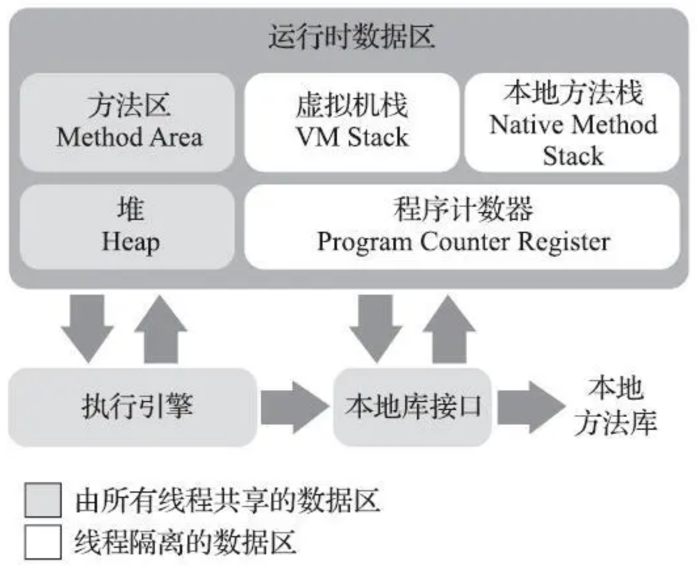

# 第02章_Java内存区域与内存溢出异常

C、C++ 在内存管理领域既拥有每一个对象的“所有权”，又担负着每一个对象整个生命周期的维护责任。而 Java 在**虚拟机自动内存管理机制**的帮助下不再需要为每一个`new`操作去写配对的`delete/free`代码，不容易出现**内存泄漏**和**内存溢出**问题。不过也正因为 Java 虚拟机全权负责控制内存，一旦出现内存泄漏和溢出的问题，如果不了解虚拟机是怎么样使用内存的，那排查错误、修正问题将非常艰难。

## 1.运行时数据区域

Java 虚拟机在执行 Java 程序的过程中会把它所管理的内存划分为若干个不同的数据区域。这些区域有各自的用途，有的区域随着虚拟机进程的启动而一直存在，有些区域则是依赖用户线程的启动和结束而建立和销毁。根据《Java 虚拟机规范》的规定，Java 虚拟机所管理的内存包括以下几个运行时数据区域：



### 1.1 程序计数器

程序计数器（Program Counter Register） 是一块较小的内存空间，它可以看作是当前线程所执行的字节码的行号指示器。在 Java 虚拟机的概念模型里，**字节码解释器工作时就是通过改变这个计数器的值来选取下一条需要执行的字节码指令**，它是程序控制流的指示器，分支、循环、跳转、异常处理、线程恢复等基础功能都需要依赖这个计数器来完成。

由于 Java 虚拟机的多线程是通过线程轮流切换、分配处理器执行时间的方式来实现的，在任何一个确定的时刻，一个处理器（多核处理器的话则是一个内核）都只会执行一条线程中的指令。因此，为了线程切换后能恢复到正确的执行位置，每条线程都需要有一个独立的程序计数器，各条线程之间计数器互不影响，独立存储，我们称这类内存区域为**线程私有**的内存。

如果线程正在执行的是一个 Java 方法，则计数器记录的是正在执行的虚拟机字节码指令的地址；如果正在执行的是本地（Native）方法，这个计数器值则应为空（Undefined）。

**此内存区域是唯一一个在《Java 虚拟机规范》中没有规定任何`OutOfMemoryError`情况的区域**。

### 1.2 Java虚拟机栈

Java 虚拟机栈（Java Virtual Machine Stack）也是**线程私有**的，它的生命周期与线程相同。虚拟机栈描述的是 Java 方法执行的线程内存模型：每个方法被执行的时候，Java 虚拟机都会同步创建一个**栈帧**（Stack Frame）用于存储**局部变量表**、操作数栈、动态连接、方法出口等信息。每一个方法被调用直至执行完毕的过程，就对应着一个栈帧在虚拟机栈中从入栈到出栈的过程。

局部变量表存放了编译期可知的各种 Java 虚拟机**基本数据类型**（boolean、byte、char、short、int、float、long、double）、**对象引用**（reference 类型，它可能是一个指向对象起始地址的指针，也可能是指向一个代表对象的句柄或者其他与此对象相关的位置）和 **returnAddress 类型**（指向了一条字节码指令的地址）。

这些数据类型在局部变量表中的存储空间以局部变量槽（Slot）来表示，其中 64 位长度的 long 和 double 类型的数据会占用 2 个变量槽，其余的数据类型只占用 1 个。**局部变量表所需的内存空间在编译期间完成分配**，当进入一个方法时，这个方法需要在栈帧中分配多大的局部变量空间是完全确定的，在方法运行期间不会改变局部变量表的大小。这里的“大小”指的是变量槽的数量，虚拟机真正使用多大的内存空间（比如按照 1 个变量槽占用 32 bit、64 bit 或更多）来实现一个变量槽完全由具体的虚拟机实现自行决定。

在《Java 虚拟机规范》中，对这个内存区域规定了两类异常情况：如果线程请求的栈深度大于虚拟机所允许的深度，将抛出`StackOverflowError`异常；如果 Java 虚拟机栈容量可以动态扩展，当栈扩展时无法申请到足够的内存会抛出`OutOfMemoryError`异常。

> **说明**
>
> HotSpot 虚拟机的栈容量是不可以动态扩展的，所以在 HotSpot 虚拟机上不会由于虚拟机栈无法扩展而导致`OutOfMemoryError`异常——只要线程申请栈空间成功了就不会有 OOM 异常。

### **1.3 本地方法栈**

本地方法栈（Native Method Stack）与虚拟机栈所发挥的作用类似，区别只是虚拟机栈为虚拟机执行 Java 方法（即字节码）服务，而本地方法栈则是为虚拟机使用到的本地方法服务。

《Java 虚拟机规范》对本地方法栈中方法使用的语言、使用方式与数据结构并没有任何强制规定，各个虚拟机可以根据需要自由实现，譬如 HotSpot 虚拟机直接就把本地方法栈和虚拟机栈合二为一。与虚拟机栈一样，本地方法栈也会在栈深度溢出或者栈扩展失败时分别抛出`StackOverflowError`和`OutOfMemoryError`异常。

### 1.4 Java堆

Java 堆（Java Heap）是虚拟机所管理的内存中最大的一块。Java 堆是被所有**线程共享**的一块内存区域，在**虚拟机启动时创建**。此内存区域的唯一目的就是**存放对象实例**，Java 中几乎所有的对象实例都在这里分配内存。但是随着一些技术例如逃逸分析技术的发展，栈上分配、标量替换优化手段已经导致了一些微妙的变化。

Java 堆是垃圾收集器管理的内存区域，也被称作 “GC 堆”。从回收角度看，由于现代垃圾收集器大部分都是基于**分代收集理论**设计的，所以 Java 堆中经常会出现“新生代”、“老年代”、“永久代”、“Eden 空间”、“From Servivor 空间”、“To Servivor 空间”等名词。但是这些区域划分仅仅是一部分垃圾收集器的共同特性或者说设计风格而已，而非某个 Java 虚拟机具体实现的固有内存布局，更**不是《Java 虚拟机规范》里的规定**。尽管 HotSpot 虚拟机内部的垃圾收集器全部基于”经典分代“（指划分为新生代和老年代，其中新生代由划分为一个 Eden 和两个 Servivor）来设计，但是到如今垃圾收集器技术有了长足的发展，HotSpot 中也出现了不采用分代设计的新垃圾收集器。

如果从分配内存的角度看，所有线程共享的 Java 堆中可以划分出多个线程私有的分配缓冲区 <a href=#TLAB>TLAB</a>，以提升对象分配时的效率。但是无论是哪个区域，存储的都只能是对象的实例，将 Java 堆细分的目的只是为了更好的回收内存，或者更快的分配内存。

根据《Java 虚拟机规范》的规定，**Java 堆可以处于物理上不连续的内存空间**中，但在逻辑上它应该被视为连续的。但对于大对象（例如数组），多数虚拟机实现出于实现简单、存储高效的考虑，很可能会要求连续的内存空间。

Java 堆既可以被实现成固定大小的，也可以是可扩展的，不过当前主流的 Java 虚拟机都是按照可扩展来实现的（通过参数`-Xmx`和`-Xms`设定）。如果在 Java 堆中没有内存可以用来完成实例分配，并且堆也无法再扩展时，Java 虚拟机将会抛出`OutOfMemoryError`。

### 1.5 方法区

方法区（Method Area）与 Java 堆一样，是各个**线程共享**的内存区域，它用于存储已被虚拟机加载的类型信息、常量、静态变量、即时编译器编译后的代码缓存等数据。虽然《Java 虚拟机规范》中把方法区描述为堆的一个逻辑部分，但是它有一个别名“非堆”（Non-Heap），目的是与 Java 堆区分开来。

方法区又被经常称呼为“永久代”（Permanent Generation），但是本质上这两者并不是等价的。仅仅是因为 JDK 8 之前，虚拟机设计团队选择把收集器的分代设计扩展至方法区，或者说**使用永久代来实现方法区**而已，这使得 HotSpot 的 垃圾收集器能够像管理 Java 堆一样管理这部分内存，省去专门为方法区编写内存管理代码的工作。但是原则上如何实现方法区不受《Java 虚拟机规范》管束，对于其他虚拟机实现，例如 JRockit、J9 等是不存在永久代的概念的。

但是现在回过头来看，当时使用永久代来实现方法区的决定导致了 Java 应用更容易遇到内存溢出的问题（永久代有`-XX:MaxPermSize`的上限，即使不设置也有默认大小，而 JRockit 和 J9 只要没有触碰到进程可用内存的上限，例如 32 位系统中的 4 GB 限制，就不会出问题），而且有极少数方法（如`String::intern()`）会因永久代的原因导致不同虚拟机下有不同的表现。考虑到 HotSpot 未来的发展，在 JDK 6 的时候 HotSpot 开发团队就有放弃永久代改为采用本地内存来实现方法区的计划了。

到了 JDK 7 的 HotSpot，已经把原本放在永久代的字符串常量池、静态变量等移出，而到了 JDK 8 则完全废弃了永久代的概念，采用和 JRockit、J9 一样在**本地内存中实现的元空间**（Meta-space）来代替，把 JDK 7 中永久代还剩余的内容（主要是类型信息）全部移到元空间中。

《Java 虚拟机规范》对方法区的约束是非常宽松的，除了和 Java 堆一样不需要连续的内存和可以选择固定大小或者可扩展外，甚至可以选择不实现垃圾收集。垃圾收集行为在这个区域确实比较少出现且回收效果往往比较差，这个区域的垃圾回收目标主要是针对**常量池的回收**和对**类型的卸载**，尤其是类型的卸载条件相当苛刻，但是这部分区域的回收又确实是必要的。

根据《Java 虚拟机规范》的规定，如果方法区无法满足新的内存分配需求时，将抛出`OutOfMemoryError`。

### 1.6 运行时常量池

运行时常量池（Runtime Constant Pool）是**方法区的一部分**。Class 文件中除了有类的版本、字段、方法、接口等描述信息外，还有一项信息是**常量池表**（Constant Pool Table），用于存放编译期生成的各种字面量与符号引用，这部分内容将在**类加载后**存放到方法区的运行时常量池中。

Java 虚拟机对于 Class 文件每一部分的格式都有严格规定，但对于运行时常量池没有做任何细节的要求。不过一般来说，除了保存 Class 文件中描述的符号引用外，还会把由符号引用翻译出来的直接引用也存储在运行时常量池中。

运行时常量池相对于 Class 文件常量池的另一个重要特征是具备动态性，Java 语言并不要求只有 Class 文件中的常量池内容才能进入方法区运行时常量池，运行期间也可以将新的常量放入池中，实际使用的比较多的便是`String::intern()`。

由于是方法区的一部分，自然受到方法区内存的限制，当常量池无法再申请到内存时会抛出`OutOfMemoryError`异常。

### 1.7 直接内存

直接内存（Direct Memory）并不是虚拟机运行时数据区的一部分，也不是《Java 虚拟机规范》中定义的内存区域。在 JDK 1.4 中新加入了 NIO 类，引入了一种基于通道和缓冲区的 I/O 方式，它可以使用 Native 函数库直接分配堆外内存，然后通过一个存储在 Java 堆中的`DirectByteBuffer`对象作为这块内存的引用进行操作。这样避免了在 Java 堆和 Native 堆中来回复制数据，能在一些场景中显著提高性能。

这块区域的大小会受到本机总内存（包括物理内存、SWAP 分区或者分页文件）大小以及处理器寻址空间的限制，一般配置虚拟机参数时，会根据实际内存去设置`-Xmx`等参数信息，但经常忽略掉直接内存，或者未能及时释放直接内存，使得各个内存区域总和大于物理内存限制（包括物理的和操作系统级的限制），从而导致动态扩展时出现`OutOfMemoryError`异常。

## 2.HotSpot虚拟机对象

本节深入探讨下 HotSpot 虚拟机在 Java 堆中对象分配、布局和访问的全过程。

### 2.1 对象的创建

#### 1.类加载检查

当 Java 虚拟机遇到一条字节码`new`指令时，首先将去检查这个指令的参数是否能在常量池中定位到一个类的符号引用，并且检查这个符号引用代表的类是否已经被加载、解析和初始化过。如果没有则必须先执行相应的类加载过程。

#### 2.分配内存

在类加载检查通过后，接下来虚拟机将为新生对象分配内存。对象所需内存的大小在类加载完成后便可完全确定。

> **扩展：堆内存分配方式**
>
> - **指针碰撞**（Bump The Pointer）：假设 Java 堆中内存是绝对规整的，所有被使用过的内存都被放在一边，空闲的内存被放在另一边，中间放着一个指针作为分界点的指示器，那分配内存就仅仅是把那个指针向空间空间方向挪动一段与对象大小相等的距离。
> - **空闲列表**（Free List）：如果 Java 堆中的内存并不是规整的，已被使用的内存和空闲的内存相互交错在一起，那就必须维护一个列表，记录上哪些内存块是可用的，在分配的时候从列表中找到一块足够大的空间划分给对象实例，并更新列表上的记录。
>
> 具体选择哪种分配方式由 Java 堆是否规整决定，而 Java 堆是否规整又由所采用的垃圾收集器是否带有空间压缩整理（Compact）的能力决定。当使用 Serial、ParNew 等带压缩整理过程的收集器时，系统采用的分配算法是指针碰撞；当使用 CMS 这种基于清除（Sweep）算法的收集器时，只能使用空闲列表了；然而为了能在多数情况下分配得更快，CMS 的实现设计了一个 Linear Allocation Buffer 的分配缓冲区，通过空闲列表拿到一大块分配缓冲区后，在它里面仍然可以使用指针碰撞方式来分配。

分配内存时还必须考虑并发场景下可能出现正在给对象 A 分配内存，指针还没来得及修改，对象 B 又同时使用了原来的指针来分配内存的情况。解决这个问题有两种可选方案：

1. 对分配内存空间的动作进行同步处理——实际上虚拟机是采用 CAS 配上失败重试的方向保证更新操作的原子性。
2. 每个线程在 Java 堆中预先分配一小块内存，称为<span id="TLAB" style="font-weight:bolder">本地线程分配缓冲</span>（Thread Local Allication Buffer，TLAB），哪个线程要分配内存，就在哪个线程的本地缓冲区中分配，只有本地缓冲区用完了，分配新的缓冲区时才需要同步锁定。虚拟机是否使用 TLAB 可以通过`-XX:+/-UseTLAB`参数来决定。

#### 3.类的隐式初始化

内存分配完成之后，虚拟机必须将分配到的内存空间（不包括对象头）都初始化为零值，如果使用了 TLAB 的话，这一项工作也可以提前至 TLAB 分配时进行。这部操作保证了对象的实例字段在 Java 代码中可以不赋初始值就直接使用，使程序能访问到这些字段的数据类型所对应的零值。

#### 4.设置必要的对象头信息

接下来 Java 虚拟机还要对对象进行必要的设置，例如这个对象是哪个类的实例、如何才能找到类的元数据信息、对象的哈希码（实际上对象的哈希码会在调用`Object::hashCode()`时才延迟计算）、对象的 GC 分代年龄等信息。这些信息存放在对象的对象头中。根据虚拟机当前运行状态的不同，如是否启用偏向锁等，对象头会有不同的设置方式（参考[2.2.1 对象头](#1.对象头)）。

#### 5.执行构造函数

在上面的工作都完成后，从虚拟机的视角来看一个新的对象已经产生了。但是从 Java 程序的视角来看对象创建才刚刚开始，构造函数，即 Class 文件中的`<init>()`方法还没有执行，所有的字段都为默认的零值，对象需要的其他资源和状态信息也还没有按照预定的意图构造好。一般来说`new`指令之后会接着执行`<init>()`方法（由字节码流中`new`指令后面是否跟随`invokespecial`指令所决定，Java 编译器会在遇到`new`关键字的地方同时生成`new`和`invokespecial`指令，但如果直接通过其他方式创建对象则不一定如此），这样一个可用的对象才算完全被构造出来。

### 2.2 对象的内存布局

在 HotSpot 虚拟机中，对象在堆内存中的存储布局可以划分为三个部分：对象头（Header）、实例数据（Instance Data）和对齐填充（Padding）。

#### 1.对象头

HotSpot 虚拟机对象的对象头包含两类信息：

1. 用于存储对象自身的运行时数据，如哈希码、GC 分代年龄、锁状态标志、线程持有的锁、偏向线程 ID、偏向时间戳等，这部分数据的长度在 32 位和 64 位的虚拟机（未开启压缩指针）中分别为 32 bit 和 64 bit，官方称为 **Mark Word**。对象头中存储的信息。

   对象头里的信息是与对象自身定义的数据无关的额外存储成本，考虑到虚拟机的空间效率，Mark Word 被设计成一个动态定义的数据结构，根据对象的状态服用自己的存储空间。例如在 32 位的 HotSpot 虚拟机中，Mark Word 的存储内容如下：

   

2. 对象头的另外一部分是类型指针，即**对象指向它的类型元数据的指针**，Java 虚拟机通过这个指针来确定该对象是哪个类的实例（其实并不是所有的虚拟机实现都必须在对象数据上保留类型指针，参考 [2.3 对象的访问定位](#2.3 对象的访问定位)）。

   此外如果对象是一个 Java 数组，那在对象头中还必须有一块用于**记录数组长度的数据**，因为虚拟机可以通过普通 Java 对象的元数据信息确定 Java 对象的大小，但是如果数组的长度是不确定的，将无法通过元数据中的信息推断出数组的大小。

#### 2.实例数据

实例数据部分是对象真正存储的有效信息，即在程序代码中所定义的各种类型的字段内容，无论是从父类继承下来的，还是在子类中定义的字段都必须记录起来。这部分的存储顺序会受到虚拟机分配策略参数（`-XX:FieldsAllocationStyle`）和字段在 Java 源码中定义顺序的影响。HotSpot 虚拟机默认的分配顺序为 longs/doubles、ints、shorts/chars、bytes/booleans、oops（Ordinary Object Pointers），可以看出默认的分配策略中，相同宽度的字段总是被分配到一起存放，在满足这个条件的前提下，在父类中定义的变量会出现在子类之前。如果 HotSpot 虚拟机的`+XX: CompactFields`参数值为 true（默认），那子类之中较窄的变量也允许插入父类变量的空隙中，以节省一点空间。

#### 3.对齐填充

对象的第三部分是对齐填充，这并不是必然存在的，仅仅起着占位符的作用。HotSpot 虚拟机的自动内存管理系统要求对象起始地址必须是 8 字节的整数倍，对象头部分已经被精心设计成正好是 8 字节的倍数（1 倍或 2 倍），因此如果对象实例数据部分没有对齐的话就需要通过对齐填充来补全。

### 2.3 对象的访问定位

Java 程序会通过栈上的`reference`数据来操作堆上的具体对象。由于`reference`类型在《Java 虚拟机规范》中只规定了它是一个指向对象的引用，并没有定义这个引用应该通过什么方式去定位、访问到堆中对象的具体位置，所以对象访问方式也是由虚拟机实现而定的，主流的访问方式有以下两种：

1. **句柄访问**

   Java 堆中会划分出一块内存来作为句柄池，`reference`中存储的就是对象的句柄地址，而句柄中包含了对象实例数据与类型数据各自具体的地址信息。

   

2. **直接指针访问**

   Java 堆中对象的内存布局必须考虑如何放置访问类型数据的相关信息，`reference`中存储的直接就是对象地址，如果只是访问对象本身的话就不需要多一次间接访问的开销。

   

这两种访问方式各有优势：

- 使用句柄来访问的最大好处是`reference`中存储的是稳定句柄地址，在对象被移动（垃圾收集经常发生）时只会改变句柄中的实例数据指针，而`reference`本身不需要被修改
- 使用直接指针来访问的最大好处是速度快，它节省了一次指针定位的时间开销

就 HotSpot 而言，它主要使用第二种方式进行对象访问（有例外情况，如果使用了 Shenandoah 收集器的话也会有一次额外的转发，具体可参见第 3 章）。

## 3.实战：OutOfMemoryError异常

在《Java 虚拟机规范》的规定中，除了程序计数器外，虚拟机内存的其他几个运行时区域都有可能发生`OutOfMemoryError`异常。

### 3.1 Java堆溢出

Java 堆用于存储对象实例，只要不断地创建对象，并且保证 GC Roots 到对象之间有可达路径来避免垃圾回收，那么随着对象数量的增加，总容量触及最大堆的容量限制后就会产生内存溢出异常。

下面代码中限制了 Java 堆的大小为 3MB，不可扩展（设置相同的堆的最小值`-Xms`和最大值`-Xmx`值），通过参数`-XX:+HeapDumpOnOutOfMemoryError [-XX:HeapDumpPath=文件路径[/文件名]]`（不指定文件路径时会默认保存在项目根目录）可以让虚拟机在出现内存溢出异常的时候 Dump 出当前的内存堆转储快照。

```java
/**
 * VM Args: -Xms30m -Xmx30m -XX: +HeapDumpOnOutOfMemoryError
 */
public class HeapOOM {

    public static void main(String[] args) {
        List<byte[]> list = new ArrayList<>();
        while (true) {
        	list.add(new byte[10 * 1024 * 1024]); // 10MB数组
        }
    }
}
```

运行结果：

```java
java.lang.OutOfMemoryError: Java heap space
Dumping heap to java_pid36261.hprof ...
Heap dump file created [21906275 bytes in 0.006 secs]
```

> **注意**
>
> 如果是下面这种测试代码，则会抛出`GC overhead limit exceeded OOM`，应该是每次创建的对象太小，频繁的触发 GC 导致的错误优先于堆内存溢出的错误。
>
> ```java
> /**
>  * VM Args: -Xms10m -Xmx10m -XX:+HeapDumpOnOutOfMemoryError
>  */
> public class HeapOOM {
> 	static class OOMObject {}
>     
>     public static void main(String[] args) {
>         List<OOMObject> list = new ArrayList<>();
>         while (true) {
>             list.add(new OOMObject());
>         }
>     }
> }
> ```
>
> 结果：
>
> ```bash
> java.lang.OutOfMemoryError: GC overhead limit exceeded
> Dumping heap to java_pid35410.hprof ...
> Heap dump file created [12350612 bytes in 0.023 secs]
> ```

Java 堆内存的 OOM 是实际应用中最常见的内存溢出异常，出现 Java 堆内存溢出时，异常堆栈信息 “java.lang.OutOfMemoryError” 会跟随进一步提示 “Java heap space”。常规的处理方法是利用内存映像分析工具（如 Eclipse Memory Analyzer）对堆转储文件进行分析。第一步首先确认内存中导致 OOM 的对象是否是必要的，即先要分清楚到底是出现了内存泄漏还是内存溢出。

从 market 下载好 Eclipse Memory Analyzer 插件后，选择 "Window > Perspective > Open Perspective > other"，打开 memory analyzer。从 "File > Open Heap Dump" 中选择堆转储文件。

如果是内存泄漏，可进一步通过工具查看泄漏对象到 GC Roots 的引用链，找到泄漏对象是通过怎样的引用路径、与哪些 GC Roots 相关联，才导致垃圾收集器无法回收它们。如果不是内存泄漏，即内存中的对象确实都是必须存活的，那就应当检查 Java 虚拟机的堆参数（`-Xmx`与`-Xms`）设置，与机器的内存对比，看看是否还有向上调整的空间。再从代码上检查是否存在某些对象生命周期过长、持有状态时间过长、存储结构设计不合理等情况，尽量减少程序运行期的内存消耗。

### 3.2 虚拟机栈和本地方法栈溢出

由于 HotSpot 虚拟机中并不区分虚拟机栈和本地方法栈，因此对于 HotSpot 来说，`-Xoss`参数（设置本地方法栈大小）虽然存在，但实际上是没有任何效果的，栈容量只能由`-Xss`参数来设定。在《Java 虚拟机规范中》描述了两种关于虚拟机栈和本地方法栈的异常：

1. 如果线程请求的栈深度大于虚拟机所允许的最大深度，将抛出`StackOverflowError`异常
2. 如果虚拟机的栈内存允许动态扩展，当扩展栈容量无法申请到足够的内存时，将抛出`OutOfMemoryError`异常

《Java 虚拟机规范》明确允许 Java 虚拟机实现自行选择是否支持栈的动态扩展，而 HotSpot 虚拟机的选择是不支持扩展，所以除非在创建线程申请内存时就因无法获得足够内存而出现`OutOfMemoryError`异常，否则在线程运行时是不会因为扩展而导致内存溢出的，只会因为栈容量无法容纳新的栈帧而导致`StackOverflowError`异常。

为了验证这点我们做两个实验，先将实验范围限制在单线程中操作，尝试下面两种行为是否能让 HotSpot 虚拟机产生`OutOfMemoryError`异常：

- 使用`-Xss`参数减少栈内存容量，不断增加栈帧
- 定义大量本地变量，增大方法帧中本地变量表的长度

首先测试第一种情况。

```java
/*
 * VM Args: -Xss640k
 */
public class JavaVMStackSOF {
    
    private int stackLength = 1;
    
    public void stackLeak() {
        stackLength++;
        stackLeak();
    }
    
    public static void main(String[] args) throws Throwable {
        JavaVMStackSOF oom = new JavaVMStackSOF();
        try {
            oom.stackLeak();
        } catch (Throwable e) {
            System.out.println("stack length:" + oom.stackLength);
            throw e;
        }
    }
}
```

运行结果：

```bash
stack length:5376
Exception in thread "main" java.lang.StackOverflowError
	at com.youyi.zhao.JavaVMStackSOF.stackLeak(JavaVMStackSOF.java:9)
	at com.youyi.zhao.JavaVMStackSOF.stackLeak(JavaVMStackSOF.java:9)
... ...
```

对于不同版本的 Java 虚拟机和操作系统，栈容量最小值可能会有所限制，这主要取决于操作系统内存分页大小。例如在 arm 架构的 macOS 系统下的 JDK 8 最低只能设置`-Xss640k`，如果低于这个最小限制 HtoSpot 虚拟机在启动时会给出提示。

继续测试第二种情况，为了多占局部变量表空间不得不定义一长串变量。

```java
public class JavaVMStackSOF {
    
    private static int stackLength = 0;
    
    public static void test() {
        long unused1, ... unused100;
        stackLength++;
        test();
        unused1 = unused2 = ... = unused100 = 0;
    }
    
    public static void main(String[] args) {
        try {
            test();
        } catch (Error e) {
            System.out.println("stack length:" + stackLength);
            throw e;
        }
    }
}
```

运行结果仍然是抛出了`StackOverflowError`异常。

实验表明：无论是由于栈帧太大还是虚拟机栈容量太小，当新的栈帧内存无法分配的时候，HotSpot 虚拟机抛出的都是`StackOverflowError`异常。
