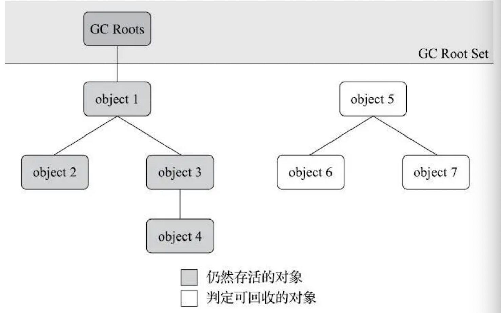
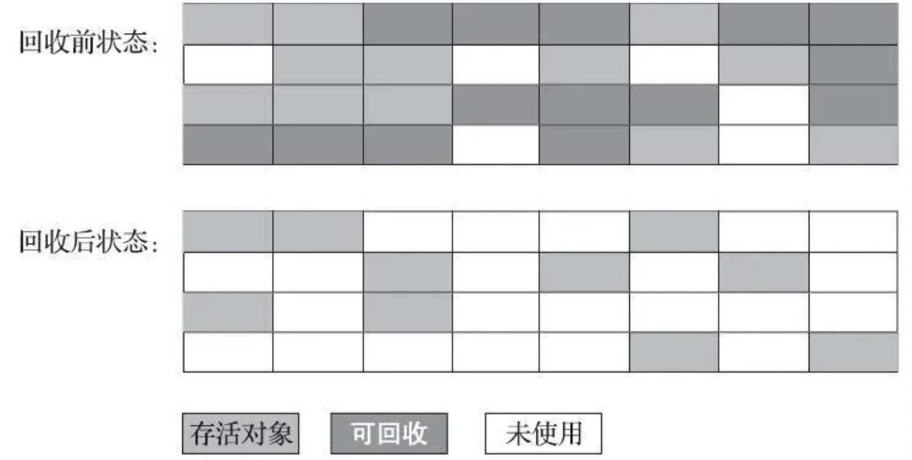
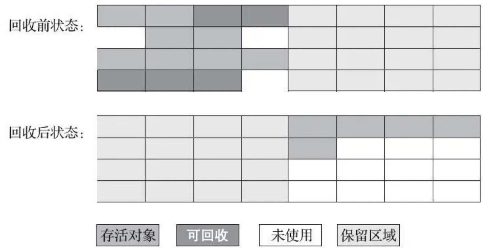
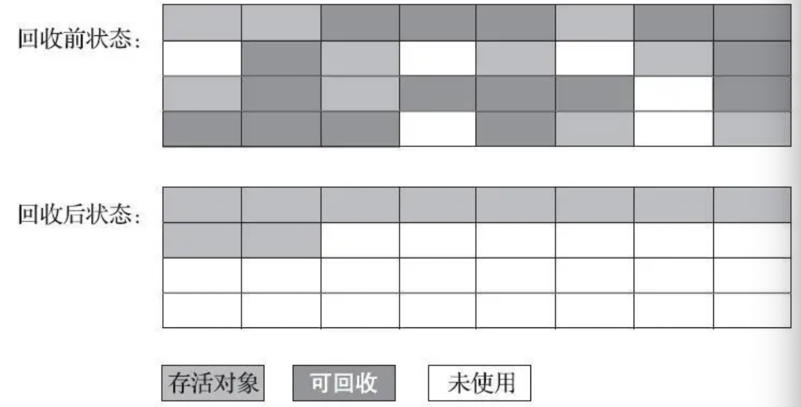
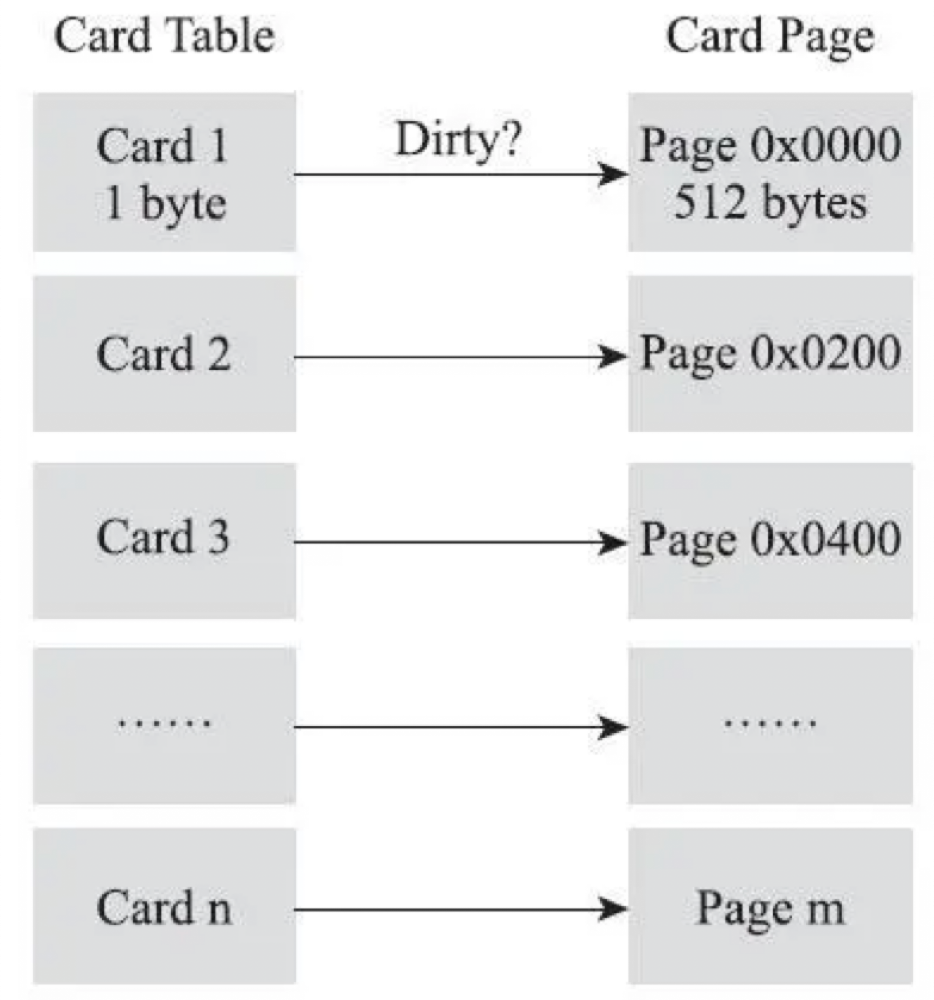
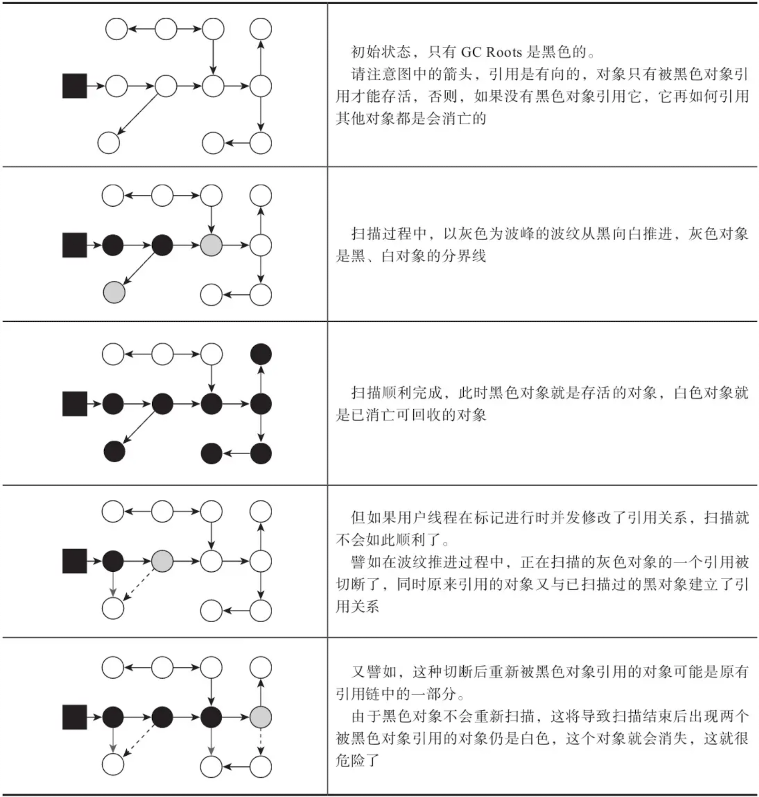

# 第03章_内存分配策略

## 1.概述

前面介绍了 Java 内存运行时区域的各个部分，其中**程序计数器、虚拟机栈、本地方法栈 3 个区域随线程而生，随线程而灭**，栈中的栈帧随着方法的进入和退出而执行着出栈和入栈操作。每一个栈帧中分配多少内存基本上是在类结构确定下来时就已知的（尽管在运行期会由即时编译器进行一些优化，但在基于概念模型的讨论里大体可以认为是编译期可知的），因此这几个区域的内存分配和回收都具备确定性，在这几个区域内就不需要过多考虑如何回收的问题，当方法结束或线程结束时内存自然就跟随着回收了。

而 **Java 堆和方法区这两个区域则有着很显著的不确定性**：一个接口的多个实现类需要的内存可能不一样，一个方法所执行的不同条件分支所需要的内存也可能不一样，只有处于运行期间才能知道程序究竟会创建哪些对象，创建多少个对象，这部分内存的分配和回收是动态的。垃圾收集器所关注的正是这部分内存该如何管理。

## 2.对象存亡

在堆中存放着几乎所有的 Java 对象，垃圾收集器在对堆进行回收前首先要确定哪些对象是存活的，哪些是死去的，即不再被任何途径使用的对象。

### 2.1 引用计数算法

引用计数算法（Reference Counting）指在对象中添加一个**引用计数器**，每当有一个地方引用它时计数器值就加一；当引用失效时计数器值就减一；任何时刻计数器为零的对象就是不可能再被使用的。它虽然占用了一些额外的内存空间来进行计数，但它的原理简单，判定效率高，大多数情况下都是一个不错的算法。在 Python 以及游戏脚本领域的 Squirrel 中都使用了引用计数算法进行内存管理。但是在一些**主流的 Java 虚拟机中却没有使用引用计数算法**来管理内存，主要是因为这个算法有很多例外情况要考虑，例如单纯的引用计数就**很难解决对象之间相互循环引用的问题**。

### 2.2 可达性分析算法

当前主流的商用程序语言（Java、C# 等）的内存管理子系统都是通过可达性分析（Reachability Analysis）算法来判定对象是否存活。这个算法的基本思路是通过一系列称为 **GC Roots** 的根对象作为起始节点集，从这些节点开始根据引用关系向下搜索，搜索过程所走过的路径称为“引用链”（Reference Chain），如果某个对象到 GC Roots 间没有任何引用链相连，即**从 GC Roots 到这个对象不可达**时，则证明此对象是不可能再被使用的。



在 Java 技术体系中，固定可作为 GC Roots 的对象包括以下几种：

- **虚拟机栈（栈帧中的本地变量表）中引用的对象**，例如各个线程被调用的方法堆栈中使用到的参数、局部变量、临时变量等
- **本地方法栈中 JNI（即本地方法）引用的对象**
- **方法区中类静态属性引用的对象**，例如 Java 类的引用类型静态变量
- **方法区中常量引用的对象**，例如字符串常量池中的引用
- **Java 虚拟机内部的引用**，如基本数据类型对应的 Class 对象，一些常驻的异常对象（如 NullPointException、OutOfMemoryError）等，还有系统加载类
- 所有**被同步锁（`synchronized`关键字）持有的对象**
- 反映 Java 虚拟机内部情况的 JMXBean、JVMTI 中注册的回调、本地代码缓存等

除了这些固定的 GC Roots 集合外，根据用户所选用的垃圾收集器以及当前回收的内存区域不同，还可以有其他对象临时性的加入，共同构建成完整的 GC Roots 对象。例如后文将会提到的分代收集和局部回收（Partial GC），如果只针对 Java 堆中某一块区域发起垃圾收集时（如典型的只针对新生代的垃圾收集），里面的对象完全有可能被位于堆中其他区域的对象所引用，这时候就需要将这些关联区域的对象也一并加入 GC Roots 集合中去。

### 2.3 引用

在 JDK 1.2 之后，Java 堆引用个概念进行了扩充，将引用分为强引用、软引用、弱引用和虚引用 4 种：

1. **强引用**

   在程序代码中普遍存在的引用赋值都属于强引用，即`Object ibj = new Object()`这种关系。无论任何情况下，只要强引用关系存在，垃圾收集器就永远不会回收掉被引用的对象。

2. **软引用**

   用来描述一些还有用，但非必须的对象。只被软引用关联着的对象，在系统将要发生内存溢出异常前，会把这些对象列进回收范围之中进行第二次回收，如果这次回收还没有足够的内存才会抛出内存溢出异常，因此非常适合做缓存。在 JDK 1.2 版之后提供了`SoftReference`来实现软引用。

   ```java
   SoftReference<Type> sr = new SoftReference<>(new Type());
   ```

3. **弱引用**

   弱引用也是用来描述那些非必需对象，它的强度比软引用更弱一些，被弱引用关联的对象只能生存到下一次垃圾收集发生为止。当垃圾收集器开始工作，无论当前内存是否足够，都会回收掉只被弱引用关联的对象。在 JDK 1.2 版之后也提供了`WeakReference`来实现弱引用，`ThreadLocal`中就是使用了弱引用。

   ```java
   WeakReference<Type> wr = new WeakReference<>(new Type());
   ```

4. **虚引用**

   虚引用是最弱的一种引用关系。一个对象是否有虚引用的存在完全不会对其生存时间构成影响，也无法通过虚引用来取得一个对象实例。为一个对象设置虚引用关联的唯一目的只是为了能在这个对象被收集器回收时收到一个系统通知。在 JDK 1.2 版之后提供了`PhantomReference`来实现虚引用，它不能通过`get()`获得对象，在对象被回收时会被放到队列中。

   ```java
   List<Object> list = new LinkedList<>();
   ReferenceQueue<M> queue = new ReferenceQueue<>();
   PhantomReference<M> phantomReference = new PhantomReference<>(new M(), queue);
   phantomReference.get(); // null，无法拿到对象
   ```

### 2.4 对象死亡

即使在可达性分析算法中判定为不可达的对象也不是马上就会死，这时它们暂时还处于“缓刑”阶段，要真正宣告一个对象死亡，至少要经历两次标记过程：如果对象在进行可达性分析后发现没有与 GC Roots 相连接的引用链，那它将会被第一次标记，随后进行一次筛选，看该对象是否有必要执行`finalize()`方法。如果对象没有覆盖`finalize()`方法，或者`finalize()`方法已经被虚拟机调用过，那么虚拟机将这两种情况都视为“没有必要执行”。

如果这个对象被判定为有必要执行`finalize()`方法，那么该对象将会被放置在一个名为`F-Queue`的队列中，并在稍后由一条虚拟机自动建立的、低调度优先级的`Finalizer`线程去执行它们的`finalize()`方法。这里的“执行”是指虚拟机会触发这个方法开始运行，但**并不承诺一定会等待它运行结束再清除该对象**。原因是如果某个对象的`finalize()`方法执行缓慢，或者更极端地发生了死循环，将很可能导致`F-Queue`队列中的其他对象永久处于等待，甚至导致整个内存回收子系统的崩溃。

`finalize()`方法是对象逃脱死亡命运的最后一次机会，稍后收集器将对`F-Queue`中的对象进行第二次小规模的标记，如果对象要在`finalize()`中成功拯救自己——只要重新与引用链上的任何一个对象建立关系即可，例如把自己（this）赋值给某个类变量或者对象的成员变量，那在第二次标记时它将被移除“即将回收”的集合；如果对象这时候还没有逃脱，那基本上它就要被回收了。下面演示一个对象的`finalize()`被执行并成功存活的代码：

```java
public class FinalizeEscapeGC {

    public static FinalizeEscapeGC SAVE_HOOK = null;

    public void isAlive() {
	System.out.println("yes, i am still alive");
    }

    @Override
    protected void finalize() throws Throwable {
	super.finalize();
	System.out.println("finalize method executed");
	FinalizeEscapeGC.SAVE_HOOK = this;
    }

    public static void main(String[] args) throws Throwable {
	SAVE_HOOK = new FinalizeEscapeGC();

	// 第一次拯救自己
	saveSelf();
	// 第二次拯救自己
	saveSelf();
    }

    private static void saveSelf() throws InterruptedException {
	SAVE_HOOK = null;
	System.gc();
	// 因为 finalize 方法优先级很低，暂停 0.5 秒
	Thread.sleep(500);
	if (SAVE_HOOK != null)
	    SAVE_HOOK.isAlive();
	else
	    System.out.println("no, i am dead");
    }

}
```

运行结果：

```bash
finalize method executed
yes, i am still alive
no, i am dead
```

从结果可以看到，`SAVE_HOOK`对象的`finalize()`方法确实被垃圾收集器触发，而后在收集前成功逃脱了。另外，虽然第一次逃脱成功，但第二次却失败了。这是因为**任何一个对象的`finalize()`方法只会被系统自动调用一次**，如果对象面临下一次回收，它的`finalize()`方法不会被再次执行。

建议生产中尽量避免使用`finalize()`方法，因为它不能等同于 C 和 C++ 中的析构函数，其运行代价高昂，不确定性大，无法保证各个对象的调用顺序。如果有释放资源的需求建议使用`try-finally`方法。

### 2.5 回收方法区

方法区垃圾收集的性价比通常很低：在 Java 堆中，尤其是在新生代，对常规应用进行一次垃圾收集通常可以回收 70% 到 99% 的内存空间，相比之下，方法区回收由于其苛刻的判定条件，垃圾收集的回收效果往往远低于 Java 堆。

方法区的垃圾回收主要回收两部分内容：**废弃的常量**和**不再使用的类型**。回收废弃常量与回收 Java 堆中的对象非常类似，以常量池中字面量回收为例，如果一个字符串 “java” 曾经进入常量池中，但是当前系统和虚拟机中没有任何一个字符串对象引用常量池中的 “java”。如果此事发生内存回收，而且垃圾收集器判断有必要的话，这个 “java” 常量将会被系统清理出常量池。常量池中其他类（接口）、方法、字段的符号引用也与此类似。

判定一个常量是否废弃相对简单，而要判定一个类型是否属于“不再被使用的类”的条件就比较苛刻了，需要同时满足下面三个条件：

1. 该类所有的实例都已经被回收，即 Java 堆中不存在该类及其任何派生子类的实例
2. 加载该类的类加载器已经被回收，这个条件除非是经过精心设计的可替换类加载器的场景，如 OSGi、JSP 的重加载等，否则通常是很难达成的
3. 该类对应的 java.lang.Class 对象没有在任何地方被引用，无法在任何地方通过反射访问该类的方法

Java 虚拟机被允许对满足上述三个条件的无用类进行回收，但并不适合对象一样，没有引用了就必然会回收。关于是否要对类型进行回收，HotSpot 虚拟机提供了 `-Xnoclassgc` 参数进行控制，还可以使用 `-verbose:class` 以及 `-XX:+TraceClassLoading`、`-XX:+TraceClassUnLoading` 查看类加载和卸载信息，其中 `-verbose:-class` 和 `-XX:+TraceClassLoading` 可以在 Product 版的虚拟机中使用，`-XX:+TranceClassUnLoading` 参数需要 FastDebug 版的虚拟机支持。

## 3.垃圾收集算法

本节只重点介绍分代收集理论和几种算法思想及其发展过程，如果对细节感兴趣，可以阅读 Richard Jones 撰写的《垃圾回收算法手册》的第 2～4 章相关内容。

从如何判定对象消亡的角度出发，垃圾收集算法可以划分为**引用计数式垃圾收集**和**追踪式垃圾收集**两大类，这两类也被称作**直接垃圾收集**和**间接垃圾收集**。由于引用式垃圾收集算法在主流的 Java 虚拟机中没有涉及，本节介绍的所有算法均属于追踪式垃圾收集的范畴。

### 3.1 分代收集理论

当前商业虚拟机的垃圾收集器大多遵循了分代收集的理论进行设计，它实质上是一套符合大多数程序运行实际情况的经验法则，建立在两个分代假说之上：

**（1）弱分代假说**：绝大多数对象都是朝生夕灭的

**（2）强分代假说**：熬过越多次垃圾收集过程的对象就越难以消亡

这两个分代假说共同奠定了多款常用垃圾收集器的一致的设计原则：**收集器应该将 Java 堆划分出不同的区域，然后将回收对象依据其年龄（熬过垃圾收集过程的次数）分配到不同的区域之中**。显而易见，把朝生夕灭的对象集中在一起，每次回收时只关注如何保留少量存活而不是去标记那些大量将要被回收的对象，就能以较低代价回收到大量的空间；把难以消亡的对象集中放在一起，虚拟机便可以使用较低的频率来回收这个区域，这就同时兼顾了垃圾收集的时间开销和内存的空间有效利用。

在 Java 堆划分出不同的区域之后，垃圾收集器才可以每次只回收其中某一个或者某些部分的区域——这才有了 **Minor GC**、**Major GC**、**Full GC** 这样的回收类型的划分；也才能够针对不同的区域安排与里面存储对象存亡特征相匹配的垃圾收集算法——发展出了**标记-复制算法**、**标记-清除算法**、**标记-整理算法**等针对性的垃圾收集算法。

把分代收集理论具体放在商用 Java 虚拟机中，设计者一般至少会把 Java 堆划分出新生代和老年代两个区域。在新生代中，每次垃圾收集时都发现有大批对象死去，而每次回收后存活的少量对象将会逐步晋升到老年代中存放。

假如要进行一次只局限于新生代区域的收集（Minor GC），但新生代中的对象是完全有可能被老年代所引用的，为了找出该区域中的存活对象，不得不在固定的 GC Roots 之外再额外遍历整个老年代中所有对象来确保可达性分析结果的正确性，反过来也一样（通常能单独收集的区域只是新生代，这里的“反过来”只是理论上，除了 CMS 收集器其他都不存在只针对老年代的收集）。遍历整个老年代所有对象会给内存回收带来很大的性能负担，为了解决这个问题就要为分代收集理论添加第三条经验法则：

**（3）跨代引用假说**：跨代引用相对于同代引用来说仅占极少数

基于这条假说，我们就不应再为了少量的跨代引用去扫描整个老年代，也不必浪费空间专门记录每一个对象是否存在及存在哪些跨代引用，只需在新生代上建立一个全局的数据结构（该结构被称为[记忆集](#4.4 记忆集与卡表)），这个结构把老年代划分为若干小块，标识出老年代的哪一块内存会存在跨代引用。此后当发生 Minor GC 时，只有包含了跨代引用的小块内存里的对象才会被加入到 GC Roots 进行扫描。虽然这种方法需要在对象改变引用关系时维护记录数据的正确性，会增加一些运行时的开销，但比起收集时扫描整个老年代来说仍然划算。

> **说明：垃圾收集概念**
>
> - 部分收集（Partial GC）：指目标不是完整收集整个 Java 堆的垃圾收集，其中包括：
>   - 新生代收集（Minor GC/Young GC）：指目标只是新生代的垃圾收集
>   - 老年代收集（Major GC/Old GC）：指目标只是老年代的垃圾收集。目前只有 CMS 收集器会有单独的老年代收集。注意 Major GC 的概念有点模糊，有些地方指整堆收集
>   - 混合收集（Mixed GC）：指目标是收集整个新生代以及部分老年代的垃圾收集。目前只有 G1 收集器有这种行为
> - 整堆收集（Full GC）：收集整个 Java 堆和方法区的垃圾收集

### 3.2 标记-清除算法

首先标记出所有需要回收的对象，在标记完成后统一回收掉所有标记的对象，也可以先标记存活的对象，再统一回收所有未被标记的对象。它的主要确定有两个：

1. 执行效率不稳定，如果 Java 堆中包含大量对象，而且其中大部分是需要被回收的，这时必须进行大量标记和清除的动作，导致标记和清楚两个过程的执行效率随对象数量增长而降低。
2. 内存空间的碎片化问题，标记、清除之后会产生大量不连续的内存碎片，空间碎片太多可能会导致以后程序运行过程中需要分配较大对象时无法找到足够的连续内存而不得不提前触发另一次垃圾收集动作。



### 3.3 标记-复制算法

常被简称为复制算法。为了解决标记-清除算法面对大量可回收对象时执行效率低的问题，1969 年 Fenichel 提出了一种**半区复制**的垃圾收集算法，它将可用内存按照容量划分为大小相等的两块，每次只使用其中的一块。当这一块的内存用完了，就将还存活的对象复制到另外一块上面，然后再把已使用过的内存空间一次清理掉。如果内存中多数对象都是存活的，这种算法将产生大量的内存间复制的开销，但对于多数对象都是可回收的情况，算法需要复制的就是占少数的存活对象，而且每次都是针对整个半区进行内存回收，分配内存时也就不用考虑有空间碎片的复杂情况，只要移动堆顶指针按顺序分配即可。但是这种算法的代价是将可用内存缩小了一半。



现在商用 Java 虚拟机大多数都优先采用了这种收集算法去回收新生代，IBM 公司曾有一项专门研究对新生代朝生夕灭的特点做了更量化的诠释——新生代中的对象有 98% 熬不过第一轮收集，因此并不需要按照 1:1 的比例划分新生代的内存空间。

在 1989 年，Andrew Appel 针对具备朝生夕灭特点的对象提出了一种更优化的半区复制分代策略，现称为 **Appel 式回收**。HotSpot 虚拟机的 **Serial**、**ParNew**等新生代收集器均采用了这种策略来设计新生代的内存布局（其实现早于 IBM 的研究）。Appel 式回收的具体做法是把新生代分为**一块较大的 Eden 空间**和**两块较小的 Servivor 空间**，每次分配内存只使用 Eden 和其中一块 Servivor。发生垃圾收集时，将 Eden 和 Servivor 中仍然存活的对象一次性复制到另外一块 Servivor 空间上，然后直接清理掉 Eden 和已用过的那块 Servivor 空间。HotSpot 虚拟机默认 Eden 和 Servivor 的大小比例是 8:1，即每次新生代中可用内存空间为整个新生代容量的 90%，只有一个 Servivor 的 10% 空间会被浪费。当然我们没有办法保证每次回收都只有 10% 的对象存活，因此 Appel 式回收还有一个**逃生门**的安全设计，当 Servivor 空间不足以容纳一次 Minor GC 之后存活的对象时，就需要依赖其他内存区域（大多是老年代）进行**分配担保**。

分配担保指的是，如果另外一块 Servivor 空间没有足够空间存放上次新生代收集下来的存活对象，这些对象便将通过分配担保机制直接进入老年代，这对虚拟机来说是安全的。

但是标记-复制算法在对象存活率较高时就需要进行较多的复制操作，效率很低。而且还需要有额外的空间进行分配担保，以应对被使用的内存中所有对象都 100% 存活的极端情况，所以在老年代中一般不使用这种算法。

### 3.4 标记-整理算法

针对老年代对象的存亡特征，1974 年 Edward Lueders 提出了另外一种有针对性的标记-整理算法，其中的标记过程仍然与标记-清除算法一致，但后续步骤不是直接对可回收对象进行清理，而是让所有存活的对象都向内存空间的一端移动，然后直接清理掉边界以外的内存。



是否移动回收后的存活对象是一项风险决策：

如果移动存活对象，尤其是在老年代这种每次回收都有大量对象存活区域，移动存活对象并更新所有引用这些对象的地方成本极大，而且这种对象移动操作必须全程暂停用户应用线程才能进行（ZGC 和 Shenandoah 收集器使用读屏障技术实现了整理过程与用户线程并发执行），被称为 **Stop The World**（标记-清除算法也需要 STW 来标记清理，只是停顿时间相对短）。

但如果不移动和整理存活对象，堆空间的碎片化问题就只能依赖更为复杂的内存分配器和内存访问器来解决。例如通过**分区空间分配链表**来解决内存分配问题（例如计算机硬盘存储大文件就不要求物理连续的磁盘空间，通过硬盘分区表实现在碎片化的硬盘上存储和访问），这势必会影响应用程序的吞吐量。

因此，是否移动对象都存在弊端，移动则内存回收时会更复杂，不移动则内存分配时会更复杂。**从垃圾收集的停顿时间来看，不移动对象停顿时间会更短，甚至可以不需要停顿，但是从整个程序的吞吐量来看，移动对象会更划算**。这里的吞吐量的实质是赋值器（Mutator，可以理解为使用垃圾收集的用户程序）与收集器的效率总和（相当于用户程序执行时间/（用户程序执行时间 + 垃圾收集程序执行时间））。即使不移动对象会使得收集器的效率提升一些，但因内存分配和访问相比垃圾收集频率要高得多，这部分的耗时增加，总吞吐量仍然是下降的。**HotSpot 虚拟机中关注吞吐量的 Parallel Scavenge 收集器是基于标记-整理算法的，而关注延迟的 CMS 收集器则是基于标记-清除算法**。

另外还有一种做法是让虚拟机平时多数时间都采用标记-清除算法，暂时容忍内存碎片的存在，直到内存空间的碎片化程度已经达到影响对象分配时，再采用标记-整理算法收集一次，以获得规整的内存空间。CMS 收集器在面临空间碎片过多时就采用的这种方法。

## 4.HotSpot的算法细节实现

### 4.1 根节点枚举

我们以可达性分析算法中从 GC Roots 集合找引用链这个操作来介绍。固定可作为 GC Roots 的节点主要在**全局性的引用**（如常量或类静态属性）和**执行上下文**（如栈帧中的本地变量表）中，但是随着 Java 应用越做越大，逐个检查以这里为起源的引用要消耗不少时间。

迄今为止，所有收集器在根节点枚举这一步骤都是**必须暂停用户线程**的，尽管现在可达性分析算法耗时最长的查找引用链的过程已经可以做到和用户线程并发，但是根节点枚举始终必须在一个能保障一致性的快照中才得以进行——即不会出现分析过程中根节点结合的对象引用关系还在不断变化的情况。即使是号称停顿时间可控，或者几乎不会发生停顿的 CMS、G1、ZGC 等收集器，枚举根节点时也是必须要停顿的。

由于目前主流 Java 虚拟机使用的都是准确式垃圾收集，所以当用户线程停顿下来后，并不需要一个不漏地检查完所有执行上下文和全局的引用位置。在 HotSpot 的解决方案中是使用一组称为 **OopMap** 的数据结构，**记录了在方法执行期间哪些地方存在对象引用**。一旦类加载动作完成，HotSpot 就会把对象内什么偏移量上是什么类型的数据计算出来，在即时编译过程中也会在**特定的位置**记录下栈里和寄存器里哪些位置是引用。

下面的代码是 HotSpot 虚拟机客户端模式下生成的一段`String::hashCode()`的本地代码，可以看到在 0x026eb7a9 处的`call`指令有 OopMap 记录，它指明了 EBX 寄存器和栈中偏移量为 16 的内存区域中各有一个普通对象指针（Ordinary Object Pointer，OOP）的引用，有效范围为从`call`指令开始直到 0x026eb730（指令流的起始位置）+142（OopMap 记录的偏移量）=0x026eb7be，即`hlt`指令为止。

```bash
[Verified Entry Point]
0x026eb730: mov %eax,-0x8000(%esp)
…………
;; ImplicitNullCheckStub slow case
0x026eb7a9: call 0x026e83e0 ; OopMap{ebx=Oop [16]=Oop off=142}
 ; *caload
 ; - java.lang.String::hashCode@48 (line 1489)
 ; {runtime_call}
 0x026eb7ae: push $0x83c5c18 ; {external_word}
 0x026eb7b3: call 0x026eb7b8
 0x026eb7b8: pusha
 0x026eb7b9: call 0x0822bec0 ; {runtime_call}
 0x026eb7be: hlt
```

### 4.2 安全点

在 OopMap 的协助下 HotSpot 可以快速准确地完成 GC Roots 枚举，但是可能导致 OopMap 内容变化的指令非常多，如果为每一条指令都生成对应的 OopMap，那将需要大量的额外存储空间。

实际上 HotSpot 也的确没有为每条指令都生成 OopMap，它只是在**安全点**上生成 OopMap 信息。安全点的设定决定了用户程序执行时并非在代码指令流的任意位置都能停顿下来开始垃圾收集，而是强制要求**必须执行到达安全点后才能暂停**。因此安全点的选择既不能太少以至于让收集器等待时间过长，也不能太过频繁以至于过分增大运行时的内存负荷。安全点位置的选取基本上是以**是否具有让程序长时间执行的特征**为标准，长时间执行的最明显特征是**指令序列的复用**，如方法调用、循环跳转、异常跳转等都属于指令序列复用，只有具有这些功能的指令才会产生安全点。

对于安全点另一个需要考虑的问题是**如何在垃圾收集发生时让所有线程（不包括执行 JNI 调用的线程）都跑到最近的安全点，然后停顿下来**。这里有两种方案可供选择：

1. **抢先式中断**（Preemptive Suspension）

   抢先式中断不需要线程的执行代码主动配合，在垃圾收集发生时，系统首先把所有用户线程全部中断，如果发现有用户线程中断的地方不在安全点，就恢复这条线程执行，让它一会再重新中断，直到跑到安全点上。现在几乎没有虚拟机采用这种方案。

2. **主动式中断**（Voluntary Suspension）

   主动式中断的思想是当垃圾收集需要中断线程的时候，不直接对线程操作，**仅仅设置一个标志位，各个线程执行过程时会不停地主动去轮询这个标志，一旦发现中断标志为真时就自己在最近的安全点上主动中断挂起**。轮询标志的地方和安全点是重合的，另外还要加上所有创建对象和其他需要在 Java 堆上分配内存的地方，这是为了检查是否即将要发生垃圾收集，避免没有足够内存分配新对象。

由于轮询操作在代码中频繁出现，HotSpot 使用内存保护陷阱的方式把轮询操作精简至只有一条汇编指令的程度。HotSpot 会生成`test`的轮询指令，当需要暂停用户线程时，虚拟机把 0x160100 的内存页设置为不可读，线程执行到`test`指令时就会产生一个自陷异常信号，然后在预先注册的异常处理器中挂起线程实现等待。

### 4.3 安全区域

安全点机制保证了程序执行时在不太长的时间内就会遇到可进入垃圾收集过程的安全点。但是如果程序**没有分配处理器时间**，如用户线程出于 Sleep 或者 Blocked 状态，此时线程无法响应虚拟机的中断请求，不能再走到安全的地方去中断挂起自己，虚拟机也显然不可能持续等待线程重新被激活分配处理器时间。此时就必须引入**安全区域**来解决。

安全区域是指**能够确保在某一段代码片段之中引用关系不会发生变化**，因此在这个区域中任意地方开始垃圾收集都是安全的。当用户线程执行到安全区域里面的代码时，首先会标识自己已经进入了安全区域，那样当这段时间里虚拟机要发起垃圾收集时就不必去管这些已经声明自己在安全区域内的线程了。当线程要离开安全区域时，它要检查虚拟机是否已经完成了根节点枚举（或者垃圾收集过程中其他需要暂停用户线程的阶段），如果完成了则线程继续执行；否则就必须一直等待，直到收到可以离开安全区域的信号为止。

### 4.4 记忆集与卡表

前节介绍了为了解决对象跨代引用所带来的问题，垃圾收集器在新生代中建立了记忆集（Remembered Set）的数据结构，用以避免把整个老年代加进 GC Roots 扫描范围。事实上并不只是新生代、老年代之间才有跨域引用的问题，所有涉及部分区域收集行为的垃圾收集器，如 G1、ZGC 和 Shenandoah 收集器都会面临相同的问题。

**记忆集是一种用于记录从非收集区域指向收集区域的指针集合的抽象数据结构**。在垃圾收集的场景中，收集器只需要通过记忆集判断出某一块非收集区域是否存在有指向了收集区域的指针即可，并不需要了解这些跨代指针的全部细节，因此设计时可以选择更粗的力度，下面列举了一些可供选择的记录精度：

- 字长精度：每个记录精确到一个机器字长（即处理器的寻址位数，如常见的 32 位或 64 位，这个精度决定了机器访问物理内存地址的指针长度），该字包含跨代指针
- 对象精度：每个记录精确到一个对象，该对象里有字段含有跨代指针
- 卡精度：每个记录精确到一块内存区域，该区域内有对象含有跨代指针

其中第三种卡精度所指的是一种称为**卡表**的方式去实现记忆集，这是目前最常用的一种记忆集实现形式。卡表是记忆集的一种具体实现，定了记忆集的记录精度、与堆内存的映射关系等。其最简单的形式可以只是一个字节数组（不用位数组的原因是由于现在计算机硬件都是最小按字节寻址的，使用 bit 需要多消耗几条`shift+mask`指令），而 HotSpot 虚拟机也是这样做的。以下这行代码是 HotSpot 默认的卡表标记逻辑：

```bash
CARD_TABLE [this address >> 9] = 0;
```

字节数组 CARD_TABLE 的每一个元素都对应着其标识的内存区域中的一块特定大小的内存块，这个内存块被称作**卡页**。一般来说，卡页大小都是以 2 的 N 次幂的字节数，通过上面代码可以看出 HotSpot 中使用的卡页是 2 的 9 次幂，即 512 字节（地址右移 9 位，相当于用地址除以 512）。如果卡表标识内存区域的起始地址是 0x0000 的话，数组 CARD_TABLE 的第 0、1、2 号元素分别对应了地址范围为 0x0000～0x01FF、0X0200～0x03FF、0x0400～0x05FF 的卡页内存块。

一个卡页的内存中通常包含不止一个对象，**只要卡页内至少有一个字段存在着跨代指针，那就将对应卡表的数组元素的值标识为 1，称为这个元素变脏**，没有则标识为 0。在垃圾收集发生时，只要筛选出卡表中变脏的元素，就能轻易得出哪些卡页内存块中包含跨代指针，把它们加入 GC Roots 中一并扫描。

卡表与卡页的对应关系如下图：



### 4.5 写屏障

上面说过，当有其他分代区域中对象引用了本区域对象时，其对应的卡表元素就应该变脏，变脏时间点原则上应该发生在引用类型字段复制的那一刻。**在 HotSpot 虚拟机中是通过写屏障（Write Barrier）技术维护卡表状态的**，不要将这里的“写屏障”和后面低延迟收集器中提到的“读屏障”与解决并发乱序执行问题中的“内存屏障”混淆。**写屏障可以看做虚拟机层面对“引用类型字段赋值”这个动作的 AOP 切面**，在引用对象赋值时会产生一个环形通知，供程序执行额外的动作。下面这段代码是一段更新卡表状态的简化逻辑：

```java
void oop_field_store(oop* field, oop new_value) {
    // 引用字段赋值操作
    *field = new_value;
    // 写后屏障，在这里完成卡表状态更新
    post_write_barrier(field, new_value);
}
```

应用写屏障后，虚拟机就会为所有赋值操作生成相应的指令，一旦收集器在写屏障中增加了更新卡表操作，无论更新的是不是老年代对新生代对象的引用，每次只要对引用进行更新就会产生额外的开销，不过这个开销与 Minor GC 时扫描整个老年代的代价相比还是低得多。

除了写屏障的开销外，卡表在高并发场景下开面临着**伪共享问题**（处理并发底层细节时必须考虑的问题）。现代中央处理器的缓存系统是以缓存行为单位存储的，当多线程修改互相独立的变量时，如果这些变量恰好共享同一个缓存行，就会彼此影响（写回、无效化或者同步）而导致性能降低。假设处理器的缓存行大小为 64 字节，由于一个卡表元素占 1 个字节，64 个卡表元素将共享同一个缓存行。这 64 个卡表元素对应的卡页总的内存为 32KB（64×512 字节），也就是说如果不同线程更新的对象正好处于这 32KB 的内存区域中，就会导致更新卡表时正好写入同一个缓存行而影响性能。

为了避免伪共享问题，一种简单的解决方案是不采用无条件地写屏障，而是先检查卡表标记，只有当该卡表元素未被标记过时才将其标记为变脏，即将卡表更新的逻辑变为以下代码：

```bash
if (CARD_TABLE [this address >> 9] != 0)
	CARD_TABLE [this address >> 9] = 0;
```

在 JDK 7 之后，HotSpot 虚拟机增加了一个新的参数`-XX:+UseCondCardMark`用来决定是否开启卡表更新的条件判断，它能减少并发垃圾回收器的写屏障（Write Barrier）操作以提高性能，但是开启会增加一次额外判断的开销。

### 4.6 并发的可达性分析

在3.2节中曾经提到了当前主流编程语言的垃圾收集器基本上都是依靠可达性分析算法来判定对象是否存活的， 可达性分析算法理论上要求全过程都基于一个能保障一致性的快照中才能够进行分析，这意味着必须全程冻结用户线程的运行。在[根节点枚举](#4.1 根节点枚举)这个步骤中，由于 GC Roots 相比起整个 Java 堆中全部的对象毕竟还算是极少数，且在各种优化技巧（如 OopMap）的加持下，它带来的停顿已经是**非常短暂且相对固定**的（不随堆容量而增长）。可从 GC Roots 再继续往下遍历对象图，这一步骤的停顿时间就必定会与 Java 堆容量成正比例关系。而“标记阶段”是所有追踪时垃圾收集算法的共同特征，如果这个阶段随堆变大而等比例增加停顿时间的话其收益性则会受到影响。

那么为什么必须在一个能保障一致性的快照上才能进行对象图的遍历？为了解释这个问题我们引用**三色标记**（Tri-color Marking）作为工具来辅助推导，把遍历对象图过程中遇到的对象按照“是否访问过”这个条件标记成以下三种颜色：

- 白色：标识对象尚未被垃圾收集器访问过。在可达性分析刚刚开始的阶段，所有的对象都是白色的，若在分析结束的阶段仍是白色的对象即代表不可达。
- 黑色：表示对象已经被垃圾收集器访问过，且这个对象的所有引用都已经扫描过。黑色的对象是安全存活的，如果有其他对象引用指向了黑色对象，无须重新扫描一遍。黑色对象不可能直接（不经过灰色对象）指向某个白色对象。
- 灰色：表示对象已经被垃圾收集器访问过，但这个对象上至少存在一个引用还没有被扫描过。

可以把可达性分析的扫描过程看作对象图上一股以灰色为波峰的波纹从黑向白推进的过程，如果用户线程此时是冻结的那不会有任何问题。但如果用户线程与收集器并发工作，可能会出现两种后果：一种是把原来消亡的对象错误标记为存活，这虽然不是好事但其实可以容忍，只不过产生了一点逃过本次收集的浮动垃圾，下次清理掉就好；另一种是把原本存活的对象错误标记为已消亡，这就可能会引起程序的错误。下图演示了这种错误：



Wilson 于 1994 年在理论上证明了，当且仅当以下两个条件同时满足时才会产生“对象消失“的问题，即原本应该是黑色的对象被误标为白色：

1. 赋值器插入了一条或多条从黑色对象到白色对象的新引用
2. 赋值器删除了全部从灰色对象到该白色对象的直接或间接引用

因此要解决并发扫描时的对象消失问题只需要破坏这两个条件任意一个即可。由此分别产生了两种解决方案：**增量更新**（Incremental Update）和**原始快照**（Snapshot At The Begining, SATB）。

**增量更新破坏的是第一个条件**，当黑色对象插入新的指向白色对象的引用关系时，就将这个新插入的引用记录下来，等并发扫描结束后再将这些记录过的引用关系中的黑色对象为根重新扫描一次。可以简化理解为**黑色对象一旦新插入了指向白色对象的引用之后就变回灰色对象**。

**原始快照破坏的是第二个条件**，当灰色对象要删除指向白色对象的引用关系时，就将这个要删除的引用记录下来，在并发扫描结束后再将这些记录过的引用关系中的灰色对象为根重新扫描一次。可以简化理解为**无论引用关系删除与否都会按照刚刚开始扫描那一刻的对象图快照进行搜索**。

以上无论是对引用关系记录的插入还是删除，虚拟机的记录操作都是通过写屏障实现的。在 HotSpot 虚拟机中，CMS 是基于增量更新来做并发标记的，G1、Shenandoah 则是用原始快照实现的。相比起增量更新算法，**原始快照搜索能够减少并发标记和重新标记阶段的消耗**，避免 CMS 那样在重新标记阶段停顿时间过长的缺点，但是在用户程序运行过程中确实会产生由跟踪引用变化带来的额外负担。
