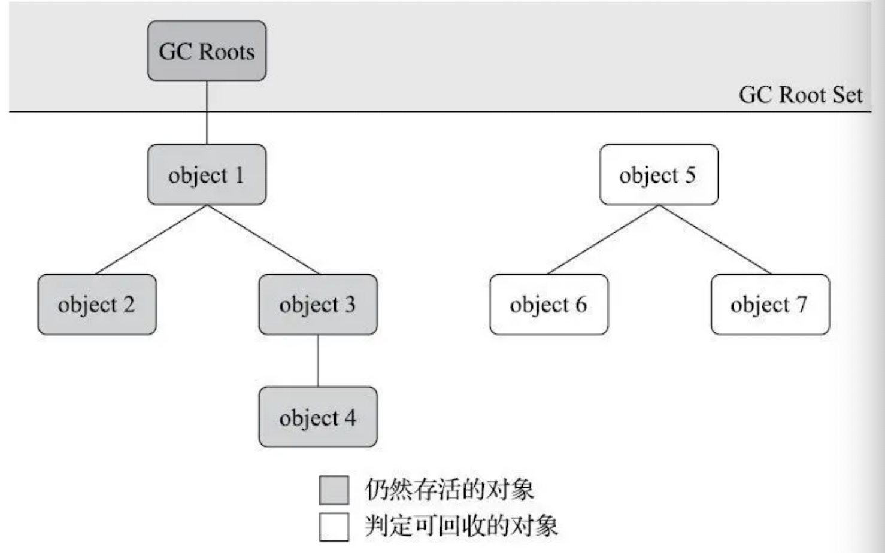

# 第03章_垃圾收集器与内存分配策略

## 1.概述

前面介绍了 Java 内存运行时区域的各个部分，其中**程序计数器、虚拟机栈、本地方法栈 3 个区域随线程而生，随线程而灭**，栈中的栈帧随着方法的进入和退出而执行着出栈和入栈操作。每一个栈帧中分配多少内存基本上是在类结构确定下来时就已知的（尽管在运行期会由即时编译器进行一些优化，但在基于概念模型的讨论里大体可以认为是编译期可知的），因此这几个区域的内存分配和回收都具备确定性，在这几个区域内就不需要过多考虑如何回收的问题，当方法结束或线程结束时内存自然就跟随着回收了。

而 **Java 堆和方法区这两个区域则有着很显著的不确定性**：一个接口的多个实现类需要的内存可能不一样，一个方法所执行的不同条件分支所需要的内存也可能不一样，只有处于运行期间才能知道程序究竟会创建哪些对象，创建多少个对象，这部分内存的分配和回收是动态的。垃圾收集器所关注的正是这部分内存该如何管理。

## 2.对象存亡

在堆中存放着几乎所有的 Java 对象，垃圾收集器在对堆进行回收前首先要确定哪些对象是存活的，哪些是死去的，即不再被任何途径使用的对象。

### 2.1 引用计数算法

引用计数算法（Reference Counting）指在对象中添加一个**引用计数器**，每当有一个地方引用它时计数器值就加一；当引用失效时计数器值就减一；任何时刻计数器为零的对象就是不可能再被使用的。它虽然占用了一些额外的内存空间来进行计数，但它的原理简单，判定效率高，大多数情况下都是一个不错的算法。在 Python 以及游戏脚本领域的 Squirrel 中都使用了引用计数算法进行内存管理。但是在一些**主流的 Java 虚拟机中却没有使用引用计数算法**来管理内存，主要是因为这个算法有很多例外情况要考虑，例如单纯的引用计数就**很难解决对象之间相互循环引用的问题**。

### 2.2 可达性分析算法

当前主流的商用程序语言（Java、C# 等）的内存管理子系统都是通过可达性分析（Reachability Analysis）算法来判定对象是否存活。这个算法的基本思路是通过一系列称为 **GC Roots** 的根对象作为起始节点集，从这些节点开始根据引用关系向下搜索，搜索过程所走过的路径称为“引用链”（Reference Chain），如果某个对象到 GC Roots 间没有任何引用链相连，即**从 GC Roots 到这个对象不可达**时，则证明此对象是不可能再被使用的。

在 Java 技术体系中，固定可作为 GC Roots 的对象包括以下几种：

- **虚拟机栈（栈帧中的本地变量表）中引用的对象**，例如各个线程被调用的方法堆栈中使用到的参数、局部变量、临时变量等
- **本地方法栈中 JNI（即本地方法）引用的对象**
- **方法区中类静态属性引用的对象**，例如 Java 类的引用类型静态变量
- **方法区中常量引用的对象**，例如字符串常量池中的引用
- **Java 虚拟机内部的引用**，如基本数据类型对应的 Class 对象，一些常驻的异常对象（如 NullPointException、OutOfMemoryError）等，还有系统加载类
- 所有**被同步锁（`synchronized`关键字）持有的对象**
- 反映 Java 虚拟机内部情况的 JMXBean、JVMTI 中注册的回调、本地代码缓存等

除了这些固定的 GC Roots 集合外，根据用户所选用的垃圾收集器以及当前回收的内存区域不同，还可以有其他对象临时性的加入，共同构建成完整的 GC Roots 对象。例如后文将会提到的分代收集和局部回收（Partial GC），如果只针对 Java 堆中某一块区域发起垃圾收集时（如典型的只针对新生代的垃圾收集），里面的对象完全有可能被位于堆中其他区域的对象所引用，这时候就需要将这些关联区域的对象也一并加入 GC Roots 集合中去。

### 2.3 引用

在 JDK 1.2 之后，Java 堆引用个概念进行了扩充，将引用分为强引用、软引用、弱引用和虚引用 4 种：

1. **强引用**

   在程序代码中普遍存在的引用赋值都属于强引用，即`Object ibj = new Object()`这种关系。无论任何情况下，只要强引用关系存在，垃圾收集器就永远不会回收掉被引用的对象。

2. **软引用**

   