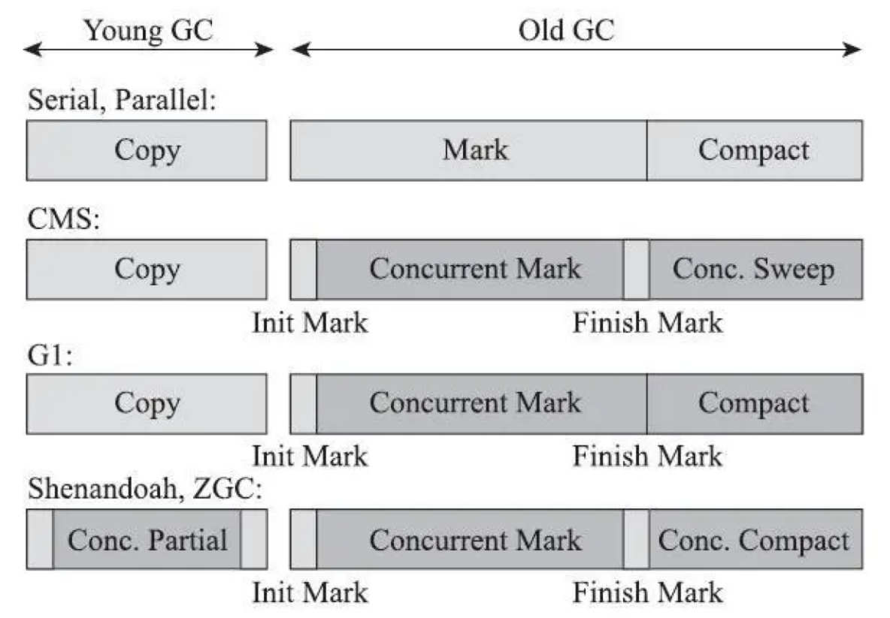

# 第04章_垃圾收集器

如果说收集算法是内存回收的方法论，那垃圾收集器就是内存回收的实践者。《Java 虚拟机规范》中堆垃圾收集器应该如何实现并没有做出任何规定，因此不同的厂商、不同版本的虚拟机所包含的垃圾收集器可能会有很大差别，不同的虚拟机一般也都会提供各种参数供用户根据自己的应用特点和要求组合出各个内存分代所使用的收集器。

## 1.经典垃圾收集器

本节主要讨论在 JDK 7 Update 4 之后到 JDK 11 正式发布之前，OracleJDK 中的 HotSpot 虚拟机所包含的全部可用的垃圾收集器。各款经典收集器之间的关系如下图所示，图中展示了七种作用于不同分代的收集器，如果两个收集器之间存在连线就说明它们可以搭配使用。标注 JDK9 则是说该组合在 JDK9 中被取消支持。


### 1.1 Serial收集器

Serial 收集器是最基础、历史最悠久的收集器，曾经（JDK 1.3.1 之前）是 HotSpot 虚拟机新生代收集器的唯一选择。这个收集器是一个**单线程**工作的收集器，这并不仅仅是说它只会使用一个处理器或一条收集线程完成垃圾收集工作，更重要的是强调在它进行垃圾收集时必须**暂停其他所有工作线程**（STW）直到收集结束。下图展示了 Serial/Serial Old 收集器的运行过程。


迄今为止，它依然是 **HotSpot 虚拟机运行在客户端模式下的默认新生代收集器**，对于内存资源受限的环境，它是所有收集器中额外内存消耗最少的；对于单核处理器或者处理器核心数较少的环境来说，Serial 收集器由于没有线程交互的开销，可以获得最高的单线程收集效率。在桌面应用场景以及部分微服务应用中，分配给虚拟机管理的内存一般不会特别大，收集几十兆甚至一两百兆的新生代的停顿时间完全可以控制在十几、几十毫秒，最多一百毫秒以内，只要不是频繁发生收集，这点停顿时间对许多用户来说完全可以接受。

### 1.2 ParNew收集器

ParNew 收集器实质上是 **Serial 收集器的多线程并行版本**，除了同时使用多条线程进行垃圾收集外，其余的行为包括 Serial 收集器可用的所有控制参数、收集算法、STW、对象分配规则、回收策略等都与 Serial 收集器完全一致，在实现上这两种收集器也共用了相当多的代码。ParNew 收集器的工作过程如下图所示。


ParNew 收集器除了支持多线程并行收集之外，其他与 Serial 收集器相比没有太多创新，但它却是不少运行在服务端模式下的 HotSpot 虚拟机，尤其是 JDK 7 之前的遗留系统中首选的新生代收集器，其中一个很重要的原因是：**除了 Serial 收集器外，目前只有它能与 CMS 收集器配合工作**。ParNew 收集器是激活 CMS 后（使用`-XX:+UseConcMarkSweepGC`）的默认新生代收集器，也可以使用`-XX:+/-UseParNewGC`来强制指定或禁用它。

但是随着更先进的 G1 收集器的登场，在 JDK 9 之后 ParNew 加 CMS 收集器的组合就不再是官方推荐的服务端模式下的收集器解决方案了。并直接取消了`-XX:+UseParNewGC`参数，这意味着 ParNew 和 CMS 从此之后只能互相搭配使用，没有其他收集器能够配合了，可以理解为 ParNew 和并入 CMS，成为它专门处理新生代的组成部分。ParNew 可以说是 HotSpot 虚拟机中第一款退出历史舞台的垃圾收集器。

ParNew 收集器在单核心处理器环境中不会有比 Serial 收集器更好的效果，甚至由于存在线程交互的开销，该收集器在通过超线程技术实现的伪双核处理器环境中都不能百分之百保证超越 Serial 收集器。睡着处理器核心数的增加，ParNew 才开始展现对于垃圾收集时系统资源的高效利用。它默认开启的收集线程数与处理器核心数量相同，在多核环境中可以使用`-XX:ParallelGCThreads`参数来限制垃圾收集的线程数。

> **提示**
>
> - **并行（Parallel）**：描述的是多条垃圾收集器线程之间的关系，说明同一时间有多条这样的线程在协同工作，通常默认此时用户线程是处于等待状态。
>
> - **并发（Concurrent）**：描述的是垃圾收集器线程与用户线程之间的关系，说明同一时间垃圾收集器线程与用户线程都在运行，但此时由于垃圾收集器线程占用了部分资源，应用程序的处理的吞吐量会受到一定影响。

### 1.3 Parallel Scavenge收集器

Parallel Scavenge 也是新生代收集器，同样基于标记-复制算法实现，能够实现并行收集。它的许多特性表面上看和 ParNew 非常相似，其特别之处在于 CMS 等收集器关注的更多的是缩短垃圾收集时用户线程的停顿时间，而 Parallel Scavenge 关注的是**达到一个可控制的吞吐量**，即运行用户代码的时间和处理器总消耗时间的比值。因此也被称作**吞吐量优先收集器**。

**停顿时间越短**越适合需要与用户交互或需要保证服务响应质量的程序，良好的响应速度能够提升用户体验；而**高吞吐量**则可以最高效率地利用处理器资源，尽快完成程序的任务，适合在后台运算和不需要太多交互的分析任务。

Parallel Scavenge 提供了两个参数用于精确控制吞吐量：

- `-XX:MaxGCPauseMillis`
  
  控制最大垃圾收集停顿时间。允许的值是一个大于 0 的毫秒数，收集器将尽力保证内存回收花费的时间不超过用户设定值。但并不是说设置得越小集速度就会变得更快，**垃圾收集停顿时间缩短是以牺牲吞吐量和新生代空间为代价换取的**：系统把新生代调的小一些，收集 300MB 新生代肯定比收集 500M 快，但这也导致垃圾收集发生的更加频繁，本来 10 秒收集一次、每次停顿 100 毫秒，现在变成 5 秒收集一次、每次停顿 70 毫秒。停顿时间虽然在下降，但吞吐量也变小了。
  
- `-XX:GCTimeRatio`
  
  设置吞吐量大小。允许的值是一个大于 0 小于 100 的整数，相当于吞吐量的倒数。例如设置为 19 时，允许的最大垃圾收集时间就占总时间的 5%（ 1/(1+19)），默认 99，即允许最大 1%（1/(1+99)）的垃圾收集时间。

除了这两个参数外，Parallel Scavenge 还有一个用来开启**自适应调节策略**的参数：`-XX:+UseAdaptiveSizePolicy`（默认开启）。当开启这个参数后，就不需要人工指定新生代的大小（`-Xmn`）、Eden 和 Survivor 区的比例（`-XX:SurvivorRatio`）、晋升老年代对象大小（`-XX:PretenureSizeThreshold`）等细节参数，虚拟机会根据当前系统的运行情况收集性能监控信息，**动态调整这些参数**以提供最合适的停顿时间或者最大的吞吐量。此时只需要把基本的内存数据设置好（如`-Xmx`），然后使用`-XX:MaxGCPauseMillis`或`-XX:GCTimeRatio`参数给虚拟机设立一个优化目标，则具体细节参数的调节就由虚拟机完成了。自适应调节策略也是 Parallel Scavenge 区别于 ParNew 收集器的一个重要特性。

### 1.4 Serial Old收集器

Serial Old 是 Serial 收集器的老年代版本，同样是一个单线程收集器，使用标记-整理算法。其主要意义也是供客户端模式下的 HotSpot 虚拟机使用。在服务端模式下它有两种用途：

1. 在 JDK 5 及以前版本中与 Parallel Scavenge 搭配使用
   
   Parallel Scavenge 收集器架构中本身有 PS MarkSweep 收集器进行老年代收集，并非直接调用 Serial Old 收集器，但是由于 PS MarkSweep 收集器与 Serial Old 的实现几乎一致，所以在官方资料中都是直接以 Serial Old 代替 PS MarkSweep 讲解。

2. 作为 CMS 收集器发生失败时的备选方案，在并发收集发生 Concurrent Mode Failure 时使用

其工作过程如下图所示：


### 1.5 Parallel Old收集器

Parallel Old 是 Parallel Scavenge 收集器的老年代版本，支持多线程并发收集，基于标记-整理算法实现。在该收集器出现之前（JDK 6），新生代的 Parallel Scavenge 收集器一直处于尴尬的状态，因为如果新生代选择了 Parallel Scavenge 收集器，老年代除了 Serial Old（PS MarkSweep）外别无选择。由于老年但是代 Serial Old 收集器在服务端性能较差，使用 Parallel Scavenge 收集器也未必能在整体上获得吞吐量最大化的效果。特别是在老年代内存空间很大且硬件规格较高的运行环境中，这种组合（Parallel Scavenge + Serial Old）的总吞吐量甚至不一定比 ParNew + CMS 的组合来的优秀。

当 Parallel Old 出现后，这一状况得到了改善：**注重吞吐量或者处理器资源较为稀缺的场合，都可以优先考虑 Parallel Scavenge + Parallel Old 的组合**。

Parallel Old 收集器的工作过程如下图所示。


### 1.6 CMS收集器

CMS（Concurrent Mark Sweep）收集器是一种**以获取最短回收停顿时间为目标**的收集器。例如在基于浏览器的 B/S 系统的服务端上，服务的**响应速度**往往比较重要，CMS 就非常符合这类应用的需求。

从名字也可以看出（Mark Sweep），它是基于**标记-清除**算法实现的，整个过程分为四个步骤：

1. **初始标记（CMS initial mark）**
   
   需要 STW，但仅仅只是标记下 GC Roots 能直接关联到的对象，速度很快。

2. **并发标记（CMS concurrent mark）**
   
   从 GC Roots 的直接关联对象开始遍历整个对象图，不需要停顿用户线程。

3. **重新标记（CMS remark）**
   
   为了修正并发标记期间，因用户线程继续运作而导致标记产生变动的那一部分对象的标记记录。停顿时间通常比初始标记阶段稍长一些，但远比并发标记阶段时间短。

4. **并发清除（CMS concurrent sweep）**
   
   清理掉标记阶段判断的已经死亡的对象，由于不需要移动存活对象，这个阶段可以与用户线程并发进行。
   

由于在整个过程中耗时最长的并发标记和并发清除阶段中，垃圾收集器线程都可以与用户线程一起工作，所以总体上来说，**CMS 收集器的内存回收过程是与用户线程一起并发执行的**。


CMS 收集器是 HotSpot 虚拟机追求低停顿的第一次成功尝试，但是它远没有达到完美的程度，有以下三个明显缺点：

1. 对处理器资源非常敏感
   
   在并发阶段虽然不会导致用户线程停顿，但却会因为占用了一部分处理器资源而导致应用程序变慢，降低总吞吐量。CMS 默认启动的回收线程数是 (处理器核心数+3)/4，即如果核心数 >= 4，则并发回收时垃圾收集线程只占用不超过 25% 的处理器运算资源，并且会随着处理器核心数量的增加而下降。但是**当处理器核心数量 < 4，CMS 对用户程序的影响就变得很大**，会导致用户程序的执行速度忽然大幅降低。

   > **补充**
   >
   > 为了缓解资源敏感的问题，虚拟机曾提供了称为"增量式并发收集器"（Incremental Concurrent Mark Sweep/i-CMS）的 CMS 收集器变种，是在并发标记、清理的时候让收集器线程、用户线程交替运行，尽量减少垃圾收集线程的独占资源的时间，虽然整个垃圾收集的过程会更长，但对用户程序的影响就会显得小一些。直观感受是速度变慢的时间多了，但速度下降幅度没有那么明显。
   >
   > 但是由于实践效果一般，从 JDK 7 开始，i-CMS 已被声明为 deprecated，到 JDK 9 发布后被完全废弃。

2. 由于无法处理"浮动垃圾"（Floating Garbage），有可能出现 Concurrent Mode Failure 失败而导致另一次完全 STW 的 Full GC 的产生
   
   在 CMS 的并发标记和清理阶段，用户线程还是在运行的，自然会伴随有新的垃圾对象的产生，但这一部分垃圾对象是出现在标记过程结束以后，CMS 无法在当次收集中处理掉它们，只能在下一次垃圾收集时再清理掉，这一部分垃圾就称为**浮动垃圾**（例如从黑色节点上删除的引用对象）。同样由于在垃圾收集阶段用户线程还需要持续运行，需要预留足后内存空间给用户线程使用，因此 CMS 不能像其他收集器那样等待老年代几乎完全被填满了再进行收集，必须**预留一部分空间供并发收集时的程序运作使用**。在 JDK 5 的默认设置下 CMS 收集器当老年代使用了 68% 的空间后就会被激活，这是偏保守的，可以适当调高参数 `-XX:CMSInitiatingOccupancyFraction` 的值来提高 CMS 的触发百分比，降低内存回收频率。到了 JDK 6 时，该值默认提升到了 92%，但这又导致另一种风险：如果 CMS 运行期间预留的内存无法满足程序分配新对象的需要，就会出现一次**并发失败**，此时虚拟机将不得不冻结用户线程的执行，临时启用 Serial Old 收集器来重新进行老年代的垃圾收集，但这样停顿时间就很长了。所以参数 `-XX:CMSInitiatingOccupancyFraction` 设置得太高会很容易导致大量的并发失败产生，性能反而降低。

3. 由于是基于**标记-清除**算法实现，收集结束时会有**大量空间碎片**产生
   
   空间碎片过多会导致无法找到足够大的连续空间来分配当前对象而不得不触发一次 Full GC 的情况。为了解决这个问题，CMS 收集器提供了一个 `-XX:+UseCMSCompactAtFullColection` 开关参数（默认开启，JDK 9 后废弃），用户在 CMS 收集器不得不进行 Full GC 时开启内存碎片的合并整理过程，由于这个整理必须移动存活对象，（在 Shenandoah 和 ZGC 出现前）是无法并发的。这样虽然解决了空间碎片问题但是停顿时间更长了，因此 CMS 还提供了另一个参数 `-XX:CMSFullGCsBeforeCompaction`（从 JDK 9 后废弃），用于要求 CMS 收集器在执行指定次数的不整理空间的 Full GC 后，下一次进入 Full GC 前先进行碎片整理（默认 0，即每次进入 Full GC 时都进行碎片整理）。

经过多个版本的开发迭代后，CMS（以及之前几款收集器）的代码与 HotSpot 的内存管理、执行、编译、监控等子系统都有千丝万缕的联系，但这并不符合职责分离的设计原则。为此，规划 JDK 10 功能目标时，HotSpot 虚拟机提出了**统一垃圾收集器接口**，将内存回收的行为与实现分离，CMS 及其他收集器都重构成基于这套接口的一种实现。这算是在为 CMS 退出历史舞台铺下最后的道路。

### 1.7 Garbage First收集器

G1 收集器是垃圾收集器技术发展史上里程碑式的成果，它开创了收集器**面向局部收集**的设计思路和**基于 Region 的内存布局形式**。到了 JDK 8 Update 40 时，G1 提供并发的类卸载的支持，补全了其计划功能的最后一块拼图。这个版本后的 G1 收集器才被 Oracle 官方称为**全功能的垃圾收集器**（Fully-Featured Garbage Collector）。

G1 是一款主要**面向服务端应用**的垃圾收集器。**JDK 9** 发布时，G1 宣告取代 Parallel Scavenge + Parallel Old 的组合，称为服务端模式下的默认垃圾收集器，而 CMS 则被声明为不推荐使用的收集器，并将在未来被废弃。

作为 CMS 收集器的替代者，设计者们希望做出一款能够建立起**停顿时间模型**（Pause Prediction Model）的收集器。停顿时间模型指能够支持指定在一个长度为 M 毫秒的时间片段内，消耗在垃圾收集上的时间大概率不超过 N 毫秒的实现目标，这几乎是实时 Java（RTSJ）的中软实时垃圾收集器特征了。

具体来说，在 G1 收集器出现前的所有其他收集器（包括 CMS），垃圾收集的目标范围要么是整个新生代（Minor GC），要么是整个老年代（Major GC），再者是整个 Java 堆（Full GC）。而 G1 跳出了这个樊笼，它可以**面向堆内存任何部分**来组成**回收集**（CSet，Collection Set）进行回收，衡量标准不再是它属于哪个分代，而是哪块内存中存放的垃圾数量最多，回收受益最大，这就是 G1 收集器的 **Mixed GC** 模式。

虽然 G1 也遵循分代收集理论，但其堆内存的布局与其他收集器有非常明显的差异：G1 不再坚持固定大小以及数量的分代区域划分，而是**把连续的 Java 堆划分为多个大小相等的独立区域（Region），每一个 Region 都可以根据需要，扮演新生代的 Eden、Survivor 空间，或者老年代空间**，收集器能够对扮演不同角色的 Region 采用不同的策略处理。

Region 中还有一类特殊的 **Humongous** 区域，专门用来存储大对象。G1 认为只要大小超过了一个 Region 容量一半的对象即是大对象。每个 Region 的大小可以通过参数 `-XX:G1HeapRegionSize` 设定，取值范围是 1MB～32MB，且应为 2 的 N 次幂。如果大小超过了整个 Region 容量，则会被存放在 N 个连续的 Humongous Region 中，G1 的大多数行为都把 Humongous Region 作为老年代的一部分来进行看待。


G1 之所以能够建立可预测的停顿时间模型，是因为它将 Region 作为单次回收的最小单元，即**每次收集到的内存空间都是 Region 大小的整数倍**，这样可以有计划地避免在整个 Java 堆中进行全区域的垃圾收集。具体来说，G1 会跟踪各个 Region 中垃圾堆积的"价值"大小，价值即回收所获得的空间大小以及回收所需时间的经验值，然后在后台维护一个优先级列表，每次根据用户设定允许的收集停顿时间（通过 `-XX:MaxGCPauseMillis` 指定，默认 200 毫秒），优先处理回收价值收益最大的那些 Region，即 Garbage First 的由来。这种方式保证了 G1 收集器在有限的时间内获取尽可能高的收集效率。

G1 收集器看似简单，但是实现起来有以下几个关键的细节问题需要解决：

1. 将 Java 堆划分成多个独立 Region 后如何解决跨 Region 引用？
   
   G1 的**每个 Region 都维护有自己的记忆集**，这些记忆集会记录下别的 Region 指向自己的指针，并标记这些指针分别在哪些卡页的范围内。G1 的记忆集在存储结构的本质上是一种哈希表，Key 是别的 Region 的起始地址，Value是一个集合，存储的元素是卡表的索引号。这种**双向的卡表结构**（记录了我指向谁和谁指向我）更加复杂，同时由于 Region 数量比传统收集器的分代数量更多，因此 G1 收集器要比其他的传统垃圾收集器**有着更高的内存占用**。据经验，G1 至少要耗费大约相当于 Java 堆容量 10% 到 20% 的额外内存来维持收集器工作。

2. 在并发标记阶段如何保证收集线程与用户线程互不干扰地运行？
   
   G1 收集器通过**原始快照**算法来实现并发标记阶段收集线程和用户线程的并发运行。同时，为了解决回收过程中新创建对象的内存分配问题，G1 为每一个 Region 设计了两个名为 **TAMS**（Top at Mark Start）的指针，把 Region 中的一部分空间划分出来用于并发回收过程中的新对象分配，**并发回收时新分配的对象地址都必须在这两个指针位置以上**。G1 收集器默认在这个地址以上的对象是存活的，不纳入回收范围。与 CMS 的并发失败类似，当内存回收速度赶不上内存分配的速度时，G1 收集器也会冻结用户线程导致 Full GC 而产生 STW。

3. 如何建立可靠的停顿预测模型？
   
   G1 收集器的停顿预测模型是以**衰减均值**（Decaying Average）为理论基础实现的，在垃圾收集过程中，G1 收集器会记录每个 Region 的回收耗时、每个 Region 记忆集里的脏卡数量等各个可测量的步骤花费的成本，并分析得出平均值、标准偏差、置信度等统计信息。由于该统计信息更容易受到新数据的影响，使用**衰减均值**可以更准确地代表最近的平均状态。然后通过这些信息预测现在开始回收的话，由哪些 Region 组成回收集才可以在不超过期望停顿时间的约束下获得最高的收益。

如果不去计算用户线程运行过程中的动作（如使用写屏障维护记忆集的操作），G1 收集器的运作过程大致可划分为以下 4 个步骤：

1. **初始标记（Initial Marking）**
   
   仅仅标记一下 GC Roots 能直接关联到的对象，并且修改 TAMS 指针的值，让下一阶段用户线程并发运行时能正确地在可用的 Region 中分配新对象。这个阶段是借用 Minor GC 的时候同步完成的，虽然需要**停止用户线程**，但耗时很短，实际上并没有额外的停顿。

2. **并发标记（Concurrent Marking）**
   
   从 GC Root 开始对堆中对象进行可达性分析，递归扫描整个堆里的对象图找出要回收的对象。这个阶段耗时较长，但**可与用户线程并发执行**。当对象图扫描完成后，还要重新处理 SATB 记录下的在并发时有引用变动的对象。

3. **最终标记（Final Marking）**
   
   对用户线程做另一个**短暂的暂停**，用于处理并发阶段结束后仍遗留下来的最后那少量的 SATB 记录。

4. **筛选回收（Live Data Counting and Evacuation）**
   
   负责更新 Region 的统计数据，对各个 Region 的回收价值和成本进行**排序**，根据用户期望的停顿时间来制定回收计划，可以自由选择任意多个 Region 构成回收集，然后把决定回收的那一部分 Region 的存活对象复制到空的 Region 中，再清理掉整个旧 Region 的全部空间。这里的操作设计存活对象的移动，必须**暂停用户线程**，由多条收集器线程并行完成。

可以看出，除了并发标记外其余阶段都需要完全暂停用户线程，因此它并非纯粹地追求低延迟，官方设定的目标是在延迟可控的情况下获得尽可能高的吞吐量。


可以指定期望的停顿时间是 G1 很强大的一个功能，不过这里设置的期望值必须是符合实际的。默认的停顿目标是 200 毫秒，一般来说回收阶段占到几十到一百甚至接近两百毫秒都很正常，但如果把停顿时间设置得很低，例如 20 毫秒，很可能出现由于停顿时间太短，导致每次选出来的回收集只占堆内存很小的一部分，收集器收集的速度跟不上分配器分配的速度，导致垃圾慢慢堆积，最终导致 Full GC 反而降低性能，所以通常设置为 **100～300** 毫秒比较合理。

从 G1 开始，先进的垃圾收集器的设计都不约而同地变为追求**能够应付应用的内存分配速率**，而不追求一次把整个 Java 堆全部清理干净。这样应用的分配和收集器的收集并发进行，只要收集的速度能跟得上对象分配的速度就可以。这种设计思路从工程实现上来看是从 G1 兴起的，所以说 G1 是收集器技术发展的一个里程碑。

G1 收集器和 CMS 收集器都是关注的停顿时间的控制，但是相比于 CMS，G1 有许多**优点**，暂且不论可以**指定最大停顿时间**、**分 Region 的内存布局**、**按收益动态确定回收集**这些创新型设计带来的红利，但从传统的算法理论来看 G1 也更有潜力：与 CMS 的"标记-清除"算法不同，G1 从整体来看是基于"标记-整理"算法实现的，但从局部（两个 Region 间）来看又是基于标记-复制算法实现的，这意味着 G1 运行期间不会产生内存空间碎片，在为大对象分配内存时不容易因无法找到连续内存空间而提前触发下一次收集，有利于程序长时间运行。

但是 G1 也有**缺点**，例如在用户程序运行过程中，G1 无论是为了垃圾收集产生的内存占用还是程序运行时的额外执行负载都比 CMS 要高。

- 从内存占用来说，虽然 G1 和 CMS 都适用卡表来处理跨代指针，但 G1 的卡表实现更为复杂，而且 G1 中的每个 Region 都有一份卡表，这导致 G1 的记忆集（和其他内存消耗）可能会占整个堆容量的 20% 乃至更多的内存空间；相比起来 CMS 只有一份卡表，而且只需要单向处理老年代到新生代的引用。由于新生代朝生夕灭的不稳定性，能省下这个区域的维护开销是很划算的（代价是当 CMS 发生 Old GC 时（只有 CMS 有针对老年代的 Old GC），要把整个新生代作为 GC Roots 来进行扫描）。

- 在执行负载角度上，由于两个收集器各自的细节实现不同导致了用户程序运行时的负载不同，例如它们**都使用到写屏障**：CMS 使用写后屏障来更新维护卡表；而 G1 除了使用**写后屏障**来进行卡表维护外，为了实现原始快照搜索算法，还需要使用到**写前屏障**来跟踪并发时的指针变化情况。由于 G1 对写屏障的复杂操作比 CMS 消耗更多的运算资源，所以 CMS 的写屏障实现是直接的同步操作，而 **G1 不得不将写前屏障和写后屏障中要做的事情都放到队列中异步处理**。

以上仅仅是实现细节的定性分析，具体场景要做具体的定量比较。按照经验来说，目前在小内存应用上 CMS 的表现大概率要优于 G1，而在大内存应用上 G1 则能发挥优势，这个优势的 Java 堆容量平衡点通常在 6～8GB 间。随着 HotSpot 对 G1 的不断优化，优势也会继续向 G1 倾斜。

## 2.低延迟垃圾收集器

衡量垃圾收集器的三项重要指标是：**内存占用**、**吞吐量**和**延迟**，三者的总体表现会随着技术进步而越来越好，但是要在这三方面同时有完美表现的收集器几乎是不存在的，往往达成其中两项便可称作优秀。其中**延迟**的重要性越来越受到重视：随着计算机硬件性能的提升，可以容忍收集器占用的内存越来越大，收集器运行时对应用程序的影响也越来越小，即吞吐量越来越大，但是**由于内存的扩大反而对延迟带来负面的效果**。

现在来比较下已经接触过的垃圾收集器的停顿状况：



浅色阶段表示必须挂起用户线程，深色表示收集器线程与用户线程是并发工作的。可以看出，在 CMS 和 G1 之前的全部收集器，其工作的所有步骤都会产生 STW；CMS 和 G1 分别使用增量更新和原始快照实现了标记阶段的并发，不会因为管理的堆内存变大，要标记的对象变多而导致停顿时间变长。但是**仍未解决标记阶段之后的处理**：CMS 使用标记-清除算法，虽然避免了整理阶段收集器带来的停顿，但是由于避免不了空间碎片的产生，最后仍逃不过 STW。G1 虽然可以按更小的粒度进行回收，从而抑制整理阶段出现时间过长的停顿，但毕竟还是要 STW 的。

而 Shenandoah 和 ZGC 几乎整个工作过程全部都是并发的，只有初始标记、最终标记这些阶段有短暂的暂停，而**这部分停顿的时间基本上是固定的**，与堆容量、堆中对象的数量没有正比例关系。实际上它们都可以在任意可管理的堆容量下，实现垃圾收集的停顿不超过 10 毫秒的目标，它们被称为**低延迟垃圾收集器**（Low-Latency Garbage Collector or Low-Pause-Time Garbage Collector）。

### 2.1 Shenandoah收集器

#### 1.基本介绍

Shenandoah 作为第一款不由 Oracle 开发的 HotSpot 垃圾收集器，被拒绝在 OracleJDK 12 中引入，并在打包 OracleJDK 时通过条件编译完全排除掉了 Shenandoah 的代码，它只存在 OpenJDK 中。

最初 Shenandoah 是由 RedHat 公司独立发展的新型收集器项目，在 2014 年 RedHat 把 Shenandoah 贡献给了 OpenJDK，并推动它成为 OpenJDK 12 的正是特征之一（JEP189）.这个项目旨在实现一种在任何对内存大小下都可以把垃圾收集的停顿时间限制在 10 毫秒以内的垃圾收集器，这意味着 Shenandoah 不仅要进行并发的垃圾标记，还要并发地进行对象清理后的整理动作。

比起有着 Oracle 正朔血统的 ZGC，Shenandoah 反而更像是 G1 的下一代继承者，它们有着**相似的堆内存布局**，在初始标记、并发标记等许多阶段的处理思路上高度一致，甚至直接**共享了一部分实现代码**，这使得 G1 和 Shenandoah 相互分享了一些特性，例如 G1 在合并了 Shanandoah 的代码后才获得并发失败后的多线程 Full GC 的支持。

Shanandoah 也是使用基于 Region 的堆内存布局，同样有着用于存放大对象的 Humongous Region，默认的回收策略也同样是优先处理回收价值最大的 Region ……。但在内存管理方面它与 G1 至少存在三个明显的不同：

1. **支持并发的整理算法**
   
   G1 的回收阶段可以多线程并行，但却不能与用户线程并发，而 Shanandoah 的整理阶段是可以与用户线程并发的。

2. **没有分代**
   
   Shanandoah 没有专门的新生代 Region 或老年代 Region。

3. **使用"连接矩阵"的全局数据结构**
   
    Shanandoah 放弃了在 G1 中耗费大量内存和计算资源维护的记忆集，**改用名为连接矩阵的全局数据结构来记录跨 Region 的引用关系**，降低了处理跨代指针时的记忆集维护消耗，也降低了伪共享问题的发生概率。

   连接矩阵可以简单理解为一张二位表格，如果 Region N 有对象指向 Region M，就在表哥的 N 行 M 列中打上一个标记。如下图所示，如果 Region 5 中的对象 Baz 引用了 Region 3 的 Foo，Foo 又引用了 Region 1 的 Bar，那连接矩阵中的 5 行 3 列、3 行 1 列就应该打上标记。回收时通过这张表格就可以知道哪些 Region 之间产生了跨代引用。

   
   

Shenandoah 收集器的工作过程大致可以划分为以下九个阶段：

1. **初始标记（Initial Marking）**
   
   与 G1 一样，首先标记与 GC Roots 直接关联的对象，这个阶段仍然是 STW 的，但停顿时间与堆大小无关，只与 GC Roots 的数量相关。

2. **并发标记（Concurrent Marking）**
   
   与 G1 一样，遍历对象图标记出全部可达的对象，这个阶段是与用户线程一起并发的，时间长短取决于堆中存活对象的数量以及对象图的结果复杂程度。

3. **最终标记（Final Marking）**
   
   与 G1 一样，处理剩余的 SATB 扫描，并在这个阶段统计出回收价值最高的 Region，将这些 Region 构成一组回收集。这个阶段也会有小段短暂的停顿。

4. **并发清理（Concurrent Cleanup）**
   
   这个阶段用于清理那些整个区域内一个存活对象都没有找到的 Region（Immediate Garbage Region）。

5. **并发回收（Concurrent Evacuation）**
   
   这个阶段是 Shenandoah 区别于其他收集器的**核心差异**。这个阶段中 Shenandoah 会把回收集里面的存活对象先复制一份到其他未被使用的 Region 中。由于与用户线程并发执行，其困难点在于移动对象的同时，用户线程仍然可能不停地对被移动的对象进行读写访问，而移动对象后整个内存中所有指向该对象的引用都还是旧对象的地址，这是很难一瞬间全部改编过来的。**Shenandoah 通过读屏障和被称为 Brooks Pointers 的转发指针来解决**。这个阶段运行的时间长短取决于回收集的大小。

6. **初始引用更新（Initial Update Reference）**
   
   并发回收阶段复制对象结束后，还需要把堆中所有指向旧对象的引用修正到复制后的新地址，这个操作称为**引用更新**。在初始化阶段只是建立了一个线程集合点，确保所有并发回收阶段中进行的收集器线程都已完成分配给它们的对象移动任务而已。这个阶段会产生一个非常短暂的停顿。

7. **并发引用更新（Concurrent Update Reference）**
   
   真正开始进行引用更新操作，这个阶段是与用户线程并发进行，时间长短取决于内存中涉及的引用数量的多少。与并发标记不同，它不需要沿着对象图来搜索，只需要按照内存物理地址的顺序线形地搜索出引用类型，把旧值改为新值即可。

8. **最终引用更新（Final Update Reference）**
   
   修正存在于 GC Roots 中的引用，这个阶段是最后一次停顿，停顿的时间只与 GC Roots 的数量相关。

9. **并发清理（Concurrent Cleanup）**
   
   经过并发回收和引用更新后，整个回收集中所有的 Region 已再无存活对象，这些 Region 都变成 Immediate Garbage Regions 了，最后再调用一次并发清理过程来回收这些 Region 的内存空间。

以上几个步骤中只需要关注**并发标记**、**并发回收**、**并发引用更新**就能理清 Shenandoah 是如何运作了。


图中黄色区域代表的是被选入回收集的 Region，绿色部分代表还存活的对象，蓝色代表用户线程可以用来分配对象的内存区域。

#### 2.Brooks Pointer

1984 年 Rodney A.Brooks 发表论文提出了**使用转发指针来实现对象移动与用户程序并发**的一种解决方案。此前要做类似的并发操作，通常是在被移动对象原有的内存上设置保护陷阱（Memory protection Trap），一旦用户程序访问到归属于旧对象的内存空间就会产生自陷中段，进入预设好的异常处理器中，再由其中的代码逻辑把访问转发到复制后的新对象上。虽然确实能够实现对象移动和用户线程并发，但是如果没有操作系统层面的直接支持，这种方案将导致用户态和核心态的频繁切换。

> **提示**
>
> 如果有操作系统内核的支持的话就可以解决频繁切换的问题，Azul C4 收集器就是采用了这种方案。

Brooks 提出的新方案不需要用到内存保护陷阱，而是在原有对象布局结构的最前面统一增加一个新的引用字段，**在正常不处于并发移动的情况下，该引用指向对象自己**。这与某些早期 Java 虚拟机使用过的句柄定位有些类似，都是一种间接性的对象访问方式，差别是句柄通常会统一存储在专门的句柄池中，而**转发指针是分散存放在每一个对象头前面**。

该技术**缺点**也是非常显著的：

1. **每次对象访问会带来一次额外的转向开销**
   
   尽管这个开销已经被优化到只有一行汇编指令：
   
   ```bash
   mov r13,QWORD PTR [r12+r14*8-0x8]
   ```
   
   但是毕竟对象定位会被频繁使用，这仍是一笔不可忽视的执行成本，只是比起内存保护陷阱的方案好了很多。其收益是显而易见的：当对象拥有了一份新的副本时，**只需要把旧对象上的转发指针的引用位置指向新对象**，便可将所有对该对象的访问转发到新的副本上。
   
   

2. **存在多线程竞争的问题**
   
   如果收集器线程与用户线程发生的只是并发读取，那无论读到旧对象还是新对象的字段返回的都是一样的；但是**如果发生的是并发写入，就一定要保证写操作只能发生在新复制的对象上而不是写入旧对象的内存中**。例如发生下面的操作时：
   
   - 收集器线程复制了新的对象副本
   - 用户线程更新对象的某个字段
   - 收集器线程更新转发指针的引用值为新副本地址
   
   
   如果按此顺序的话将导致用户线程对象变更发生在旧对象上，所以这里必须针对转发指针做同步阻塞操作，实际上 Shenandoah 收集器时**通过 CAS 操作来保证并发时对象的同步访问的**。
   
3. **执行频率的问题**
   
   Shenandoah 同时设置了读屏障、写屏障来实现 Brooks Pointer 并发时的原对象与复制对象的访问一致性，[写屏障](第03章_内存分配策略.md#45-写屏障)的使用之前已经讲过，除此以外，Shenandoah 在读、写屏障中都加入了额外的转发处理，尤其是使用读屏障的代价比写屏障更大，因为读取对象的操作比写入对象的频率高很多，所以读屏障的使用必须更加谨慎。开发者也意识到了庞大的读屏障带来的性能开销，所以计划在 JDK 13 中将 Shenandoah 的内存屏障模型改进为**基于引用访问屏障**的实现，即内存屏障**只拦截对象中数据类型为引用类型**的读写操作，而不去管原生数据类型等其他非引用字段的读写，这就省去了大量对原生类型、对象比较、对象加锁等场景中设置内存屏障所带来的消耗。

### 2.2 ZGC收集器

ZGC（Z Garbage Collector）是一款在 JDK 11 中新加入的具有实验性质的低延迟垃圾收集器，由 Oracle 公司研发，并在 2018 年创建了 JEP 333 将 ZGC 提交给 OpenJDK，推动其进入 OpenJDK 11 的发布清单中。它与 Shenandoah 的目标高度相似，都希望在尽可能对吞吐量影响不太大的前提下，实现在任意堆内存大小下把垃圾收集的停顿时间限制在 10 毫秒以内。但是它的实现方式与 Shenandoah 不同，RedHat 的 Shenandoah 像是 G1 的继承者，而 Oracle 的 ZGC 像是 Azul System 的 PGC 和 C4 的同胞兄弟。早在 2005 年，运行在 Azul VM 上的 PGC 就已经实现了标记和整理阶段全程与用户线程并发运行的垃圾收集，而运行在 Zing VM 上的 C4 收集器是 PGC 继续演进的产物，主要增加了分代收集支持，大幅提升了收集器能够承受的对象分配速度。

ZGC 收集器是一款**基于 Region 内存布局的，不设分代的，使用了读屏障、染色指针和内存多重映射等技术来实现可并发的标记-整理算法的，以低延迟为首要目标**的一款垃圾收集器。

> **注意**
>
> Java 21 中为 ZGC 增加了分代特性，`-XX:UseZGC` 默认是使用非分代特性的，可以通过 `-XX:UseZGC  -XX:+ZGenerational` 来开启。

#### 1.内存布局

与 Shenandoah 和 G1 一样，ZGC 也采用基于 Region 的堆内存布局，不同的是，ZGC 的 Region（也被称为 Page 或 ZPage）**具有动态性**：动态创建和销毁，以及动态的区域容量大小。在 x64 硬件平台下，ZGC 的 Region 可以具有大、中、小三类容量：

- 小型 Region：容量固定为 2MB，用于放置小于 256KB 的小对象。
- 中型 Region：容量固定为 32MB，用于放置大于等于 256KB 但小于 4MB 的对象。
- 大型 Region：容量不固定，可以动态变化，但必须为 2MB 的整数倍，用于放置 4MB 或以上的大对象。**每个大型 Region 中只会存放一个大对象**，这也意味着它的实际容量完全有可能小于中型 Region，最小容量可以低至 4MB。由于复制一个大对象的代价非常高，大型 Region 在 ZGC 的实现中是不会被重分配的。


#### 2.并发整理算法的实现

Shenandoah 使用转发指针和读屏障来实现并发整理，ZGC 虽然同样用到了读屏障，但却是完全不同的思路：ZGC 收集器采用了**染色指针技术**（Colored Pointer）。从前当我们想要在对象上存储一些额外的、只供收集器或者虚拟机本身使用的数据，通常会在对象头中增加额外的存储字段（参考：[对象头](第02章_Java内存区域与内存溢出异常.md#1对象头)），如哈希码、分代年龄、锁记录等。这种记录方式在有对象访问的场景下没有问题，但是当我们需要**在不访问对象又希望获得该对象的某些信息**时就不再适用了。例如给对象打上[三色标记](第03章_内存分配策略.md#46-并发的可达性分析)，这些标记本质上只和对象的引用有关而与对象本身无关。HotSpot 虚拟机的几种收集器有不同的实现：Serial 把标记直接记录在对象头上，G1、Shenandoah 使用了与对象相互独立的数据结构，一种相当于堆内存 1/64 大小的，称为 BitMap 的结构来记录标记信息，而 **ZGC 的染色指针直接把标记信息记在引用对象的指针上**，这时可达性分析就相当于遍历"引用图"而不是对象图了。

> **扩展：为什么指针可以存储额外信息？**
>
> 在 64 位系统中，理论可以访问的内存高达 16 EB（2^64）字节（1EB=1024PB，1PB=1024TB）。但实际上，基于需求、性能（地址越宽在做地址转换时需要的页表级数越多）和成本（消耗更多晶体管）的考虑，在 AMD64 架构（即主流的 x86-64 架构）中只支持到 52 位（4PB）的地址总线和 48 位（256TB）的虚拟地址空间，所以目前 64 位的硬件实际能够支持的最大内存只有 256 TB。此外操作系统也会施加自己的约束，64 位的 Liunx 支持 47 位（128TB）的进程虚拟地址空间和 46 位（64TB）的物理地址空间，64 位的 Windows 系统甚至只支持 44 位（16TB）的物理地址空间。
>
> 尽管 Linux 下 64 位指针的高 18 位不能用来寻址，但剩余的 46 位指针所能支持的 64TB 内存已经可以满足大部分场景。因此 ZGC 的染色指针将这剩下的 46 位指针宽度的高 4 位提取出来存储 4 个标志信息。通过这些标志位，虚拟机可以直接从指针中看到其引用对象的三色标记状态、是否进入了重分配集、是否只能通过 `finalize()` 才能被访问到。由于这些标志位进一步压缩了原本的 46 位地址空间，也导致了 ZGC 能够管理的内存不超过 16 TB。
>
> 

虽然染色指针有内存限制，不能支持 32 位平台，不能支持压缩指针（`-XX:+UseCompressedOops`）等诸多约束，但是它的优点也是很客观的：

1. 染色指针可以使得一旦某个 Region 的存活对象被移走后，这个 Region **立即就能被释放和重用**，而不必等待整个堆中所有指向该 Region 的引用都被修正后才能清理。理论上只要还有一个空闲 Region，ZGC 就能完成收集，而 Shenandoah 需要等到引用更新阶段结束后才能释放回收集中的 Region，这意味着如果堆中所有对象都存活的话，必须要有一半的空闲 Region 来完成收集。
2. 染色指针可以**大幅减少在垃圾收集过程中内存屏障的使用数量**，设置内存屏障尤其是写屏障的目的通常是为了记录对象引用的变动情况，将这些信息直接维护在指针中可以省去一些记录操作。到目前为止 ZGC 都并未使用任何写屏障，只使用了读屏障（一部分是染色指针的功劳，一部分是 ZGC 还不支持分代收集没有跨代引用的问题）。所以 ZGC 对吞吐量的影响也相对较低。
3. 染色指针可以作为一种**可扩展的存储结构**用来记录更多与对象标记、重定位过程相关的数据。现在 Linux 下的 64 位指针还有前 18 位并未使用，它们虽然不能用来寻址，却可以通过其他手段用于记录信息。如果开发了这 18 位，既可以腾出已用的 4 个标志位，将 ZGC 可支持的最大堆内存从 4TB 拓展到 64TB，也可以利用其余位置再存储更多的标志，譬如存储一些追踪信息来让垃圾收集器在移动对象时能将低频次使用的对象移动到不常访问的内存区域。

> **扩展：操作系统是如何支持 Java 虚拟机重新定义内存中的指针？**
>
> 这个问题在 Solaris/SPARC 平台上比较容易解决，因为 SPARC 硬件层面本身就支持虚拟地址掩码，设置后其机器指令直接就可以忽略掉染色指针中的标志位。而在 x86-64 平台上则采用了**虚拟内存映射技术**。
>
> 在远古时代的 x86 计算机系统中，所有进程都是共用同一块物理内存空间的，这样会导致不同进程之间的内存无法相互隔离。为了解决这个问题，从 Intel 80386 处理器开始，提供了"保护模式"用于隔离进程。在保护模式下，386 处理器的全部 32 条地址寻址线都有效，进程可访问最高也可达 4GB 的内存空间。此时处理器会使用分页管理机制把线性地址空间和物理地址空间分别划分为大小相同的块，这样的内存块被称为"页"。通过在线性虚拟空间的页与物理地址空间的页之间建立的映射表，分页管理机制会进行线性地址到物理地址空间的映射，完成线性地址到物理地址的转换。这时地址与物理位置是一对多的映射关系。
>
> 不同层次的虚拟内存到物理内存的转换关系可以在硬件层面、操作系统层面或者软件进程层面实现，如何完成地址转换，是一对一、多对一还是一对多的映射，需要根据实际来设计。Linux/x86-64 平台上的 ZGC 使用了多重映射将多个不同的虚拟内存地址映射到同一个物理内存地址上。把染色指针中的标志位看作是地址的分段符，只要将这些不同的地址段都映射到同一个物理内存空间，经过映射转换后，就可以使用染色指针正常进行寻址了。
>
> 

#### 3.ZGC运作过程

ZGC 的运作过程大致可划分为以下**四个大的阶段**。全部四个阶段都是可以并发执行的，仅是两个阶段中间会存在短暂的停顿小阶段，例如初始化 GC Roots 直接关联对象的 Mark Start 阶段，与 G1 和 Shenandoah 的 Initial Mark 并无差异。


1. **并发标记（Concurrent Mark）**
   
   与 G1、Shenandoah 相同，并发标记是遍历对象图做可达性分析的阶段，前后也要经过类似于 G1、Shenandoah 的初始标记、最终标记（ZGC 中名字不叫这些）的短暂停顿，停顿阶段做的事情在目标上也是相类似的。不同的是，ZGC 的标记是在指针上而不是对象上进行的，标记阶段会更新染色指针中的 Marked 0、Marked 1 标志位。

2. **并发预备重分配（Concurrent Prepare for Relocate）**
   
   这个阶段会根据特定的查询条件统计得出本次收集过程要清理哪些 Region，**将这些 Region 组成重分配集**。重分配集与 G1 的回收集不同，ZGC 划分 Region 的目的并非为了像 G1 那样做收益优先的增量回收。**ZGC 每次回收都会扫描所有的 Region**，用范围更大的扫描成本换取省去 G1 中记忆集的维护成本。因此 ZGC 的重分配集只是决定了里面的存活对象会被重新复制到其他 Region 中，自身会被释放，而并不能说回收行为就只是针对这个集合里面的 Region 进行，因为标记过程是针对全堆的。此外在 JDK 12 中的 ZGC 开始支持的类卸载以及弱引用的处理也是在这个阶段完成的。

3. **并发重分配（Concurrent Relocate）**
   
   ZGC 执行过程中的核心阶段，这个过程要把重分配集中的存活对象复制到新的 Region 上，并为重分配集中的每个 Region 维护一个转发表，记录从旧对象到新对象的转向关系。得益于染色指针的支持，ZGC 能够仅从引用上就明确得知一个对象是否处于重分配集中，如果用户线程此时并发访问了位于重分配集中的对象，这次访问将会被预知的内存屏障所截获，然后**根据 Region 上的转发表记录将访问转发到新复制的对象上，并同时修正更新该引用的值**，使其直接指向新对象，这种行为被称为**指针的自愈能力**。此时只有第一次访问旧对象会陷入转发，也就是只慢一次，而 Shenandoah 的 [Brooks 转发指针](#2brooks-pointer)在每次对象访问时都必须付出固定开销，因此 ZGC 对用户程序的运行时负载要比 Shenandoah 来的更低一些。还有一个好处是由于染色指针的存在，一旦重分配集中某个 Region 的存活对象都复制完毕后，这个 Region 就可以立即释放用于新对象的分配（转发表还需要留着），即使堆中还有很多指向这个对象的未更新指针，当它们被使用时会自愈的。

4. **并发重映射（Concurrent Remap）**
   
   重映射所做的就是修正整个堆中**指向重分配集中旧对象的所有引用**，这一点从目标角度看与 Shenandoah "并发引用更新""阶段是一样的，但是 ZGC 的并发重映射不是一个迫切要完成的任务，因为指针自愈的存在，最多只是第一次使用时多一次转发和修正操作。重映射清理这些旧引用的主要目的是为了不变慢，还有清理后可以释放转发表这样的附带收益。因此 ZGC 巧妙地把并发重映射阶段的工作合并到了下一次垃圾收集循环中的并发标记阶段去完成，这样就节省了一次遍历对象图的开销（如果不是考虑合并的益处，单独做重映射的话只需要线性扫描整个堆来清理旧引用即可）。一旦所有指针都被修正，原来记录新旧对象关系的转发表就可以被释放了。

ZGC 的设计理念与 Azul System 公司的 PGC 和 C4 收集一模一样，是垃圾收集器研究的最前沿成果，它与 Shenandoah 一样做到了**几乎整个收集过程都全程可并发**，短暂停短也只与 GC Roots 大小相关而与堆内存大小无关，同样实现了任何堆上停顿都小于十毫秒的目标。

#### 4.ZGC的权衡选择

相比 G1、Shenandoah 等先进的垃圾收集器，例如 G1 需要通过**写屏障**来维护记忆集，才能处理跨代指针，得以实现 Region 的增量回收。记忆集要占用大量的内存空间，写屏障也对正常程序运行造成额外负担，这些都是权衡选择的代价。

ZGC 就完全没有使用记忆集，甚至连分代也没有（Java 21 新增了分代特性，但需要主动开启），连像 CMS 中那样只记录新生代和老年代间引用的卡表也不需要，因而完全没有用到写屏障，所以给用户线程带来的运行负担也要小得多。但是 ZGC 的这种选择（暂时性的）也限制了它能承受的**对象分配速率不会太高**。例如下面的这个场景：ZGC 准备要对一个很大的的堆做一次完整的并发收集，假设全过程要持续十分钟以上（注意不是停顿时间），在这段时间里，由于应用的对象分配速率很高，将创造大量的新对象，这些**新对象很难进入当次收集的标记范围**，通常只能全部当作存活对象来看待——尽管其中绝大部分对象都是朝生夕灭的，这就产生了大量的**浮动垃圾**。目前唯一的办法就是尽可能地增加堆容量大小，获得更多的垃圾处理喘息时间。但若要从根本上提升 ZGC 能够应对的对象分配速率，还需要引入分代收集，让新生对象都在一个专门的区域中创建，然后专门针对这个区域进行更频繁、更快的收集。Azul 的 C4 收集器实现了分代收集后能够应对的对象分配速率就比不分代的 PGC 收集器提升了十倍之多。

ZGC 还有一个优点是支持 NUMA-Aware 的内存分配。NUMA（Non-Uniform Memory Access，非统一内存访问架构）是一种为多处理器或者多核处理器的计算机所设计的内存架构。由于摩尔定律逐渐失效，现代处理器因频率发展受限而转向多核方向发展，以前原本在北桥芯片中的内存控制器也被集成到了处理器内核中，这样**每个处理器核心所在的裸晶（DIE）都有属于自己内存管理器所管理的内存**，如果要访问被其他处理器核心管理的内存，就必须通过 Inter-Connect 通道来完成，这要比访问处理器的本地内存慢得多。在 NUMA 架构下，ZGC 收集器会优先尝试**在请求线程当前所处的处理器的本地内存上分配对象**，以保证高效内存访问。在 ZGC 之前的收集器只有针对吞吐量设计的 Parallel Scavenge 支持 NUMA 内存分配。

#### 5.性能

在 ZGC 的弱项吞吐量方面，以低延迟为首要目标的 ZGC 已经达到了以高吞吐量为目标的 Parallel Scavenge 的级别，直接超越了 G1。而在停顿时间上则与 Parallel Scavenge、G1 拉开了两个数量级的差别。不论是平均停顿，还是 95% 停顿、99% 停顿、99.9% 停顿或是最大停顿时间，ZGC 均能控制在 10 毫秒以内。

## 3.选择合适的垃圾收集器

### 3.1 Epsilon收集器

这是一款以**不进行垃圾收集**为卖点的垃圾收集器。Epsilon 收集器由 RedHat 公司在 JEP 318 中提出，在此提案中 Epsilon 被形容成一个无操作的收集器，它更贴切的名字应该是"自动内存管理子系统"。一个垃圾收集器除了垃圾收集这个本职工作外，还要负责堆的管理与布局、对象的分配、与解释器的协作、与编译器的协作、与监控子系统写作等职责，其中至少**堆的管理**和**对象的分配**这部分功能是 Java 虚拟能能够正常运作的必要支持。从 JDK 10 开始，为了隔离垃圾收集器与 Java 虚拟机解释、编译、监控等子系统的关系，RedHat 提出了垃圾收集器的统一接口，即 JEP 304 提案，Epsilon 是这个接口的有效性验证和参考实现，同时也用于需要剥离垃圾收集器影响的性能测试和压力测试。

近年来随着微服务、无服务应用的发展，面向长时间、大规模的企业级应用和服务端应用的 Java 比起 Golang 等后起之秀，存在内存占用大、启动时间长、即时编译需要缓慢优化等特点，使用率正在下降。因此最近的 JDK 逐渐加入了提前编译、面向应用的类数据共享等支持。如果**应用只要运行数分钟甚至数秒**，只要 Java 虚拟机能正确分配内存，在堆耗尽之前就会退出，那运行负载极小、没有任何回收行为的 Epsilon 是很适合的。

Eplison 是 Java 11 开始加入的新特性，使用时需要开启：`-XX:+UnlockExperimentalVMOptions -XX:+UseEpsilonGC`。

### 3.2 收集器的权衡

选择收集器时主要受以下三个因素影响：

1. **应用程序的关注点**
   
   对于需要**尽快算出结果**的任务，如数据分析、科学计算等，**吞吐量**就是主要关注点；如果是 SLA 应用，那停顿时间直接影响服务质量，严重的甚至会导致事物超时，此时**延迟**就是主要关注点；而如果是客户端应用或者嵌入式应用，那垃圾收集的内存占用则不可忽视。

2. **基础设施**
   
   例如硬件规格，涉及的系统架构是 x86-32/64、SPARC 还是 ARM/Aarch64；处理器的数量、内存的大小；操作系统等。

3. **JDK 的发行商**
   
   ZingJDK/Zulu、OracleJDK、OpenJDK、OpenJ9 或是其他发行版。

例如，对于某个直接面向用户提供服务的 B/S 系统的垃圾收集器，一般来说**延迟时间**是主要关注点，则：

- 如果有足够的预算但没有太多的调优经验，那么带商业技术支持的专有硬件或者软件解决方案是不错的选择，Azul 公司以前主推的 Bega 系统和现在主推的 Zing VM 是这方面的代表，这样就可以使用 C4 收集器了。

- 如果没有足够预算，但能够掌握软硬件型号，使用较新的版本同时又注重延迟，则 ZGC 很值得尝试。

- 如果应用必须运行在 Windows 下，则 Shenandoah 值得一试。

- 如果软硬件设施和 JDK 版本比较落后，对于 4GB～6GB 一下的内存，CMS 一般处理得比较好，而对于更大的堆内存，可以尝试 G1。

### 3.3 虚拟机及垃圾收集器日志

垃圾收集器日志是一系列人为设定的规则，多少有点随开发者编码时的心情而定，没有任何标准可言，每个收集器的日志格式都可能不同。在 JDK 9 之前，HotSpot 并没有统一的日志处理框架，虚拟机各个功能模块的日志开关分布在不同的参数上，日志级别、循环日志大小、输出格式、重定向等设置在不同功能上都要单独解决。直到 JDK 9 HotSpot 所有功能的日志都收归到了`-Xlog`参数上：

```bash
-Xlong[:[selector][:[output][:[decorators][:output-options]]]]
```

其中最关键的参数是选择器（Selector），它由标签（Tag）和日志级别（Level）组成。标签可以理解为虚拟机中某个功能模块的名字，它告诉日志框架用户希望得到虚拟机哪些功能的日志输出。垃圾收集器的标签名为`gc`。日志级别从低到高共有 Trace、Debug、Info、Warning、Error、Off 6 种级别，默认为 Info，其规则与 Log4j、SLF4j 这类 Java 日志框架大体相同。另外还可以使用修饰器（Decorator）来要求每行日志输出都附加上额外的内容，支持附加在日志行上的信息包括：

- `time`：当前日期和时间
- `uptime`：虚拟机启动到现在经过的时间，单位秒
- `timemillis`：当前时间的毫秒数，相当于`System.currentTimeMillis()`的输出
- `uptimemillis`：虚拟机启动到现在经过的毫秒数
- `pid`：进程 ID
- `tid`：线程 ID
- `level`：日志级别
- `tags`：日志输出的标签集

如果不指定，默认值是`uptime`、`level`、`tags`这三个，此时日志输出类似于以下形式：

```bash
[3.080s][info][gc,cpu] GC(5) User=0.03s Sys=0.00s Real=0.01s
```

下面展示在 JDK 9 统一日志框架前、后是如何获得垃圾收集器过程的相关信息。

1. 查看 GC 基本信息，在 JDK 9 之前使用`-XX:+PrintGC`，JDK 9 后使用`-Xlog:gc`。

2. 查看 GC 详细信息，在 JDK 9 之前使用`-XX:+PrintGCDetails`，在 JDK 9 之后使用`-Xlog:gc*`，用通配符`*`将 GC 标签下所有细分过程都打印出来，如果把日志级别调整到 Debug 或者 Trace 还将获得更多信息。

3. 查看 GC 前后的堆、方法区可用容量变化，在 JDK 9 之前使用`-XX:+PrintHeapAtGC`，JDK 9 之后使用`-Xlog:gc+heap=debug`。

4. 查看 G。过程中用户线程并发时间以及停顿的时间，在 JDK 9 之前使用`-XX:+PrintGCApplicationConcurrentTime`以及`-XX:+PrintGCApplicationStoppedTime`，JDK 9 之后使用`-Xlog:safepoint`。

5. 查看收集器 Ergonomics 机制（自动设置堆空间各分代区域大小、收集目标等内容，从 Parallel 收集器开始支持）自动调节的相关信息。在 JDK 9 之前使用`-XX:+PrintAdaptiveSizePolicy`，JDK 9 之后使用`-Xlog:gc+ergo*=trace`。

6. 查看熬过收集剩余后剩余对象的年龄分布信息，JDK 9 之前使用`-XX+PrintTenuringDistribution`，JDK 9 之后使用`-Xlog:gc+age=trace`。

> **查看当前垃圾收集器**
>
> 1. 使用命令`java -XX:+PrintCommandLineFlags`
>
> 2. 在 Java 代码中打印：
>
>    ```java
>    List<GarbageCollectorMXBean> GarbageCollector = ManagementFactory.getGarbageCollectorMXBeans();
>    for (GarbageCollectorMXBean bean : GarbageCollector) {
>        System.out.println(bean.getName());
>    }
>    ```
>

## 4.实战：内存分配与回收策略

Java 技术体系的自动内存管理主要解决两个问题：**自动给对象分配内存**和**自动回收分配给对象的内存**，回收内存已经讨论过了，下面讨论下给对象给配内存。

对象的内存分配应该都是在**堆上分配**（实际上也有可能经过即时编译后被拆散为标量类型并间接在栈上分配）。在经典分代的设计下新生代对象通常会分配在新生代中，少数情况下（对象大小超过一定阈值）也可能直接分配在老年代。《Java 虚拟机规范》并未规定新对象的创建和存储细节，具体实现取决于虚拟机使用的垃圾收集器，以及相关的参数设定。

本节演示的代码使用 HotSpot 虚拟机以服务端模式运行，使用 ParNew 和 CMS 收集器组合。

### 4.1 对象优先在Eden分配

```java
/**
 * VM 参数：-verbose:gc -Xms20M -Xmx20M -Xmn10M -XX:+PrintGCDetails -XX:+UseConcMarkSweepGC
 */
public static void testAllocation() {
   byte[] allocation1 = new byte[2 * 1024 * 1024];
   byte[] allocation2 = new byte[2 * 1024 * 1024];
   byte[] allocation3 = new byte[2 * 1024 * 1024];
   byte[] allocation4 = new byte[4 * 1024 * 1024];
}
```
运行结果：

```bash
[GC (Allocation Failure) [ParNew: 6823K->283K(9216K), 0.0071814 secs] 6823K->6429K(19456K), 0.0072440 secs] [Times: user=0.01 sys=0.01, real=0.01 secs] 
Heap
 par new generation   total 9216K, used 4622K [0x00000000fec00000, 0x00000000ff600000, 0x00000000ff600000)
  eden space 8192K,  52% used [0x00000000fec00000, 0x00000000ff03c930, 0x00000000ff400000)
  from space 1024K,  27% used [0x00000000ff500000, 0x00000000ff546f68, 0x00000000ff600000)
  to   space 1024K,   0% used [0x00000000ff400000, 0x00000000ff400000, 0x00000000ff500000)
 concurrent mark-sweep generation total 10240K, used 6146K [0x00000000ff600000, 0x0000000100000000, 0x0000000100000000)
 Metaspace       used 2802K, capacity 4486K, committed 4864K, reserved 1056768K
  class space    used 294K, capacity 386K, committed 512K, reserved 1048576K
```

大多数情况下对象在新生代 Eden 区中分配。当 Eden 区中没有足够空间进行分配时，虚拟机将发起一次 Minor GC。在下面的代码中分配了三个 2MB 大小和一个 4MB 大小的对象，在运行时限制 Java 堆大小 20MB，不可扩展，其中 10MB 分配给新生代，剩下 10MB 分配给老年代。同时默认的 Eden 区和一个 Survivor 区的空间比例是 8:1，从结果中也可以看到 "eden space 8192K、from space 1024K、to space 1024K" 的信息，新生代总可用空间为 9216KB。

当分配`allocation4`对象时会发生一次 Minor GC，因为此时 Eden 已经被占用了 6MB，剩余空间不足以分配 allocation4。这次回收的结果是新生代 6823K 变为 283K，而总内存占用量几乎不变（6823K->6429K），因为 allocation1、2、3 三个对象都是存活的，虚拟机几乎没有找到可回收的对象。并且这三个对象无法全部放入 Survivor 空间（Survivor 空间只有 1MB 大小），所以只好通过分配担保机制提前转移到老年代中。

这次收集结束后，4MB 的 allocation4 对象顺利分配在 Eden 中。因此执行结果显示 Eden 占用 4MB，Survivor 空闲，老年代占用 6MB。

### 4.2 大对象直接进入老年代

大对象指需要大量连续内存空间的 Java 对象，例如很长的字符串或 size 很大的数组。在实际开发中应该避免短命的大对象，因为在分配空间时，大对象很容易导致内存明明还有不少空间但却触发了垃圾收集，而当复制对象时也会产生高额的内存复制开销。HotSpot 虚拟机提供了`-XX:+PretenureSizeThreshold`参数来指定大于该设置值的对象直接在老年代分配，以避免在 Eden 区和 Survivor 区之间来回复制。

```java
/**
 * VM 参数：-verbose:gc -Xms20M -Xmx20M -Xmn10M -XX:+PrintGCDetails -XX:+UseConcMarkSweepGC -XX:PretenureSizeThreshold=3145728
 */ 
public static void testPretenureSizeThreshold() {
        byte[] allocation = new byte[4 * 1024 * 1024];
    }
```

运行结果：

```bash
Heap
 par new generation   total 9216K, used 843K [0x00000000fec00000, 0x00000000ff600000, 0x00000000ff600000)
  eden space 8192K,  10% used [0x00000000fec00000, 0x00000000fecd2f30, 0x00000000ff400000)
  from space 1024K,   0% used [0x00000000ff400000, 0x00000000ff400000, 0x00000000ff500000)
  to   space 1024K,   0% used [0x00000000ff500000, 0x00000000ff500000, 0x00000000ff600000)
 concurrent mark-sweep generation total 10240K, used 4096K [0x00000000ff600000, 0x0000000100000000, 0x0000000100000000)
 Metaspace       used 2802K, capacity 4486K, committed 4864K, reserved 1056768K
  class space    used 294K, capacity 386K, committed 512K, reserved 1048576K
```

执行上述代码后，可以看到 Eden 空间几乎没有被使用，而老年代的 10M 空间被使用了 4M，因为分配的 allocation 大小为 4M 超过了`-XX:PretenureSizeThreshold`的 3M（即 3145728，单位为字节），因此会被直接分配在老年代。

### 4.3 长期存活的对象进入老年代

虚拟机给每个对象定义了一个对象年龄计数器，存储在[对象头](第02章_Java内存区域与内存溢出异常.md#1对象头)中。对象通常在 Eden 区内诞生，如果经过第一次 Minor GC 后仍然存活，并且能被 Survivor 容纳的活会被移动到 Survivor 空间中，并且对象年龄设为 1 岁。对象在 Survivor 区中每熬过一次 Minor GC，年龄就增加 1 岁，当增加到一定程度（默认 15），就会被晋升到老年代中。对象晋升老年代的年龄阈值可通过参数`-XX:MaxTenuringThreshold`设置。

对于下面的实例代码，当`-XX:MaxTenuringThreshold=1`时可以观察到 allocation1 对象在第二次 GC 发生时进入老年代，新生代已使用的内存在垃圾收集后变成了 0KB。

```java
/**
     * VM 参数：-verbose:gc -Xms20M -Xmx20M -Xmn10M
     * -XX:+UseConcMarkSweepGC -XX:+PrintGCDetails -XX:MaxTenuringThreshold=1 -XX:+PrintTenuringDistribution
     */
    public static void testTenuringThreshold() {

        byte[] allocation1, allocation2, allocation3;

        allocation1 = new byte[1 * 1024 * 1024 / 8];
        allocation2 = new byte[4 * 1024 * 1024];
        allocation3 = new byte[4 * 1024 * 1024];
        allocation3 = null;
        allocation3 = new byte[4 * 1024 * 1024];

    }
```

运行结果：

```bash
[GC (Allocation Failure) [ParNew
Desired survivor size 524288 bytes, new threshold 1 (max 1)
- age   1:     417688 bytes,     417688 total
# 第一次收集时 allocation1 进入 Sur 区，allocation2 由于分配担保进入老年代，收集后 allocation3 进入 Eden 区
: 4903->411K(9216K), 0.0042822 secs] 4903K->4509K(19456K), 0.0046212 secs] [Times: user=0.01 sys=0.00, real=0.01 secs] 
[GC (Allocation Failure) [ParNew
Desired survivor size 524288 bytes, new threshold 1 (max 1)
# 第二次收集时，allocation1 进入老年代，旧的 allocation3 被清除
: 4507K->0K(9216K), 0.0030481 secs] 8605K->4502K(19456K), 0.0030852 secs] [Times: user=0.00 sys=0.00, real=0.00 secs] 
Heap
 par new generation   total 9216K, used 4336K [0x00000000fec00000, 0x00000000ff600000, 0x00000000ff600000)
  # 最终新的 allocation3 进入 eden 区
  eden space 8192K,  52% used [0x00000000fec00000, 0x00000000ff03c390, 0x00000000ff400000)
  from space 1024K,   0% used [0x00000000ff400000, 0x00000000ff400000, 0x00000000ff500000)
  to   space 1024K,   0% used [0x00000000ff500000, 0x00000000ff500000, 0x00000000ff600000)
 # allocation1 和 allocation2 在老年代中
 concurrent mark-sweep generation total 10240K, used 4502K [0x00000000ff600000, 0x0000000100000000, 0x0000000100000000)
 Metaspace       used 2802K, capacity 4486K, committed 4864K, reserved 1056768K
  class space    used 294K, capacity 386K, committed 512K, reserved 1048576K
```

以`-XX:MaxTenuringThreshold=15`参数来运行时，第二次 GC 发生后，allocation1 对象还留在新生代 Survivor 空间。

```bash
[GC (Allocation Failure) [ParNew
Desired survivor size 524288 bytes, new threshold 15 (max 15)
- age   1:     417688 bytes,     417688 total
: 4903K->411K(9216K), 0.0053265 secs] 4903K->4509K(19456K), 0.0054569 secs] [Times: user=0.01 sys=0.00, real=0.00 secs] 
[GC (Allocation Failure) [ParNew
Desired survivor size 524288 bytes, new threshold 15 (max 15)
- age   2:     410088 bytes,     410088 total
: 4507K->424K(9216K), 0.0015756 secs] 8605K->4522K(19456K), 0.0016659 secs] [Times: user=0.00 sys=0.00, real=0.01 secs] 
Heap
 par new generation   total 9216K, used 4760K [0x00000000fec00000, 0x00000000ff600000, 0x00000000ff600000)
  eden space 8192K,  52% used [0x00000000fec00000, 0x00000000ff03c308, 0x00000000ff400000)
  from space 1024K,  41% used [0x00000000ff400000, 0x00000000ff46a060, 0x00000000ff500000)
  to   space 1024K,   0% used [0x00000000ff500000, 0x00000000ff500000, 0x00000000ff600000)
 concurrent mark-sweep generation total 10240K, used 4098K [0x00000000ff600000, 0x0000000100000000, 0x0000000100000000)
 Metaspace       used 2802K, capacity 4486K, committed 4864K, reserved 1056768K
  class space    used 294K, capacity 386K, committed 512K, reserved 1048576K
```

### 4.4 动态对象年龄判定

为了能更好地适应不同程序的内存状况，HotSpot 虚拟机并不是永远要求对象的年龄达到`-XX:MaxTenuringThreshold`才能晋升老年代，如果**在 Survivor 空间中相同年龄所有对象大小的总和大于 Survivor 空间的一半**，年龄大于或等于该年龄的对象就可以直接进入老年代，无须等到年龄要求。

执行下属代码并设置`-XX:MaxTenuringThreshold=15`，发现 Survivor 占用仍然为 0%，而老年代比预期增加了 6%，说明 allocation1、allocation2 对象直接进入了老年代，没有等到 15 岁。因为这两个对象实际大小加起来已经到达了 512KB，并且年龄相同，满足同年龄对象达到 Survivor 空间一半的规则。

```java
/**
     * VM 参数：-verbose:gc -Xms20M -Xmx20M -Xmn10M
     * -XX:+UseConcMarkSweepGC -XX:+PrintGCDetails -XX:MaxTenuringThreshold=15 -XX:+PrintTenuringDistribution
     */
    public static void testTenuringThreshold2() {

        byte[] allocation1, allocation2, allocation3, allocation4;

        allocation1 = new byte[1024 * 1024 / 8];
        allocation2 = new byte[1024 * 1024 / 8];
        allocation3 = new byte[4 * 1024 * 1024];
        allocation4 = new byte[4 * 1024 * 1024];
        allocation3 = null;
        allocation4 = new byte[4 * 1024 * 1024];

    }
```

运行结果：

```bash
[GC (Allocation Failure) [ParNew
Desired survivor size 524288 bytes, new threshold 1 (max 15)
- age   1:     548776 bytes,     548776 total
: 5031K->539K(9216K), 0.0043590 secs] 5031K->4637K(19456K), 0.0044518 secs] [Times: user=0.00 sys=0.00, real=0.00 secs] 
[GC (Allocation Failure) [ParNew
Desired survivor size 524288 bytes, new threshold 15 (max 15)
: 4635K->0K(9216K), 0.0062833 secs] 8733K->8726K(19456K), 0.0063311 secs] [Times: user=0.00 sys=0.00, real=0.01 secs] 
[GC (CMS Initial Mark) [1 CMS-initial-mark: 8726K(10240K)] 12822K(19456K), 0.0002102 secs] [Times: user=0.00 sys=0.00, real=0.00 secs] 
[CMS-concurrent-mark-start]
Heap
 par new generation   total 9216K, used 4336K [0x00000000fec00000, 0x00000000ff600000, 0x00000000ff600000)
  eden space 8192K,  52% used [0x00000000fec00000, 0x00000000ff03c390, 0x00000000ff400000)
  from space 1024K,   0% used [0x00000000ff400000, 0x00000000ff400000, 0x00000000ff500000)
  to   space 1024K,   0% used [0x00000000ff500000, 0x00000000ff500000, 0x00000000ff600000)
 concurrent mark-sweep generation total 10240K, used 8726K [0x00000000ff600000, 0x0000000100000000, 0x0000000100000000)
 Metaspace       used 2802K, capacity 4486K, committed 4864K, reserved 1056768K
  class space    used 294K, capacity 386K, committed 512K, reserved 1048576K
```

### 4.5 空间分配担保

在发生 Minor GC 前，虚拟机必须先检查老年代最大可用的连续空间是否大于新生代所有对象总空间，如果大于，则这一次 Minor GC 可以确保是安全的。如果不成立，则虚拟机会先查看`-XX:HandlePromotionFailure`参数值是否允许担保失败。如果允许，则会继续检查老年代最大可用的连续空间是否大于历次晋升到老年代对象的平均大小，如果大于，则尝试进行一次 Minor GC，尽管这次 Minor GC 是有风险的；如果小于，或者`-XX:HandlePromotionFailure`设置不允许冒险，则就改为进行一次 Full GC。

解释下这里的冒险：当出现大量对象在 Minor GC 后仍然存活的情况——最极端的情况是内存回收后新生代中所有对象都存活，需要老年代进行分配担保，把 Survivor 无法容纳的对象直接送入老年代。老年代要进行这样的担保前提是老年代本身还有容纳这些对象的剩余空间，但一共有多少对象会在这次回收中活下来在完成内存回收前是无法知道的，所以只能取之前每一次回收晋升到老年代对象容量的平均大小作为经验值，与老年代的剩余空间进行比较，决定是否进行 Full GC 来让老年代腾出更多空间。但是假如某次 Minor GC 存活后的对象远高于历史平均值的话，会导致担保失败，此时只能发起一次 FUll GC，如此一来停顿时间就很长了。

`-XX:HandlePromotionFailure`这个参数在 JDK 6 Update 24 之后不会再影响到虚拟机的空间分配担保策略，虽然源码中定义了该参数，但是实际虚拟机中已经不会再使用它。JDK 6 Update 24 之后的规则变为：**只要老年代的连续空间大于新生代对象总大小或者历次晋升的平均大小，就会进行 Minor GC，否则将进行 Full GC**。