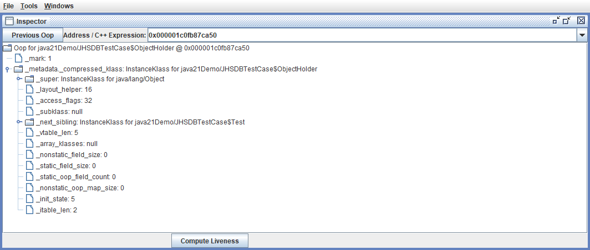
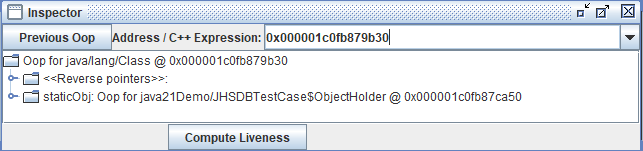
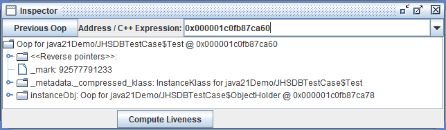
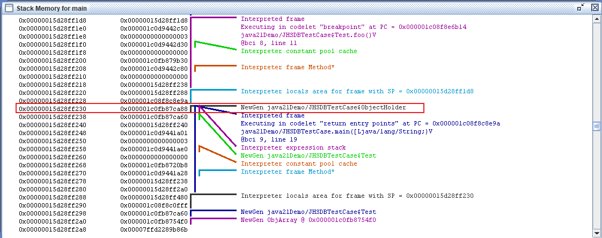
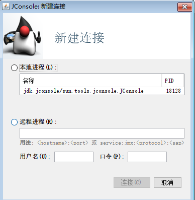
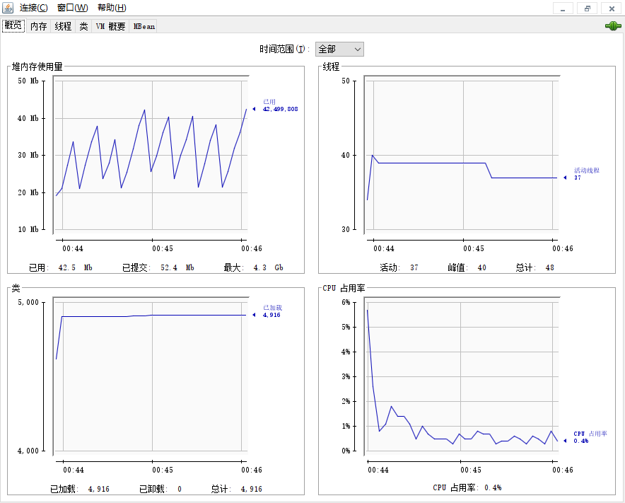

# 第05章_虚拟机性能监控、故障处理工具

## 5.1 基础故障处理工具

JDK bin 目录下存放着各种小工具，根据软件可用性和授权的不同，可以将它们划分为三类：

1. 商业授权工具：主要是 JMC（Java Mission Control）及他要使用到的 JFR（Java Flight Recorder），JMC 这个原本来自于 JRockit 的运维监控套件从 JDK7 Update 40 开始就被集成到 OracleJDK 中，JDK 11 之前都无需独立下载，但是在商业环境中使用它则是要付费的。

2. 正式支持工具：这类工具属于被长期支持的工具，不同平台、不同版本的 JDK 之间可能略有差异。

3. 实验性工具：这一类工具在使用说明中被声明为"没有技术支持，并且是实现性质的"产品，日后可能转正，也可能会在某个 JDK 版本中被移除。

这些工具往往体积都异常小，因为它们仅仅是一层薄包装而已，真正的功能代码是实现在 JDK 的工具类库中。因为当应用程序部署到生产环境后，无论是人工物理接触到服务器还是远程 Telnet 到服务器上都可能会受到限制。而借助这些工具类库中的接口和实现代码，开发者就可以选择直接在应用程序中提供功能强大的监控分析功能。

### 1.jps：虚拟机进程状况工具

JVM Process Status Tool，它的功能类似于 UNIX 的`ps`命令：可以列出正在运行的虚拟机进程，并显示虚拟机执行主类（Main Class）名称以及这些进程的**本地虚拟机唯一 ID**（LVMID，Local Virtual Machine Identifier）。其他的 JDK 工具大多需要输入`jps`命令查询到的 LVMID 来确定要监控的是哪一个虚拟机进程。对于本地虚拟机进程来说，LVMID 与操作系统的进程 ID（PID，ProcessIdentifier）是一致的，使用 Windows 的任务管理器或者 UNIX 的`ps`命令可以查询到虚拟机进程的 LVMID，但如果同时启动了多个虚拟机进程，无法根据进程名称定位时，就必须依赖`jps`命令。

`jps`命令格式：

```bash
jps [options] [hostid]
```

执行示例：

```bash
$ jps -l
11508 /config/extensions/redhat.java-1.24.0-linux-x64/server/plugins/org.eclipse.equinox.launcher_1.6.500.v20230717-2134.jar
1927 sun.tools.jps.Jps
```

`jps`还可以通过 RMI 协议查询开启了 RMI 服务的远程虚拟机进程状态，参考 hostid 为 RMI 注册表中注册的主机名。`jps`的其他常用选项如下表所示。

|选项|作用|
|--|--|
|`-q`|只输出 LVMID，省略主类的名称|
|`-m`|输出虚拟机进程启动时传递给主类函数`main()`的参数|
|`-l`|输出主类的全名，如果进程执行的是 JAR 包，则输出 JAR 路径|
|`-v`|输出虚拟机进程启动时的 JVM 参数|

### 2.jstat：虚拟机统计信息监视工具

JVM Statistics Monitoring Tool，用于监视虚拟机各种运行状态信息的命令行工具。可以显示本地或远程（需要远程主机提供 RMI 支持，JDK 中提供了`jstatd`工具用于建立远程 RMI 服务器）虚拟机进程中的类加载、内存、垃圾收集、即时编译等运行时数据，它是运行期定位虚拟机性能问题的常用工具。

`jstat`命令格式：

```bash
jstat [option vmid [interval[[s|ms] [count]]]]
```

如果是本地虚拟机进程则 VMID 与 LVMID 是一致的。如果是远程虚拟机进程，则 VMID 的格式为：

```bash
[protocol:][//]lvmid[@hostname[:port]/servername]
```

参数`interval`和`count`代表查询间隔和次数，如果省略这 2 个参数表示只查询一次。假设需要每 250 毫秒查询一次进程 2764 垃圾收集状况，一共查询 20 次，则命令为：

```java
jstat -gc 2764 250 20
```

选项`option`代表用户希望查询的虚拟机信息，主要分为三类：类加载、垃圾收集、运行期编译状况。主要选项如下表所示：

|选项|作用|
|--|--|
|`-class`|监视类加载、载数量、总空间以及类装载所耗费的时间|
|`-gc`|监视 Java 堆状况，包括 Eden 区、2 个 Survivor 区、老年代、永久代（或元空间）等的容量，已用空间，垃圾收集时间合计等信息|
|`-gccapacity`|监视内容与`-gc`基本相同，但输出主要关注 Java 堆各个区域使用到的最大、最小空间|
|`-gcutil`|监视内容与`-gc`基本相同，但输出主要关注已使用空间占总空间的百分比|
|`-gccause`|与`-gcutil`功能一样，但会额外输出导致上一次垃圾收集产生的原因|
|`-gcnew`|监视新生代垃圾收集状况|
|`-gcnewcapacity`|监视内容与`-gcnew`基本相同，输出主要关注使用到的最大、最小空间|
|`-gcold`|监视老年代垃圾收集状况|
|`-gcoldcapacity`|监视内容与`-gcold`基本相同，输出主要关注使用到的最大、最小空间|
|`-gcpermcapacity`|输出永久代使用到的最大、最小空间|
|`-gcmetacapacity`|输出元空间使用到的最大、最小空间|
|`-compiler`|输出即时编译器编译过的方法、耗时等信息|
|`-printcompilation`|输出已经被即时编译的方法|

使用`-gcutil`的实例如下：

```bash
$ jstat -gcutil 11508
  S0     S1     E      O      M     CCS    YGC     YGCT    FGC    FGCT     GCT   
 12.50   0.00  90.11  60.42  98.62  93.96    280    1.967    15    2.471    4.438
```

结果表明：这台服务器的新生代 Eden 区（E）使用了 90.11% 的空间，2个 Survivor 区（S0、S1）分别使用了 12.5%、0% 的空间，老年代（O）和元空间（M）则分别使用了 60.42%、98.62% 的空间。程序运行以来共发生 Minor GC（YGC）280 次，总耗时 1.967 秒；发生 Full GC（FGC）15 次，总耗时 2.471 秒；所有 GC 总耗时为 4.438 秒。

使用`jstat`工具在纯文本状态下监视虚拟机状态的变化，在用户体验上也许不如后面提到的`JMC`、`VisualVM`等可视化的监视工具。但在实际生产环境中不一定可以使用图形界面，直接在控制台中使用`jstat`命令依然是一种常用的监控方式。

### 3.jinfo：Java配置信息工具

Configuration Info for Java，作用是实时查看和调整虚拟机各项参数。使用`jps`命令的`-v`参数可以查看虚拟机启动时显示指定的参数列表，但如果想知道未被显示指定的参数的系统默认值，除了查找资料就只能使用`jinfo`的`-flag`选项进行查询（对于 JDK 6 及以上的版本，还可以使用`java -XX:+PrintFlagsFinal`查看参数默认值）。`jinfo`还可以使用`-sysprops`选项把虚拟机进程的`System.getProperties()`的内容打印出来。

这个命令在 JDK 5 时随着 Linux 版的 JDK 发布，当时只提供了查询功能，在 JDK 6 之后，Windows 和 Linux 平台都有提供，并且加入了在运行期修改部分参数值的能力（可以使用`-flag[+|-]name`或者`-flag name=value`在运行期修改一部分运行期可写的虚拟机参数值）
。在 JDK 6 中，`jinfo`对于 Windows 平台仍然只提供了最基本的`-flag`选项。

`jinfo`命令格式：

```bash
jinfo [option] pid
```

执行示例：

```bash
$ jinfo -flag UseTLAB 11508
-XX:+UseTLAB
```

### 4.jmap：Java内存映像工具

Memory Map for Java，用于生成堆转储快照（称为 heapdump 或 dump 文件）。除了`jmap`命令还有一些其他手段：如`-XX:+HeapDumpOnOutOfMemoryError`参数，可以让虚拟机在内存溢出异常出现后自动生成堆转储快照文件；通过`-XX:+HeapDumpOnCtrlBreak`可以让虚拟机在接收到中断信号（ctrl+break）时生成堆转储快照文件；或者在 Linux 系统下通过`Kill -3`命令发送进程退出信号"恐吓"一下虚拟机也能顺利拿到堆转储快照。

`jmap`的作用不仅仅是为了获取堆转储快照，它还可以查询`finalize`执行队列、Java 堆和方法去的详细信息，如空间使用率、当前用的是哪种收集器等。

和`jinfo`命令一样，`jmap`有部分功能在 Windows 平台下受限，除了生成堆转储快照的`-dump`选项和用于查看每个类的实例、空间占用统计的`-histo`选项在所有操作系统中都可以使用之外，其余选项都只能在 Linux/Solaris 中使用。

`jmap`命令格式：

```bash
jmap [option] vmid
```

`option`选项的可选值如下表所示。

|选项|作用|
|--|--|
|`-dump`|生成 Java 堆转储快照。格式为`-dump:[live,]format=b,file=<filename>`，其中`live`子参数说明是否只 dump 出存活的对象|
|`-finalizerinfo`|显示在 F-Queue 中等待 Finalizer 线程执行 finalize 方法的对象。只在 Linux/Solaris 平台下有效|
|`-heap`|显示 Java 堆详细信息，如使用哪种收集器、参数配置、分代状况等。只在 Linux/Solaris 平台下有效|
|`-histo`|显示堆中对象统计信息，包括类、实例数量、合计容量|
|`-clstats`|显示类加载器统计信息|
|`-F`|当虚拟机进程对`-dump`选项没有响应时，可使用这个选项强制生成 dump 快照。只在 Linux/Solaris 平台下有效|

下述代码是使用`jmap`生成一个堆转储快照文件的例子，例子中的 15180 是通过`jps`命令查询到的 LVMID：

```bash
$ jmap -dump:format=b,file=dump.bin 15180

Dumping heap to ...\dump.bin ...

Heap dump file created
```

### 5.jhat：虚拟机堆转储快照分析工具

JVM Heap Analysis Tools，与`jmap`搭配使用来分析堆转储快照。`jhat`内置了一个微型的 HTTP/Web 服务器，可以在浏览器中查看分析结果。不过在实际工作中基本不会使用`jhat`来分析堆转储快照文件。因为分析很消耗资源，一般不会在部署应用程序的服务器上执行，既然要在其他机器上执行就没有必要受到命令行工具的限制了。同时`jhat`的分析功能相对简陋，后面提到的 VisualVM、Eclipse Memory Analyzer、IBM HeapAnalyzer（用于分析 IBM J9 生成的映像文件，各个虚拟机生成的映像文件格式不一致，分析工具无法通用）等工具，都能实现比`jhat`更强大的分析功能。

使用`jhat`分析 dump 的示例：

```bash
jhat dump.bin
```

执行后可以打开`http://localhost:7000`可以看到分析结果。分析结果默认以包为单位进行分组显示，分析内存泄漏问题主要会使用到其中的 "Heap Histogram"（与`jmap -histo`功能一致）与 QQL 页签的功能，前者可以找到内存中总容量最大的对象，后者是标准的对象查询语言，使用类似 SQL 的语法对内存中的对象进行查询统计。

### 6.jstack：Java堆栈跟踪工具

Stack Trace for Java，用于生成虚拟机当前时刻的线程快照（称为 threaddump 或者 javacore 文件）。线程快照是当前虚拟机内每一条线程正在执行的方法堆栈的集合，生成线程快照的目的通常是**定位线程出现长时间停顿的原因**，如线程间死锁、死循环、请求外部资源导致的长时间挂起等。线程出现停顿时通过`jstack`来查看各个线程的调用堆栈，就可以获知没有响应的线程在后台做些什么事情，或者等待着什么资源。

`jstack`命令格式为：

```bash
jstack [option] vmid
```

可选参数值如下：

|选项|作用|
|--|--|
|`-F`|当正常输出的请求不被响应时，强制输出线程堆栈|
|`-l`|除堆栈外，显示关于锁的附加信息|
|`-m`|如果调用到本地方法的话，可以显示 C/C++ 的堆栈|

从 JDK 5 起，`java.lang.Thread`类新增了`getAllStackTraces()`方法用于获取虚拟机中所有线程的 StackTraceElement 对象。使用这个方法可以通过简单几行代码完成`jstack`的大部分功能，实际项目中可以利用这个方法做个管理员页面来查看线程堆栈信息：

```jsp
<%@ page import="java.util.map"%>

<html>
    <head>
        <title>服务器线程信息</title>
    </head>
    <body>
        <pre>
            <%
                for (Map.Entry<Thread, StackTraceElement[]> stackTrace : Thread.getAllStackTraces().entrySet()) {
                    Thread thread = (Thread) stackTrace.getKey();
                    StackTraceElement[] stack = (StackTraceElement[]) stackTrace.getValue();
                    
                    if (thread.equals(Thread.currentThread()))
                    continue;

                    out.print("\n线程：" + thread.getName() + "\n");

                    for (StackTraceElement element : stack) {
                        out.print("\t" + element + "\n");
                    }
                }
            %>
        </pre>
    </body>
```

### 7.总结

**基础工具**

用于支持基本的程序创建和运行。

|名称|作用|
|--|--|
|`appletviewer`|在不使用 Web 浏览器的情况下运行和调试 Applet，JDK 11 中被移除|
|`extcheck`|检查 JAR 冲突的工具，JDK 9 中被移除|
|`jar`|创建和管理 JAR 文件|
|`java`|Java 运行工具，用于运行 Class 文件或 JAR 文件|
|`javac`|用于 Java 编程语言的编译器|
|`javadoc`|Java 的 API 文档生成器|
|`javah`|C 语言头文件和 Stub 函数生成器，用于编写 JNI 方法|
|`javap`|Java 字节码分析工具|
|`jlink`|将 Module 和它的依赖打包成一个运行时镜像文件|
|`jdb`|基于 JPDA 协议的调试器，以类似于 GDB 的方式进行调试 Java 代码|
|`jdeps`|Java 类依赖性分析器|
|`jdeprscan`|用于搜索 JAR 包中使用了 "deprecated" 的类，从 JDK 9 开始提供|

**安全工具**

用于程序签名、设置安全测试等。

|名称|作用|
|--|--|
|`keytool`|管理密钥库和证书。主要用于获取或缓存 Kerberos 协议的授权票据。允许用户查看本地凭据缓存和密钥表中的条目|
|`jarsigner`|生成并验证 JAR 签名|
|`policytool`|管理策略文件的 GUI 工具，用于管理用户策略文件（.java.policy），在 JDK 10 中被移除|

**国际化工具**

用于创建本地语言文件。

|名称|作用|
|--|--|
|`native2ascii`|本地编码到 ASCII 编码的转换器，用于"任意受支持的字符编码"和与之对应的"ASCII 编码和 Unicode 转译"之间的相互转换|

**远程方法调用工具**

用于跨 Web 或网络的服务交互。

|名称|作用|
|--|--|
|`-rmic`|Java RMI 编译器，为使用 JRMP 或 IIOP 协议的远程对象生成 Stub、Skeleton 和 Tie 类，也用于生成 OMG IDL|
|`rmiregistry`|远程对象注册表服务，用于在当前主机的指定端口上船创建并启动一个远程对象注册表|
|`rmid`|启动激活系统守护进程，允许在虚拟机中注册或激活对象|
|`serialver`|生成并返回指定类的序列化版本 ID|

**Java UDL 与 RMI-IIOP**

在 JDK 11 中结束了十余年的 CORBA 支持，这些工具不再提供。

|名称|作用|
|--|--|
|`tnameserv`|提供对命名服务的访问|
|`idlj`|IDL 转 Java 编译器，生成映射 IMG IDL 接口的 Java 源文件，并启用以 Java 编程语言编写的使用 CORBA 功能的应用程序的 Java 源文件。IDL 意即接口定义语言（Interface Definition Language）|
|`orbd`|对象请求代理守护进程（Object Request Broker Daemon），提供从客户端查找和调用 CORBA 环境服务端上的持久化对象的功能。使用 ORBD 代理瞬态命名服务 tnameserv。ORBD 包括瞬态命名服务和持久命名服务。ORBD 工具集成了服务器管理器、互操作命名服务和引导名称服务器的功能。当客户端想进行服务器定位、注册和激活功能时，可以与 servertool 一起使用|
|`servertool`|为应用程序注册、注销、启动和关闭服务器提供易用的接口|

**部署工具**

用于程序打包、发布和部署。

|名称|作用|
|--|--|
|`javapackager`|打包、签名 Java 和 JavaFX 应用程序，在 JDK 11 中被移除|
|`pack200`|使用 Java GZIP 压缩器将 JAR 文件转换为压缩的 Pack00 文件。压缩的压缩文件是高度压缩的 JAR，可以直接部署，节省带宽并减少下载时间|
|`unpack200`|将 Pack200 生成的打包文件解压提取为 JAR 文件|

**Java Web Start**

|名称|作用|
|--|--|
|`javaws`|启动 Java Web Start 并设置各种选项的工具，Java 11 中被移除|

**性能监控和故障处理工具**

用于监控分析 Java 虚拟机运行信息，排查问题。

|名称|作用|
|--|--|
|`jps`|JVM Process Status Tool，显示指定系统内所有的 HotSpot 虚拟机进程|
|`jstat`|JVM Statistics Monitoring Tool，用于收集 HotSpot 虚拟机各方面的运行数据|
|`jstatd`|JVM Statistics Monitoring Tool Daemon，`jstat`的守护进程，启动一个 RMI 服务器应用程序，用于监视测试的 HotSpot 虚拟机的创建和终止，并提供一个界面，允许远程监控工具附加到在本地系统上运行的虚拟机。在 JDK 9 中集成到了`JHSDB`中|
|`jinfo`|Configuration Info for Java，显示虚拟机配置信息。在 JDK 9 中集成到了`JHSDB`中|
|`jmap`|Memory Map for Java，生成虚拟机的内存转储快照（heapdump 文件），在 JDK 9 中集成到了`JHSDB`中|
|`jhat`|JVM Heap Analysis Tool，用于分析堆转储快照，会建立一个 HTTP/Web 服务器，可以在浏览器上查看分析结果。在 JDK 9 中被`JHSDB`代替|
|`jstack`|Stack Trace for Java，显示虚拟机的线程快照。在 JDK 9 中集成到了`JHSDB`中|
|`jhsdb`|Java HotSpot Debugger，一个基于 Serviceability Agent 的 HotSpot 进程调试器，从 JDK 9 开始提供|
|`jsadebugd`|Java Serviceability Agent Debug Daemon，适用于 Java 的可维护性代理调试守护程序，主要用于附加到指定的 Java 进程、核心文件，或充当一个调试服务器|
|`jcmd`|JVM Command，虚拟机诊断命令工具，将诊断命令请求发送到正在运行的 Java 虚拟机。从 JDK 7 开始提供|
|`jconsole`|Java Console，用于监控 Java 虚拟机的使用 JMX 规范的图形工具。可以监控本地和远程 Java 虚拟机，还可以监控和管理应用程序|
|`jmc`|Java Mission Control，包含用于监控和管理 Java 应用程序的工具，而不会引入与这些工具相关联的性能开销。开发者可以使用`jmc`命令来创建 JMC 工具，从 JDK 7 Update 40 开始集成到 OracleJDK 中|
|`jvisualmv`|Java VisualVM，一种图形化工具，可在 Java 虚拟机中运行时提供有关基于 Java 技术的应用程序的详细信息。Java VIsualVM 提供内存和 CPU 分析、堆转储分析、内存泄漏检测、MBean 访问和垃圾收集。从 JDK 6 Update 7 开始提供；从 JDK 9 开始不再打包入 JDK 中，但仍保持更新发展，可独立下载|

**WebService 工具**

与 CORBA 一起在 JDK 11 中被移除。

|名称|作用|
|--|--|
|`schemagen`|用于 XML 绑定的 Schema 生成器，用于生成 XML Schema 文件|
|`wsgen`|XML Web Service 2.0 的 Java API，生成用于 JAX-WS Web Service 的 JAX-WS 便携式产物|
|`wsimport`|XML Web Service 2.0 的 Java API，主要用于根据服务端发布的 WSDL 文件生成客户端|
|`xjc`|主要用户根据 XML Schema 文件生成对应的 Java 类|

**REPL 和脚本工具**

|名称|作用|
|--|--|
|`jshell`|基于 Java 的 Shell REPL 交互工具|
|`jjs`|对 Nashorn 引擎的调用入口。Nashorn 是基于 Java 实现的一个轻量级高性能 JavaScript 运行环境|
|`jrunscript`|Java 命令行脚本外壳工具，主要用于解释执行 JavaScript、Groovy、Ruby 等脚本语言|

## 5.2 可视化故障处理工具

JDK 中还提供了几个功能集成度更高的可视化工具，这类工具主要包括 **JConsole**、**JHSDB**、**VisualVM** 和 **JMC** 四个。其中 JConsole 是早在 JDK 5 时就已经存在的虚拟机监控工具，而 JHSDB 虽然名义上是 JDK 9 中才正式提供，但之前已经以`jdi.jar`包里的 **HSDB**（可视化工具）和 **CLHSDB**（命令行工具）的形式存在了很长一段时间。

VisualVM 在 JDK 6 Update 7 中首次发布，直到 JRockit Mission Control 与 OracleJDK 的融合工作完成之前，它都曾是 Oracle 主力推动的多合一故障处理工具，现在它已经从 OracleJDK 中分离出来，成为一个独立发展的开源项目。VisualVM 已不是 JDK 中的正式成员，但仍可以免费下载使用。

Java Mission Control 曾是来自 BEA 公司的图形化诊断工具，随着 BEA 公司被 Oracle 收购，它便被融合进 OracleJDK 中。在 JDK 7 Update 40 时随 JDK 一起发布，后来 Java SE Advanced 产品线建立，Oracle 明确区分了 OracleJDK 和 OpenJDK 的差别，JMC 从 JDK 11 开始又被移除出 JDK。虽然在 2018 年 Oracle 将 JMC 开源并交付给 OpenJDK 组织进行管理，但 JMC 仍需要和 HtoSpot 内部的"飞行记录仪"（Java Flight Recorder，JFR）配合才能工作，而在 JDK 11 之前，JFR 的开启必须解锁 OracleJDK 的商业特性支持（使用 JCMD 的`VM.unlock_commercial_features`或启动时加入`-XX:+UnlocalCommercialFeatures`参数），所以这项功能在生产环境中仍然需要**付费**才能使用。

### 1.JHSDB：基于服务性代理的调试工具

JDK 中提供了 JCMD 和 JHSDB 两个集成式的多功能工具箱，它们整合了上一节介绍到的所有基础工具提供的专项功能，下表是 JCMD、JHSDB 与原基础工具实现相同功能的简要对比。

|基础工具|JCMD|JHSDB|
|--|--|--|
|`jps -lm`|`jcmd`|N/A|
|`jmap -dump <pid>`|`jcmd <pid> GC.heap_dump`|`jhsdb jmap --binaryheap`|
|`jamp -histo <pid>`|`jcmd <pid> GC.class_histogram`|`jhsdb jmap --histo`|
|`jstack <pid>`|`jcmd <pid> Thread.print`|`jhsdb jstack --locals`|
|`jinfo -sysprops <pid>`|`jcmd <pid> VM.system_properties`|`jhsdb jinfo --sysprops`|
|`jinfo -flags <pid>`|`jcmd <pid> VM.flags`|`jhsdb jinfo --flags`|

JHSDB 是一款基于服务性代理（Serviceability Agent，SA）实现的进程外调试工具。服务性代理是 HotSpot 虚拟机中一组用于映射 Java 虚拟机运行信息的、主要基于 Java 语言（含少量 JNI 代码）实现的 API 集合。服务性代理以 HotSpot 内部的数据结构为参照物进行设计，把这些 C++ 的数据抽象出 Java 模型对象，相当于 HotSpot 的 C++ 代码的一个镜像。通过服务性代理的 API 可以在一个独立的 Java 虚拟机的进程里分析其他 HotSpot 虚拟机的内部数据，或者从 HotSpot 虚拟机进程内存中 dump 出来的转储快照里还原出它的运行状态细节。

下面通过 JHSDB 来分析一下以下代码中的`staticObj`、`instanceObj`、`localObj`这三个变量本身（不是它们指向的对象）存放在哪里。

```java
public class JHSDBTestCase {

    static class Test {
        static ObjectHolder staticObj = new ObjectHolder();
        ObjectHolder instanceObj = new ObjectHolder();

        void foo() {
            ObjectHolder localObj = new ObjectHolder();
            System.out.println("done"); // 这里打上断点
        }
    }

    private static class ObjectHolder {}

    public static void main(String[] args) {
        Test test = new JHSDBTestCase.Test();
        test.foo();
    }
}
```

答案显而易见：`staticObj`随着 Test 的类型信息存放在方法区，`instanceObj`随着 Test 对象实例存放在 Java 堆，`localObject`则是存放在`foo()`方法栈帧的局部变量表中。下面通过 JHSDB 来实践验证。

首先在打印语句上加上断点，然后在 debug 模式下运行。由于 JHSDB 本身对压缩指针的支持存在很多缺陷，建议 64 位系统下禁用压缩指针，另外为了后续操作时可以加快在内存中搜索对象的速度，建议限制下 Java 堆的大小：

```bash
-Xmx10M -XX:+UseSerialGC -XX:-UseCompressedOops
```

程序执行后先通过`jps`查询到测试程序的进程 ID：

```bash
$ jps -l
17940 java21Demo/java21Demo.JHSDBTestCase
11128 Eclipse
17916 jdk.jcmd/sun.tools.jps.Jps
```

使用以下命令进入 JHSDB 的图形化模式（JDK 9 及之后版本）：

```bash
$ jhsdb hsdb --pid 17940
```

由代码可知，运行至断点位置一共会创建三个`ObjectHolder`对象的实例，该实例必然会在 Java 堆中分配，因此我们可以先从堆中将这三个对象找到，然后再查找引用指针存放的位置。

首先点击菜单中的`Tools-Heap Parameters`（效果与`universe`命令是等价的，JHSDB 的图形界面中的所有操作都可以通过命令行完成）。结果如下图所示，可以看到典型的 Serial 的分代内存布局，Heap Parameters 窗口中列出了新生代的 Eden、S1、S2 和老年代的容量（单位为字节）以及它们的虚拟内存地址起止范围。

```bash
Heap Parameters:
Gen 0:   eden [0x000001c0fb800000,0x000001c0fb888a68,0x000001c0fbab0000) space capacity = 2818048, 19.8619753815407 used
  from [0x000001c0fbab0000,0x000001c0fbb00000,0x000001c0fbb00000) space capacity = 327680, 100.0 used
  to   [0x000001c0fbb00000,0x000001c0fbb00000,0x000001c0fbb50000) space capacity = 327680, 0.0 usedInvocations: 2

Gen 1:   old  [0x000001c0fbb50000,0x000001c0fbd2dea0,0x000001c0fc200000) space capacity = 7012352, 27.915541033878505 usedInvocations: 
```

或者在命令行运行：

```bash
$ jhsdb clhsdb --pid 17940
Attaching to process 17940, please wait...

hsdb> universe
Heap Parameters:
Gen 0:   eden [0x000001c0fb800000,0x000001c0fb888a68,0x000001c0fbab0000) space capacity = 2818048, 19.8619753815407 used
  from [0x000001c0fbab0000,0x000001c0fbb00000,0x000001c0fbb00000) space capacity = 327680, 100.0 used
  to   [0x000001c0fbb00000,0x000001c0fbb00000,0x000001c0fbb50000) space capacity = 327680, 0.0 usedInvocations: 2

Gen 1:   old  [0x000001c0fbb50000,0x000001c0fbd2dea0,0x000001c0fc200000) space capacity = 7012352, 27.915541033878505 usedInvocations: 0
```

打开`Windows->Console`窗口，使用`scanoops`命令在 Java 堆的新生代（从 Eden 起始地址到 To Survivor 结束地址）范围内查找`ObjectHolder`的实例，结果如下所示：

```bash
hsdb> scanoops 0x000001c0fb800000 0x000001c0fbb50000 java21Demo.JHSDBTestCase$ObjectHolder
0x000001c0fb87ca50 java21Demo/JHSDBTestCase$ObjectHolder
0x000001c0fb87ca78 java21Demo/JHSDBTestCase$ObjectHolder
0x000001c0fb87ca88 java21Demo/JHSDBTestCase$ObjectHolder
```

果然找出了三个实例的地址，而且它们的地址都落到了 Eden 的范围之内。再使用`Tools->Inspector`功能确认一下这三个地址中存放的对象。



`Inspector`为我们展示了对象头和指向对象元数据的指针，里面包括了 Java 类型的名字、继承关系、实现接口关系，字段信息、方法信息、运行时常量池的指针、内嵌的虚方法表（vtable）以及接口方法表（itable）等。由于我们的确没有在 ObjectHolder 上定义过任何字段，所以图中并没有看到任何实例字段数据。

接下来要根据堆中对象实例地址找出引用它们的指针，JHSDB 的`Tools`菜单中有`Compute Reverse Ptrs`来完成这个功能，使用命令`revptrs`来做也很简单，先拿第一个对象来试试看：

```bash
hsdb> revptrs 0x000001c0fb87ca50
null
Oop for java/lang/Class @ 0x000001c0fb879b30
```

是在一个`java.lang.Class`的实例里，并且给出了这个实例的地址，通过`Inspector`查看该对象实例，可以清楚看到这确实是一个`java.lang.Class`类型的对象实例，里面有一个名为`staticObj`的实例字段。



从《Java虚拟机规范》所定义的概念模型来看，所有 Class 相关的信息都应该存放在方法区之中，但方法区该如何实现，《Java虚拟机规范》并未做出规定。JDK 7 及其以后版本的 HotSpot 虚拟机选择把静态变量与类型存储于 Java 堆之中，从我们的实验中也明确验证了这一点。在 JDK 7 以前，即还没有开始“去永久代”行动时，这些静态变量是存放在永久代上的，JDK 7 起把静态变量、字符常量这些从永久代移除出去。

接下来继续查找第二个对象实例：

```bash
hsdb> revptrs 0x000001c0fb87ca78
Oop for java21Demo/JHSDBTestCase$Test @ 0x000001c0fb87ca60
```

这次找到一个类型为 JHSDB_TestCase$Test 的对象实例，在`Inspector`中该对象实例显示如图所示。



这个结果完全符合我们的预期，第二个 ObjectHolder 的指针是在 Java 堆中 JHSDB_TestCase$Test 对象的 instanceObj 字段上。但是我们采用相同方法查找第三个 ObjectHolder 实例时，JHSDB 返回了一个 null，表示未查找到任何结果：

```bash
hsdb> revptrs 0x000001c0fb87ca88
null
```

`revptrs`命令并不支持查找栈上的指针引用，不过我们人工也可以来完成这件事情。在`Java Thread`窗口选中 main 线程后点击`Stack Memory`按钮查看该线程的栈内存。



通过肉眼观察在地址 0x000000015d28ff230 上的值正好就是 0x000001c0fb87ca88，而且`JHSDB`在旁边已经自动生成注释，说明这里确实是引用了一个来自新生代的 JHSDB_TestCase$ObjectHolder 对象。

### 2.JConsole：Java监视与管理控制台

JConsole（Java Monitoring and Management Console）是一款基于 JMX（Java Manage-ment Extensions）的可视化监视、管理工具。它的主要功能是通过 JMX 的 MBean（Managed Bean）对系统进行信息收集和参数动态调整。JMX 是一种开放性的技术，不仅可以用在虚拟机本身的管理上，还可以运行于虚拟机之上的软件中。虚拟机对 JMX MBean 的访问也是完全开放的，可以使用代码调用 API、支持 JMX 协议的管理控制台，或者其他符合 JMX 规范的软件进行访问。

#### 2.1 启动Jconsole

通过 JDK/bin 目录下的 jconsole.exe 启动 JCon-sole 后，会自动搜索出本机运行的所有虚拟机进程，而不需要用户自己使用`jps`来查询。双击选择其中一个进程便可进入主界面开始监控。JMX 支持跨服务器的管理，也可以使用下面的“远程进程”功能来连接远程服务器，对远程虚拟机进行监控。



双击任意一个进程进入 JConsole 主界面，可以看到主界面里共包括概述、内存、线程、类、VM 摘要、MBean 六个页签。



**概述**页签里显示的是整个虚拟机主要运行数据的概览信息，包括堆内存使用情况、线程、类、CPU 使用情况四项信息的曲线图，这些曲线图是后面**内存**、**线程**、**类**页签的信息汇总。

#### 2.2 内存监控


### 3.VisualVM：多合-故障处理工具

### 4.JMC：可持续在线的监控工具

## 5.3 HotSpot虚拟机插件及工具
