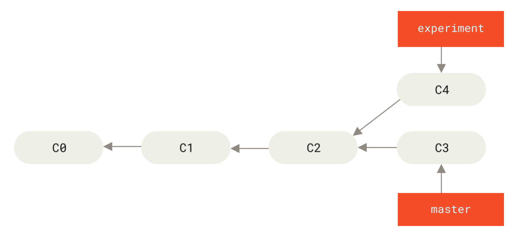
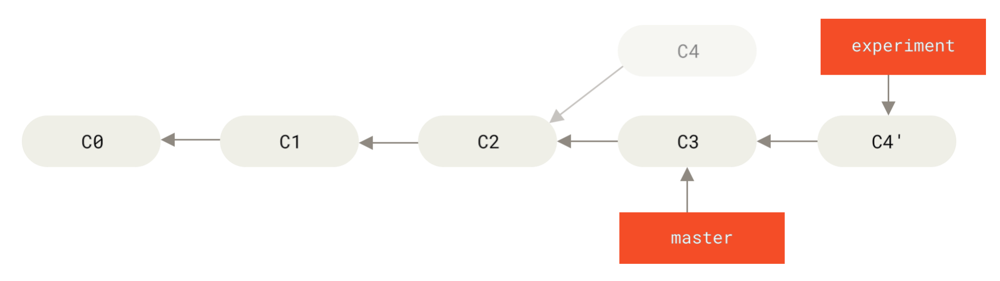
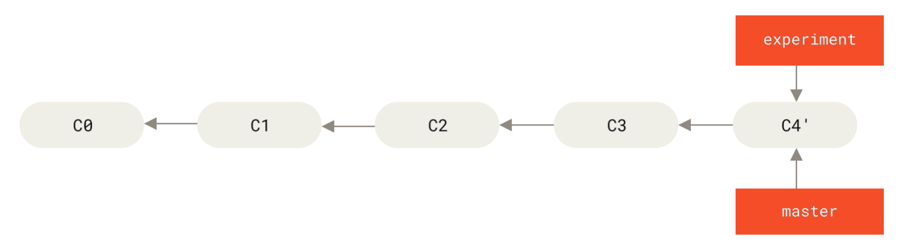
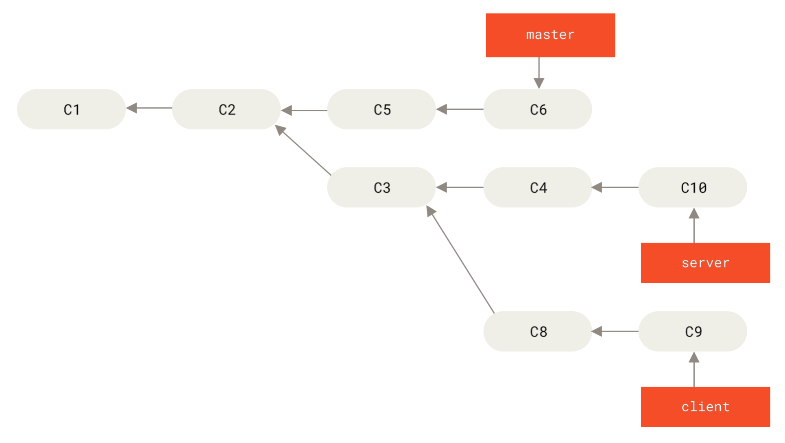
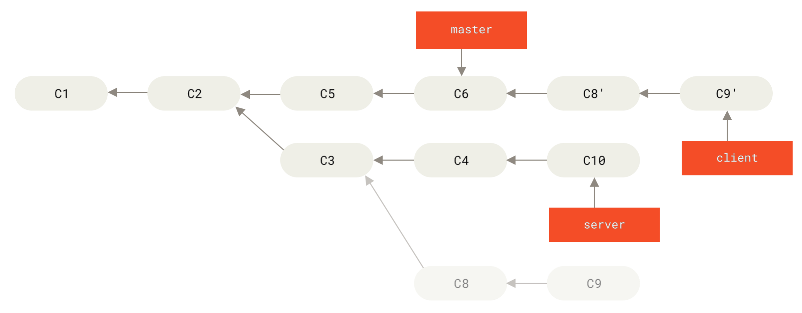
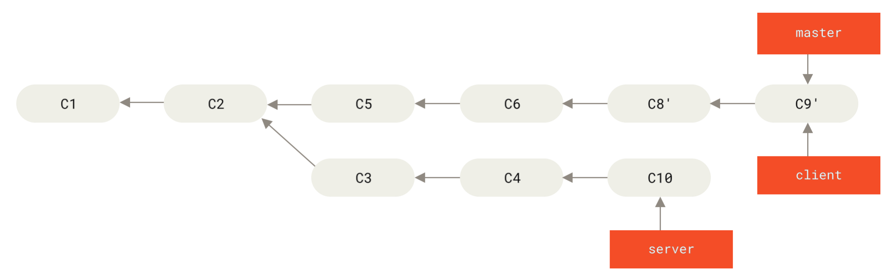
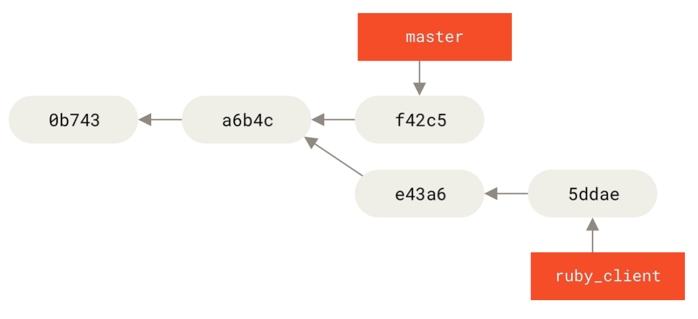

# 常用命令

## 1.基本流程

```bash
# 初始化
$ git init
# 添加所有文件到暂存区
$ git add .
# 提交到本地仓库
$ git commit -m "first commit"
# 添加（已追踪的变更的文件）并提交
$ git commit -am "first commit"

# 创建分支（在当前所在的提交对象上创建一个指针）
$ git branch testing
# 分支切换
$ git checkout testing
# 创建并切换分支
$ git checkout -b testing
# 重命名当前分支
$ git branch -M main
# 删除分支
$ git branch -d main

# 克隆远程仓库（会自动生成项目目录及 .git 文件夹）
$ git clone https://github.com/libgit2/libgit2 [自定义本地仓库名称]
# 添加远程仓库
$ git remote add origin git@github.com:Famezyy/recipes.git
# 查看远程仓库
$ git remote show origin
# 修改远程仓库
$ git remote origin set-url [url]
# 清理远程仓库缓存
$ git remote prune origin
# 删除远程仓库
$ git remote rm origin

# 获得所有远程分支
$ git fetch origin
$ git branch -a

# 创建本地分支并跟踪远程分支
$ git checkout -b serverfix origin/serverfix
# or $ git checkout --track origin/serverfix
# or $ git checkout serverfix
# 修改正在跟踪的上游分支
$ git branch --set-upstream-to origin/serverfix
# or $ git branch -u origin/serverfix


# 合并远程分支到当前本地分支
$ git merge origin/originBranch
$ git merge origin/originBranch --allow-unrelated-histories
# 拉取分支到本地
$ git pull origin originBranch

# 将本地分支推送到远程分支
$ git push origin localBranch:originBranch
# 将本地的 main 分支推送到 origin 主机，同时指定 origin 为默认主机，后面就可以不加任何参数使用 git push 了
$ git push -u origin main
# 将本地的 main 分支与远程仓库的 main 分支关联（若远程仓库不存在 main 分支则会失败，推荐使用上面的指令）
$ git branch --set-upstream-to=origin/originBranch main
# 若本地分支与远程分支名不相同，则需要修改默认规则，否则push报错
$ git config push.default upstream
```

## 2.常用场景

### 推送HEAD到远程仓库

```bash
# refs/heads：不需要 code review
git push origin HEAD:refs/heads/master

# refs/for：提交代码到服务器之后是需要经过 code review 之后才能进行 merge 的
git push origin HEAD:refs/for/master
```

### 记住https的用户名和密码

```bash
# 缓存 15 分钟

# 永久存储
git config --global credential.helper store
git config --global user.name "用户名"
git config --global user.password "password"
git config --global user.email "邮箱"

# 删除时除了 global 记得删除下面的
git config --system -unset credential.helper
```

### 合并（merge）

#### 解决冲突

```bash
# 取消合并，恢复到你运行合并前的状态
$ git merge --abort

# 忽略空白
# git merge -Xignore-all-space
$ git merge -Xignore-space-change whitespace

# 指定冲突发生时默认使用我们的内容
$ git merge -Xours mundo
# 进行一次假的合并
$ git merge -s ours mundo

# 重新恢复到冲突时候的文件状态
$ git checkout --conflict=merge hello.rb
```

#### 手动修改文件再合并

```bash
# 从冲突中分离出共同的地方
$ git show :1:hello.rb > hello.common.rb
# 从冲突中分离出我们的地方
$ git show :2:hello.rb > hello.ours.rb
# 从冲突中分离出对方的地方
$ git show :3:hello.rb > hello.theirs.rb
# 对于以上命令也可使用 ls-files -u 一行来生成

#修复问题后
$ git merge-file -p hello.ours.rb hello.common.rb hello.theirs.rb > hello.rb

# 清理创建的额外文件
$ git clean -f
```

#### 比较不同

```bash
# 在合并前比较结果与在你的分支上的内容
$ git diff --ours
# 在合并前比较结果与在对方的分支上的内容
git diff --theirs
# 查看文件在两边是如何改动的
git diff --base
```

#### 撤销合并

```bash
# reset 到前一个提交
$ git reset --hard HEAD~
# 撤消一个已存在提交的所有修改
```

##### revert


```bash
# -m 1：合并进入的父提交 C6，-m 2：被用来合并的父提交 C4
$ git revert -m 1 HEAD
```

执行完后会创建一个新的提交，并撤销与 topic 的合并操作。


如果从这儿开始尝试再次合并 topic 到 master，Git 会感到困惑，更糟的是，如果你在 topic 中增加工作然后再次合并，Git 只会引入 C4 之后的修改。


解决这个最好的方式是撤消还原原始合并的提交（^M），然后创建一个新的合并提交：

```bash
$ git revert ^M
[master 09f0126] Revert "Revert "Merge branch 'topic'""
$ git merge topic
```


#### 合并不创建新提交

```bash
$ git merge --squash featureB
```

### 变基（rebase）

> 注意变基后推送远程仓库时需要使用`-f`参数强制推送。

你可以使用`rebase`命令将提交到某一分支上的所有修改都移至另一分支上，变基使得提交历史更加整洁。



```bash
$ git checkout experiment
$ git rebase master
```



现在回到 master 分支，进行一次快进合并。

```bash
$ git checkout master
$ git merge experiment
```



#### 更有趣的变基例子

在对两个分支进行变基时，所生成的“重放”并不一定要在目标分支上应用，你也可以指定另外的一个分支进行应用。比如你创建了一个主题分支 server，为服务端添加了一些功能，提交了 C3 和 C4。然后从 C3 上创建了主题分支 client，为客户端添加了一些功能，提交了 C8 和 C9。最后，你回到 server 分支，又提交了 C10。



假设你希望将 client 中的修改合并到主分支并发布，但暂时并不想合并 server 中的修改，因为它们还需要经过更全面的测试。这时，你就可以使用`git rebase`命令的`--onto`选项，选中在 client 分支里但不在 server 分支里的修改（即 C8 和 C9），将它们在 master 分支上重放：

```bash
$ git rebase --onto master server client
```

以上命令的意思是：“取出 client 分支，找出它从 server 分支分歧之后的补丁，然后把这些补丁在 master 分支上重放一遍，让 client 看起来像直接基于 master 修改一样”。这理解起来有一点复杂，不过效果非常酷。



现在可以快进合并 master 分支了：

```bash
$ git checkout master
$ git merge client
```



#### 拣选（变基某次提交）



如果你希望将提交 e43a6 拉取到 master 分支，你可以运行：

```bash
$ git cherry-pick e43a6
```

### 暂存（add）

#### 暂存部分文件

```bash
git add -i
# 然后使用 u 选择需要暂存的文件
```

#### 暂存文件的部分内容

```bash
git add -p
```

#### 查看已暂存和未暂存的修改

要查看尚未暂存的文件更新了哪些部分，不加参数直接输入`git diff`：

```bash
$ git diff
```

若要查看已暂存的将要添加到下次提交里的内容，可以用`git diff --staged`命令。这条命令将比对已暂存文件与最后一次提交的文件差异：

```bash
$ git diff --staged
# or
$ git diff --cached
```

### 贮藏（stash）

默认情况下`git stash`只会贮藏已修改和暂存的已跟踪文件。 如果指定`--include-untracked`或`-u`选项，Git 也会贮藏任何未跟踪文件。

```bash
# 未提交的改动文件会被贮藏起来，包括暂存的和未暂存的
$ git status
$ git stash list

# 恢复贮藏的文件
$ git stash apply
$ git stash apply stash@{2}

# 在恢复文件的同时，重新暂存之前暂存的文件
$ git stash apply --index

# 将贮藏的内容生成一个新的分支
$ git stash branch testchanges
```

### 移除文件

#### 1.`git remove`

可以用`git rm`命令从暂存区域移除变动过的文件（已追踪），并连带从工作目录中删除指定的文件，这样以后就不会出现在未跟踪文件清单中了。

```bash
$ git rm PROJECTS.md
```

下一次提交时，该文件就不再纳入版本管理了。如果要删除更改过的或已经放到暂存区的文件，则必须使用强制删除选项`-f`。

另外一种情况是，我们想把文件从 Git 仓库中删除（亦即从暂存区域移除），但仍然希望保留在当前工作目录中。换句话说，你想让文件保留在磁盘，但是并不想让 Git 继续跟踪。

为达到这一目的，使用`--cached`选项：

```bash
$ git rm --cached README
```

`git rm`命令后面可以列出文件或者目录的名字，也可以使用 glob 模式。比如：

```bash
$ git rm log/\*.log
```

注意到星号 * 之前的反斜杠 \，因为 Git 有它自己的文件模式扩展匹配方式，所以我们不用 shell 来帮忙展开。此命令删除 log/ 目录下扩展名为 .log 的所有文件。类似的比如：

```bash
$ git rm \*~
```

该命令会删除所有名字以 ~ 结尾的文件。

#### 2.`git clean`

用于移除工作目录中一些工作或文件，需要谨慎地使用这个命令，因为它会从工作目录中**移除未被追踪的文件**。

#### 3.从历史中移除大文件

```bash
# 查看占用空间大小，size-pack：KB
$ git count-objects -v
# 执行 gc，所有的对象将被放入一个包文件中
$ git gc
# 找出大文件哈希
$ git verify-pack -v .git/objects/pack/pack-29…69.idx | sort -k 3 -n | tail -3
82c99a3e86bb1267b236a4b6eff7868d97489af1 blob   4975916 4976258 1438
# 找出具体是哪个文件
$ git rev-list --objects --all | grep 82c99a3
# 查看哪些提交对这个文件产生改动
$ git log --oneline --branches -- git.tgz
# 重写 7b30847 提交之后的所有提交来从 Git 历史中完全移除这个文件
$ git filter-branch --index-filter 'git rm --ignore-unmatch --cached git.tgz' -- 7b30847^..
# 移除引用日志中的引用
$ rm -Rf .git/refs/original
$ rm -Rf .git/logs/
$ git gc
# 从松散对象中彻底删除
$ git prune --expire now
```

### 忽视一个文件

新建`.gitignore`文件，声明需要忽视的文件

```bash
.mvn
.txt
```

在`.git/conf`的`core`下添加`excludesfiles`属性

```bash
[core]
	# 此时 .gitignore 文件与 .git 文件夹同目录，可以直接声明文件
	excludesfile = .gitignore
```

### Log

#### 查看合并记录

```bash
$ git log --merges
$ git log --no-merges
```

#### 查看分支指向的hash

```bash
$ git rev-parse topic1
```

#### 查看历史提交

```bash
# --abbrev-commit：显示简短且唯一的 hash
# --pretty=oneline：将信息显示在一行
$ git log --abbrev-commit --pretty=oneline
# 以图表形式显示 hash 和信息
$ git log --pretty=format:'%h %s' --graph
# 显示某一提交的详细信息
$ git show 1c002d
# 查看引用日志
$ git reflog
# 查看最近两次提交，并显示每次提交的差异
$ git log -p -2
# 查看操作历史
$ git reflog
```

#### `branch1..branch2`语法

只显示所有在 origin/branch 但不在 branch1 的非合并的提交的列表。可用于在合并 origin/branch 到 branch1 时查看需要合并的提交。

```bash
$ git log --no-merges branch1..origin/branch
```

#### `branch1...branch2`语法

如果你想看 master 或者 experiment 中包含的但不是两者共有的提交：

```bash
# --left-right 它会显示每个提交到底处于哪一侧的分支
$ git log --left-right master...experiment
< F
< E
> D
> C
```

#### 排除某一分支的提交

一般来说，你应该对分支中所有 master 分支尚未包含的提交进行检查。 通过在分支名称前加入`--not`选项，你可以排除 master 分支中的提交。 

```bash
$ git log contrib --not master
# or
$ git log contrib ^master
```

如果要查看每次提交所引入的具体修改，你应该记得可以给`git log`命令传递`-p`选项，这样它会在每次提交后面附加对应的差异（diff）。

#### 查看合并的diff

查看

```bash
# 查看 contrib 和 master 的共同父分支
$ git merge-base contrib master
36c7dba2c95e6bbb78dfa822519ecfec6e1ca649
# 查看当前分支（contrib）和共同父分支的区别
$ git diff 36c7db
```

简化版：

```bash
$ git diff master...contrib
```

### 重用记录的解决方案（Rerere）

Rerere 是“重用已记录的冲突解决方案（reuse recorded resolution）”的意思——它是一种简化冲突解决的方法。 当启用 rerere 时，Git 将会维护一些成功合并之前和之后的镜像，当 Git 发现之前已经修复过类似的冲突时， 便会使用之前的修复方案，而不需要你的干预。

这个功能包含两个部分：一个配置选项和一个命令。 其中的配置选项是`rerere.enabled`，把它放在全局配置中就可以了：

```bash
$ git config --global rerere.enabled true
```

### 搜索

Git 提供了一个`grep`命令，你可以很方便地从提交历史、工作目录、甚至索引中查找一个字符串或者正则表达式。

```bash
# 找到 gmtime_r 的行号
$ git grep -n gmtime_r
# 输出匹配概述的信息
$ git grep --count gmtime_r
# 显示 .c 的文件中每一个匹配的 gmtime_r 所在的方法或函数
$ git grep -p gmtime_r *.c
# 显示新增和删除 ZLIB_BUF_MAX 字符串的提交
$ git log -S ZLIB_BUF_MAX --oneline
# 查看 zlib.c 文件中 git_deflate_bound 函数的每一次变更
$ git log -L :git_deflate_bound:zlib.c
```

### 修改提交

> 注意修改提交会改变哈希值，所以推送远程仓库时需要使用`-f`参数强制推送。

#### 修改提交

```bash
# 修改最后一次提交
$ git commit --amend
# 不修改提交信息
$ git commit --amend --no-edit
```

如果你想要修改最后一次提交的实际内容，那么流程很相似：首先作出你想要补上的修改， 暂存它们，然后用`git commit --amend`以新的改进后的提交来替换掉旧有的最后一次提交。

```bash
$ git add forgotten_file
$ git commit --amend
```

#### 交互式

```bash
# 修改最后三次提交
$ git rebase -i HEAD~3
```

需要将你想修改的每一次提交前面的 ‘pick’ 改为 ‘edit’：

```bash
edit f7f3f6d changed my name a bit
pick 310154e updated README formatting and added blame
pick a5f4a0d added cat-file
```

保存退出，然后输入：

```bash
$ git commit --amend
```

修改提交信息，然后退出编辑器。 然后，运行

```bash
$ git rebase --continue
```

#### 移除提交

也可以使用交互式变基来重新排序或完全移除提交。 如果想要移除 “added cat-file” 提交然后修改另外两个提交引入的顺序，可以将变基脚本从这样：

```bash
pick f7f3f6d changed my name a bit
pick 310154e updated README formatting and added blame
pick a5f4a0d added cat-file
```

改为这样：

```bash
pick 310154e updated README formatting and added blame
pick f7f3f6d changed my name a bit
```

#### 压缩提交

如果指定 “squash” 而不是 “pick” 或 “edit”，Git 将应用两者的修改并合并提交信息。

```bash
pick f7f3f6d changed my name a bit
squash 310154e updated README formatting and added blame
squash a5f4a0d added cat-file
```

#### 拆分提交

```bash
pick f7f3f6d changed my name a bit
edit 310154e updated README formatting and added blame
pick a5f4a0d added cat-file
```

在应用第二个提交时：

```bash
$ git reset HEAD^
$ git add README
$ git commit -m 'updated README formatting'
$ git add lib/simplegit.rb
$ git commit -m 'added blame'
$ git rebase --continue
```

### 重置（reset）

```bash
# 重置当前分支使其指向前一个提交
$ git reset --soft HEAD~
# 重置分支的同时重置暂存区为前一个提交
$ git reset [--mixed] HEAD~
# 重置分支、暂存区及工作区为前一个提交
$ git reset --hard HEAD~
# 重置暂存区的某一文件
git reset file.txt # 等效于 git reset --mixed HEAD file.txt
# 重置工作区的某一文件与 HEAD 相同
git checkout -- [filepath]
```

`reset`与`checkout`区别是当不用于路径时，`reset`会移动当前分支指向，而`checkout`只会移动`HEAD`指向。且`checkout`对工作目录是安全的，它会通过检查来确保不会将已更改的文件弄丢。 其实它还更聪明一些。它会在工作目录中先试着简单合并一下，这样所有还未修改过的 文件都会被更新。而`reset --hard`则会不做检查就全面地替换所有东西。

当作用于路径时，`checkout`会重置工作区，而`reset`不能使用`--hard`选项。

### 调试

#### 文件查找

```bash
# 显示文件 Makefile 中 69 行到 82 行最后一次修改的提交记录
$ git blame -L 69,82 Makefile
# -C：显示文件 GITPackUpload.m 中 141 行到 153 行的原出处
$ git blame -C -L 141,153 GITPackUpload.m
```

#### 二分查找bug出处

```bash
# 启动二分查找
$ git bisect start
# 标记当前的提交是有 bug 的
$ git bisect bad
# 标记最后一次提交的版本，此时 git 会找到中间的一次提交
$ git bisect good v1.0
# 经过验证如果是好的，则 git bisect good， 否则 git bisect bad 
# 重复钱一个操作直到找到bug出现的首个提交

# 也可以编写自动运行脚本，Git 会自动在每个被检出的提交里执行 test-error.sh
$ git bisect run test-error.sh
```

### 打包

```bash
# 打包
$ git bundle create repo.bundle HEAD master
# 解包
$ git clone repo.bundle repo
# 验证是否合法
$ git bundle verify ../commits.bundle
# 从包中取出 master 分支到我们仓库中的 other-master 分支
$ git fetch ../commits.bundle master:other-master
```

