# 第7章_Git工具

## 1.选择修订版本

### 1.1 简短的SHA-1

Git 十分智能，你只需要提供 SHA-1 的前几个字符就可以获得对应的那次提交，当然你提供的 SHA-1 字符数量不得少于 4 个，并且没有歧义——也就是说，当前对象数据库中没有其它对象以这段 SHA-1 开头。

例如，要查看你知道其中添加了某个功能的提交，首先运行`git log`命令来定位该提交：

```bash
$ git log
commit 734713bc047d87bf7eac9674765ae793478c50d3
Author: Scott Chacon <schacon@gmail.com>
Date:   Fri Jan 2 18:32:33 2009 -0800

    fixed refs handling, added gc auto, updated tests

commit d921970aadf03b3cf0e71becdaab3147ba71cdef
Merge: 1c002dd... 35cfb2b...
Author: Scott Chacon <schacon@gmail.com>
Date:   Thu Dec 11 15:08:43 2008 -0800

    Merge commit 'phedders/rdocs'

commit 1c002dd4b536e7479fe34593e72e6c6c1819e53b
Author: Scott Chacon <schacon@gmail.com>
Date:   Thu Dec 11 14:58:32 2008 -0800

    added some blame and merge stuff
```

在本例中，假设你想要的提交其 SHA-1 以 1c002dd.... 开头，那么你可以用如下几种`git show`的变体来检视该提交（假设简短的版本没有歧义）：

```bash
$ git show 1c002dd4b536e7479fe34593e72e6c6c1819e53b
$ git show 1c002dd4b536e7479f
$ git show 1c002d
```

Git 可以为 SHA-1 值生成出简短且唯一的缩写。如果你在 git log 后加上`--abbrev-commit`参数，输出结果里就会显示简短且唯一的值；默认使用七个字符，不过有时为了避免 SHA-1 的歧义，会增加字符数：

```bash
$ git log --abbrev-commit --pretty=oneline
ca82a6d changed the version number
085bb3b removed unnecessary test code
a11bef0 first commit
```

### 1.2 分支引用

引用特定提交的一种直接方法是，若它是一个分支的顶端的提交，那么可以在任何需要引用该提交的 Git 命令中直接使用该分支的名称。例如，你想要查看一个分支的最后一次提交的对象，假设 topic1 分支指向提交 ca82a6d...，那么以下的命令是等价的：

```bash
$ git show ca82a6dff817ec66f44342007202690a93763949
$ git show topic1
```

如果你想知道某个分支指向哪个特定的 SHA-1，或者想看任何一个例子中被简写的 SHA-1，你可以使用一个叫做`rev-parse`的 Git 探测工具。你可以在【Git 内部原理】中查看更多关于探测工具的信息。简单来说，`rev-parse`是为了底层操作而不是日常操作设计的。不过，有时你想看 Git 现在到底处于什么状态时，它可能会很有用。你可以在你的分支上执行`rev-parse`：

```bash
$ git rev-parse topic1
ca82a6dff817ec66f44342007202690a93763949
```

### 1.3 引用日志

当你在工作时，Git 会在后台保存一个引用日志（reflog），引用日志记录了最近几个月你的 HEAD 和分支引用所指向的历史。

你可以使用`git reflog`来查看引用日志：

```bash
$ git reflog
734713b HEAD@{0}: commit: fixed refs handling, added gc auto, updated
d921970 HEAD@{1}: merge phedders/rdocs: Merge made by the 'recursive'
strategy.
1c002dd HEAD@{2}: commit: added some blame and merge stuff
1c36188 HEAD@{3}: rebase -i (squash): updating HEAD
95df984 HEAD@{4}: commit: # This is a combination of two commits.
1c36188 HEAD@{5}: rebase -i (squash): updating HEAD
7e05da5 HEAD@{6}: rebase -i (pick): updating HEAD
```

每当你的 HEAD 所指向的位置发生了变化，Git 就会将这个信息存储到引用日志这个历史记录里。你也可以通过 reflog 数据来获取之前的提交历史。如果你想查看仓库中 HEAD 在五次前的所指向的提交，你可以使用`@{n}`来引用 reflog 中输出的提交记录。

```bash
$ git show HEAD@{5}
```

你同样可以使用这个语法来查看某个分支在一定时间前的位置。例如，查看你的 master 分支在昨天的时候指向了哪个提交，你可以输入：

```bash
$ git show master@{yesterday}
```

就会显示昨天 master 分支的顶端指向了哪个提交。这个方法只对还在你引用日志里的数据有用，所以不能用来查好几个月之前的提交。

可以运行`git log -g`来查看类似于`git log`输出格式的引用日志信息：

```bash
$ git log -g master
commit 734713bc047d87bf7eac9674765ae793478c50d3
Reflog: master@{0} (Scott Chacon <schacon@gmail.com>)
Reflog message: commit: fixed refs handling, added gc auto, updated
Author: Scott Chacon <schacon@gmail.com>
Date:   Fri Jan 2 18:32:33 2009 -0800

    fixed refs handling, added gc auto, updated tests

commit d921970aadf03b3cf0e71becdaab3147ba71cdef
Reflog: master@{1} (Scott Chacon <schacon@gmail.com>)
Reflog message: merge phedders/rdocs: Merge made by recursive.
Author: Scott Chacon <schacon@gmail.com>
Date:   Thu Dec 11 15:08:43 2008 -0800

    Merge commit 'phedders/rdocs'
```

值得注意的是，引用日志只存在于本地仓库，它只是一个记录你在 自己 的仓库里做过什么的日志。其他人拷贝的仓库里的引用日志不会和你的相同，而你新克隆一个仓库的时候，引用日志是空的，因为你在仓库里还没有操作。`git show HEAD@{2.months.ago}`这条命令只有在你克隆了一个项目至少两个月时才会显示匹配的提交—— 如果你刚刚克隆了仓库，那么它将不会有任何结果返回。

### 1.4 祖先引用

祖先引用是另一种指明一个提交的方式。如果你在引用的尾部加上一个`^`（脱字符），Git 会将其解析为该引用的上一个提交。假设你的提交历史是：

```bash
$ git log --pretty=format:'%h %s' --graph
* 734713b fixed refs handling, added gc auto, updated tests
*   d921970 Merge commit 'phedders/rdocs'
|\
| * 35cfb2b Some rdoc changes
* | 1c002dd added some blame and merge stuff
|/
* 1c36188 ignore *.gem
* 9b29157 add open3_detach to gemspec file list
```

你可以使用`HEAD^`来查看上一个提交，也就是 “HEAD 的父提交”：

```bash
$ git show HEAD^
commit d921970aadf03b3cf0e71becdaab3147ba71cdef
Merge: 1c002dd... 35cfb2b...
Author: Scott Chacon <schacon@gmail.com>
Date:   Thu Dec 11 15:08:43 2008 -0800

    Merge commit 'phedders/rdocs'
```

> 在 Windows 的 cmd.exe 中，`^`是一个特殊字符，因此需要区别对待。你可以双写它或者将提交引用放在引号中：
>
> ```bash
> $ git show HEAD^     # 在 Windows 上无法工作
> $ git show HEAD^^    # 可以
> $ git show "HEAD^"   # 可以
> ```

你也可以在`^`后面添加一个数字来指明想要哪一个父提交——例如 d921970^2 代表 “d921970 的第二父提交” 这个语法只适用于合并的提交，因为合并提交会有多个父提交。合并提交的第一父提交是你合并时所在分支（通常为 master），而第二父提交是你所合并的分支（例如 topic）：

```bash
$ git show d921970^
commit 1c002dd4b536e7479fe34593e72e6c6c1819e53b
Author: Scott Chacon <schacon@gmail.com>
Date:   Thu Dec 11 14:58:32 2008 -0800

    added some blame and merge stuff

$ git show d921970^2
commit 35cfb2b795a55793d7cc56a6cc2060b4bb732548
Author: Paul Hedderly <paul+git@mjr.org>
Date:   Wed Dec 10 22:22:03 2008 +0000

    Some rdoc changes
```

另一种指明祖先提交的方法是`~`（波浪号）。同样是指向第一父提交，因此`HEAD~`和`HEAD^`是等价的。而区别在于你在后面加数字的时候。`HEAD~2`代表“第一父提交的第一父提交”，也就是“祖父提交”——Git 会根据你指定的次数获取对应的第一父提交。例如，在之前的列出的提交历史中，`HEAD~3`就是：

```bash
$ git show HEAD~3
commit 1c3618887afb5fbcbea25b7c013f4e2114448b8d
Author: Tom Preston-Werner <tom@mojombo.com>
Date:   Fri Nov 7 13:47:59 2008 -0500

    ignore *.gem
```

也可以写成`HEAD~~~`，也是第一父提交的第一父提交的第一父提交：

```bash
$ git show HEAD~~~
commit 1c3618887afb5fbcbea25b7c013f4e2114448b8d
Author: Tom Preston-Werner <tom@mojombo.com>
Date:   Fri Nov 7 13:47:59 2008 -0500

    ignore *.gem
```

你也可以组合使用这两个语法——你可以通过`HEAD~3^2`来取得第三次父提交的第二父提交（假设第三次父提交是一个合并提交）。

### 1.5 提交区间

#### 1.双点

最常用的指明提交区间语法是双点。这种语法可以让 Git 选出在一个分支中而不在另一个分支中的提交。例如，你有如下的提交历史：

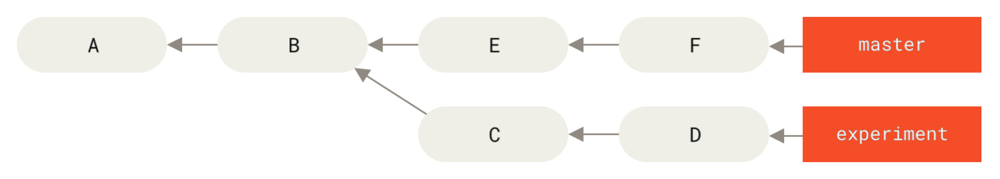

你想要查看 experiment 分支中还有哪些提交尚未被合并入 master 分支。你可以使用`master..experiment`来让 Git 显示这些提交。也就是“在 experiment 分支中而不在 master 分支中的提交”。为了使例子简单明了，我使用了示意图中提交对象的字母来代替真实日志的输出，所以会显示：

```bash
$ git log master..experiment
D
C
```

反过来，如果你想查看在 master 分支中而不在 experiment 分支中的提交，你只要交换分支名即可。`experiment..master`会显示在 master 分支中而不在 experiment 分支中的提交：

```bash
$ git log experiment..master
F
E
```

这可以让你保持 experiment 分支跟随最新的进度以及查看你即将合并的内容。另一个常用的场景是查看你即将推送到远端的内容：

```bash
$ git log origin/master..HEAD
```

这个命令会输出在你当前分支中而不在远程 origin 中的提交。如果你执行`git push`并且你的当前分支正在跟踪 origin/master，由`git log origin/master..HEAD`所输出的提交就是会被传输到远端服务器的提交。如果你留空了其中的一边，Git 会默认为 HEAD。例如，`git log origin/master..`将会输出相同的结果 —— Git 使用 HEAD 来代替留空的一边。

#### 2.多点

双点语法很好用，但有时候你可能需要两个以上的分支才能确定你所需要的修订，比如查看哪些提交是被包含在某些分支中的一个，但是不在你当前的分支上。Git 允许你在任意引用前加上`^`字符或者`--not`来指明你不希望提交被包含其中的分支。因此下列三个命令是等价的：

```bash
$ git log refA..refB
$ git log ^refA refB
$ git log refB --not refA
```

这个语法很好用，因为你可以在查询中指定超过两个的引用，这是双点语法无法实现的。比如，你想查看所有被 refA 或 refB 包含的但是不被 refC 包含的提交，你可以使用以下任意一个命令：

```bash
$ git log refA refB ^refC
$ git log refA refB --not refC
```

#### 3.三点

这个语法可以选择出**被两个引用之一包含但又不被两者同时包含的提交**。再看看之前双点例子中的提交历史。


如果你想看 master 或者 experiment 中包含的但不是两者共有的提交，你可以执行：

```bash
$ git log master...experiment
F
E
D
C
```

这和通常 log 按日期排序的输出一样，仅仅给出了 4 个提交的信息。

这种情形下，log 命令的一个常用参数是`--left-right`，它会显示每个提交到底处于哪一侧的分支。这会让输出数据更加清晰。

```bash
$ git log --left-right master...experiment
< F
< E
> D
> C
```

## 2.交互式暂存

当你在修改了大量文件后，希望这些改动能拆分为若干提交而不是混杂在一起成为一个提交时，这几个工具会非常有用。如果运行`git add`时使用`-i`或者`--interactive`选项，Git 将会进入一个交互式终端模式，显示类似下面的东西：

```bash
$ git add -i
           staged     unstaged path
  1:    unchanged        +0/-1 TODO
  2:    unchanged        +1/-1 index.html
  3:    unchanged        +5/-1 lib/simplegit.rb

*** Commands ***
  1: [s]tatus     2: [u]pdate      3: [r]evert     4: [a]dd untracked
  5: [p]atch      6: [d]iff        7: [q]uit       8: [h]elp
What now>
```

可以看到这个命令以和平时非常不同的视图显示了暂存区——基本上与 git status 是相同的信息，但是更简明扼要一些。它将暂存的修改列在左侧，未暂存的修改列在右侧。

在这块区域后是“Commands”命令区域。在这里你可以做一些工作，包括暂存文件、取消暂存文件、暂存文件的一部分、添加未被追踪的文件、显示暂存内容的区别。

### 2.1 暂存与取消暂存文件

如果在`What now>`提示符后键入`u`或`2`（更新），它会问你想要暂存哪个文件：

```bash
What now> u
           staged     unstaged path
  1:    unchanged        +0/-1 TODO
  2:    unchanged        +1/-1 index.html
  3:    unchanged        +5/-1 lib/simplegit.rb
Update>>
```

要暂存 TODO 和 index.html 文件，可以输入数字：

```bash
Update>> 1,2
           staged     unstaged path
* 1:    unchanged        +0/-1 TODO
* 2:    unchanged        +1/-1 index.html
  3:    unchanged        +5/-1 lib/simplegit.rb
Update>>
```

每个文件前面的 * 意味着选中的文件将会被暂存。如果在`Update>>`提示符后不输入任何东西并直接按回车，Git 将会暂存之前选择的文件：

```bash
Update>>
updated 2 paths

*** Commands ***
  1: [s]tatus     2: [u]pdate      3: [r]evert     4: [a]dd untracked
  5: [p]atch      6: [d]iff        7: [q]uit       8: [h]elp
What now> s
           staged     unstaged path
  1:        +0/-1      nothing TODO
  2:        +1/-1      nothing index.html
  3:    unchanged        +5/-1 lib/simplegit.rb
```

现在可以看到 TODO 与 index.html 文件已经被暂存而 simplegit.rb 文件还未被暂存。如果这时想要取消暂存 TODO 文件，使用`r`或`3`（撤消）选项：

```bash
*** Commands ***
  1: [s]tatus     2: [u]pdate      3: [r]evert     4: [a]dd untracked
  5: [p]atch      6: [d]iff        7: [q]uit       8: [h]elp
What now> r
           staged     unstaged path
  1:        +0/-1      nothing TODO
  2:        +1/-1      nothing index.html
  3:    unchanged        +5/-1 lib/simplegit.rb
Revert>> 1
           staged     unstaged path
* 1:        +0/-1      nothing TODO
  2:        +1/-1      nothing index.html
  3:    unchanged        +5/-1 lib/simplegit.rb
Revert>> [enter]
reverted one path
```

再次查看 Git 状态，可以看到已经取消暂存 TODO 文件：

```bash
*** Commands ***
  1: [s]tatus     2: [u]pdate      3: [r]evert     4: [a]dd untracked
  5: [p]atch      6: [d]iff        7: [q]uit       8: [h]elp
What now> s
           staged     unstaged path
  1:    unchanged        +0/-1 TODO
  2:        +1/-1      nothing index.html
  3:    unchanged        +5/-1 lib/simplegit.rb
```

如果想要查看已暂存内容的区别，可以使用`d`或`6`（区别）命令。它会显示暂存文件的一个列表，可以从中选择想要查看的暂存区别。这跟你在命令行指定`git diff --cached`非常相似：

```bash
*** Commands ***
  1: [s]tatus     2: [u]pdate      3: [r]evert     4: [a]dd untracked
  5: [p]atch      6: [d]iff        7: [q]uit       8: [h]elp
What now> d
           staged     unstaged path
  1:        +1/-1      nothing index.html
Review diff>> 1
diff --git a/index.html b/index.html
index 4d07108..4335f49 100644
--- a/index.html
+++ b/index.html
@@ -16,7 +16,7 @@ Date Finder

 <p id="out">...</p>

-<div id="footer">contact : support@github.com</div>
+<div id="footer">contact : email.support@github.com</div>

 <script type="text/javascript">
```

### 2.2 暂存补丁

Git 也可以暂存文件的特定部分。例如，如果在 simplegit.rb 文件中做了两处修改，但只想要暂存其中的一个而不是另一个，Git 会帮你轻松地完成。在和上一节一样的交互式提示符中，输入`p`或`5`（补丁）。Git 会询问你想要部分暂存哪些文件；然后，对已选择文件的每一个部分，它都会一个个地显示文件区别并询问你是否想要暂存它们：

```bash
diff --git a/lib/simplegit.rb b/lib/simplegit.rb
index dd5ecc4..57399e0 100644
--- a/lib/simplegit.rb
+++ b/lib/simplegit.rb
@@ -22,7 +22,7 @@ class SimpleGit
   end

   def log(treeish = 'master')
-    command("git log -n 25 #{treeish}")
+    command("git log -n 30 #{treeish}")
   end

   def blame(path)
Stage this hunk [y,n,a,d,/,j,J,g,e,?]?
```

输入`?`显示所有可以使用的命令列表：

```bash
Stage this hunk [y,n,a,d,/,j,J,g,e,?]? ?
y - stage this hunk
n - do not stage this hunk
a - stage this and all the remaining hunks in the file
d - do not stage this hunk nor any of the remaining hunks in the file
g - select a hunk to go to
/ - search for a hunk matching the given regex
j - leave this hunk undecided, see next undecided hunk
J - leave this hunk undecided, see next hunk
k - leave this hunk undecided, see previous undecided hunk
K - leave this hunk undecided, see previous hunk
s - split the current hunk into smaller hunks
e - manually edit the current hunk
? - print help
```

通常情况下可以输入`y`或`n`来选择是否要暂存每一个区块，当然，暂存特定文件中的所有部分或为之后的选择跳过一个区块也是非常有用的。如果你只暂存文件的一部分，状态输出可能会像下面这样：

```bash
What now> 1
           staged     unstaged path
  1:    unchanged        +0/-1 TODO
  2:        +1/-1      nothing index.html
  3:        +1/-1        +4/-0 lib/simplegit.rb
```

simplegit.rb 文件的状态很有趣。它显示出若干行被暂存与若干行未被暂存。已经部分地暂存了这个文件。在这时，可以退出交互式添加脚本并且运行`git commit`来提交部分暂存的文件。

也可以不必在交互式添加模式中做部分文件暂存——可以在命令行中使用`git add -p`或`git add --patch`来启动同样的脚本。

更进一步地，可以使用`git reset --patch`命令的补丁模式来部分重置文件，通过`git checkout --patch`命令来部分检出文件与`git stash save --patch`命令来部分暂存文件。

## 3.贮藏和清理

有时，当你在项目的一部分上已经工作一段时间后，所有东西都进入了混乱的状态，而这时你想要切换到另一个分支做一点别的事情。问题是，你不想仅仅因为过会儿回到这一点而为做了一半的工作创建一次提交。针对这个问题的答案是`git stash`命令。

贮藏（stash）会处理工作目录的脏的状态——即跟踪文件的修改与暂存的改动——然后将未完成的修改保存到一个栈上，而你可以在任何时候重新应用这些改动（甚至在不同的分支上）。

### 3.1 贮藏工作

为了演示贮藏，你需要进入项目并改动几个文件，然后可以暂存其中的一个改动。如果运行`git status`，可以看到有改动的状态：

```bash
$ git status
Changes to be committed:
  (use "git reset HEAD <file>..." to unstage)

    modified:   index.html

Changes not staged for commit:
  (use "git add <file>..." to update what will be committed)
  (use "git checkout -- <file>..." to discard changes in working
directory)

    modified:   lib/simplegit.rb
```

现在想要切换分支，但是还不想要提交之前的工作；所以贮藏修改。将新的贮藏推送到栈上，运行`git stash`或`git stash push`：

```bash
$ git stash
Saved working directory and index state \
  "WIP on master: 049d078 added the index file"
HEAD is now at 049d078 added the index file
(To restore them type "git stash apply")
```

可以看到工作目录是干净的了：

```bash
$ git status
# On branch master
nothing to commit, working directory clean
```

此时，你可以切换分支并在其他地方工作；你的修改被存储在栈上。要查看贮藏的东西，可以使用`git stash list`：

```bash
$ git stash list
stash@{0}: WIP on master: 049d078 added the index file
stash@{1}: WIP on master: c264051 Revert "added file_size"
stash@{2}: WIP on master: 21d80a5 added number to log
```

在本例中，有两个之前的贮藏，所以有三个不同的贮藏工作。可以通过`git stash apply`将刚刚贮藏的工作重新应用。如果想要应用其中一个更旧的贮藏，可以通过名字指定它，像这样：`git stash apply stash@{2}`。如果不指定一个贮藏，Git 认为指定的是最近的贮藏：

```bash
$ git stash apply
On branch master
Changes not staged for commit:
  (use "git add <file>..." to update what will be committed)
  (use "git checkout -- <file>..." to discard changes in working
directory)

    modified:   index.html
    modified:   lib/simplegit.rb

no changes added to commit (use "git add" and/or "git commit -a")
```

可以看到 Git 重新修改了当你保存贮藏时撤消的文件。在本例中，当尝试应用贮藏时有一个干净的工作目录，并且尝试将它应用在保存它时所在的分支。**并不是必须要有一个干净的工作目录**，或者要应用到同一分支才能成功应用贮藏。可以在一个分支上保存一个贮藏，切换到另一个分支，然后尝试重新应用这些修改。当应用贮藏时工作目录中也可以有修改与未提交的文件——如果有任何东西不能干净地应用，Git 会产生合并冲突。

文件的改动被重新应用了，但是之前暂存的文件却没有重新暂存。想要那样的话，必须使用`--index`选项来运行`git stash apply`命令，来尝试重新应用暂存的修改：

```bash
$ git stash apply --index
On branch master
Changes to be committed:
  (use "git reset HEAD <file>..." to unstage)

    modified:   index.html

Changes not staged for commit:
  (use "git add <file>..." to update what will be committed)
  (use "git checkout -- <file>..." to discard changes in working
directory)

    modified:   lib/simplegit.rb
```

可以运行`git stash drop`加上将要移除的贮藏的名字来移除它：

```bash
$ git stash list
stash@{0}: WIP on master: 049d078 added the index file
stash@{1}: WIP on master: c264051 Revert "added file_size"
stash@{2}: WIP on master: 21d80a5 added number to log
$ git stash drop stash@{0}
Dropped stash@{0} (364e91f3f268f0900bc3ee613f9f733e82aaed43)
```

也可以运行`git stash pop`来应用贮藏然后立即从栈上扔掉它。

### 3.2 贮藏的创意性使用

一个非常流行的选项是`git stash`命令的`--keep-index`选项。它告诉 Git 不仅要贮藏所有已暂存的内容，同时还要将它们保留在索引中。

```bash
$ git status -s
M  index.html
 M lib/simplegit.rb

$ git stash --keep-index
Saved working directory and index state WIP on master: 1b65b17 added the
index file
HEAD is now at 1b65b17 added the index file

$ git status -s
M  index.html
```

另一个经常使用贮藏来做的事情是贮藏未跟踪文件。默认情况下，`git stash`只会贮藏已修改和暂存的已跟踪文件。如果指定`--include-untracked`或`-u`选项，Git 也会贮藏任何未跟踪文件。然而，在贮藏中包含未跟踪的文件仍然不会包含明确忽略的文件。要额外包含忽略的文件，请使用`--all`或`-a`选项。

```bash
$ git status -s
M  index.html
 M lib/simplegit.rb
?? new-file.txt

$ git stash -u
Saved working directory and index state WIP on master: 1b65b17 added the
index file
HEAD is now at 1b65b17 added the index file

$ git status -s
$
```

最终，如果指定了`--patch`标记，Git 会交互式地提示哪些改动想要贮藏、哪些改动需要保存在工作目录中。

```bash
$ git stash --patch
diff --git a/lib/simplegit.rb b/lib/simplegit.rb
index 66d332e..8bb5674 100644
--- a/lib/simplegit.rb
+++ b/lib/simplegit.rb
@@ -16,6 +16,10 @@ class SimpleGit
         return `#{git_cmd} 2>&1`.chomp
       end
     end
+
+    def show(treeish = 'master')
+      command("git show #{treeish}")
+    end

 end
 test
Stash this hunk [y,n,q,a,d,/,e,?]? y

Saved working directory and index state WIP on master: 1b65b17 added the
index file
```

### 3.3 从贮藏创建一个分支

如果贮藏了一些工作，将它留在那儿了一会儿，然后继续在贮藏的分支上工作，在重新应用工作时可能会有问题。如果应用尝试修改刚刚修改的文件，你会得到一个合并冲突并不得不解决它。如果想要一个轻松的方式来再次测试贮藏的改动，可以运行`git stash branch <new branchname>`以你指定的分支名创建一个新分支，检出贮藏工作时所在的提交，重新在那应用工作，然后在应用成功后丢弃贮藏：

```bash
$ git stash branch testchanges
M   index.html
M   lib/simplegit.rb
Switched to a new branch 'testchanges'
On branch testchanges
Changes to be committed:
  (use "git reset HEAD <file>..." to unstage)

    modified:   index.html

Changes not staged for commit:
  (use "git add <file>..." to update what will be committed)
  (use "git checkout -- <file>..." to discard changes in working
directory)

    modified:   lib/simplegit.rb

Dropped refs/stash@{0} (29d385a81d163dfd45a452a2ce816487a6b8b014)
```

### 3.4 清理工作目录

`git clean`用于移除工作目录中一些工作或文件，需要谨慎地使用这个命令，因为它会从工作目录中**移除未被追踪的文件**。如果你改变主意了，你也不一定能找回来那些文件的内容。一个更安全的选项是运行`git stash --all`来移除每一样东西并存放在栈中。

你可以使用`git clean`命令去除冗余文件或者清理工作目录。使用`git clean -f -d`命令来移除工作目录中所有未追踪的文件以及空的子目录。`-f`意味着“强制（force）”或“确定要移除”，使用它需要 Git 配置变量`clean.requireForce`没有显式设置为 false。

如果只是想要看看它会做什么，可以使用`--dry-run`或`-n`选项来运行命令，这意味着“做一次演习然后告诉你将要移除什么”。

```bash
$ git clean -d -n
Would remove test.o
Would remove tmp/
```

默认情况下，`git clean`命令只会移除没有忽略的未跟踪文件。任何与 .gitignore 或其他忽略文件中的模式匹配的文件都不会被移除。如果你也想要移除那些文件，例如为了做一次完全干净的构建而移除所有由构建生成的 .o 文件，可以给`clean`命令增加一个`-x`选项。

```bash
$ git status -s
 M lib/simplegit.rb
?? build.TMP
?? tmp/

$ git clean -n -d
Would remove build.TMP
Would remove tmp/

$ git clean -n -d -x
Would remove build.TMP
Would remove test.o
Would remove tmp/
```

如果不知道`git clean`命令将会做什么，在将`-n`改为`-f`来真正做之前总是先用`-n`来运行它做双重检查。另一个小心处理过程的方式是使用`-i`或`-interactive`以交互模式运行`clean`命令。

```bash
$ git clean -x -i
Would remove the following items:
  build.TMP  test.o
*** Commands ***
    1: clean                2: filter by pattern    3: select by numbers
4: ask each             5: quit
    6: help
What now>
```

这种方式下可以分别地检查每一个文件或者交互地指定删除的模式。

> 如果你恰好在工作目录中复制或克隆了其他 Git 仓库（可能是子模块），那么即便是`git clean -fd`都会拒绝删除这些目录。这种情况下，你需要加上第二个`-f`选项来强调。

## 4.签署工作

Git 提供了几种通过 GPG 来签署和验证工作的方式。

### 4.1 GPG介绍

首先，在开始签名之前你需要先配置 GPG 并安装个人密钥。

```bash
$ gpg --list-keys
/Users/schacon/.gnupg/pubring.gpg
---------------------------------
pub   2048R/0A46826A 2014-06-04
uid                  Scott Chacon (Git signing key) <schacon@gmail.com>
sub   2048R/874529A9 2014-06-04
```

如果你还没有安装一个密钥，可以使用`gpg --gen-key`生成一个。

```bash
$ gpg --gen-key
```

一旦你有一个可以签署的私钥，可以通过设置 Git 的`user.signingkey`选项来签署。

```bash
$ git config --global user.signingkey 0A46826A
```

现在 Git 默认使用你的密钥来签署标签与提交。

### 4.2 签署标签

如果已经设置好一个 GPG 私钥，可以使用它来签署新的标签。需要做的只是使用`-s`代替`-a`即可：

```bash
$ git tag -s v1.5 -m 'my signed 1.5 tag'

You need a passphrase to unlock the secret key for
user: "Ben Straub <ben@straub.cc>"
2048-bit RSA key, ID 800430EB, created 2014-05-04
```

如果在那个标签上运行`git show`，会看到你的 GPG 签名附属在后面：

```bash
$ git show v1.5
tag v1.5
Tagger: Ben Straub <ben@straub.cc>
Date:   Sat May 3 20:29:41 2014 -0700

my signed 1.5 tag
-----BEGIN PGP SIGNATURE-----
Version: GnuPG v1

iQEcBAABAgAGBQJTZbQlAAoJEF0+sviABDDrZbQH/09PfE51KPVPlanr6q1v4/Ut
LQxfojUWiLQdg2ESJItkcuweYg+kc3HCyFejeDIBw9dpXt00rY26p05qrpnG+85b
hM1/PswpPLuBSr+oCIDj5GMC2r2iEKsfv2fJbNW8iWAXVLoWZRF8B0MfqX/YTMbm
ecorc4iXzQu7tupRihslbNkfvfciMnSDeSvzCpWAHl7h8Wj6hhqePmLm9lAYqnKp
8S5B/1SSQuEAjRZgI4IexpZoeKGVDptPHxLLS38fozsyi0QyDyzEgJxcJQVMXxVi
RUysgqjcpT8+iQM1PblGfHR4XAhuOqN5Fx06PSaFZhqvWFezJ28/CLyX5q+oIVk=
=EFTF
-----END PGP SIGNATURE-----

commit ca82a6dff817ec66f44342007202690a93763949
Author: Scott Chacon <schacon@gee-mail.com>
Date:   Mon Mar 17 21:52:11 2008 -0700

    changed the version number
```

### 4.3 验证标签

要验证一个签署的标签，可以运行`git tag -v <tag-name>`。这个命令使用 GPG 来验证签名。为了验证能正常工作，签署者的公钥需要在你的钥匙链中。

```bash
$ git tag -v v1.4.2.1
object 883653babd8ee7ea23e6a5c392bb739348b1eb61
type commit
tag v1.4.2.1
tagger Junio C Hamano <junkio@cox.net> 1158138501 -0700

GIT 1.4.2.1

Minor fixes since 1.4.2, including git-mv and git-http with alternates.
gpg: Signature made Wed Sep 13 02:08:25 2006 PDT using DSA key ID F3119B9A
gpg: Good signature from "Junio C Hamano <junkio@cox.net>"
gpg:                 aka "[jpeg image of size 1513]"
Primary key fingerprint: 3565 2A26 2040 E066 C9A7  4A7D C0C6 D9A4 F311
9B9A
```

如果没有签署者的公钥，那么你将会得到类似下面的东西：

```bash
gpg: Signature made Wed Sep 13 02:08:25 2006 PDT using DSA key ID F3119B9A
gpg: Can't check signature: public key not found
error: could not verify the tag 'v1.4.2.1'
```

### 4.4 签署提交

在最新版本的 Git 中（v1.7.9 及以上），也可以签署提交。如果相对于标签而言你对直接签署到提交更感兴趣的话，只需要增加一个`-S`到`git commit`命令。

```bash
$ git commit -a -S -m 'signed commit'

You need a passphrase to unlock the secret key for
user: "Scott Chacon (Git signing key) <schacon@gmail.com>"
2048-bit RSA key, ID 0A46826A, created 2014-06-04

[master 5c3386c] signed commit
 4 files changed, 4 insertions(+), 24 deletions(-)
 rewrite Rakefile (100%)
 create mode 100644 lib/git.rb
```

`git log`也有一个`--show-signature`选项来查看及验证这些签名。

```bash
$ git log --show-signature -1
commit 5c3386cf54bba0a33a32da706aa52bc0155503c2
gpg: Signature made Wed Jun  4 19:49:17 2014 PDT using RSA key ID 0A46826A
gpg: Good signature from "Scott Chacon (Git signing key)
<schacon@gmail.com>"
Author: Scott Chacon <schacon@gmail.com>
Date:   Wed Jun 4 19:49:17 2014 -0700

    signed commit
```

另外，也可以配置`git log`来验证任何找到的签名并将它们以`%G?`格式列在输出中。

```bash
$ git log --pretty="format:%h %G? %aN  %s"

5c3386c G Scott Chacon  signed commit
ca82a6d N Scott Chacon  changed the version number
085bb3b N Scott Chacon  removed unnecessary test code
a11bef0 N Scott Chacon  first commit
```

这里我们可以看到只有最后一次提交是签署并有效的，而之前的提交都不是。

在 Git 1.8.3 及以后的版本中，`git merge`与`git pull`可以使用`--verify-signatures`选项来检查并拒绝没有携带可信 GPG 签名的提交。

如果使用这个选项来合并一个包含未签名或有效的提交的分支时，合并不会生效。

```bash
$ git merge --verify-signatures non-verify
fatal: Commit ab06180 does not have a GPG signature.
```

如果合并包含的只有有效的签名的提交，合并命令会提示所有的签名它已经检查过了然后会继续向前。

```bash
$ git merge --verify-signatures signed-branch
Commit 13ad65e has a good GPG signature by Scott Chacon (Git signing key)
<schacon@gmail.com>
Updating 5c3386c..13ad65e
Fast-forward
 README | 2 ++
 1 file changed, 2 insertions(+)
```

也可以给`git merge`命令附加`-S`选项来签署自己生成的合并提交。下面的例子演示了验证将要合并的分支的每一个提交都是签名的并且签署最后生成的合并提交。

```bash
$ git merge --verify-signatures -S signed-branch
Commit 13ad65e has a good GPG signature by Scott Chacon (Git signing key)
<schacon@gmail.com>

You need a passphrase to unlock the secret key for
user: "Scott Chacon (Git signing key) <schacon@gmail.com>"
2048-bit RSA key, ID 0A46826A, created 2014-06-04

Merge made by the 'recursive' strategy.
 README | 2 ++
 1 file changed, 2 insertions(+)
```

### 4.5 每个人必须签署

在采用签署成为标准工作流程的一部分前，确保你完全理解 GPG 及签署带来的好处。

## 5.搜索

### 5.1 Git Grep

Git 提供了一个`grep`命令，你可以很方便地从提交历史、工作目录、甚至索引中查找一个字符串或者正则表达式。

默认情况下`git grep`会查找你工作目录的文件。第一种变体是，你可以传递`-n`或`--line-number`选项数来输出 Git 找到的匹配行的行号。

```bash
$ git grep -n gmtime_r
compat/gmtime.c:3:#undef gmtime_r
compat/gmtime.c:8:      return git_gmtime_r(timep, &result);
compat/gmtime.c:11:struct tm *git_gmtime_r(const time_t *timep, struct tm
*result)
compat/gmtime.c:16:     ret = gmtime_r(timep, result);
compat/mingw.c:826:struct tm *gmtime_r(const time_t *timep, struct tm
*result)
compat/mingw.h:206:struct tm *gmtime_r(const time_t *timep, struct tm
*result);
date.c:482:             if (gmtime_r(&now, &now_tm))
date.c:545:             if (gmtime_r(&time, tm)) {
date.c:758:             /* gmtime_r() in match_digit() may have clobbered
it */
git-compat-util.h:1138:struct tm *git_gmtime_r(const time_t *, struct tm
*);
git-compat-util.h:1140:#define gmtime_r git_gmtime_r
```

除了上面的基本搜索命令外，`git grep`还支持大量其它有趣的选项。

例如，若不想打印所有匹配的项，你可以使用`-c`或`--count`选项来让`git grep`输出概述的信息，其中仅包括那些包含匹配字符串的文件，以及每个文件中包含了多少个匹配。

```bash
$ git grep --count gmtime_r
compat/gmtime.c:4
compat/mingw.c:1
compat/mingw.h:1
date.c:3
git-compat-util.h:2
```

如果你还关心搜索字符串的 上下文，那么可以传入`-p`或`--show-function`选项来显示每一个匹配的字符串所在的方法或函数：

```bash
$ git grep -p gmtime_r *.c
date.c=static int match_multi_number(timestamp_t num, char c, const char *date,
date.c:         if (gmtime_r(&now, &now_tm))
date.c=static int match_digit(const char *date, struct tm *tm, int *offset, int *tm_gmt)
date.c:         if (gmtime_r(&time, tm)) {
date.c=int parse_date_basic(const char *date, timestamp_t *timestamp, int *offset)
date.c:         /* gmtime_r() in match_digit() may have clobbered it */
```

date.c 文件中的 match_multi_number 和 match_digit 两个函数都调用了 gmtime_r  （第三个显示的匹配只是注释中的字符串）。

你还可以使用`--and`标志来查看复杂的字符串组合，它确保了多个匹配出现在同一文本行中。比如，我们要查看在旧版本 1.8.0 的 Git 代码库中定义了常量名包含 “LINK” 或者 “BUF_MAX” 这两个字符串的行 （这里也用到了`--break`和`--heading`选项来使输出更加容易阅读）。

```bash
$ git grep --break --heading -n -e '#define' --and \( -e LINK -e BUF_MAX \) v1.8.0
v1.8.0:builtin/index-pack.c
62:#define FLAG_LINK (1u<<20)

v1.8.0:cache.h
73:#define S_IFGITLINK  0160000
74:#define S_ISGITLINK(m)       (((m) & S_IFMT) == S_IFGITLINK)

v1.8.0:environment.c
54:#define OBJECT_CREATION_MODE OBJECT_CREATION_USES_HARDLINKS

v1.8.0:strbuf.c
326:#define STRBUF_MAXLINK (2*PATH_MAX)

v1.8.0:symlinks.c
53:#define FL_SYMLINK  (1 << 2)

v1.8.0:zlib.c
30:/* #define ZLIB_BUF_MAX ((uInt)-1) */
31:#define ZLIB_BUF_MAX ((uInt) 1024 * 1024 * 1024) /* 1GB */
```

相比于一些常用的搜索命令比如`grep`和`ack`，`git grep`命令有一些的优点。第一就是速度非常快，第二是你不仅仅可以可以搜索工作目录，还可以搜索任意的 Git 树。在上一个例子中，我们在一个旧版本的 Git 源代码中查找，而不是当前检出的版本。

### 5.2 Git日志搜索

如果我们想找到 ZLIB_BUF_MAX 常量是什么时候引入的，我们可以使用`-S`选项来显示新增和删除该字符串的提交。

```bash
$ git log -S ZLIB_BUF_MAX --oneline
e01503b zlib: allow feeding more than 4GB in one go
ef49a7a zlib: zlib can only process 4GB at a time
```

如果我们查看这些提交的 diff，我们可以看到在 ef49a7a 这个提交引入了常量，并且在 e01503b 这个提交中被修改了。

如果你希望得到更精确的结果，你可以使用`-G`选项来使用正则表达式搜索。

#### 1.行日志搜索

行日志搜索是另一个相当高级并且有用的日志搜索功能。在`git log`后加上`-L`选项即可调用，它可以展示代码中一行或者一个函数的历史。

例如，假设我们想查看 zlib.c 文件中 git_deflate_bound 函数的每一次变更，我们可以执行`git log -L :git_deflate_bound:zlib.c`。Git 会尝试找出这个函数的范围，然后查找历史记录，并且显示从函数创建之后一系列变更对应的补丁。

```bash
$ git log -L :git_deflate_bound:zlib.c
commit ef49a7a0126d64359c974b4b3b71d7ad42ee3bca
Author: Junio C Hamano <gitster@pobox.com>
Date:   Fri Jun 10 11:52:15 2011 -0700

    zlib: zlib can only process 4GB at a time

diff --git a/zlib.c b/zlib.c
--- a/zlib.c
+++ b/zlib.c
@@ -85,5 +130,5 @@
-unsigned long git_deflate_bound(z_streamp strm, unsigned long size)
+unsigned long git_deflate_bound(git_zstream *strm, unsigned long size)
 {
-       return deflateBound(strm, size);
+       return deflateBound(&strm->z, size);
 }

commit 225a6f1068f71723a910e8565db4e252b3ca21fa
Author: Junio C Hamano <gitster@pobox.com>
Date:   Fri Jun 10 11:18:17 2011 -0700

    zlib: wrap deflateBound() too

diff --git a/zlib.c b/zlib.c
--- a/zlib.c
+++ b/zlib.c
@@ -81,0 +85,5 @@
+unsigned long git_deflate_bound(z_streamp strm, unsigned long size)
+{
+       return deflateBound(strm, size);
+}
+
```

如果 Git 无法计算出如何匹配你代码中的函数或者方法，你可以提供一个正则表达式。例如，这个命令和上面的是等同的：`git log -L '/unsigned long git_deflate_bound/',/^}/:zlib.c`。你也可以提供单行或者一个范围的行号来获得相同的输出。

## 6.重写历史

### 6.1 修改最后一次提交

如果，你只是想修改最近一次提交的提交信息，那么很简单：

```bash
$ git commit --amend
```

上面这条命令会将最后一次的提交信息载入到编辑器中供你修改。当保存并关闭编辑器后，编辑器会将更新后的提交信息写入新提交中，它会成为新的最后一次提交。

另一方面，如果你想要修改最后一次提交的实际内容，那么流程很相似：首先作出你想要补上的修改，暂存它们，然后用`git commit --amend`以新的改进后的提交来替换掉旧有的最后一次提交，使用这个技巧的时候需要小心，因为修正会改变提交的 SHA-1 校验和。它类似于一个小的变基——如果已经推送了最后一次提交就不要修正它。

> 当你在修补一次提交时，可以同时修改提交信息和提交内容。如果你修补了提交的内容，那么几乎肯定要更新提交消息以反映修改后的内容。
>
> 另一方面，如果你的修补是琐碎的（如修改了一个笔误或添加了一个忘记暂存的文件），那么之前的提交信息不必修改，你只需作出更改，暂存它们，然后通过以下命令避免不必要的编辑器环节即可：
>
> ```bash
> $ git commit --amend --no-edit
> ```

### 6.2 修改多个提交信息

Git 没有一个改变历史工具，但是可以使用变基工具来变基一系列提交，可以通过给`git rebase`增加`-i`选项来交互式地运行变基。

例如，如果想要修改最近三次提交信息，或者那组提交中的任意一个提交信息，将想要修改的最远一次提交的父提交作为参数传递给`git rebase -i`命令，即`HEAD~2^`或`HEAD~3`。记住`~3`可能比较容易，因为你正尝试修改最后三次提交；但是注意实际上指定了以前的四次提交，即想要修改提交的父提交：

```bash
$ git rebase -i HEAD~3
```

再次记住这是一个变基命令——在 HEAD~3..HEAD 范围内的每一个修改了提交信息的提交及其之后的所有提交都会被重写。

运行这个命令会在文本编辑器上给你一个提交的列表，看起来像下面这样：

```bash
pick f7f3f6d changed my name a bit
pick 310154e updated README formatting and added blame
pick a5f4a0d added cat-file

# Rebase 710f0f8..a5f4a0d onto 710f0f8
#
# Commands:
# p, pick <commit> = use commit
# r, reword <commit> = use commit, but edit the commit message
# e, edit <commit> = use commit, but stop for amending
# s, squash <commit> = use commit, but meld into previous commit
# f, fixup <commit> = like "squash", but discard this commit's log message
# x, exec <command> = run command (the rest of the line) using shell
# b, break = stop here (continue rebase later with 'git rebase --continue')
# d, drop <commit> = remove commit
# l, label <label> = label current HEAD with a name
# t, reset <label> = reset HEAD to a label
# m, merge [-C <commit> | -c <commit>] <label> [# <oneline>]
# .       create a merge commit using the original merge commit's
# .       message (or the oneline, if no original merge commit was
# .       specified). Use -c <commit> to reword the commit message.
#
# These lines can be re-ordered; they are executed from top to bottom.
#
# If you remove a line here THAT COMMIT WILL BE LOST.
#
# However, if you remove everything, the rebase will be aborted.
#
# Note that empty commits are commented out
```

你需要将你想修改的每一次提交前面的 ‘pick’ 改为 ‘edit’。例如，只想修改第三次提交信息，可以像下面这样修改文件：

```bash
edit f7f3f6d changed my name a bit
pick 310154e updated README formatting and added blame
pick a5f4a0d added cat-file
```

当保存并退出编辑器时，Git 将你带回到列表中的最后一次提交，把你送回命令行并提示以下信息：

```bash
$ git rebase -i HEAD~3
Stopped at f7f3f6d... changed my name a bit
You can amend the commit now, with

       git commit --amend

Once you're satisfied with your changes, run

       git rebase --continue
```

输入：

```bash
$ git commit --amend
```

修改提交信息，然后退出编辑器。然后，运行

```bash
$ git rebase --continue
```

如果需要将不止一处的 pick 改为 edit，需要在每一个修改为 edit 的提交上重复这些步骤。

### 6.3 重新排序提交

也可以使用交互式变基来重新排序或完全移除提交。如果想要移除 “added cat-file” 提交然后修改另外两个提交引入的顺序，可以将变基脚本从这样：

```bash
pick f7f3f6d changed my name a bit
pick 310154e updated README formatting and added blame
pick a5f4a0d added cat-file
```

改为这样：

```bash
pick 310154e updated README formatting and added blame
pick f7f3f6d changed my name a bit
```

当保存并退出编辑器时，Git 将你的分支带回这些提交的父提交，应用 310154e 然后应用 f7f3f6d，最后停止。

### 6.4 压缩提交

通过交互式变基工具，也可以将一连串提交压缩成一个单独的提交。如果指定 “squash” 而不是 “pick” 或 “edit”，Git 将应用两者的修改并合并提交信息。

所以，如果想要这三次提交变为一个提交，可以这样修改脚本：

```bash
pick f7f3f6d changed my name a bit
squash 310154e updated README formatting and added blame
squash a5f4a0d added cat-file
```

当保存并退出编辑器时，Git 应用所有的三次修改然后将你放到编辑器中来合并三次提交信息：

```bash
# This is a combination of 3 commits.
# The first commit's message is:
changed my name a bit

# This is the 2nd commit message:

updated README formatting and added blame

# This is the 3rd commit message:

added cat-file
```

当你保存之后，你就拥有了一个包含前三次提交的全部变更的提交。

### 6.5 拆分提交

拆分一个提交会撤消这个提交，然后多次地部分地暂存与提交直到完成你所需次数的提交。例如，假设想要拆分三次提交的中间那次提交。想要将它拆分为两次提交：第一个 “updated README formatting”，第二个 “added blame” 来代替原来的 “updated README formatting and added blame”。可以通过修改`rebase -i`的脚本来做到这点，将要拆分的提交的指令修改为 “edit”：

```bash
pick f7f3f6d changed my name a bit
edit 310154e updated README formatting and added blame
pick a5f4a0d added cat-file
```

当保存并退出编辑器时，Git 带你到列表中第一个提交的父提交，应用第一个提交（f7f3f6d），应用第二个提交（310154e），然后让你进入命令行。然后，重置提交，从中创建几次提交。

```bash
$ git reset HEAD^
$ git add README
$ git commit -m 'updated README formatting'
$ git add lib/simplegit.rb
$ git commit -m 'added blame'
$ git rebase --continue
```

历史记录看起来像这样：

```bash
$ git log -4 --pretty=format:"%h %s"
1c002dd added cat-file
9b29157 added blame
35cfb2b updated README formatting
f3cc40e changed my name a bit
```

再次强调，这些改动了所有在列表中的提交的 SHA-1 校验和，所以要确保列表中的提交还没有推送到共享仓库中。

### 6.6 核武器级选项：filter-branch

有另一个历史改写的选项，如果想要通过脚本的方式改写大量提交的话可以使用它——例如，全局修改你的邮箱地址或从每一个提交中移除一个文件。这个命令是`filter-branch`，它可以改写历史中大量的提交。

> `git filter-branch`有很多陷阱，不再推荐使用它来重写历史。请考虑使用`git-filter-repo`，它是一个 Python 脚本，相比大多数使用`filter-branch`的应用来说，它做得要更好。它的文档和源码可访问 https://github.com/newren/git-filter-repo 获取。

#### 1.从每一个提交中移除一个文件

这经常发生。有人粗心地通过`git add .`提交了一个巨大的二进制文件，你想要从所有地方删除。为了从整个提交历史中移除一个叫做 passwords.txt 的文件，可以使用`--tree-filter`：

```bash
$ git filter-branch --tree-filter 'rm -f passwords.txt' HEAD
Rewrite 6b9b3cf04e7c5686a9cb838c3f36a8cb6a0fc2bd (21/21)
Ref 'refs/heads/master' was rewritten
```

`--tree-filter`选项在检出项目的每一个提交后运行指定的命令然后重新提交结果。在本例中，你从每一个快照中移除了一个叫作 passwords.txt 的文件，无论它是否存在。如果想要移除所有偶然提交的编辑器备份文件，可以运行类似`git filter-branch --tree-filter 'rm -f *~' HEAD`的命令。

为了让`filter-branch`在所有分支上运行，可以给命令传递`--all`选项。

#### 2.使一个子目录做为新的根目录

假设已经从另一个源代码控制系统中导入，并且有几个没意义的子目录（trunk、tags 等等）。如果想要让 trunk 子目录作为每一个提交的新的项目根目录，`filter-branch`也可以帮助你那么做：

```bash
$ git filter-branch --subdirectory-filter trunk HEAD
Rewrite 856f0bf61e41a27326cdae8f09fe708d679f596f (12/12)
Ref 'refs/heads/master' was rewritten
```

在新项目根目录是 trunk 子目录了。Git 会自动移除所有不影响子目录的提交。

#### 3.全局修改邮箱地址

你也可以通过`filter-branch`来一次性修改多个提交中的邮箱地址。需要小心的是只修改你自己的邮箱地址：

```bash
$ git filter-branch --commit-filter '
        if [ "$GIT_AUTHOR_EMAIL" = "schacon@localhost" ];
        then
                GIT_AUTHOR_NAME="Scott Chacon";
                GIT_AUTHOR_EMAIL="schacon@example.com";
                git commit-tree "$@";
        else
                git commit-tree "$@";
        fi' HEAD
```

这会遍历并重写每一个提交来包含你的新邮箱地址。这个命令会修改你的历史中的每一个提交的 SHA-1 校验和，而不仅仅只是那些匹配邮箱地址的提交。

## 7.重置解密

在继续了解更专业的工具前，我们先探讨一下 Git 的`reset`和`checkout`命令。

### 7.1 三棵树

Git 作为一个系统，是以它的一般操作来管理并操纵这三棵树的：

|   树   |   用途   |
| ---- | ---- |
|   HEAD   |   上一次提交的快照，下一次提交的父结点   |
|   Index    |   预期的下一次提交的快照   |
|   Working Directory   |   沙盒   |

#### 1.HEAD

HEAD 是当前分支引用的指针，它总是指向该分支上的最后一次提交。这表示 HEAD 将是下一次提交的父结点。通常，理解 HEAD 的最简方式，就是将它看做**该分支上的最后一次提交**的快照。

下例就显示了 HEAD 快照实际的目录列表，以及其中每个文件的 SHA-1 校验和：

```bash
$ git cat-file -p HEAD
tree cfda3bf379e4f8dba8717dee55aab78aef7f4daf
author Scott Chacon  1301511835 -0700
committer Scott Chacon  1301511835 -0700

initial commit

$ git ls-tree -r HEAD
100644 blob a906cb2a4a904a152...   README
100644 blob 8f94139338f9404f2...   Rakefile
040000 tree 99f1a6d12cb4b6f19...   lib
```

Git 的`cat-file`和`ls-tree`是底层命令，它们一般用于底层工作，在日常工作中并不使用。不过它们能帮助我们了解到底发生了什么

#### 2.索引

索引是你的预期的下一次提交。我们也会将这个概念引用为 Git 的“暂存区”，这就是当你运行`git commit`时 Git 看起来的样子。

Git 将上一次检出到工作目录中的所有文件填充到索引区，之后你会将其中一些文件替换为新版本，接着通过`git commit`将它们转换为树来用作新的提交。

```bash
$ git ls-files -s
100644 a906cb2a4a904a152e80877d4088654daad0c859 0   README
100644 8f94139338f9404f26296befa88755fc2598c289 0   Rakefile
100644 47c6340d6459e05787f644c2447d2595f5d3a54b 0   lib/simplegit.rb
```

确切来说，索引在技术上并非树结构，它其实是以扁平的清单实现的。

#### 3.工作目录

最后，你就有了自己的工作目录（通常也叫工作区）。另外两棵树以一种高效但并不直观的方式，将它们的内容存储在 .git 文件夹中。工作目录会将它们解包为实际的文件以便编辑。你可以把工作目录当做 沙盒。在你将修改提交到暂存区并记录到历史之前，可以随意更改。

```bash
$ tree
.
├── README
├── Rakefile
└── lib
    └── simplegit.rb

1 directory, 3 files
```

### 7.2 工作流程

经典的 Git 工作流程是通过操纵这三个区域来以更加连续的状态记录项目快照的。

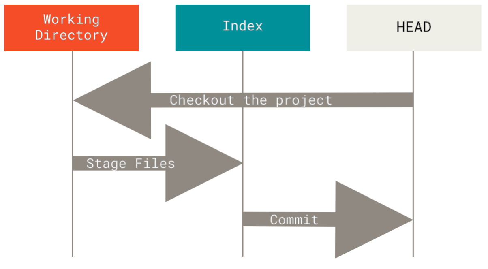

假设我们进入到一个新目录，其中有一个文件。我们称其为该文件的 v1 版本，将它标记为蓝色。现在运行`git init`，这会创建一个 Git 仓库，其中的 HEAD 引用指向未创建的 master 分支。

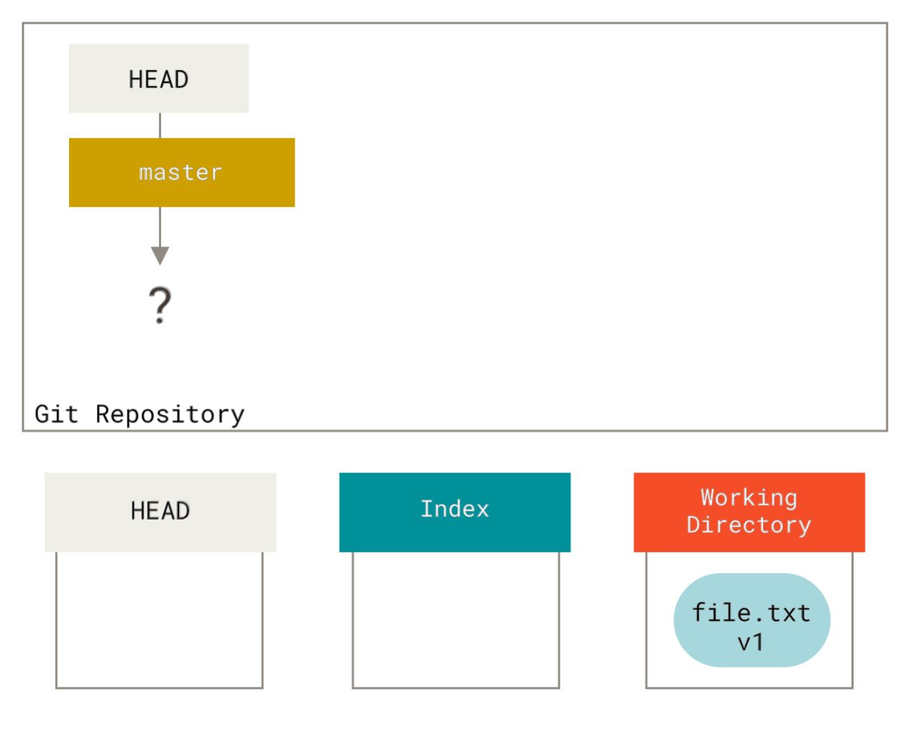

此时，只有工作目录有内容。

现在我们想要提交这个文件，所以用`git add`来获取工作目录中的内容，并将其复制到索引中。

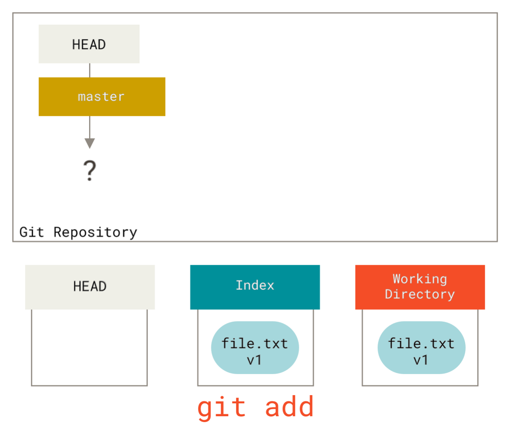

接着运行`git commit`，它会取得索引中的内容并将它保存为一个永久的快照，然后创建一个指向该快照的提交对象，最后更新 master 来指向本次提交。

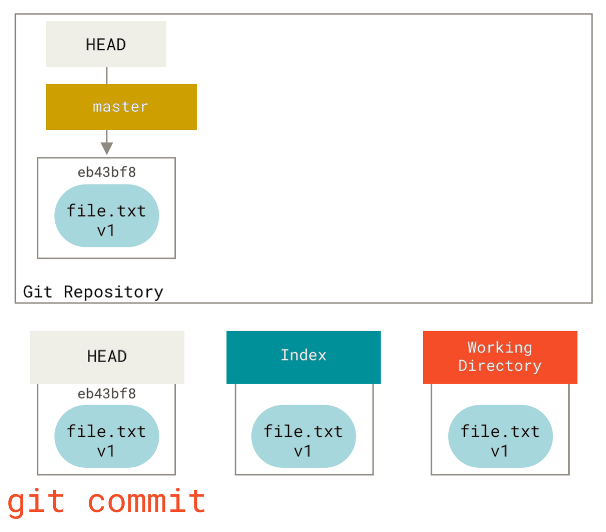

此时如果我们运行`git status`，会发现没有任何改动，因为现在三棵树完全相同。

现在我们想要对文件进行修改然后提交它。 我们将会经历同样的过程；首先在工作目录中修改文件。 我们称其为该文件的 v2 版本，并将它标记为红色。

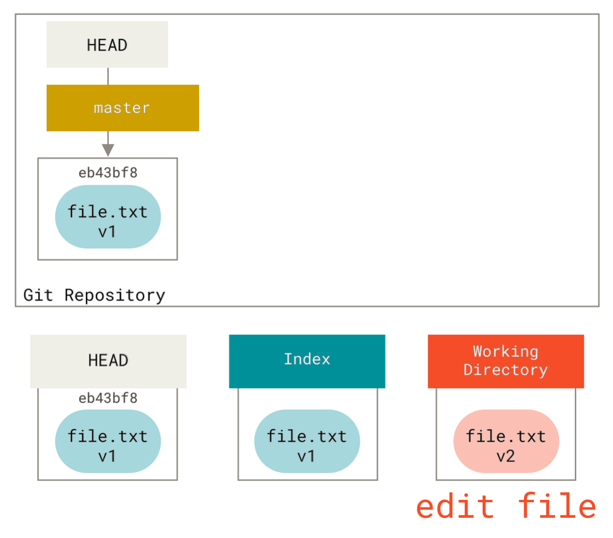

如果现在运行`git status`，我们会看到文件显示在 “Changes not staged for commit” 下面并被标记为红色，因为该条目在索引与工作目录之间存在不同。 接着我们运行`git add`来将它暂存到索引中。

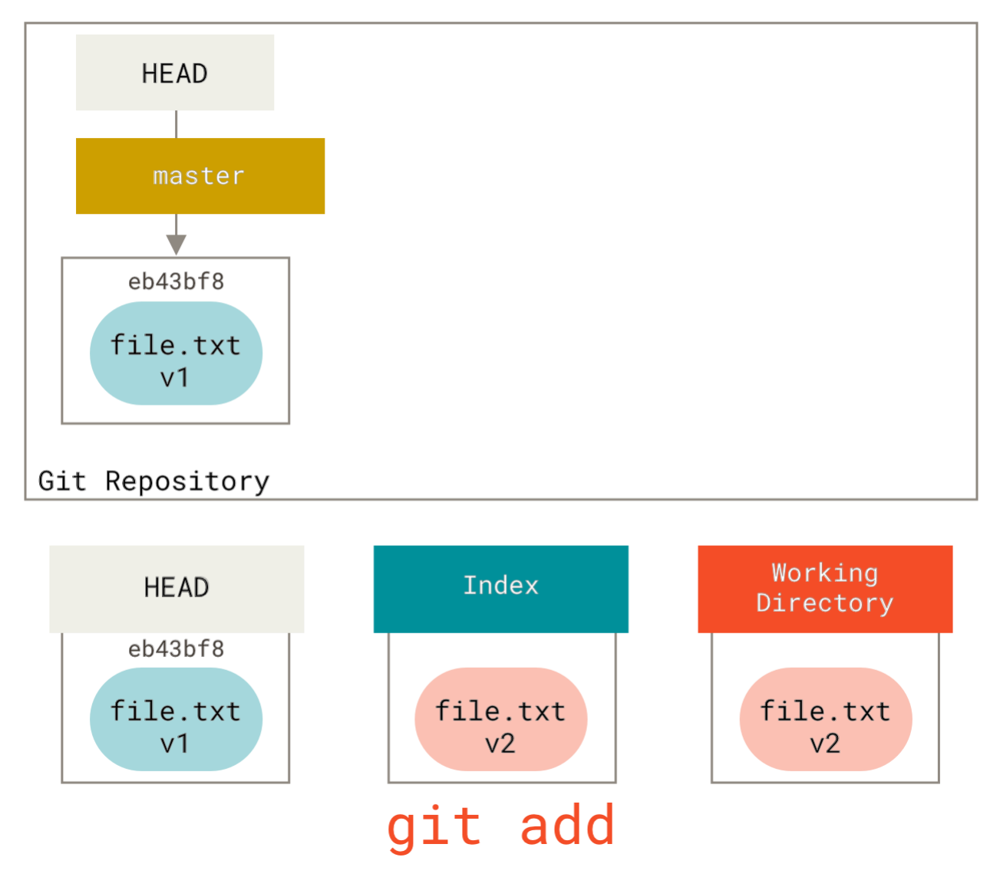

此时，由于索引和 HEAD 不同，若运行`git status`的话就会看到 “Changes to be committed” 下的该文件变为绿色 ——也就是说，现在预期的下一次提交与上一次提交不同。 最后，我们运行`git commit`来完成提交。

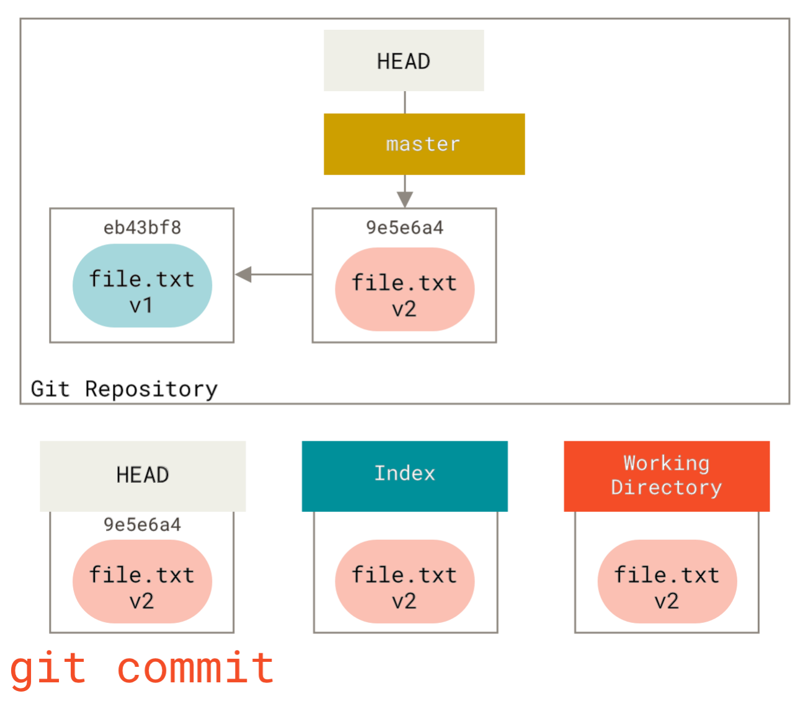

现在运行`git status`会没有输出，因为三棵树又变得相同了。

切换分支或克隆的过程也类似。 当检出一个分支时，它会修改 HEAD 指向新的分支引用，将索引填充为该次提交的快照， 然后将 索引 的内容复制到工作目录中。

### 7.3 重置的作用

假设我们再次修改了 file.txt 文件并第三次提交它。 现在的历史看起来是这样的：

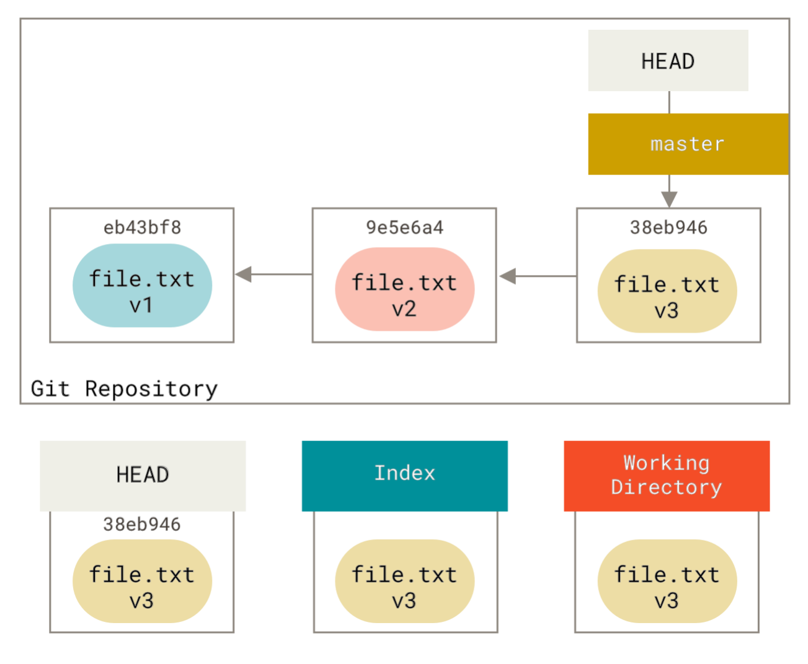

`reset`主要做了三个基本操作。

#### 1.移动 HEAD

`reset`做的第一件事是移动 HEAD 的指向。 这与改变 HEAD 自身不同（checkout 所做的）；`reset`移动 HEAD 指向的分支。 这意味着如果 HEAD 设置为 master 分支（例如，你正在 master 分支上）， 运行`git reset 9e5e6a4`将会使 master 指向 9e5e6a4。

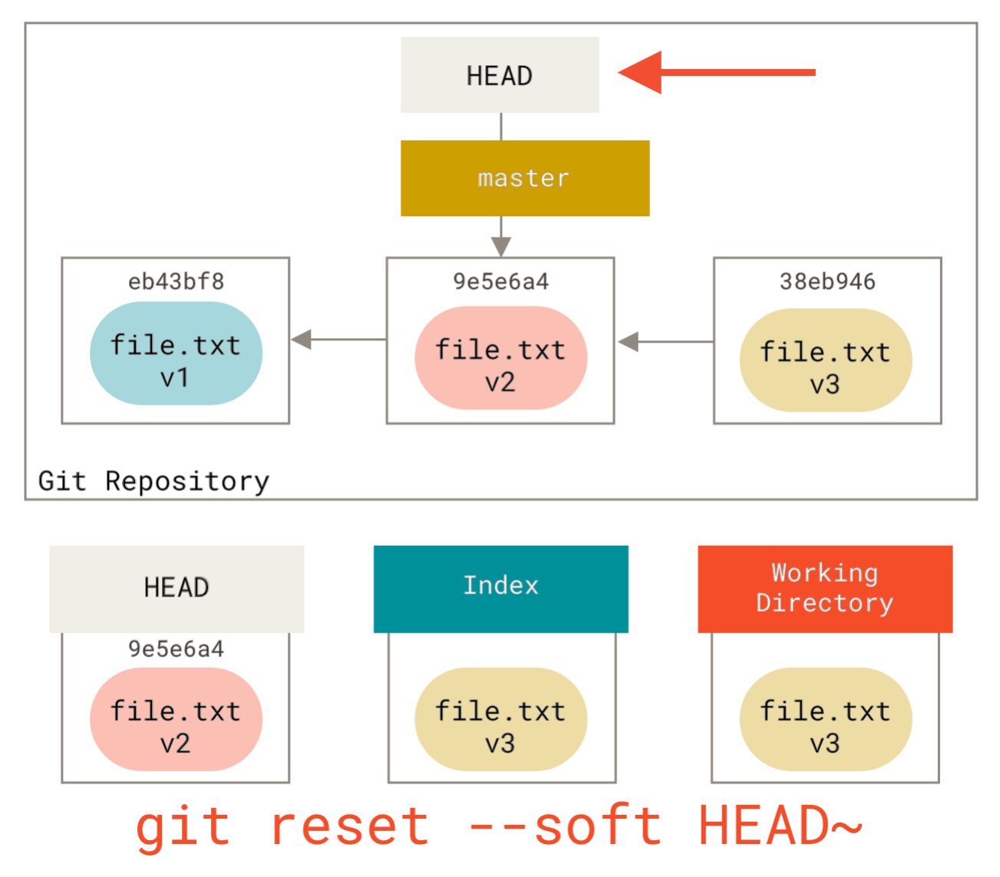

无论你调用了带何种参数的`reset`，它首先都会尝试这样做。使用`reset --soft`将会使状态停止在这里。

它本质上是撤销了上一次`git commit`命令。 当你在运行`git commit`时，Git 会创建一个新的提交，并移动 HEAD 所指向的分支来使其指向该提交。 当你将它`reset`回`HEAD~`（HEAD 的父结点）时，其实就是把该分支移动回原来的位置，而不会改变索引和工作目录。 现在你可以更新索引并再次运行`git commit`来完成`git commit --amend`所要做的事情了。

#### 2.更新索引（--mixed）

注意，如果你现在运行`git status`的话，就会看到新的 HEAD 和以绿色标出的它和索引之间的区别。

接下来，reset 会用 HEAD 指向的当前快照的内容来更新索引。

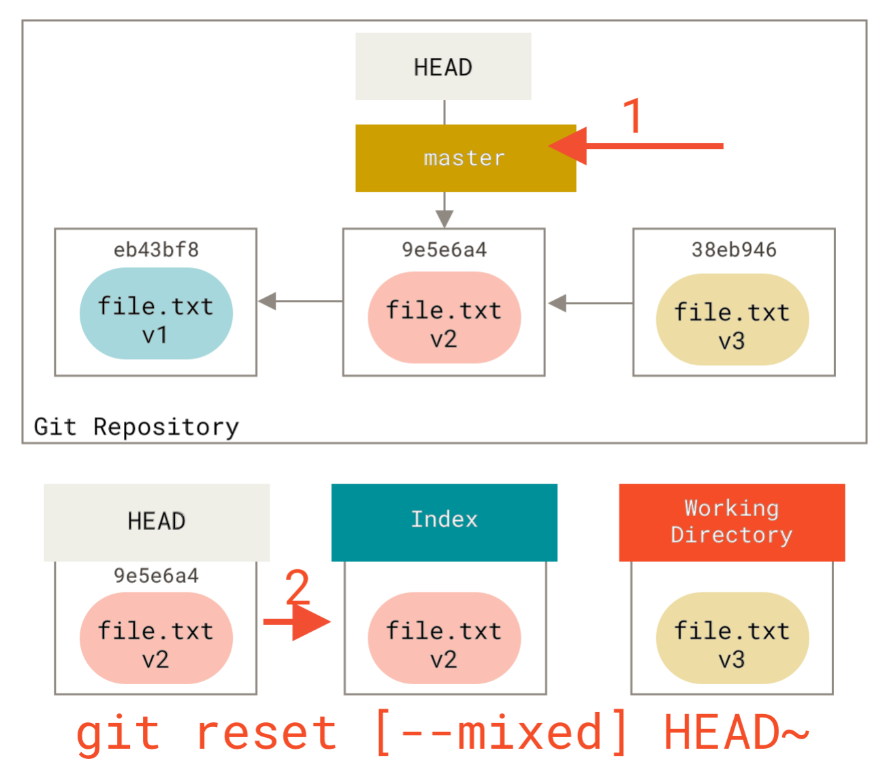

如果指定`--mixed`选项，reset 将会在这时停止。这也是默认行为，所以如果没有指定任何选项（`git reset HEAD~`）。

于是我们回滚到了`git add`和`git commit`的命令执行之前。

#### 3.更新工作目录（--hard）

如果使用`--hard`选项，它将会继续这一步。

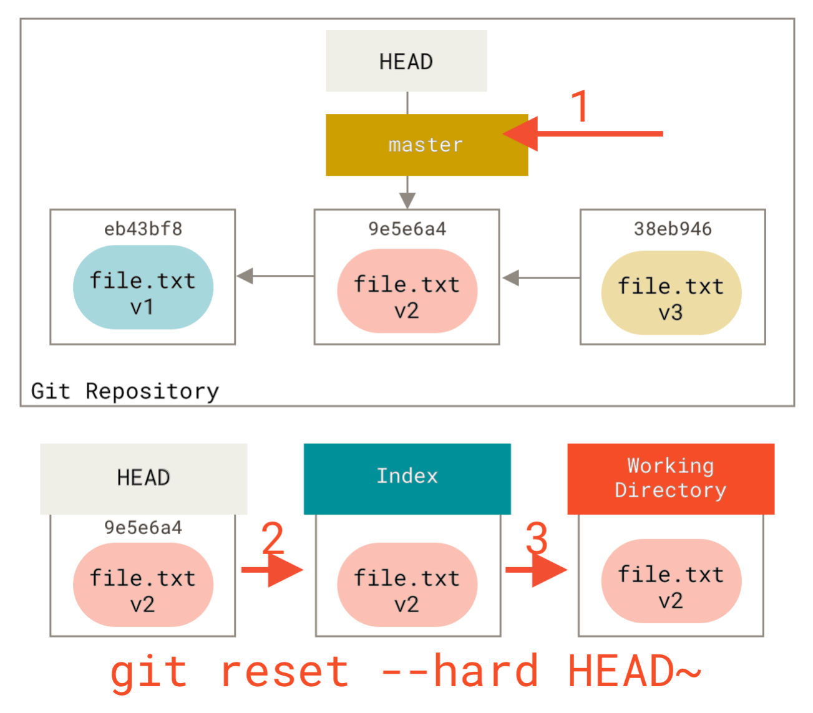

必须注意，`--hard`标记是`reset`命令唯一的==危险用法==，它也是 Git 会真正地销毁数据的仅有的几个操作之一。其他任何形式的 reset 调用都可以轻松撤消，但是`--hard`选项不能，因为它强制覆盖了工作目录中的文件。在这种特殊情况下，我们的 Git 数据库中的一个提交内还留有该文件的 v3 版本， 我们可以通过`reflog`来找回它。但是若该文件还未提交，Git 仍会覆盖它从而导致无法恢复。

### 7.4 重置某一文件

若指定了一个路径，`reset`将会跳过第 1 步，并且将它的作用范围限定为指定的文件或文件集合。

现在，假如我们运行`git reset file.txt`（这其实是`git reset --mixed HEAD file.txt`的简写形式，因为你既没有指定一个提交的 SHA-1 或分支，也没有指定`--soft`或`--hard`），它会将 file.txt 从 HEAD 复制到索引中。

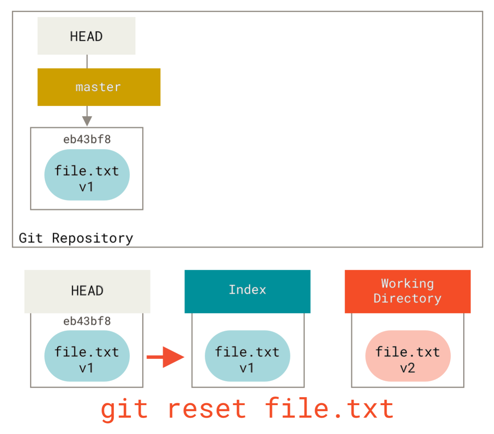

它还有**取消暂存文件**的实际效果。 如果我们查看该命令的示意图，然后再想想`git add`所做的事，就会发现它们正好相反。

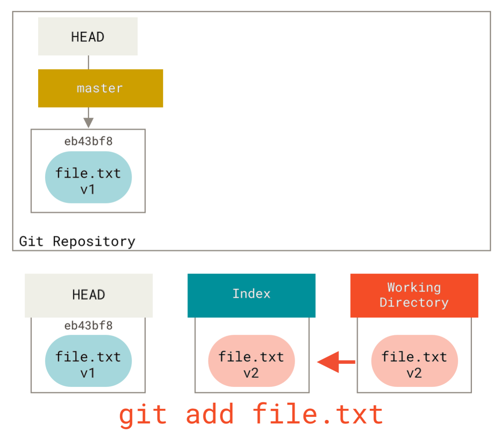

这就是为什么`git status`命令的输出会建议运行此命令来取消暂存一个文件。

我们可以不让 Git 从 HEAD 拉取数据，而是通过具体指定一个提交来拉取该文件的对应版本。 我们只需运行类似于`git reset eb43bf file.txt`的命令即可。

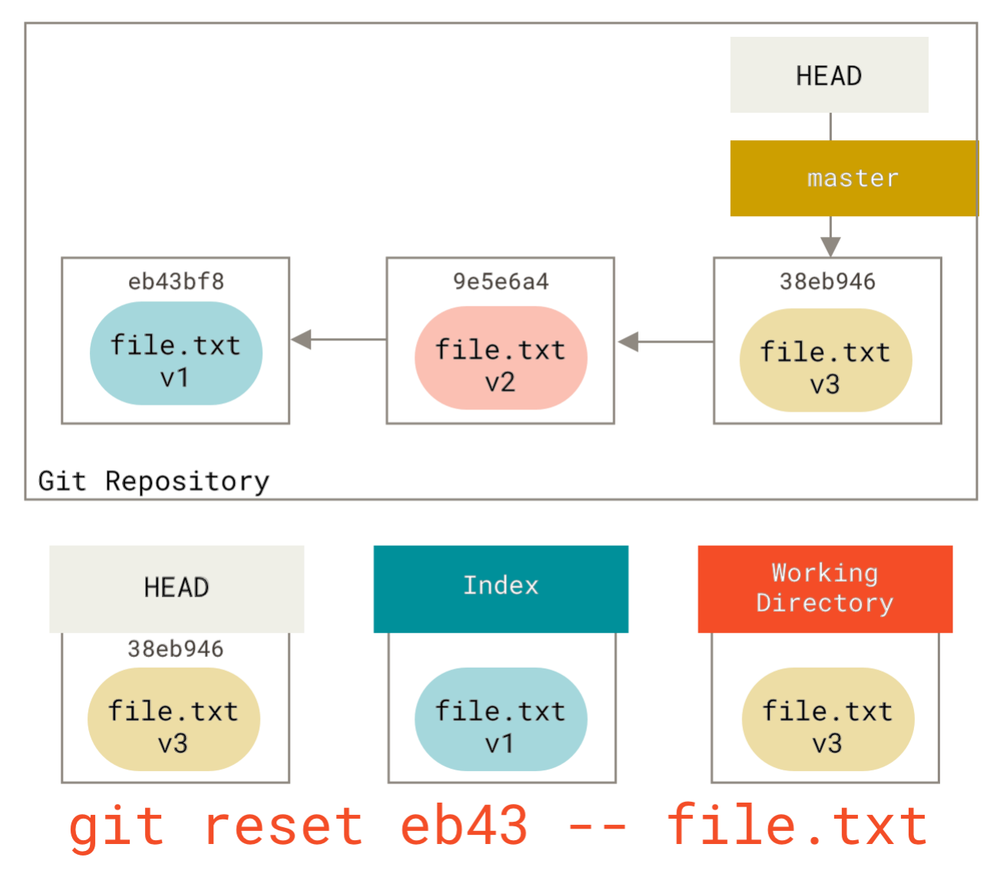

还有一点同 git add 一样，就是 reset 命令也可以接受一个 --patch 选项来一块一块地取消暂存的内容。 这样你就可以根据选择来取消暂存或恢复内容了。

### 7.5 压缩

假设你有一个项目，第一次提交中有一个文件，第二次提交增加了一个新的文件并修改了第一个文件，第三次提交再次修改了第一个文件。 由于第二次提交是一个未完成的工作，因此你想要压缩它。

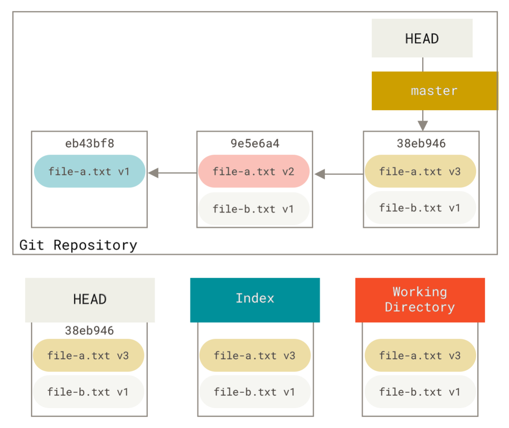

那么可以运行`git reset --soft HEAD~2`来将 HEAD 分支移动到一个旧一点的提交上（即你想要保留的最近的提交）：

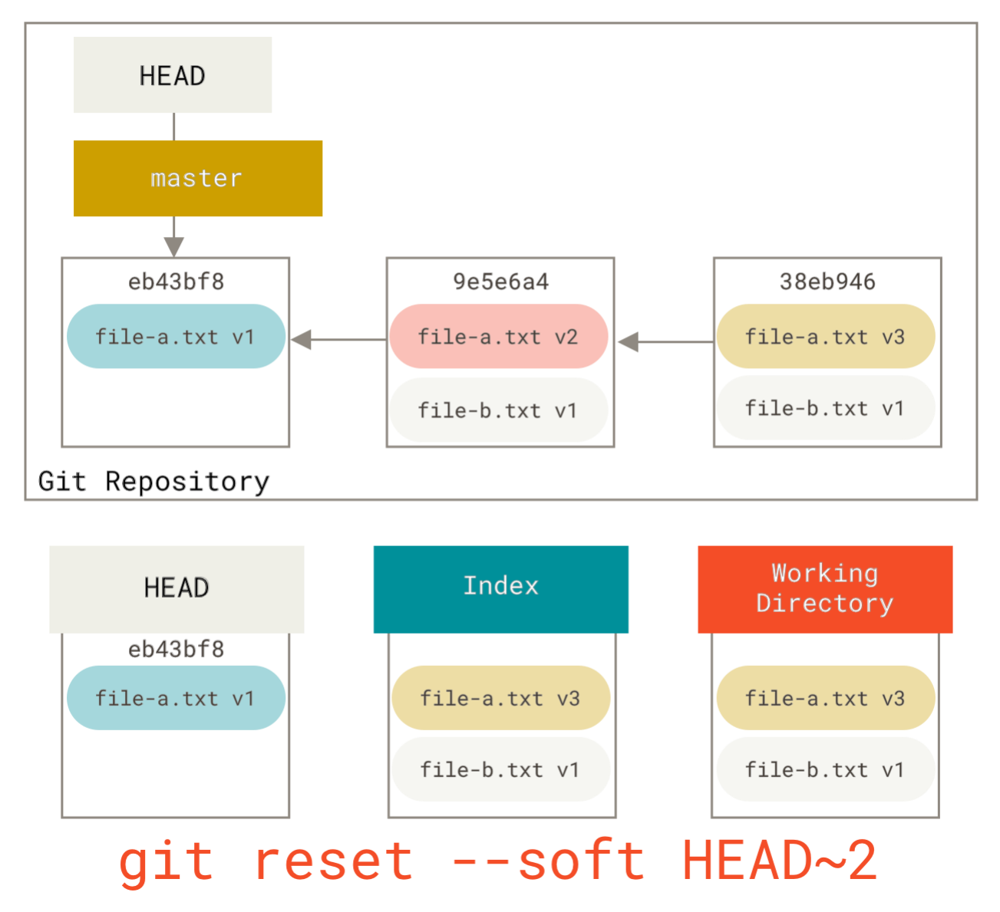

修改后只需再次运行`git commit`：

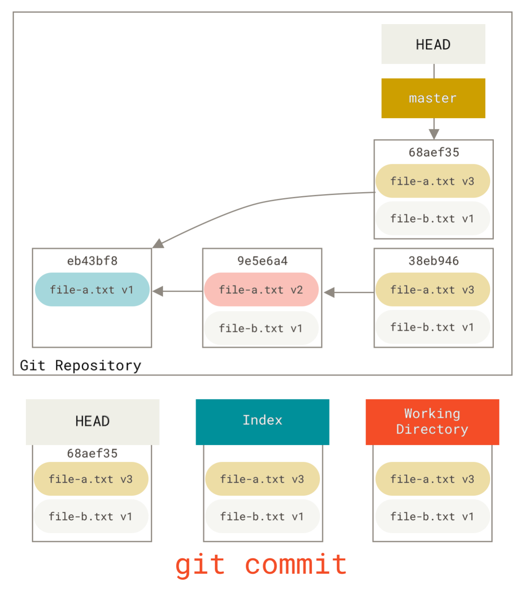

### 7.6 检出

最后，你大概还想知道`checkout`和`reset`之间的区别。和`reset`一样，`checkout`也操纵三棵树，不过它有一点不同，这取决于你是否传给该命令一个文件路径。

#### 1.不带路径

运行`git checkout [branch]`与运行`git reset --hard [branch]`非常相似，它会更新所有三棵树，不过有两点重要的区别。

首先不同于`reset --hard`，`checkout`对工作目录是安全的，它会通过检查来确保不会将已更改的文件弄丢。 其实它还更聪明一些。它会在工作目录中先试着简单合并一下，这样所有还未修改过的 文件都会被更新。而`reset --hard`则会不做检查就全面地替换所有东西。

第二个重要的区别是`reset`会移动 HEAD 分支的指向，而`checkout`会移动 HEAD 自身来指向另一个分支。

例如，假设我们有 master 和 develop 分支，它们分别指向不同的提交；我们现在在 develop 上（所以 HEAD 指向它）。 如果我们运行`git reset master`，那么 develop 自身现在会和 master 指向同一个提交。 而如果我们运行`git checkout master`的话，develop 不会移动，HEAD 自身会移动。 现在 HEAD 将会指向 master。

所以，虽然在这两种情况下我们都移动 HEAD 使其指向了提交 A，但 做法 是非常不同的。`reset`会移动 HEAD分支的指向，而`checkout`则移动 HEAD 自身。

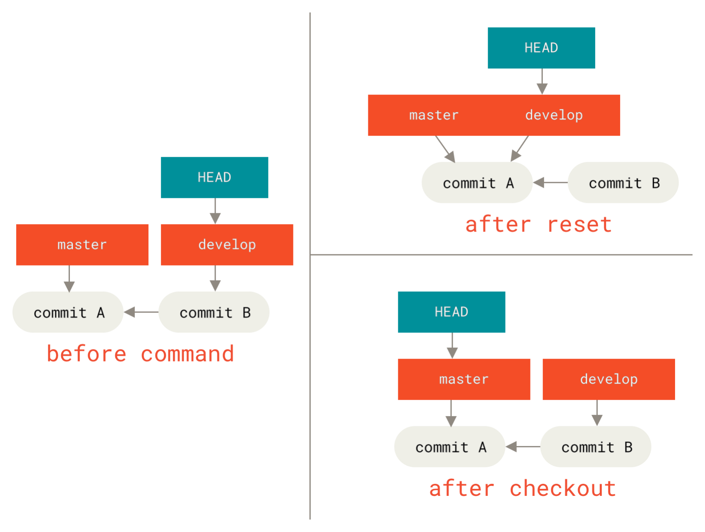

#### 2.带路径

运行 checkout 的另一种方式就是指定一个文件路径，这会像 reset 一样不会移动 HEAD。 它就像`git reset [branch] file`那样用该次提交中的那个文件来更新索引，但是它也会覆盖工作目录中对应的文件。它就像是`git reset --hard [branch] file`（但是 reset 不允许这样运行）， 这样对工作目录并不安全，它也不会移动 HEAD。

此外，同`git reset`和`git add`一样，`checkout`也接受一个`--patch`选项，允许你根据选择一块一块地恢复文件内容。

## 8.高级合并


## 9.Rerere


## 10.调试


## 11.子模块


## 12.打包


## 13.替换


## 14.凭证存储

