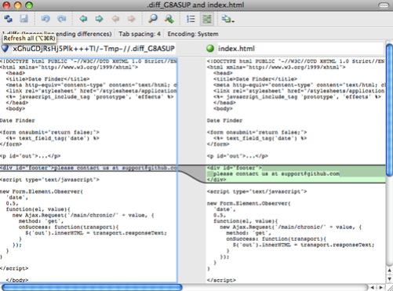
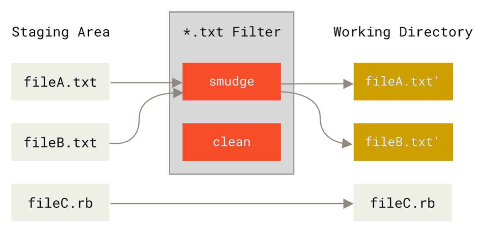
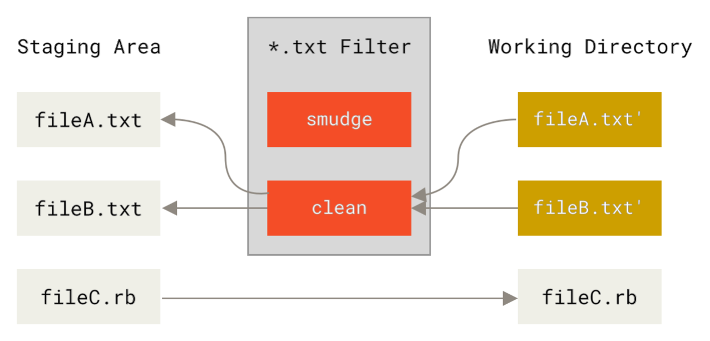

# 第8章_自定义Git

## 1.配置Git

可以用`git config`配置 Git。 首先要做的事情就是设置你的名字和邮件地址：

```bash
$ git config --global user.name "John Doe"
$ git config --global user.email johndoe@example.com
```

首先，快速回忆下：Git 使用一系列配置文件来保存你自定义的行为。 它首先会查找系统级的 /etc/gitconfig 文件，该文件含有系统里每位用户及他们所拥有的仓库的配置值。 如果你传递`--system`选项给`git config`，它就会读写该文件。

接下来 Git 会查找每个用户的 ~/.gitconfig 文件（或者 ~/.config/git/config 文件）。 你可以传递`--global`选项让 Git 读写该文件。

最后 Git 会查找你正在操作的仓库所对应的 Git 目录下的配置文件（.git/config）。 这个文件中的值只对该仓库有效，它对应于向`git config`传递`--local`选项。

以上三个层次中每层的配置（系统、全局、本地）都会覆盖掉上一层次的配置，所以 .git/config 中的值会覆盖掉 /etc/gitconfig 中所对应的值。

### 1.1 客户端基本配置

Git 能够识别的配置项分为两大类：客户端和服务器端。 其中大部分属于客户端配置。我们只讲述最平常和最有用的选项。 如果想得到你当前版本的 Git 支持的选项列表，请运行：

```bash
$ man git-config
```

这个命令列出了所有可用的选项，以及与之相关的介绍。 你也可以在 http://git-scm.com/docs/git-config 找到同样的内容。

**core.editor**

默认情况下，Git 会调用你通过环境变量`$VISUAL`或`$EDITOR`设置的文本编辑器， 如果没有设置，默认则会调用 vi 来创建和编辑你的提交以及标签信息。 你可以使用`core.editor`选项来修改默认的编辑器：

```bash
$ git config --global core.editor emacs
```

现在，无论你定义了什么终端编辑器，Git 都会调用 Emacs 编辑信息。

**commit.template**

如果把此项指定为你的系统上某个文件的路径，当你提交的时候， Git 会使用该文件的内容作为提交的默认初始化信息。 创建的自定义提交模版中的值可以用来提示自己或他人适当的提交格式和风格。

例如：考虑 ~/.gitmessage.txt 模板文件：

```bash
Subject line (try to keep under 50 characters)

Multi-line description of commit,
feel free to be detailed.

[Ticket: X]
```

注意此提交模版是如何提示提交者保持主题的简短（为了精简`git log --oneline`的输出）， 如何在后面添加进一步的详情，如何引用问题和 bug 跟踪系统的工单号（Ticket），如果有的话。

要想让 Git 把它作为运行`git commit`时显示在你的编辑器中的默认信息，如下设置`commit.template`：

```bash
$ git config --global commit.template ~/.gitmessage.txt
$ git commit
```

当你提交时，编辑器中就会显示如下的提交信息占位符：

```bash
Subject line (try to keep under 50 characters)

Multi-line description of commit,
feel free to be detailed.

[Ticket: X]
# Please enter the commit message for your changes. Lines starting
# with '#' will be ignored, and an empty message aborts the commit.
# On branch master
# Changes to be committed:
#   (use "git reset HEAD <file>..." to unstage)
#
# modified:   lib/test.rb
#
~
~
".git/COMMIT_EDITMSG" 14L, 297C
```

如果你的团队对提交信息有格式要求，可以在系统上创建一个文件，并配置 Git 把它作为默认的模板，这样可以更加容易地使提交信息遵循格式。

**core.pager**

该配置项指定 Git 运行诸如 log 和 diff 等命令所使用的分页器。 你可以把它设置成用 more 或者任何你喜欢的分页器（默认用的是 less），当然也可以设置成空字符串，关闭该选项：

```bash
$ git config --global core.pager ''
```

这样不管命令的输出量多少，Git 都会在一页显示所有内容。

**user.signingkey**

如果你要创建经签署的含附注的标签， 那么把你的 GPG 签署密钥设置为配置项会更好。如下设置你的密钥 ID：

```bash
$ git config --global user.signingkey <gpg-key-id>
```

现在，你每次运行 git tag 命令时，即可直接签署标签，而无需定义密钥：

```bash
$ git tag -s <tag-name>
```

**core.excludesfile**

你可以在你的项目的 .gitignore 文件里面规定无需纳入 Git 管理的文件的模板，这样它们既不会出现在未跟踪列表， 也不会在你运行`git add`后被暂存。

不过有些时候，你想要在你所有的版本库中忽略掉某一类文件。 如果你的操作系统是 macOS，很可能就是指 .DS_Store。 如果你把 Emacs 或 Vim 作为首选的编辑器，你肯定知道以 ~ 结尾的文件名。

这个配置允许你设置类似于全局生效的 .gitignore 文件。 如果你按照下面的内容创建一个 ~/.gitignore_global 文件：

```bash
*~
.*.swp
.DS_Store
```

然后运行`git config --global core.excludesfile ~/.gitignore_global`，Git 将把那些文件永远地拒之门外。

**help.autocorrect**

假如你打错了一条命令，会显示：

```bash
$ git chekcout master
git：'chekcout' 不是一个 git 命令。参见 'git --help'。
您指的是这个么？
  checkout
```

Git 会尝试猜测你的意图，但是它不会越俎代庖。 如果你把`help.autocorrect`设置成 1，那么只要有一个命令被模糊匹配到了，Git 会自动运行该命令。

```bash
$ git chekcout master
警告：您运行一个不存在的 Git 命令 'chekcout'。继续执行假定您要要运行的是 'checkout'
在 0.1 秒钟后自动运行...
```

注意提示信息中的“0.1 秒”。help.autocorrect 接受一个代表十分之一秒的整数。 所以如果你把它设置为50，Git 将在自动执行命令前给你 5 秒的时间改变主意。

### 1.2 Git中的着色

Git 充分支持对终端内容着色，对你凭肉眼简单、快速分析命令输出有很大帮助。

**color.ui**

Git 会自动着色大部分输出内容，但如果你不喜欢花花绿绿，也可以关掉。 要想关掉 Git 的终端颜色输出，试一下这个：

```bash
$ git config --global color.ui false
```

这个设置的默认值是 auto，它会着色直接输出到终端的内容；而当内容被重定向到一个管道或文件时，则忽略着色功能。

你也可以设置成 always，来忽略掉管道和终端的不同，即在任何情况下着色输出。你很少会这么设置，在大多数场合下，如果你想在被重定向的输出中插入颜色码，可以传递`--color`标志给 Git 命令来强制它这么做。 默认设置就已经能满足大多数情况下的需求了。

**color.***

要想具体到哪些命令输出需要被着色以及怎样着色，你需要用到和具体命令有关的颜色配置选项。 它们都能被置为 true、false 或 always：

```bash
color.branch
color.diff
color.interactive
color.status
```

另外，以上每个配置项都有子选项，它们可以被用来覆盖其父设置，以达到为输出的各个部分着色的目的。 例如，为了让 diff 的输出信息以蓝色前景、黑色背景和粗体显示，你可以运行

```bash
$ git config --global color.diff.meta "blue black bold"
```

你能设置的颜色有：normal、black、red、green、yellow、blue、magenta、cyan 或 white。 正如以上例子设置的粗体属性，想要设置字体属性的话，可以选择包括：bold、dim、ul（下划线）、blink、reverse（交换前景色和背景色）。

### 1.3 外部的合并与比较工具

 虽然 Git 自己内置了一个 diff 实现，而且到目前为止我们一直在使用它，但你能够用一个外部的工具替代它。 除此以外，你还能设置一个图形化的工具来合并和解决冲突，从而不必自己手动解决。 这里我们以一个不错且免费的工具 —— Perforce 图形化合并工具（P4Merge） —— 来展示如何用一个外部的工具来合并和解决冲突。

P4Merge 可以在所有主流平台上运行，所以安装上应该没有什么困难。 在这个例子中，我们使用的路径名可以直接应用在 macOS 和 Linux 上； 在 Windows 上，/usr/local/bin 需要被改为你的环境中可执行文件所在的目录路径。

首先，[下载 P4Merge](https://www.perforce.com/product/components/perforce-visual-merge-and-diff-tools)。 接下来，你要编写一个全局包装脚本来运行你的命令。 我们会使用 Mac 上的路径来指定该脚本的位置，在其他系统上，它将是 p4merge 二进制文件所在的目录。 创建一个名为 extMerge 的脚本包装 merge 命令，让它把参数转发给 p4merge 二进制文件：

```bash
$ cat /usr/local/bin/extMerge
#!/bin/sh
/Applications/p4merge.app/Contents/MacOS/p4merge $*
```

包装 diff 命令的脚本首先确保传递了七个参数过来，随后把其中两个转发给包装了 merge 的脚本。 默认情况下，Git 传递以下参数给 diff：

```bash
path old-file old-hex old-mode new-file new-hex new-mode
```

由于你仅仅需要`old-file`和`new-file`参数，由包装 diff 的脚本来转发它们吧。

```basj
$ cat /usr/local/bin/extDiff
#!/bin/sh
[ $# -eq 7 ] && /usr/local/bin/extMerge "$2" "$5"
```

你也需要确保这些脚本具有可执行权限：

```bash
$ sudo chmod +x /usr/local/bin/extMerge
$ sudo chmod +x /usr/local/bin/extDiff
```

现在你可以修改配置文件来使用你自定义的合并和比较工具了。 这将涉及许多自定义设置：merge.tool 通知 Git 该使用哪个合并工具，`mergetool.<tool>.cmd`规定命令运行的方式，`mergetool.<tool>.trustExitCode`会通知 Git 程序的返回值是否表示合并操作成功，`diff.external`通知 Git 该用什么命令做比较。 因此，你可以运行以下四条配置命令：

```bash
$ git config --global merge.tool extMerge
$ git config --global mergetool.extMerge.cmd \
  'extMerge "$BASE" "$LOCAL" "$REMOTE" "$MERGED"'
$ git config --global mergetool.extMerge.trustExitCode false
$ git config --global diff.external extDiff
```

或编辑你的 ~/.gitconfig 文件，添加以下各行：

```bash
[merge]
  tool = extMerge
[mergetool "extMerge"]
  cmd = extMerge "$BASE" "$LOCAL" "$REMOTE" "$MERGED"
  trustExitCode = false
[diff]
  external = extDiff
```

待一切设置妥当后，如果你像这样运行 diff 命令：

```basj
$ git diff 32d1776b1^ 32d1776b1
```

Git 将启动 P4Merge，而不是在命令行输出比较的结果，就像这样：



如果你尝试合并两个分支，随后遇到了合并冲突，运行 git mergetool，Git 会调用 P4Merge 让你通过图形界面来解决冲突。

设置包装脚本的好处在于大大降低了改变 diff 和 merge 工具的工作量。 举个例子，想把 extDiff 和 extMerge 的工具改成 KDiff3，你要做的仅仅是编辑 extMerge 脚本文件：

```bash
$ cat /usr/local/bin/extMerge
#!/bin/sh
/Applications/kdiff3.app/Contents/MacOS/kdiff3 $*
```

现在，Git 将使用 KDiff3 作为查看比较和解决合并冲突的工具。

Git 预设了许多其他的合并和解决冲突的工具，无需特别的设置你就能用上它们。 要想看到它支持的工具列表，试一下这个：

```bash
$ git mergetool --tool-help
'git mergetool --tool=<tool>' may be set to one of the following:
        emerge
        gvimdiff
        gvimdiff2
        opendiff
        p4merge
        vimdiff
        vimdiff2

The following tools are valid, but not currently available:
        araxis
        bc3
        codecompare
        deltawalker
        diffmerge
        diffuse
        ecmerge
        kdiff3
        meld
        tkdiff
        tortoisemerge
        xxdiff

Some of the tools listed above only work in a windowed
environment. If run in a terminal-only session, they will fail.
```

如果你不想用到 KDiff3 的所有功能，只是想用它来合并，那么 kdiff3 正符合你的要求，运行：

```bash
$ git config --global merge.tool kdiff3
```

如果运行了以上命令，而没有设置 extMerge 和 extDiff 文件，Git 会用 KDiff3 做合并，让内置的 diff 来做比较。

### 1.4 格式化与多余的空白字符

格式化与多余的空白字符是许多开发人员在协作时，特别是在跨平台情况下，不时会遇到的令人头疼的琐碎的问题。 由于编辑器的不同或者文件行尾的换行符在 Windows 下被替换了，一些细微的空格变化会不经意地混入提交的补丁或其它协作成果中。 不用怕，Git 提供了一些配置项来帮助你解决这些问题。

**core.autocrlf**

假如你正在 Windows 上写程序，而你的同伴用的是其他系统（或相反），你可能会遇到 CRLF 问题。 这是因为 Windows 使用回车（CR）和换行（LF）两个字符来结束一行，而 macOS 和 Linux 只使用换行（LF）一个字符。 虽然这是小问题，但它会极大地扰乱跨平台协作。许多 Windows 上的编辑器会悄悄把行尾的换行字符转换成回车和换行， 或在用户按下 Enter 键时，插入回车和换行两个字符。

Git 可以在你提交时自动地把回车和换行转换成换行，而在检出代码时把换行转换成回车和换行。 你可以用`core.autocrlf`来打开此项功能。 如果是在 Windows 系统上，把它设置成 true，这样在检出代码时，换行会被转换成回车和换行：

```bash
$ git config --global core.autocrlf true
```

如果使用以换行作为行结束符的 Linux 或 macOS，你不需要 Git 在检出文件时进行自动的转换； 然而当一个以回车加换行作为行结束符的文件不小心被引入时，你肯定想让 Git 修正。 你可以把`core.autocrlf`设置成 input 来告诉 Git 在提交时把回车和换行转换成换行，检出时不转换：

```bash
$ git config --global core.autocrlf input
```

这样在 Windows 上的检出文件中会保留回车和换行，而在 macOS 和 Linux 上，以及版本库中会保留换行。

如果你是 Windows 程序员，且正在开发仅运行在 Windows 上的项目，可以设置 false 取消此功能，把回车保留在版本库中：

```bash
$ git config --global core.autocrlf false
```

Git 预先设置了一些选项来探测和修正多余空白字符问题。 它提供了六种处理多余空白字符的主要选项 —— 其中三个默认开启，另外三个默认关闭，不过你可以自由地设置它们。

默认被打开的三个选项是：`blank-at-eol`，查找行尾的空格；`blank-at-eof`，盯住文件底部的空行；`space-before-tab`，警惕行头 tab 前面的空格。

默认被关闭的三个选项是：`indent-with-non-tab`，揪出以空格而非 tab 开头的行（你可以用 tabwidth 选项控制它）；`tab-in-indent`，监视在行头表示缩进的 tab；`cr-at-eol`，告诉 Git 忽略行尾的回车。

通过设置`core.whitespace`，你可以让 Git 按照你的意图来打开或关闭以逗号分割的选项。 要想关闭某个选项，你可以在输入设置选项时不指定它或在它前面加个`-`。例如，如果你想要打开除`space-before-tab`之外的所有选项，那么可以这样 （`trailing-space`涵盖了`blank-at-eol`和`blank-at-eof`）：

```bash
$ git config --global core.whitespace trailing-space,-space-before-tab,indent-with-non-tab,tab-in-indent,cr-at-eol
```

你也可以只指定自定义的部分：

```bash
$ git config --global core.whitespace -space-before-tab,indent-with-non-tab,tab-in-indent,cr-at-eol
```

当你运行`git diff`命令并尝试给输出着色时，Git 将探测到这些问题，因此你在提交前就能修复它们。 用`git apply`打补丁时你也会从中受益。 如果正准备应用的补丁存有特定的空白问题，你可以让 Git 在应用补丁时发出警告：

```bash
$ git apply --whitespace=warn <patch>
```

或者让 Git 在打上补丁前自动修正此问题：

```basj
$ git apply --whitespace=fix <patch>
```

这些选项也能运用于`git rebase`。 如果提交了有空白问题的文件，但还没推送到上游，你可以运行`git rebase --whitespace=fix`来让 Git 在重写补丁时自动修正它们。

### 1.5 服务器端配置

Git 服务器端的配置项相对来说并不多，但仍有一些饶有生趣的选项值得你一看。

**receive.fsckObjects**

Git 能够确认每个对象的有效性以及 SHA-1 检验和是否保持一致。 但 Git 不会在每次推送时都这么做。这个操作很耗时间，很有可能会拖慢提交的过程，特别是当库或推送的文件很大的情况下。 如果想在每次推送时都要求 Git 检查一致性，设置`receive.fsckObjects`为 true 来强迫它这么做：

```bash
$ git config --system receive.fsckObjects true
```

现在 Git 会在每次推送生效前检查库的完整性，确保没有被有问题的客户端引入破坏性数据。

**receive.denyNonFastForwards**

如果你变基已经被推送的提交，继而再推送，又或者推送一个提交到远程分支，而这个远程分支当前指向的提交不在该提交的历史中，这样的推送会被拒绝。 这通常是个很好的策略，但有时在变基的过程中，你确信自己需要更新远程分支，可以在`push`命令后加`-f`标志来强制更新（force-update）。

要禁用这样的强制更新推送（force-pushes），可以设置`receive.denyNonFastForwards`：

```bash
$ git config --system receive.denyNonFastForwards true
```

稍后我们会提到，用服务器端的接收钩子也能达到同样的目的。 那种方法可以做到更细致的控制，例如禁止某一类用户做非快进（non-fast-forwards）推送。

**receive.denyDeletes**

有一些方法可以绕过`denyNonFastForwards`策略。其中一种是先删除某个分支，再连同新的引用一起推送回该分支。 把`receive.denyDeletes`设置为 true 可以把这个漏洞补上：

```bash
$ git config --system receive.denyDeletes true
```

这样会禁止通过推送删除分支和标签 — 没有用户可以这么做。 要删除远程分支，必须从服务器手动删除引用文件。 通过用户访问控制列表（ACL）也能够在用户级的粒度上实现同样的功能， 你将在 使用强制策略的一个例子 一节学到具体的做法。

## 2.Git属性

你也可以针对特定的路径配置某些设置项，这样 Git 就只对特定的子目录或子文件集运用它们。 这些基于路径的设置项被称为 Git 属性，可以在你的目录下的 .gitattributes 文件内进行设置（通常是你的项目的根目录）。如果不想让这些属性文件与其它文件一同提交，你也可以在 .git/info/attributes 文件中进行设置。

通过使用属性，你可以对项目中的文件或目录单独定义不同的合并策略，让 Git 知道怎样比较非文本文件，或者让 Git 在提交或检出前过滤内容。 在本节，你将学习到一些能在自己的项目中用到的属性，并看到几个实际的例子。

### 2.1 二进制文件

你可以用 Git 属性让 Git 知道哪些是二进制文件（以防它没有识别出来），并指示其如何处理这些文件。 例如，一些文本文件是由机器产生的，没有办法进行比较，但是一些二进制文件可以比较。 你将了解到怎样让 Git区分这些文件。

#### 1.识别二进制文件

有些文件表面上是文本文件，实质上应被作为二进制文件处理。 例如，macOS 平台上的 Xcode 项目会包含一个以 .pbxproj 结尾的文件， 它通常是一个记录项目构建配置等信息的 JSON（纯文本 Javascript 数据类型）数据集，由 IDE 写入磁盘。 虽然技术上看它是由 UTF-8 编码的文本文件，但你并不会希望将它当作文本文件来处理， 因为它其实是一个轻量级数据库——如果有两个人修改了它，你通常无法合并内容，diff 的输出也帮不上什么忙。 它本应被机器处理。因此，你想把它当成二进制文件。

要让 Git 把所有 pbxproj 文件当成二进制文件，在 .gitattributes 文件中如下设置：

```bash
*.pbxproj binary
```

现在，Git 不会尝试转换或修正回车换行（CRLF）问题，当你在项目中运行`git show`或`git diff`时，Git 也不会比较或打印该文件的变化。

#### 2.比较二进制文件

你也可以使用 Git 属性来有效地比较两个二进制文件。 秘诀在于，告诉 Git 怎么把你的二进制文件转化为文本格式，从而能够使用普通的 diff 方式进行对比。

首先，让我们尝试用这个技术解决世人最头疼的问题之一：对 Microsoft Word 文档进行版本控制。 大家都知道，Microsoft Word 几乎是世上最难缠的编辑器，尽管如此，大家还是在用它。 如果想对 Word 文档进行版本控制，你可以把文件加入到 Git 库中，每次修改后提交即可。但这样做有什么实际意义呢？ 毕竟运行`git diff`命令后，你只能得到如下的结果：

```bash
$ git diff
diff --git a/chapter1.docx b/chapter1.docx
index 88839c4..4afcb7c 100644
Binary files a/chapter1.docx and b/chapter1.docx differ
```

除了检出之后睁大眼睛逐行扫描，就真的没有办法直接比较两个不同版本的 Word 文档吗？ Git 属性能很好地解决此问题。 把下面这行文本加到你的 .gitattributes 文件中：

```bash
*.docx diff=word
```

这告诉 Git 当你尝试查看包含变更的比较结果时，所有匹配 .docx 模式的文件都应该使用“word”过滤器。“word”过滤器是什么？ 我们现在就来设置它。 我们会对 Git 进行配置，令其能够借助 docx2txt 程序将 Word 文档转为可读文本文件，这样不同的文件间就能够正确比较了。

首先，你需要安装**docx2txt**；它可以从 https://sourceforge.net/projects/docx2txt 下载。 按照 INSTALL 文件的说明，把它放到你的可执行路径下。 接下来，你还需要写一个脚本把输出结果包装成 Git 支持的格式。 在你的可执行路径下创建一个叫 docx2txt 文件，添加这些内容：

```bash
#!/bin/bash
docx2txt.pl "$1" -
```

别忘了用 chmod a+x 给这个文件加上可执行权限。 最后，你需要配置 Git 来使用这个脚本：

```bash
$ git config diff.word.textconv docx2txt
```

现在如果在两个快照之间进行比较，Git 就会对那些以 .docx 结尾的文件应用“word”过滤器，即 docx2txt。 这样你的 Word 文件就能被高效地转换成文本文件并进行比较了。

你还能用这个方法比较图像文件。 其中一个办法是，在比较时对图像文件运用一个过滤器，提炼出 EXIF 信息——这是在大部分图像格式中都有记录的一种元数据。 如果你下载并安装了**exiftool**程序，可以利用它将图像转换为关于元数据的文本信息，这样比较时至少能以文本的形式显示发生过的变动： 将以下内容放到你的 .gitattributes 文件中：

```bash
*.png diff=exif
```

配置 Git 以使用此工具：

```bash
$ git config diff.exif.textconv exiftool
```

如果在项目中替换了一个图像文件，运行`git diff`命令的结果如下：

```bash
diff --git a/image.png b/image.png
index 88839c4..4afcb7c 100644
--- a/image.png
+++ b/image.png
@@ -1,12 +1,12 @@
 ExifTool Version Number         : 7.74
-File Size                       : 70 kB
-File Modification Date/Time     : 2009:04:21 07:02:45-07:00
+File Size                       : 94 kB
+File Modification Date/Time     : 2009:04:21 07:02:43-07:00
 File Type                       : PNG
 MIME Type                       : image/png
-Image Width                     : 1058
-Image Height                    : 889
+Image Width                     : 1056
+Image Height                    : 827
 Bit Depth                       : 8
 Color Type                      : RGB with Alpha
```

### 2.2 关键字展开

SVN 或 CVS 风格的关键字展开（keyword expansion）功能经常会被习惯于上述系统的开发者使用到。 在 Git中，这项功能有一个主要问题，就是你无法利用它往文件中加入其关联提交的相关信息，因为 Git 总是先对文件做校验和运算（译者注：Git 中提交对象的校验依赖于文件的校验和，而 Git 属性针对特定文件或路径，因此基于 Git 属性的关键字展开无法仅根据文件反推出对应的提交）。 不过，我们可以在检出某个文件后对其注入文本，并在再次提交前删除这些文本。 Git 属性提供了两种方法来达到这一目的。

一种方法是，你可以把文件所对应数据对象的 SHA-1 校验和自动注入到文件中的`$Id$`字段。 如果在一个或多个文件上设置了该属性，下次当你检出相关分支的时候，Git 会用相应数据对象的 SHA-1 值替换上述字段。 注意，这不是提交对象的 SHA-1 校验和，而是数据对象本身的校验和。 将以下内容放到你的 .gitattributes文件中：

```bash
*.txt ident
```

在一个测试文件中添加一个`$Id$`引用：

```bash
$ echo '$Id$' > test.txt
```

当你下次检出文件时，Git 将注入数据对象的 SHA-1 校验和：

```bash
$ rm test.txt
$ git checkout -- test.txt
$ cat test.txt
$Id: 42812b7653c7b88933f8a9d6cad0ca16714b9bb3 $
```

然而，这个结果的用途比较有限。 如果用过 CVS 或 Subversion 的关键字替换功能，我们会想加上一个时间戳信息——光有 SHA-1 校验和用途不大， 它仅仅是个随机字符串，你无法凭字面值来区分不同 SHA-1 时间上的先后。

因此 Git 属性提供了另一种方法：我们可以编写自己的过滤器来实现文件提交或检出时的关键字替换。 一个过滤器由“clean”和“smudge”两个子过滤器组成。 在 .gitattributes 文件中，你能对特定的路径设置一个过滤器，然后设置文件检出前的处理脚本（“smudge” 过滤器会在文件被检出时触发）和文件暂存前的处理脚本（“clean” 过滤器会在文件被暂存时触发）。 这两个过滤器能够被用来做各种有趣的事。





在（Git 源码中）实现这个特性的原始提交信息里给出了一个简单的例子：在提交前，用 indent 程序过滤所有 C 源码。 你可以在 .gitattributes 文件中对 filter 属性设置 “indent” 过滤器来过滤 *.c 文件：

```bash
*.c filter=indent
```

然后，通过以下配置，让 Git 知道“indent”过滤器在 smudge 和 clean 时分别该做什么：

```bash
$ git config --global filter.indent.clean indent
$ git config --global filter.indent.smudge cat
```

在这个例子中，当你暂存 *.c 文件时，indent 程序会先被触发；在把它们检出回硬盘时，cat 程序会先被触发。 cat 在这里没什么实际作用：它仅仅把输入的数据重新输出。 这样的组合可以有效地在暂存前用 indent 过滤所有的 C 源码。

另一个有趣的例子是实现 RCS 风格的`$Date$`关键字展开。 要想演示这个例子，我们需要实现这样的一个小脚本：接受文件名参数，得到项目的最新提交日期，并把日期写入该文件。 下面是一个实现了该功能的 Ruby 小脚本：

```bash
#! /usr/bin/env ruby
data = STDIN.read
last_date = `git log --pretty=format:"%ad" -1`
puts data.gsub('$Date$', '$Date: ' + last_date.to_s + '$')
```

这个脚本从`git log`中得到最新提交日期，将其注入所有输入文件的`$Date$`字段，并输出结果——你可以使用最顺手的语言轻松实现一个类似的脚本。 把该脚本命名为 expand_date，放到你的可执行路径中。 现在，你需要在 Git 中设置一个过滤器（就叫它 dater 吧），让它在检出文件时调用你的 expand_date 来注入时间戳，完成 smudge 操作。 暂存文件时的 clean 操作则是用一行 Perl 表达式清除注入的内容：

```bash
$ git config filter.dater.smudge expand_date
$ git config filter.dater.clean perl -pe "s/\\\$Date[^\\\$]*\\\$/\\\$Date\\\$/"
```

这段 Perl 代码会删除`$Date$`后面注入的内容，恢复它的原貌。 过滤器终于准备完成了，是时候测试一下。创建一个带有`$Date$`关键字的文件， 然后给它设置一个 Git 属性，关联我们的新过滤器：

```bash
date*.txt filter=dater
```

```bash
$ echo '# $Date$' > date_test.txt
```

提交该文件，并再次检出，你会发现关键字如期被替换了：

```bash
$ git add date_test.txt .gitattributes
$ git commit -m "Testing date expansion in Git"
$ rm date_test.txt
$ git checkout date_test.txt
$ cat date_test.txt
# $Date: Tue Apr 21 07:26:52 2009 -0700$
```

自定义过滤器真的很强大。 不过你需要注意的是，因为 .gitattributes 文件会随着项目一起提交，而过滤器（例如这里的 dater）不会，所以过滤器有可能会失效。 当你在设计这些过滤器时，要注重容错性——它们在出错时应该能优雅地退出，从而不至于影响项目的正常运行。

### 2.3 导出版本库

Git 属性在导出项目归档（archive）时也能发挥作用。

**export-ignore**

当归档的时候，可以设置 Git 不导出某些文件和目录。 如果你不想在归档中包含某个子目录或文件，但想把它们纳入项目的版本管理中，你可以在 export-ignore 属性中指定它们。

例如，假设你在 test/ 子目录下有一些测试文件，不希望它们被包含在项目导出的压缩包（tarball）中。 你可以增加下面这行到 Git 属性文件中：

```bash
test/ export-ignore
```

现在，当你运行`git archive`来创建项目的压缩包时，那个目录不会被包括在归档中。

**export-subst**

在导出文件进行部署的时候，你可以将`git log`的格式化和关键字展开处理应用到标记了 export-subst 属性的部分文件。

举个例子，如果你想在项目中包含一个叫做 LAST_COMMIT 的文件， 并在运行`git archive`的时候自动向它注入最新提交的元数据，可以像这样设置 .gitattributes 和 LAST_COMMIT 该文件：

```bash
LAST_COMMIT export-subst
```

```bash
$ echo 'Last commit date: $Format:%cd by %aN$' > LAST_COMMIT
$ git add LAST_COMMIT .gitattributes
$ git commit -am 'adding LAST_COMMIT file for archives'
```

运行 git archive 之后，归档文件的内容会被替换成这样：

```bash
$ git archive HEAD | tar xCf ../deployment-testing -
$ cat ../deployment-testing/LAST_COMMIT
Last commit date: Tue Apr 21 08:38:48 2009 -0700 by Scott Chacon
```

你也可以用诸如提交信息或者任意的`git notes`进行替换，并且`git log`还能做简单的字词折行：

```bash
$ echo '$Format:Last commit: %h by %aN at %cd%n%+w(76,6,9)%B$' >
LAST_COMMIT
$ git commit -am 'export-subst uses git log'\''s custom formatter
git archive 直接使用 git log 的 `pretty=format:`
处理器，并在输出中移除两侧的 `$Format:` 和 `$`
标记。
'
$ git archive @ | tar xfO - LAST_COMMIT
Last commit: 312ccc8 by Jim Hill at Fri May 8 09:14:04 2015 -0700
       export-subst uses git log's custom formatter

         git archive uses git log's `pretty=format:` processor directly,
and
         strips the surrounding `$Format:` and `$` markup from the output.
```

由此得到的归档适用于（当前的）部署工作。然而和其他的导出归档一样，它并不适用于后继的部署工作。

### 2.4 合并策略

通过 Git 属性，你还能对项目中的特定文件指定不同的合并策略。 一个非常有用的选项就是，告诉 Git 当特定文件发生冲突时不要尝试合并它们，而是直接使用你这边的内容。

考虑如下场景：项目中有一个分叉的或者定制过的主题分支，你希望该分支上的更改能合并回你的主干分支，同时需要忽略其中某些文件。此时这个合并策略就能派上用场。 假设你有一个数据库设置文件 database.xml，在两个分支中它是不同的，而你想合并另一个分支到你的分支上，又不想弄乱该数据库文件。 你可以设置属性如下：

```bash
database.xml merge=ours
```

然后定义一个虚拟的合并策略，叫做 ours：

```bash
$ git config --global merge.ours.driver true
```

如果你合并了另一个分支，database.xml 文件不会有合并冲突，相反会显示如下信息：

```bash
$ git merge topic
Auto-merging database.xml
Merge made by recursive.
```

这里，database.xml 保持了主干分支中的原始版本。

## 3.Git钩子


## 4.强制策略

