# 第6章_GitHub

GitHub 是最大的 Git 版本库托管商，是成千上万的开发者和项目能够合作进行的中心。大部分 Git 版本库都托管在 GitHub，很多开源项目使用 GitHub 实现 Git 托管、问题追踪、代码审查以及其它事情。

## 1.账户的创建和配置

你所需要做的第一件事是创建一个免费账户。直接访问 https://github.com，选择一个未被占用的用户名，提供一个电子邮件地址和密码，点击写着 “Sign up for GitHub” 的绿色大按钮即可。注册完毕后，点击屏幕左上角的章鱼猫（Octocat）图标，你将来到控制面板页面。

### 1.1 SSH访问

现在，你完全可以使用 https:// 协议，通过你刚刚创建的用户名和密码访问 Git 版本库。但是，如果仅仅克隆公有项目，你甚至不需要注册——刚刚我们创建的账户是为了以后 fork 其它项目，以及推送我们自己的修改。

如果你习惯使用 SSH 远程，你需要配置一个公钥。使用窗口右上角的链接打开你的账户设置：

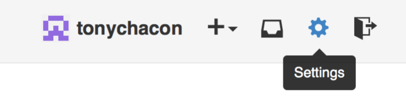

然后在左侧选择“SSH keys”部分。

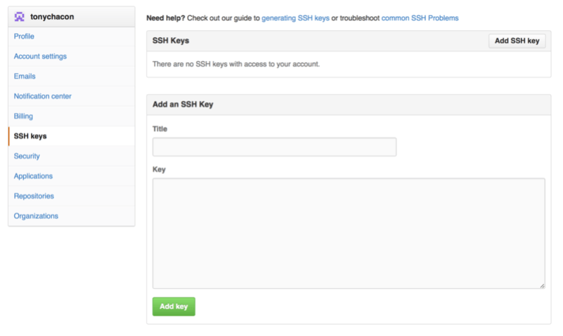

在这个页面点击“Add an SSH key”按钮，给你的公钥起一个名字，将你的 ~/.ssh/id_rsa.pub（或者自定义的其它名字）公钥文件的内容粘贴到文本区，然后点击“Add key”。

### 1.2 头像

下一步，如果愿意的话，你可以将生成的头像换成你喜欢的图片。首先，来到“Profile”标签页（在“SSH Keys”标签页上方），点击“Upload new picture”。

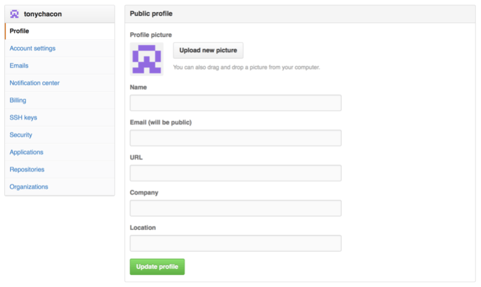

### 1.3 邮件地址

GitHub 使用用户邮件地址区分 Git 提交。如果你在自己的提交中使用了多个邮件地址，希望 GitHub 可以正确地将它们连接起来，你需要在管理页面的 Emails 部分添加你拥有的所有邮箱地址。

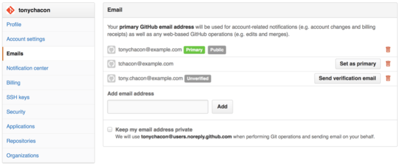

我们可以看到一些不同的状态。顶部的地址是通过验证的，并且被设置为主要地址，这意味着该地址会接收到所有的通知和回复。第二个地址是通过验证的，如果愿意的话，可以将其设置为主要地址。最后一个地址是未通过验证的，这意味着你不能将其设置为主要地址。当 GitHub 发现任意版本库中的任意提交信息包含了这些地址，它就会将其链接到你的账户。

### 1.4 两步验证

最后，为了额外的安全性，你绝对应当设置两步验证，简写为 “2FA”。两步验证是一种用于降低因你的密码被盗而带来的账户风险的验证机制，现在已经变得越来越流行。开启两步验证，GitHub 会要求你用两种不同的验证方法，这样，即使其中一个被攻破，攻击者也不能访问你的账户。

你可以在 Account settings 页面的 Security 标签页中找到 Two-factor Authentication 设置。

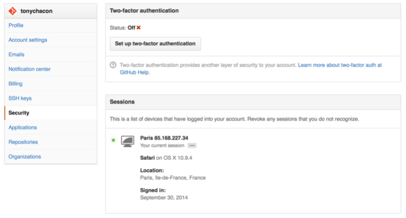

点击“Set up two-factor authentication”按钮，会跳转到设置页面。该页面允许你选择是要在登录时使用手机 app 生成辅助码（一种“基于时间的一次性密码”），还是要 GitHub 通过 SMS 发送辅助码。

选择合适的方法后，按照提示步骤设置 2FA，你的账户会变得更安全，每次登录 GitHub 时都需要提供除密码以外的辅助码。

## 2.对项目做出贡献

### 2.1 派生项目

如果你想要参与某个项目，但是并没有推送权限，这时可以对这个项目进行“派生（Fork）”。当你“派生”一个项目时，GitHub 会在你的空间中创建一个完全属于你的项目副本，且你对其具有推送权限。

> 在以前，“fork”是一个贬义词，指的是某个人使开源项目向不同的方向发展，或者创建一个竞争项目，使得原项目的贡献者分裂。在 GitHub，“fork”指的是你自己的空间中创建的项目副本，这个副本允许你以一种更开放的方式对其进行修改。

通过这种方式，项目的管理者不再需要忙着把用户添加到贡献者列表并给予他们推送权限。人们可以派生这个项目，将修改推送到派生出的项目副本中，并通过创建**拉取请求**（Pull Request，简称 PR）来让他们的改动进入源版本库，下文我们会详细说明。创建了拉取请求后，就会开启一个可供审查代码的板块，项目的拥有者和贡献者可以在此讨论相关修改，直到项目拥有者对其感到满意，并且认为这些修改可以被合并到版本库。

你可以通过点击项目页面右上角的“Fork”按钮，来派生这个项目。稍等片刻，你将被转到新项目页面，该项目包含可写的代码副本。

### 2.2 GitHub 流程

GitHub 设计了一个以拉取请求为中心的特殊合作流程，流程通常如下：

1. 派生一个项目
2. 从 master 分支创建一个新分支
3. 提交一些修改来改进项目
4. 将这个分支推送到 GitHub 上
5. 创建一个拉取请求
6. 讨论，根据实际情况继续修改
7. 项目的拥有者合并或关闭你的拉取请求
8. 将更新后的 master 分支同步到你的派生中

这基本和 集成管理者工作流 中的一体化管理流程差不多，但是团队可以使用 GitHub 提供的网页工具替代电子邮件来交流和审查修改。

现在我们来看一个使用这个流程的例子。

#### 1.创建拉取请求

Tony 在找一些能在他的 Arduino 微控制器上运行的代码，他觉得 https://github.com/schacon/blink 中的代码不错。

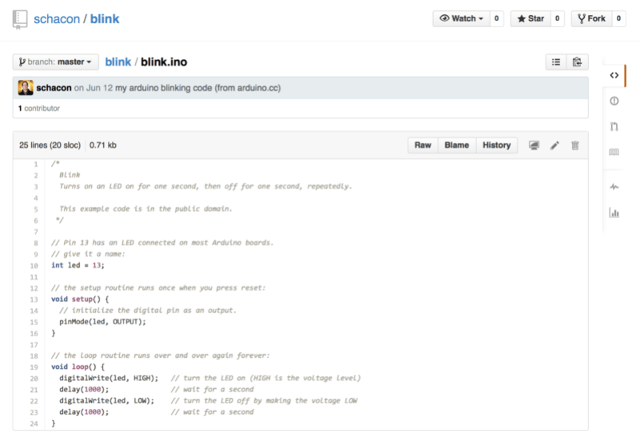

但是有个问题，这个代码中的的闪烁频率太高，我们觉得 3 秒一次比 1 秒一次更好一些。所以让我们来改进这个程序，并将修改后的代码提交给这个项目。

首先，单击“Fork”按钮来获得这个项目的副本。我们使用的用户名是“tonychacon”，所以这个项目副本的访问地址是：https://github.com/tonychacon/blink 。我们将它克隆到本地，创建一个分支，修改代码，最后再将改动推送到 GitHub。

```bash
$ git clone https://github.com/tonychacon/blink # 将派生出的副本克隆到本地
$ cd blink

$ git checkout -b slow-blink # 创建出名称有意义的分支

$ sed -i '' 's/1000/3000/' blink.ino (macOS) # 修改代码

# If you're on a Linux system, do this instead:
# $ sed -i 's/1000/3000/' blink.ino #3

$ git diff --word-diff # 检查改动

$ git commit -a -m 'three seconds is better' # 将改动提交到分支中

$ git push origin slow-blink # 将新分支推送到 GitHub 的副本中
```

现在到 GitHub 上查看之前的项目副本，可以看到 GitHub 提示我们有新的分支，并且显示了一个大大的绿色按钮让我们可以检查我们的改动，并给源项目创建拉取请求。

你也可以到“Branches”（分支）页面查看分支并创建拉取请求：`https://github.com/<用户名>/<项目名>/branches`

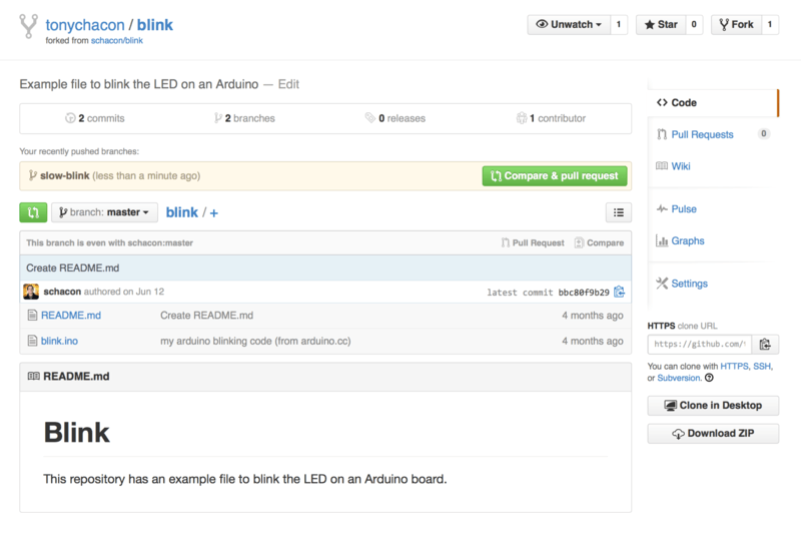

如果我们点击那个绿色按钮，就会跳到一个新页面，在这里我们可以为拉取请求填写标题和描述。花点时间编写一个清晰有用的描述是非常值得的，这能让原项目拥有者明白你做了什么，为什么这个改动是正确的，以及接受此更改是否能够改进他的项目。

同时我们也能看到比主分支中所“领先”（ahead）的提交（在这个例子中只有一个）以及所有将会被合并的改动与之前代码的对比。

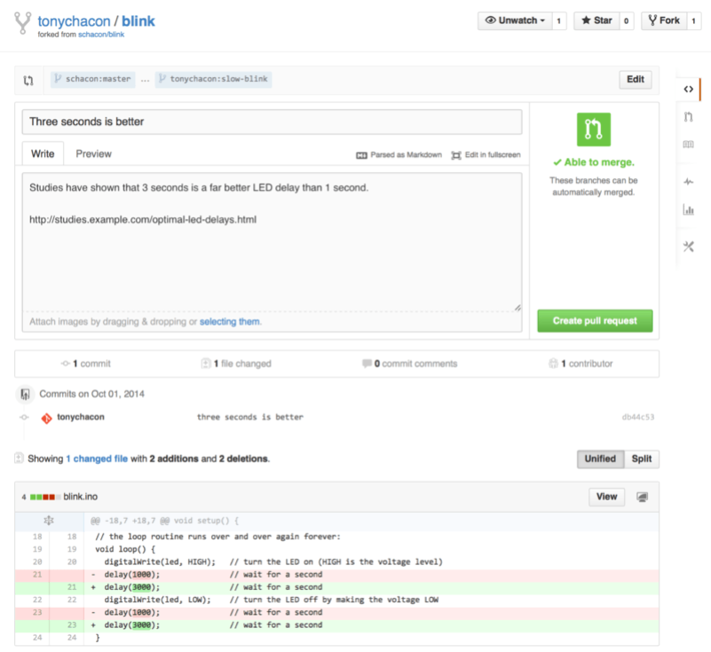

当你单击了“Create pull request”（创建拉取请求）的按钮后，这个项目的拥有者将会收到一条包含关改动和拉取请求页面的链接的提醒。

现在，项目的拥有者可以看到你的改动并合并它，拒绝它或是发表评论。接下来可能会通过电子邮件进行互动，就像我们在【分布式 Git】中提到的工作流程那样，但是在 GitHub，这些都在线上完成。项目的拥有者可以审查修改，只需要单击某一行，就可以对其发表评论。

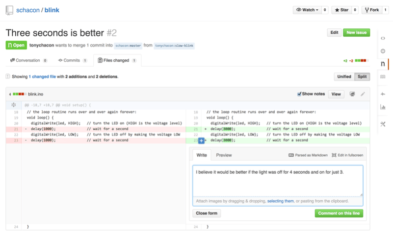

当维护者发表评论后，提交拉取请求的人，以及所有正在关注（Watching）这个版本库的用户都会收到通知。我们待会儿将会告诉你如何修改这项设置。现在，如果 Tony 有开启电子邮件提醒，他将会收到这样的一封邮件：

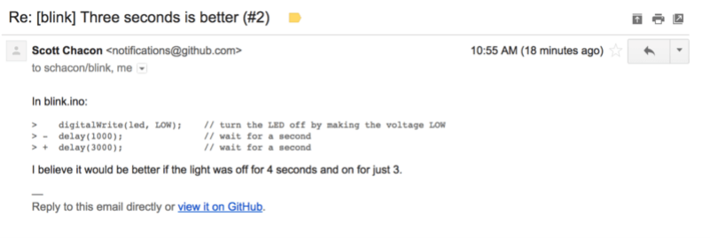

每个人都能在拉取请求中发表评论。我们可以看到项目拥有者对某行代码发表评论，并在讨论区留下了一个普通评论。你可以看到被评论的代码也会在互动中显示出来。

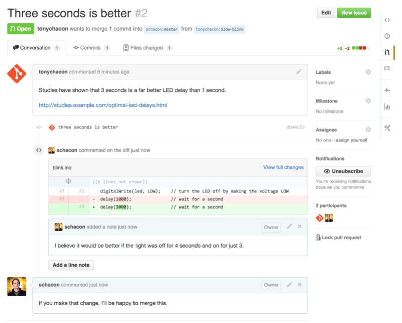

现在贡献者可以看到如何做才能让他们的改动被接受。幸运的是，这也是一件轻松的事情。如果你使用的是电子邮件进行交流，你需要再次对代码进行修改并重新提交至邮件列表，这些修改会自动更新到拉取请求上。在 最终的拉取请求 中，你也可以在更新后的拉取请求中看到已折叠的旧代码评论，因为它是在修改后的行上添加的评论。

对现有的拉取请求添加提交并不会触发提醒，因此 Tony 在推送了他的修正后，还需要通过评论告知项目拥有者他完成了修改请求。

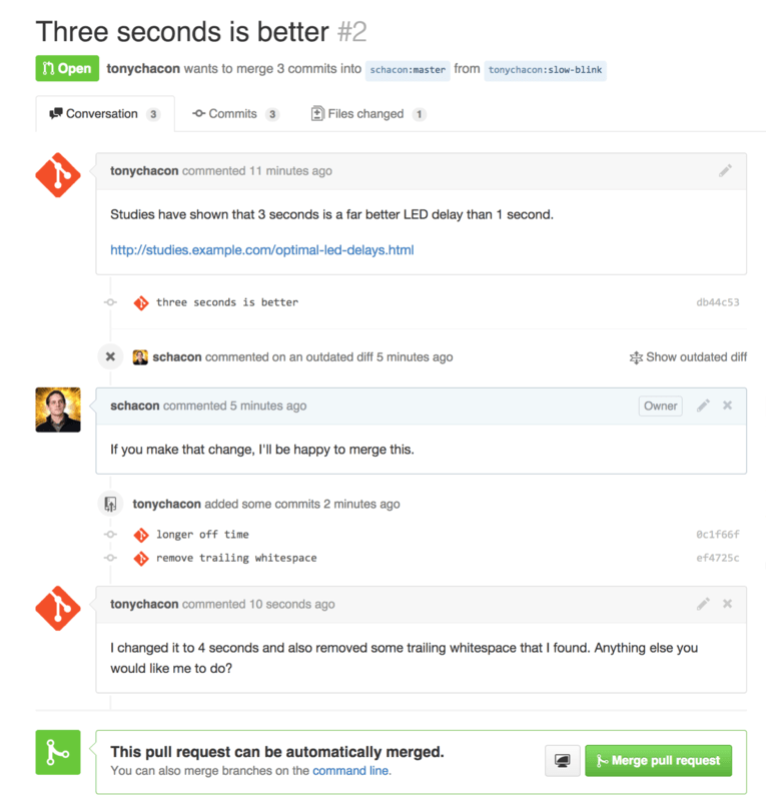

如果你点开拉取请求的“Files Changed”（更改的文件）选项卡，你将会看到“整理过的”差异表 —— 也就是这个分支被合并到主分支之后将会产生的所有改动，其实就是`git diff master...<分支名>`命令的执行结果。

你还会注意到，GitHub 会检查你的拉取请求是否能直接合并，如果可以，将会提供一个按钮来进行合并操作。这个按钮只在你对版本库有写入权限并且可以进行简洁合并时才会显示。你点击后 GitHub 将做出一个“非快进式”（non-fast-forward）合并，即使这个合并能够快进式（fast-forward）合并，GitHub 依然会创建一个合并提交。

如果你需要，你还可以将分支拉取并在本地合并。如果你将这个分支合并到 master 分支中并推送到 GitHub，这个拉取请求会被自动关闭。

这就是大部分 GitHub 项目使用的工作流程。创建分支，基于分支创建拉取请求，进行讨论，根据需要继续在分支上进行修改，最终关闭或合并拉取请求。

#### 2.拉取请求的进阶用法

##### 2.1 将拉取请求制作成补丁

##### 2.2 与上游保持同步

如果你的拉取请求由于过时或其他原因不能干净地合并，你需要进行修复才能让维护者对其进行合并。你有两种方法来解决这个问题。你可以把你的分支变基到目标分支中去（通常是你派生出的版本库中的 master 分支），或者你可以合并目标分支到你的分支中去。

GitHub 上的大多数的开发者会使用后一种方法，基于我们在上一节提到的理由：我们最看重的是历史记录和最后的合并，变基除了给你带来看上去简洁的历史记录，只会让你的工作变得更加困难且更容易犯错。

如果你想要合并目标分支来让你的拉取请求变得可合并，你需要将源版本库添加为一个新的远端，并从远端抓取内容，合并主分支的内容到你的分支中去，修复所有的问题并最终重新推送回你提交拉取请求使用的分支。

在这个例子中，我们再次使用之前的 “tonychacon” 用户来进行示范，源作者提交了一个改动，使得拉取请求和它产生了冲突。现在来看我们解决这个问题的步骤。

```bash
# 将源版本库添加为一个远端，并命名为“upstream”（上游）
$ git remote add upstream https://github.com/schacon/blink
# 从远端抓取最新的内容
$ git fetch upstream 
# 将该仓库的主分支的内容合并到你的分支中
$ git merge upstream/master 
# 修复产生的冲突
$ vim blink.ino 
$ git add blink.ino
$ git commit
# 再推送回同一个分支
$ git push origin slow-blink
```

你完成了上面的步骤后，拉取请求将会自动更新并重新检查是否能干净的合并。

##### 2.3 参考

所有的拉取请求和议题在项目中都会有一个独一无二的编号。举个例子，你无法同时拥有 3 号拉取请求和 3 号议题。如果你想要引用任何一个拉取请求或议题，你只需要在提交或描述中输入`#<编号>`即可。你也可以指定引用其他版本库的议题或拉取请求，如果你想要引用其他人对该版本库的“Fork”中的议题或拉取请求，输入`用户名#<编号>`，如果在不同的版本库中，输入`用户名/版本库名#<编号>`。

我们来看一个例子。假设我们对上个例子中的分支进行了变基，并为此创建一个新的拉取请求，现在我们希望能在新的拉取请求中引用旧的拉取请求。我们同时希望引用一个派生出的项目中的议题和一个完全不同的项目中的议题。

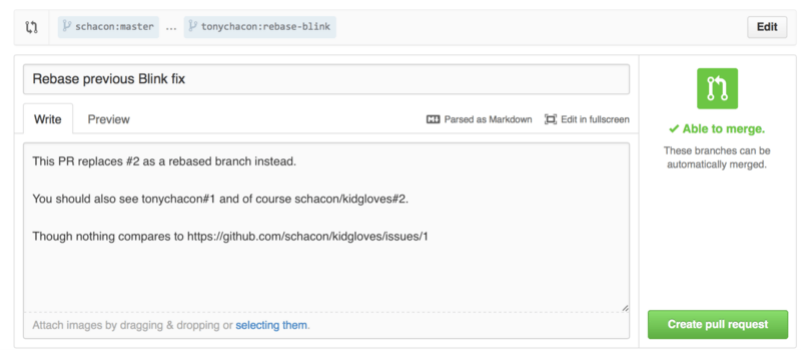

当我们提交了这个拉取请求，我们将会看到以上内容被渲染成这样：

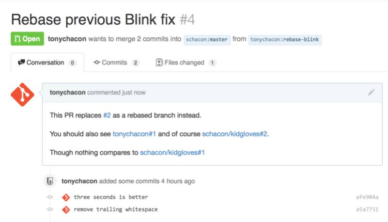

你会注意到完整的 GitHub 地址被简化了，只留下了必要的信息。

如果 Tony 回去关闭了源拉取请求，我们可以看到一个被引用的提示，GitHub 会自动的反向追踪事件并显示在拉取请求的时间轴上。这意味着任何查看这个拉取请求的人可以轻松地访问新的拉取请求。

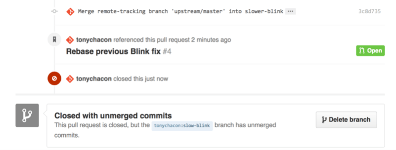

除了议题编号外，你还可以通过使用提交的 SHA-1 来引用提交。你必须完整的写出 40 位长的 SHA-1，GitHub会在评论中自动地产生指向这个提交的链接。同样的，你可以像引用议题一样对派生的项目中的提交或者其他项目中的提交进行引用。

#### 3.GitHub风格的Markdown

对于在 GitHub 中绝大多数文本框中能够做到的事，引用其他议题只是个开始。在议题和拉取请求的描述，评论和代码评论还有其他地方，都可以使用“GitHub 风格的 Markdown”。Markdown 可以让你输入纯文本，但是渲染出丰富的内容。

GitHub 风格的 Markdown 增加了一些基础的 Markdown 中做不到的东西。它在创建拉取请求和议题中的评论和描述时十分有用。

第一个 GitHub 专属的 Markdown 功能，特别是用在拉取请求中，就是任务列表。一个任务列表可以展示出一系列你想要完成的事情，并带有复选框。把它们放在议题或拉取请求中时，通常可以展示你想要完成的事情。

你可以这样创建一个任务列表：

```bash
- [X] 编写代码
- [ ] 编写所有测试程序
- [ ] 为代码编写文档
```

如果我们将这个列表加入拉取请求或议题的描述中，它将会被渲染成：

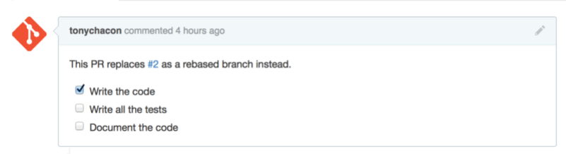

在拉取请求中，任务列表经常被用来在合并之前展示这个分支将要完成的事情。最酷的地方就是，你只需要点击复选框，就能更新评论 —— 你不需要直接修改 Markdown。

不仅如此，GitHub 还会将你在议题和拉取请求中的任务列表整理起来集中展示。举个例子，如果你在一个拉取请求中有任务清单，你将会在所有拉取请求的总览页面上看到它的进度。这使得人们可以把一个拉取请求分解成不同的小任务，同时便于其他人了解分支的进度。

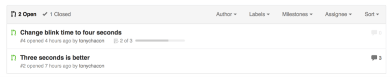

当你在实现一个任务的早期就提交拉取请求，并使用任务清单追踪你的进度，这个功能会十分的有用。

#### 4.保持更新

当你派生了一个 GitHub 仓库之后，你的仓库（即你的“派生”）会独立于原仓库而独立。特别地，当原仓库有新的提交时，GitHub 会通知你：

```bash
This branch is 5 commits behind progit:master.
（本分支落后 progit:master 5 个提交。）
```

但你的 GitHub 仓库不会被 GitHub 自动更新，这件事必须由你自己来做。还好，这事儿很简单。

第一种方法无需配置。例如，若你从 https://github.com/progit/progit2.git 派生了项目，你可以像这样更新你的 master 分支：

```bash
# 如果在另一个分支上，就切换到 master
$ git checkout master
# 从 https://github.com/progit/progit2.git 抓取更改后合并到 master
$ git pull https://github.com/progit/progit2.git
# 将 master 分支推送到 origin
$ git push origin master
```

这虽然可行，但每次都要输入从哪个 URL 抓取有点麻烦。你可以稍微设置一下来自动完成它：

```bash
# 添加源仓库并取一个名字，这里叫它 progit
$ git remote add progit https://github.com/progit/progit2.git
# 将 master 分支设置为从 progit 远端抓取
$ git branch --set-upstream-to=progit/master master
# 将默认推送仓库设置为 origin
$ git config --local remote.pushDefault origin
```

搞定之后，工作流程为更加简单：

```bash
$ git checkout master
$ git pull
$ git push
```

## 3.维护项目

### 3.1 创建新的版本库

让我们创建一个版本库来分享我们的项目。通过点击面板右侧的 “New repository” 按钮，或者顶部工具条你用户名旁边的 + 按钮来开始我们的旅程。

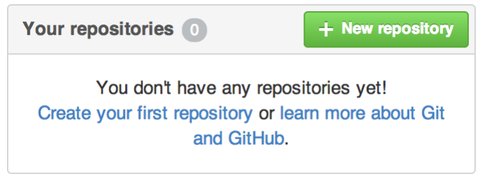

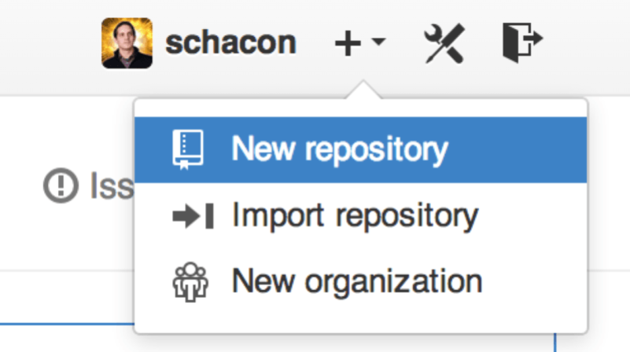

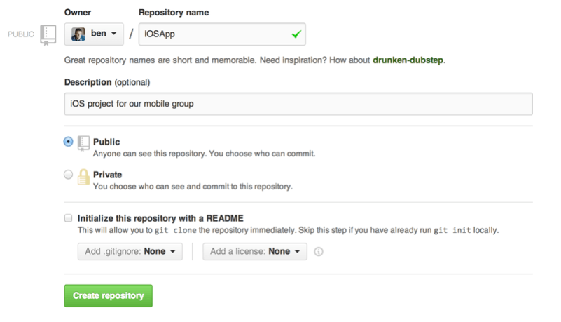

这里除了一个你必须要填的项目名，其他字段都是可选的。现在只需要点击 “Create Repository” 按钮，你就在 GitHub 上拥有了一个以`<user>/<project_name>`命名的新仓库了。

现在你的项目就托管在 GitHub 上了，你可以把 URL 给任何你想分享的人。GitHub 上的项目可通过 HTTP 或 SSH 访问，HTTPS 为`https://github.com/<user>/<project_name>`，SSH 为`git@github.com:<user>/<project_name>`。Git 可以通过以上两种 URL 进行抓取和推送，但是用户的访问权限又因连接时使用的证书不同而异。

> 通常对于公开项目可以优先分享基于 HTTPS 的 URL，因为用户克隆项目不需要有一个 GitHub 帐号。如果你分享 SSH URL，用户必须有一个帐号并且上传 SSH 密钥才能访问你的项目。

### 3.2 添加合作者

如果你想与他人合作，并想给他们提交的权限，你需要把他们添加为 “Collaborators”。如果 Ben，Jeff，Louise 都在 GitHub 上注册了，你想给他们推送的权限，你可以将他们添加到你的项目。这样做会给他们 “推送” 权限，就是说他们对项目和 Git 版本库都有读写的权限。

点击边栏底部的 “Settings” 链接。

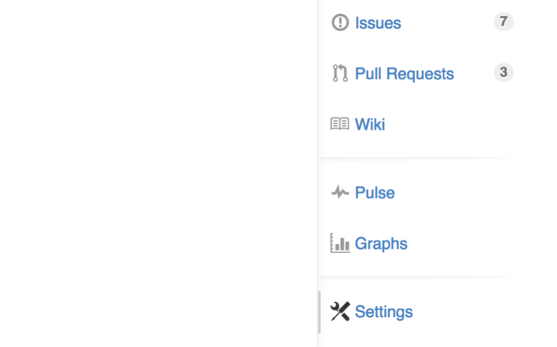

然后从左侧菜单中选择 “Collaborators” 。然后，在输入框中填写用户名，点击 “Add collaborator” 如果你想授权给多个人，你可以多次重复这个步骤。如果你想收回权限，点击他们同一行右侧的 “X”

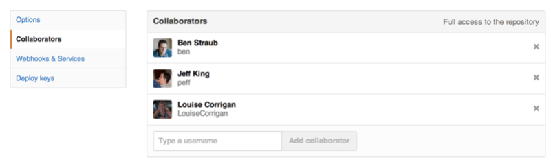

### 3.3 管理合并请求

合并请求可以来自仓库副本的一个分支，或者同一仓库的另一个分支。唯一的区别是 fork 过来的通常是和你不能互相推送的人，而内部的推送通常都可以互相访问。

作为例子，假设你是 “tonychacon” ，你创建了一个名为 “fade” 的 Arduino 项目。

#### 1.邮件通知

有人来修改了你的代码，给你发了一个合并请求。你会收一封关于合并请求的提醒邮件：

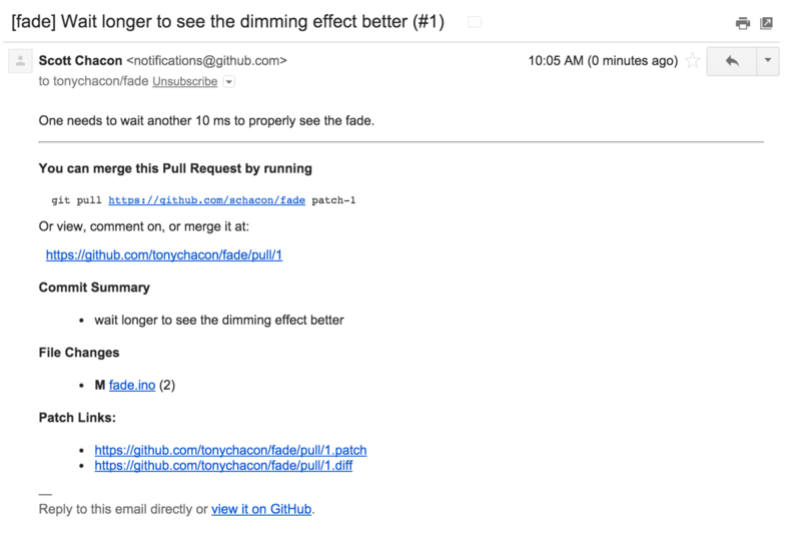

关于这个邮件有几个要注意的地方。它会给你一个小的变动统计结果 — 一个包含合并请求中改变的文件和改变了多少的列表。它还给你一个 GitHub 上进行合并请求操作的链接。还有几个可以在命令行使用的 URL。

如果你注意到`git pull <url> patch-1`这一行，这是一种合并远程分支的简单方式，无需必须添加一个远程分支。如果你愿意，你可以创建并切换到一个主题分支，然后运行这个命令把合并请求合并进来。

还有一些有趣的 URL，像 .diff 和 .patch ，就像你猜的那样，它们提供 diff 和 patch 的标准版本。你可以技术性地用下面的方法合并“合并请求”：

```bash
$ curl https://github.com/tonychacon/fade/pull/1.patch | git am
```

#### 2.在合并请求上进行合作

每次有人在合并请求上发表了评论，你都会收到邮件，通知你哪里发生了改变。邮件里面包含一个链接，指向改变的位置，你可以直接在邮件中回复，相当于在合并请求上发表评论。

一旦代码符合了你的要求，你想把它合并进来，你可以把代码拉取下来在本地进行合并，也可以用我们之前提到过的`git pull <url> <branch>`语法，或者把 fork 添加为一个 remote，然后进行抓取和合并。

对于很琐碎的合并，你也可以用 GitHub 网站上的 “Merge” 按钮。它会做一个 “non-fast-forward” 合并，即使可以快进（fast-forward）合并也会产生一个合并提交记录。

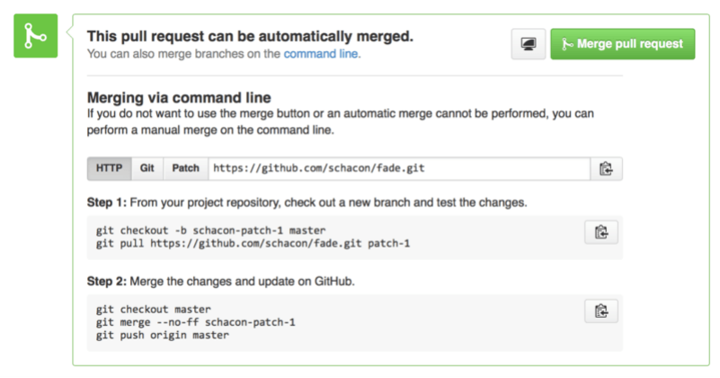

如果你决定不合并它，你可以把合并请求关掉，开启合并请求的人会收到通知。

#### 3.合并请求引用

如果你正在处理许多合并请求，不想添加一堆 remote 或者每次都要做一次拉取，这里有一个可以在 GitHub 上用的小技巧。

实际上 GitHub 在服务器上把合并请求分支视为一种 “假分支”。默认情况下你克隆时不会得到它们，但它们还是隐式地存在，你可以很容易地访问到它们。

为了展示这个，我们要用到一个叫做`ls-remote`的低级命令（通常被叫做 “plumbing”，我们会在【底层命令与上层命令】读到更多相关内容）。这个命令在日常 Git 操作中基本不会用到，但在显示服务器上有哪些引用（reference）时很管用。

如果在我们之前用过的 “blink” 版本库上使用这个命令，我们会得到一个版本库里所有的分支，标签和其它引用（reference）的列表。

```bash
$ git ls-remote https://github.com/schacon/blink
10d539600d86723087810ec636870a504f4fee4d    HEAD
10d539600d86723087810ec636870a504f4fee4d    refs/heads/master
6a83107c62950be9453aac297bb0193fd743cd6e    refs/pull/1/head
afe83c2d1a70674c9505cc1d8b7d380d5e076ed3    refs/pull/1/merge
3c8d735ee16296c242be7a9742ebfbc2665adec1    refs/pull/2/head
15c9f4f80973a2758462ab2066b6ad9fe8dcf03d    refs/pull/2/merge
a5a7751a33b7e86c5e9bb07b26001bb17d775d1a    refs/pull/4/head
31a45fc257e8433c8d8804e3e848cf61c9d3166c    refs/pull/4/merge
```

当然，如果你在你自己的版本库或其它你想检查的远程版本库中使用`git ls-remote origin`，它会显示相似的内容。

如果版本库在 GitHub 上并且有打开的合并请求，你会得到一些以 refs/pull/ 开头的引用。它们实际上是分支，但因为它们不在 refs/heads/ 中，所以正常情况下你克隆时不会从服务器上得到它们 ——抓取过程正常情况下会忽略它们。

每个合并请求有两个引用——其中以 /head 结尾的引用指向的提交记录与合并请求分支中的最后一个提交记录是同一个。所以如果有人在我们的版本库中开启了一个合并请求，他们的分支叫做 bug-fix，指向 a5a775 这个提交记录，那么在我们的版本库中我们没有 bug-fix 分支（因为那是在他们的 fork 中），但我们可以有一个 pull/<pr#>/head 指向 a5a775。这意味着我们可以很容易地拉取每一个合并请求分支而不用添加一堆远程仓库。

现在，你可以像直接抓取引用一样抓取那些分支或提交。

```bash
$ git fetch origin refs/pull/958/head
From https://github.com/libgit2/libgit2
 * branch            refs/pull/958/head -> FETCH_HEAD
```

这告诉 Git：“连接到 origin 这个 remote，下载名字为 refs/pull/958/head 的引用。” Git 高高兴兴去执行，下载构建那个引用需要的所有内容，然后把指针指向 .git/FETCH_HEAD 下面你想要的提交记录。然后你可以用`git merge FETCH_HEAD`把它合并到你想进行测试的分支，但那个合并的提交信息看起来有点怪。然而，如果你需要审查一大批合并请求，这样操作会很麻烦。

还有一种方法可以抓取所有的合并请求，并且在你连接到远程仓库的时候保持更新。用你最喜欢的编辑器打开 .git/config ，查找 origin 远程仓库。看起来差不多像下面这样：

```bash
[remote "origin"]
    url = https://github.com/libgit2/libgit2
    fetch = +refs/heads/*:refs/remotes/origin/*
```

以 fetch = 开头的行是一个 “refspec.” 它是一种把 remote 的名称映射到你本地 .git 目录的方法。这一条（就是上面的这一条）告诉 Git，“remote 上 refs/heads 下面的内容在我本地版本库中都放在 refs/remotes/origin”，你可以把这一段修改一下，添加另一个 refspec：

```bash
[remote "origin"]
    url = https://github.com/libgit2/libgit2.git
    fetch = +refs/heads/*:refs/remotes/origin/*
    fetch = +refs/pull/*/head:refs/remotes/origin/pr/*
```

最后一行告诉 Git：“所有看起来像 refs/pull/123/head 的引用应该在本地版本库像 refs/remotes/origin/pr/123 一样存储” 现在，如果你保存那个文件，执行`git fetch`：

```bash
$ git fetch
# …
 * [new ref]         refs/pull/1/head -> origin/pr/1
 * [new ref]         refs/pull/2/head -> origin/pr/2
 * [new ref]         refs/pull/4/head -> origin/pr/4
# …
```

现在所有的合并请求在本地像分支一样展现，它们是只读的，当你执行抓取时它们也会更新。这让在本地测试合并请求中的代码变得超级简单：

```bash
$ git checkout pr/2
Checking out files: 100% (3769/3769)，done.
Branch pr/2 set up to track remote branch pr/2 from origin.
Switched to a new branch 'pr/2'
```

你的鹰眼系统会发现在 refspec 的 remote 部分的结尾有个 head 。在 GitHub 那边也有一个 refs/pull/#/merge 引用，它代表的是如果你在网站上按了 “merge” 按钮对应的提交记录。这甚至让你可以在按按钮之前就测试这个合并。

#### 4.合并请求之上的合并请求

你不仅可以在主分支或者说 master 分支上开启合并请求，实际上你可以在网络上的任何一个分支上开启合并请求。其实你甚至可以在另一个合并请求上开启一个合并请求。

如果你看到一个合并请求在向正确的方向发展，然后你想在这个合并请求上做一些修改或者你不太确定这是个好主意，或者你没有目标分支的推送权限，你可以直接在合并请求上开启一个合并请求。

当你开启一个合并请求时，在页面的顶端有一个框框显示你要合并到哪个分支和你从哪个分支合并过来的。如果你点击那个框框右边的 “Edit” 按钮，你不仅可以改变分支，还可以选择哪个 fork。

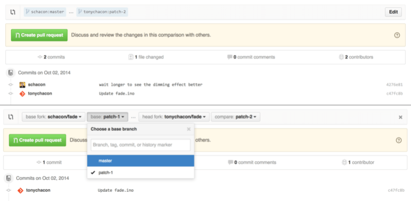

### 3.4 提醒和通知

GitHub 内置了一个很好的通知系统，当你需要与别人或别的团队交流时用起来很方便。在任何评论中你可以先输入一个 @ ，系统会自动补全项目中合作者或贡献者的名字和用户名。

### 3.5 通知页面

当我们在这提到特指 GitHub 的 “notifications” ，指的是当 GitHub 上有事件发生时，它通知你的方式，这里有几种不同的方式来配置它们。如果你打开配置页面的 “Notification center” 标签，你可以看到一些选项。

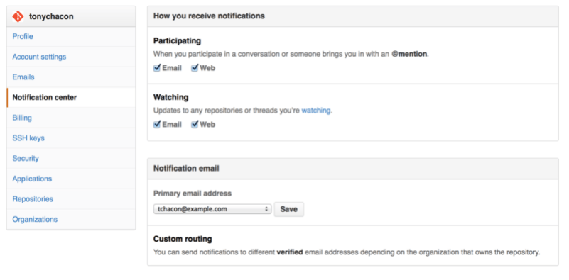

有两个选项，通过“邮件（Email）”和通过“网页（Web）”，你可以选用一个或者都不选或者都选。

### 3.6 网页通知

网页通知只在 GitHub 上存在，你也只能在 GitHub 上查看。如果你打开了这个选项并且有一个你的通知，你会在你屏幕上方的通知图标上看到一个小蓝点。参见【通知中心】。

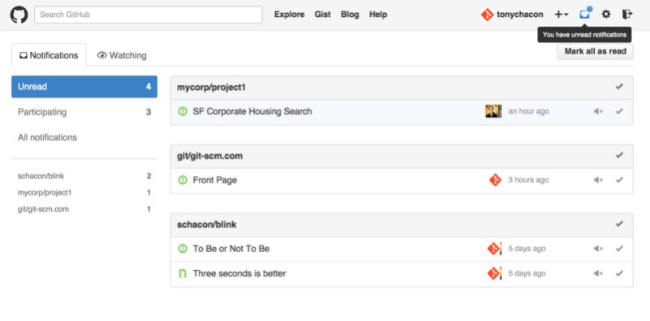

### 3.7 邮件通知

邮件通知是你处理 GitHub 通知的另一种方式。如果你打开这个选项，每当有通知时，你会收到一封邮件。GitHub 在发送给你的邮件头中附带了很多元数据，这对于设置过滤器和邮件规则非常有帮助。

举个例子，我们来看一看在 新的合并请求的邮件通知. 中发给 Tony 的一封真实邮件的头部，我们会看到下面这些：

```bash
To: tonychacon/fade <fade@noreply.github.com>
Message-ID: <tonychacon/fade/pull/1@github.com>
Subject: [fade] Wait longer to see the dimming effect better (#1)
X-GitHub-Recipient: tonychacon
List-ID: tonychacon/fade <fade.tonychacon.github.com>
List-Archive: https://github.com/tonychacon/fade
List-Post: <mailto:reply+i-4XXX@reply.github.com>
List-Unsubscribe: <mailto:unsub+i-XXX@reply.github.com>，...
X-GitHub-Recipient-Address: tchacon@example.com
```

这里有一些有趣的东西。如果你想高亮或者转发这个项目甚至这个合并请求相关的邮件，Message-ID 中的信息会以`<user>/<project>/<type>/<id>`的格式展现所有的数据。例如，如果这是一个问题（issue），那么`<type>`字段就会是 “issues” 而不是 “pull”。

List-Post 和 List-Unsubscribe 字段表示如果你的邮件客户端能够处理这些，那么你可以很容易地在列表中发贴或取消对这个相关帖子的订阅。那会很有效率，就像在页面中点击静音按钮或在问题/合并请求页面点击 “Unsubscribe” 一样。

值得注意的是，如果你同时打开了邮件和网页通知，那么当你在邮件客户端允许加载图片的情况下阅读邮件通知时，对应的网页通知也将会同时被标记为已读。

### 3.8 README

README 文件，可以是几乎任何 GitHub 可以识别的格式。例如，它可以是 README ，README.md，README.asciidoc。如果 GitHub 在你的版本库中找到 README 文件，会把它在项目的首页渲染出来。

很多团队在这个文件里放版本库或项目新人需要了解的所有相关的信息。它一般包含这些内容：

• 该项目的作用

• 如何配置与安装

• 有关如何使用和运行的例子

• 项目的许可证

• 如何向项目贡献力量

因为 GitHub 会渲染这个文件，你可以在文件里植入图片或链接让它更容易理解。

### 3.9 贡献 CONTRIBUTING

另一个 GitHub 可以识别的特殊文件是 CONTRIBUTING 。如果你有一个任意扩展名的 CONTRIBUTING 文件，当有人开启一个合并请求时 GitHub 会显示：

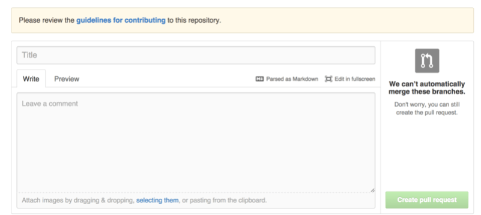

这个的作用就是你可以在这里指出对于你的项目开启的合并请求你想要的／不想要的各种事情。这样别人在开启合并请求之前可以读到这些指导方针。

### 3.10 项目管理

#### 1.改变默认分支

如果你想用 “master” 之外的分支作为你的默认分支，其他人将默认会在这个分支上开启合并请求或进行浏览，你可以在你版本库的设置页面的 "options" 标签下修改。


简单地改变默认分支下拉列表中的选项，它就会作为所有主要操作的默认分支，他人进行克隆时该分支也将被默认检出。

#### 2.移交项目

如果你想把一个项目移交给 GitHub 中的另一个人或另一个组织，还是设置页面的这个 “options” 标签下有一个 “Transfer ownership” 选项可以用来干这个。

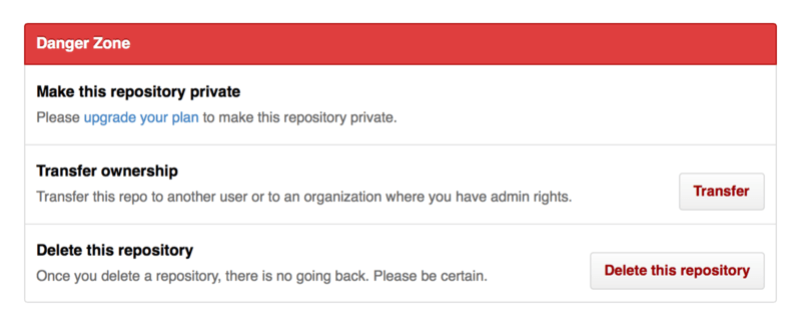

当你正准备放弃一个项目且正好有别人想要接手时，或者你的项目壮大了想把它移到一个组织里时，这就管用了。

这么做不仅会把版本库连带它所有的关注者和星标数都移到另一个地方，它还会将你的 URL 重定向到新的位置。它也重定向了来自 Git 的克隆和抓取，而不仅仅是网页端请求。

## 4.管理组织

 除了个人帐户之外，GitHub 还提供被称为组织（Organizations）的帐户。组织账户和个人账户一样都有一个用于存放所拥有项目的命名空间，但是许多其他的东西都是不同的。组织帐户代表了一组共同拥有多个项目的人，同时也提供一些工具用于对成员进行分组管理。通常，这种账户被用于开源群组（例如：“perl”或者 “rails”），或者公司（例如：“google”或者“twitter”）。

### 4.1 组织的基本知识

我们可以很简单地创建一个组织，只需要点击任意 GitHub 页面右上角的 “+” 图标，在菜单中选择 “New organization” 即可。

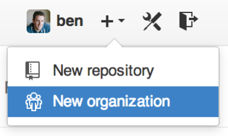

首先你必须提供组织的名称和组织的主要联系邮箱。然后，如果你希望的话，也可以邀请其他用户作为共同拥有人。

完成以上步骤后，你就会拥有一个全新的组织。类似于个人帐户，如果组织的所有内容都是开源的，那么你就可以免费使用这个组织。

作为一个组织的拥有者，当你在派生一个版本库的时候，你可以选择把它派生到你的组织的命名空间内。当你新建版本库时，你可以把它存放到你的个人帐户或你拥有的组织内。同时，你也会自动地“关注”所有这些组织内的新版本库。

就像头像，你可以为你的组织上传头像，使它更个性化。同时，也和个人帐户类似，组织会有一个着陆页（landing page），用于列出该组织所有的版本库，并且该页面可供所有人浏览。

下面我们来说一些组织和个人帐户不同的地方。

### 4.2 团队

组织使用团队（Teams）来管理成员，团队就是组织中的一组个人账户和版本库，以及团队成员对这些版本库的访问权限。

例如，假设你的公司有三个版本库：frontend、backend 和 deployscripts。你会希望你的 HTML/CSS/Javascript 开发者有 frontend 或者 backend 的访问权限，操作人员有 backend 和 deployscripts 的访问权限。团队让这个任务变得更简单，而不用为每个版本库管理它的协作者。

组织页面主要由一个面板（dashboard）构成，这个仪表盘包含了这个组织内的所有版本库，用户和团队。

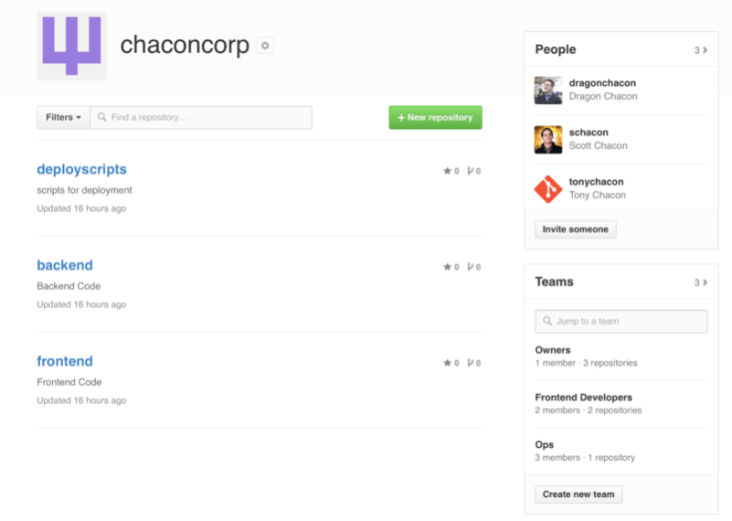

你可以点击组织页面右边的团队侧边栏（Teams）来管理你的团队。点击之后，你会进入一个新页面，在这里你可以添加新成员和版本库到团队中，或者管理团队的访问权限和其它设置。每个团队对于版本库可以有只读、读写和管理三种权限。你可以通过点击在 团队页面 内的 “Settings” 按钮更改相应权限等级。

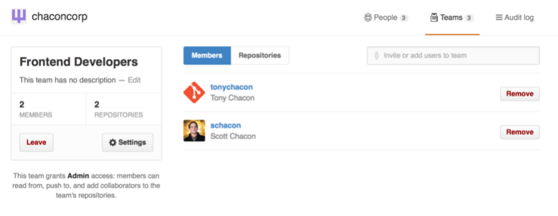

当你邀请一个用户加入团队，该用户会收到一封通知他被邀请的邮件。

除此之外，团队也类似于个人帐户，有 @mentions（例如：@acmecorp/frontend）的功能，不同之处就在于被提及的团队内 所有 成员都会成为这个话题的订阅者。当你希望得到团队中某个人的关注，又不知道具体应该问谁的时候，这个功能就显得很有帮助。

一个用户可以加入任意数量的团队，所以别把自己局限于拥有访问控制的团队。对于某一类课题，像 ux, css 或者 refactoring 这样有着特殊关注点的团队就显得很有帮助，而像 legal 和 colorblind 这样的就完全是针对它们各自领域的。

### 4.3 审计日志

组织的拥有者还可以访问组织中发生的事情的所有信息。在 Audit Log 标签页有整个组织的日志，你可以看到谁在世界上哪个地方做了什么事。

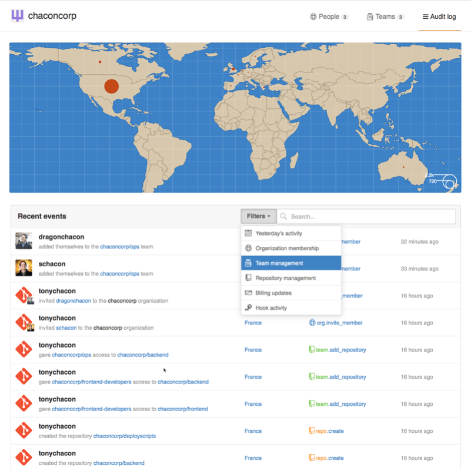

你也可以通过选定某一类型的事件、某个地方、某个人对日志进行过滤。

## 5.脚本

### 5.1 服务与钩子

#### 1.服务

首先我们来看一下服务。钩子与服务整合都可以在仓库的设置区块中找到，就在我们之前添加协作者与改变项目的默认分支的地方。在 “Webhooks and Services” 标签下：

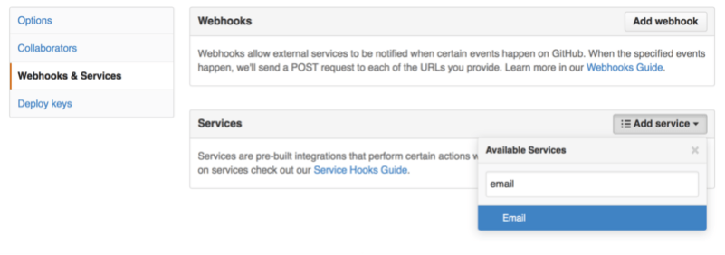

有许多可以选择的服务，大多数是整合到其他的商业与开源系统中。它们中的大多数是为了整合持续集成服务、BUG 与问题追踪系统、聊天室系统与文档系统。我们将会通过设置一个非常简单的例子来介绍。如果从 “Add Service” 选择 “email”：

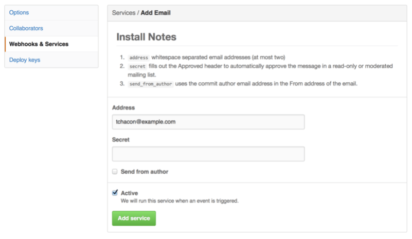

在本例中，如果我们点击 “Add service” 按钮，每次有人推送内容到仓库时，指定的电子邮件地址都会收到一封邮件。服务可以监听许多不同类型的事件，但是大多数只监听推送事件然后使用那些数据做一些事情。

如果有一个正在使用的系统想要整合到 GitHub，应当先检查这里看有没有已有的可用的服务整合。例如，如果正使用 Jenkins 来测试你的代码库，当每次有人推送到你的仓库时你可以启用 Jenkins 内置的整合启动测试运行。

#### 2.钩子

如果需要做一些更具体的事，或者想要整合一个不在这个列表中的服务或站点，可以转而使用更通用的钩子系统。GitHub 仓库钩子是非常简单的。指定一个 URL 然后 GitHub 在任一期望的事件发生时就会发送一个 HTTP请求到那个 URL。

通常做这件事的方式是可以设置一个小的 web 服务来监听 GitHub 钩子请求然后使用收到的数据做一些事情。

为了启用一个钩子，点击服务与钩子配置区域中的 “Add webhook” 按钮。

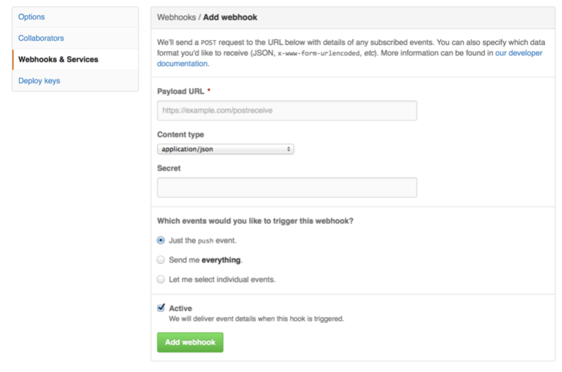

Web 钩子的设置非常简单。大多数情况下只需要输入一个 URL 与一个密钥然后点击 “Add webhook”。有几个选项可以指定在哪个事件时想要 GitHub 发送请求—— 默认的行为是只有当某人推送新代码到仓库的任一分支时的 push 事件获得一个请求。

让我们看一个设置处理 web 钩子的 web 服务的小例子。我们将会使用 Ruby web 框架 Sinatra。假设我们想要在某个特定的人推送到我们的项目的特定分支并修改一个特定文件时得到一封邮件。我们可以相当容易地使用类似下面的代码做到：

```bash
require 'sinatra'
require 'json'
require 'mail'

post '/payload' do
  push = JSON.parse(request.body.read) # parse the JSON

  # gather the data we're looking for
  pusher = push["pusher"]["name"]
  branch = push["ref"]

  # get a list of all the files touched
  files = push["commits"].map do |commit|
    commit['added'] + commit['modified'] + commit['removed']
  end
  files = files.flatten.uniq

  # check for our criteria
  if pusher == 'schacon' &&
     branch == 'ref/heads/special-branch' &&
     files.include?('special-file.txt')

    Mail.deliver do
      from     'tchacon@example.com'
      to       'tchacon@example.com'
      subject  'Scott Changed the File'
      body     "ALARM"
    end
  end
end
```

这里我们拿到一个 GitHub 传送给我们的 JSON 请求然后查找推送者，他们推送到了什么分支以及推送的所有提交都改动了哪些文件。然后我们检查它是否与我们的条件区配，如果匹配则发送一封邮件。

为了开发与测试类似这样的东西，在设置钩子的地方有一个漂亮的开发者控制台。可以看到 GitHub 为那个 webhook 的最后几次请求。对每一个钩子，当它发送后都可以深入挖掘，检测它是否是成功的与请求及回应的消息头与消息体。这使得测试与调试钩子非常容易。

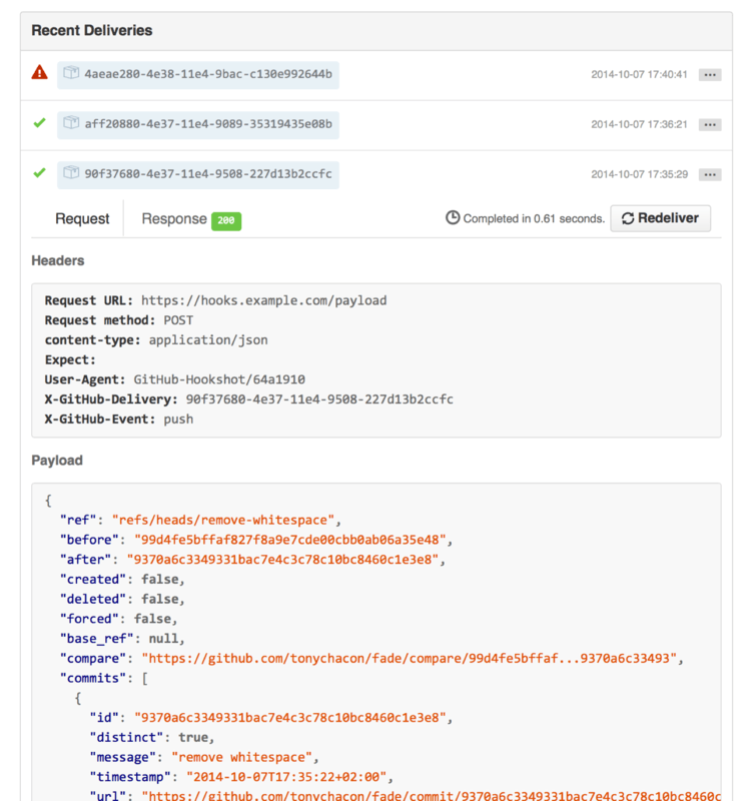

开发者控制台的另一个很棒的功能是可以轻松地重新发送任何请求来测试你的服务。

关于如何编写 web 钩子与所有可监听的不同事件类型的更多信息，请访问在 https://developer.github.com/webhooks/ 的 GitHub 开发者文档。

### 5.2 GitHub API

可以做的最基本的事情是向一个不需要授权的接口上发送一个简单的 GET 请求。该接口可能是一个用户或开源项目的只读信息。例如，如果我们想要知道更多关于名为 “schacon” 的用户信息，我们可以运行类似下面的东西：

```bash
$ curl https://api.github.com/users/schacon
{
  "login": "schacon",
  "id": 70,
  "avatar_url": "https://avatars.githubusercontent.com/u/70",
# …
  "name": "Scott Chacon",
  "company": "GitHub",
  "following": 19,
  "created_at": "2008-01-27T17:19:28Z",
  "updated_at": "2014-06-10T02:37:23Z"
}
```

有大量类似这样的接口来获得关于组织、项目、问题、提交的信息。甚至可以使用 API 来渲染任意 Markdown 或寻找一个 .gitignore 模板。

```bash
$ curl https://api.github.com/gitignore/templates/Java
{
  "name": "Java",
  "source": "*.class

# Mobile Tools for Java (J2ME)
.mtj.tmp/

# Package Files #
*.jar
*.war
*.ear

# virtual machine crash logs, see
https://www.java.com/en/download/help/error_hotspot.xml
hs_err_pid*
"
}
```

### 5.3 在一个问题上评论

如果想要在网站上进行一个操作，如在 Issue 或 Pull Request 上评论，或者想要查看私有内容或与其交互，你需要授权。

这里提供了几种授权方式。你可以使用仅需用户名与密码的基本授权，但是通常更好的主意是使用一个个人访问令牌。可以从设置页的 “Applications” 标签生成访问令牌。

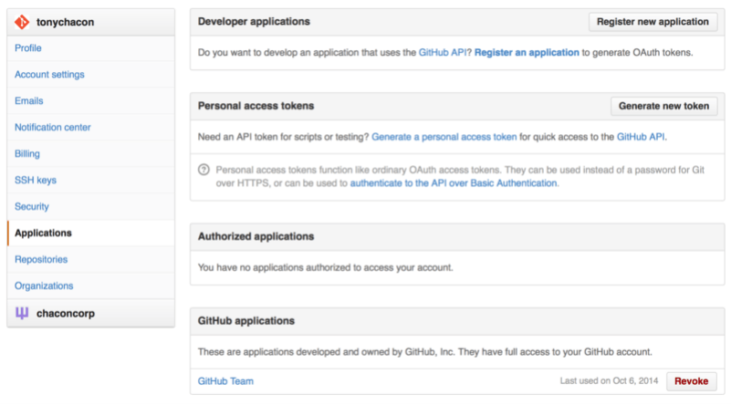

它会询问这个令牌的作用域与一个描述。确保使用一个好的描述信息，这样当脚本或应用不再使用时你会很放心地移除。

GitHub 只会显示令牌一次，所以记得一定要拷贝它。现在可以在脚本中使用它代替使用用户名写密码来授权。

这也会有一个提高频率上限的附加优点。如果没有授权的话，你会被限制在一小时最多发起 60 次请求。如果授权则可以一小时最多发起 5000 次请求。

所以让我们利用它来对我们的其中一个问题进行评论。想要对一个特定问题 Issue #6 留下一条评论。必须使用刚刚生成的令牌作为 Authorization 头信息，发送一个到`repos/<user>/<repo>/issues/<num>/comments`的 HTTP POST 请求。

```bash
$ curl -H "Content-Type: application/json" \
       -H "Authorization: token TOKEN" \
       --data '{"body":"A new comment, :+1:"}' \
       https://api.github.com/repos/schacon/blink/issues/6/comments
{
  "id": 58322100,
  "html_url": "https://github.com/schacon/blink/issues/6#issuecomment-
58322100",
  ...
  "user": {
    "login": "tonychacon",
    "id": 7874698,
    "avatar_url": "https://avatars.githubusercontent.com/u/7874698?v=2",
    "type": "User",
  },
  "created_at": "2014-10-08T07:48:19Z",
  "updated_at": "2014-10-08T07:48:19Z",
  "body": "A new comment, :+1:"
}
```

现在如果进入到那个问题，可以看到我们刚刚发布的评论：

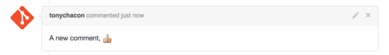

可以使用 API 去做任何可以在网站上做的事情 — 创建与设置里程碑、指派人员到 Issues 与 Pull Requests，创建与修改标签、访问提交数据、创建新的提交与分支、打开关闭或合并 Pull Requests、创建与编辑团队、在 Pull Request 中评论某行代码、搜索网站等等。

### 5.4 修改Pull Request的状态

我们要看最后一个例子在使用拉取请求时非常有用。每一个提交可以有一个或多个与它关联的状态，有 API 来添加与查询状态。

大多数持续集成与测试服务通过测试推送的代码后使用这个 API 来回应，然后报告提交是否通过了全部测试。你也可以使用该接口来检查提交信息是否经过合适的格式化、提交者是否遵循了所有你的贡献准则、提交是否经过有效的签名 — 种种这类事情。

假设在仓库中设置了一个 web 钩子访问一个用来检查提交信息中的 Signed-off-by 字符串的小的 web 服务。

```bash
require 'httparty'
require 'sinatra'
require 'json'

post '/payload' do
  push = JSON.parse(request.body.read) # parse the JSON
  repo_name = push['repository']['full_name']

  # look through each commit message
  push["commits"].each do |commit|

    # look for a Signed-off-by string
    if /Signed-off-by/.match commit['message']
      state = 'success'
      description = 'Successfully signed off!'
    else
      state = 'failure'
      description = 'No signoff found.'
    end

    # post status to GitHub
    sha = commit["id"]
    status_url =
"https://api.github.com/repos/#{repo_name}/statuses/#{sha}"

    status = {
      "state"       => state,
      "description" => description,
      "target_url"  => "http://example.com/how-to-signoff",
      "context"     => "validate/signoff"
    }
    HTTParty.post(status_url,
      :body => status.to_json,
      :headers => {
        'Content-Type'  => 'application/json',
        'User-Agent'    => 'tonychacon/signoff',
        'Authorization' => "token #{ENV['TOKEN']}" }
    )
  end
end
```

在这个 web 钩子处理器中我们浏览刚刚推送上来的每一个提交，在提交信息中查找字符串 Signed-off-by 并且最终使用 HTTP 向`/repos/<user>/<repo>/statuses/<commit_sha>`API 接口发送一个带有状态的 POST 请求。

在本例中可以发送一个状态（success, failure, error）、一个发生了什么的描述信息、 一个用户可以了解更多信息的目标 URL 与一个 “context” 以防一个单独的提交有多个状态。例如，一个测试服务可以提供一个状态与一个类似这样的验证服务也可能提供一个状态 — “context” 字段是用来区别它们的。

如果某人在 GitHub 中打开了一个新的拉取请求并且这个钩子已经设置：

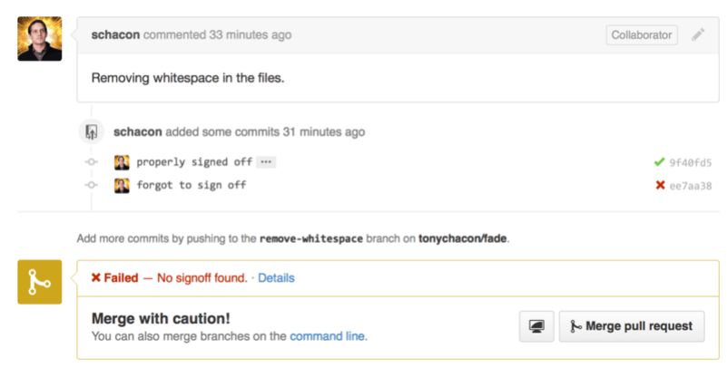

现在可以看到一个小的绿色对勾标记在提交信息中有 “Signed-off-by” 的提交旁边，红色的对勾标记在作者忘记签名的提交旁边。也可以看到 Pull Request 显示在那个分支上的最后提交的状态，如果失败的话会警告你。如果对测试结果使用这个 API 那么就不会不小心合并某些未通过测试的最新提交。

### 5.5 Octokit

尽管我们在这些例子中都是通过 curl 与基本的 HTTP 请求来做几乎所有的事情，还有一些以更自然的方式利用 API 的开源库存在着。在写这篇文章的时候，被支持的语言包括 Go、Objective-C、Ruby 与 .NET。访问 https://github.com/octokit 了解更多相关信息，它们帮你处理了更多 HTTP 相关的内容。

希望这些工具能帮助你自定义与修改 GitHub 来更好地为特定的工作流程工作。关于全部 API 的完整文档与常见任务的指南，请查阅 https://developer.github.com。